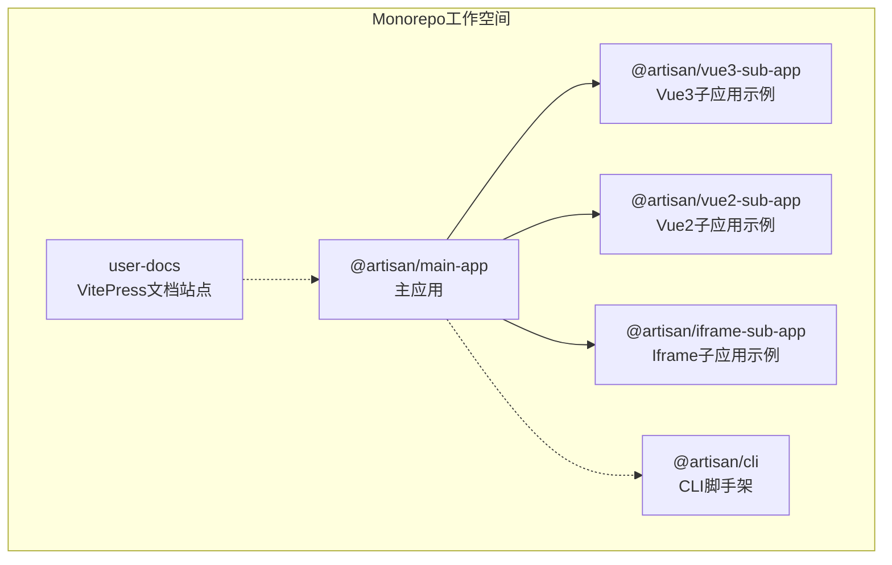
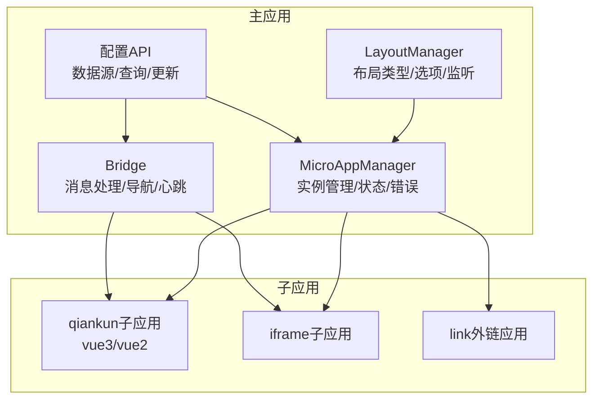
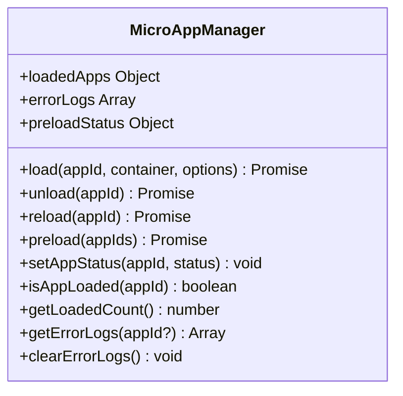
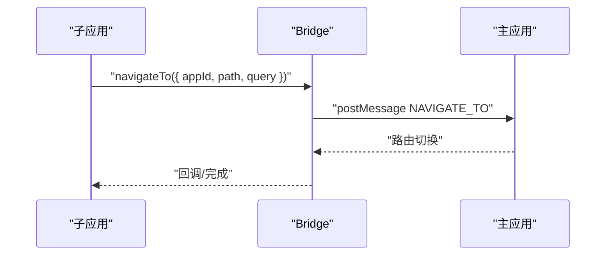
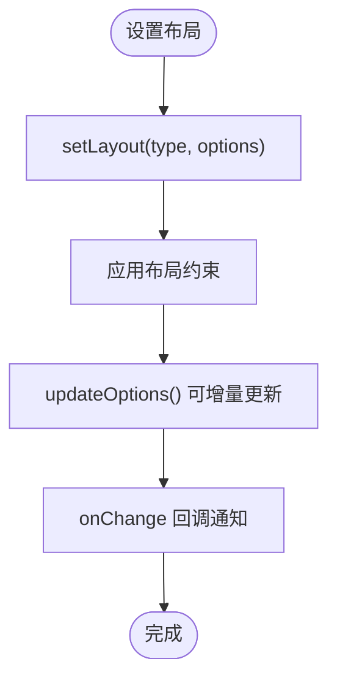
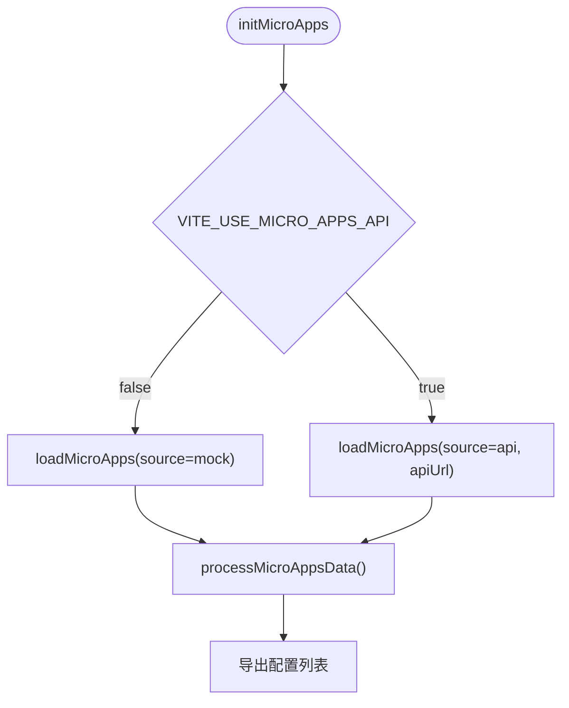
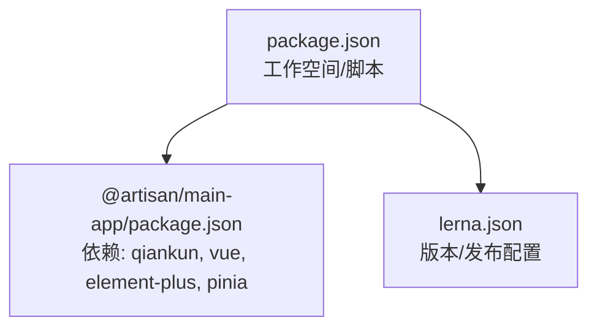

# API参考

<cite>
**本文档引用的文件**
- [README.md](file://README.md)
- [QUICK_START.md](file://QUICK_START.md)
- [SUB_APP_INTEGRATION.md](file://SUB_APP_INTEGRATION.md)
- [DOCUMENTATION_SUMMARY.md](file://DOCUMENTATION_SUMMARY.md)
- [user-docs/api/README.md](file://user-docs/api/README.md)
- [user-docs/api/bridge.md](file://user-docs/api/bridge.md)
- [user-docs/api/micro-app-manager.md](file://user-docs/api/micro-app-manager.md)
- [user-docs/api/config.md](file://user-docs/api/config.md)
- [packages/main-app/src/config/microApps.js](file://packages/main-app/src/config/microApps.js)
- [packages/main-app/src/mock/microApps.js](file://packages/main-app/src/mock/microApps.js)
- [packages/main-app/package.json](file://packages/main-app/package.json)
- [package.json](file://package.json)
- [lerna.json](file://lerna.json)
</cite>

## 目录
1. [简介](#简介)
2. [项目结构](#项目结构)
3. [核心组件](#核心组件)
4. [架构总览](#架构总览)
5. [详细组件分析](#详细组件分析)
6. [依赖关系分析](#依赖关系分析)
7. [性能考量](#性能考量)
8. [故障排查指南](#故障排查指南)
9. [结论](#结论)
10. [附录](#附录)

## 简介
本API参考文档面向Artisan微前端平台的开发者与集成者，系统梳理主应用与子应用之间的通信、微应用生命周期管理、布局管理以及配置管理等核心API。文档基于仓库内的用户文档与源码实现，提供方法签名、参数说明、返回值与典型使用场景，帮助快速定位与解决问题。

## 项目结构
Artisan采用Monorepo架构，核心应用位于packages目录，用户文档位于user-docs目录。主应用负责微应用的加载、卸载、通信与布局管理；子应用通过qiankun或iframe接入；CLI工具用于快速创建子应用。

图表来源
- [package.json:1-52](file://package.json#L1-L52)
- [lerna.json:1-25](file://lerna.json#L1-L25)

章节来源
- [README.md:159-181](file://README.md#L159-L181)
- [package.json:6-9](file://package.json#L6-L9)

## 核心组件
- MicroAppManager：微应用实例管理器，负责加载、卸载、刷新、预加载、状态管理与错误日志。
- Bridge：跨应用通信桥，基于postMessage实现主应用与子应用（含iframe）的消息传递与导航跳转。
- LayoutManager：布局管理器，提供布局类型设置、选项更新与监听变化的能力。
- 配置API：微应用配置的数据结构、查询与更新方法，支持mock与API两种数据源。

章节来源
- [user-docs/api/README.md:14-165](file://user-docs/api/README.md#L14-L165)
- [user-docs/api/README.md:167-325](file://user-docs/api/README.md#L167-L325)
- [user-docs/api/README.md:327-451](file://user-docs/api/README.md#L327-L451)
- [user-docs/api/README.md:453-529](file://user-docs/api/README.md#L453-L529)

## 架构总览
下图展示了主应用与子应用之间的交互关系，包括微应用管理、跨应用通信与布局切换的关键流程。

图表来源
- [user-docs/api/README.md:14-165](file://user-docs/api/README.md#L14-L165)
- [user-docs/api/README.md:167-325](file://user-docs/api/README.md#L167-L325)
- [user-docs/api/README.md:327-451](file://user-docs/api/README.md#L327-L451)
- [user-docs/api/README.md:453-529](file://user-docs/api/README.md#L453-L529)

## 详细组件分析

### MicroAppManager API
- 职责：管理微应用生命周期（加载、卸载、刷新、预加载）、状态控制、错误日志与预加载状态。
- 关键方法：
  - load(appId, container, options)：加载微应用，返回实例与配置。
  - unload(appId)：卸载微应用。
  - reload(appId)：刷新微应用（先卸载再加载）。
  - preload(appIds?)：预加载指定应用或所有配置为true的应用。
  - setAppStatus(appId, status)：设置应用上下线状态，下线时自动卸载。
  - isAppLoaded(appId)：判断应用是否已加载。
  - getLoadedCount()：获取已加载应用数量。
  - getErrorLogs(appId?)：获取错误日志（最多100条）。
  - clearErrorLogs()：清空错误日志。
- 属性：
  - loadedApps：已加载应用的响应式对象。
  - errorLogs：错误日志响应式数组。
  - preloadStatus：预加载状态映射。
- 全局调试：window.__ARTISAN_MICRO_APP_MANAGER__

图表来源
- [user-docs/api/micro-app-manager.md:1-168](file://user-docs/api/micro-app-manager.md#L1-L168)

章节来源
- [user-docs/api/micro-app-manager.md:11-104](file://user-docs/api/micro-app-manager.md#L11-L104)
- [user-docs/api/micro-app-manager.md:131-157](file://user-docs/api/micro-app-manager.md#L131-L157)
- [user-docs/api/micro-app-manager.md:159-168](file://user-docs/api/micro-app-manager.md#L159-L168)

### Bridge API
- 职责：基于postMessage实现主应用与子应用（含iframe）的双向通信，提供导航跳转、Token同步、心跳检测与消息广播。
- 关键方法：
  - on(type, handler)：注册消息处理器。
  - off(type)：移除消息处理器。
  - send(targetWindow, message, targetOrigin?)：发送消息到指定窗口。
  - sendToIframe(iframe, message)：发送消息到iframe。
  - broadcast(message)：广播消息给所有子应用。
  - syncToken(token)：同步token到所有子应用。
  - navigateTo(options)：跳转到子应用。
  - navigateToMain(path, query?)：跳转到主应用。
  - destroy()：销毁bridge。
- 全局暴露：window.__ARTISAN_BRIDGE__（包含navigateTo、navigateToMain、send、on、off）。
- 内置消息类型：NAVIGATE_TO、NAVIGATE_TO_MAIN、REQUEST_TOKEN、TOKEN_RESPONSE、TOKEN_SYNC、PING、PONG、REPORT_HEIGHT、MESSAGE、INIT。

图表来源
- [user-docs/api/bridge.md:107-135](file://user-docs/api/bridge.md#L107-L135)
- [user-docs/api/README.md:240-269](file://user-docs/api/README.md#L240-L269)

章节来源
- [user-docs/api/bridge.md:22-143](file://user-docs/api/bridge.md#L22-L143)
- [user-docs/api/bridge.md:145-158](file://user-docs/api/bridge.md#L145-L158)
- [user-docs/api/bridge.md:159-185](file://user-docs/api/bridge.md#L159-L185)
- [user-docs/api/README.md:310-324](file://user-docs/api/README.md#L310-L324)

### LayoutManager API
- 职责：管理布局类型与选项，支持根据微应用配置自动设置布局，并监听布局变化。
- 布局类型：default、full、embedded、blank。
- 关键方法：
  - setLayout(type, options?)：设置布局类型与选项。
  - updateOptions(options)：更新布局选项。
  - setLayoutFromMicroApp(config)：根据微应用配置设置布局。
  - reset()：重置为默认布局。
  - getLayoutType()：获取当前布局类型。
  - getLayoutOptions()：获取当前布局选项。
  - onChange(callback)：监听布局变化。
  - offChange(callback)：移除监听器。
- 布局约束：不同布局类型对showHeader、showSidebar、showFooter等选项有约束。

图表来源
- [user-docs/api/README.md:347-382](file://user-docs/api/README.md#L347-L382)
- [user-docs/api/README.md:440-450](file://user-docs/api/README.md#L440-L450)

章节来源
- [user-docs/api/README.md:334-450](file://user-docs/api/README.md#L334-L450)

### 配置 API
- 配置结构：包含id、name、entry、activeRule、type、layoutType、layoutOptions、status、version、lastModified、preload、props等字段。
- 数据源：支持mock与API两种模式，通过环境变量VITE_USE_MICRO_APPS_API自动选择。
- 关键方法：
  - initMicroApps(customApiUrl?)：根据环境变量初始化数据源。
  - loadMicroApps(options)：显式指定数据源加载。
  - processMicroAppsData(rawApps)：对原始数据进行布局标准化。
  - getMicroApp(appId)、getCurrentMicroApps()、getOnlineMicroApps()、getMicroAppsByType(type)：查询方法。
  - updateMicroAppConfig(appId, config)：更新内存中的配置。
  - isMicroAppsLoaded()、getDataSource()：状态查询。
- 环境变量：
  - VITE_USE_MICRO_APPS_API：false使用mock，true使用API。
  - VITE_MICRO_APPS_API_URL：后端API地址，默认/api/micro-apps。

图表来源
- [user-docs/api/config.md:60-99](file://user-docs/api/config.md#L60-L99)
- [packages/main-app/src/config/microApps.js:98-105](file://packages/main-app/src/config/microApps.js#L98-L105)

章节来源
- [user-docs/api/config.md:5-28](file://user-docs/api/config.md#L5-L28)
- [user-docs/api/config.md:58-99](file://user-docs/api/config.md#L58-L99)
- [packages/main-app/src/config/microApps.js:54-91](file://packages/main-app/src/config/microApps.js#L54-L91)
- [packages/main-app/src/mock/microApps.js:8-109](file://packages/main-app/src/mock/microApps.js#L8-L109)

## 依赖关系分析
- 主应用依赖qiankun实现微应用加载与生命周期管理，依赖Element Plus、Pinia等生态组件。
- CLI工具用于快速创建子应用，支持vue3、vue2、iframe三种类型。
- Monorepo通过Lerna管理包版本与发布流程。

图表来源
- [package.json:1-52](file://package.json#L1-L52)
- [lerna.json:1-25](file://lerna.json#L1-L25)
- [packages/main-app/package.json:15-35](file://packages/main-app/package.json#L15-L35)

章节来源
- [package.json:10-28](file://package.json#L10-L28)
- [lerna.json:4-18](file://lerna.json#L4-L18)
- [packages/main-app/package.json:15-35](file://packages/main-app/package.json#L15-L35)

## 性能考量
- 预加载：通过MicroAppManager的preload方法对常用应用进行预加载，减少首次访问延迟。
- 热更新检测：利用配置中的lastModified字段进行变更检测，结合预加载提升用户体验。
- 心跳检测：Bridge对iframe应用定期发送PING消息，确保应用健康状态。
- 样式隔离：qiankun自动处理样式隔离，避免全局样式污染；子应用应使用scoped或CSS Modules。

章节来源
- [README.md:79-84](file://README.md#L79-L84)
- [user-docs/api/README.md:149-163](file://user-docs/api/README.md#L149-L163)
- [user-docs/api/README.md:102-122](file://user-docs/api/README.md#L102-L122)

## 故障排查指南
- 子应用无法加载：检查端口占用、entry地址与子应用是否启动。
- 路由跳转失败：确认activeRule与props.routerBase一致，qiankun环境下使用Memory/Abstract路由模式。
- 样式冲突：避免全局样式重置，使用scoped或CSS Modules；Element Plus在独立运行时才加载CSS。
- 跨域问题：iframe与子应用需配置CORS头，主应用与子应用origin需在白名单内。
- 卸载报错：不要直接调用app.unmount()，遵循各框架的卸载规范。

章节来源
- [QUICK_START.md:274-362](file://QUICK_START.md#L274-L362)
- [SUB_APP_INTEGRATION.md:651-795](file://SUB_APP_INTEGRATION.md#L651-L795)

## 结论
本API参考文档系统化梳理了Artisan微前端平台的核心能力：微应用生命周期管理、跨应用通信、布局管理与配置管理。通过明确的方法签名、参数说明与使用示例，开发者可快速集成与扩展平台能力。建议在实际开发中结合配置API的数据源模式与Bridge的origin校验策略，确保系统的稳定性与安全性。

## 附录
- 全局调试对象：window.__ARTISAN_MICRO_APP_MANAGER__、window.__ARTISAN_BRIDGE__、window.__ARTISAN_LAYOUT_MANAGER__。
- 环境变量：VITE_USE_MICRO_APPS_API、VITE_MICRO_APPS_API_URL。
- 端口配置：主应用8080、Vue3子应用7080、Vue2子应用3000、iframe子应用9080。

章节来源
- [user-docs/api/README.md:531-562](file://user-docs/api/README.md#L531-L562)
- [README.md:88-96](file://README.md#L88-L96)
- [README.md:239-247](file://README.md#L239-L247)