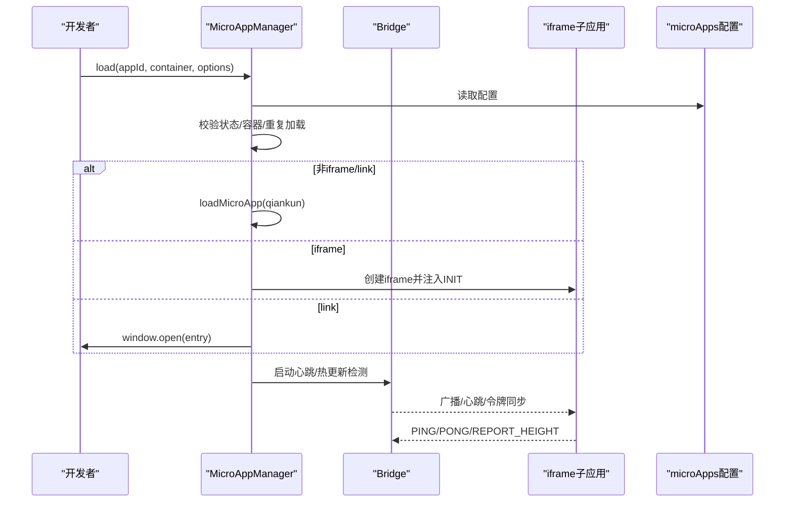
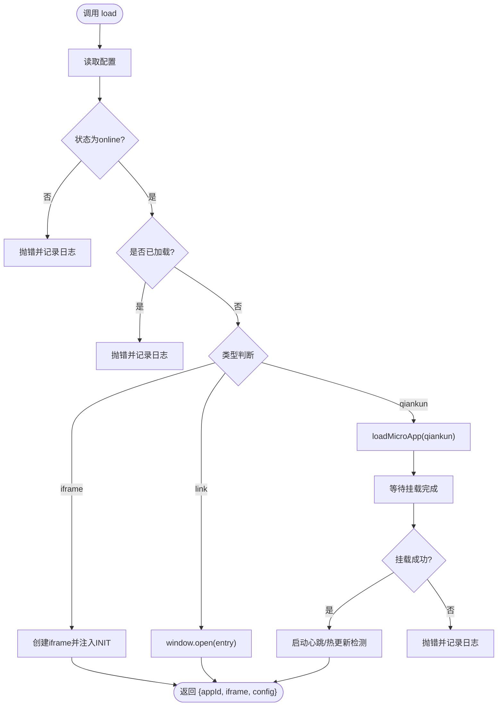
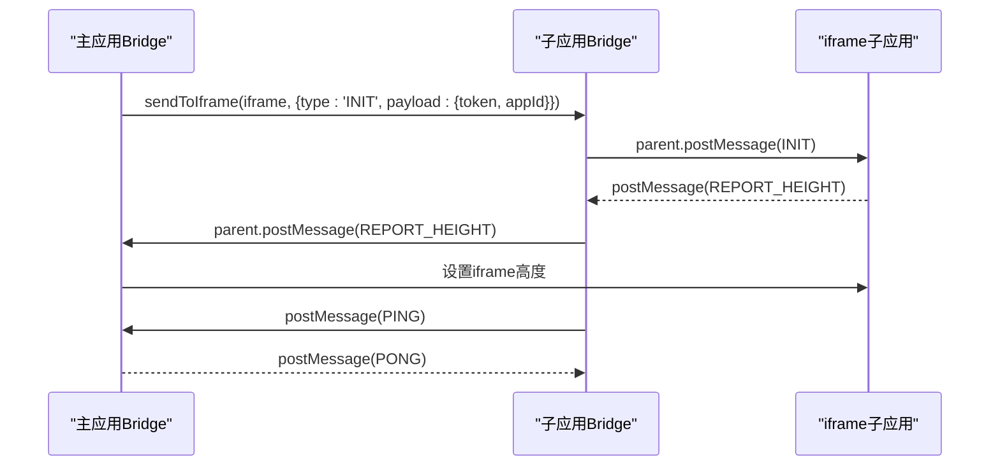
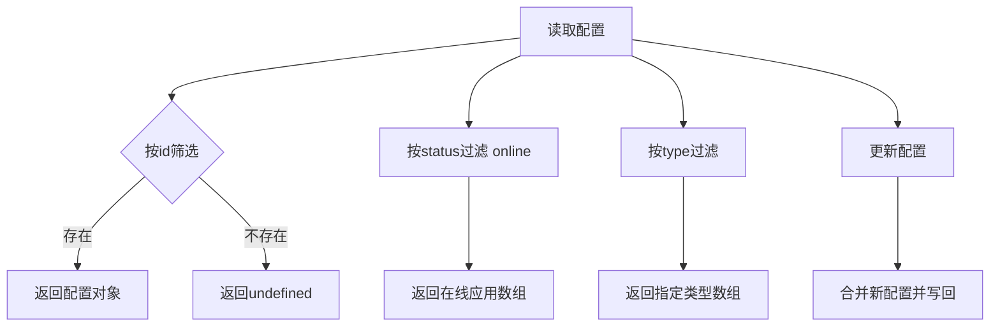
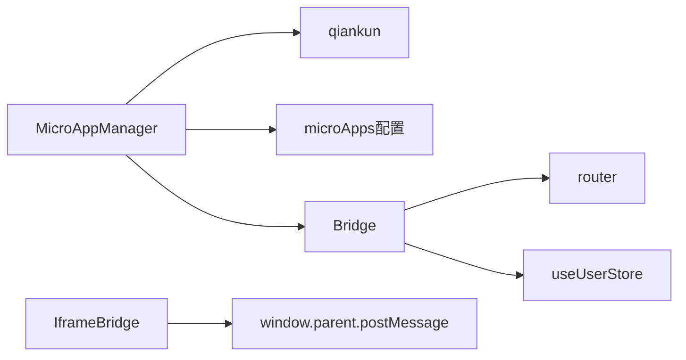

# API参考

<cite>
**本文档引用的文件**
- [packages/main-app/src/core/microAppManager.js](file://packages/main-app/src/core/microAppManager.js)
- [packages/main-app/src/core/bridge.js](file://packages/main-app/src/core/bridge.js)
- [packages/iframe-sub-app/src/bridge.js](file://packages/iframe-sub-app/src/bridge.js)
- [packages/main-app/src/config/microApps.js](file://packages/main-app/src/config/microApps.js)
- [user-docs/api/micro-app-manager.md](file://user-docs/api/micro-app-manager.md)
- [user-docs/api/bridge.md](file://user-docs/api/bridge.md)
- [user-docs/api/config.md](file://user-docs/api/config.md)
</cite>

## 目录
1. [简介](#简介)
2. [项目结构](#项目结构)
3. [核心组件](#核心组件)
4. [架构总览](#架构总览)
5. [详细组件分析](#详细组件分析)
6. [依赖关系分析](#依赖关系分析)
7. [性能考量](#性能考量)
8. [故障排查指南](#故障排查指南)
9. [结论](#结论)
10. [附录](#附录)

## 简介
本API参考面向主应用与子应用的集成开发者，系统化梳理以下能力：
- MicroAppManager：微应用生命周期管理（加载、卸载、刷新、预加载）、状态查询、错误日志与健康监测。
- Bridge：主应用与子应用之间的跨窗口通信桥，支持消息订阅、广播、导航跳转、令牌同步、心跳与高度上报等内置消息类型。
- 配置API：微应用配置结构、读取、筛选与动态更新。

本参考涵盖每个API的签名、参数、返回值、使用示例与错误处理，并提供版本兼容性提示与迁移建议。

## 项目结构
- 主应用核心模块
  - 微应用管理器：packages/main-app/src/core/microAppManager.js
  - 通信桥：packages/main-app/src/core/bridge.js
  - 微应用配置：packages/main-app/src/config/microApps.js
- 子应用桥接（iframe示例）：packages/iframe-sub-app/src/bridge.js
- 文档：user-docs/api/*.md

```mermaid
graph TB
subgraph "主应用"
MAM["MicroAppManager<br/>微应用管理器"]
BR["Bridge<br/>通信桥"]
CFG["microApps 配置"]
end
subgraph "子应用"
IFBR["IframeBridge<br/>iframe子应用桥"]
end
MAM --> BR
MAM --> CFG
BR <- --> IFBR
```

图表来源
- [packages/main-app/src/core/microAppManager.js](file://packages/main-app/src/core/microAppManager.js#L1-L515)
- [packages/main-app/src/core/bridge.js](file://packages/main-app/src/core/bridge.js#L1-L241)
- [packages/iframe-sub-app/src/bridge.js](file://packages/iframe-sub-app/src/bridge.js#L1-L216)
- [packages/main-app/src/config/microApps.js](file://packages/main-app/src/config/microApps.js#L1-L110)

章节来源
- [packages/main-app/src/core/microAppManager.js](file://packages/main-app/src/core/microAppManager.js#L1-L515)
- [packages/main-app/src/core/bridge.js](file://packages/main-app/src/core/bridge.js#L1-L241)
- [packages/iframe-sub-app/src/bridge.js](file://packages/iframe-sub-app/src/bridge.js#L1-L216)
- [packages/main-app/src/config/microApps.js](file://packages/main-app/src/config/microApps.js#L1-L110)

## 核心组件
- MicroAppManager：负责微应用加载、卸载、刷新、预加载、状态控制、心跳健康监测、错误日志与样式清理。
- Bridge：统一的消息监听、路由跳转、令牌同步、广播、心跳与高度上报等内置消息类型处理。
- 配置API：提供微应用配置的读取、筛选与动态更新方法。

章节来源
- [packages/main-app/src/core/microAppManager.js](file://packages/main-app/src/core/microAppManager.js#L1-L515)
- [packages/main-app/src/core/bridge.js](file://packages/main-app/src/core/bridge.js#L1-L241)
- [packages/main-app/src/config/microApps.js](file://packages/main-app/src/config/microApps.js#L1-L110)

## 架构总览
主应用通过 MicroAppManager 统一调度微应用生命周期；Bridge 提供主子应用间通信；iframe 子应用通过 IframeBridge 与主应用交互；配置来源于 microApps.js 并可通过工具方法读取与更新。



图表来源
- [packages/main-app/src/core/microAppManager.js](file://packages/main-app/src/core/microAppManager.js#L49-L165)
- [packages/main-app/src/core/bridge.js](file://packages/main-app/src/core/bridge.js#L32-L78)
- [packages/iframe-sub-app/src/bridge.js](file://packages/iframe-sub-app/src/bridge.js#L35-L89)

## 详细组件分析

### MicroAppManager API
- 导入
  - import { microAppManager } from '@/core/microAppManager'
- 方法清单与签名
  - load(appId, container, options?): Promise<{ appId, app, config }>
  - unload(appId): Promise<void>
  - reload(appId): Promise<{ appId, app, config } | { appId, iframe, config }>
  - preload(appIds?): Promise<void>
  - setAppStatus(appId, status): void
  - getLoadedCount(): number
  - getErrorLogs(appId?): Array
  - clearErrorLogs(): void
  - isAppLoaded(appId): boolean
- 参数说明
  - appId: string，微应用唯一标识
  - container: HTMLElement | string，容器DOM或选择器
  - options.props: Object，透传给子应用的属性
  - appIds: string[]，预加载的应用ID列表；为空则按配置预加载
  - status: 'online' | 'offline'，上下线状态
- 返回值
  - load/reload 返回包含 appId、app、config 的对象；iframe类型返回 { appId, iframe, config }
  - getLoadedCount 返回当前已加载应用数量
  - getErrorLogs 返回错误日志数组，可按 appId 过滤
- 使用示例
  - 加载：await microAppManager.load('vue3-sub-app', '#container', { props: { subPath: '/list' } })
  - 卸载：await microAppManager.unload('vue3-sub-app_1_1234567890')
  - 刷新：await microAppManager.reload(instanceId)
  - 预加载：await microAppManager.preload(['vue3-sub-app', 'vue2-sub-app'])
  - 设置状态：microAppManager.setAppStatus('vue3-sub-app', 'offline')
  - 获取错误：const logs = microAppManager.getErrorLogs()
  - 清空错误：microAppManager.clearErrorLogs()
- 错误处理
  - 应用不存在、离线、容器不存在、重复加载等会抛出错误并记录日志
  - 卸载阶段捕获异常并强制清理，保证资源释放
- 健康监测与热更新
  - 启动心跳检测，定期检查应用状态
  - 对非iframe应用进行 last-modified HEAD 检测，发现变更自动刷新
- 样式隔离与清理
  - 卸载时清理 qiankun 注入样式与子应用入口资源，避免样式污染



图表来源
- [packages/main-app/src/core/microAppManager.js](file://packages/main-app/src/core/microAppManager.js#L49-L165)
- [packages/main-app/src/core/microAppManager.js](file://packages/main-app/src/core/microAppManager.js#L167-L232)
- [packages/main-app/src/core/microAppManager.js](file://packages/main-app/src/core/microAppManager.js#L315-L334)
- [packages/main-app/src/core/microAppManager.js](file://packages/main-app/src/core/microAppManager.js#L336-L386)
- [packages/main-app/src/core/microAppManager.js](file://packages/main-app/src/core/microAppManager.js#L388-L415)

章节来源
- [packages/main-app/src/core/microAppManager.js](file://packages/main-app/src/core/microAppManager.js#L1-L515)
- [user-docs/api/micro-app-manager.md](file://user-docs/api/micro-app-manager.md#L1-L143)

### Bridge API
- 导入
  - import { bridge } from '@/core/bridge'
- 方法清单与签名
  - on(type, handler): void
  - off(type): void
  - send(targetWindow, message, targetOrigin='*'): void
  - sendToIframe(iframe, message): void
  - broadcast(message): void
  - syncToken(token): void
  - navigateTo(options): void
  - navigateToMain(path, query={}): void
- 参数说明
  - type: string，消息类型
  - handler: Function，回调函数 (payload, source, origin) => void
  - targetWindow: Window，目标窗口
  - message: { type, payload }，消息对象
  - targetOrigin: string，默认 '*'
  - iframe: HTMLIFrameElement，iframe元素
  - options.appId: string，目标应用ID
  - options.path: string，默认 '/'
  - options.query: Object，查询参数
  - token: string，令牌值
- 使用示例
  - 注册处理器：bridge.on('CUSTOM_MESSAGE', (p, s, o) => {...})
  - 发送到iframe：bridge.sendToIframe(iframe, { type: 'TOKEN_SYNC', payload: { token: 'xxx' } })
  - 广播：bridge.broadcast({ type: 'TOKEN_SYNC', payload: { token: 'xxx' } })
  - 同步令牌：bridge.syncToken('new-token')
  - 跳转到子应用：bridge.navigateTo({ appId: 'vue3-sub-app', path: '/list', query: { id: 1 } })
  - 跳转到主应用：bridge.navigateToMain('/home')
- 内置消息类型
  - NAVIGATE_TO、NAVIGATE_TO_MAIN、REQUEST_TOKEN、TOKEN_RESPONSE、TOKEN_SYNC、LOGOUT、REPORT_HEIGHT、PING、PONG、MESSAGE
- 全局暴露
  - 初始化时在 window.__ARTISAN_BRIDGE__ 暴露 navigateTo、navigateToMain、send、on、off



图表来源
- [packages/main-app/src/core/bridge.js](file://packages/main-app/src/core/bridge.js#L32-L78)
- [packages/main-app/src/core/bridge.js](file://packages/main-app/src/core/bridge.js#L139-L171)
- [packages/iframe-sub-app/src/bridge.js](file://packages/iframe-sub-app/src/bridge.js#L35-L89)
- [packages/iframe-sub-app/src/bridge.js](file://packages/iframe-sub-app/src/bridge.js#L177-L198)

章节来源
- [packages/main-app/src/core/bridge.js](file://packages/main-app/src/core/bridge.js#L1-L241)
- [packages/iframe-sub-app/src/bridge.js](file://packages/iframe-sub-app/src/bridge.js#L1-L216)
- [user-docs/api/bridge.md](file://user-docs/api/bridge.md#L1-L150)

### 配置 API
- 配置结构字段
  - id: string，必填，唯一标识
  - name: string，必填，显示名称
  - entry: string，必填，入口地址（支持HTML入口或JSON配置）
  - activeRule: string，必填，路由激活规则
  - container: string，必填，容器选择器
  - status: 'online' | 'offline'，必填，状态
  - version: string，可选，版本号
  - lastModified: number，可选，最后修改时间戳，用于热更新
  - preload: boolean，可选，默认false，是否预加载
  - type: 'vue3' | 'vue2' | 'iframe' | 'link'，必填，类型
  - layoutType: 'default' | 'full' | 'tabs' | 'embedded' | 'blank'，可选
  - layoutOptions: { showHeader?, showSidebar?, keepAlive?, multiTab? }，可选
  - props: object，可选，透传给子应用的额外属性
- 辅助方法
  - getMicroApp(appId): Object | undefined
  - getOnlineMicroApps(): Array
  - getMicroAppsByType(type): Array
  - updateMicroAppConfig(appId, config): void
- 使用示例
  - 获取配置：const config = getMicroApp('vue3-sub-app')
  - 获取在线应用：const apps = getOnlineMicroApps()
  - 按类型筛选：const vue3Apps = getMicroAppsByType('vue3')
  - 更新状态：updateMicroAppConfig('vue3-sub-app', { status: 'offline' })



图表来源
- [packages/main-app/src/config/microApps.js](file://packages/main-app/src/config/microApps.js#L71-L109)

章节来源
- [packages/main-app/src/config/microApps.js](file://packages/main-app/src/config/microApps.js#L1-L110)
- [user-docs/api/config.md](file://user-docs/api/config.md#L1-L121)

## 依赖关系分析
- MicroAppManager 依赖
  - qiankun：loadMicroApp/prefetchApps
  - Vue：reactive/markRaw
  - 配置模块：getMicroApp/updateMicroAppConfig
  - 用户仓库：useUserStore
  - Bridge：心跳与初始化消息
- Bridge 依赖
  - 路由：router
  - 用户仓库：useUserStore
  - 允许的 origin 白名单
- IframeBridge 依赖
  - 允许的 origin 白名单
  - window.parent.postMessage



图表来源
- [packages/main-app/src/core/microAppManager.js](file://packages/main-app/src/core/microAppManager.js#L1-L6)
- [packages/main-app/src/core/bridge.js](file://packages/main-app/src/core/bridge.js#L1-L3)
- [packages/iframe-sub-app/src/bridge.js](file://packages/iframe-sub-app/src/bridge.js#L1-L4)

章节来源
- [packages/main-app/src/core/microAppManager.js](file://packages/main-app/src/core/microAppManager.js#L1-L6)
- [packages/main-app/src/core/bridge.js](file://packages/main-app/src/core/bridge.js#L1-L3)
- [packages/iframe-sub-app/src/bridge.js](file://packages/iframe-sub-app/src/bridge.js#L1-L4)

## 性能考量
- 预加载策略：仅对非iframe且online应用执行 prefetch，减少首屏加载延迟。
- 心跳检测：30秒周期检查应用健康状态，及时发现异常。
- 样式隔离：卸载时清理 qiankun 注入样式与子应用入口资源，避免累积污染。
- 热更新：对非iframe应用进行 last-modified HEAD 检测，发现变更自动刷新，提升迭代效率。

章节来源
- [packages/main-app/src/core/microAppManager.js](file://packages/main-app/src/core/microAppManager.js#L417-L440)
- [packages/main-app/src/core/microAppManager.js](file://packages/main-app/src/core/microAppManager.js#L336-L386)
- [packages/main-app/src/core/microAppManager.js](file://packages/main-app/src/core/microAppManager.js#L286-L313)
- [packages/main-app/src/core/microAppManager.js](file://packages/main-app/src/core/microAppManager.js#L388-L415)

## 故障排查指南
- 加载失败
  - 现象：抛出“未找到应用/离线/容器不存在/重复加载”等错误
  - 处理：检查配置id、status、container是否存在；确保同一appId仅加载一次
- 卸载异常
  - 现象：卸载过程中出现错误但最终清理
  - 处理：确认容器与iframe节点清理逻辑；必要时手动清理残留节点
- 通信问题
  - 现象：消息被拒绝或无响应
  - 处理：核对 allowedOrigins 白名单；确保 iframe 的 sandbox 与 postMessage 目标origin正确
- 心跳与健康
  - 现象：应用状态变为不健康
  - 处理：检查子应用生命周期钩子与状态；排查网络与资源加载异常
- 日志定位
  - 使用 getErrorLogs(appId?) 获取错误日志，结合 clearErrorLogs 清理历史

章节来源
- [packages/main-app/src/core/microAppManager.js](file://packages/main-app/src/core/microAppManager.js#L49-L165)
- [packages/main-app/src/core/microAppManager.js](file://packages/main-app/src/core/microAppManager.js#L237-L284)
- [packages/main-app/src/core/bridge.js](file://packages/main-app/src/core/bridge.js#L96-L114)
- [packages/iframe-sub-app/src/bridge.js](file://packages/iframe-sub-app/src/bridge.js#L94-L115)
- [packages/main-app/src/core/microAppManager.js](file://packages/main-app/src/core/microAppManager.js#L491-L508)

## 结论
本API参考系统化梳理了微应用生命周期管理、跨应用通信与配置管理的关键接口。通过 MicroAppManager 的统一调度、Bridge 的消息协议与配置工具方法，开发者可以稳定地实现微前端应用的加载、通信与运维。建议在生产环境关注心跳与热更新策略、样式隔离与错误日志收集，以获得更好的稳定性与可观测性。

## 附录
- 版本兼容性与废弃提示
  - 当前实现基于 qiankun 与 Vue 生态，若升级 qiankun/sandbox 或 Vue 版本，请关注其变更日志并进行回归测试。
  - 若未来引入新的消息类型或变更现有类型，请在主应用与子应用两端同步更新白名单与处理器。
- 迁移指南
  - 从旧版通信方案迁移到 Bridge：在主应用初始化时调用 setupBridge，子应用通过 window.__ARTISAN_BRIDGE__ 使用导航与消息接口。
  - 从直接 window.open 迁移到 Bridge.navigateTo：统一路由跳转，便于埋点与拦截。
  - 从硬编码 origin 迁移到配置化：将 allowedOrigins 抽象为配置项，便于多环境维护。