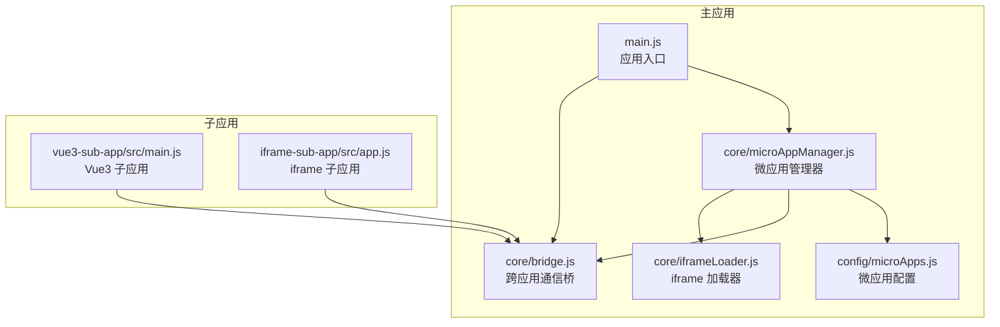
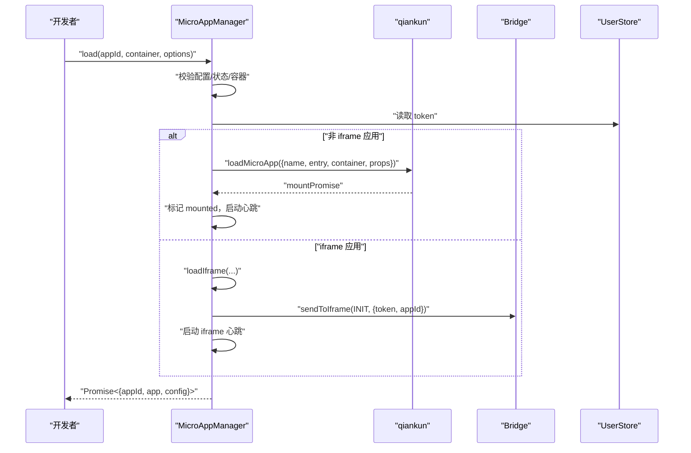
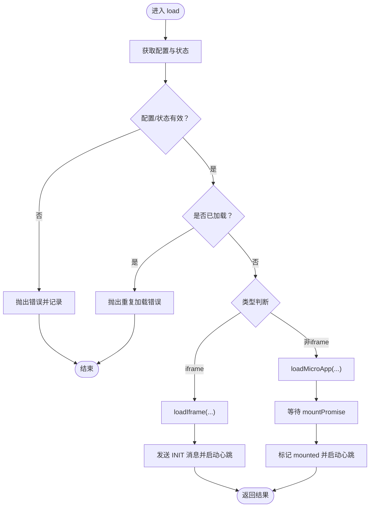
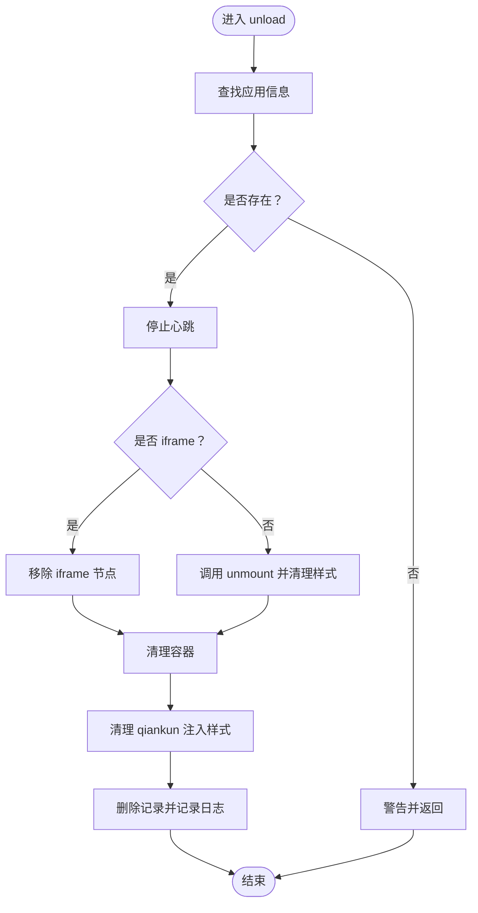
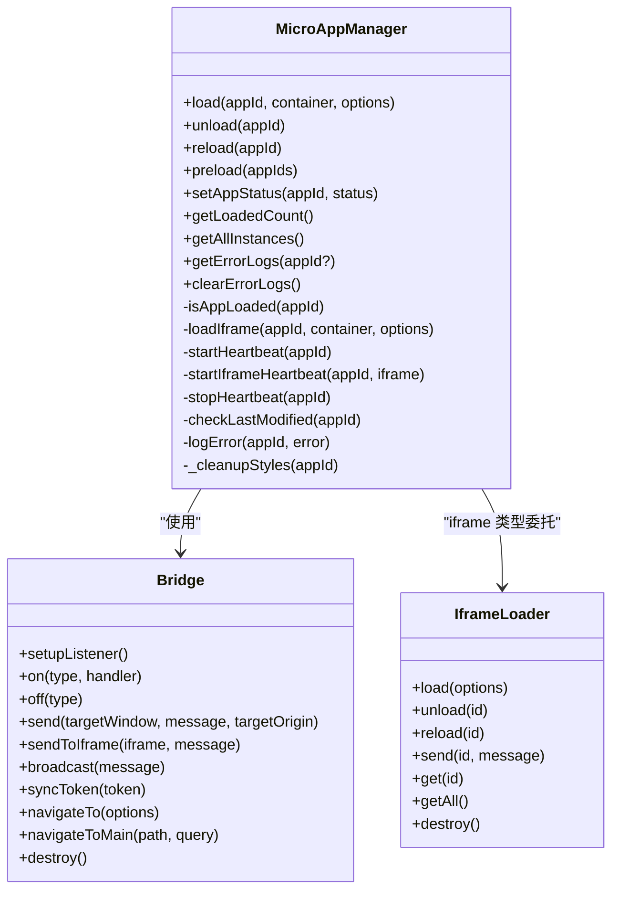
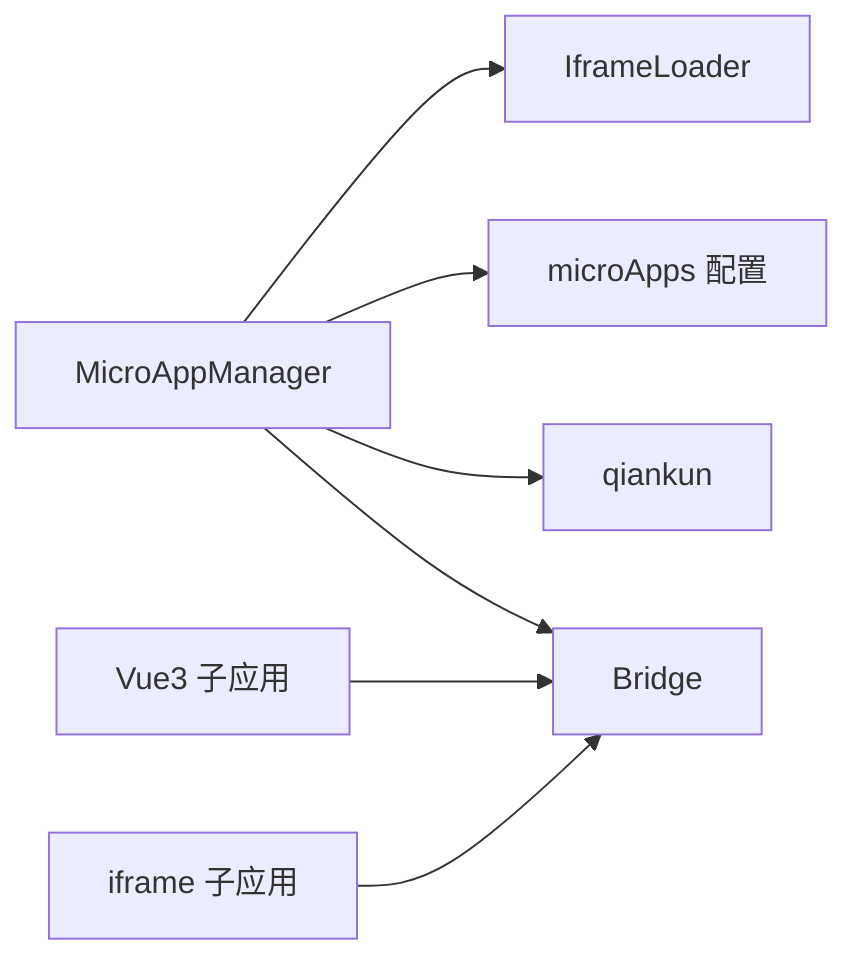

# 微应用管理API

<cite>
**本文档引用的文件**
- [packages/main-app/src/core/microAppManager.js](file://packages/main-app/src/core/microAppManager.js)
- [packages/main-app/src/config/microApps.js](file://packages/main-app/src/config/microApps.js)
- [packages/main-app/src/core/bridge.js](file://packages/main-app/src/core/bridge.js)
- [packages/main-app/src/core/iframeLoader.js](file://packages/main-app/src/core/iframeLoader.js)
- [packages/main-app/src/main.js](file://packages/main-app/src/main.js)
- [packages/vue3-sub-app/src/main.js](file://packages/vue3-sub-app/src/main.js)
- [packages/iframe-sub-app/src/app.js](file://packages/iframe-sub-app/src/app.js)
- [user-docs/api/micro-app-manager.md](file://user-docs/api/micro-app-manager.md)
- [user-docs/guide/typescript-migration.md](file://user-docs/guide/typescript-migration.md)
</cite>

## 目录
1. [简介](#简介)
2. [项目结构](#项目结构)
3. [核心组件](#核心组件)
4. [架构总览](#架构总览)
5. [详细组件分析](#详细组件分析)
6. [依赖关系分析](#依赖关系分析)
7. [性能考虑](#性能考虑)
8. [故障排查指南](#故障排查指南)
9. [结论](#结论)
10. [附录](#附录)

## 简介
本文件为 MicroAppManager 的完整 API 文档，覆盖微应用生命周期管理的所有公共方法，包括 load()、unload()、reload()、preload()、状态管理与实例管理 API，并提供 TypeScript 类型定义、错误处理机制与最佳实践建议。目标是帮助开发者准确理解并高效使用微应用管理能力。

## 项目结构
本仓库采用多包结构，核心的微应用管理器位于主应用包中，同时包含多个子应用示例（Vue2/Vue3/iframe/link）。用户文档提供了 API 使用说明与示例。

图表来源
- [packages/main-app/src/main.js](file://packages/main-app/src/main.js#L1-L40)
- [packages/main-app/src/core/microAppManager.js](file://packages/main-app/src/core/microAppManager.js#L1-L515)
- [packages/main-app/src/config/microApps.js](file://packages/main-app/src/config/microApps.js#L1-L110)
- [packages/main-app/src/core/bridge.js](file://packages/main-app/src/core/bridge.js#L1-L241)
- [packages/main-app/src/core/iframeLoader.js](file://packages/main-app/src/core/iframeLoader.js#L1-L334)
- [packages/vue3-sub-app/src/main.js](file://packages/vue3-sub-app/src/main.js#L1-L115)
- [packages/iframe-sub-app/src/app.js](file://packages/iframe-sub-app/src/app.js#L1-L73)

章节来源
- [packages/main-app/src/main.js](file://packages/main-app/src/main.js#L1-L40)
- [packages/main-app/src/core/microAppManager.js](file://packages/main-app/src/core/microAppManager.js#L1-L515)
- [packages/main-app/src/config/microApps.js](file://packages/main-app/src/config/microApps.js#L1-L110)

## 核心组件
- MicroAppManager：微应用生命周期与状态管理的核心类，负责加载、卸载、刷新、预加载、心跳检测、样式清理、错误记录与日志管理。
- Bridge：主/子应用间通信桥，支持消息广播、心跳、路由跳转、令牌同步等。
- IframeLoader：独立的 iframe 加载与通信管理器，补充 MicroAppManager 的 iframe 类型处理。
- microApps 配置：集中管理各子应用的元数据、状态与预加载策略。

章节来源
- [packages/main-app/src/core/microAppManager.js](file://packages/main-app/src/core/microAppManager.js#L11-L31)
- [packages/main-app/src/core/bridge.js](file://packages/main-app/src/core/bridge.js#L9-L27)
- [packages/main-app/src/core/iframeLoader.js](file://packages/main-app/src/core/iframeLoader.js#L9-L19)
- [packages/main-app/src/config/microApps.js](file://packages/main-app/src/config/microApps.js#L5-L69)

## 架构总览
MicroAppManager 通过 qiankun 加载 Vue 子应用，通过自建 iframe 加载器处理 iframe 子应用；通过 Bridge 统一进行跨应用通信与心跳检测；通过 microApps 配置中心统一管理应用元数据与状态。

图表来源
- [packages/main-app/src/core/microAppManager.js](file://packages/main-app/src/core/microAppManager.js#L49-L165)
- [packages/main-app/src/core/microAppManager.js](file://packages/main-app/src/core/microAppManager.js#L173-L232)
- [packages/main-app/src/core/bridge.js](file://packages/main-app/src/core/bridge.js#L149-L155)

## 详细组件分析

### MicroAppManager 类与公共 API

#### load(appId, container, options)
- 功能：加载微应用，支持 Vue 子应用与 iframe 子应用。
- 参数
  - appId: string，子应用 ID
  - container: HTMLElement | string，容器元素或选择器
  - options.props: Object，透传给子应用的 props
- 返回：Promise<{ appId, app, config }>
- 行为要点
  - 校验配置是否存在、状态是否 online、是否已加载
  - 非 iframe 类型通过 qiankun 加载，iframe 类型通过自建加载器
  - 自动注入 token、bridge、appId 等运行时 props
  - 等待挂载完成，标记 mounted，启动心跳检测
  - 记录错误并写入 errorLogs
- 使用示例
  - 参考：[user-docs/api/micro-app-manager.md](file://user-docs/api/micro-app-manager.md#L25-L31)

章节来源
- [packages/main-app/src/core/microAppManager.js](file://packages/main-app/src/core/microAppManager.js#L49-L165)
- [packages/main-app/src/config/microApps.js](file://packages/main-app/src/config/microApps.js#L76-L78)
- [packages/main-app/src/core/bridge.js](file://packages/main-app/src/core/bridge.js#L149-L155)

#### unload(appId)
- 功能：卸载微应用实例。
- 参数：appId: string
- 行为要点
  - 停止心跳
  - iframe：移除节点、清理容器
  - qiankun：调用 unmount 并清理样式，防止样式污染
  - 强制兜底清理，确保资源释放
- 使用示例
  - 参考：[user-docs/api/micro-app-manager.md](file://user-docs/api/micro-app-manager.md#L40-L42)

章节来源
- [packages/main-app/src/core/microAppManager.js](file://packages/main-app/src/core/microAppManager.js#L238-L284)
- [packages/main-app/src/core/microAppManager.js](file://packages/main-app/src/core/microAppManager.js#L292-L313)

#### reload(appId)
- 功能：刷新微应用实例。
- 参数：appId: string
- 行为要点
  - 先卸载再重新加载，保持容器不变
- 使用示例
  - 参考：[user-docs/api/micro-app-manager.md](file://user-docs/api/micro-app-manager.md#L51-L53)

章节来源
- [packages/main-app/src/core/microAppManager.js](file://packages/main-app/src/core/microAppManager.js#L319-L334)

#### preload(appIds)
- 功能：预加载微应用，提升首次访问性能。
- 参数：appIds: string[]，为空则预加载所有配置了 preload 且状态 online 的应用
- 行为要点
  - 仅对非 iframe 且 online 的应用生效
  - 调用 qiankun prefetchApps 执行预取
  - 更新 preloadStatus 映射
- 触发机制
  - 可按需调用，也可结合业务场景在路由切换前批量预取
- 使用示例
  - 参考：[user-docs/api/micro-app-manager.md](file://user-docs/api/micro-app-manager.md#L62-L64)

章节来源
- [packages/main-app/src/core/microAppManager.js](file://packages/main-app/src/core/microAppManager.js#L421-L440)
- [packages/main-app/src/config/microApps.js](file://packages/main-app/src/config/microApps.js#L15-L15)

#### setAppStatus(appId, status)
- 功能：设置应用上下线状态。
- 参数：appId: string；status: 'online' | 'offline'
- 行为要点
  - 更新配置中心状态
  - 若设为 offline，且应用已加载，则立即卸载
- 使用示例
  - 参考：[user-docs/api/micro-app-manager.md](file://user-docs/api/micro-app-manager.md#L74-L76)

章节来源
- [packages/main-app/src/core/microAppManager.js](file://packages/main-app/src/core/microAppManager.js#L447-L458)
- [packages/main-app/src/config/microApps.js](file://packages/main-app/src/config/microApps.js#L102-L107)

#### getLoadedCount()
- 功能：获取已加载应用数量。
- 返回：number
- 使用场景：监控与告警

章节来源
- [packages/main-app/src/core/microAppManager.js](file://packages/main-app/src/core/microAppManager.js#L464-L466)

#### getAllInstances()
- 功能：获取所有实例映射。
- 返回：Object - 实例映射
- 使用场景：调试、统计、运维面板

章节来源
- [user-docs/api/micro-app-manager.md](file://user-docs/api/micro-app-manager.md#L95-L97)

#### getErrorLogs(appId?)
- 功能：获取错误日志。
- 参数：appId: string（可选），为空则返回全部日志
- 返回：Array
- 使用场景：问题定位、报表统计

章节来源
- [packages/main-app/src/core/microAppManager.js](file://packages/main-app/src/core/microAppManager.js#L496-L501)
- [user-docs/api/micro-app-manager.md](file://user-docs/api/micro-app-manager.md#L106-L108)

#### clearErrorLogs()
- 功能：清空错误日志。
- 使用场景：定期清理、恢复期重置

章节来源
- [packages/main-app/src/core/microAppManager.js](file://packages/main-app/src/core/microAppManager.js#L506-L508)
- [user-docs/api/micro-app-manager.md](file://user-docs/api/micro-app-manager.md#L114-L116)

#### 属性
- instances：响应式的实例映射（getter）
- errorLogs：响应式的错误日志数组（getter）
- preloadStatus：预加载状态映射（getter）

章节来源
- [user-docs/api/micro-app-manager.md](file://user-docs/api/micro-app-manager.md#L124-L134)
- [user-docs/api/micro-app-manager.md](file://user-docs/api/micro-app-manager.md#L140-L142)

### 关键流程图

#### load() 流程

图表来源
- [packages/main-app/src/core/microAppManager.js](file://packages/main-app/src/core/microAppManager.js#L49-L165)
- [packages/main-app/src/core/microAppManager.js](file://packages/main-app/src/core/microAppManager.js#L173-L232)

#### unload() 流程

图表来源
- [packages/main-app/src/core/microAppManager.js](file://packages/main-app/src/core/microAppManager.js#L238-L284)
- [packages/main-app/src/core/microAppManager.js](file://packages/main-app/src/core/microAppManager.js#L292-L313)

### 类关系图

图表来源
- [packages/main-app/src/core/microAppManager.js](file://packages/main-app/src/core/microAppManager.js#L11-L515)
- [packages/main-app/src/core/bridge.js](file://packages/main-app/src/core/bridge.js#L9-L241)
- [packages/main-app/src/core/iframeLoader.js](file://packages/main-app/src/core/iframeLoader.js#L9-L334)

## 依赖关系分析
- MicroAppManager 依赖
  - qiankun：用于加载 Vue 子应用
  - Vue 响应式系统：维护 loadedApps、errorLogs、preloadStatus
  - microApps 配置：提供应用元数据与状态
  - Bridge：跨应用通信与心跳
  - IframeLoader：iframe 子应用专用加载器
- 子应用依赖
  - Vue 生态与 qiankun 生命周期钩子
  - Bridge：接收主应用消息与心跳

图表来源
- [packages/main-app/src/core/microAppManager.js](file://packages/main-app/src/core/microAppManager.js#L1-L6)
- [packages/main-app/src/config/microApps.js](file://packages/main-app/src/config/microApps.js#L1-L110)
- [packages/main-app/src/core/bridge.js](file://packages/main-app/src/core/bridge.js#L1-L241)
- [packages/main-app/src/core/iframeLoader.js](file://packages/main-app/src/core/iframeLoader.js#L1-L334)
- [packages/vue3-sub-app/src/main.js](file://packages/vue3-sub-app/src/main.js#L1-L115)
- [packages/iframe-sub-app/src/app.js](file://packages/iframe-sub-app/src/app.js#L1-L73)

章节来源
- [packages/main-app/src/core/microAppManager.js](file://packages/main-app/src/core/microAppManager.js#L1-L6)
- [packages/main-app/src/config/microApps.js](file://packages/main-app/src/config/microApps.js#L1-L110)

## 性能考虑
- 预加载策略
  - 仅对非 iframe 且 online 的应用执行 prefetchApps，避免对 iframe 造成额外开销
  - 预加载后更新 preloadStatus，便于前端监控
- 心跳检测
  - qiankun 应用每 30 秒检查状态，iframe 应用每 30 秒发送 PING，60 秒未 PONG 标记为不健康
- 样式隔离与清理
  - 启用实验性样式隔离，卸载时清理 qiankun 注入样式与子应用 entry 相关资源，避免样式污染
- 热更新检测
  - HEAD 请求检查 last-modified，发现变更自动 reload，保障开发体验

章节来源
- [packages/main-app/src/core/microAppManager.js](file://packages/main-app/src/core/microAppManager.js#L108-L120)
- [packages/main-app/src/core/microAppManager.js](file://packages/main-app/src/core/microAppManager.js#L340-L357)
- [packages/main-app/src/core/microAppManager.js](file://packages/main-app/src/core/microAppManager.js#L364-L375)
- [packages/main-app/src/core/microAppManager.js](file://packages/main-app/src/core/microAppManager.js#L292-L313)
- [packages/main-app/src/core/microAppManager.js](file://packages/main-app/src/core/microAppManager.js#L392-L415)

## 故障排查指南
- 常见错误与处理
  - 应用不存在：抛出“未找到”错误并记录
  - 应用 offline：抛出“离线”错误并记录
  - 重复加载：抛出“已加载”错误并记录
  - 容器不存在：抛出“容器未找到”错误
  - 卸载异常：捕获并强制清理容器与样式，确保资源回收
- 日志与监控
  - 使用 getErrorLogs() 获取最近 100 条错误日志
  - 使用 clearErrorLogs() 清空历史
  - 使用 getLoadedCount() 监控实例数量
- 心跳与健康
  - 若 qiankun 应用状态为 NOT_MOUNTED/UNMOUNTING，标记为 unhealthy
  - iframe 超时（60 秒无 PONG）标记为 unhealthy

章节来源
- [packages/main-app/src/core/microAppManager.js](file://packages/main-app/src/core/microAppManager.js#L52-L69)
- [packages/main-app/src/core/microAppManager.js](file://packages/main-app/src/core/microAppManager.js#L89-L91)
- [packages/main-app/src/core/microAppManager.js](file://packages/main-app/src/core/microAppManager.js#L275-L283)
- [packages/main-app/src/core/microAppManager.js](file://packages/main-app/src/core/microAppManager.js#L473-L489)
- [packages/main-app/src/core/microAppManager.js](file://packages/main-app/src/core/microAppManager.js#L349-L355)
- [packages/main-app/src/core/iframeLoader.js](file://packages/main-app/src/core/iframeLoader.js#L225-L230)

## 结论
MicroAppManager 提供了完善的微应用生命周期管理能力，涵盖加载、卸载、刷新、预加载、状态控制与错误日志管理。配合 Bridge 与 IframeLoader，可稳定支撑多类型子应用的运行与通信。建议在生产环境中启用预加载、心跳检测与样式隔离，并结合错误日志与健康监控完善可观测性。

## 附录

### TypeScript 类型定义（基于现有实现）
以下类型定义来源于源码字段与行为，便于在 TypeScript 项目中使用：

- MicroAppConfig
  - 字段：id, name, entry, activeRule, container, status, version, lastModified, preload, type, layoutType, layoutOptions, props
  - 取值范围：status ∈ ['online','offline']；type ∈ ['vue3','vue2','iframe','link']；layoutType ∈ ['default','full','tabs','embedded','blank']
  - 参考：[packages/main-app/src/config/microApps.js](file://packages/main-app/src/config/microApps.js#L5-L69)

- MicroAppManager API（方法签名参考）
  - load(appId: string, container: HTMLElement | string, options?: { props?: Record<string, any> }): Promise<{ appId: string, app: any, config: MicroAppConfig }>
  - unload(appId: string): Promise<void>
  - reload(appId: string): Promise<{ appId: string, app: any, config: MicroAppConfig }>
  - preload(appIds?: string[]): Promise<void>
  - setAppStatus(appId: string, status: 'online' | 'offline'): void
  - getLoadedCount(): number
  - getAllInstances(): Record<string, any>
  - getErrorLogs(appId?: string): Array<{ appId: string, message: string, stack?: string, time: number }>
  - clearErrorLogs(): void
  - 属性：instances, errorLogs, preloadStatus
  - 参考：[packages/main-app/src/core/microAppManager.js](file://packages/main-app/src/core/microAppManager.js#L49-L508)

- Bridge 与 IframeLoader（简要）
  - Bridge：消息监听、注册/注销处理器、跨窗口通信、广播、心跳、导航、令牌同步
  - IframeLoader：iframe 加载/卸载/刷新、高度上报、心跳、消息监听、销毁
  - 参考：
    - [packages/main-app/src/core/bridge.js](file://packages/main-app/src/core/bridge.js#L9-L241)
    - [packages/main-app/src/core/iframeLoader.js](file://packages/main-app/src/core/iframeLoader.js#L9-L334)

- 迁移至 TypeScript
  - 参考指南与 tsconfig 示例：[user-docs/guide/typescript-migration.md](file://user-docs/guide/typescript-migration.md#L1-L89)

### 最佳实践
- 预加载
  - 在路由进入前或空闲时段预加载常用应用，减少首屏等待
  - 仅对 online 且非 iframe 的应用执行预加载
- 容器管理
  - 传入真实 HTMLElement 而非选择器字符串，避免刷新后找不到容器
  - 卸载时确保容器清空，避免残留 DOM
- 样式隔离
  - 启用实验性样式隔离，卸载后清理 qiankun 注入样式，避免样式泄漏
- 错误处理
  - 使用 getErrorLogs() 定位问题，必要时 clearErrorLogs() 清理
  - 监控 getLoadedCount() 与健康状态，及时发现异常
- 心跳与热更新
  - 开启心跳检测，关注 unhealthy 状态
  - 开发环境启用 last-modified 检测，自动 reload