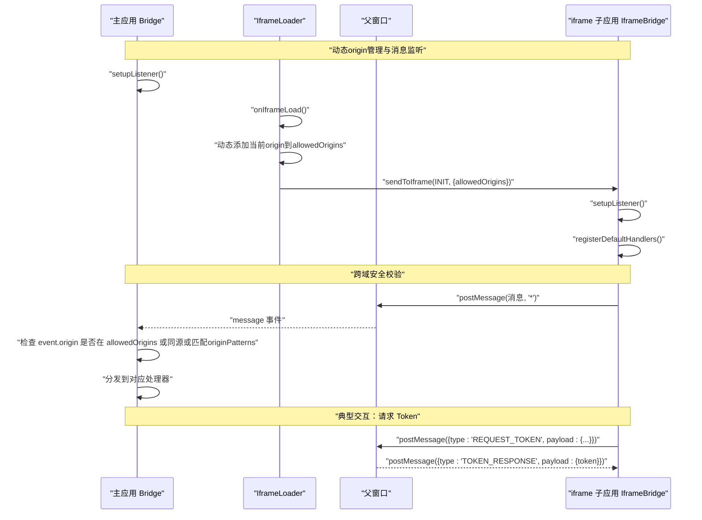
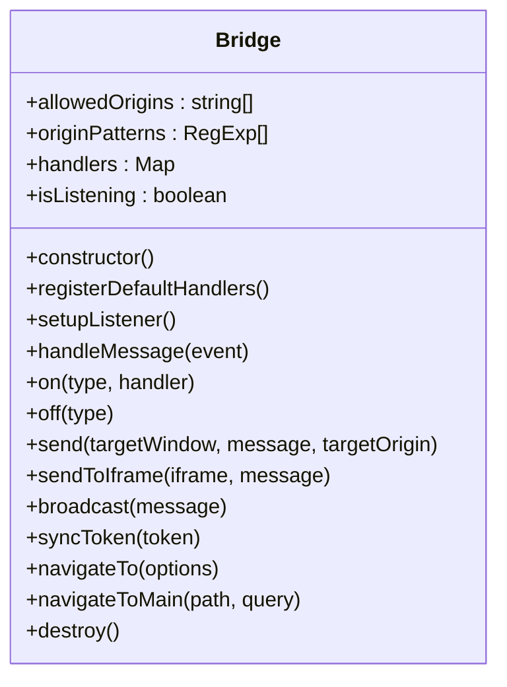
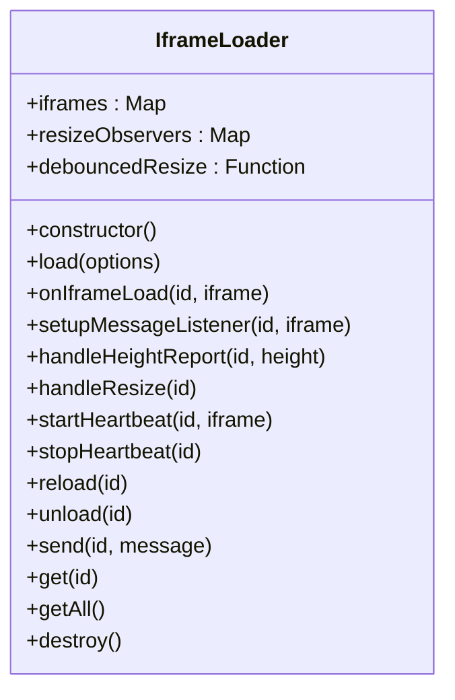
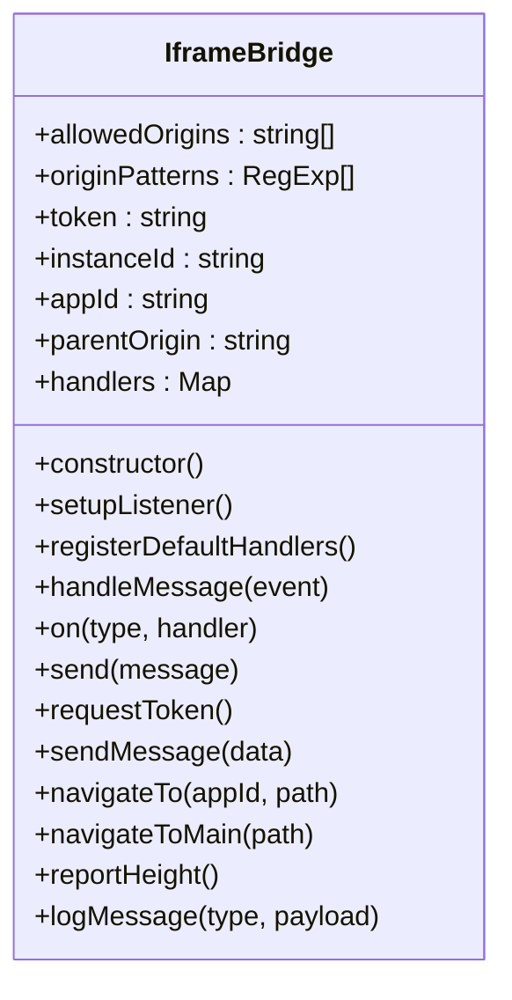
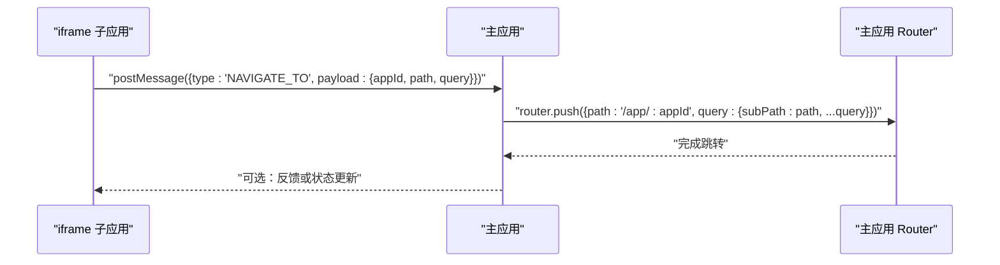
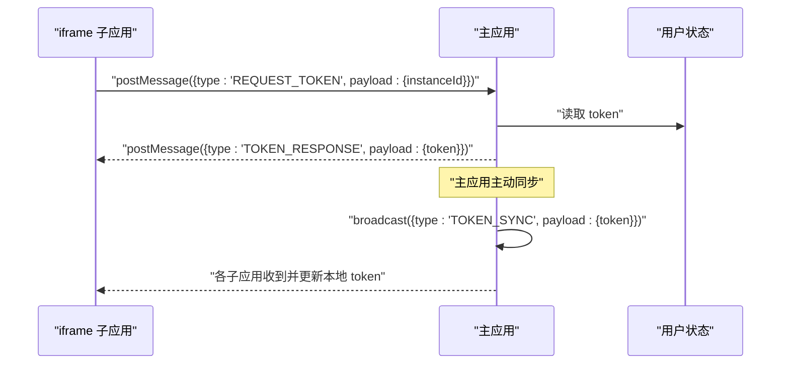

# 通信桥API

<cite>
**本文引用的文件**
- [packages/main-app/src/core/bridge.js](file://packages/main-app/src/core/bridge.js)
- [packages/main-app/src/core/iframeLoader.js](file://packages/main-app/src/core/iframeLoader.js)
- [packages/iframe-sub-app/src/bridge.js](file://packages/iframe-sub-app/src/bridge.js)
- [packages/iframe-sub-app/src/app.js](file://packages/iframe-sub-app/src/app.js)
- [packages/iframe-sub-app/index.html](file://packages/iframe-sub-app/index.html)
- [packages/main-app/src/main.js](file://packages/main-app/src/main.js)
- [packages/main-app/src/router/index.js](file://packages/main-app/src/router/index.js)
- [user-docs/api/bridge.md](file://user-docs/api/bridge.md)
</cite>

## 更新摘要
**变更内容**
- 新增originPatterns配置选项，支持正则表达式模式匹配的动态origin验证
- 改进的origin验证机制，增强跨域安全校验能力
- 增强的令牌同步处理能力，通过INIT消息实现动态origin白名单同步
- 更新跨域安全校验的技术细节，包含静态origin列表和动态模式匹配

## 目录
1. [简介](#简介)
2. [项目结构](#项目结构)
3. [核心组件](#核心组件)
4. [架构总览](#架构总览)
5. [详细组件分析](#详细组件分析)
6. [依赖关系分析](#依赖关系分析)
7. [性能考虑](#性能考虑)
8. [故障排查指南](#故障排查指南)
9. [结论](#结论)
10. [附录](#附录)

## 简介
本文件为"通信桥API"的完整技术文档，覆盖主应用与子应用之间的跨应用通信能力，包括消息类型、消息结构、postMessage 参数与发送机制、消息监听器注册与注销、路由跳转通信、Token 同步、数据共享、跨域安全校验、消息队列与重连策略等。特别关注最新的originPatterns配置选项，该功能提供了基于正则表达式的动态origin验证机制，显著提升了跨应用通信的安全性和灵活性。

## 项目结构
该仓库采用多包结构，包含主应用与多个子应用（含 iframe 子应用）。通信桥位于主应用与 iframe 子应用中，分别提供统一的消息收发与处理能力，并在主应用启动时全局暴露给子应用使用。

```mermaid
graph TB
subgraph "主应用"
MA_Main["main.js<br/>初始化与桥接暴露"]
MA_Bridge["Bridge 类<br/>消息监听/处理/发送<br/>originPatterns配置"]
MA_IFrameLoader["IframeLoader 类<br/>动态origin管理"]
MA_Router["Router<br/>路由跳转"]
end
subgraph "iframe 子应用"
IA_Index["index.html<br/>UI 与按钮事件"]
IA_App["app.js<br/>业务动作封装"]
IA_Bridge["IframeBridge 类<br/>消息监听/处理/发送<br/>originPatterns配置"]
end
MA_Main --> MA_Bridge
MA_Bridge --> MA_IFrameLoader
MA_Bridge --> MA_Router
IA_Index --> IA_App
IA_App --> IA_Bridge
MA_Bridge <- --> IA_Bridge
```

**图表来源**
- [packages/main-app/src/main.js](file://packages/main-app/src/main.js#L10-L31)
- [packages/main-app/src/core/bridge.js](file://packages/main-app/src/core/bridge.js#L225-L238)
- [packages/main-app/src/core/iframeLoader.js](file://packages/main-app/src/core/iframeLoader.js#L9-L338)
- [packages/iframe-sub-app/src/app.js](file://packages/iframe-sub-app/src/app.js#L1-L73)
- [packages/iframe-sub-app/src/bridge.js](file://packages/iframe-sub-app/src/bridge.js#L1-L224)
- [packages/iframe-sub-app/index.html](file://packages/iframe-sub-app/index.html#L1-L68)

**章节来源**
- [packages/main-app/src/main.js](file://packages/main-app/src/main.js#L10-L31)
- [packages/iframe-sub-app/src/app.js](file://packages/iframe-sub-app/src/app.js#L1-L73)
- [packages/iframe-sub-app/index.html](file://packages/iframe-sub-app/index.html#L1-L68)

## 核心组件
- 主应用 Bridge 类：负责消息监听、默认处理器注册、消息发送、广播、路由跳转、Token 同步、销毁等。**新增**：支持originPatterns配置选项，提供基于正则表达式的动态origin验证。
- **新增** IframeLoader 类：负责 iframe 应用的加载、动态origin管理、心跳检测、高度自适应等功能。
- iframe 子应用 IframeBridge 类：负责消息监听、默认处理器注册、向父应用发送消息、请求/接收 Token、上报高度、日志记录等。**新增**：支持originPatterns配置选项，实现与主应用的origin验证机制同步。
- 全局暴露：主应用启动后将部分桥接方法暴露到 window.__ARTISAN_BRIDGE__，供子应用直接调用。

**章节来源**
- [packages/main-app/src/core/bridge.js](file://packages/main-app/src/core/bridge.js#L9-L27)
- [packages/main-app/src/core/iframeLoader.js](file://packages/main-app/src/core/iframeLoader.js#L9-L21)
- [packages/iframe-sub-app/src/bridge.js](file://packages/iframe-sub-app/src/bridge.js#L5-L24)
- [packages/main-app/src/core/bridge.js](file://packages/main-app/src/core/bridge.js#L225-L238)

## 架构总览
主应用与 iframe 子应用通过 postMessage 进行双向通信。**最新增强**：主应用维护允许的 origin 白名单和originPatterns正则表达式模式，对消息来源进行双重校验；iframe 子应用同样维护白名单和originPatterns并记录消息日志。**关键改进**：IframeLoader 在加载 iframe 时动态添加当前 origin 到 allowedOrigins，确保通信安全性。默认处理器涵盖路由跳转、Token 请求/响应、心跳、高度上报与通用消息。


```mermaid
sequenceDiagram
participant Main as "主应用 Bridge"
participant Loader as "IframeLoader"
participant Parent as "父窗口"
participant Child as "iframe 子应用 IframeBridge"
Note over Main,Child : "动态origin管理与消息监听"
Main->>Main : "setupListener()"
Loader->>Loader : "onIframeLoad()"
Loader->>Loader : "动态添加当前origin到allowedOrigins"
Loader->>Child : "sendToIframe(INIT, {allowedOrigins})"
Child->>Child : "setupListener()"
Child->>Child : "registerDefaultHandlers()"
Note over Main,Child : "跨域安全校验"
Child->>Parent : "postMessage(消息, '*')"
Parent-->>Main : "message 事件"
Main->>Main : "检查 event.origin 是否在 allowedOrigins 或同源或匹配originPatterns"
Main->>Main : "分发到对应处理器"
Note over Main,Child : "典型交互：请求 Token"
Child->>Parent : "postMessage({type : 'REQUEST_TOKEN', payload : {...}})"
Parent-->>Child : "postMessage({type : 'TOKEN_RESPONSE', payload : {token}})"
```

**图表来源**
- [packages/main-app/src/core/bridge.js](file://packages/main-app/src/core/bridge.js#L83-L114)
- [packages/main-app/src/core/iframeLoader.js](file://packages/main-app/src/core/iframeLoader.js#L95-L124)
- [packages/iframe-sub-app/src/bridge.js](file://packages/iframe-sub-app/src/bridge.js#L94-L115)
- [packages/main-app/src/core/bridge.js](file://packages/main-app/src/core/bridge.js#L51-L58)
- [packages/iframe-sub-app/src/bridge.js](file://packages/iframe-sub-app/src/bridge.js#L136-L141)

## 详细组件分析

### Bridge 类（主应用）
- 职责
  - 维护允许的 origin 列表（包含动态添加的当前origin）
  - **新增**：维护originPatterns正则表达式数组，支持动态模式匹配
  - 注册默认处理器（路由跳转、Token 请求/响应、心跳、高度上报、通用消息）
  - 提供 on/off 注册/注销处理器
  - 提供 send/sendToIframe/broadcast 等发送能力
  - 提供 navigateTo/navigateToMain 路由跳转能力
  - 提供 syncToken 广播 Token 同步
  - 提供 destroy 销毁监听与处理器
  - 启动时在 window.__ARTISAN_BRIDGE__ 暴露必要方法

- 默认处理器要点
  - NAVIGATE_TO：根据 appId 与 subPath 跳转至子应用容器页
  - NAVIGATE_TO_MAIN：跳回主应用
  - REQUEST_TOKEN：从用户状态获取 token 并以 TOKEN_RESPONSE 回复
  - PONG：打印心跳响应
  - REPORT_HEIGHT：根据 appId 定位 iframe 并调整高度
  - MESSAGE：打印通用消息

- 发送机制
  - send：向任意 Window 发送消息，支持指定 targetOrigin
  - sendToIframe：从 iframe 元素提取 origin 并发送
  - broadcast：遍历 id 以 iframe- 开头的 iframe 并逐个发送，同时触发自定义事件供其他子应用监听

- 路由跳转
  - navigateTo：跳转到子应用容器页，携带 subPath 与查询参数
  - navigateToMain：跳回主应用

- Token 同步
  - syncToken：广播 TOKEN_SYNC，子应用收到后更新本地 token

- 销毁
  - destroy：移除 message 监听，清空处理器

- **新增**：originPatterns配置
  - 支持正则表达式模式匹配，如localhost匹配和域名后缀匹配
  - 在origin验证时与静态白名单并行使用


```mermaid
classDiagram
class Bridge {
+allowedOrigins : string[]
+originPatterns : RegExp[]
+handlers : Map
+isListening : boolean
+constructor()
+registerDefaultHandlers()
+setupListener()
+handleMessage(event)
+on(type, handler)
+off(type)
+send(targetWindow, message, targetOrigin)
+sendToIframe(iframe, message)
+broadcast(message)
+syncToken(token)
+navigateTo(options)
+navigateToMain(path, query)
+destroy()
}
```

**图表来源**
- [packages/main-app/src/core/bridge.js](file://packages/main-app/src/core/bridge.js#L9-L222)

**章节来源**
- [packages/main-app/src/core/bridge.js](file://packages/main-app/src/core/bridge.js#L9-L222)
- [packages/main-app/src/router/index.js](file://packages/main-app/src/router/index.js#L16-L52)

### IframeLoader 类（主应用）
**新增**：专门负责 iframe 应用的加载与通信管理，实现了动态origin管理机制。

- 职责
  - 管理 iframe 实例的创建、加载、卸载
  - **动态origin管理**：在加载时将当前origin添加到allowedOrigins
  - 心跳检测：定时发送PING消息并监控响应
  - 高度自适应：监听窗口变化并上报高度
  - 消息转发：将子应用消息转发给主应用处理器

- 动态origin管理机制
  - 在 onIframeLoad 中动态构建 allowedOrigins 数组
  - 将 bridge.allowedOrigins 与 window.location.origin 合并
  - 通过 INIT 消息发送给子应用，确保双方origin白名单一致

- 心跳检测
  - 每30秒发送一次 PING 消息
  - 超过60秒无响应标记为不健康状态
  - 自动停止心跳检测并清理资源

- 高度自适应
  - 监听窗口resize事件，防抖处理
  - 发送 RESIZE 消息给子应用
  - 根据容器尺寸限制最小和最大高度


```mermaid
classDiagram
class IframeLoader {
+iframes : Map
+resizeObservers : Map
+debouncedResize : Function
+constructor()
+load(options)
+onIframeLoad(id, iframe)
+setupMessageListener(id, iframe)
+handleHeightReport(id, height)
+handleResize(id)
+startHeartbeat(id, iframe)
+stopHeartbeat(id)
+reload(id)
+unload(id)
+send(id, message)
+get(id)
+getAll()
+destroy()
}
```

**图表来源**
- [packages/main-app/src/core/iframeLoader.js](file://packages/main-app/src/core/iframeLoader.js#L9-L334)

**章节来源**
- [packages/main-app/src/core/iframeLoader.js](file://packages/main-app/src/core/iframeLoader.js#L9-L334)

### IframeBridge 类（iframe 子应用）
- 职责
  - 维护允许的 origin 列表
  - **新增**：维护originPatterns正则表达式数组，支持动态模式匹配
  - 注册默认处理器（INIT、TOKEN_SYNC、TOKEN_RESPONSE、PING、RESIZE）
  - 提供 send 向父应用发送消息
  - 提供 requestToken、sendMessage、navigateTo、navigateToMain、reportHeight 等便捷方法
  - 记录消息日志到页面

- 默认处理器要点
  - INIT：初始化 token、instanceId、appId、parentOrigin，并**更新allowedOrigins白名单**，上报一次高度
  - TOKEN_SYNC/TOKEN_RESPONSE：更新本地 token
  - PING：回复 PONG
  - RESIZE：预留处理

- 发送机制
  - send：向 window.parent 发送消息，targetOrigin 使用通配符
  - requestToken：请求主应用返回 token
  - sendMessage：发送通用 MESSAGE，附加来源与实例信息
  - navigateTo/navigateToMain：发送 NAVIGATE_TO/NAVIGATE_TO_MAIN
  - reportHeight：上报当前文档高度与实例标识

- **新增**：originPatterns配置
  - 支持正则表达式模式匹配，如localhost匹配和域名后缀匹配
  - 在origin验证时与静态白名单并行使用


```mermaid
classDiagram
class IframeBridge {
+allowedOrigins : string[]
+originPatterns : RegExp[]
+token : string
+instanceId : string
+appId : string
+parentOrigin : string
+handlers : Map
+constructor()
+setupListener()
+registerDefaultHandlers()
+handleMessage(event)
+on(type, handler)
+send(message)
+requestToken()
+sendMessage(data)
+navigateTo(appId, path)
+navigateToMain(path)
+reportHeight()
+logMessage(type, payload)
}
```

**图表来源**
- [packages/iframe-sub-app/src/bridge.js](file://packages/iframe-sub-app/src/bridge.js#L5-L218)

**章节来源**
- [packages/iframe-sub-app/src/bridge.js](file://packages/iframe-sub-app/src/bridge.js#L5-L218)

### 消息监听器注册与注销
- 注册
  - 主应用：在构造函数中注册默认处理器，并在 setupListener 中监听 window.message
  - **新增** IframeLoader：在 setupMessageListener 中监听 window.message 并验证消息来源
  - iframe 子应用：在构造函数中注册默认处理器，并在 setupListener 中监听 window.message
- 注销
  - 主应用：destroy 移除监听并清空处理器
  - **新增** IframeLoader：stopHeartbeat 停止心跳，移除消息监听，断开ResizeObserver
  - iframe 子应用：未提供显式销毁方法，可在业务层自行管理生命周期

**章节来源**
- [packages/main-app/src/core/bridge.js](file://packages/main-app/src/core/bridge.js#L83-L90)
- [packages/main-app/src/core/iframeLoader.js](file://packages/main-app/src/core/iframeLoader.js#L146-L181)
- [packages/iframe-sub-app/src/bridge.js](file://packages/iframe-sub-app/src/bridge.js#L27-L30)
- [packages/main-app/src/core/bridge.js](file://packages/main-app/src/core/bridge.js#L215-L221)

### 路由跳转通信
- 主应用
  - NAVIGATE_TO：根据 appId 与 subPath 跳转到子应用容器页
  - NAVIGATE_TO_MAIN：跳回主应用
- iframe 子应用
  - 通过 send 发送 NAVIGATE_TO/NAVIGATE_TO_MAIN，由主应用处理并执行路由跳转


```mermaid
sequenceDiagram
participant Child as "iframe 子应用"
participant Parent as "主应用"
participant Router as "主应用 Router"
Child->>Parent : "postMessage({type : 'NAVIGATE_TO', payload : {appId, path, query}})"
Parent->>Router : "router.push({path : '/app/ : appId', query : {subPath : path, ...query}})"
Router-->>Parent : "完成跳转"
Parent-->>Child : "可选：反馈或状态更新"
```

**图表来源**
- [packages/main-app/src/core/bridge.js](file://packages/main-app/src/core/bridge.js#L34-L49)
- [packages/iframe-sub-app/src/bridge.js](file://packages/iframe-sub-app/src/bridge.js#L160-L175)
- [packages/main-app/src/router/index.js](file://packages/main-app/src/router/index.js#L16-L52)

**章节来源**
- [packages/main-app/src/core/bridge.js](file://packages/main-app/src/core/bridge.js#L34-L49)
- [packages/iframe-sub-app/src/bridge.js](file://packages/iframe-sub-app/src/bridge.js#L160-L175)
- [packages/main-app/src/router/index.js](file://packages/main-app/src/router/index.js#L16-L52)

### Token 同步与请求
- 请求流程
  - iframe 子应用调用 requestToken，发送 REQUEST_TOKEN
  - 主应用收到后从用户状态获取 token，以 TOKEN_RESPONSE 返回
- 同步流程
  - 主应用调用 syncToken，广播 TOKEN_SYNC
  - 所有子应用收到后更新本地 token


```mermaid
sequenceDiagram
participant Child as "iframe 子应用"
participant Parent as "主应用"
participant Store as "用户状态"
Child->>Parent : "postMessage({type : 'REQUEST_TOKEN', payload : {instanceId}})"
Parent->>Store : "读取 token"
Parent-->>Child : "postMessage({type : 'TOKEN_RESPONSE', payload : {token}})"
Note over Parent : "主应用主动同步"
Parent->>Parent : "broadcast({type : 'TOKEN_SYNC', payload : {token}})"
Parent-->>Child : "各子应用收到并更新本地 token"
```

**图表来源**
- [packages/main-app/src/core/bridge.js](file://packages/main-app/src/core/bridge.js#L51-L58)
- [packages/iframe-sub-app/src/bridge.js](file://packages/iframe-sub-app/src/bridge.js#L136-L141)
- [packages/main-app/src/core/bridge.js](file://packages/main-app/src/core/bridge.js#L178-L187)

**章节来源**
- [packages/main-app/src/core/bridge.js](file://packages/main-app/src/core/bridge.js#L51-L58)
- [packages/iframe-sub-app/src/bridge.js](file://packages/iframe-sub-app/src/bridge.js#L136-L141)
- [packages/main-app/src/core/bridge.js](file://packages/main-app/src/core/bridge.js#L178-L187)

### 数据共享与通用消息
- 通用消息
  - 主应用与子应用均可发送 MESSAGE 类型消息，用于通用数据传递
  - 子应用 sendMessage 会附加来源与实例信息，便于识别
- 高度上报
  - 子应用定期上报高度，主应用根据 appId 定位 iframe 并调整高度

**章节来源**
- [packages/iframe-sub-app/src/bridge.js](file://packages/iframe-sub-app/src/bridge.js#L146-L155)
- [packages/iframe-sub-app/src/bridge.js](file://packages/iframe-sub-app/src/bridge.js#L180-L198)
- [packages/main-app/src/core/bridge.js](file://packages/main-app/src/core/bridge.js#L65-L72)

### 跨域安全校验机制
**更新**：实现了基于originPatterns的增强安全机制。

- 白名单校验
  - 主应用与子应用均维护 allowedOrigins 列表
  - **新增**：维护originPatterns正则表达式数组，支持动态模式匹配
  - 收到 message 事件时，若 origin 不在白名单且非同源，**且不匹配任何originPatterns**，则拒绝处理
  - **新增**：IframeLoader 在加载时动态将当前origin添加到白名单
  - **新增**：INIT消息包含allowedOrigins数组，子应用更新本地白名单

- 发送端约束
  - 主应用 send 支持指定 targetOrigin；sendToIframe 从 iframe.src 解析 origin
  - 子应用 send 使用通配符，建议在实际生产中结合业务场景细化

- 动态origin管理流程
  ```mermaid
sequenceDiagram
participant Loader as "IframeLoader"
participant Bridge as "Bridge"
participant Child as "IframeBridge"
Loader->>Loader : "onIframeLoad()"
Loader->>Bridge : "获取当前allowedOrigins"
Loader->>Child : "sendToIframe(INIT, {allowedOrigins})"
Child->>Child : "更新allowedOrigins白名单"
Child->>Child : "验证后续消息origin"
```

- **新增**：originPatterns配置示例
  - 匹配localhost域名：`/^https?:\/\/localhost(:\d+)?$/`
  - 匹配特定域名后缀：`/\.hon\.ide\.dev\.jh/`

**图表来源**
- [packages/main-app/src/core/bridge.js](file://packages/main-app/src/core/bridge.js#L96-L101)
- [packages/iframe-sub-app/src/bridge.js](file://packages/iframe-sub-app/src/bridge.js#L94-L99)
- [packages/main-app/src/core/bridge.js](file://packages/main-app/src/core/bridge.js#L150-L154)
- [packages/main-app/src/core/iframeLoader.js](file://packages/main-app/src/core/iframeLoader.js#L104-L115)

**章节来源**
- [packages/main-app/src/core/bridge.js](file://packages/main-app/src/core/bridge.js#L96-L101)
- [packages/iframe-sub-app/src/bridge.js](file://packages/iframe-sub-app/src/bridge.js#L94-L99)
- [packages/main-app/src/core/bridge.js](file://packages/main-app/src/core/bridge.js#L150-L154)
- [packages/main-app/src/core/iframeLoader.js](file://packages/main-app/src/core/iframeLoader.js#L104-L115)

### 消息队列管理与重连策略
- 消息队列
  - 当前实现未见显式消息队列管理，消息处理遵循"到达即处理"原则
- 重连策略
  - 未见显式重连机制；可通过业务层在初始化阶段重复调用 setupListener 或在页面可见性恢复时重新建立监听
  - **新增**：IframeLoader 实现了心跳检测和超时处理，自动标记不健康状态

**章节来源**
- [packages/main-app/src/core/bridge.js](file://packages/main-app/src/core/bridge.js#L83-L90)
- [packages/iframe-sub-app/src/bridge.js](file://packages/iframe-sub-app/src/bridge.js#L27-L30)
- [packages/main-app/src/core/iframeLoader.js](file://packages/main-app/src/core/iframeLoader.js#L221-L237)

## 依赖关系分析
- 主应用依赖
  - 路由：用于处理子应用跳转
  - 状态：用于获取/同步 token
  - DOM：用于定位 iframe 并调整高度
  - **新增** IframeLoader：管理iframe实例和动态origin处理
- iframe 子应用依赖
  - DOM：用于读取/写入 token 输入框、记录消息日志、上报高度
  - 父窗口：通过 postMessage 与主应用通信

```mermaid
graph LR
MA_Core["主应用 Bridge"] --> MA_Router["主应用 Router"]
MA_Core --> MA_Dom["主应用 DOM(iframe 定位)"]
MA_Core --> MA_Store["主应用 用户状态"]
MA_IFrameLoader["IframeLoader"] --> MA_Core
IA_Core["iframe 子应用 Bridge"] --> IA_Dom["子应用 DOM(输入/日志/高度)"]
IA_Core < --> Parent["父窗口(主应用)"]
```

**图表来源**
- [packages/main-app/src/core/bridge.js](file://packages/main-app/src/core/bridge.js#L1-L27)
- [packages/main-app/src/core/iframeLoader.js](file://packages/main-app/src/core/iframeLoader.js#L1-L4)
- [packages/iframe-sub-app/src/bridge.js](file://packages/iframe-sub-app/src/bridge.js#L1-L24)
- [packages/main-app/src/router/index.js](file://packages/main-app/src/router/index.js#L1-L130)

**章节来源**
- [packages/main-app/src/core/bridge.js](file://packages/main-app/src/core/bridge.js#L1-L27)
- [packages/main-app/src/core/iframeLoader.js](file://packages/main-app/src/core/iframeLoader.js#L1-L4)
- [packages/iframe-sub-app/src/bridge.js](file://packages/iframe-sub-app/src/bridge.js#L1-L24)
- [packages/main-app/src/router/index.js](file://packages/main-app/src/router/index.js#L1-L130)

## 性能考虑
- 高频上报
  - 子应用在窗口 resize 时进行防抖上报，避免频繁 DOM 计算与消息发送
  - **新增**：IframeLoader 使用防抖函数处理resize事件
- 监听开销
  - 仅在需要时启用监听，销毁时移除监听，避免内存泄漏
  - **新增**：IframeLoader 提供完整的资源清理机制
- 发送优化
  - 广播时优先使用 origin 精确匹配，减少无效消息投递
- **新增**：originPatterns匹配优化
  - 正则表达式预编译，避免重复创建RegExp对象
  - 匹配顺序优化，优先匹配简单模式
- **新增**：心跳检测优化
  - 30秒间隔发送PING消息，60秒超时检测，平衡性能与可靠性

**章节来源**
- [packages/iframe-sub-app/src/app.js](file://packages/iframe-sub-app/src/app.js#L62-L70)
- [packages/main-app/src/core/bridge.js](file://packages/main-app/src/core/bridge.js#L215-L221)
- [packages/main-app/src/core/iframeLoader.js](file://packages/main-app/src/core/iframeLoader.js#L18-L18)
- [packages/main-app/src/core/iframeLoader.js](file://packages/main-app/src/core/iframeLoader.js#L221-L237)

## 故障排查指南
- 无法接收消息
  - 检查是否已调用 setupListener
  - 检查消息类型是否正确，处理器是否已注册
- 跨域被拒
  - 检查 allowedOrigins 是否包含对方 origin
  - **新增**：检查originPatterns是否正确配置正则表达式
  - 确认发送端 targetOrigin 设置是否合理
  - **新增**：确认 INIT 消息中的 allowedOrigins 是否正确传递
- 路由跳转无效
  - 检查 appId 与路由配置是否一致
  - 确认主应用路由守卫与容器页是否存在
- Token 同步失败
  - 确认主应用用户状态存在有效 token
  - 检查广播是否正常发出与接收
- **新增**：originPatterns配置问题
  - 检查正则表达式语法是否正确
  - 验证正则表达式是否能正确匹配目标origin
  - 确认originPatterns数组中的模式顺序
- **新增**：iframe通信问题
  - 检查 IframeLoader 是否正确加载iframe
  - 确认心跳检测是否正常工作
  - 验证动态origin是否正确添加到白名单

**章节来源**
- [packages/main-app/src/core/bridge.js](file://packages/main-app/src/core/bridge.js#L83-L114)
- [packages/iframe-sub-app/src/bridge.js](file://packages/iframe-sub-app/src/bridge.js#L94-L115)
- [packages/main-app/src/router/index.js](file://packages/main-app/src/router/index.js#L16-L52)
- [packages/main-app/src/core/iframeLoader.js](file://packages/main-app/src/core/iframeLoader.js#L95-L124)

## 结论
本通信桥通过统一的消息模型与严格的跨域校验，为主应用与子应用提供了稳定、可扩展的跨应用通信能力。**最新增强**：originPatterns配置选项显著提升了通信安全性，支持基于正则表达式的动态origin验证；IframeLoader的引入实现了更完善的iframe管理。建议在生产环境中：
- 明确维护 allowedOrigins 白名单和originPatterns配置
- 对高频上报与广播进行节流/去抖
- 在业务层补充必要的重连与容错策略
- 规范消息类型命名与负载结构，提升可观测性与可维护性
- **新增**：充分利用originPatterns配置，确保跨应用通信的安全性和灵活性
- **新增**：合理设计正则表达式模式，避免过于宽泛或过于严格

## 附录

### API 参考

- 主应用 Bridge
  - on(type, handler)
  - off(type)
  - send(targetWindow, message, targetOrigin)
  - sendToIframe(iframe, message)
  - broadcast(message)
  - syncToken(token)
  - navigateTo(options)
  - navigateToMain(path, query)
  - destroy()

- **新增** IframeLoader
  - load(options)
  - unload(id)
  - reload(id)
  - send(id, message)
  - get(id)
  - getAll()
  - destroy()

- iframe 子应用 IframeBridge
  - on(type, handler)
  - send(message)
  - requestToken()
  - sendMessage(data)
  - navigateTo(appId, path)
  - navigateToMain(path)
  - reportHeight()
  - logMessage(type, payload)

- 全局暴露
  - window.__ARTISAN_BRIDGE__：包含 navigateTo、navigateToMain、send、on、off

**章节来源**
- [packages/main-app/src/core/bridge.js](file://packages/main-app/src/core/bridge.js#L121-L246)
- [packages/main-app/src/core/iframeLoader.js](file://packages/main-app/src/core/iframeLoader.js#L297-L334)
- [packages/iframe-sub-app/src/bridge.js](file://packages/iframe-sub-app/src/bridge.js#L120-L224)
- [packages/main-app/src/main.js](file://packages/main-app/src/main.js#L30-L31)

### 消息类型与负载规范

- NAVIGATE_TO
  - 负载字段：appId、path、query
  - 触发方：子应用
  - 处理方：主应用

- NAVIGATE_TO_MAIN
  - 负载字段：path、query
  - 触发方：子应用
  - 处理方：主应用

- REQUEST_TOKEN
  - 负载字段：instanceId（可选）
  - 触发方：子应用
  - 处理方：主应用

- TOKEN_RESPONSE
  - 负载字段：token
  - 触发方：主应用
  - 处理方：子应用

- TOKEN_SYNC
  - 负载字段：token
  - 触发方：主应用
  - 处理方：所有子应用

- LOGOUT
  - 负载字段：无
  - 触发方：主应用
  - 处理方：子应用

- REPORT_HEIGHT
  - 负载字段：height、instanceId
  - 触发方：子应用
  - 处理方：主应用

- PING/PONG
  - 负载字段：pingTime（PONG 包含 time）
  - 触发方：任一方
  - 处理方：对端

- MESSAGE
  - 负载字段：自定义
  - 触发方：任一方
  - 处理方：任一方

- **新增** INIT
  - 负载字段：token、instanceId、origin、allowedOrigins
  - 触发方：主应用
  - 处理方：子应用
  - **用途**：初始化通信，更新origin白名单

### **新增** originPatterns配置规范

- 配置位置
  - 主应用 Bridge：originPatterns 属性
  - 子应用 IframeBridge：originPatterns 属性

- 配置格式
  - 类型：RegExp数组
  - 作用：提供动态origin验证模式

- 配置示例
  ```javascript
  // 匹配localhost域名
  /^https?:\/\/localhost(:\d+)?$/
  
  // 匹配特定域名后缀
  /\.hon\.ide\.dev\.jh/
  
  // 匹配HTTPS协议
  /^https:\/\/.+/
  ```

- 验证逻辑
  - 静态白名单：allowedOrigins.includes(event.origin)
  - 同源匹配：event.origin === window.location.origin
  - 动态模式：originPatterns.some(pattern => pattern.test(event.origin))

**章节来源**
- [user-docs/api/bridge.md](file://user-docs/api/bridge.md#L136-L150)
- [packages/main-app/src/core/bridge.js](file://packages/main-app/src/core/bridge.js#L34-L58)
- [packages/iframe-sub-app/src/bridge.js](file://packages/iframe-sub-app/src/bridge.js#L37-L83)
- [packages/main-app/src/core/iframeLoader.js](file://packages/main-app/src/core/iframeLoader.js#L107-L115)