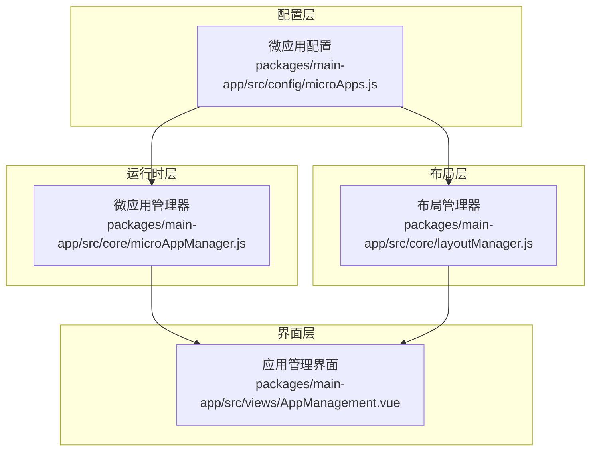
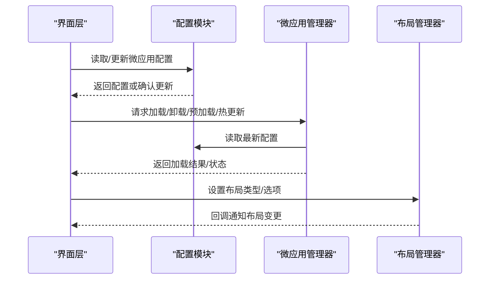
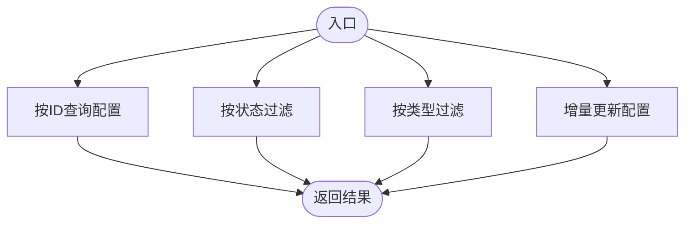
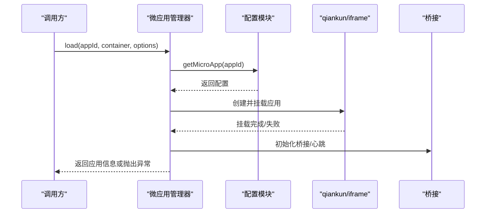
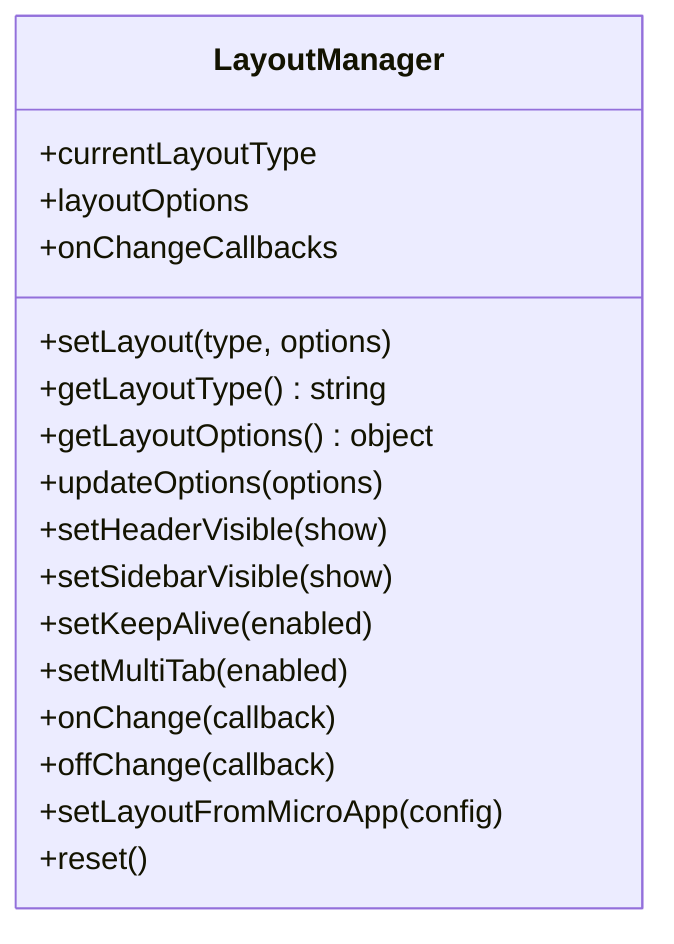
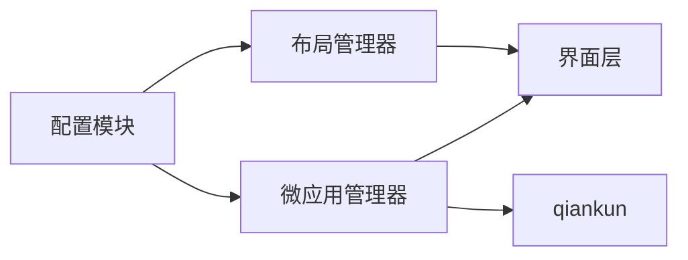

# 配置API

<cite>
**本文档引用的文件**
- [packages/main-app/src/config/microApps.js](file://packages/main-app/src/config/microApps.js)
- [packages/main-app/src/core/microAppManager.js](file://packages/main-app/src/core/microAppManager.js)
- [packages/main-app/src/core/layoutManager.js](file://packages/main-app/src/core/layoutManager.js)
- [user-docs/api/config.md](file://user-docs/api/config.md)
- [user-docs/guide/layout-system.md](file://user-docs/guide/layout-system.md)
- [packages/main-app/src/views/AppManagement.vue](file://packages/main-app/src/views/AppManagement.vue)
- [package.json](file://package.json)
- [user-docs/guide/deployment.md](file://user-docs/guide/deployment.md)
</cite>

## 目录
1. [简介](#简介)
2. [项目结构](#项目结构)
3. [核心组件](#核心组件)
4. [架构总览](#架构总览)
5. [详细组件分析](#详细组件分析)
6. [依赖分析](#依赖分析)
7. [性能考虑](#性能考虑)
8. [故障排查指南](#故障排查指南)
9. [结论](#结论)
10. [附录](#附录)

## 简介
本文件系统化梳理微前端平台的配置管理API，覆盖微应用配置的读取、修改与验证方法；阐述布局配置、环境配置与运行时配置的管理机制；明确配置项的优先级、继承关系与默认值处理；提供配置热更新、动态调整与回滚的技术实现建议；并给出配置文件格式、Schema验证与错误提示的规范说明，帮助开发者灵活管理与定制各类配置选项。

## 项目结构
- 配置定义与读取：微应用配置集中于配置模块，提供查询与更新能力。
- 运行时管理：微应用管理器负责加载、卸载、心跳检测、热更新与错误日志。
- 布局管理：布局管理器负责布局类型与布局选项的动态切换与持久化。
- 文档与示例：用户文档提供配置结构、字段说明与使用示例。

图表来源
- [packages/main-app/src/config/microApps.js](file://packages/main-app/src/config/microApps.js#L1-L110)
- [packages/main-app/src/core/microAppManager.js](file://packages/main-app/src/core/microAppManager.js#L1-L515)
- [packages/main-app/src/core/layoutManager.js](file://packages/main-app/src/core/layoutManager.js#L1-L175)
- [packages/main-app/src/views/AppManagement.vue](file://packages/main-app/src/views/AppManagement.vue#L308-L369)

章节来源
- [packages/main-app/src/config/microApps.js](file://packages/main-app/src/config/microApps.js#L1-L110)
- [packages/main-app/src/core/microAppManager.js](file://packages/main-app/src/core/microAppManager.js#L1-L515)
- [packages/main-app/src/core/layoutManager.js](file://packages/main-app/src/core/layoutManager.js#L1-L175)
- [packages/main-app/src/views/AppManagement.vue](file://packages/main-app/src/views/AppManagement.vue#L308-L369)

## 核心组件
- 微应用配置模块：提供微应用配置数组与查询/更新方法，支持按ID查询、按状态过滤、按类型过滤与增量更新。
- 微应用管理器：负责应用加载、卸载、心跳检测、热更新、预加载、错误日志与状态控制。
- 布局管理器：负责布局类型与布局选项的动态设置、合并与回调通知，并支持从微应用配置中恢复布局。

章节来源
- [packages/main-app/src/config/microApps.js](file://packages/main-app/src/config/microApps.js#L71-L109)
- [packages/main-app/src/core/microAppManager.js](file://packages/main-app/src/core/microAppManager.js#L49-L165)
- [packages/main-app/src/core/layoutManager.js](file://packages/main-app/src/core/layoutManager.js#L40-L168)

## 架构总览
配置API围绕“配置定义—运行时管理—布局控制—界面交互”四层展开，形成清晰的职责边界与调用链路。

图表来源
- [packages/main-app/src/config/microApps.js](file://packages/main-app/src/config/microApps.js#L71-L109)
- [packages/main-app/src/core/microAppManager.js](file://packages/main-app/src/core/microAppManager.js#L49-L165)
- [packages/main-app/src/core/layoutManager.js](file://packages/main-app/src/core/layoutManager.js#L40-L168)
- [packages/main-app/src/views/AppManagement.vue](file://packages/main-app/src/views/AppManagement.vue#L308-L369)

## 详细组件分析

### 微应用配置API
- 配置结构与字段
  - 关键字段包括：id、name、entry、activeRule、container、status、version、lastModified、preload、type、layoutType、layoutOptions、props。
  - 字段说明与必填性详见用户文档。
- 查询与更新
  - 提供按ID查询、按状态过滤、按类型过滤与增量更新方法。
  - 更新通过浅合并现有配置与传入配置对象实现。

图表来源
- [packages/main-app/src/config/microApps.js](file://packages/main-app/src/config/microApps.js#L71-L109)
- [user-docs/api/config.md](file://user-docs/api/config.md#L104-L121)

章节来源
- [packages/main-app/src/config/microApps.js](file://packages/main-app/src/config/microApps.js#L5-L69)
- [packages/main-app/src/config/microApps.js](file://packages/main-app/src/config/microApps.js#L71-L109)
- [user-docs/api/config.md](file://user-docs/api/config.md#L5-L121)

### 微应用管理器（运行时配置）
- 加载流程
  - 校验配置存在性与状态；防重复加载；根据类型选择加载路径（qiankun/iframe/link）；注入桥接与用户令牌；启动心跳与热更新检查。
- 卸载与清理
  - 停止心跳；卸载qiankun应用或移除iframe；清理容器与qiankun样式；支持强制清理。
- 预加载与热更新
  - 预加载策略：按配置的preload字段与在线状态筛选；对非iframe类型发起预取。
  - 热更新策略：基于HTTP响应头last-modified进行比较，若新时间戳大于缓存时间则触发刷新。
- 错误日志与状态控制
  - 统一记录错误日志并限制数量；支持设置应用上下线状态，离线时自动卸载。

图表来源
- [packages/main-app/src/core/microAppManager.js](file://packages/main-app/src/core/microAppManager.js#L49-L165)
- [packages/main-app/src/config/microApps.js](file://packages/main-app/src/config/microApps.js#L76-L78)

章节来源
- [packages/main-app/src/core/microAppManager.js](file://packages/main-app/src/core/microAppManager.js#L49-L165)
- [packages/main-app/src/core/microAppManager.js](file://packages/main-app/src/core/microAppManager.js#L319-L334)
- [packages/main-app/src/core/microAppManager.js](file://packages/main-app/src/core/microAppManager.js#L392-L415)
- [packages/main-app/src/core/microAppManager.js](file://packages/main-app/src/core/microAppManager.js#L421-L440)
- [packages/main-app/src/core/microAppManager.js](file://packages/main-app/src/core/microAppManager.js#L447-L458)
- [packages/main-app/src/core/microAppManager.js](file://packages/main-app/src/core/microAppManager.js#L473-L501)

### 布局管理器（布局配置）
- 布局类型与选项
  - 支持default/full/tabs/embedded/blank五种布局类型；布局选项包含showHeader、showSidebar、keepAlive、multiTab。
- 动态切换与合并
  - 提供setLayout、updateOptions、setHeaderVisible、setSidebarVisible、setKeepAlive、setMultiTab等方法；支持从微应用配置恢复布局。
- 回调通知
  - 布局变更时触发onChange回调，传递前/后类型与当前选项。

图表来源
- [packages/main-app/src/core/layoutManager.js](file://packages/main-app/src/core/layoutManager.js#L18-L168)

章节来源
- [packages/main-app/src/core/layoutManager.js](file://packages/main-app/src/core/layoutManager.js#L1-L175)
- [user-docs/guide/layout-system.md](file://user-docs/guide/layout-system.md#L1-L125)

### 界面层（应用管理）
- 配置编辑与保存
  - 在界面中编辑应用配置并调用更新逻辑，最终写回配置模块。
- 预加载触发
  - 页面挂载时自动执行预加载策略。

章节来源
- [packages/main-app/src/views/AppManagement.vue](file://packages/main-app/src/views/AppManagement.vue#L308-L369)

## 依赖分析
- 组件耦合
  - 微应用管理器依赖配置模块以读取最新配置；布局管理器与配置模块解耦，通过接口接收布局类型与选项。
  - 界面层通过管理器与配置模块间接交互。
- 外部依赖
  - qiankun用于微应用加载与沙箱隔离；AJV等校验工具可用于Schema验证（仓库内含AJV依赖）。

图表来源
- [packages/main-app/src/config/microApps.js](file://packages/main-app/src/config/microApps.js#L1-L110)
- [packages/main-app/src/core/microAppManager.js](file://packages/main-app/src/core/microAppManager.js#L1-L515)
- [packages/main-app/src/core/layoutManager.js](file://packages/main-app/src/core/layoutManager.js#L1-L175)
- [package.json](file://package.json#L28-L49)

章节来源
- [package.json](file://package.json#L28-L49)

## 性能考虑
- 预加载策略
  - 仅对在线且非iframe类型的应用执行预取，减少网络与渲染开销。
- 心跳与热更新
  - 心跳周期为固定间隔，避免频繁轮询；热更新采用HEAD请求与last-modified比较，降低全量资源检查成本。
- 样式隔离与清理
  - 通过实验性样式隔离与精确清理策略，避免样式污染与内存泄漏。

章节来源
- [packages/main-app/src/core/microAppManager.js](file://packages/main-app/src/core/microAppManager.js#L421-L440)
- [packages/main-app/src/core/microAppManager.js](file://packages/main-app/src/core/microAppManager.js#L340-L375)
- [packages/main-app/src/core/microAppManager.js](file://packages/main-app/src/core/microAppManager.js#L392-L415)
- [packages/main-app/src/core/microAppManager.js](file://packages/main-app/src/core/microAppManager.js#L286-L313)

## 故障排查指南
- 常见问题定位
  - 应用未找到：检查配置是否存在与ID是否正确。
  - 应用离线：检查状态字段与管理器的上下线控制。
  - 容器不存在：确认DOM选择器有效或传入DOM元素。
  - 加载失败：查看错误日志并核对入口地址与跨域策略。
- 日志与监控
  - 使用错误日志接口获取指定应用的错误堆栈；关注心跳状态与热更新检测结果。
- 回滚策略
  - 对于配置变更导致的问题，可通过更新配置回退到上一个版本；对于运行时异常，可先卸载再重新加载。

章节来源
- [packages/main-app/src/core/microAppManager.js](file://packages/main-app/src/core/microAppManager.js#L52-L62)
- [packages/main-app/src/core/microAppManager.js](file://packages/main-app/src/core/microAppManager.js#L473-L501)
- [packages/main-app/src/core/microAppManager.js](file://packages/main-app/src/core/microAppManager.js#L319-L334)

## 结论
本配置API以简洁的配置结构与清晰的运行时管理为核心，结合动态布局与热更新机制，为微前端平台提供了高可用、可扩展的配置管理能力。通过明确的优先级与默认值策略、完善的错误日志与回滚手段，开发者可以高效地维护与定制各类配置选项。

## 附录

### 配置文件格式与Schema验证规范
- 文件位置与命名
  - 建议统一存放于主应用的配置目录，如config/microApps.js。
- Schema设计建议
  - 使用JSON Schema或TypeScript接口约束配置字段类型与必填性；对entry、activeRule、container等关键字段增加正则校验。
  - 对layoutOptions中的布尔字段提供默认值，避免运行时缺省。
- 验证流程
  - 读取配置后进行Schema校验；校验失败时输出详细错误信息并阻断加载。
- 错误提示
  - 区分“配置缺失字段”“字段类型不符”“字段取值非法”三类错误，便于快速定位。

章节来源
- [user-docs/api/config.md](file://user-docs/api/config.md#L5-L28)
- [user-docs/api/config.md](file://user-docs/api/config.md#L104-L121)
- [user-docs/guide/layout-system.md](file://user-docs/guide/layout-system.md#L117-L125)

### 配置项优先级、继承与默认值
- 优先级
  - 运行时参数 > 配置模块默认值 > 布局管理器默认值。
- 继承关系
  - 布局管理器可从微应用配置中恢复布局类型与选项；界面层的编辑操作会写回配置模块。
- 默认值
  - 布局选项默认值：showHeader=true、showSidebar=true、keepAlive=false、multiTab=false。
  - 预加载默认值：false。

章节来源
- [packages/main-app/src/core/layoutManager.js](file://packages/main-app/src/core/layoutManager.js#L24-L29)
- [packages/main-app/src/core/layoutManager.js](file://packages/main-app/src/core/layoutManager.js#L161-L168)
- [packages/main-app/src/config/microApps.js](file://packages/main-app/src/config/microApps.js#L14-L26)

### 环境配置与部署
- 环境变量
  - 通过NODE_ENV区分开发/生产环境，动态设置入口地址与静态资源路径。
- 部署建议
  - 生产环境使用CDN或独立域名；确保跨域与安全策略配置正确；对iframe应用启用必要的sandbox权限。

章节来源
- [user-docs/guide/deployment.md](file://user-docs/guide/deployment.md#L114-L130)
- [user-docs/guide/deployment.md](file://user-docs/guide/deployment.md#L132-L145)