# 应用管理界面

<cite>
**本文档引用的文件**
- [MultiInstancePage.vue](file://packages/main-app/src/views/MultiInstancePage.vue)
- [layoutConfig.js](file://packages/main-app/src/config/layoutConfig.js)
- [layoutManager.js](file://packages/main-app/src/core/layoutManager.js)
- [IconSelector.vue](file://packages/main-app/src/components/IconSelector.vue)
- [iconLibrary.js](file://packages/main-app/src/config/iconLibrary.js)
- [DefaultLayout.vue](file://packages/main-app/src/components/layout/DefaultLayout.vue)
- [EmbeddedLayout.vue](file://packages/main-app/src/components/layout/EmbeddedLayout.vue)
- [Footer.vue](file://packages/main-app/src/components/layout/Footer.vue)
- [app.js](file://packages/main-app/src/stores/app.js)
</cite>

## 更新摘要
**所做更改**
- 新增多应用同屏布局支持，包括网格自由布局、标签页布局和左右分屏布局
- 集成图标选择器组件，支持 Element Plus Icons、SVG 图标、Emoji 和远程图片四种类型
- 增强布局配置管理，支持布局类型标准化、约束验证和兼容性检查
- 更新布局管理系统，新增 Footer 显示控制功能
- 完善应用状态管理和持久化机制

## 目录
1. [简介](#简介)
2. [项目结构](#项目结构)
3. [核心组件](#核心组件)
4. [架构概览](#架构概览)
5. [详细组件分析](#详细组件分析)
6. [依赖关系分析](#依赖关系分析)
7. [性能考虑](#性能考虑)
8. [故障排除指南](#故障排除指南)
9. [结论](#结论)

## 简介

Artisan Base Frontend 是一个企业级微前端基础平台脚手架，基于 Monorepo 架构构建，支持 Vue3 主应用和多种类型的子应用。该项目提供了完整的微前端解决方案，包括应用管理、跨应用通信、布局编排系统等功能。

该平台的核心特性包括：
- **Monorepo 架构**：使用 Lerna + npm workspace 管理
- **微前端支持**：基于 qiankun (loadMicroApp 模式)
- **多类型子应用**：支持 vue3 / vue2 / iframe / link
- **多应用同屏布局**：支持网格自由布局、标签页布局、左右分屏布局
- **图标选择器**：集成 Element Plus Icons、SVG 图标、Emoji 和远程图片
- **布局编排系统**：支持 4 种布局类型（默认、全屏、嵌入式、空白）
- **跨应用通信**：完整的 bridge 通信机制
- **状态管理**：Pinia 3.x + 持久化
- **iframe 跨域治理**：完整安全策略
- **Footer 组件**：可配置的底部布局组件

## 项目结构

项目采用 Monorepo 结构，主要包含以下核心包：

```mermaid
graph TB
subgraph "根目录"
Root[根配置文件<br/>package.json<br/>lerna.json<br/>README.md]
end
subgraph "核心应用包"
MainApp[主应用<br/>@artisan/main-app]
Vue3Sub[Vue3 子应用<br/>@artisan/vue3-sub-app]
Vue2Sub[Vue2 子应用<br/>@artisan/vue2-sub-app]
IframeSub[Iframe 子应用<br/>@artisan/iframe-sub-app]
CLI[CLI 工具<br/>@artisan/cli]
end
subgraph "文档系统"
Docs[用户文档<br/>user-docs]
end
Root --> MainApp
Root --> Vue3Sub
Root --> Vue2Sub
Root --> IframeSub
Root --> CLI
Root --> Docs
MainApp --> Vue3Sub
MainApp --> Vue2Sub
MainApp --> IframeSub
```

**图表来源**
- [package.json:1-50](file://package.json#L1-L50)
- [lerna.json:1-25](file://lerna.json#L1-L25)

**章节来源**
- [README.md:68-82](file://README.md#L68-L82)
- [package.json:1-50](file://package.json#L1-L50)
- [lerna.json:1-25](file://lerna.json#L1-L25)

## 核心组件

### 应用管理器 (Micro App Manager)

应用管理器是整个微前端系统的核心组件，负责管理所有子应用的生命周期和状态。

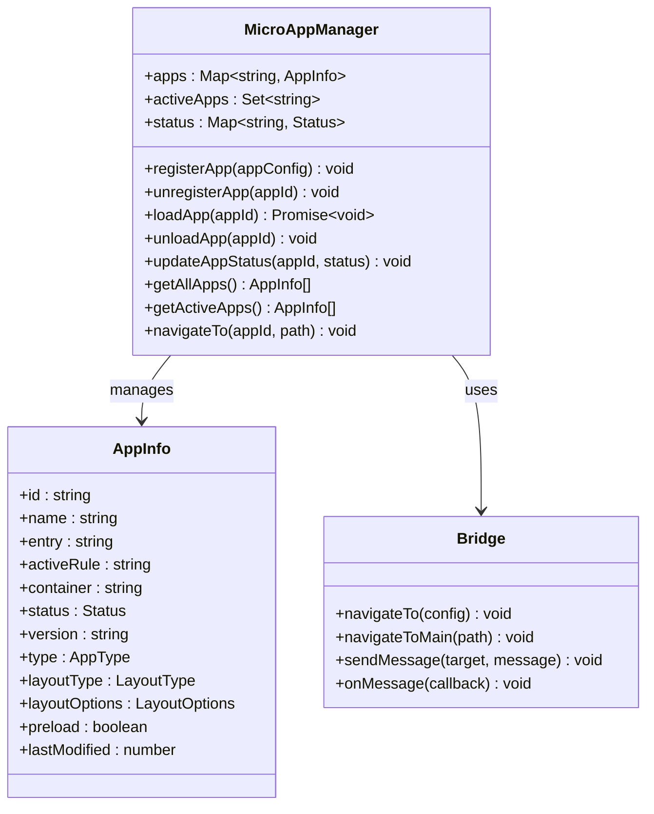
```mermaid
classDiagram
class MicroAppManager {
+apps : Map~string, AppInfo~
+activeApps : Set~string~
+status : Map~string, Status~
+registerApp(appConfig) void
+unregisterApp(appId) void
+loadApp(appId) Promise~void~
+unloadApp(appId) void
+updateAppStatus(appId, status) void
+getAllApps() AppInfo[]
+getActiveApps() AppInfo[]
+navigateTo(appId, path) void
}
class AppInfo {
+id : string
+name : string
+entry : string
+activeRule : string
+container : string
+status : Status
+version : string
+type : AppType
+layoutType : LayoutType
+layoutOptions : LayoutOptions
+preload : boolean
+lastModified : number
}
class Bridge {
+navigateTo(config) void
+navigateToMain(path) void
+sendMessage(target, message) void
+onMessage(callback) void
}
MicroAppManager --> AppInfo : manages
MicroAppManager --> Bridge : uses
```

**图表来源**
- [main.js:1-40](file://packages/main-app/src/main.js#L1-L40)

### 应用生命周期管理

每个子应用都实现了标准化的生命周期管理，确保与主应用的协调工作。

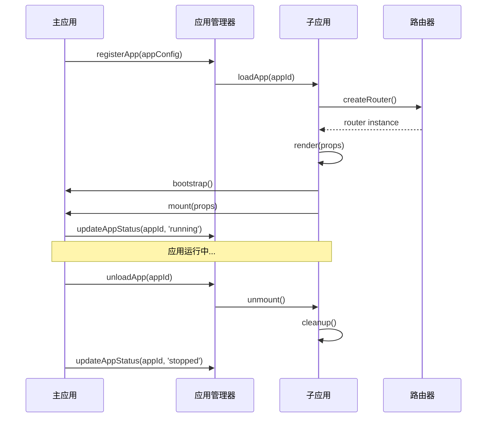
```mermaid
sequenceDiagram
participant Main as 主应用
participant Manager as 应用管理器
participant Sub as 子应用
participant Router as 路由器
Main->>Manager : registerApp(appConfig)
Manager->>Sub : loadApp(appId)
Sub->>Router : createRouter()
Router-->>Sub : router instance
Sub->>Sub : render(props)
Sub->>Main : bootstrap()
Sub->>Main : mount(props)
Main->>Manager : updateAppStatus(appId, 'running')
Note over Sub,Main : 应用运行中...
Main->>Manager : unloadApp(appId)
Manager->>Sub : unmount()
Sub->>Sub : cleanup()
Main->>Manager : updateAppStatus(appId, 'stopped')
```

**图表来源**
- [main.js:79-113](file://packages/vue3-sub-app/src/main.js#L79-L113)
- [main.js:82-113](file://packages/vue2-sub-app/src/main.js#L82-L113)

**章节来源**
- [main.js:1-40](file://packages/main-app/src/main.js#L1-L40)
- [main.js:1-123](file://packages/vue3-sub-app/src/main.js#L1-L123)
- [main.js:1-121](file://packages/vue2-sub-app/src/main.js#L1-L121)

## 架构概览

整个微前端系统的架构设计遵循松耦合、高内聚的原则，通过标准化的接口实现应用间的解耦。

```mermaid
graph TB
subgraph "主应用层"
MainApp[主应用]
Router[路由系统]
Store[状态管理<br/>Pinia]
Bridge[桥接通信]
End
subgraph "微应用管理层"
Manager[应用管理器]
Registry[应用注册表]
Lifecycle[生命周期管理]
End
subgraph "子应用层"
Vue3App[Vue3 子应用]
Vue2App[Vue2 子应用]
IframeApp[Iframe 子应用]
LinkApp[Link 子应用]
End
subgraph "基础设施"
Qiankun[qiankun 核心]
BridgeCore[桥接核心]
Config[配置管理]
End
MainApp --> Router
MainApp --> Store
MainApp --> Bridge
MainApp --> Manager
Manager --> Registry
Manager --> Lifecycle
Manager --> Vue3App
Manager --> Vue2App
Manager --> IframeApp
Manager --> LinkApp
Vue3App --> Qiankun
Vue2App --> Qiankun
IframeApp --> Qiankun
LinkApp --> Qiankun
Bridge --> BridgeCore
BridgeCore --> Vue3App
BridgeCore --> Vue2App
BridgeCore --> IframeApp
BridgeCore --> LinkApp
```

**图表来源**
- [README.md:10-22](file://README.md#L10-L22)
- [main.js:1-40](file://packages/main-app/src/main.js#L1-L40)

## 详细组件分析

### 主应用 (Main App)

主应用作为整个微前端系统的控制中心，负责应用的注册、管理和协调。

#### 核心功能模块

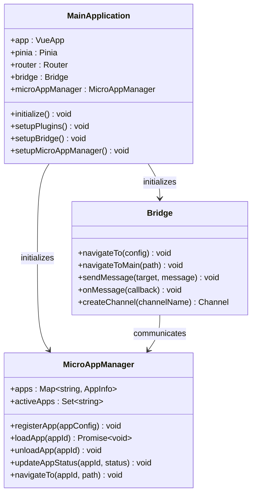
```mermaid
classDiagram
class MainApplication {
+app : VueApp
+pinia : Pinia
+router : Router
+bridge : Bridge
+microAppManager : MicroAppManager
+initialize() void
+setupPlugins() void
+setupBridge() void
+setupMicroAppManager() void
}
class Bridge {
+navigateTo(config) void
+navigateToMain(path) void
+sendMessage(target, message) void
+onMessage(callback) void
+createChannel(channelName) Channel
}
class MicroAppManager {
+apps : Map~string, AppInfo~
+activeApps : Set~string~
+registerApp(appConfig) void
+loadApp(appId) Promise~void~
+unloadApp(appId) void
+updateAppStatus(appId, status) void
+navigateTo(appId, path) void
}
MainApplication --> Bridge : initializes
MainApplication --> MicroAppManager : initializes
Bridge --> MicroAppManager : communicates
```

**图表来源**
- [main.js:1-40](file://packages/main-app/src/main.js#L1-L40)

#### 初始化流程

主应用的初始化过程遵循严格的顺序，确保所有组件正确加载和配置。

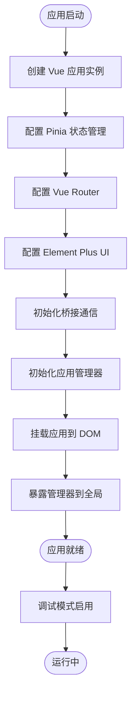
```mermaid
flowchart TD
Start([应用启动]) --> CreateApp["创建 Vue 应用实例"]
CreateApp --> SetupPinia["配置 Pinia 状态管理"]
SetupPinia --> SetupRouter["配置 Vue Router"]
SetupRouter --> SetupElementPlus["配置 Element Plus UI"]
SetupElementPlus --> SetupBridge["初始化桥接通信"]
SetupBridge --> SetupMicroAppManager["初始化应用管理器"]
SetupMicroAppManager --> MountApp["挂载应用到 DOM"]
MountApp --> ExposeManager["暴露管理器到全局"]
ExposeManager --> Ready([应用就绪])
Ready --> Debug["调试模式启用"]
Debug --> End([运行中])
```

**图表来源**
- [main.js:15-39](file://packages/main-app/src/main.js#L15-L39)

**章节来源**
- [main.js:1-40](file://packages/main-app/src/main.js#L1-L40)

### 多应用同屏展示 (Multi Instance Page)

多应用同屏展示页面提供了强大的多应用同时显示和管理功能，支持三种不同的布局模式。

#### 布局模式支持

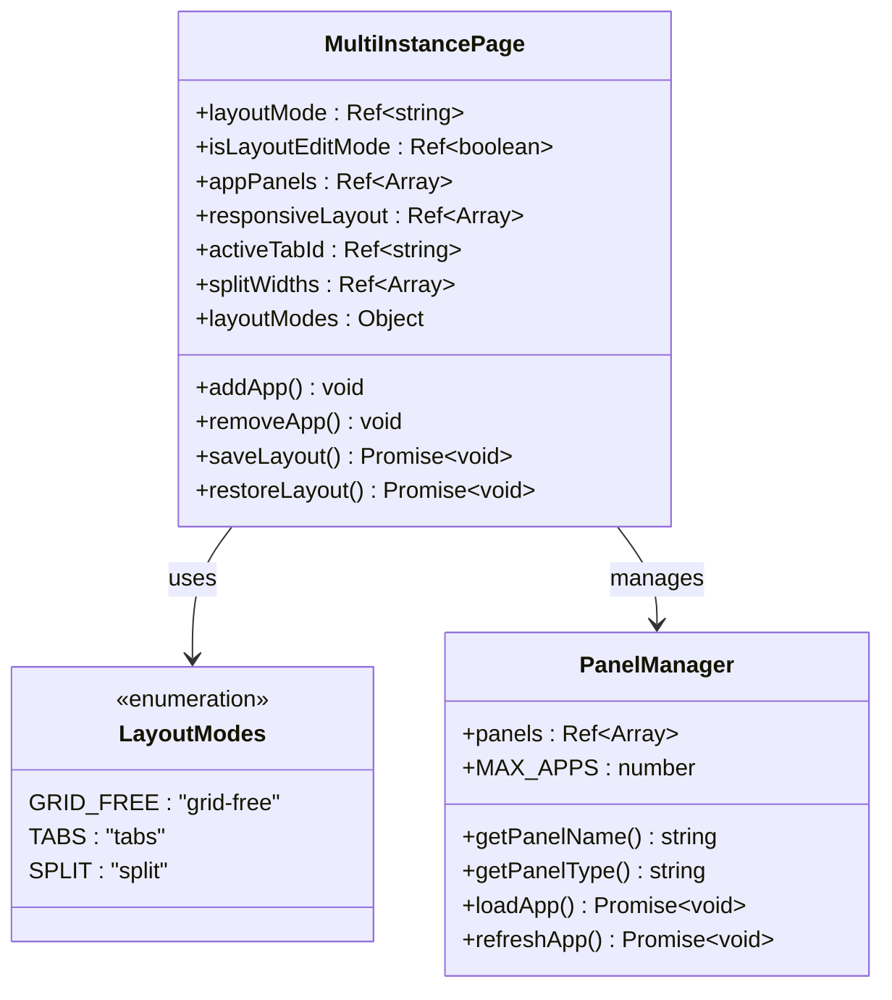
```mermaid
classDiagram
class MultiInstancePage {
+layoutMode : Ref~string~
+isLayoutEditMode : Ref~boolean~
+appPanels : Ref~Array~
+responsiveLayout : Ref~Array~
+activeTabId : Ref~string~
+splitWidths : Ref~Array~
+layoutModes : Object
+addApp() void
+removeApp() void
+saveLayout() Promise~void~
+restoreLayout() Promise~void~
}
class LayoutModes {
<<enumeration>>
GRID_FREE : "grid-free"
TABS : "tabs"
SPLIT : "split"
}
class PanelManager {
+panels : Ref~Array~
+MAX_APPS : number
+getPanelName() string
+getPanelType() string
+loadApp() Promise~void~
+refreshApp() Promise~void~
}
MultiInstancePage --> LayoutModes : uses
MultiInstancePage --> PanelManager : manages
```

**图表来源**
- [MultiInstancePage.vue:1-800](file://packages/main-app/src/views/MultiInstancePage.vue#L1-L800)

#### 网格自由布局

网格自由布局使用 vue-grid-layout 库，支持拖拽、调整大小和响应式布局：

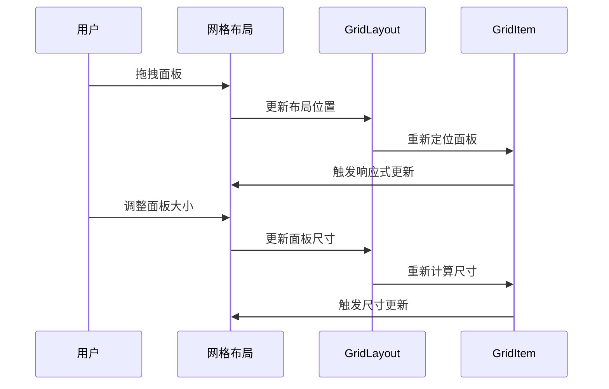
```mermaid
sequenceDiagram
participant User as 用户
participant Grid as 网格布局
participant GridLayout as GridLayout
participant GridItem as GridItem
User->>Grid : 拖拽面板
Grid->>GridLayout : 更新布局位置
GridLayout->>GridItem : 重新定位面板
GridItem->>Grid : 触发响应式更新
User->>Grid : 调整面板大小
Grid->>GridLayout : 更新面板尺寸
GridLayout->>GridItem : 重新计算尺寸
GridItem->>Grid : 触发尺寸更新
```

**图表来源**
- [MultiInstancePage.vue:69-138](file://packages/main-app/src/views/MultiInstancePage.vue#L69-L138)

#### 标签页布局

标签页布局提供类似浏览器的标签页体验，支持标签页切换和关闭：

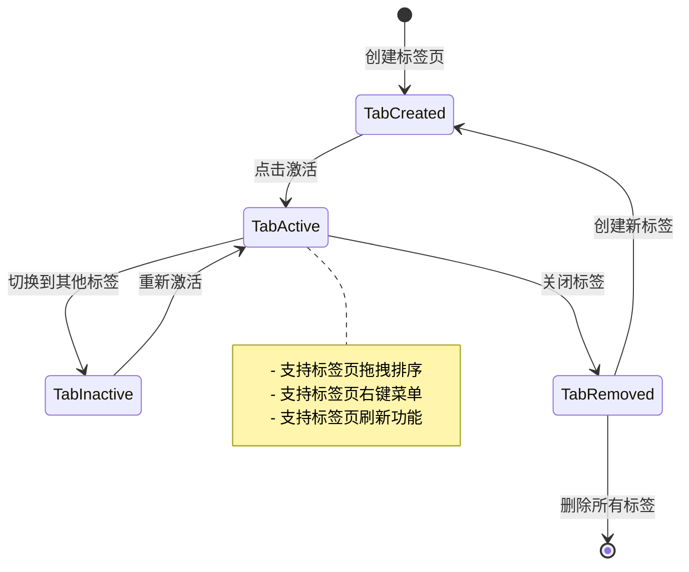
```mermaid
stateDiagram-v2
[*] --> TabCreated : 创建标签页
TabCreated --> TabActive : 点击激活
TabActive --> TabInactive : 切换到其他标签
TabInactive --> TabActive : 重新激活
TabActive --> TabRemoved : 关闭标签
TabRemoved --> TabCreated : 创建新标签
TabRemoved --> [*] : 删除所有标签
note right of TabActive
- 支持标签页拖拽排序
- 支持标签页右键菜单
- 支持标签页刷新功能
end note
```

**图表来源**
- [MultiInstancePage.vue:150-172](file://packages/main-app/src/views/MultiInstancePage.vue#L150-L172)

#### 左右分屏布局

左右分屏布局支持两个应用的并排显示，支持分屏宽度调整和分页浏览：

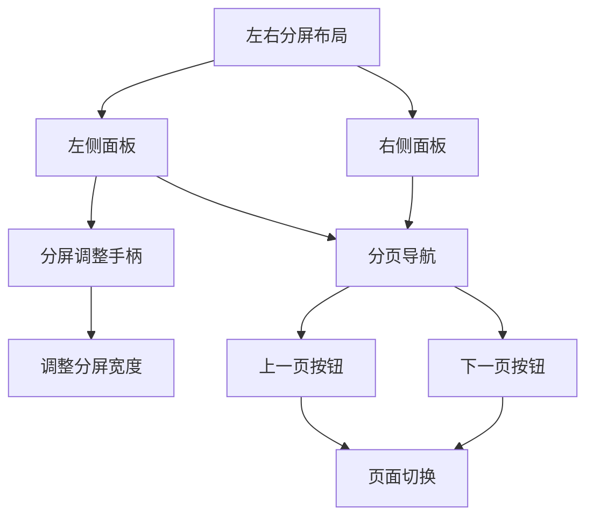
```mermaid
flowchart TD
SplitLayout[左右分屏布局] --> SplitPanel1[左侧面板]
SplitLayout --> SplitPanel2[右侧面板]
SplitPanel1 --> ResizeHandle[分屏调整手柄]
ResizeHandle --> AdjustWidth[调整分屏宽度]
SplitPanel1 --> Pagination[分页导航]
SplitPanel2 --> Pagination
Pagination --> PrevPage[上一页按钮]
Pagination --> NextPage[下一页按钮]
PrevPage --> PageChange[页面切换]
NextPage --> PageChange
```

**图表来源**
- [MultiInstancePage.vue:174-246](file://packages/main-app/src/views/MultiInstancePage.vue#L174-L246)

**章节来源**
- [MultiInstancePage.vue:1-1618](file://packages/main-app/src/views/MultiInstancePage.vue#L1-L1618)

### 图标选择器 (Icon Selector)

图标选择器组件提供了丰富的图标选择功能，支持四种不同类型的图标：

#### 图标类型支持

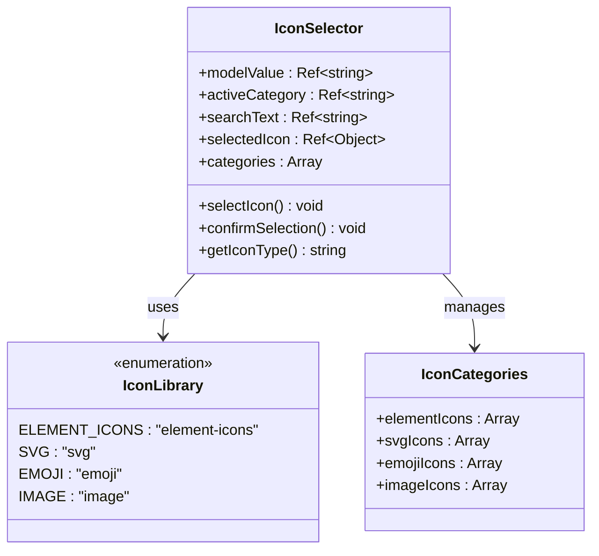
```mermaid
classDiagram
class IconSelector {
+modelValue : Ref~string~
+activeCategory : Ref~string~
+searchText : Ref~string~
+selectedIcon : Ref~Object~
+categories : Array
+selectIcon() void
+confirmSelection() void
+getIconType() string
}
class IconLibrary {
<<enumeration>>
ELEMENT_ICONS : "element-icons"
SVG : "svg"
EMOJI : "emoji"
IMAGE : "image"
}
class IconCategories {
+elementIcons : Array
+svgIcons : Array
+emojiIcons : Array
+imageIcons : Array
}
IconSelector --> IconLibrary : uses
IconSelector --> IconCategories : manages
```

**图表来源**
- [IconSelector.vue:1-629](file://packages/main-app/src/components/IconSelector.vue#L1-L629)
- [iconLibrary.js:1-479](file://packages/main-app/src/config/iconLibrary.js#L1-L479)

#### 图标分类功能

图标选择器支持四种图标分类，每种分类都有独特的特点：

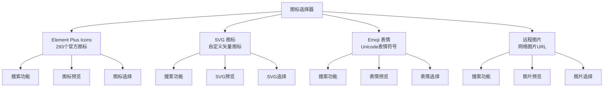
```mermaid
graph TB
IconSelector[图标选择器] --> ElementIcons[Element Plus Icons<br/>293个官方图标]
IconSelector --> SVGIcons[SVG 图标<br/>自定义矢量图标]
IconSelector --> EmojiIcons[Emoji 表情<br/>Unicode表情符号]
IconSelector --> ImageIcons[远程图片<br/>网络图片URL]
ElementIcons --> Search1[搜索功能]
ElementIcons --> Preview1[图标预览]
ElementIcons --> Select1[图标选择]
SVGIcons --> Search2[搜索功能]
SVGIcons --> Preview2[SVG预览]
SVGIcons --> Select2[SVG选择]
EmojiIcons --> Search3[搜索功能]
EmojiIcons --> Preview3[表情预览]
EmojiIcons --> Select3[表情选择]
ImageIcons --> Search4[搜索功能]
ImageIcons --> Preview4[图片预览]
ImageIcons --> Select4[图片选择]
```

**图表来源**
- [IconSelector.vue:42-81](file://packages/main-app/src/components/IconSelector.vue#L42-L81)
- [iconLibrary.js:19-377](file://packages/main-app/src/config/iconLibrary.js#L19-L377)

#### 图标类型判断逻辑

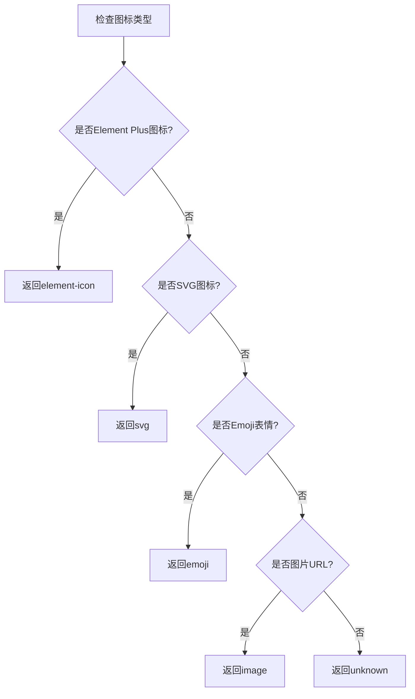
```mermaid
flowchart TD
CheckIcon[检查图标类型] --> IsElementPlus{是否Element Plus图标?}
IsElementPlus --> |是| ElementType[返回element-icon]
IsElementPlus --> |否| IsSVG{是否SVG图标?}
IsSVG --> |是| SVGType[返回svg]
IsSVG --> |否| IsEmoji{是否Emoji表情?}
IsEmoji --> |是| EmojiType[返回emoji]
IsEmoji --> |否| IsImage{是否图片URL?}
IsImage --> |是| ImageType[返回image]
IsImage --> |否| UnknownType[返回unknown]
```

**图表来源**
- [iconLibrary.js:466-478](file://packages/main-app/src/config/iconLibrary.js#L466-L478)

**章节来源**
- [IconSelector.vue:1-629](file://packages/main-app/src/components/IconSelector.vue#L1-L629)
- [iconLibrary.js:1-479](file://packages/main-app/src/config/iconLibrary.js#L1-L479)

### 布局管理系统

布局管理系统负责管理应用的布局类型和布局选项，支持 4 种布局类型：

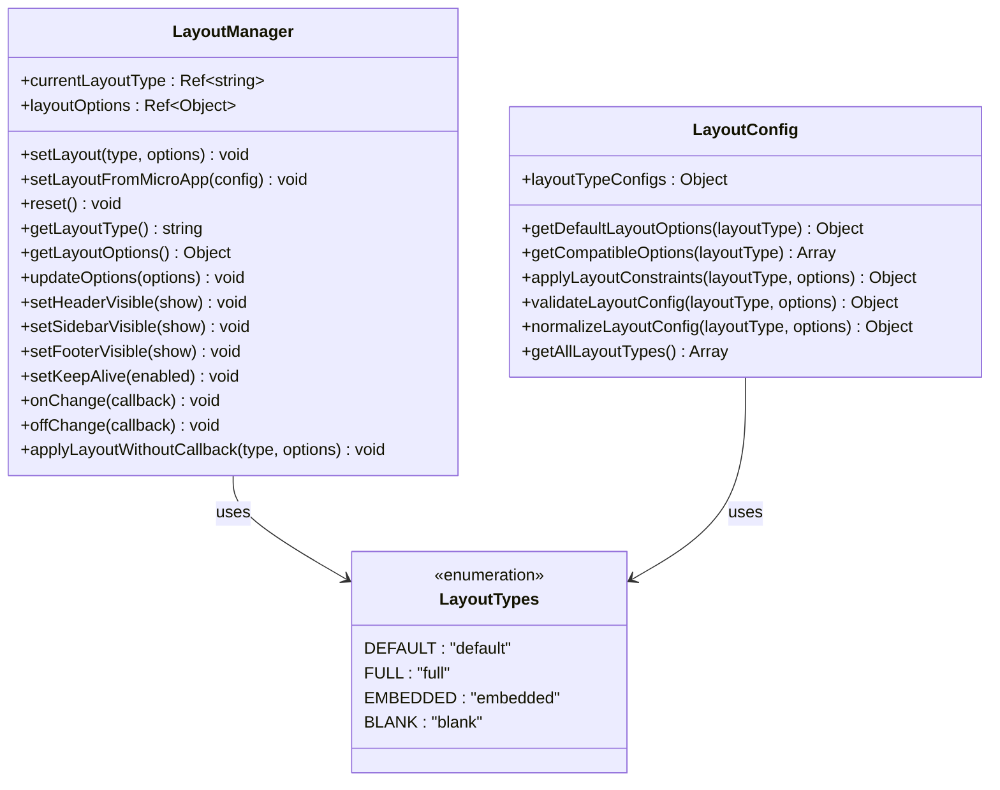
```mermaid
classDiagram
class LayoutManager {
+currentLayoutType : Ref~string~
+layoutOptions : Ref~Object~
+setLayout(type, options) void
+setLayoutFromMicroApp(config) void
+reset() void
+getLayoutType() string
+getLayoutOptions() Object
+updateOptions(options) void
+setHeaderVisible(show) void
+setSidebarVisible(show) void
+setFooterVisible(show) void
+setKeepAlive(enabled) void
+onChange(callback) void
+offChange(callback) void
+applyLayoutWithoutCallback(type, options) void
}
class LayoutTypes {
<<enumeration>>
DEFAULT : "default"
FULL : "full"
EMBEDDED : "embedded"
BLANK : "blank"
}
class LayoutConfig {
+layoutTypeConfigs : Object
+getDefaultLayoutOptions(layoutType) Object
+getCompatibleOptions(layoutType) Array
+applyLayoutConstraints(layoutType, options) Object
+validateLayoutConfig(layoutType, options) Object
+normalizeLayoutConfig(layoutType, options) Object
+getAllLayoutTypes() Array
}
LayoutManager --> LayoutTypes : uses
LayoutConfig --> LayoutTypes : uses
```

**图表来源**
- [layoutManager.js:17-142](file://packages/main-app/src/core/layoutManager.js#L17-L142)
- [layoutConfig.js:26-205](file://packages/main-app/src/config/layoutConfig.js#L26-L205)

#### Footer 显示控制功能

布局管理系统现已支持 Footer 显示控制功能，包括配置开关和实时预览：

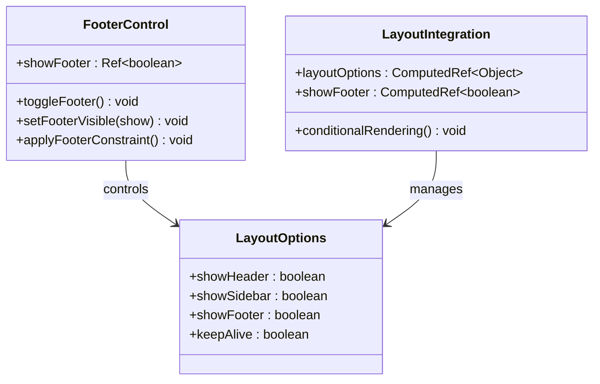
```mermaid
classDiagram
class FooterControl {
+showFooter : Ref~boolean~
+toggleFooter() void
+setFooterVisible(show) void
+applyFooterConstraint() void
}
class LayoutOptions {
+showHeader : boolean
+showSidebar : boolean
+showFooter : boolean
+keepAlive : boolean
}
class LayoutIntegration {
+layoutOptions : ComputedRef~Object~
+showFooter : ComputedRef~boolean~
+conditionalRendering() void
}
FooterControl --> LayoutOptions : controls
LayoutIntegration --> LayoutOptions : manages
```

**图表来源**
- [layoutManager.js:115-117](file://packages/main-app/src/core/layoutManager.js#L115-L117)
- [DefaultLayout.vue:25-27](file://packages/main-app/src/components/layout/DefaultLayout.vue#L25-L27)
- [EmbeddedLayout.vue:28-31](file://packages/main-app/src/components/layout/EmbeddedLayout.vue#L28-L31)

#### 布局类型约束

应用管理界面中的布局类型选择器已经更新，移除了不再支持的 tabs 布局选项：

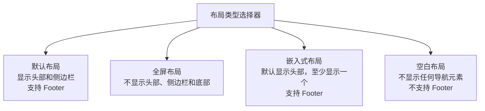
```mermaid
flowchart TD
LayoutSelector[布局类型选择器] --> Default[默认布局<br/>显示头部和侧边栏<br/>支持 Footer]
LayoutSelector --> Full[全屏布局<br/>不显示头部、侧边栏和底部]
LayoutSelector --> Embedded[嵌入式布局<br/>默认显示头部，至少显示一个<br/>支持 Footer]
LayoutSelector --> Blank[空白布局<br/>不显示任何导航元素<br/>不支持 Footer]
```

**图表来源**
- [layoutConfig.js:26-87](file://packages/main-app/src/config/layoutConfig.js#L26-L87)

**章节来源**
- [layoutManager.js:1-142](file://packages/main-app/src/core/layoutManager.js#L1-L142)
- [layoutConfig.js:1-205](file://packages/main-app/src/config/layoutConfig.js#L1-L205)

### Footer 组件

Footer 组件是一个可复用的底部布局组件，提供了统一的页面底部展示区域：

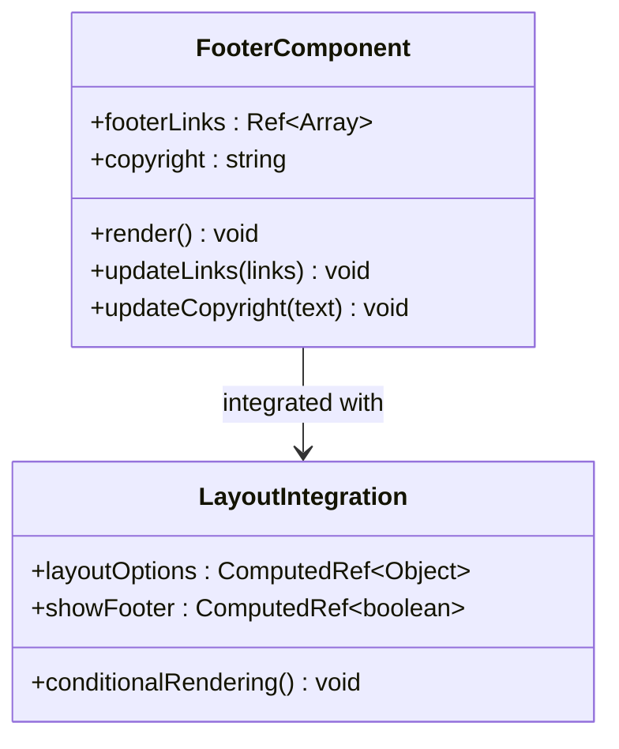
```mermaid
classDiagram
class FooterComponent {
+footerLinks : Ref~Array~
+copyright : string
+render() void
+updateLinks(links) void
+updateCopyright(text) void
}
class LayoutIntegration {
+layoutOptions : ComputedRef~Object~
+showFooter : ComputedRef~boolean~
+conditionalRendering() void
}
FooterComponent --> LayoutIntegration : integrated with
```

**图表来源**
- [Footer.vue:24-32](file://packages/main-app/src/components/layout/Footer.vue#L24-L32)

#### Footer 组件特性

- **统一的版权信息展示**
- **可配置的快捷链接列表**
- **响应式布局支持**
- **与布局系统无缝集成**
- **支持显示/隐藏控制**

**章节来源**
- [Footer.vue:1-72](file://packages/main-app/src/components/layout/Footer.vue#L1-L72)

### 应用状态管理

应用状态管理使用 Pinia 进行状态管理，支持应用列表的加载、更新和持久化：

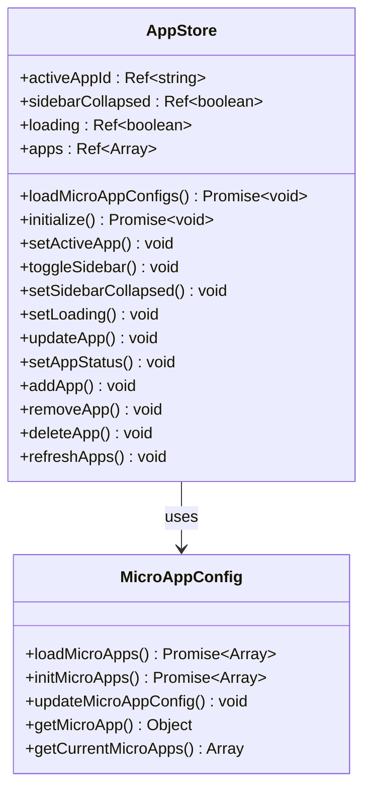
```mermaid
classDiagram
class AppStore {
+activeAppId : Ref~string~
+sidebarCollapsed : Ref~boolean~
+loading : Ref~boolean~
+apps : Ref~Array~
+loadMicroAppConfigs() Promise~void~
+initialize() Promise~void~
+setActiveApp() void
+toggleSidebar() void
+setSidebarCollapsed() void
+setLoading() void
+updateApp() void
+setAppStatus() void
+addApp() void
+removeApp() void
+deleteApp() void
+refreshApps() void
}
class MicroAppConfig {
+loadMicroApps() Promise~Array~
+initMicroApps() Promise~Array~
+updateMicroAppConfig() void
+getMicroApp() Object
+getCurrentMicroApps() Array
}
AppStore --> MicroAppConfig : uses
```

**图表来源**
- [app.js:1-143](file://packages/main-app/src/stores/app.js#L1-L143)

#### 应用生命周期管理

应用状态管理实现了完整的应用生命周期管理，包括应用的加载、更新和删除：

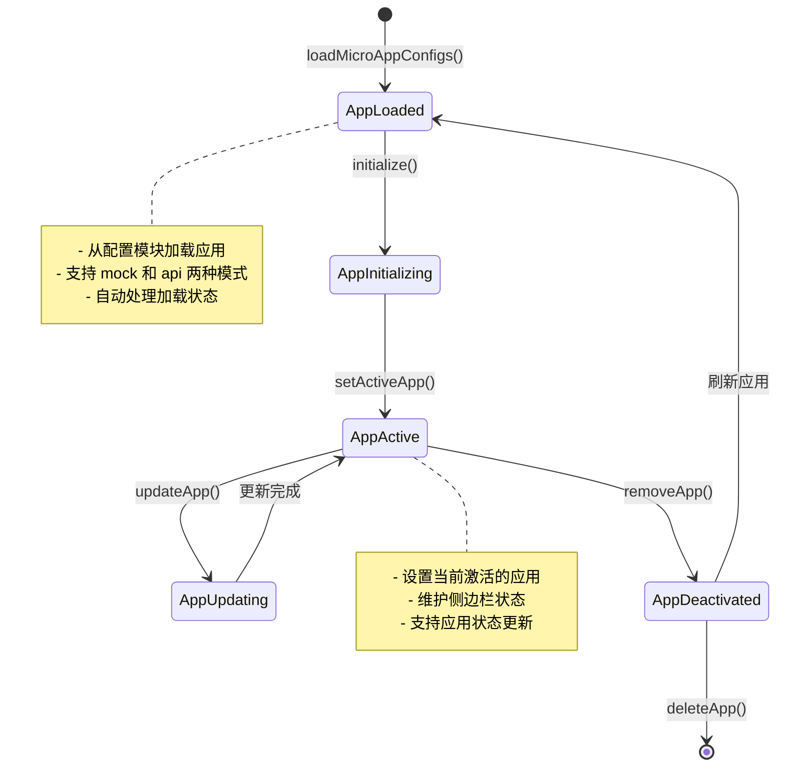
```mermaid
stateDiagram-v2
[*] --> AppLoaded : loadMicroAppConfigs()
AppLoaded --> AppInitializing : initialize()
AppInitializing --> AppActive : setActiveApp()
AppActive --> AppUpdating : updateApp()
AppUpdating --> AppActive : 更新完成
AppActive --> AppDeactivated : removeApp()
AppDeactivated --> AppLoaded : 刷新应用
AppDeactivated --> [*] : deleteApp()
note right of AppLoaded
- 从配置模块加载应用
- 支持 mock 和 api 两种模式
- 自动处理加载状态
end note
note right of AppActive
- 设置当前激活的应用
- 维护侧边栏状态
- 支持应用状态更新
end note
```

**图表来源**
- [app.js:18-108](file://packages/main-app/src/stores/app.js#L18-L108)

**章节来源**
- [app.js:1-143](file://packages/main-app/src/stores/app.js#L1-L143)

## 依赖关系分析

### 核心依赖架构

```mermaid
graph TB
subgraph "运行时依赖"
Vue3[Vue 3.5.29]
Qiankun[qiankun 2.10.16]
Pinia[Pinia 3.0.4]
ElementPlus[Element Plus 2.13.2]
VueRouter[Vue Router 5.0.3]
GridLayout[grid-layout-plus 3.0.0]
End
subgraph "开发时依赖"
Vite[Vite 7.3.1]
TypeScript[TypeScript 5.9.3]
ESLint[ESLint 8.57.0]
Sass[Sass 1.71.1]
End
subgraph "工具链"
Lerna[Lerna 9.0.4]
NPM[npm 9.0.0]
Node[Node.js >= 18.12.0]
End
Vue3 --> Qiankun
Vue3 --> Pinia
Vue3 --> ElementPlus
Vue3 --> VueRouter
GridLayout --> Vue3
Pinia --> PiniaPlugin[Pinia Plugin Persistedstate]
Vite --> TypeScript
Vite --> ESLint
Vite --> Sass
Lerna --> NPM
NPM --> Node
```

**图表来源**
- [package.json:14-33](file://packages/main-app/package.json#L14-L33)
- [package.json:14-29](file://packages/vue3-sub-app/package.json#L14-L29)
- [package.json:11-24](file://packages/vue2-sub-app/package.json#L11-L24)

### Monorepo 依赖管理

项目使用 Lerna 进行 Monorepo 依赖管理，确保各包之间的版本一致性。

```mermaid
graph LR
subgraph "根配置"
RootPkg[根 package.json]
LernaConfig[Lerna 配置]
End
subgraph "工作空间包"
MainPkg[主应用包]
Vue3Pkg[Vue3 子应用包]
Vue2Pkg[Vue2 子应用包]
IframePkg[Iframe 子应用包]
CLIPkg[CLI 包]
End
RootPkg --> MainPkg
RootPkg --> Vue3Pkg
RootPkg --> Vue2Pkg
RootPkg --> IframePkg
RootPkg --> CLIPkg
LernaConfig --> RootPkg
LernaConfig --> MainPkg
LernaConfig --> Vue3Pkg
LernaConfig --> Vue2Pkg
LernaConfig --> IframePkg
LernaConfig --> CLIPkg
```

**图表来源**
- [package.json:6-9](file://package.json#L6-L9)
- [lerna.json:5-8](file://lerna.json#L5-L8)

**章节来源**
- [package.json:1-50](file://package.json#L1-L50)
- [lerna.json:1-25](file://lerna.json#L1-L25)

## 性能考虑

### 应用加载优化

微前端系统在性能方面采用了多项优化策略：

1. **按需加载**：子应用仅在需要时加载，减少初始包大小
2. **预加载机制**：支持应用预加载，提升切换速度
3. **缓存策略**：利用浏览器缓存和 CDN 加速资源加载
4. **内存管理**：严格的生命周期管理，避免内存泄漏

### 多应用同屏性能优化

多应用同屏展示页面采用了多项性能优化措施：

1. **虚拟滚动**：对于大量应用面板，使用虚拟滚动技术
2. **懒加载**：应用内容按需加载，减少初始渲染时间
3. **分页加载**：分屏布局支持分页加载，避免一次性渲染过多内容
4. **响应式布局**：根据屏幕尺寸动态调整布局密度

### 图标选择器性能优化

图标选择器组件采用了以下性能优化策略：

1. **分类懒加载**：只有在用户切换到对应分类时才加载图标数据
2. **搜索过滤**：实时搜索过滤，避免渲染大量无关图标
3. **图片缓存**：远程图片使用浏览器缓存机制
4. **SVG 优化**：SVG 图标使用内联渲染，避免额外的 HTTP 请求

### 资源管理

```mermaid
flowchart TD
LoadRequest[加载请求] --> CheckCache{检查缓存}
CheckCache --> |命中| UseCache[使用缓存资源]
CheckCache --> |未命中| FetchRemote[从远程获取]
FetchRemote --> CacheResponse[缓存响应]
CacheResponse --> UseCache
subgraph "缓存策略"
TTL[TTL 缓存]
ETag[ETag 校验]
Version[版本控制]
End
UseCache --> RenderApp[渲染应用]
RenderApp --> Monitor[性能监控]
Monitor --> Optimize[性能优化]
```

### 并发控制

系统支持多应用并发运行，同时提供并发控制机制：

- **最大并发数限制**：防止同时加载过多应用
- **优先级队列**：根据应用重要性排序加载
- **资源竞争检测**：避免应用间资源冲突

### Footer 组件性能优化

Footer 组件采用条件渲染策略，避免不必要的 DOM 操作：

- **v-if 条件渲染**：未启用时不会渲染到 DOM 中
- **响应式更新**：仅在 showFooter 变化时触发重新渲染
- **轻量级组件**：组件结构简单，性能开销小

## 故障排除指南

### 常见问题诊断

#### 应用加载失败

当子应用无法正常加载时，可以按照以下步骤进行排查：

1. **检查网络连接**：确认子应用入口 URL 可访问
2. **验证 CORS 配置**：确保跨域设置正确
3. **检查应用状态**：确认应用状态为 online
4. **查看浏览器控制台**：寻找具体的错误信息

#### 多应用同屏布局问题

```mermaid
flowchart TD
LayoutIssue[布局问题] --> CheckLayoutMode{检查布局模式}
CheckLayoutMode --> |网格布局| CheckGridLayout{检查 GridLayout}
CheckLayoutMode --> |标签页布局| CheckTabs{检查标签页}
CheckLayoutMode --> |分屏布局| CheckSplit{检查分屏}
CheckGridLayout --> GridLayoutError[GridLayout 配置错误]
CheckTabs --> TabsError[标签页切换异常]
CheckSplit --> SplitError[分屏调整失效]
GridLayoutError --> FixGridLayout[修复 GridLayout 配置]
TabsError --> FixTabs[修复标签页逻辑]
SplitError --> FixSplit[修复分屏功能]
FixGridLayout --> TestLayout[测试布局功能]
FixTabs --> TestLayout
FixSplit --> TestLayout
TestLayout --> ResolveIssue[问题解决]
```

#### 图标选择器问题

```mermaid
flowchart TD
IconIssue[图标选择器问题] --> CheckCategory{检查图标分类}
CheckCategory --> |Element Plus| CheckElementPlus{检查 Element Plus 图标}
CheckCategory --> |SVG 图标| CheckSVG{检查 SVG 资源}
CheckCategory --> |Emoji| CheckEmoji{检查 Emoji 支持}
CheckCategory --> |远程图片| CheckImage{检查图片加载}
CheckElementPlus --> ElementPlusError[Element Plus 图标缺失]
CheckSVG --> SVGError[SVG 资源加载失败]
CheckEmoji --> EmojiError[Emoji 显示异常]
CheckImage --> ImageError[图片加载超时]
ElementPlusError --> FixElementPlus[修复图标导入]
SVGError --> FixSVG[修复 SVG 资源]
EmojiError --> FixEmoji[修复 Emoji 支持]
ImageError --> FixImage[修复图片加载]
FixElementPlus --> TestIconSelector[测试图标选择器]
FixSVG --> TestIconSelector
FixEmoji --> TestIconSelector
FixImage --> TestIconSelector
TestIconSelector --> ResolveIssue[问题解决]
```

#### 样式污染问题

```mermaid
flowchart TD
StyleIssue[样式污染] --> CheckQiankunMode{检查 qiankun 模式}
CheckQiankunMode --> |是| CheckCSSInjection{检查 CSS 注入}
CheckQiankunMode --> |否| CheckLocalStylesheet{检查本地样式表}
CheckCSSInjection --> DisableCSSInjection[禁用 CSS 注入]
CheckLocalStylesheet --> LoadExternalCSS[加载外部样式表]
DisableCSSInjection --> TestStyles[测试样式效果]
LoadExternalCSS --> TestStyles
TestStyles --> ResolveIssue[问题解决]
```

#### Footer 显示问题

```mermaid
flowchart TD
FooterIssue[Footer 显示问题] --> CheckLayoutType{检查布局类型}
CheckLayoutType --> |Full/Blank| CheckConstraint{检查布局约束}
CheckLayoutType --> |Default/Embedded| CheckShowFooter{检查 showFooter 选项}
CheckConstraint --> ConstraintError[布局约束导致不显示]
CheckShowFooter --> OptionError[showFooter 选项配置错误]
ConstraintError --> FixConstraint[修复布局约束]
OptionError --> FixOption[修复 showFooter 选项]
FixConstraint --> TestFooter[测试 Footer 显示]
FixOption --> TestFooter
TestFooter --> ResolveIssue[问题解决]
```

### 调试工具

系统提供了完善的调试工具：

1. **全局管理器访问**：通过 `window.__ARTISAN_MICRO_APP_MANAGER__` 访问管理器
2. **应用状态监控**：实时查看应用状态和配置
3. **生命周期日志**：详细的生命周期事件日志
4. **性能指标收集**：应用加载和运行时性能数据

**章节来源**
- [main.js:36-37](file://packages/main-app/src/main.js#L36-L37)

## 结论

Artisan Base Frontend 提供了一个完整的企业级微前端解决方案，具有以下优势：

### 技术优势

1. **架构清晰**：采用 Monorepo 架构，便于维护和扩展
2. **兼容性强**：支持多种框架和运行模式
3. **功能完善**：涵盖微前端的所有核心功能
4. **开发友好**：提供 CLI 工具和完善的文档
5. **组件化设计**：支持 Footer 组件的灵活配置和控制
6. **多应用同屏**：提供灵活的多应用展示和管理能力
7. **图标选择器**：集成丰富的图标选择和管理功能

### 应用场景

该平台适用于以下场景：

- **大型企业应用**：需要模块化和团队协作的复杂应用
- **多产品线管理**：需要统一入口和独立开发的产品组合
- **渐进式迁移**：从传统单体应用向微前端架构的平滑过渡
- **快速原型开发**：提供标准化的开发模板和工具链
- **内容管理系统**：支持 Footer 组件的统一底部展示
- **多应用协同**：支持多个应用的同屏展示和管理

### 发展方向

未来的发展重点包括：

1. **性能优化**：持续改进应用加载和运行时性能
2. **生态建设**：丰富第三方集成和插件生态
3. **开发体验**：进一步简化开发和部署流程
4. **监控完善**：增强应用监控和运维能力
5. **组件扩展**：支持更多可配置的布局组件
6. **多应用管理**：增强多应用同屏展示的交互体验
7. **图标库扩展**：增加更多类型的图标资源

通过合理使用和扩展，Artisan Base Frontend 可以成为企业微前端架构的理想选择。

**更新** 本版本更新反映了应用变更：新增了多应用同屏布局支持，包括网格自由布局、标签页布局和左右分屏布局三种模式；集成了图标选择器组件，支持 Element Plus Icons、SVG 图标、Emoji 和远程图片四种类型的图标选择；增强了布局配置管理功能，支持布局类型标准化、约束验证和兼容性检查；更新了布局管理系统，新增 Footer 显示控制功能；完善了应用状态管理和持久化机制。这些更新显著提升了应用管理界面的功能性和用户体验。