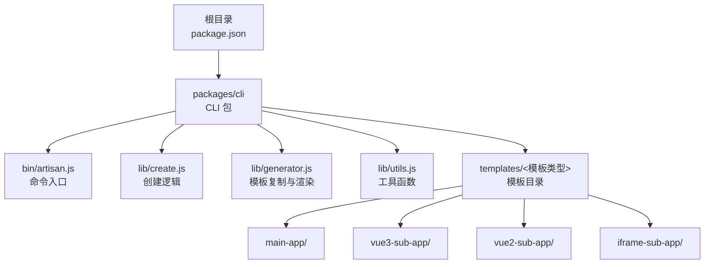
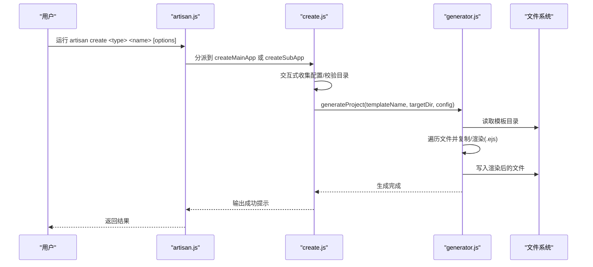
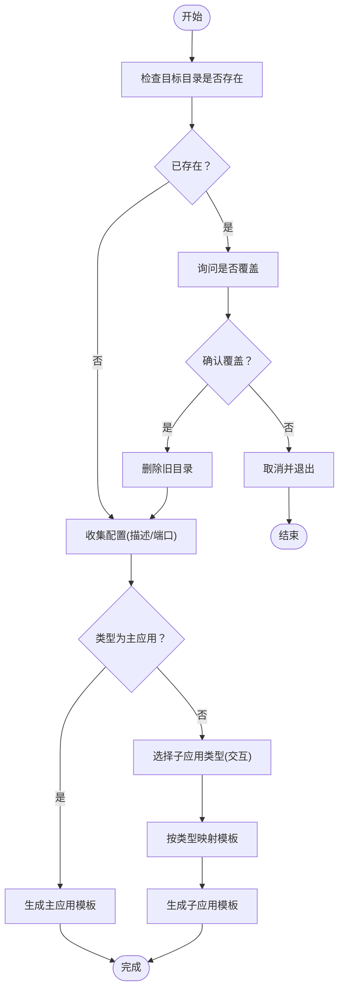
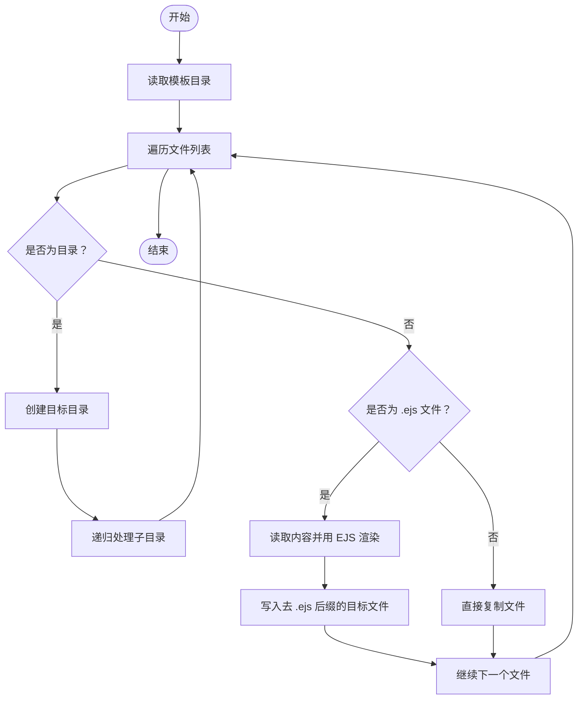
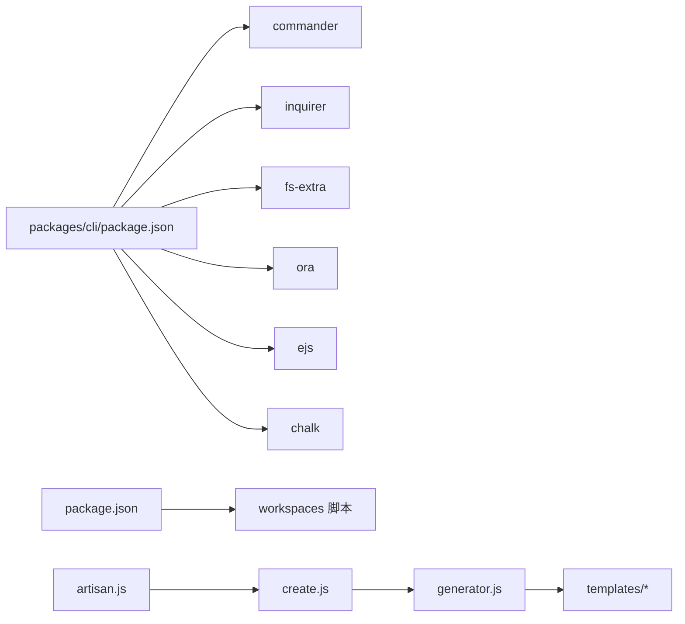

# CLI工具链

<cite>
**本文引用的文件**
- [README.md](file://README.md)
- [package.json](file://package.json)
- [packages/cli/bin/artisan.js](file://packages/cli/bin/artisan.js)
- [packages/cli/lib/create.js](file://packages/cli/lib/create.js)
- [packages/cli/lib/generator.js](file://packages/cli/lib/generator.js)
- [packages/cli/lib/utils.js](file://packages/cli/lib/utils.js)
- [packages/cli/package.json](file://packages/cli/package.json)
- [packages/cli/templates/main-app/README.md.ejs](file://packages/cli/templates/main-app/README.md.ejs)
- [packages/cli/templates/main-app/package.json.ejs](file://packages/cli/templates/main-app/package.json.ejs)
- [packages/cli/templates/vue3-sub-app/README.md.ejs](file://packages/cli/templates/vue3-sub-app/README.md.ejs)
- [packages/cli/templates/vue3-sub-app/package.json.ejs](file://packages/cli/templates/vue3-sub-app/package.json.ejs)
- [packages/cli/my-app/README.md](file://packages/cli/my-app/README.md)
</cite>

## 目录
1. [简介](#简介)
2. [项目结构](#项目结构)
3. [核心组件](#核心组件)
4. [架构总览](#架构总览)
5. [详细组件分析](#详细组件分析)
6. [依赖关系分析](#依赖关系分析)
7. [性能与可维护性](#性能与可维护性)
8. [故障排查指南](#故障排查指南)
9. [结论](#结论)
10. [附录：使用示例与最佳实践](#附录使用示例与最佳实践)

## 简介
本指南面向需要快速搭建微前端项目的开发者，系统讲解 Artisan CLI 工具链的安装、使用与扩展方法。内容涵盖：
- CLI 的功能特性与使用场景
- create 命令的选项与参数详解（主应用创建、子应用生成、模板选择）
- 内部实现机制（命令解析、交互式问答、模板渲染与文件生成）
- 自定义模板开发与扩展
- 常用命令示例、批量操作技巧与自动化集成建议

## 项目结构
该仓库采用 Monorepo 架构，CLI 工具位于 packages/cli 中，提供全局命令 artisan，用于一键生成主应用与多种类型的子应用。

图表来源
- [package.json](file://package.json#L1-L50)
- [packages/cli/bin/artisan.js](file://packages/cli/bin/artisan.js#L1-L53)
- [packages/cli/lib/create.js](file://packages/cli/lib/create.js#L1-L175)
- [packages/cli/lib/generator.js](file://packages/cli/lib/generator.js#L1-L59)
- [packages/cli/lib/utils.js](file://packages/cli/lib/utils.js#L1-L66)
- [packages/cli/package.json](file://packages/cli/package.json#L1-L32)

章节来源
- [README.md](file://README.md#L62-L76)
- [package.json](file://package.json#L1-L50)

## 核心组件
- 命令入口与路由
  - 负责注册命令、解析参数、打印帮助与版本信息，并分发到具体创建流程。
- 创建逻辑
  - 主应用与子应用分别封装了交互式问答、目标目录检查与覆盖确认、模板映射与生成。
- 模板系统
  - 基于 EJS 渲染，支持 .ejs 文件自动去除后缀并写入渲染结果；普通文件直接复制。
- 工具函数
  - 提供目录空判断、名称格式化与校验、统一日志输出等辅助能力。

章节来源
- [packages/cli/bin/artisan.js](file://packages/cli/bin/artisan.js#L1-L53)
- [packages/cli/lib/create.js](file://packages/cli/lib/create.js#L1-L175)
- [packages/cli/lib/generator.js](file://packages/cli/lib/generator.js#L1-L59)
- [packages/cli/lib/utils.js](file://packages/cli/lib/utils.js#L1-L66)

## 架构总览
CLI 的执行路径从命令入口开始，根据用户输入的子命令与选项，调用对应的创建函数；创建函数收集必要配置后，委托生成器完成模板复制与渲染，最终在目标目录产出可直接使用的项目骨架。

图表来源
- [packages/cli/bin/artisan.js](file://packages/cli/bin/artisan.js#L14-L38)
- [packages/cli/lib/create.js](file://packages/cli/lib/create.js#L11-L71)
- [packages/cli/lib/generator.js](file://packages/cli/lib/generator.js#L11-L24)

## 详细组件分析

### 命令入口与参数解析
- 命令注册
  - create 命令：接收类型与名称，支持 --type、--port、--dir 等选项。
  - list 命令：列举可用模板类型与简要说明。
- 错误处理
  - 对未知类型进行提示并退出；捕获创建异常并输出错误信息。
- 版本与描述
  - 通过 package.json 注入版本与描述信息。

章节来源
- [packages/cli/bin/artisan.js](file://packages/cli/bin/artisan.js#L9-L52)
- [packages/cli/package.json](file://packages/cli/package.json#L1-L32)

### 创建逻辑（主应用与子应用）
- 主应用创建
  - 检查目标目录是否存在，若存在则询问是否覆盖；收集描述与端口；调用生成器产出模板。
- 子应用创建
  - 若未指定类型，则通过交互式列表选择；按类型映射到对应模板；收集描述与端口；调用生成器产出模板。
- 端口默认值
  - 主应用默认端口来自用户输入或固定值；子应用根据类型映射默认端口。

图表来源
- [packages/cli/lib/create.js](file://packages/cli/lib/create.js#L11-L71)
- [packages/cli/lib/create.js](file://packages/cli/lib/create.js#L76-L169)

章节来源
- [packages/cli/lib/create.js](file://packages/cli/lib/create.js#L11-L71)
- [packages/cli/lib/create.js](file://packages/cli/lib/create.js#L76-L169)

### 模板系统与文件生成
- 模板目录
  - templates 下按类型划分模板，每个模板包含若干 .ejs 文件（如 README.md.ejs、package.json.ejs）。
- 生成流程
  - 读取模板目录，递归遍历文件；对目录递归复制；对 .ejs 文件先读取内容，再用 EJS 渲染，最后写入去 .ejs 后缀的目标文件；普通文件直接复制。
- 渲染变量
  - 模板中可使用 name、description、port 等变量，由配置对象传入。

图表来源
- [packages/cli/lib/generator.js](file://packages/cli/lib/generator.js#L11-L24)
- [packages/cli/lib/generator.js](file://packages/cli/lib/generator.js#L29-L53)

章节来源
- [packages/cli/lib/generator.js](file://packages/cli/lib/generator.js#L1-L59)
- [packages/cli/templates/main-app/README.md.ejs](file://packages/cli/templates/main-app/README.md.ejs#L1-L13)
- [packages/cli/templates/main-app/package.json.ejs](file://packages/cli/templates/main-app/package.json.ejs#L1-L26)
- [packages/cli/templates/vue3-sub-app/README.md.ejs](file://packages/cli/templates/vue3-sub-app/README.md.ejs#L1-L17)
- [packages/cli/templates/vue3-sub-app/package.json.ejs](file://packages/cli/templates/vue3-sub-app/package.json.ejs#L1-L22)

### 工具函数
- 目录空判断：用于辅助检查工作区状态。
- 名称格式化与校验：保证项目名符合规范。
- 日志输出：统一成功/错误/信息提示风格。

章节来源
- [packages/cli/lib/utils.js](file://packages/cli/lib/utils.js#L1-L66)

## 依赖关系分析
- CLI 包依赖
  - commander：命令行参数解析与子命令注册
  - inquirer：交互式问答
  - fs-extra：文件系统操作（读写、复制、递归创建等）
  - ora：加载动画
  - ejs：模板渲染
  - chalk：彩色日志输出
- 与根工程的关系
  - 根 package.json 定义了工作区与脚本，CLI 作为独立包提供全局命令 artisan。

图表来源
- [packages/cli/package.json](file://packages/cli/package.json#L12-L18)
- [packages/cli/bin/artisan.js](file://packages/cli/bin/artisan.js#L3-L7)
- [packages/cli/lib/create.js](file://packages/cli/lib/create.js#L1-L6)
- [packages/cli/lib/generator.js](file://packages/cli/lib/generator.js#L1-L3)
- [package.json](file://package.json#L6-L26)

章节来源
- [packages/cli/package.json](file://packages/cli/package.json#L1-L32)
- [package.json](file://package.json#L1-L50)

## 性能与可维护性
- 性能特征
  - 文件复制与模板渲染为 IO 密集型，整体耗时主要取决于磁盘性能与模板规模。
  - 递归遍历模板目录的时间复杂度近似 O(N)，N 为模板文件总数。
- 可维护性
  - 将模板与生成逻辑解耦，便于新增模板类型与调整渲染规则。
  - 统一的日志与错误处理，提升可观测性与调试效率。

## 故障排查指南
- 无法找到命令
  - 确认已在 packages/cli 目录执行全局链接或安装后再使用。
- 创建失败
  - 检查目标目录权限与磁盘空间；查看控制台错误信息定位具体步骤。
- 模板不存在
  - 确认模板名称与类型映射一致；检查 templates 目录结构。
- 端口冲突
  - 修改 --port 选项或释放被占用端口。

章节来源
- [packages/cli/bin/artisan.js](file://packages/cli/bin/artisan.js#L34-L37)
- [packages/cli/lib/generator.js](file://packages/cli/lib/generator.js#L14-L17)
- [packages/cli/lib/create.js](file://packages/cli/lib/create.js#L118-L123)

## 结论
Artisan CLI 工具链通过清晰的命令结构、交互式配置与强大的模板系统，显著降低了微前端项目的初始化成本。结合本文的使用指南与扩展方法，开发者可以快速上手并按需定制模板，形成团队内一致的脚手架标准。

## 附录：使用示例与最佳实践

### 安装与全局链接
- 在 CLI 包目录执行全局链接，使 artisan 命令可在任意位置使用。

章节来源
- [README.md](file://README.md#L80-L84)

### 常用命令
- 列出模板
  - artisan list
- 创建主应用
  - artisan create main-app <项目名> [--dir <目标目录>] [--port <端口>]
- 创建子应用
  - artisan create sub-app <项目名> --type <vue3|vue2|iframe> [--dir <目标目录>] [--port <端口>]

章节来源
- [packages/cli/bin/artisan.js](file://packages/cli/bin/artisan.js#L40-L50)
- [packages/cli/bin/artisan.js](file://packages/cli/bin/artisan.js#L14-L38)
- [README.md](file://README.md#L85-L96)

### 参数详解
- create 命令
  - type：主应用或子应用
  - name：项目名称（将用于生成 package.json 与 README 中的名称字段）
  - --type：子应用类型（vue3、vue2、iframe）
  - --port：开发服务器端口（可选，默认值见“默认端口”）
  - --dir：目标目录（默认当前目录）

章节来源
- [packages/cli/bin/artisan.js](file://packages/cli/bin/artisan.js#L17-L19)
- [packages/cli/lib/create.js](file://packages/cli/lib/create.js#L118-L139)

### 默认端口
- 主应用：8080
- 子应用
  - vue3：7080
  - vue2：3000
  - iframe：4000

章节来源
- [packages/cli/lib/create.js](file://packages/cli/lib/create.js#L45-L46)
- [packages/cli/lib/create.js](file://packages/cli/lib/create.js#L119-L123)

### 模板变量与渲染
- 可用变量
  - name：项目名
  - description：项目描述
  - port：端口号
- 渲染规则
  - .ejs 文件会被渲染并写入去 .ejs 后缀的文件；普通文件直接复制。

章节来源
- [packages/cli/lib/generator.js](file://packages/cli/lib/generator.js#L42-L47)
- [packages/cli/templates/main-app/README.md.ejs](file://packages/cli/templates/main-app/README.md.ejs#L1-L13)
- [packages/cli/templates/main-app/package.json.ejs](file://packages/cli/templates/main-app/package.json.ejs#L1-L26)
- [packages/cli/templates/vue3-sub-app/README.md.ejs](file://packages/cli/templates/vue3-sub-app/README.md.ejs#L1-L17)
- [packages/cli/templates/vue3-sub-app/package.json.ejs](file://packages/cli/templates/vue3-sub-app/package.json.ejs#L1-L22)

### 自定义模板开发指南
- 新增模板类型
  - 在 templates 下新建目录（例如 my-type），添加所需文件（如 package.json.ejs、README.md.ejs）。
  - 在创建逻辑中增加类型映射，将新类型映射到模板目录名。
- 修改渲染变量
  - 在模板中使用 EJS 语法引用变量；在配置对象中提供对应键值。
- 扩展交互流程
  - 如需更多交互项，可在创建函数中追加 inquirer 问题与默认值逻辑。
- 注意事项
  - 保持模板文件命名规范，.ejs 文件将被自动渲染；普通文件保持原样复制。
  - 确保模板中的脚本与依赖与项目实际需求一致。

章节来源
- [packages/cli/lib/create.js](file://packages/cli/lib/create.js#L148-L152)
- [packages/cli/lib/generator.js](file://packages/cli/lib/generator.js#L11-L24)

### 批量操作与自动化集成
- 批量创建
  - 通过循环脚本依次调用 artisan create 命令，传入不同名称与端口，实现多应用快速初始化。
- CI/CD 集成
  - 在流水线中执行全局链接与创建命令，随后执行安装与构建脚本，确保环境一致性。
- 团队规范
  - 统一模板与默认端口策略，减少配置分歧；在团队文档中记录模板变量与交互项变更。

### 示例产物参考
- 主应用示例产物（README）
  - 参考：packages/cli/templates/main-app/README.md.ejs
- 主应用示例产物（package.json）
  - 参考：packages/cli/templates/main-app/package.json.ejs
- 子应用示例产物（README）
  - 参考：packages/cli/templates/vue3-sub-app/README.md.ejs
- 子应用示例产物（package.json）
  - 参考：packages/cli/templates/vue3-sub-app/package.json.ejs
- my-app 示例
  - 参考：packages/cli/my-app/README.md

章节来源
- [packages/cli/templates/main-app/README.md.ejs](file://packages/cli/templates/main-app/README.md.ejs#L1-L13)
- [packages/cli/templates/main-app/package.json.ejs](file://packages/cli/templates/main-app/package.json.ejs#L1-L26)
- [packages/cli/templates/vue3-sub-app/README.md.ejs](file://packages/cli/templates/vue3-sub-app/README.md.ejs#L1-L17)
- [packages/cli/templates/vue3-sub-app/package.json.ejs](file://packages/cli/templates/vue3-sub-app/package.json.ejs#L1-L22)
- [packages/cli/my-app/README.md](file://packages/cli/my-app/README.md#L1-L17)