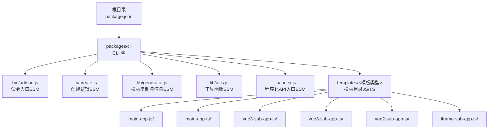
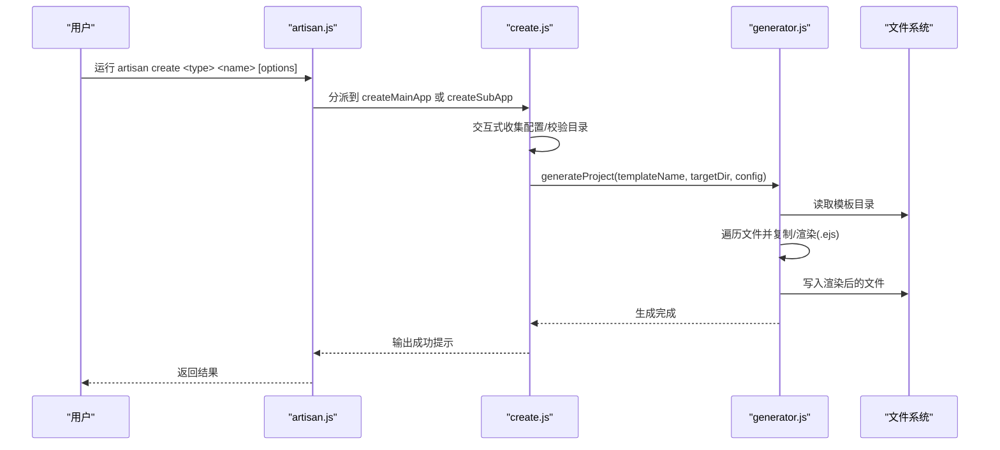
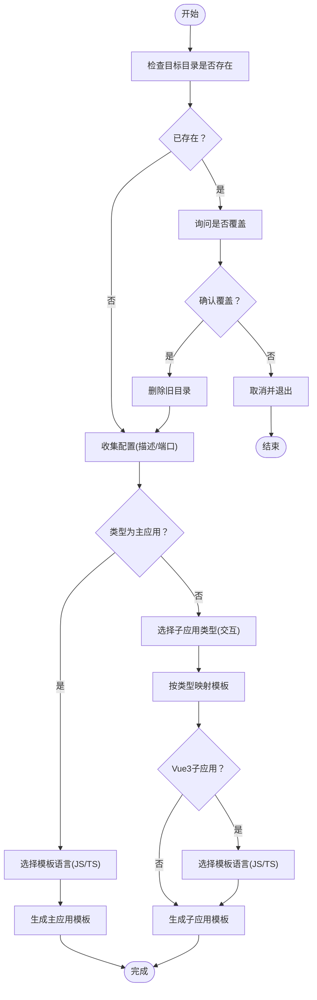
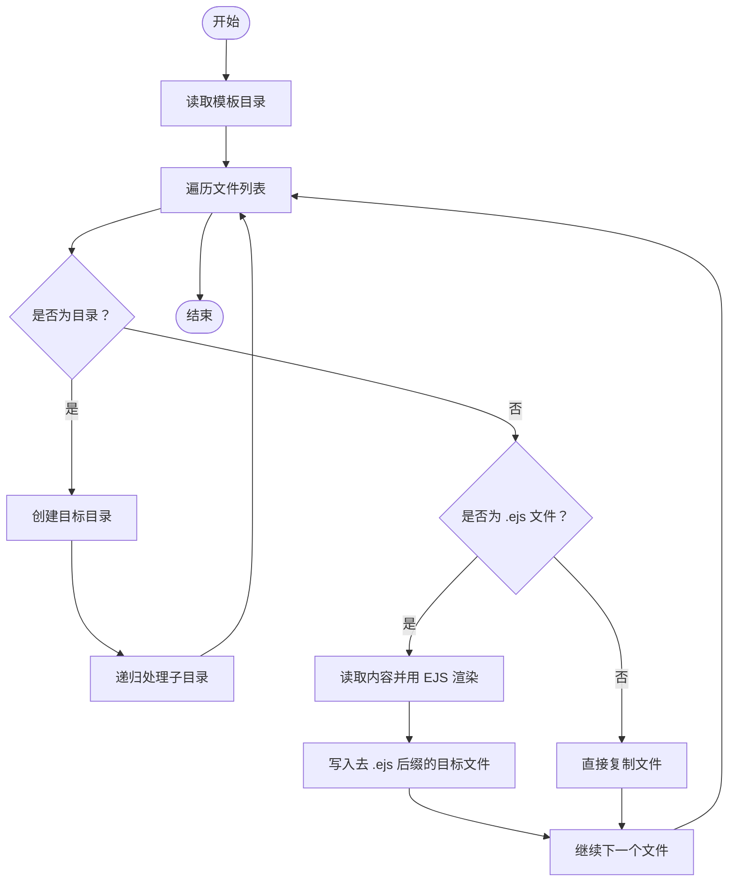
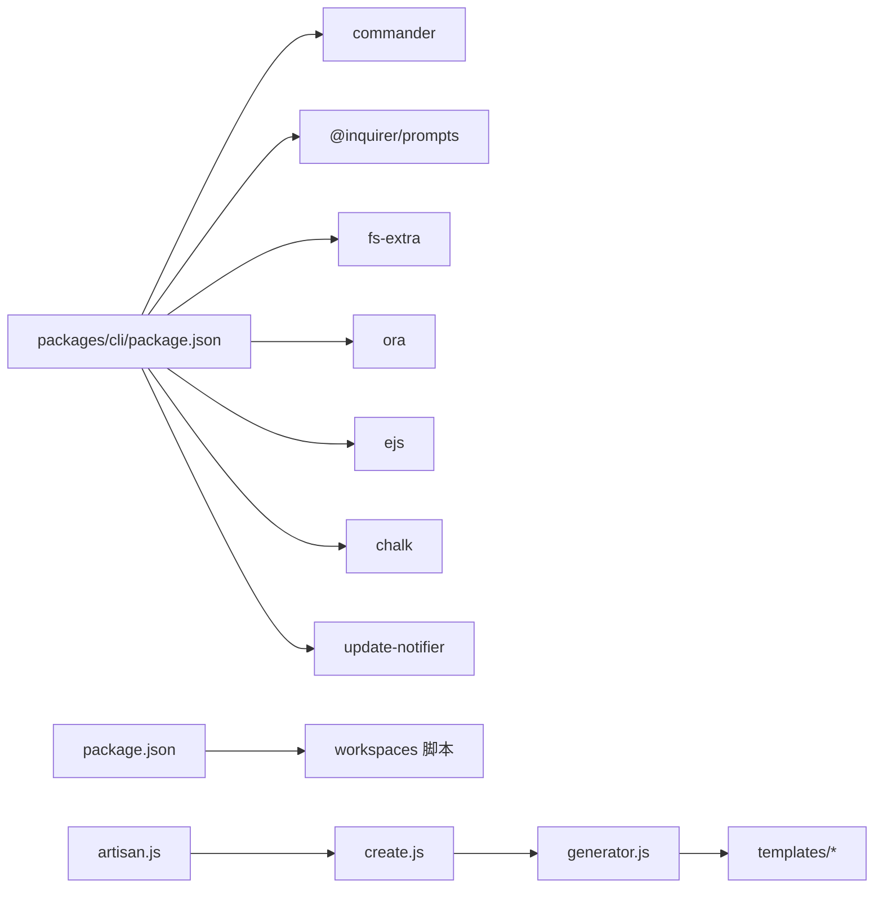

# CLI工具链

<cite>
**本文引用的文件**
- [README.md](file://README.md)
- [package.json](file://package.json)
- [packages/cli/bin/artisan.js](file://packages/cli/bin/artisan.js)
- [packages/cli/lib/create.js](file://packages/cli/lib/create.js)
- [packages/cli/lib/generator.js](file://packages/cli/lib/generator.js)
- [packages/cli/lib/utils.js](file://packages/cli/lib/utils.js)
- [packages/cli/lib/index.js](file://packages/cli/lib/index.js)
- [packages/cli/package.json](file://packages/cli/package.json)
- [packages/cli/templates/main-app-js/package.json.ejs](file://packages/cli/templates/main-app-js/package.json.ejs)
- [packages/cli/templates/main-app-ts/package.json.ejs](file://packages/cli/templates/main-app-ts/package.json.ejs)
- [packages/cli/templates/main-app-js/src/main.js](file://packages/cli/templates/main-app-js/src/main.js)
- [packages/cli/templates/main-app-ts/src/main.ts](file://packages/cli/templates/main-app-ts/src/main.ts)
- [packages/cli/templates/vue3-sub-app-js/package.json.ejs](file://packages/cli/templates/vue3-sub-app-js/package.json.ejs)
- [packages/cli/templates/vue3-sub-app-ts/package.json.ejs](file://packages/cli/templates/vue3-sub-app-ts/package.json.ejs)
- [packages/cli/templates/vue2-sub-app-js/package.json.ejs](file://packages/cli/templates/vue2-sub-app-js/package.json.ejs)
- [packages/cli/templates/iframe-sub-app-js/package.json.ejs](file://packages/cli/templates/iframe-sub-app-js/package.json.ejs)
</cite>

## 目录
1. [简介](#简介)
2. [项目结构](#项目结构)
3. [核心组件](#核心组件)
4. [架构总览](#架构总览)
5. [详细组件分析](#详细组件分析)
6. [依赖关系分析](#依赖关系分析)
7. [性能与可维护性](#性能与可维护性)
8. [故障排查指南](#故障排查指南)
9. [结论](#结论)
10. [附录：使用示例与最佳实践](#附录使用示例与最佳实践)

## 简介
本指南面向需要快速搭建微前端项目的开发者，系统讲解 Artisan CLI 工具链的安装、使用与扩展方法。内容涵盖：
- CLI 的功能特性与使用场景
- create 命令的选项与参数详解（主应用创建、子应用生成、模板选择）
- 内部实现机制（命令解析、交互式问答、模板渲染与文件生成）
- 自定义模板开发与扩展
- 常用命令示例、批量操作技巧与自动化集成建议

**更新** 本版本已迁移到ESM架构，新增JS/TS模板支持，改进项目创建流程，并添加版本信息命令。

## 项目结构
该仓库采用 Monorepo 架构，CLI 工具位于 packages/cli 中，提供全局命令 artisan，用于一键生成主应用与多种类型的子应用。

```mermaid
graph TB
A["根目录<br/>package.json"] --> B["packages/cli<br/>CLI 包"]
B --> C["bin/artisan.js<br/>命令入口ESM"]
B --> D["lib/create.js<br/>创建逻辑ESM"]
B --> E["lib/generator.js<br/>模板复制与渲染ESM"]
B --> F["lib/utils.js<br/>工具函数ESM"]
B --> G["lib/index.js<br/>程序化API入口ESM"]
B --> H["templates/<模板类型><br/>模板目录JS/TS"]
H --> H1["main-app-js/"]
H --> H2["main-app-ts/"]
H --> H3["vue3-sub-app-js/"]
H --> H4["vue3-sub-app-ts/"]
H --> H5["vue2-sub-app-js/"]
H --> H6["iframe-sub-app-js/"]
```

**章节来源**
- [package.json:1-50](file://package.json#L1-L50)
- [packages/cli/bin/artisan.js:1-86](file://packages/cli/bin/artisan.js#L1-L86)
- [packages/cli/lib/create.js:1-171](file://packages/cli/lib/create.js#L1-L171)
- [packages/cli/lib/generator.js:1-59](file://packages/cli/lib/generator.js#L1-L59)
- [packages/cli/lib/utils.js:1-57](file://packages/cli/lib/utils.js#L1-L57)
- [packages/cli/lib/index.js:1-8](file://packages/cli/lib/index.js#L1-L8)
- [packages/cli/package.json:1-37](file://packages/cli/package.json#L1-L37)

## 核心组件
- 命令入口与路由
  - 负责注册命令、解析参数、打印帮助与版本信息，并分发到具体创建流程。
- 创建逻辑
  - 主应用与子应用分别封装了交互式问答、目标目录检查与覆盖确认、模板映射与生成。
- 模板系统
  - 基于 EJS 渲染，支持 .ejs 文件自动去除后缀并写入渲染结果；普通文件直接复制。
- 工具函数
  - 提供目录空判断、名称格式化与校验、统一日志输出等辅助能力。

**章节来源**
- [packages/cli/bin/artisan.js:1-86](file://packages/cli/bin/artisan.js#L1-L86)
- [packages/cli/lib/create.js:1-171](file://packages/cli/lib/create.js#L1-L171)
- [packages/cli/lib/generator.js:1-59](file://packages/cli/lib/generator.js#L1-L59)
- [packages/cli/lib/utils.js:1-57](file://packages/cli/lib/utils.js#L1-L57)

## 架构总览
CLI 的执行路径从命令入口开始，根据用户输入的子命令与选项，调用对应的创建函数；创建函数收集必要配置后，委托生成器完成模板复制与渲染，最终在目标目录产出可直接使用的项目骨架。

```mermaid
sequenceDiagram
participant U as "用户"
participant CLI as "artisan.js"
participant C as "create.js"
participant G as "generator.js"
participant FS as "文件系统"
U->>CLI : 运行 artisan create <type> <name> [options]
CLI->>C : 分派到 createMainApp 或 createSubApp
C->>C : 交互式收集配置/校验目录
C->>G : generateProject(templateName, targetDir, config)
G->>FS : 读取模板目录
G->>G : 遍历文件并复制/渲染(.ejs)
G->>FS : 写入渲染后的文件
G-->>C : 生成完成
C-->>CLI : 输出成功提示
CLI-->>U : 返回结果
```

**图表来源**
- [packages/cli/bin/artisan.js:29-51](file://packages/cli/bin/artisan.js#L29-L51)
- [packages/cli/lib/create.js:11-73](file://packages/cli/lib/create.js#L11-L73)
- [packages/cli/lib/generator.js:14-27](file://packages/cli/lib/generator.js#L14-L27)

## 详细组件分析

### 命令入口与参数解析
- 命令注册
  - create 命令：接收类型与名称，支持 --type、--port、--dir、--js、--ts 等选项。
  - list 命令：列举可用模板类型与简要说明。
  - info 命令：显示 CLI 版本与依赖信息。
- 错误处理
  - 对未知类型进行提示并退出；捕获创建异常并输出错误信息。
- 版本与描述
  - 通过 package.json 注入版本与描述信息。

**章节来源**
- [packages/cli/bin/artisan.js:16-84](file://packages/cli/bin/artisan.js#L16-L84)
- [packages/cli/package.json:1-37](file://packages/cli/package.json#L1-L37)

### 创建逻辑（主应用与子应用）
- 主应用创建
  - 检查目标目录是否存在，若存在则询问是否覆盖；收集描述与端口；选择JS/TS模板语言；调用生成器产出模板。
- 子应用创建
  - 若未指定类型，则通过交互式列表选择；按类型映射到对应模板；收集描述与端口；调用生成器产出模板。
- 模板语言支持
  - 主应用支持 JS/TS 两种模板语言
  - 子应用 Vue3 支持 JS/TS，Vue2 和 iframe 仅支持 JS
- 端口默认值
  - 主应用默认端口来自用户输入或固定值；子应用根据类型映射默认端口。

```mermaid
flowchart TD
Start(["开始"]) --> CheckDir["检查目标目录是否存在"]
CheckDir --> Exists{"已存在？"}
Exists --> |是| Confirm["询问是否覆盖"]
Confirm --> Overwrite{"确认覆盖？"}
Overwrite --> |否| Cancel["取消并退出"]
Overwrite --> |是| Remove["删除旧目录"]
Exists --> |否| Collect["收集配置(描述/端口)"]
Remove --> Collect
Collect --> Type{"类型为主应用？"}
Type --> |是| LangSel["选择模板语言(JS/TS)"]
LangSel --> GenMain["生成主应用模板"]
Type --> |否| SelectType["选择子应用类型(交互)"]
SelectType --> MapType["按类型映射模板"]
MapType --> LangCheck{"Vue3子应用？"}
LangCheck --> |是| LangSel2["选择模板语言(JS/TS)"]
LangCheck --> |否| GenSub["生成子应用模板"]
LangSel2 --> GenSub
GenMain --> Done(["完成"])
GenSub --> Done
Cancel --> End(["结束"])
```

**图表来源**
- [packages/cli/lib/create.js:11-73](file://packages/cli/lib/create.js#L11-L73)
- [packages/cli/lib/create.js:78-169](file://packages/cli/lib/create.js#L78-L169)

**章节来源**
- [packages/cli/lib/create.js:11-73](file://packages/cli/lib/create.js#L11-L73)
- [packages/cli/lib/create.js:78-169](file://packages/cli/lib/create.js#L78-L169)

### 模板系统与文件生成
- 模板目录
  - templates 下按类型划分模板，每个模板包含若干 .ejs 文件（如 README.md.ejs、package.json.ejs）。
  - 新增 JS/TS 双模板支持，主应用和子应用均提供 JS 和 TS 版本。
- 生成流程
  - 读取模板目录，递归遍历文件；对目录递归复制；对 .ejs 文件先读取内容，再用 EJS 渲染，最后写入去 .ejs 后缀的目标文件；普通文件直接复制。
- 渲染变量
  - 模板中可使用 name、description、port、language 等变量，由配置对象传入。

```mermaid
flowchart TD
TStart(["开始"]) --> ReadT["读取模板目录"]
ReadT --> ListF["遍历文件列表"]
ListF --> IsDir{"是否为目录？"}
IsDir --> |是| MkDir["创建目标目录"] --> Recurse["递归处理子目录"] --> ListF
IsDir --> |否| IsEJS{"是否为 .ejs 文件？"}
IsEJS --> |是| Render["读取内容并用 EJS 渲染"] --> Write["写入去 .ejs 后缀的目标文件"]
IsEJS --> |否| Copy["直接复制文件"]
Write --> Next["继续下一个文件"]
Copy --> Next
Next --> ListF
ListF --> TEnd(["结束"])
```

**图表来源**
- [packages/cli/lib/generator.js:14-27](file://packages/cli/lib/generator.js#L14-L27)
- [packages/cli/lib/generator.js:34-57](file://packages/cli/lib/generator.js#L34-L57)

**章节来源**
- [packages/cli/lib/generator.js:1-59](file://packages/cli/lib/generator.js#L1-L59)
- [packages/cli/templates/main-app-js/package.json.ejs:1-36](file://packages/cli/templates/main-app-js/package.json.ejs#L1-L36)
- [packages/cli/templates/main-app-ts/package.json.ejs:1-40](file://packages/cli/templates/main-app-ts/package.json.ejs#L1-L40)
- [packages/cli/templates/vue3-sub-app-js/package.json.ejs:1-22](file://packages/cli/templates/vue3-sub-app-js/package.json.ejs#L1-L22)
- [packages/cli/templates/vue3-sub-app-ts/package.json.ejs:1-22](file://packages/cli/templates/vue3-sub-app-ts/package.json.ejs#L1-L22)
- [packages/cli/templates/vue2-sub-app-js/package.json.ejs:1-22](file://packages/cli/templates/vue2-sub-app-js/package.json.ejs#L1-L22)
- [packages/cli/templates/iframe-sub-app-js/package.json.ejs:1-22](file://packages/cli/templates/iframe-sub-app-js/package.json.ejs#L1-L22)

### 工具函数
- 目录空判断：用于辅助检查工作区状态。
- 名称格式化与校验：保证项目名符合规范。
- 日志输出：统一成功/错误/信息提示风格。

**章节来源**
- [packages/cli/lib/utils.js:1-57](file://packages/cli/lib/utils.js#L1-L57)

## 依赖关系分析
- CLI 包依赖
  - commander：命令行参数解析与子命令注册
  - @inquirer/prompts：交互式问答
  - fs-extra：文件系统操作（读写、复制、递归创建等）
  - ora：加载动画
  - ejs：模板渲染
  - chalk：彩色日志输出
  - update-notifier：版本更新检查
- 与根工程的关系
  - 根 package.json 定义了工作区与脚本，CLI 作为独立包提供全局命令 artisan。

```mermaid
graph LR
P["packages/cli/package.json"] --> CMDR["commander"]
P --> IQ["@inquirer/prompts"]
P --> FSE["fs-extra"]
P --> ORA["ora"]
P --> EJS["ejs"]
P --> CHK["chalk"]
P --> UN["update-notifier"]
R["package.json"] --> WS["workspaces 脚本"]
CLI["artisan.js"] --> CREATE["create.js"]
CREATE --> GEN["generator.js"]
GEN --> TPL["templates/*"]
```

**图表来源**
- [packages/cli/package.json:16-24](file://packages/cli/package.json#L16-L24)
- [packages/cli/bin/artisan.js:3-7](file://packages/cli/bin/artisan.js#L3-L7)
- [packages/cli/lib/create.js:1-6](file://packages/cli/lib/create.js#L1-L6)
- [packages/cli/lib/generator.js:1-3](file://packages/cli/lib/generator.js#L1-L3)
- [package.json:6-26](file://package.json#L6-L26)

**章节来源**
- [packages/cli/package.json:1-37](file://packages/cli/package.json#L1-L37)
- [package.json:1-50](file://package.json#L1-L50)

## 性能与可维护性
- 性能特征
  - 文件复制与模板渲染为 IO 密集型，整体耗时主要取决于磁盘性能与模板规模。
  - 递归遍历模板目录的时间复杂度近似 O(N)，N 为模板文件总数。
- 可维护性
  - 将模板与生成逻辑解耦，便于新增模板类型与调整渲染规则。
  - 统一的日志与错误处理，提升可观测性与调试效率。

## 故障排查指南
- 无法找到命令
  - 确认已在 packages/cli 目录执行全局链接或安装后再使用。
- 创建失败
  - 检查目标目录权限与磁盘空间；查看控制台错误信息定位具体步骤。
- 模板不存在
  - 确认模板名称与类型映射一致；检查 templates 目录结构。
- 端口冲突
  - 修改 --port 选项或释放被占用端口。
- Node.js 版本不兼容
  - 确保 Node.js 版本 >= 20.0.0。

**章节来源**
- [packages/cli/bin/artisan.js:47-51](file://packages/cli/bin/artisan.js#L47-L51)
- [packages/cli/lib/generator.js:18-20](file://packages/cli/lib/generator.js#L18-L20)
- [packages/cli/lib/create.js:118-123](file://packages/cli/lib/create.js#L118-L123)
- [packages/cli/package.json:25-27](file://packages/cli/package.json#L25-L27)

## 结论
Artisan CLI 工具链通过清晰的命令结构、交互式配置与强大的模板系统，显著降低了微前端项目的初始化成本。本次更新迁移到ESM架构，新增JS/TS模板支持，改进项目创建流程，并添加版本信息命令，进一步提升了工具链的现代化程度和用户体验。结合本文的使用指南与扩展方法，开发者可以快速上手并按需定制模板，形成团队内一致的脚手架标准。

## 附录：使用示例与最佳实践

### 安装与全局链接
- 在 CLI 包目录执行全局链接，使 artisan 命令可在任意位置使用。

**章节来源**
- [README.md:80-84](file://README.md#L80-L84)

### 常用命令
- 显示版本信息
  - artisan info
- 列出模板
  - artisan list
- 创建主应用（JavaScript）
  - artisan create main-app <项目名> --js [--dir <目标目录>] [--port <端口>]
- 创建主应用（TypeScript）
  - artisan create main-app <项目名> --ts [--dir <目标目录>] [--port <端口>]
- 创建子应用（JavaScript）
  - artisan create sub-app <项目名> --type vue3 --js [--dir <目标目录>] [--port <端口>]
- 创建子应用（TypeScript）
  - artisan create sub-app <项目名> --type vue3 --ts [--dir <目标目录>] [--port <端口>]

**章节来源**
- [packages/cli/bin/artisan.js:67-84](file://packages/cli/bin/artisan.js#L67-L84)
- [packages/cli/bin/artisan.js:29-51](file://packages/cli/bin/artisan.js#L29-L51)
- [README.md:85-96](file://README.md#L85-L96)

### 参数详解
- create 命令
  - type：主应用或子应用
  - name：项目名称（将用于生成 package.json 与 README 中的名称字段）
  - --type：子应用类型（vue3、vue2、iframe）
  - --port：开发服务器端口（可选，默认值见"默认端口"）
  - --dir：目标目录（默认当前目录）
  - --js：使用 JavaScript 模板（含 TS 类型支持）
  - --ts：使用 TypeScript 模板（兼容 JS 写法）

**章节来源**
- [packages/cli/bin/artisan.js:24-28](file://packages/cli/bin/artisan.js#L24-L28)
- [packages/cli/lib/create.js:118-139](file://packages/cli/lib/create.js#L118-L139)

### 默认端口
- 主应用：8080
- 子应用
  - vue3：7080
  - vue2：3000
  - iframe：9080

**章节来源**
- [packages/cli/lib/create.js:108-112](file://packages/cli/lib/create.js#L108-L112)

### 模板语言选择
- 主应用支持 JS/TS 两种模板语言
- 子应用 Vue3 支持 JS/TS，Vue2 和 iframe 仅支持 JS
- 未指定语言时，会通过交互式选择确定模板语言

**章节来源**
- [packages/cli/lib/create.js:40-47](file://packages/cli/lib/create.js#L40-L47)
- [packages/cli/lib/create.js:127-136](file://packages/cli/lib/create.js#L127-L136)

### 模板变量与渲染
- 可用变量
  - name：项目名
  - description：项目描述
  - port：端口号
  - language：模板语言（js/ts）
- 渲染规则
  - .ejs 文件会被渲染并写入去 .ejs 后缀的文件；普通文件直接复制。

**章节来源**
- [packages/cli/lib/generator.js:14-14](file://packages/cli/lib/generator.js#L14-L14)
- [packages/cli/templates/main-app-js/package.json.ejs:1-36](file://packages/cli/templates/main-app-js/package.json.ejs#L1-L36)
- [packages/cli/templates/main-app-ts/package.json.ejs:1-40](file://packages/cli/templates/main-app-ts/package.json.ejs#L1-L40)

### 自定义模板开发指南
- 新增模板类型
  - 在 templates 下新建目录（例如 my-type-js、my-type-ts），添加所需文件（如 package.json.ejs、README.md.ejs）。
  - 在创建逻辑中增加类型映射，将新类型映射到模板目录名。
- 修改渲染变量
  - 在模板中使用 EJS 语法引用变量；在配置对象中提供对应键值。
- 扩展交互流程
  - 如需更多交互项，可在创建函数中追加 @inquirer/prompts 问题与默认值逻辑。
- 注意事项
  - 保持模板文件命名规范，.ejs 文件将被自动渲染；普通文件保持原样复制。
  - 确保模板中的脚本与依赖与项目实际需求一致。

**章节来源**
- [packages/cli/lib/create.js:148-152](file://packages/cli/lib/create.js#L148-L152)
- [packages/cli/lib/generator.js:34-57](file://packages/cli/lib/generator.js#L34-L57)

### 程序化API使用
- 直接调用
  - 通过 @artisan/cli 程序化接口直接创建项目，无需通过命令行。
- 导出接口
  - createMainApp、createSubApp：项目创建函数
  - generateProject、copyTemplate：模板生成函数
  - isDirEmpty、formatName、validateName：工具函数

**章节来源**
- [packages/cli/lib/index.js:5-7](file://packages/cli/lib/index.js#L5-L7)

### 批量操作与自动化集成
- 批量创建
  - 通过循环脚本依次调用 artisan create 命令，传入不同名称与端口，实现多应用快速初始化。
- CI/CD 集成
  - 在流水线中执行全局链接与创建命令，随后执行安装与构建脚本，确保环境一致性。
- 团队规范
  - 统一模板与默认端口策略，减少配置分歧；在团队文档中记录模板变量与交互项变更。

### 示例产物参考
- 主应用 JavaScript 模板示例
  - 参考：packages/cli/templates/main-app-js/package.json.ejs
  - 参考：packages/cli/templates/main-app-js/src/main.js
- 主应用 TypeScript 模板示例
  - 参考：packages/cli/templates/main-app-ts/package.json.ejs
  - 参考：packages/cli/templates/main-app-ts/src/main.ts
- 子应用 JavaScript 模板示例
  - 参考：packages/cli/templates/vue3-sub-app-js/package.json.ejs
  - 参考：packages/cli/templates/vue2-sub-app-js/package.json.ejs
  - 参考：packages/cli/templates/iframe-sub-app-js/package.json.ejs
- 子应用 TypeScript 模板示例
  - 参考：packages/cli/templates/vue3-sub-app-ts/package.json.ejs

**章节来源**
- [packages/cli/templates/main-app-js/package.json.ejs:1-36](file://packages/cli/templates/main-app-js/package.json.ejs#L1-L36)
- [packages/cli/templates/main-app-ts/package.json.ejs:1-40](file://packages/cli/templates/main-app-ts/package.json.ejs#L1-L40)
- [packages/cli/templates/main-app-js/src/main.js:1-50](file://packages/cli/templates/main-app-js/src/main.js#L1-L50)
- [packages/cli/templates/main-app-ts/src/main.ts:1-50](file://packages/cli/templates/main-app-ts/src/main.ts#L1-L50)
- [packages/cli/templates/vue3-sub-app-js/package.json.ejs:1-22](file://packages/cli/templates/vue3-sub-app-js/package.json.ejs#L1-L22)
- [packages/cli/templates/vue3-sub-app-ts/package.json.ejs:1-22](file://packages/cli/templates/vue3-sub-app-ts/package.json.ejs#L1-L22)
- [packages/cli/templates/vue2-sub-app-js/package.json.ejs:1-22](file://packages/cli/templates/vue2-sub-app-js/package.json.ejs#L1-L22)
- [packages/cli/templates/iframe-sub-app-js/package.json.ejs:1-22](file://packages/cli/templates/iframe-sub-app-js/package.json.ejs#L1-L22)