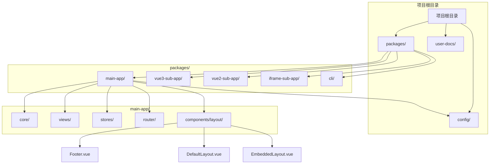
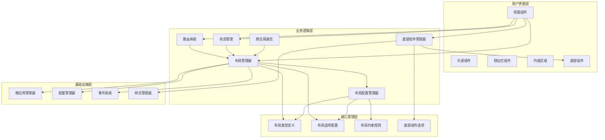
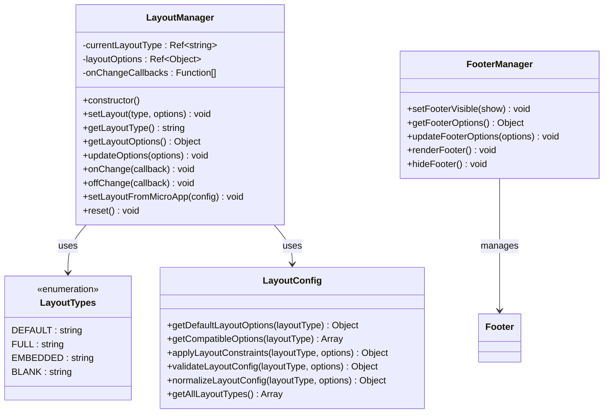
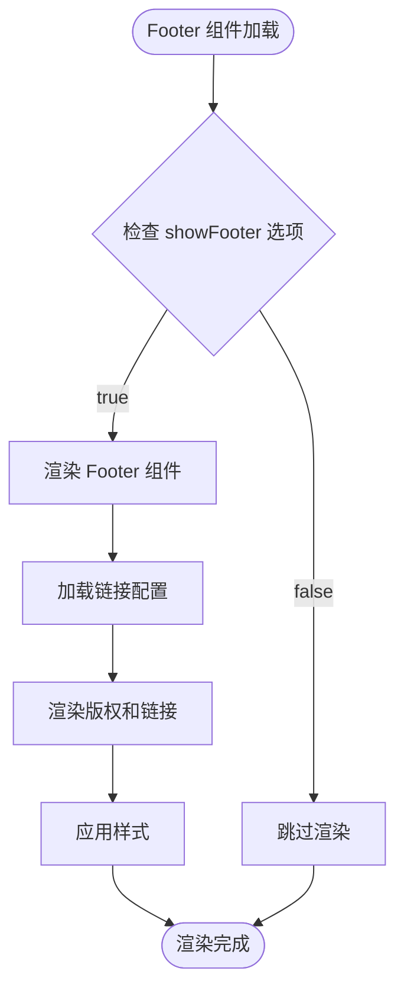
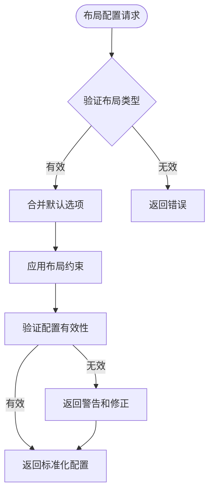
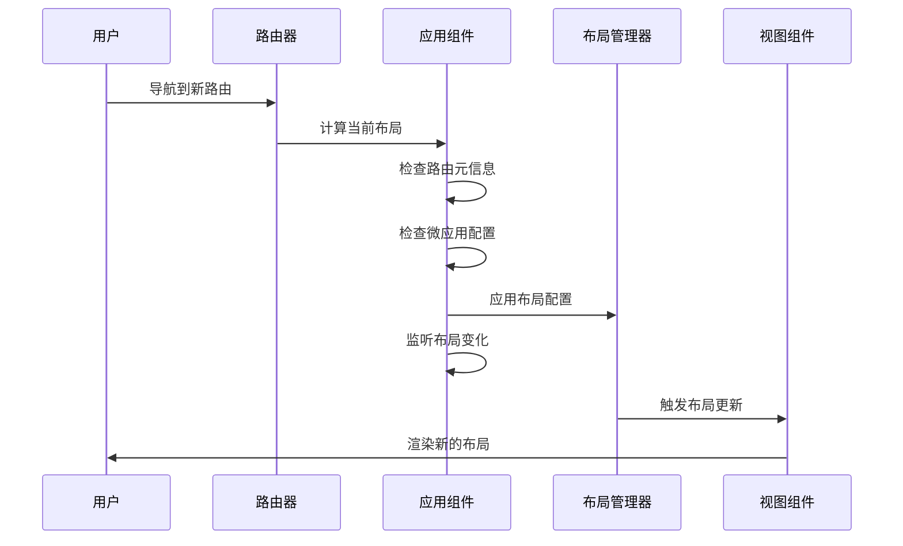
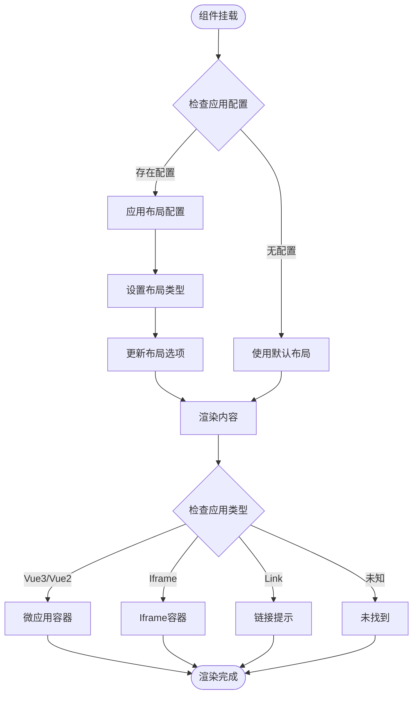
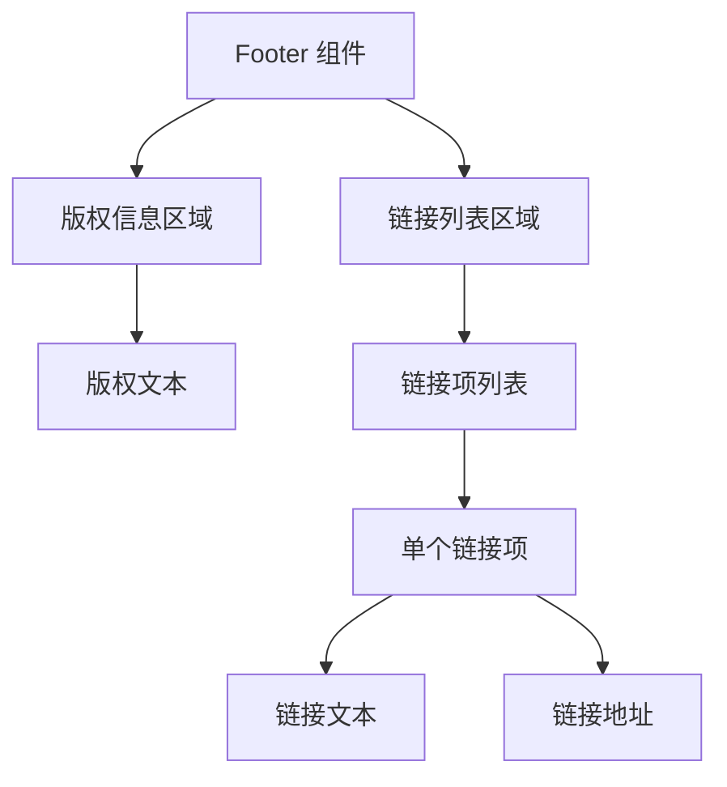

# 布局管理指南

<cite>
**本文档引用的文件**
- [README.md](file://README.md)
- [layout-system.md](file://user-docs/guide/layout-system.md)
- [layoutManager.js](file://packages/main-app/src/core/layoutManager.js)
- [layoutConfig.js](file://packages/main-app/src/config/layoutConfig.js)
- [index.js](file://packages/main-app/src/router/index.js)
- [SubAppPage.vue](file://packages/main-app/src/views/SubAppPage.vue)
- [app.js](file://packages/main-app/src/stores/app.js)
- [main.js](file://packages/main-app/src/main.js)
- [package.json](file://packages/main-app/package.json)
- [App.vue](file://packages/main-app/src/App.vue)
- [Footer.vue](file://packages/main-app/src/components/layout/Footer.vue)
- [DefaultLayout.vue](file://packages/main-app/src/components/layout/DefaultLayout.vue)
- [EmbeddedLayout.vue](file://packages/main-app/src/components/layout/EmbeddedLayout.vue)
- [variables.scss](file://packages/main-app/src/assets/styles/variables.scss)
</cite>

## 更新摘要
**所做更改**
- 移除了多标签页布局相关内容的说明
- 新增了 Footer 组件的详细集成说明和使用指南
- 更新了布局类型为4种标准类型（默认、全屏、嵌入式、空白）
- 增强了布局配置管理和验证机制的说明
- 完善了布局系统的整体架构描述

## 目录
1. [简介](#简介)
2. [项目结构概览](#项目结构概览)
3. [核心组件分析](#核心组件分析)
4. [架构设计](#架构设计)
5. [详细组件解析](#详细组件解析)
6. [布局类型详解](#布局类型详解)
7. [Footer 组件详解](#footer-组件详解)
8. [使用方式与最佳实践](#使用方式与最佳实践)
9. [性能优化建议](#性能优化建议)
10. [故障排除指南](#故障排除指南)
11. [总结](#总结)

## 简介

Artisan Base Frontend 是一个企业级微前端基础平台脚手架，基于 Monorepo 架构构建，支持 Vue3 主应用和多种类型的子应用。该项目的核心特性之一是其强大的布局编排系统，支持 4 种不同的布局类型，为开发者提供了灵活的界面定制能力。

布局管理系统是整个微前端架构中的关键组件，负责动态控制应用的界面布局、导航结构和用户体验。通过统一的布局管理器，开发者可以轻松实现不同应用场景下的界面切换和配置。

**更新** 新增了 Footer 组件支持，现支持默认、全屏、嵌入式、空白四种布局类型，其中默认布局和嵌入式布局支持 Footer 显示控制。

## 项目结构概览

该项目采用 Monorepo 架构，主要包含以下核心目录：



**图表来源**
- [README.md:68-82](file://README.md#L68-L82)
- [package.json:1-35](file://packages/main-app/package.json#L1-L35)

**章节来源**
- [README.md:68-82](file://README.md#L68-L82)
- [package.json:1-35](file://packages/main-app/package.json#L1-L35)

## 核心组件分析

布局管理系统的核心由五个主要组件构成：

### 布局管理器 (LayoutManager)
布局管理器是整个系统的核心控制器，负责管理所有布局相关的状态和操作。

### 布局配置管理器 (LayoutConfig)
布局配置管理器负责布局类型的配置、验证和标准化处理。

### Footer 组件 (Footer)
Footer 组件是一个可复用的底部布局组件，提供了统一的页面底部展示区域。

### 路由系统
路由系统负责根据 URL 路径和微应用配置来确定应该使用的布局类型。

### 视图组件
视图组件负责渲染具体的布局内容，包括头部、侧边栏、主内容区域和 Footer。

**更新** 新增了 Footer 组件，提供统一的底部布局展示能力。

**章节来源**
- [layoutManager.js:17-142](file://packages/main-app/src/core/layoutManager.js#L17-L142)
- [layoutConfig.js:1-205](file://packages/main-app/src/config/layoutConfig.js#L1-L205)
- [Footer.vue:1-72](file://packages/main-app/src/components/layout/Footer.vue#L1-L72)
- [index.js:1-155](file://packages/main-app/src/router/index.js#L1-L155)
- [SubAppPage.vue:1-261](file://packages/main-app/src/views/SubAppPage.vue#L1-L261)

## 架构设计

布局管理系统采用了分层架构设计，确保了良好的可维护性和扩展性：



**更新** 新增了 Footer 组件管理器和样式管理器，增强了布局系统的组件化管理能力。

**图表来源**
- [layoutManager.js:17-142](file://packages/main-app/src/core/layoutManager.js#L17-L142)
- [layoutConfig.js:1-205](file://packages/main-app/src/config/layoutConfig.js#L1-L205)
- [Footer.vue:1-72](file://packages/main-app/src/components/layout/Footer.vue#L1-L72)
- [index.js:113-140](file://packages/main-app/src/router/index.js#L113-L140)
- [SubAppPage.vue:194-208](file://packages/main-app/src/views/SubAppPage.vue#L194-L208)

## 详细组件解析

### 布局管理器实现

布局管理器是一个单例模式的类，提供了完整的布局管理功能：



**更新** 布局管理器现在集成了 Footer 组件管理能力，提供更完善的布局配置处理能力。

**图表来源**
- [layoutManager.js:17-142](file://packages/main-app/src/core/layoutManager.js#L17-L142)
- [layoutConfig.js:94-205](file://packages/main-app/src/config/layoutConfig.js#L94-L205)

布局管理器的关键特性包括：

1. **响应式状态管理**: 使用 Vue 的 ref 来管理布局状态，确保 UI 能够自动更新
2. **回调机制**: 支持布局变化的回调通知，便于其他组件响应布局变化
3. **配置集成**: 可以直接从微应用配置中应用布局设置
4. **类型验证**: 自动验证布局类型的有效性
5. **配置标准化**: 集成布局配置管理器，提供配置的标准化和验证
6. **Footer 控制**: 新增 Footer 显示/隐藏控制功能

**章节来源**
- [layoutManager.js:17-142](file://packages/main-app/src/core/layoutManager.js#L17-L142)
- [layoutConfig.js:94-205](file://packages/main-app/src/config/layoutConfig.js#L94-L205)

### Footer 组件实现

Footer 组件是一个独立的可复用组件，提供统一的底部布局展示：



**图表来源**
- [Footer.vue:1-72](file://packages/main-app/src/components/layout/Footer.vue#L1-L72)

**章节来源**
- [Footer.vue:1-72](file://packages/main-app/src/components/layout/Footer.vue#L1-L72)

### 布局配置管理器

布局配置管理器负责布局类型的配置、验证和标准化处理：



**图表来源**
- [layoutConfig.js:139-193](file://packages/main-app/src/config/layoutConfig.js#L139-L193)

**章节来源**
- [layoutConfig.js:1-205](file://packages/main-app/src/config/layoutConfig.js#L1-L205)

### 路由系统集成

路由系统在布局管理中扮演着关键角色，通过路由元信息来确定布局配置：



**更新** 增强了路由感知的布局切换逻辑，现在能够更好地处理从子应用到主应用页面的布局重置。

**图表来源**
- [index.js:113-140](file://packages/main-app/src/router/index.js#L113-L140)
- [App.vue:62-108](file://packages/main-app/src/App.vue#L62-L108)
- [SubAppPage.vue:194-208](file://packages/main-app/src/views/SubAppPage.vue#L194-L208)

**章节来源**
- [index.js:113-140](file://packages/main-app/src/router/index.js#L113-L140)
- [App.vue:62-149](file://packages/main-app/src/App.vue#L62-L149)
- [SubAppPage.vue:194-208](file://packages/main-app/src/views/SubAppPage.vue#L194-L208)

### 视图组件实现

子应用页面组件负责处理不同类型的微应用容器：



**图表来源**
- [SubAppPage.vue:46-95](file://packages/main-app/src/views/SubAppPage.vue#L46-L95)

**章节来源**
- [SubAppPage.vue:46-95](file://packages/main-app/src/views/SubAppPage.vue#L46-L95)

## 布局类型详解

### 默认布局 (Default)

默认布局是最常用的布局类型，包含完整的头部、侧边栏和 Footer，适用于大多数应用场景。

**配置示例**：
```javascript
{
  layoutType: 'default',
  layoutOptions: {
    showHeader: true,
    showSidebar: true,
    showFooter: false,
    keepAlive: false
  }
}
```

### 全屏布局 (Full)

全屏布局移除了头部和侧边栏，使子应用占据整个页面空间，适用于需要沉浸式体验的应用场景。

**配置示例**：
```javascript
{
  layoutType: 'full',
  layoutOptions: {
    showHeader: false,
    showSidebar: false,
    showFooter: false,
    keepAlive: false
  }
}
```

### 嵌入式布局 (Embedded)

嵌入式布局允许子应用嵌入到现有页面中，而不会替换主路由，适用于需要在现有页面中展示子功能的场景。

**配置示例**：
```javascript
{
  layoutType: 'embedded',
  layoutOptions: {
    showHeader: true,
    showSidebar: false,
    showFooter: false,
    keepAlive: false
  }
}
```

### 空白布局 (Blank)

空白布局提供完全空白的界面，适用于登录页、错误页面等独立页面场景。

**配置示例**：
```javascript
{
  layoutType: 'blank',
  layoutOptions: {
    showHeader: false,
    showSidebar: false,
    showFooter: false,
    keepAlive: false
  }
}
```

**更新** 移除了多标签页布局类型的支持说明，现支持四种标准布局类型。

**章节来源**
- [layout-system.md:7-15](file://user-docs/guide/layout-system.md#L7-L15)
- [layoutConfig.js:26-87](file://packages/main-app/src/config/layoutConfig.js#L26-L87)

## Footer 组件详解

### 组件概述

Footer 组件是一个可复用的底部布局组件，提供了统一的页面底部展示区域，包含版权信息和快捷链接。

### 功能特性

- ✅ 统一的版权信息展示
- ✅ 可配置的快捷链接列表
- ✅ 响应式布局支持
- ✅ 与布局系统无缝集成
- ✅ 支持显示/隐藏控制

### 组件结构



**图表来源**
- [Footer.vue:1-72](file://packages/main-app/src/components/layout/Footer.vue#L1-L72)

### 配置选项

| 选项 | 类型 | 默认值 | 说明 |
|------|------|--------|------|
| showFooter | Boolean | false | 是否显示底部 Footer 组件 |

### 样式定制

Footer 组件使用统一的样式变量：

```scss
$footer-height: 50px; // Footer 高度
```

**章节来源**
- [Footer.vue:1-72](file://packages/main-app/src/components/layout/Footer.vue#L1-L72)
- [variables.scss](file://packages/main-app/src/assets/styles/variables.scss#L33)

### 布局集成

Footer 组件已集成到以下布局中：

#### DefaultLayout (默认布局)
```vue
<template>
  <div class="default-layout">
    <el-container class="layout-container">
      <Sider v-if="layoutOptions.showSidebar" />
      
      <el-container class="main-container">
        <Header v-if="layoutOptions.showHeader" />
        
        <el-main class="layout-main">
          <slot />
        </el-main>
        
        <Footer v-if="layoutOptions.showFooter" />
      </el-container>
    </el-container>
  </div>
</template>
```

#### EmbeddedLayout (嵌入式布局)
```vue
<template>
  <div class="embedded-layout">
    <div class="embedded-container">
      <Sider v-if="layoutOptions.showSidebar" />
      
      <div class="embedded-main">
        <Header v-if="layoutOptions.showHeader" />
        
        <div class="embedded-content">
          <slot />
        </div>
        
        <Footer v-if="layoutOptions.showFooter" />
      </div>
    </div>
  </div>
</template>
```

**章节来源**
- [DefaultLayout.vue:25-27](file://packages/main-app/src/components/layout/DefaultLayout.vue#L25-L27)
- [EmbeddedLayout.vue:29-31](file://packages/main-app/src/components/layout/EmbeddedLayout.vue#L29-L31)

### 使用方法

#### 通过 layoutManager 控制
```javascript
import { layoutManager } from '@/core/layoutManager'

// 显示底部
layoutManager.updateOptions({ showFooter: true })

// 隐藏底部
layoutManager.updateOptions({ showFooter: false })
```

#### 在子应用配置中使用
```javascript
{
  name: 'vue3-app',
  entry: '//localhost:7101',
  layoutType: 'default',
  layoutOptions: {
    showHeader: true,
    showSidebar: true,
    showFooter: true,  // 启用底部
    keepAlive: false
  }
}
```

#### 在应用管理界面配置
在应用管理界面编辑子应用时，可以在"布局配置"部分找到"显示底部"选项。

**章节来源**
- [layout-system.md:33-51](file://user-docs/guide/layout-system.md#L33-L51)

### 最佳实践

1. **性能考虑**: Footer 组件默认不显示，按需开启
2. **响应式设计**: Footer 会自动适应容器宽度
3. **内容高度**: 当启用 Footer 时，确保主内容区有足够空间
4. **样式冲突**: 自定义样式时注意避免与 Element Plus 冲突

**章节来源**
- [layout-system.md:1-118](file://user-docs/guide/layout-system.md#L1-L118)

## 使用方式与最佳实践

### 路由级别配置

可以在路由配置中直接指定布局类型：

```javascript
const routes = [
  {
    path: '/app/:appId',
    component: SubAppPage,
    meta: {
      layout: 'default'
    }
  }
]
```

### 微应用配置

在微应用配置中设置布局类型和选项：

```javascript
{
  id: 'vue3-sub-app',
  layoutType: 'default',
  layoutOptions: {
    showHeader: true,
    showSidebar: true,
    showFooter: false,
    keepAlive: false
  }
}
```

### 动态切换布局

通过布局管理器动态切换布局：

```javascript
import { layoutManager } from '@/core/layoutManager'

// 切换布局
layoutManager.setLayout('default', {
  showHeader: true,
  showSidebar: true,
  showFooter: true
})

// 更新选项
layoutManager.updateOptions({
  showFooter: false
})
```

### 布局配置标准化

使用布局配置管理器进行配置标准化：

```javascript
import { normalizeLayoutConfig } from '@/config/layoutConfig'

// 标准化布局配置
const normalizedConfig = normalizeLayoutConfig('default', {
  showHeader: true
})

console.log(normalizedConfig)
// 输出: { layoutType: 'default', layoutOptions: { showHeader: true, showSidebar: true, showFooter: false, keepAlive: false } }
```

**更新** 新增了布局配置标准化的使用方式，提供更完善的配置处理能力。

**章节来源**
- [layout-system.md:18-51](file://user-docs/guide/layout-system.md#L18-L51)
- [layoutConfig.js:184-193](file://packages/main-app/src/config/layoutConfig.js#L184-L193)

### Footer 组件使用最佳实践

#### 嵌入式布局中的 Footer 使用
```javascript
layoutManager.setLayout('embedded', {
  showHeader: true,
  showSidebar: false,
  showFooter: true,
  keepAlive: false
})
```

#### 默认布局中的 Footer 使用
```javascript
layoutManager.setLayout('default', {
  showHeader: true,
  showSidebar: true,
  showFooter: true,
  keepAlive: false
})
```

#### 动态切换 Footer 显示
```vue
<template>
  <div>
    <button @click="toggleFooter">切换 Footer 显示</button>
    <EmbeddedLayout>
      <router-view />
    </EmbeddedLayout>
  </div>
</template>

<script setup>
import { ref } from 'vue'
import { layoutManager } from '@/core/layoutManager'

const showFooter = ref(false)

function toggleFooter() {
  showFooter.value = !showFooter.value
  layoutManager.updateOptions({ showFooter: showFooter.value })
}
</script>
```

**章节来源**
- [layout-system.md:33-51](file://user-docs/guide/layout-system.md#L33-L51)

## 性能优化建议

### 布局切换优化

1. **避免频繁布局切换**: 在短时间内避免多次切换相同的布局类型
2. **延迟初始化**: 对于复杂的布局组件，考虑使用懒加载
3. **内存管理**: 及时清理不再使用的布局资源
4. **路由缓存**: 利用 keep-alive 缓存布局组件

### 渲染优化

1. **条件渲染**: 使用 v-if 而非 v-show 来控制布局元素的显示
2. **组件复用**: 合理使用 keep-alive 缓存布局组件
3. **虚拟滚动**: 对于大量布局选项的情况，考虑使用虚拟滚动
4. **按需加载**: 布局组件按需加载，减少初始包体积

### 状态管理优化

1. **状态分离**: 将布局状态与业务状态分离
2. **响应式优化**: 避免不必要的响应式更新
3. **持久化策略**: 合理设置布局状态的持久化范围
4. **布局配置缓存**: 缓存布局配置以提高性能

### 配置管理优化

1. **配置预验证**: 在应用启动时预验证布局配置
2. **配置缓存**: 缓存布局配置以避免重复计算
3. **渐进式加载**: 按需加载布局配置，减少启动时间

### Footer 组件性能优化

1. **条件渲染**: 使用 `v-if` 而非 `v-show`，隐藏的 Footer 不会被渲染到 DOM 中
2. **链接列表优化**: 预加载常用链接，减少渲染时的计算
3. **样式缓存**: 使用 SCSS 变量统一管理样式，避免重复计算
4. **响应式更新**: Footer 组件会自动响应布局选项的变化

**更新** 新增了 Footer 组件的性能优化建议，提升整体性能表现。

## 故障排除指南

### 常见问题及解决方案

#### 布局类型无效

**问题**: 设置未知的布局类型导致警告

**解决方案**:
- 检查布局类型是否在枚举中定义
- 使用默认布局作为回退方案
- 检查布局配置管理器的验证结果

#### 布局配置冲突

**问题**: 不同来源的布局配置产生冲突

**解决方案**:
- 优先使用路由级别的配置
- 在微应用配置中明确指定布局选项
- 使用布局配置管理器进行配置标准化

#### 性能问题

**问题**: 布局切换时出现卡顿

**解决方案**:
- 检查是否有过多的 DOM 操作
- 考虑使用 CSS 过渡而非 JavaScript 动画
- 实施适当的节流和防抖机制
- 优化布局组件的渲染性能

#### 布局重置问题

**问题**: 从子应用返回主应用页面时布局未正确重置

**解决方案**:
- 检查路由守卫中的布局重置逻辑
- 确保布局管理器的 reset 方法被正确调用
- 验证布局配置的正确性

#### Footer 显示问题

**问题**: Footer 无法正常显示或隐藏

**解决方案**:
- 检查 `showFooter` 选项是否正确设置
- 确认布局类型支持 Footer（默认布局和嵌入式布局）
- 验证 Footer 组件的导入和注册
- 检查样式冲突问题

#### Footer 禁用问题

**问题**: 在全屏布局和空白布局中 Footer 选项不可用

**解决方案**:
- 这是预期行为，全屏布局和空白布局不支持 Footer
- 使用默认布局或嵌入式布局以启用 Footer
- 检查应用管理界面的禁用逻辑

**更新** 新增了 Footer 组件相关的故障排除指南，完善了问题解决流程。

**章节来源**
- [layoutManager.js:42-46](file://packages/main-app/src/core/layoutManager.js#L42-L46)
- [App.vue:130-134](file://packages/main-app/src/App.vue#L130-L134)

## 总结

Artisan Base Frontend 的布局管理系统提供了一个完整、灵活且高性能的解决方案，支持四种标准布局类型和动态配置。通过合理的架构设计和最佳实践，开发者可以轻松实现复杂的应用界面需求。

### 主要优势

1. **模块化设计**: 清晰的组件分离和职责划分
2. **响应式更新**: 基于 Vue 响应式的自动更新机制
3. **类型安全**: 严格的类型验证和错误处理
4. **扩展性强**: 易于添加新的布局类型和功能
5. **性能优化**: 考虑了实际使用中的性能需求
6. **配置管理**: 完善的布局配置标准化和验证机制
7. **路由感知**: 智能的路由感知布局切换逻辑
8. **组件化 Footer**: 独立可复用的 Footer 组件支持

### Footer 组件特色

1. **组件化设计**: 独立可复用的 Footer 组件
2. **响应式支持**: 自动适应容器宽度
3. **布局集成**: 与现有布局系统无缝集成
4. **配置灵活**: 支持运行时动态控制
5. **统一管理**: 通过 layoutManager 统一管理
6. **可视化配置**: 应用管理界面可直接配置

### 未来发展方向

1. **主题系统**: 支持自定义主题和样式变量
2. **动画系统**: 增强布局切换的动画效果
3. **移动端适配**: 优化移动端的布局表现
4. **无障碍支持**: 提升无障碍访问能力
5. **布局模板**: 提供更多布局模板和组合方式
6. **Footer 定制**: 增强 Footer 组件的个性化定制能力

通过本指南，开发者可以全面理解和使用布局管理系统，为构建高质量的微前端应用奠定坚实基础。

**更新** 完善了布局系统的整体描述，突出了新增的配置管理和 Footer 组件功能。