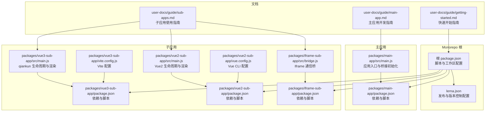
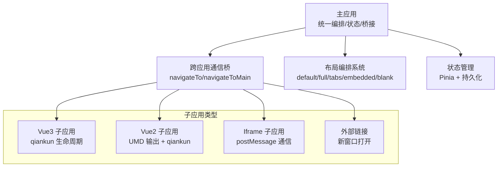
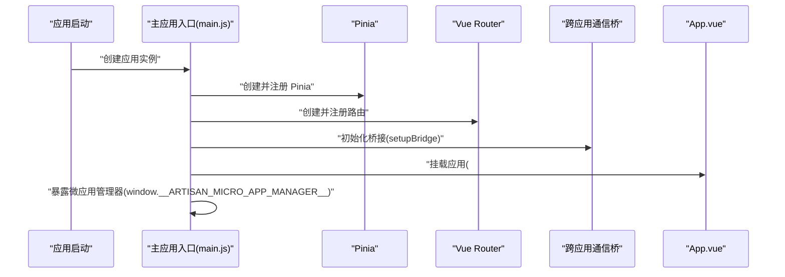
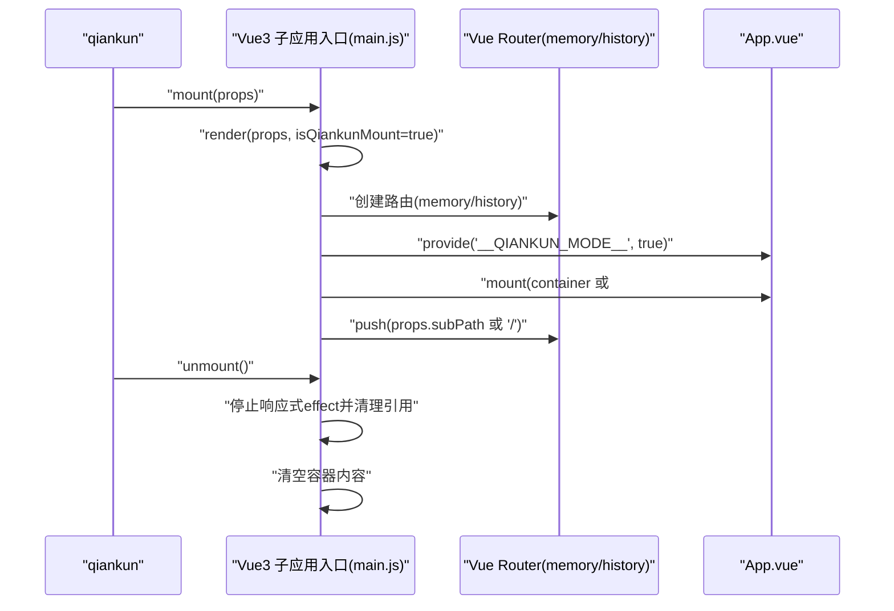
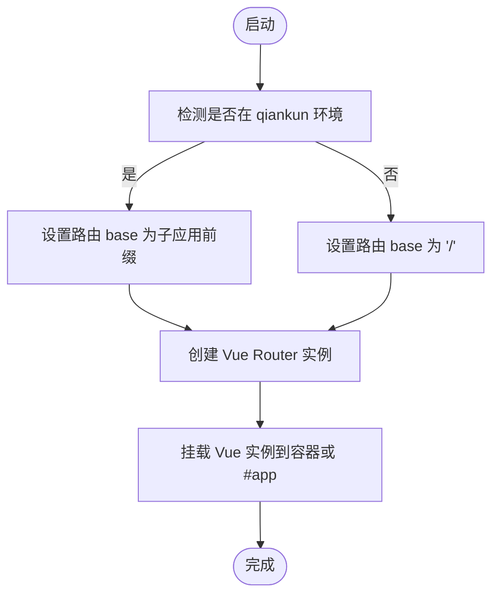
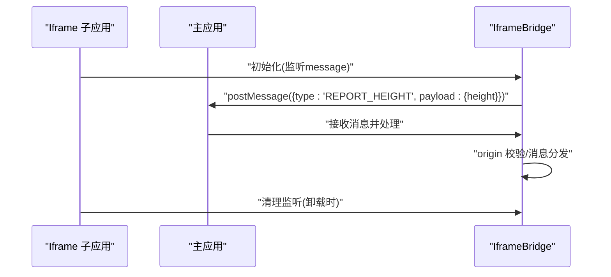
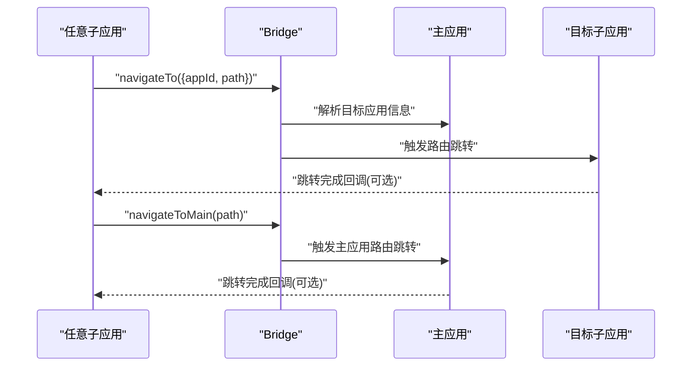
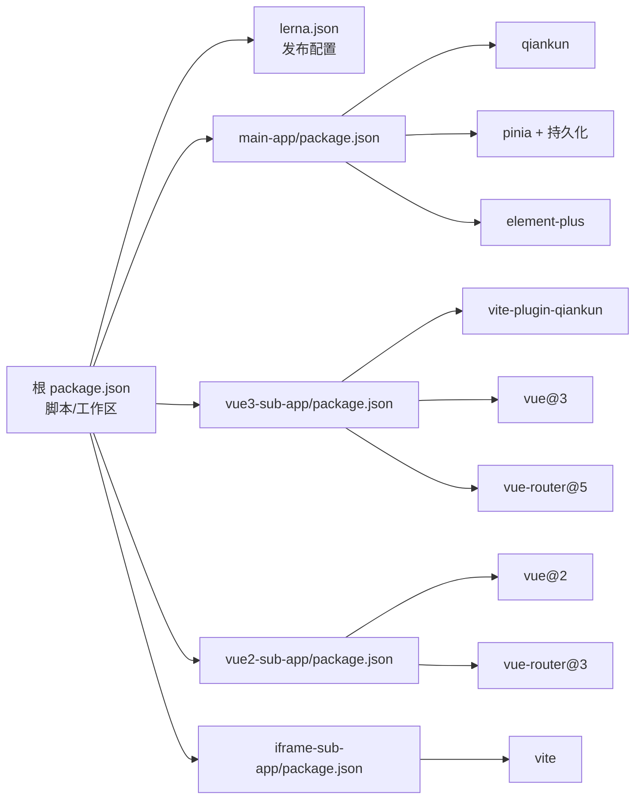

# 子应用

<cite>
**本文引用的文件**
- [README.md](file://README.md)
- [package.json](file://package.json)
- [lerna.json](file://lerna.json)
- [packages/main-app/package.json](file://packages/main-app/package.json)
- [packages/main-app/src/main.js](file://packages/main-app/src/main.js)
- [packages/vue3-sub-app/package.json](file://packages/vue3-sub-app/package.json)
- [packages/vue3-sub-app/src/main.js](file://packages/vue3-sub-app/src/main.js)
- [packages/vue3-sub-app/vite.config.js](file://packages/vue3-sub-app/vite.config.js)
- [packages/vue2-sub-app/package.json](file://packages/vue2-sub-app/package.json)
- [packages/vue2-sub-app/src/main.js](file://packages/vue2-sub-app/src/main.js)
- [packages/vue2-sub-app/vue.config.js](file://packages/vue2-sub-app/vue.config.js)
- [packages/iframe-sub-app/package.json](file://packages/iframe-sub-app/package.json)
- [packages/iframe-sub-app/src/bridge.js](file://packages/iframe-sub-app/src/bridge.js)
- [user-docs/guide/sub-apps.md](file://user-docs/guide/sub-apps.md)
- [user-docs/guide/main-app.md](file://user-docs/guide/main-app.md)
- [user-docs/guide/getting-started.md](file://user-docs/guide/getting-started.md)
</cite>

## 更新摘要
**所做更改**
- 新增4种子应用类型的完整对比表格和技术特点说明
- 添加Vue3子应用的详细配置示例和最佳实践
- 新增Vue2子应用的完整集成方案和UMD输出配置
- 扩展Iframe子应用的通信桥实现和安全治理方案
- 新增Link类型应用的配置示例和加载行为说明
- 完善跨应用跳转的三种使用方式和最佳实践
- 新增开发调试技巧、常见问题和性能优化建议
- 更新架构图和组件关系图，反映最新的集成模式

## 目录
1. [简介](#简介)
2. [子应用类型概览](#子应用类型概览)
3. [项目结构](#项目结构)
4. [核心组件](#核心组件)
5. [架构总览](#架构总览)
6. [详细组件分析](#详细组件分析)
7. [依赖关系分析](#依赖关系分析)
8. [性能考虑](#性能考虑)
9. [故障排查指南](#故障排查指南)
10. [开发调试技巧](#开发调试技巧)
11. [最佳实践](#最佳实践)
12. [结论](#结论)
13. [附录](#附录)

## 简介
本仓库是一个企业级微前端基础平台脚手架，采用 Monorepo 架构，基于 Lerna + npm workspace 管理多包，支持主应用与多种类型子应用协同工作。子应用目前包含 Vue3、Vue2、iframe 以及外部链接（link）四种类型，均通过 qiankun 或 postMessage 等机制进行集成与通信。平台提供完整的跨应用通信桥（bridge）、布局编排系统、状态管理（Pinia + 持久化）、iframe 跨域治理、多应用实例同屏加载等能力。

## 子应用类型概览
本平台支持 **4 种类型**的子应用，每种类型都有其特定的技术栈和集成方式。

| 类型 | 技术栈 | 构建工具 | 适用场景 |
|------|--------|---------|---------|
| **vue3** | Vue 3.x + vue-router 5.x | Vite + vite-plugin-qiankun | 新项目、现代化应用 |
| **vue2** | Vue 2.x + vue-router 3.x | Vue CLI | 遗留项目、Vue2 生态 |
| **iframe** | 任意技术栈 | 任意 | 第三方系统、独立应用 |
| **link** | - | - | 外部链接、快速跳转 |

## 项目结构
仓库采用 Monorepo 结构，核心目录如下：
- packages/main-app：Vue3 主应用，负责微应用编排、状态管理、UI 组件库、桥接通信初始化等
- packages/vue3-sub-app：Vue3 子应用示例，演示 qiankun 集成与生命周期管理
- packages/vue2-sub-app：Vue2 子应用示例，演示 qiankun 集成与 UMD 输出
- packages/iframe-sub-app：iframe 子应用示例，演示 postMessage 通信与安全治理
- packages/cli：CLI 脚手架工具，用于快速生成主应用与各类子应用模板
- user-docs：VitePress 文档站，包含使用指南、部署说明、API 文档等



**图表来源**
- [package.json:1-50](file://package.json#L1-L50)
- [lerna.json:1-25](file://lerna.json#L1-L25)
- [packages/main-app/package.json:1-37](file://packages/main-app/package.json#L1-L37)
- [packages/main-app/src/main.js:1-50](file://packages/main-app/src/main.js#L1-L50)
- [packages/vue3-sub-app/package.json:1-32](file://packages/vue3-sub-app/package.json#L1-L32)
- [packages/vue3-sub-app/src/main.js:1-123](file://packages/vue3-sub-app/src/main.js#L1-L123)
- [packages/vue3-sub-app/vite.config.js:1-46](file://packages/vue3-sub-app/vite.config.js#L1-L46)
- [packages/vue2-sub-app/package.json:1-31](file://packages/vue2-sub-app/package.json#L1-L31)
- [packages/vue2-sub-app/src/main.js:1-121](file://packages/vue2-sub-app/src/main.js#L1-L121)
- [packages/vue2-sub-app/vue.config.js:1-25](file://packages/vue2-sub-app/vue.config.js#L1-L25)
- [packages/iframe-sub-app/package.json:1-15](file://packages/iframe-sub-app/package.json#L1-L15)
- [packages/iframe-sub-app/src/bridge.js:1-233](file://packages/iframe-sub-app/src/bridge.js#L1-L233)
- [user-docs/guide/sub-apps.md:1-827](file://user-docs/guide/sub-apps.md#L1-L827)
- [user-docs/guide/main-app.md:1-563](file://user-docs/guide/main-app.md#L1-L563)
- [user-docs/guide/getting-started.md:1-226](file://user-docs/guide/getting-started.md#L1-L226)

**章节来源**
- [README.md:68-82](file://README.md#L68-L82)
- [package.json:1-50](file://package.json#L1-L50)
- [lerna.json:1-25](file://lerna.json#L1-L25)

## 核心组件
- 主应用（main-app）
  - 初始化 Pinia 并启用持久化插件，注册 Element Plus 及图标，挂载应用
  - 初始化跨应用通信桥（bridge），暴露微应用管理器供调试
- Vue3 子应用（vue3-sub-app）
  - 通过 vite-plugin-qiankun 提供 renderWithQiankun 生命周期钩子
  - qiankun 模式下使用 memory history，并通过 provide/inject 传递运行模式
  - 独立运行时使用 web history；在 qiankun 模式下避免重复加载样式以防止污染主应用
- Vue2 子应用（vue2-sub-app）
  - 通过 qiankun 集成，UMD 输出以便被主应用加载
  - 独立运行与 qiankun 模式下的路由 base 区分处理
- iframe 子应用（iframe-sub-app）
  - 通过 postMessage 与主应用通信，支持动态 origin 白名单校验
  - 提供高度上报、消息监听清理等安全与交互机制
- CLI 工具（packages/cli）
  - 提供 artisan create 命令，可一键生成主应用与各类子应用模板

**章节来源**
- [packages/main-app/src/main.js:1-50](file://packages/main-app/src/main.js#L1-L50)
- [packages/vue3-sub-app/src/main.js:1-123](file://packages/vue3-sub-app/src/main.js#L1-L123)
- [packages/vue2-sub-app/src/main.js:1-121](file://packages/vue2-sub-app/src/main.js#L1-L121)
- [packages/iframe-sub-app/src/bridge.js:1-233](file://packages/iframe-sub-app/src/bridge.js#L1-L233)
- [user-docs/guide/sub-apps.md:1-827](file://user-docs/guide/sub-apps.md#L1-L827)

## 架构总览
整体架构围绕"主应用统一编排 + 多类型子应用协同"的目标设计，主应用负责：
- 微应用注册与生命周期调度
- 跨应用通信桥（bridge）的建立与维护
- 布局编排与状态管理
- iframe 跨域治理与安全策略

子应用通过各自适配层接入主应用：
- Vue3/Vue2：基于 qiankun 的 loadMicroApp 模式，提供标准生命周期钩子
- iframe：基于 postMessage 的轻量通信桥，配合沙箱与 origin 校验
- link：外部链接类型，直接在新窗口打开



**图表来源**
- [packages/main-app/src/main.js:1-50](file://packages/main-app/src/main.js#L1-L50)
- [user-docs/guide/sub-apps.md:1-827](file://user-docs/guide/sub-apps.md#L1-L827)

## 详细组件分析

### 主应用（main-app）
- 初始化流程
  - 创建应用实例，注册 Pinia（启用持久化）、Vue Router、Element Plus
  - 注册 Element Plus 图标组件
  - 初始化跨应用通信桥（setupBridge），挂载应用
  - 将微应用管理器暴露到全局，便于调试
- 关键职责
  - 统一状态管理与持久化
  - 跨应用通信桥的集中配置与分发
  - 布局编排与路由调度



**图表来源**
- [packages/main-app/src/main.js:1-50](file://packages/main-app/src/main.js#L1-L50)

**章节来源**
- [packages/main-app/src/main.js:1-50](file://packages/main-app/src/main.js#L1-L50)

### Vue3 子应用（vue3-sub-app）
- 生命周期与渲染
  - 通过 renderWithQiankun 注册 bootstrap/mount/unmount/update
  - qiankun 模式下使用 memory history，独立运行使用 web history
  - 通过 provide/inject 传递 qiankun 运行模式，App.vue 注入获取
  - 在 qiankun 模式下避免重复加载 Element Plus 样式，防止污染主应用
- 安全与稳定性
  - 卸载时仅停止响应式 effect 并清理引用，避免直接调用 app.unmount 导致的 DOM 状态异常
  - 手动清理容器内容，确保 qiankun 与主应用协作时的内存与 DOM 清理



**图表来源**
- [packages/vue3-sub-app/src/main.js:1-123](file://packages/vue3-sub-app/src/main.js#L1-L123)

**章节来源**
- [packages/vue3-sub-app/src/main.js:1-123](file://packages/vue3-sub-app/src/main.js#L1-L123)
- [packages/vue3-sub-app/vite.config.js:1-46](file://packages/vue3-sub-app/vite.config.js#L1-L46)
- [user-docs/guide/sub-apps.md:16-206](file://user-docs/guide/sub-apps.md#L16-L206)

### Vue2 子应用（vue2-sub-app）
- 集成方式
  - 通过 qiankun 加载，输出为 UMD，便于主应用按需加载
  - 独立运行与 qiankun 模式下路由 base 分离，避免历史模式冲突
- 开发与构建
  - 使用 Vue CLI，开发服务器允许跨域头，host 设置为 0.0.0.0
  - UMD 输出配置 library 名称与目标，保证与主应用的命名空间隔离



**图表来源**
- [packages/vue2-sub-app/src/main.js:1-121](file://packages/vue2-sub-app/src/main.js#L1-L121)
- [packages/vue2-sub-app/vue.config.js:1-25](file://packages/vue2-sub-app/vue.config.js#L1-L25)

**章节来源**
- [packages/vue2-sub-app/src/main.js:1-121](file://packages/vue2-sub-app/src/main.js#L1-L121)
- [packages/vue2-sub-app/vue.config.js:1-25](file://packages/vue2-sub-app/vue.config.js#L1-L25)
- [user-docs/guide/sub-apps.md:210-384](file://user-docs/guide/sub-apps.md#L210-L384)

### Iframe 子应用（iframe-sub-app）
- 通信机制
  - 通过 postMessage 与主应用通信，支持动态 origin 白名单校验
  - 提供消息监听与清理，避免内存泄漏
- 安全与治理
  - 严格校验 event.origin，禁止直接访问 iframe.contentWindow DOM
  - 支持 sandbox 属性限制，卸载时清理监听器
- 高度同步
  - 上报 iframe 内容高度，配合主应用布局自适应



**图表来源**
- [packages/iframe-sub-app/src/bridge.js:1-233](file://packages/iframe-sub-app/src/bridge.js#L1-L233)

**章节来源**
- [packages/iframe-sub-app/src/bridge.js:1-233](file://packages/iframe-sub-app/src/bridge.js#L1-L233)
- [user-docs/guide/sub-apps.md:388-611](file://user-docs/guide/sub-apps.md#L388-L611)

### Link 类型应用
- 技术特点
  - **非微应用**: 不是真正的微应用，只是外部链接的包装
  - **新窗口打开**: 调用 `window.open()` 在新标签页打开
  - **无需集成**: 不需要任何微前端集成代码
- 配置示例

```javascript
// config/microApps.js
{
  id: 'external-docs',
  name: '外部文档',
  entry: 'https://example.com/docs',
  type: 'link',
  layoutType: 'blank'
}
```

- 加载行为
  当调用 `MicroAppManager.load()` 时：

```javascript
// microAppManager.js 内部处理
if (config.type === 'link') {
  window.open(config.entry, '_blank')
  return null  // 不加载容器
}
```

**章节来源**
- [user-docs/guide/sub-apps.md:613-645](file://user-docs/guide/sub-apps.md#L613-L645)

### 跨应用跳转（Bridge）
- 统一跳转接口
  - navigateTo：跳转到指定子应用的路径
  - navigateToMain：跳转到主应用路径
- 使用场景
  - 子应用间跳转、从子应用返回主应用等
- 三种使用方式

**方式一：使用全局对象（推荐）**
```javascript
// 在子应用中跳转到其他子应用
window.__ARTISAN_BRIDGE__.navigateTo({
  appId: 'vue2-sub-app',
  path: '/list',
  query: { id: 1 }
})

// 跳转到主应用
window.__ARTISAN_BRIDGE__.navigateToMain('/home')

// 监听自定义消息
window.__ARTISAN_BRIDGE__.on('MY_EVENT', (payload) => {
  console.log('Received:', payload)
})
```

**方式二：通过 Props 获取 Bridge（仅限 qiankun 子应用）**
```javascript
// 在 Vue3 子应用的 render 函数中
function render(props = {}) {
  const { bridge } = props
  
  // 使用 bridge 跳转
  bridge?.navigateTo({ 
    appId: 'vue3-sub-app', 
    path: '/' 
  })
  
  // 监听消息
  bridge?.on('CUSTOM_EVENT', (payload) => {
    console.log('Received:', payload)
  })
}
```

**方式三：Iframe 使用 Bridge**
```javascript
// Iframe 子应用中
import { bridge } from './bridge'

// 跳转到其他应用
bridge.navigateTo('vue3-sub-app', '/list', { id: 1 })

// 跳转到主应用
bridge.navigateToMain('/home')

// 发送自定义消息
bridge.send({
  type: 'MY_CUSTOM_EVENT',
  payload: { data: 'hello' }
})
```



**图表来源**
- [user-docs/guide/sub-apps.md:648-710](file://user-docs/guide/sub-apps.md#L648-L710)

**章节来源**
- [user-docs/guide/sub-apps.md:648-710](file://user-docs/guide/sub-apps.md#L648-L710)

## 依赖关系分析
- 工作区与脚本
  - 根 package.json 定义了 Lerna 工作区与并行开发脚本，支持同时启动主应用与各子应用
  - lerna.json 配置发布命令与忽略变更规则
- 主应用依赖
  - qiankun：微前端核心，负责子应用加载与生命周期管理
  - pinia + pinia-plugin-persistedstate：状态管理与持久化
  - element-plus：UI 组件库
- 子应用依赖
  - vite-plugin-qiankun：Vue3 子应用的 qiankun 集成插件
  - vue、vue-router：框架与路由
  - sass、vite：开发与构建工具链



**图表来源**
- [package.json:1-50](file://package.json#L1-L50)
- [lerna.json:1-25](file://lerna.json#L1-L25)
- [packages/main-app/package.json:1-37](file://packages/main-app/package.json#L1-L37)
- [packages/vue3-sub-app/package.json:1-32](file://packages/vue3-sub-app/package.json#L1-L32)
- [packages/vue2-sub-app/package.json:1-31](file://packages/vue2-sub-app/package.json#L1-L31)
- [packages/iframe-sub-app/package.json:1-15](file://packages/iframe-sub-app/package.json#L1-L15)

**章节来源**
- [package.json:1-50](file://package.json#L1-L50)
- [lerna.json:1-25](file://lerna.json#L1-L25)
- [packages/main-app/package.json:1-37](file://packages/main-app/package.json#L1-L37)
- [packages/vue3-sub-app/package.json:1-32](file://packages/vue3-sub-app/package.json#L1-L32)
- [packages/vue2-sub-app/package.json:1-31](file://packages/vue2-sub-app/package.json#L1-L31)
- [packages/iframe-sub-app/package.json:1-15](file://packages/iframe-sub-app/package.json#L1-L15)

## 性能考虑
- 子应用样式隔离
  - Vue3 子应用在 qiankun 模式下避免重复加载 Element Plus 样式，减少样式冲突与重绘开销
- 内存与 DOM 清理
  - Vue3 子应用卸载时仅停止响应式 effect 并清理引用，避免直接 unmount 导致的异常与资源泄漏
- 路由与历史模式
  - qiankun 模式使用 memory history，减少与主应用路由的耦合，提升切换性能与稳定性
- 并行开发与构建
  - 根脚本支持并行启动与构建，缩短开发反馈周期

## 故障排查指南
- 子应用样式污染
  - 症状：主应用样式异常或子应用样式错乱
  - 排查：确认子应用在 qiankun 模式下未重复加载全局样式；检查 Element Plus 样式注入时机
- 路由跳转异常
  - 症状：qiankun 模式下路由不生效或跳转失败
  - 排查：确认 memory history 的初始路由 push；检查 subPath 传参是否正确
- 卸载后残留
  - 症状：切换子应用后出现内存占用上升或 DOM 未清理
  - 排查：确认卸载阶段仅停止响应式 effect 并清理引用；清理容器内容
- iframe 通信失败
  - 症状：postMessage 无响应或被拦截
  - 排查：确认主应用与 iframe 的 origin 白名单配置；检查事件监听与清理逻辑

**章节来源**
- [packages/vue3-sub-app/src/main.js:79-113](file://packages/vue3-sub-app/src/main.js#L79-L113)
- [user-docs/guide/sub-apps.md:745-776](file://user-docs/guide/sub-apps.md#L745-L776)

## 开发调试技巧
### 独立运行调试
所有子应用都支持独立运行，方便开发调试：

```bash
# Vue3 子应用
cd packages/vue3-sub-app
npm run dev

# Vue2 子应用
cd packages/vue2-sub-app
npm run dev

# Iframe 子应用
cd packages/iframe-sub-app
npm run dev
```

访问对应的 localhost 地址即可独立查看效果。

### 联调测试
启动所有应用进行联调：

```bash
# 根目录
npm run dev:all:mock
```

然后在主应用中测试各个子应用的加载和交互。

### 常见问题
**1. CORS 跨域问题**
- **错误**: `Access-Control-Allow-Origin`
- **解决**：开发环境设置 `host: '0.0.0.0'` 和 `cors: true`，配置正确的 `Access-Control-Allow-Origin` 响应头

**2. 样式冲突**
- **解决**：qiankun 子应用在 qiankun 环境下不加载 Element Plus CSS，使用 CSS Modules 或 Scoped CSS，添加样式前缀避免命名冲突

**3. 路由冲突**
- **解决**：qiankun 环境下使用 Memory/Abstract 模式，独立运行使用 History 模式，设置正确的 base 路径

**4. 通信失败**
- **解决**：检查 origin 校验是否正确，确保消息格式正确 `{ type, payload }`，检查消息处理器是否已注册

**章节来源**
- [user-docs/guide/sub-apps.md:712-776](file://user-docs/guide/sub-apps.md#L712-L776)

## 最佳实践
### 1. 错误处理
在所有子应用中添加全局错误处理：

```javascript
// Vue3
app.config.errorHandler = (err, vm, info) => {
  console.error('[Global Error]', err, info)
  // 上报错误到监控系统
}

// Iframe
window.onerror = (message, source, lineno, colno, error) => {
  console.error('[Global Error]', { message, source, lineno })
}
```

### 2. 性能优化
- 按需加载组件和路由
- 使用懒加载减少首屏体积
- 合理设置 keepAlive 缓存
- 避免频繁的跨应用通信

### 3. 安全考虑
- 不信任任何来自外部的消息数据
- 严格校验 origin
- 敏感操作需要二次确认
- Iframe 设置合适的 sandbox 权限

### 4. 代码组织
- 将 Bridge 通信逻辑封装成独立模块
- 统一消息类型定义
- 使用 TypeScript 提高类型安全
- 编写完善的注释和文档

**章节来源**
- [user-docs/guide/sub-apps.md:778-817](file://user-docs/guide/sub-apps.md#L778-L817)

## 结论
该微前端脚手架通过清晰的 Monorepo 结构与标准化的子应用接入方式，实现了主应用与多类型子应用的高效协同。平台在样式隔离、生命周期管理、跨应用通信与安全治理方面提供了完善的实践方案，适合在企业级场景中快速搭建与扩展微前端体系。

## 附录
- 端口与启动
  - 主应用：8080
  - Vue3 子应用：7080
  - Vue2 子应用：3000
  - Iframe 子应用：9080
- CLI 快速创建
  - artisan create main-app my-main
  - artisan create sub-app my-vue3-app --type vue3
  - artisan create sub-app my-vue2-app --type vue2
  - artisan create sub-app my-iframe-app --type iframe

**章节来源**
- [README.md:23-60](file://README.md#L23-L60)
- [README.md:84-102](file://README.md#L84-L102)
- [user-docs/guide/getting-started.md:122-151](file://user-docs/guide/getting-started.md#L122-L151)