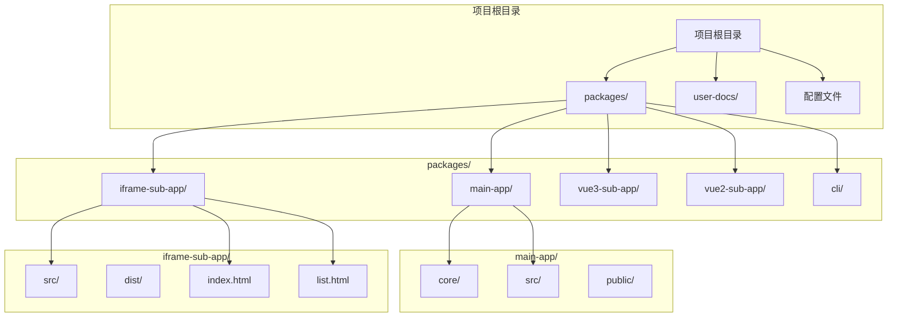
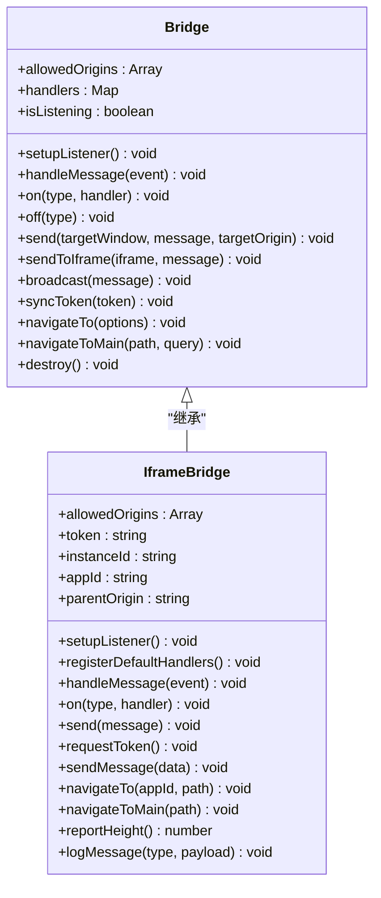
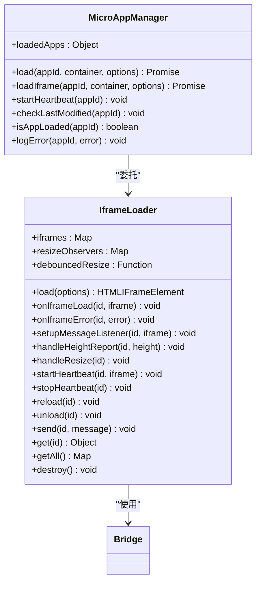
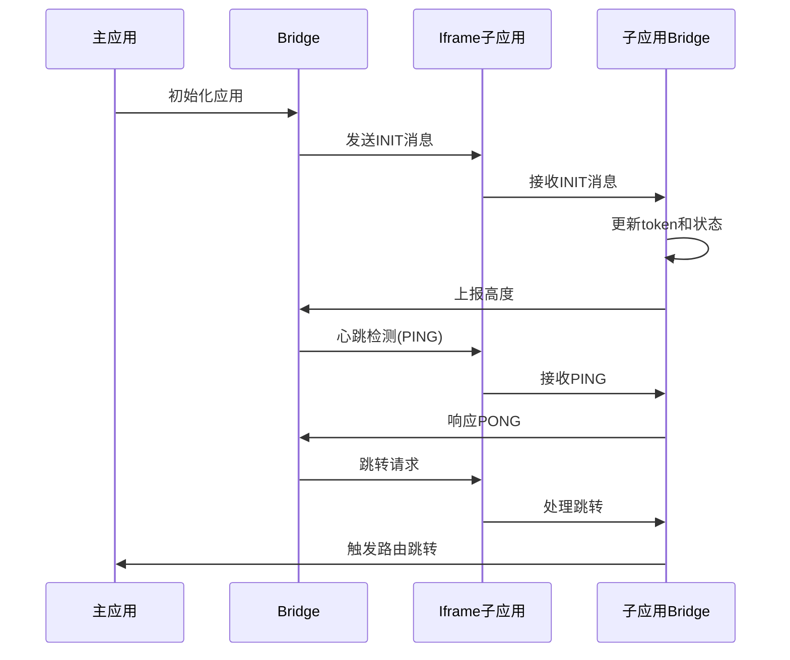
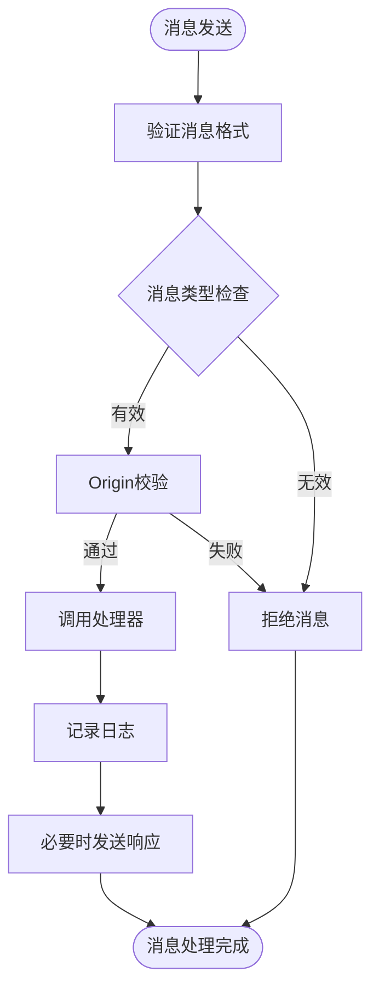
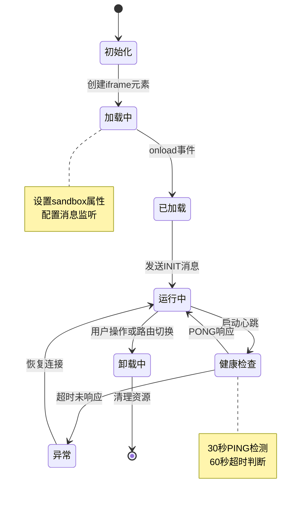
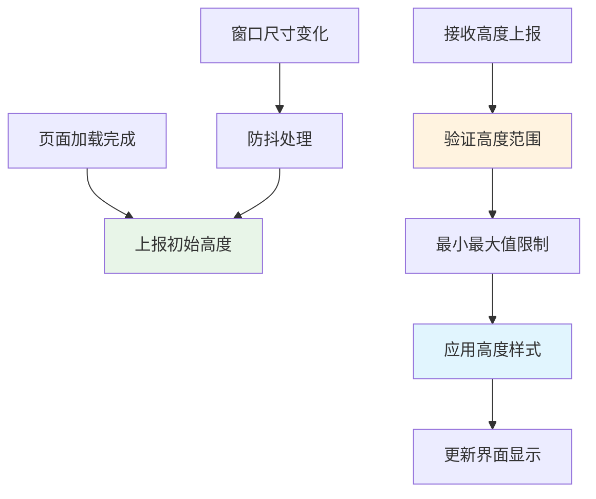
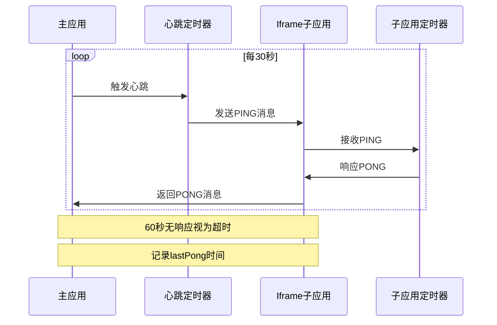
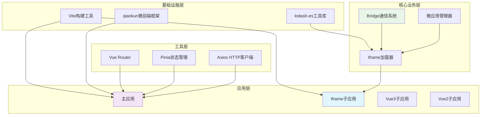
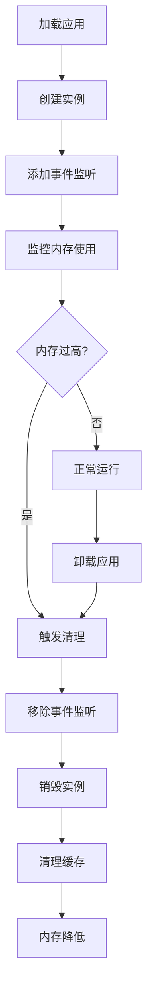

# Iframe子应用开发

<cite>
**本文档引用的文件**
- [README.md](file://README.md)
- [package.json](file://packages/iframe-sub-app/package.json)
- [vite.config.js](file://packages/iframe-sub-app/vite.config.js)
- [bridge.js](file://packages/iframe-sub-app/src/bridge.js)
- [app.js](file://packages/iframe-sub-app/src/app.js)
- [index.html](file://packages/iframe-sub-app/index.html)
- [list.html](file://packages/iframe-sub-app/list.html)
- [bridge.js](file://packages/main-app/src/core/bridge.js)
- [iframeLoader.js](file://packages/main-app/src/core/iframeLoader.js)
- [microAppManager.js](file://packages/main-app/src/core/microAppManager.js)
- [bridge.md](file://user-docs/api/bridge.md)
- [iframe-governance.md](file://user-docs/guide/iframe-governance.md)
- [sub-apps.md](file://user-docs/guide/sub-apps.md)
- [deployment.md](file://user-docs/guide/deployment.md)
</cite>

## 目录
1. [简介](#简介)
2. [项目结构](#项目结构)
3. [核心组件](#核心组件)
4. [架构概览](#架构概览)
5. [详细组件分析](#详细组件分析)
6. [依赖关系分析](#依赖关系分析)
7. [性能考虑](#性能考虑)
8. [故障排除指南](#故障排除指南)
9. [结论](#结论)
10. [附录](#附录)

## 简介

Iframe子应用是Artisan微前端平台的重要组成部分，基于qiankun框架的loadMicroApp模式实现。该平台支持多种类型的子应用，包括Vue3、Vue2、Iframe和Link类型，为现代Web应用提供了灵活的微前端解决方案。

Iframe子应用开发模式具有以下特点：
- **独立部署**：每个子应用可独立开发、测试和部署
- **跨域处理**：通过postMessage实现安全的跨域通信
- **安全策略**：严格的origin校验和sandbox限制
- **生命周期管理**：完整的加载、运行和卸载生命周期
- **预加载策略**：支持应用预加载以提升用户体验
- **性能优化**：高度自适应、心跳检测和错误处理

## 项目结构

该项目采用Monorepo架构，使用Lerna + npm workspace进行管理，包含多个包和丰富的文档系统。



**图表来源**
- [README.md](file://README.md#L62-L76)
- [package.json](file://packages/iframe-sub-app/package.json#L1-L15)

**章节来源**
- [README.md](file://README.md#L62-L76)
- [package.json](file://packages/iframe-sub-app/package.json#L1-L15)

## 核心组件

### Bridge通信系统

Bridge是整个微前端系统的核心通信组件，实现了主应用与子应用之间的双向通信。



**图表来源**
- [bridge.js](file://packages/main-app/src/core/bridge.js#L9-L241)
- [bridge.js](file://packages/iframe-sub-app/src/bridge.js#L5-L216)

### Iframe加载器

IframeLoader负责管理Iframe子应用的生命周期，包括加载、通信、高度自适应等功能。



**图表来源**
- [iframeLoader.js](file://packages/main-app/src/core/iframeLoader.js#L9-L334)
- [microAppManager.js](file://packages/main-app/src/core/microAppManager.js#L42-L225)

**章节来源**
- [bridge.js](file://packages/main-app/src/core/bridge.js#L1-L241)
- [bridge.js](file://packages/iframe-sub-app/src/bridge.js#L1-L216)
- [iframeLoader.js](file://packages/main-app/src/core/iframeLoader.js#L1-L334)
- [microAppManager.js](file://packages/main-app/src/core/microAppManager.js#L42-L225)

## 架构概览

Iframe子应用采用主应用-子应用的微前端架构，通过postMessage实现跨域通信。

```mermaid
graph TB
subgraph "主应用 (main-app)"
MainBridge[主应用Bridge]
Router[Vue Router]
UserStore[用户状态管理]
IframeLoader[Iframe加载器]
Container[应用容器]
end
subgraph "Iframe子应用 (iframe-sub-app)"
SubBridge[子应用Bridge]
SubApp[子应用逻辑]
PostMessage[postMessage通信]
Sandbox[Sandbox限制]
end
subgraph "外部系统"
API[后端API]
Auth[认证服务]
Storage[本地存储]
end
MainBridge <- --> PostMessage < --> SubBridge
IframeLoader --> Container
Container --> IframeSubApp[Iframe元素]
MainBridge --> Router
MainBridge --> UserStore
SubBridge --> API
SubBridge --> Auth
SubBridge --> Storage
style IframeSubApp fill:#e1f5fe
style MainBridge fill:#f3e5f5
style SubBridge fill:#e8f5e8
```

**图表来源**
- [bridge.js](file://packages/main-app/src/core/bridge.js#L1-L241)
- [bridge.js](file://packages/iframe-sub-app/src/bridge.js#L1-L216)
- [iframeLoader.js](file://packages/main-app/src/core/iframeLoader.js#L1-L334)

### 通信协议

Iframe子应用实现了标准化的消息通信协议，确保主应用与子应用之间的可靠通信。



**图表来源**
- [bridge.js](file://packages/main-app/src/core/bridge.js#L32-L78)
- [bridge.js](file://packages/iframe-sub-app/src/bridge.js#L36-L89)

**章节来源**
- [iframe-governance.md](file://user-docs/guide/iframe-governance.md#L42-L115)

## 详细组件分析

### Iframe子应用通信机制

Iframe子应用通过postMessage实现与主应用的安全通信，所有DOM操作都通过消息传递进行。

#### 消息格式规范



**图表来源**
- [bridge.js](file://packages/iframe-sub-app/src/bridge.js#L94-L115)
- [bridge.js](file://packages/main-app/src/core/bridge.js#L96-L114)

#### 跨域安全校验

Iframe子应用实现了严格的跨域安全策略：

1. **Origin白名单**：只接受配置的可信域名
2. **消息格式验证**：确保消息包含type和payload字段
3. **时间戳校验**：防止重放攻击
4. **sandbox限制**：限制iframe的执行权限

**章节来源**
- [iframe-governance.md](file://user-docs/guide/iframe-governance.md#L3-L40)
- [bridge.js](file://packages/iframe-sub-app/src/bridge.js#L7-L22)

### 生命周期管理

Iframe子应用具有完整的生命周期管理机制，包括加载、运行、健康检查和卸载。



**图表来源**
- [iframeLoader.js](file://packages/main-app/src/core/iframeLoader.js#L94-L133)
- [iframeLoader.js](file://packages/main-app/src/core/iframeLoader.js#L215-L231)

#### 预加载策略

主应用支持Iframe子应用的预加载功能，提升用户体验：

1. **预加载配置**：在微应用配置中设置preload: true
2. **延迟加载**：在用户交互前预加载应用
3. **缓存管理**：合理管理预加载的应用实例
4. **资源优化**：避免重复预加载相同应用

**章节来源**
- [README.md](file://README.md#L98-L120)
- [microAppManager.js](file://packages/main-app/src/core/microAppManager.js#L173-L225)

### 高度自适应机制

Iframe子应用实现了智能的高度自适应功能，确保内容完整显示。



**图表来源**
- [app.js](file://packages/iframe-sub-app/src/app.js#L52-L70)
- [iframeLoader.js](file://packages/main-app/src/core/iframeLoader.js#L182-L191)

**章节来源**
- [iframe-governance.md](file://user-docs/guide/iframe-governance.md#L65-L95)
- [app.js](file://packages/iframe-sub-app/src/app.js#L44-L70)

### 心跳检测系统

Iframe子应用实现了双向心跳检测机制，确保通信链路的稳定性。



**图表来源**
- [iframe-governance.md](file://user-docs/guide/iframe-governance.md#L97-L115)
- [iframeLoader.js](file://packages/main-app/src/core/iframeLoader.js#L219-L230)

**章节来源**
- [iframe-governance.md](file://user-docs/guide/iframe-governance.md#L97-L115)
- [bridge.js](file://packages/iframe-sub-app/src/bridge.js#L77-L83)

## 依赖关系分析

Iframe子应用的依赖关系体现了清晰的分层架构设计。



**图表来源**
- [README.md](file://README.md#L7-L15)
- [package.json](file://packages/main-app/package.json#L12-L29)
- [package.json](file://packages/iframe-sub-app/package.json#L11-L13)

### 组件耦合度分析

Iframe子应用系统展现了良好的内聚性和低耦合性：

- **Bridge组件**：高内聚的通信处理模块
- **IframeLoader**：专注于Iframe生命周期管理
- **微应用管理器**：统一的应用加载和调度
- **独立部署**：各子应用可独立开发和部署

**章节来源**
- [README.md](file://README.md#L7-L15)
- [package.json](file://packages/main-app/package.json#L1-L31)

## 性能考虑

### 资源优化策略

Iframe子应用实现了多项性能优化措施：

1. **懒加载机制**：按需加载子应用，减少初始加载时间
2. **缓存策略**：合理利用浏览器缓存和CDN加速
3. **体积优化**：代码分割和Tree Shaking
4. **网络优化**：HTTP/2多路复用和压缩

### 内存管理



**图表来源**
- [iframeLoader.js](file://packages/main-app/src/core/iframeLoader.js#L261-L289)

**章节来源**
- [iframeLoader.js](file://packages/main-app/src/core/iframeLoader.js#L261-L289)

## 故障排除指南

### 常见问题诊断

#### 跨域通信问题

**症状**：消息无法到达或被拒绝
**原因**：
1. Origin不在白名单中
2. 消息格式不正确
3. postMessage目标不正确

**解决方法**：
1. 检查allowedOrigins配置
2. 验证消息格式{type, payload}
3. 确认postMessage的targetOrigin

#### 高度自适应问题

**症状**：内容显示不完整或滚动条异常
**原因**：
1. 页面高度计算错误
2. 样式影响高度测量
3. 防抖处理不当

**解决方法**：
1. 检查documentElement.scrollHeight计算
2. 验证CSS样式对高度的影响
3. 调整防抖延迟时间

#### 心跳检测异常

**症状**：应用状态显示为unhealthy
**原因**：
1. 网络延迟过高
2. 子应用响应慢
3. 时间同步问题

**解决方法**：
1. 检查网络连接质量
2. 优化子应用响应时间
3. 调整超时阈值

**章节来源**
- [iframe-governance.md](file://user-docs/guide/iframe-governance.md#L117-L137)
- [bridge.js](file://packages/main-app/src/core/bridge.js#L225-L241)

### 调试技巧

1. **控制台日志**：利用console.log输出调试信息
2. **消息追踪**：记录所有postMessage通信
3. **状态监控**：监控应用状态变化
4. **性能分析**：使用浏览器性能工具分析

## 结论

Iframe子应用开发为现代Web应用提供了强大而灵活的微前端解决方案。通过严格的安全策略、完善的通信机制和智能的生命周期管理，该系统能够满足复杂的企业级应用需求。

关键优势包括：
- **安全性**：严格的跨域校验和sandbox限制
- **灵活性**：支持多种子应用类型和部署方式
- **可维护性**：清晰的架构设计和模块化组织
- **性能**：优化的加载策略和资源管理

建议在实际项目中：
1. 根据业务需求选择合适的子应用类型
2. 严格执行安全配置和最佳实践
3. 建立完善的监控和日志体系
4. 制定详细的部署和运维流程

## 附录

### 开发流程指南

#### 静态页面开发步骤

1. **项目初始化**
   ```bash
   npm run dev:iframe
   ```

2. **页面结构设计**
   - 设计HTML结构
   - 编写CSS样式
   - 实现JavaScript逻辑

3. **通信接口实现**
   - 集成Bridge通信
   - 实现消息处理
   - 测试跨域通信

4. **构建和测试**
   ```bash
   npm run build
   npm run preview
   ```

#### 微前端集成步骤

1. **配置微应用**
   ```javascript
   {
     id: 'my-iframe-app',
     name: '我的Iframe应用',
     entry: '//localhost:4000',
     type: 'iframe',
     preload: true
   }
   ```

2. **路由配置**
   - 配置激活规则
   - 设置容器选择器
   - 定义布局选项

3. **部署配置**
   - 配置CORS头
   - 设置静态资源路径
   - 配置Nginx代理

**章节来源**
- [README.md](file://README.md#L26-L60)
- [deployment.md](file://user-docs/guide/deployment.md#L1-L86)

### 安全最佳实践

1. **Origin白名单管理**
   - 仅允许可信域名
   - 动态更新白名单
   - 定期审查配置

2. **消息安全**
   - 验证消息格式
   - 实施输入验证
   - 防止XSS攻击

3. **资源安全**
   - 使用HTTPS
   - 配置CSP头
   - 限制iframe权限

4. **监控和审计**
   - 记录所有通信
   - 监控异常行为
   - 定期安全检查

**章节来源**
- [iframe-governance.md](file://user-docs/guide/iframe-governance.md#L3-L40)
- [deployment.md](file://user-docs/guide/deployment.md#L67-L86)