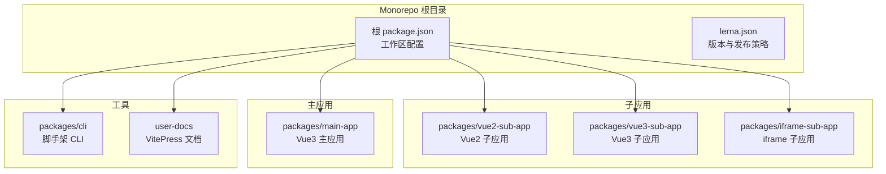
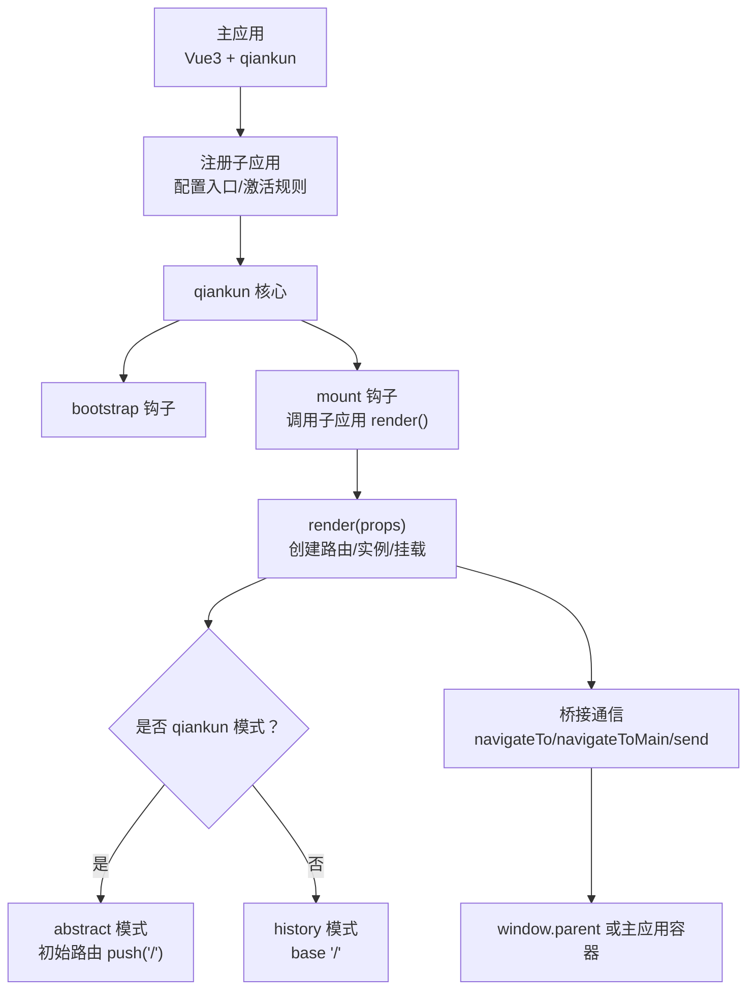
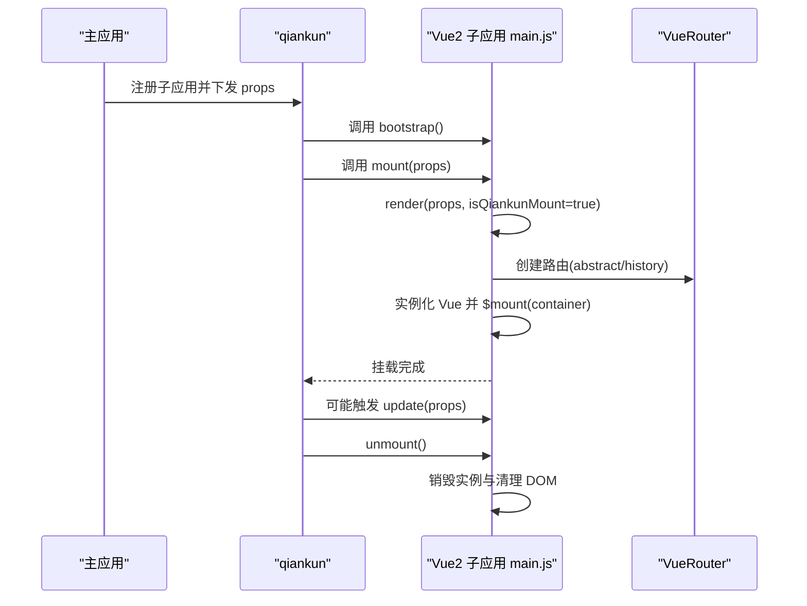
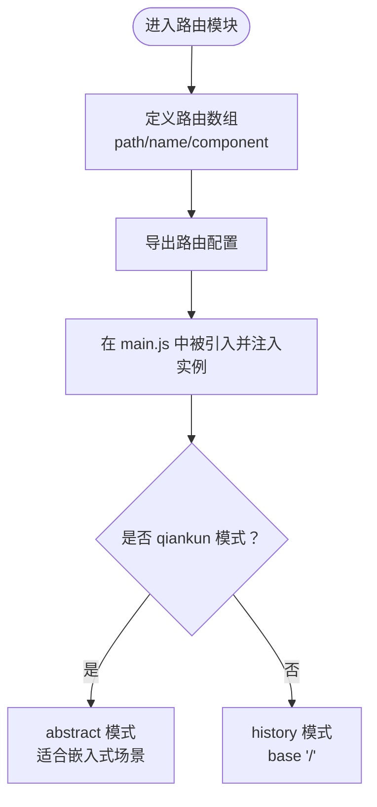
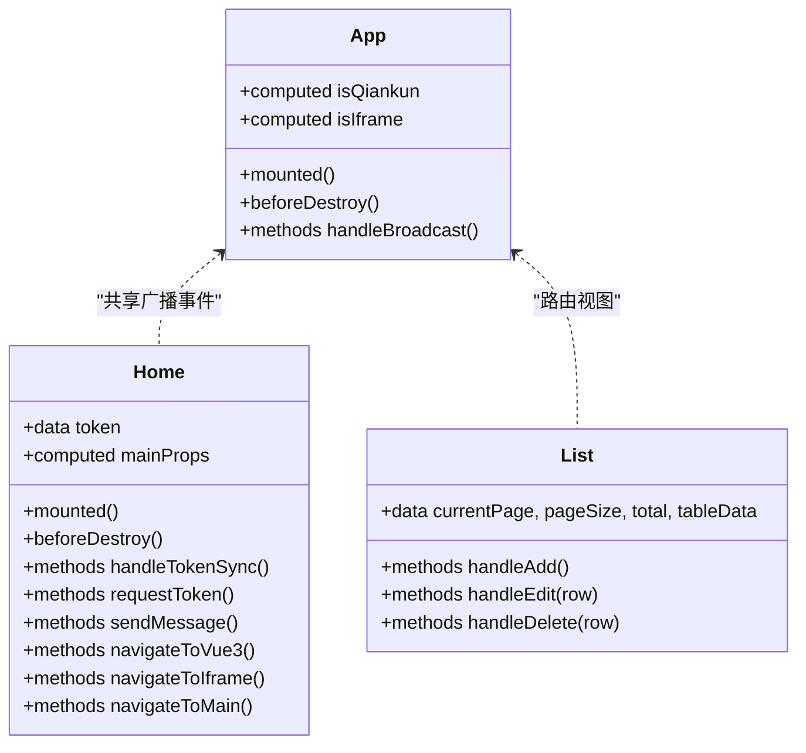
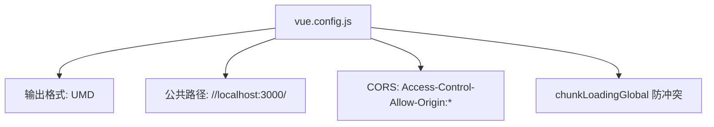
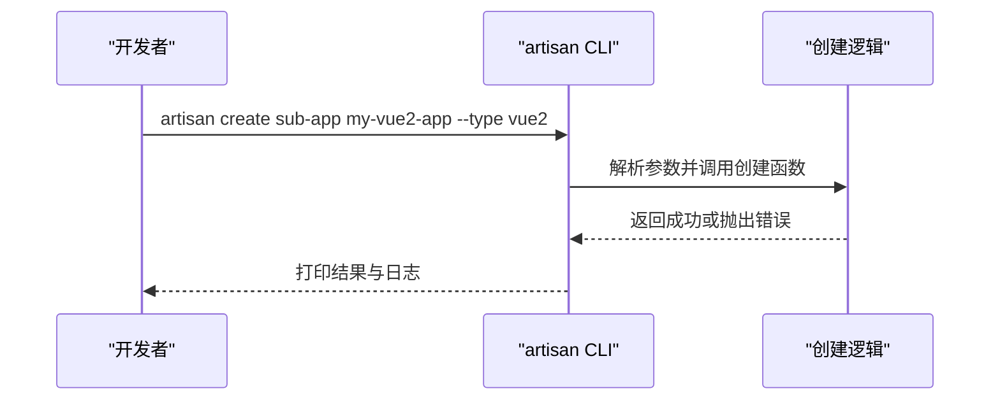
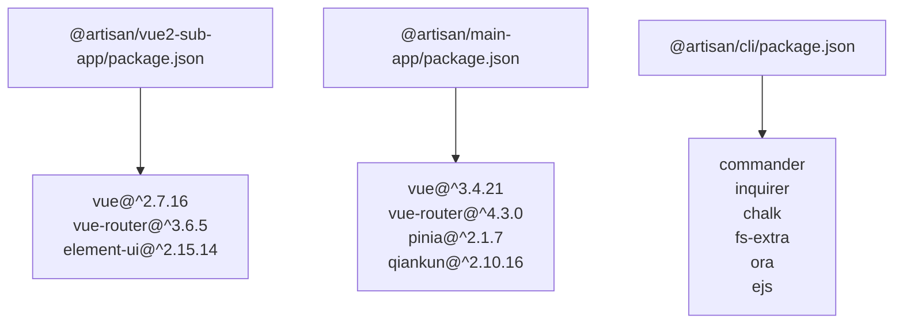

# Vue2子应用开发

<cite>
**本文档引用的文件**
- [README.md](file://README.md)
- [packages/vue2-sub-app/package.json](file://packages/vue2-sub-app/package.json)
- [packages/vue2-sub-app/vue.config.js](file://packages/vue2-sub-app/vue.config.js)
- [packages/vue2-sub-app/src/main.js](file://packages/vue2-sub-app/src/main.js)
- [packages/vue2-sub-app/src/router/index.js](file://packages/vue2-sub-app/src/router/index.js)
- [packages/vue2-sub-app/src/App.vue](file://packages/vue2-sub-app/src/App.vue)
- [packages/vue2-sub-app/src/views/Home.vue](file://packages/vue2-sub-app/src/views/Home.vue)
- [packages/vue2-sub-app/src/views/List.vue](file://packages/vue2-sub-app/src/views/List.vue)
- [packages/main-app/package.json](file://packages/main-app/package.json)
- [packages/cli/package.json](file://packages/cli/package.json)
- [packages/cli/bin/artisan.js](file://packages/cli/bin/artisan.js)
- [user-docs/guide/sub-apps.md](file://user-docs/guide/sub-apps.md)
</cite>

## 目录
1. [简介](#简介)
2. [项目结构](#项目结构)
3. [核心组件](#核心组件)
4. [架构总览](#架构总览)
5. [详细组件分析](#详细组件分析)
6. [依赖关系分析](#依赖关系分析)
7. [性能考虑](#性能考虑)
8. [故障排查指南](#故障排查指南)
9. [结论](#结论)
10. [附录](#附录)

## 简介
本指南面向在微前端环境中开发与维护 Vue2 子应用的团队，结合仓库中的实际实现，系统讲解项目结构、qiankun 适配器设置、路由与状态管理、组件开发模式、Vue2 与 Vue3 的差异处理、迁移实践以及兼容性测试与性能优化方法。文档以仓库现有代码为依据，避免臆测，确保可操作性与可追溯性。

## 项目结构
该仓库采用 Monorepo 架构，使用 Lerna + npm workspace 管理多包。其中与 Vue2 子应用直接相关的关键模块如下：
- packages/vue2-sub-app：Vue2 子应用示例，基于 Vue CLI 服务，UMD 输出，配合 qiankun 生命周期运行
- packages/main-app：主应用（Vue3 + qiankun），负责注册与调度子应用
- packages/cli：脚手架工具，支持一键生成主应用与各类子应用模板
- user-docs：用户文档，包含子应用开发指南与微前端配置说明

**图表来源**
- [README.md](file://README.md#L62-L76)
- [packages/vue2-sub-app/package.json](file://packages/vue2-sub-app/package.json#L1-L31)
- [packages/main-app/package.json](file://packages/main-app/package.json#L1-L31)
- [packages/cli/package.json](file://packages/cli/package.json#L1-L32)

**章节来源**
- [README.md](file://README.md#L1-L158)
- [packages/vue2-sub-app/package.json](file://packages/vue2-sub-app/package.json#L1-L31)
- [packages/main-app/package.json](file://packages/main-app/package.json#L1-L31)
- [packages/cli/package.json](file://packages/cli/package.json#L1-L32)

## 核心组件
- Vue2 子应用入口与生命周期：定义 bootstrap/mount/unmount/update 生命周期钩子，支持独立运行与 qiankun 接入两种模式
- 路由系统：基于 Vue Router 3，支持 history 与 abstract 两种模式，适配独立运行与微前端场景
- 组件层：App.vue 提供运行模式识别与广播事件监听；Home.vue、List.vue 展示典型页面与交互
- 构建配置：Vue CLI 配置 UMD 输出、公共路径与跨域头，便于被主应用加载
- 脚手架：CLI 工具支持快速创建 Vue2 子应用模板

**章节来源**
- [packages/vue2-sub-app/src/main.js](file://packages/vue2-sub-app/src/main.js#L1-L121)
- [packages/vue2-sub-app/src/router/index.js](file://packages/vue2-sub-app/src/router/index.js#L1-L20)
- [packages/vue2-sub-app/src/App.vue](file://packages/vue2-sub-app/src/App.vue#L1-L138)
- [packages/vue2-sub-app/src/views/Home.vue](file://packages/vue2-sub-app/src/views/Home.vue#L1-L154)
- [packages/vue2-sub-app/src/views/List.vue](file://packages/vue2-sub-app/src/views/List.vue#L1-L104)
- [packages/vue2-sub-app/vue.config.js](file://packages/vue2-sub-app/vue.config.js#L1-L21)
- [packages/cli/bin/artisan.js](file://packages/cli/bin/artisan.js#L1-L53)

## 架构总览
Vue2 子应用通过 qiankun 生命周期接入主应用，渲染函数根据是否处于 qiankun 环境选择不同的路由模式与挂载策略。主应用负责注册子应用并下发 props，子应用通过桥接通信进行跨应用跳转与消息传递。

**图表来源**
- [packages/vue2-sub-app/src/main.js](file://packages/vue2-sub-app/src/main.js#L22-L70)
- [packages/vue2-sub-app/src/App.vue](file://packages/vue2-sub-app/src/App.vue#L42-L61)
- [user-docs/guide/sub-apps.md](file://user-docs/guide/sub-apps.md#L156-L170)

**章节来源**
- [packages/vue2-sub-app/src/main.js](file://packages/vue2-sub-app/src/main.js#L75-L121)
- [packages/vue2-sub-app/src/App.vue](file://packages/vue2-sub-app/src/App.vue#L1-L138)
- [user-docs/guide/sub-apps.md](file://user-docs/guide/sub-apps.md#L156-L170)

## 详细组件分析

### 入口与生命周期（main.js）
- 独立运行检测：通过全局标志判断是否在 qiankun 环境外独立运行
- 生命周期导出：bootstrap/mount/unmount/update，分别用于初始化、挂载、卸载与更新
- 渲染函数：接收 props，创建路由与实例，支持在指定容器内挂载
- 路由模式选择：qiankun 模式使用 abstract，独立运行使用 history
- 卸载清理：销毁实例并清空 DOM，捕获异常避免影响主应用

**图表来源**
- [packages/vue2-sub-app/src/main.js](file://packages/vue2-sub-app/src/main.js#L75-L121)

**章节来源**
- [packages/vue2-sub-app/src/main.js](file://packages/vue2-sub-app/src/main.js#L1-L121)

### 路由配置（router/index.js）
- 路由定义：包含首页、列表、关于等页面
- 动态导入：按需加载视图组件，提升首屏性能
- 模式适配：在入口中根据运行模式切换路由模式

**图表来源**
- [packages/vue2-sub-app/src/router/index.js](file://packages/vue2-sub-app/src/router/index.js#L1-L20)
- [packages/vue2-sub-app/src/main.js](file://packages/vue2-sub-app/src/main.js#L34-L38)

**章节来源**
- [packages/vue2-sub-app/src/router/index.js](file://packages/vue2-sub-app/src/router/index.js#L1-L20)
- [packages/vue2-sub-app/src/main.js](file://packages/vue2-sub-app/src/main.js#L34-L38)

### 组件开发模式（App.vue、Home.vue、List.vue）
- App.vue：识别运行模式（独立/iframe/qiankun），展示导航与路由视图，监听广播事件
- Home.vue：展示主应用下发的 token 与 props，提供跨应用通信与跳转按钮
- List.vue：表格与分页示例，演示 Element UI 组件使用

**图表来源**
- [packages/vue2-sub-app/src/App.vue](file://packages/vue2-sub-app/src/App.vue#L21-L62)
- [packages/vue2-sub-app/src/views/Home.vue](file://packages/vue2-sub-app/src/views/Home.vue#L45-L116)
- [packages/vue2-sub-app/src/views/List.vue](file://packages/vue2-sub-app/src/views/List.vue#L47-L84)

**章节来源**
- [packages/vue2-sub-app/src/App.vue](file://packages/vue2-sub-app/src/App.vue#L1-L138)
- [packages/vue2-sub-app/src/views/Home.vue](file://packages/vue2-sub-app/src/views/Home.vue#L1-L154)
- [packages/vue2-sub-app/src/views/List.vue](file://packages/vue2-sub-app/src/views/List.vue#L1-L104)

### 构建与适配（vue.config.js）
- UMD 输出：library 与 libraryTarget 设置为 UMD，便于被主应用加载
- 公共路径：publicPath 指向本地开发端口，保证静态资源正确加载
- 跨域头：允许任意来源访问，简化开发调试
- Webpack 全局：设置 chunkLoadingGlobal，避免多子应用冲突

**图表来源**
- [packages/vue2-sub-app/vue.config.js](file://packages/vue2-sub-app/vue.config.js#L1-L21)

**章节来源**
- [packages/vue2-sub-app/vue.config.js](file://packages/vue2-sub-app/vue.config.js#L1-L21)

### CLI 脚手架（packages/cli）
- 命令行接口：支持 create 与 list 子命令
- 类型参数：支持创建主应用与子应用（vue3/vue2/iframe）
- 错误处理：对未知类型与异常进行提示并退出

**图表来源**
- [packages/cli/bin/artisan.js](file://packages/cli/bin/artisan.js#L14-L38)
- [packages/cli/package.json](file://packages/cli/package.json#L1-L32)

**章节来源**
- [packages/cli/bin/artisan.js](file://packages/cli/bin/artisan.js#L1-L53)
- [packages/cli/package.json](file://packages/cli/package.json#L1-L32)

## 依赖关系分析
- Vue2 子应用依赖：Vue 2.7、Vue Router 3、Element UI
- 主应用依赖：Vue 3、Vue Router 4、Pinia、qiankun、Element Plus
- CLI 依赖：commander、inquirer、chalk、fs-extra、ora、ejs

**图表来源**
- [packages/vue2-sub-app/package.json](file://packages/vue2-sub-app/package.json#L11-L24)
- [packages/main-app/package.json](file://packages/main-app/package.json#L12-L29)
- [packages/cli/package.json](file://packages/cli/package.json#L12-L19)

**章节来源**
- [packages/vue2-sub-app/package.json](file://packages/vue2-sub-app/package.json#L1-L31)
- [packages/main-app/package.json](file://packages/main-app/package.json#L1-L31)
- [packages/cli/package.json](file://packages/cli/package.json#L1-L32)

## 性能考虑
- 代码分割：路由按需加载视图组件，减少首屏体积
- UMD 输出：避免与主应用打包器冲突，提升加载稳定性
- 路由模式：qiankun 场景使用 abstract，避免历史记录污染
- 资源路径：统一 publicPath，确保静态资源正确解析
- 组件复用：Element UI 按需引入，避免全量引入导致体积增大

[本节为通用建议，无需特定文件引用]

## 故障排查指南
- 独立运行与 qiankun 模式混用：确认入口中根据运行模式切换路由模式
- 卸载清理：确保 unmount 钩子中销毁实例并清空 DOM，避免内存泄漏
- 跨域问题：开发阶段允许 CORS，生产环境按需配置
- 消息广播：监听与移除事件时注意生命周期，避免重复绑定
- 桥接通信：使用 window.__ARTISAN_BRIDGE__ 进行跨应用跳转与消息发送

**章节来源**
- [packages/vue2-sub-app/src/main.js](file://packages/vue2-sub-app/src/main.js#L75-L121)
- [packages/vue2-sub-app/src/App.vue](file://packages/vue2-sub-app/src/App.vue#L42-L61)
- [packages/vue2-sub-app/vue.config.js](file://packages/vue2-sub-app/vue.config.js#L7-L12)

## 结论
本指南基于仓库现有实现，总结了 Vue2 子应用在微前端环境中的项目结构、构建配置、路由与生命周期适配、组件开发模式与通信机制。遵循这些实践，可在保证兼容性的前提下，稳定地集成与扩展 Vue2 子应用。

[本节为总结，无需特定文件引用]

## 附录

### 与 Vue3 的差异处理
- 生命周期：Vue2 使用 export 导出生命周期函数；Vue3 使用 renderWithQiankun 辅助函数
- 路由模式：Vue2 在 qiankun 下使用 abstract；Vue3 使用 history 并通过插件辅助
- 状态管理：Vue2 子应用未内置 Pinia；Vue3 主应用使用 Pinia + 持久化
- 组件生态：Vue2 使用 Element UI；Vue3 使用 Element Plus

**章节来源**
- [user-docs/guide/sub-apps.md](file://user-docs/guide/sub-apps.md#L38-L45)
- [packages/main-app/package.json](file://packages/main-app/package.json#L12-L18)

### 从 Vue2 迁移到 Vue3 的迁移指南
- 路由升级：Vue Router 从 3.x 升级到 4.x，调整命名与 API
- 状态管理：引入 Pinia 替代 Vuex，使用组合式 API
- 组件语法：使用单文件组件的 Vue3 语法与编译器
- 适配 qiankun：使用 vite-plugin-qiankun，调整入口与生命周期
- 依赖替换：Element UI 升级为 Element Plus，按需引入

**章节来源**
- [user-docs/guide/sub-apps.md](file://user-docs/guide/sub-apps.md#L10-L63)
- [packages/main-app/package.json](file://packages/main-app/package.json#L12-L18)

### 兼容性测试清单
- 独立运行：确认非 qiankun 环境下路由与样式正常
- qiankun 接入：验证生命周期钩子、路由模式与容器挂载
- 跨应用通信：测试桥接消息发送与跳转功能
- 卸载清理：确认多次 mount/unmount 不产生内存泄漏
- 资源加载：检查 publicPath 与静态资源路径

**章节来源**
- [packages/vue2-sub-app/src/main.js](file://packages/vue2-sub-app/src/main.js#L75-L121)
- [packages/vue2-sub-app/src/App.vue](file://packages/vue2-sub-app/src/App.vue#L42-L61)
- [packages/vue2-sub-app/vue.config.js](file://packages/vue2-sub-app/vue.config.js#L6-L12)