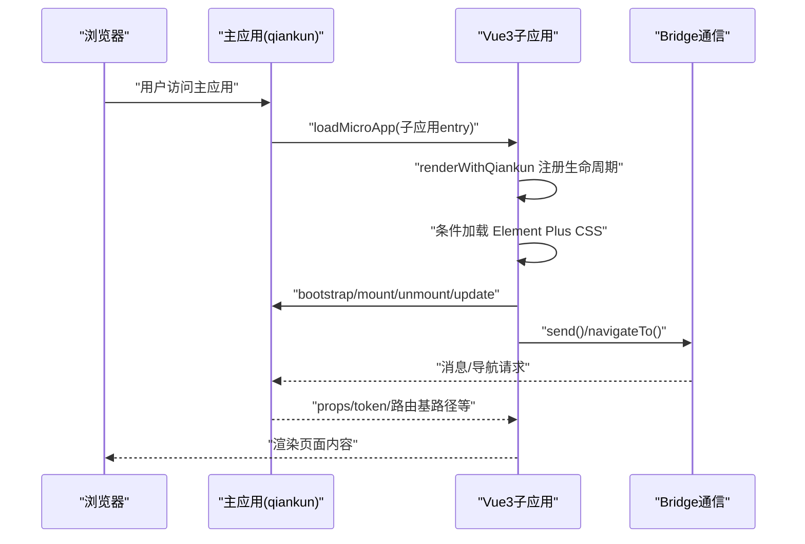
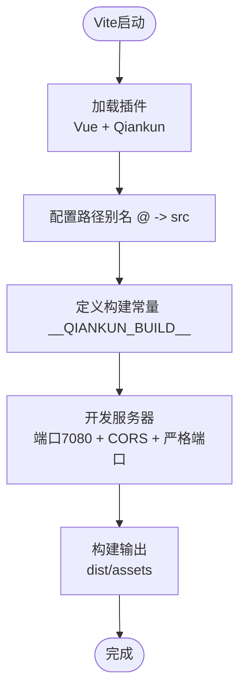
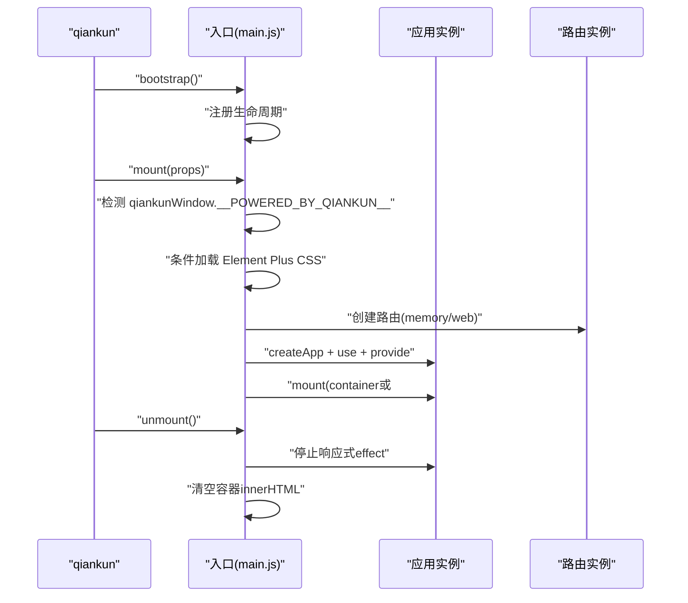
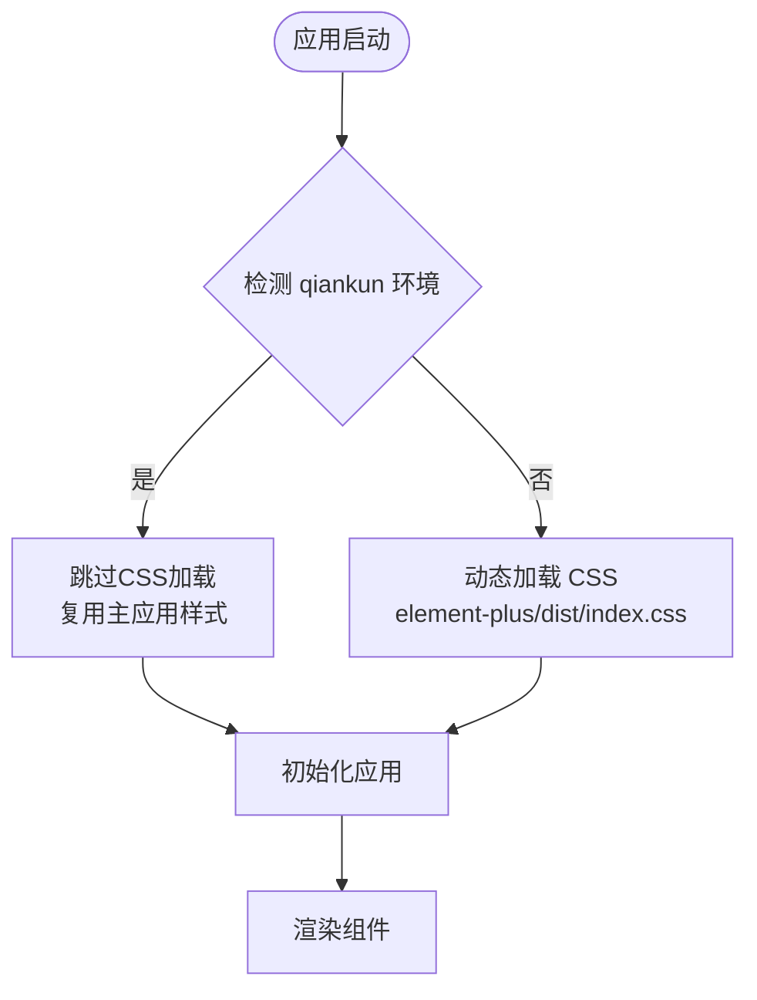
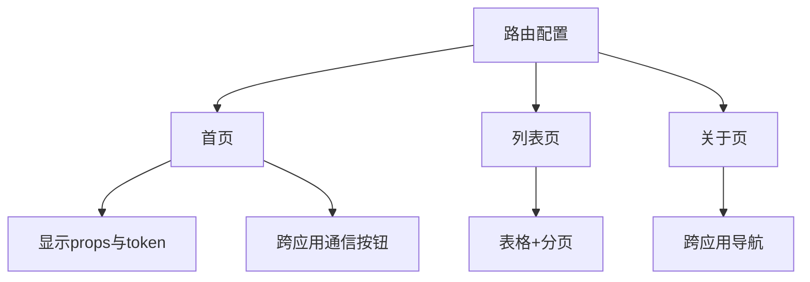
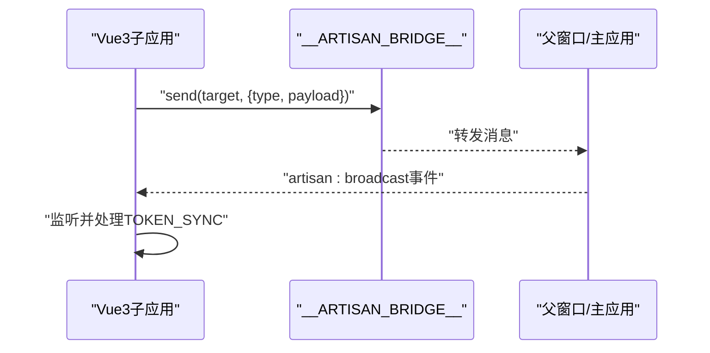
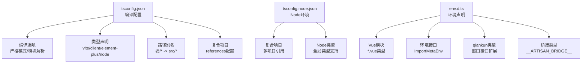
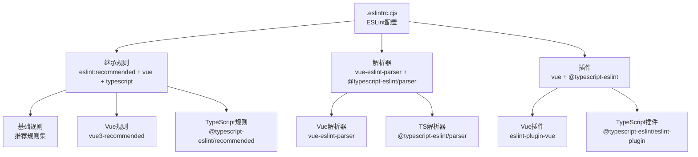
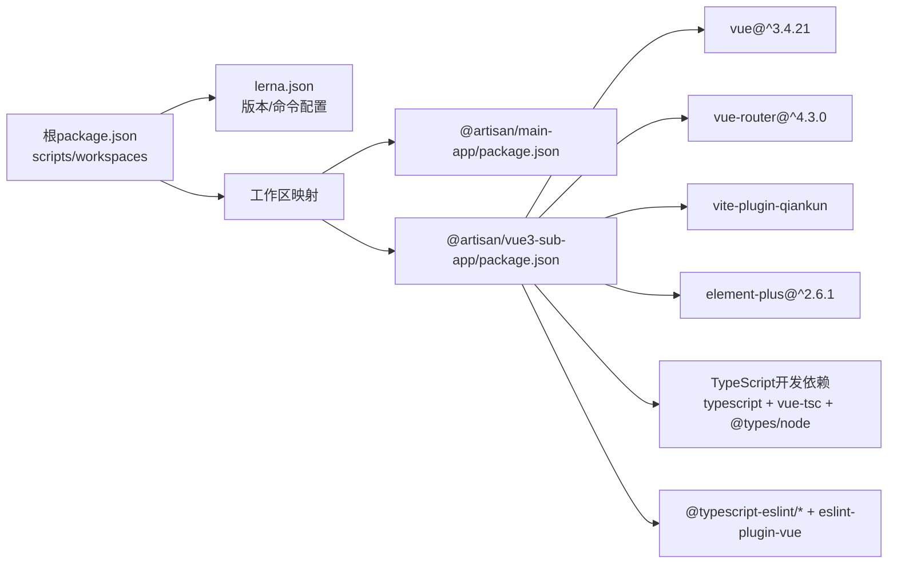

# Vue3子应用开发

<cite>
**本文档引用的文件**
- [README.md](file://README.md)
- [package.json](file://package.json)
- [lerna.json](file://lerna.json)
- [packages/vue3-sub-app/package.json](file://packages/vue3-sub-app/package.json)
- [packages/vue3-sub-app/vite.config.js](file://packages/vue3-sub-app/vite.config.js)
- [packages/vue3-sub-app/src/main.js](file://packages/vue3-sub-app/src/main.js)
- [packages/vue3-sub-app/src/router/index.js](file://packages/vue3-sub-app/src/router/index.js)
- [packages/vue3-sub-app/src/App.vue](file://packages/vue3-sub-app/src/App.vue)
- [packages/vue3-sub-app/src/views/Home.vue](file://packages/vue3-sub-app/src/views/Home.vue)
- [packages/vue3-sub-app/src/views/List.vue](file://packages/vue3-sub-app/src/views/List.vue)
- [packages/vue3-sub-app/src/views/About.vue](file://packages/vue3-sub-app/src/views/About.vue)
- [packages/vue3-sub-app/index.html](file://packages/vue3-sub-app/index.html)
- [packages/main-app/package.json](file://packages/main-app/package.json)
- [packages/vue3-sub-app/tsconfig.json](file://packages/vue3-sub-app/tsconfig.json)
- [packages/vue3-sub-app/tsconfig.node.json](file://packages/vue3-sub-app/tsconfig.node.json)
- [packages/vue3-sub-app/.eslintrc.cjs](file://packages/vue3-sub-app/.eslintrc.cjs)
- [packages/vue3-sub-app/src/env.d.ts](file://packages/vue3-sub-app/src/env.d.ts)
- [user-docs/guide/typescript-migration.md](file://user-docs/guide/typescript-migration.md)
</cite>

## 更新摘要
**所做更改**
- 新增TypeScript配置章节，详细介绍tsconfig.json配置和类型声明
- 新增ESLint配置章节，说明代码质量保证机制
- 新增环境类型声明章节，涵盖qiankun和vite相关类型定义
- 更新项目结构章节，反映新增的TypeScript配置文件
- 修复样式类名问题，修正Home.vue中的类名错误
- 新增TypeScript开发工具链配置，包括vue-tsc和@types依赖

## 目录
1. [简介](#简介)
2. [项目结构](#项目结构)
3. [核心组件](#核心组件)
4. [架构总览](#架构总览)
5. [详细组件分析](#详细组件分析)
6. [TypeScript配置与类型声明](#typescript配置与类型声明)
7. [ESLint代码质量保证](#eslint代码质量保证)
8. [依赖关系分析](#依赖关系分析)
9. [性能考虑](#性能考虑)
10. [故障排除指南](#故障排除指南)
11. [结论](#结论)
12. [附录](#附录)

## 简介
本指南面向需要在微前端环境中开发与维护Vue3子应用的工程师。项目采用Monorepo架构，基于Lerna管理多包工作区，支持qiankun的loadMicroApp模式，提供主应用与多种类型子应用（Vue3/Vue2/Iframe/Link）的统一开发体验。Vue3子应用示例展示了从项目结构、Vite构建配置、qiankun适配器设置，到路由与组件开发、状态管理、跨应用通信与部署上线的完整流程。

**更新** 新增TypeScript配置和ESLint代码质量保证机制，提供更完善的开发体验。项目现已包含完整的TypeScript支持，包括类型声明、编译配置和开发工具链。

## 项目结构
仓库采用Monorepo组织方式，核心目录与职责如下：
- packages/main-app：主应用，负责微前端编排、状态管理、布局系统与qiankun集成
- packages/vue3-sub-app：Vue3子应用示例，演示qiankun接入、独立运行、跨应用通信
- packages/vue2-sub-app：Vue2子应用示例（对比参考）
- packages/iframe-sub-app：iframe子应用示例（对比参考）
- packages/cli：脚手架工具，支持快速生成各类应用模板
- user-docs：基于VitePress的文档站点

**更新** 新增TypeScript配置文件和ESLint配置文件，完善开发工具链。

```mermaid
graph TB
subgraph "工作区"
MAIN["@artisan/main-app<br/>主应用"]
VUE3["@artisan/vue3-sub-app<br/>Vue3子应用"]
VUE2["@artisan/vue2-sub-app<br/>Vue2子应用"]
IFRAME["@artisan/iframe-sub-app<br/>Iframe子应用"]
CLI["@artisan/cli<br/>脚手架工具"]
end
MAIN --> VUE3
MAIN --> VUE2
MAIN --> IFRAME
CLI --> VUE3
CLI --> VUE2
CLI --> IFRAME
subgraph "TypeScript配置"
TSCONFIG["tsconfig.json<br/>编译配置"]
NODETS["tsconfig.node.json<br/>Node环境配置"]
ENV["env.d.ts<br/>环境类型声明"]
END
VUE3 --> TSCONFIG
VUE3 --> NODETS
VUE3 --> ENV
```

**图表来源**
- [package.json](file://package.json#L6-L9)
- [lerna.json](file://lerna.json#L5-L8)
- [packages/vue3-sub-app/tsconfig.json](file://packages/vue3-sub-app/tsconfig.json#L1-L46)
- [packages/vue3-sub-app/tsconfig.node.json](file://packages/vue3-sub-app/tsconfig.node.json#L1-L12)
- [packages/vue3-sub-app/src/env.d.ts](file://packages/vue3-sub-app/src/env.d.ts#L1-L51)

**章节来源**
- [README.md](file://README.md#L62-L76)
- [package.json](file://package.json#L6-L27)
- [lerna.json](file://lerna.json#L1-L25)
- [packages/vue3-sub-app/tsconfig.json](file://packages/vue3-sub-app/tsconfig.json#L1-L46)
- [packages/vue3-sub-app/tsconfig.node.json](file://packages/vue3-sub-app/tsconfig.node.json#L1-L12)
- [packages/vue3-sub-app/src/env.d.ts](file://packages/vue3-sub-app/src/env.d.ts#L1-L51)

## 核心组件
- Vite构建与qiankun适配：通过vite-plugin-qiankun插件在开发与构建阶段注入qiankun生命周期钩子，支持独立运行与微前端挂载两种模式
- 应用入口与渲染：在入口文件中根据是否处于qiankun环境选择history类型与挂载目标，提供安全的unmount处理
- 路由系统：基于vue-router，qiankun模式下使用memory history，独立运行使用web history
- 跨应用通信：通过window.__ARTISAN_BRIDGE__桥接实现消息发送、导航跳转与广播事件监听
- UI生态：集成Element Plus，提供丰富的UI组件与主题样式，包含智能的CSS加载策略
- **TypeScript支持**：完整的TypeScript配置，提供类型安全和更好的开发体验
- **代码质量保证**：ESLint配置确保代码风格一致性和质量标准
- **开发工具链**：vue-tsc类型检查、@types/node类型定义、ESLint代码检查

**更新** 新增TypeScript支持和ESLint代码质量保证机制，以及完整的开发工具链配置。

**章节来源**
- [packages/vue3-sub-app/vite.config.js](file://packages/vue3-sub-app/vite.config.js#L1-L44)
- [packages/vue3-sub-app/src/main.js](file://packages/vue3-sub-app/src/main.js#L1-L123)
- [packages/vue3-sub-app/src/router/index.js](file://packages/vue3-sub-app/src/router/index.js#L1-L20)
- [packages/vue3-sub-app/src/App.vue](file://packages/vue3-sub-app/src/App.vue#L1-L129)
- [packages/vue3-sub-app/src/views/Home.vue](file://packages/vue3-sub-app/src/views/Home.vue#L1-L168)
- [packages/vue3-sub-app/src/views/List.vue](file://packages/vue3-sub-app/src/views/List.vue#L1-L104)
- [packages/vue3-sub-app/src/views/About.vue](file://packages/vue3-sub-app/src/views/About.vue#L1-L81)
- [packages/vue3-sub-app/tsconfig.json](file://packages/vue3-sub-app/tsconfig.json#L1-L46)
- [packages/vue3-sub-app/.eslintrc.cjs](file://packages/vue3-sub-app/.eslintrc.cjs#L1-L55)
- [packages/vue3-sub-app/package.json](file://packages/vue3-sub-app/package.json#L19-L30)

## 架构总览
Vue3子应用在微前端中的运行时交互如下：



**图表来源**
- [packages/vue3-sub-app/src/main.js](file://packages/vue3-sub-app/src/main.js#L79-L120)
- [README.md](file://README.md#L98-L120)

## 详细组件分析

### Vite构建配置与qiankun适配
- 插件链：Vue插件 + vite-plugin-qiankun插件，自动注入qiankun生命周期
- 路径别名：@指向src目录，便于模块导入
- 构建常量：通过define注入__QIANKUN_BUILD__，用于条件编译
- 开发服务器：端口7080，开启CORS与跨域头，支持严格端口和自动打开
- 构建输出：指定index.html为Rollup输入，输出dist/assets



**图表来源**
- [packages/vue3-sub-app/vite.config.js](file://packages/vue3-sub-app/vite.config.js#L9-L43)

**章节来源**
- [packages/vue3-sub-app/vite.config.js](file://packages/vue3-sub-app/vite.config.js#L1-L44)

### 应用入口与生命周期
- 渲染函数：根据是否处于qiankun挂载阶段选择history类型；通过provide注入运行模式；保存props到全局属性；优先在container内查找#app挂载点
- 生命周期钩子：bootstrap/mount/unmount/update，其中unmount避免直接调用app.unmount，改为停止响应式effect并清空容器
- 独立运行：当不在qiankun环境下，直接以独立模式渲染
- **Element Plus CSS加载策略**：智能检测qiankun环境，避免样式污染主应用



**图表来源**
- [packages/vue3-sub-app/src/main.js](file://packages/vue3-sub-app/src/main.js#L18-L120)

**章节来源**
- [packages/vue3-sub-app/src/main.js](file://packages/vue3-sub-app/src/main.js#L1-L123)

### Element Plus CSS加载逻辑详解

**更新** 新增Element Plus CSS智能加载策略说明

Vue3子应用实现了智能的Element Plus CSS加载策略，以避免在qiankun模式下污染主应用样式：

- **qiankun模式下不加载CSS**：由于Vite开发模式通过JS/HMR注入CSS，绕过了qiankun的experimentalStyleIsolation，Element Plus的全局选择器（*, :root, html, body）会直接污染主应用样式
- **样式复用策略**：qiankun模式下子应用复用主应用的全局Element Plus CSS（class name一致，样式共享）
- **独立运行时加载**：独立运行时（如直接访问localhost:7080）才需要自己加载样式



**图表来源**
- [packages/vue3-sub-app/src/main.js](file://packages/vue3-sub-app/src/main.js#L9-L16)

**章节来源**
- [packages/vue3-sub-app/src/main.js](file://packages/vue3-sub-app/src/main.js#L9-L16)

### 路由配置与页面开发
- 路由定义：根路径、列表页、关于页，均采用异步组件按需加载
- 页面组件：首页展示props与token、提供跨应用通信按钮；列表页提供表格与分页；关于页展示应用信息与导航按钮



**图表来源**
- [packages/vue3-sub-app/src/router/index.js](file://packages/vue3-sub-app/src/router/index.js#L1-L20)
- [packages/vue3-sub-app/src/views/Home.vue](file://packages/vue3-sub-app/src/views/Home.vue#L1-L168)
- [packages/vue3-sub-app/src/views/List.vue](file://packages/vue3-sub-app/src/views/List.vue#L1-L104)
- [packages/vue3-sub-app/src/views/About.vue](file://packages/vue3-sub-app/src/views/About.vue#L1-L81)

**章节来源**
- [packages/vue3-sub-app/src/router/index.js](file://packages/vue3-sub-app/src/router/index.js#L1-L20)
- [packages/vue3-sub-app/src/views/Home.vue](file://packages/vue3-sub-app/src/views/Home.vue#L1-L168)
- [packages/vue3-sub-app/src/views/List.vue](file://packages/vue3-sub-app/src/views/List.vue#L1-L104)
- [packages/vue3-sub-app/src/views/About.vue](file://packages/vue3-sub-app/src/views/About.vue#L1-L81)

### 跨应用通信与状态管理
- 通信机制：通过window.__ARTISAN_BRIDGE__发送消息、导航到其他应用或主应用
- 广播监听：监听artisan:broadcast事件，处理TOKEN_SYNC等业务事件
- 独立运行模式：通过inject获取运行模式，区分qiankun/iframe/独立运行三种场景



**图表来源**
- [packages/vue3-sub-app/src/App.vue](file://packages/vue3-sub-app/src/App.vue#L44-L52)
- [packages/vue3-sub-app/src/views/Home.vue](file://packages/vue3-sub-app/src/views/Home.vue#L87-L109)
- [README.md](file://README.md#L130-L141)

**章节来源**
- [packages/vue3-sub-app/src/App.vue](file://packages/vue3-sub-app/src/App.vue#L1-L129)
- [packages/vue3-sub-app/src/views/Home.vue](file://packages/vue3-sub-app/src/views/Home.vue#L1-L168)
- [README.md](file://README.md#L130-L141)

### 组件开发模式与UI生态
- 组件风格：Composition API + script setup，配合Element Plus提供丰富UI能力
- 样式组织：scoped样式隔离，组件内样式局部生效
- 交互设计：提供按钮、表格、分页、消息提示等常用交互
- **样式兼容性**：通过智能CSS加载策略确保在qiankun模式下的样式隔离

**章节来源**
- [packages/vue3-sub-app/src/views/Home.vue](file://packages/vue3-sub-app/src/views/Home.vue#L1-L168)
- [packages/vue3-sub-app/src/views/List.vue](file://packages/vue3-sub-app/src/views/List.vue#L1-L104)
- [packages/vue3-sub-app/src/views/About.vue](file://packages/vue3-sub-app/src/views/About.vue#L1-L81)

## TypeScript配置与类型声明

**更新** 新增TypeScript配置章节，详细介绍完整的TypeScript支持

Vue3子应用提供了完整的TypeScript配置，确保开发过程中的类型安全和更好的IDE支持：

### TypeScript编译配置
- **编译选项**：严格模式、模块解析、路径映射、类型声明等
- **模块系统**：ESNext模块格式，支持现代JavaScript特性
- **类型声明**：内置vite/client、element-plus/global、node类型
- **路径别名**：@/* 指向src目录，便于模块导入
- **复合项目**：支持多项目引用，通过references配置

### Node环境配置
- **复合项目**：支持多项目引用
- **类型支持**：Node.js全局类型
- **模块解析**：bundler解析器，支持现代模块语法

### 环境类型声明
- **Vue模块声明**：支持.vue文件类型导入
- **环境变量接口**：VITE_APP_TITLE、VITE_API_BASE_URL等
- **qiankun类型**：__POWERED_BY_QIANKUN__、__INJECTED_PUBLIC_PATH_BY_QIANKUN__等
- **桥接类型**：__ARTISAN_BRIDGE__全局对象类型



**图表来源**
- [packages/vue3-sub-app/tsconfig.json](file://packages/vue3-sub-app/tsconfig.json#L1-L46)
- [packages/vue3-sub-app/tsconfig.node.json](file://packages/vue3-sub-app/tsconfig.node.json#L1-L12)
- [packages/vue3-sub-app/src/env.d.ts](file://packages/vue3-sub-app/src/env.d.ts#L1-L51)

**章节来源**
- [packages/vue3-sub-app/tsconfig.json](file://packages/vue3-sub-app/tsconfig.json#L1-L46)
- [packages/vue3-sub-app/tsconfig.node.json](file://packages/vue3-sub-app/tsconfig.node.json#L1-L12)
- [packages/vue3-sub-app/src/env.d.ts](file://packages/vue3-sub-app/src/env.d.ts#L1-L51)

## ESLint代码质量保证

**更新** 新增ESLint配置章节，说明代码质量保证机制

Vue3子应用集成了ESLint代码检查工具，确保代码风格一致性和质量标准：

### ESLint配置概览
- **基础配置**：eslint:recommended规则集
- **Vue支持**：vue/vue3-recommended插件
- **TypeScript支持**：@typescript-eslint/recommended插件
- **解析器**：vue-eslint-parser + @typescript-eslint/parser

### 规则配置
- **TypeScript规则**：禁用var要求、any类型警告、显式函数类型等
- **Vue规则**：组件命名、HTML格式、元素闭合等
- **通用规则**：console使用、debugger使用等

### 文件覆盖规则
- **JavaScript/Vue文件**：禁用未使用变量警告、TS注释警告
- **TypeScript文件**：启用未使用变量警告，忽略下划线前缀参数



**图表来源**
- [packages/vue3-sub-app/.eslintrc.cjs](file://packages/vue3-sub-app/.eslintrc.cjs#L1-L55)

**章节来源**
- [packages/vue3-sub-app/.eslintrc.cjs](file://packages/vue3-sub-app/.eslintrc.cjs#L1-L55)

## 依赖关系分析
- 包管理：使用Lerna + npm workspaces统一管理多包依赖与发布
- 子应用依赖：Vue3、vue-router、Element Plus、vite-plugin-qiankun
- 主应用依赖：qiankun、Pinia、持久化插件、Element Plus等
- **TypeScript依赖**：typescript、vue-tsc、@types/node、@typescript-eslint/*等
- **开发工具**：ESLint、eslint-plugin-vue、@typescript-eslint/eslint-plugin

**更新** 新增TypeScript相关依赖，完善开发工具链。



**图表来源**
- [package.json](file://package.json#L6-L27)
- [lerna.json](file://lerna.json#L1-L25)
- [packages/vue3-sub-app/package.json](file://packages/vue3-sub-app/package.json#L12-L31)
- [packages/main-app/package.json](file://packages/main-app/package.json#L12-L29)

**章节来源**
- [package.json](file://package.json#L1-L50)
- [lerna.json](file://lerna.json#L1-L25)
- [packages/vue3-sub-app/package.json](file://packages/vue3-sub-app/package.json#L1-L32)
- [packages/main-app/package.json](file://packages/main-app/package.json#L1-L31)

## 性能考虑
- 代码分割：路由异步组件按需加载，减少首屏体积
- 资源优化：Vite构建产物按目录分离，rollupOptions明确输入输出
- 历史模式：qiankun模式使用memory history，避免URL副作用
- 卸载安全：避免在unmount阶段直接调用app.unmount，改用停止响应式effect与清空容器，降低DOM操作风险
- **CSS加载优化**：智能CSS加载策略减少不必要的资源请求，提升qiankun模式下的性能表现
- **TypeScript优化**：vue-tsc类型检查与Vite构建结合，提升开发效率和代码质量
- **开发服务器优化**：严格的端口配置和CORS设置，确保开发环境稳定性

**更新** 新增TypeScript性能优化考虑和开发服务器优化。

**章节来源**
- [packages/vue3-sub-app/src/router/index.js](file://packages/vue3-sub-app/src/router/index.js#L1-L20)
- [packages/vue3-sub-app/vite.config.js](file://packages/vue3-sub-app/vite.config.js#L25-L35)
- [packages/vue3-sub-app/src/main.js](file://packages/vue3-sub-app/src/main.js#L79-L101)
- [packages/vue3-sub-app/src/main.js](file://packages/vue3-sub-app/src/main.js#L9-L16)
- [packages/vue3-sub-app/package.json](file://packages/vue3-sub-app/package.json#L8-L12)

## 故障排除指南
- 独立运行与qiankun模式切换：确认入口文件中运行模式判断逻辑与history选择
- 卸载异常：若出现unmount相关报错，检查是否直接调用了app.unmount，应遵循示例中的安全处理方式
- 跨域问题：开发阶段确保Vite server开启CORS与允许的origin/headers
- 路由跳转：qiankun模式下需通过props.subPath进行初始路由导航
- **Element Plus样式问题**：如果在qiankun模式下样式异常，检查CSS加载逻辑是否被正确执行
- **TypeScript类型错误**：检查env.d.ts中的类型声明是否正确，确认tsconfig.json配置
- **ESLint规则冲突**：根据项目需求调整.eslintrc.cjs中的规则配置
- **开发服务器端口冲突**：检查Vite配置中的端口设置，确保7080端口可用

**更新** 新增TypeScript和ESLint相关故障排除指南，以及开发服务器端口问题。

**章节来源**
- [packages/vue3-sub-app/src/main.js](file://packages/vue3-sub-app/src/main.js#L30-L66)
- [packages/vue3-sub-app/vite.config.js](file://packages/vue3-sub-app/vite.config.js#L25-L35)
- [packages/vue3-sub-app/src/main.js](file://packages/vue3-sub-app/src/main.js#L61-L63)
- [packages/vue3-sub-app/src/main.js](file://packages/vue3-sub-app/src/main.js#L9-L16)
- [packages/vue3-sub-app/src/env.d.ts](file://packages/vue3-sub-app/src/env.d.ts#L1-L51)
- [packages/vue3-sub-app/.eslintrc.cjs](file://packages/vue3-sub-app/.eslintrc.cjs#L23-L38)

## 结论
该Vue3子应用示例完整展示了微前端场景下的工程化实践：从Monorepo组织、Vite构建配置、qiankun适配器设置，到路由与组件开发、跨应用通信与部署流程。特别地，智能的Element Plus CSS加载策略有效解决了qiankun模式下的样式隔离问题，确保了微前端环境中的样式一致性与性能优化。

**更新** 新增的TypeScript配置和ESLint代码质量保证机制进一步提升了开发体验和代码质量，为大型项目的长期维护奠定了坚实基础。完整的开发工具链包括TypeScript类型检查、ESLint代码质量保证和优化的开发服务器设置，为开发者提供了更加完善和高效的开发体验。遵循本文档的最佳实践与性能建议，可高效构建稳定可靠的Vue3子应用。

## 附录

### 开发与部署流程
- 安装依赖：在根目录执行安装命令
- 启动所有应用：使用并行脚本同时启动主应用与各子应用
- 单独启动：分别启动主应用与Vue3子应用（端口分别为8080与7080）
- 构建产物：各应用独立构建，输出至各自dist目录
- 文档服务：启动VitePress文档站点
- **TypeScript检查**：使用npm run typecheck进行类型检查
- **代码质量检查**：使用npm run lint进行ESLint检查
- **代码修复**：使用npm run lint:fix自动修复可修复的问题

**更新** 新增TypeScript和ESLint相关开发流程。

**章节来源**
- [README.md](file://README.md#L26-L61)
- [package.json](file://package.json#L10-L27)
- [packages/vue3-sub-app/package.json](file://packages/vue3-sub-app/package.json#L6-L12)

### CLI使用
- 全局链接CLI：在packages/cli目录执行链接命令
- 创建主应用/子应用：支持创建不同类型的微应用模板

**章节来源**
- [README.md](file://README.md#L78-L96)

### 微应用配置示例
- 唯一标识、名称、入口地址、激活规则、容器选择器、状态、版本、预加载、类型、布局选项等

**章节来源**
- [README.md](file://README.md#L98-L120)

### TypeScript开发指南
- **类型安全**：利用TypeScript的类型系统确保代码安全性
- **智能提示**：获得更好的IDE智能提示和重构支持
- **编译时检查**：在构建时发现潜在的类型错误
- **类型声明**：合理使用env.d.ts声明全局类型
- **开发工具**：使用vue-tsc进行类型检查，@types/node提供Node.js类型支持

**章节来源**
- [packages/vue3-sub-app/tsconfig.json](file://packages/vue3-sub-app/tsconfig.json#L24-L29)
- [packages/vue3-sub-app/src/env.d.ts](file://packages/vue3-sub-app/src/env.d.ts#L1-L51)
- [user-docs/guide/typescript-migration.md](file://user-docs/guide/typescript-migration.md#L1-L175)

### ESLint配置指南
- **规则定制**：根据团队规范调整ESLint规则
- **文件覆盖**：针对不同类型文件设置不同的检查规则
- **自动化检查**：在CI/CD中集成ESLint检查
- **修复建议**：使用npm run lint:fix自动修复可修复的问题
- **TypeScript支持**：@typescript-eslint/eslint-plugin提供TypeScript专用规则

**章节来源**
- [packages/vue3-sub-app/.eslintrc.cjs](file://packages/vue3-sub-app/.eslintrc.cjs#L23-L52)

### 开发服务器优化
- **端口配置**：固定7080端口，避免端口冲突
- **CORS设置**：允许跨域访问，支持开发调试
- **严格端口**：strictPort: false，允许端口回退
- **自动打开**：open: false，避免自动打开浏览器影响开发
- **自定义头**：Access-Control-Allow-Origin: '*'，支持跨域资源加载

**章节来源**
- [packages/vue3-sub-app/vite.config.js](file://packages/vue3-sub-app/vite.config.js#L25-L35)