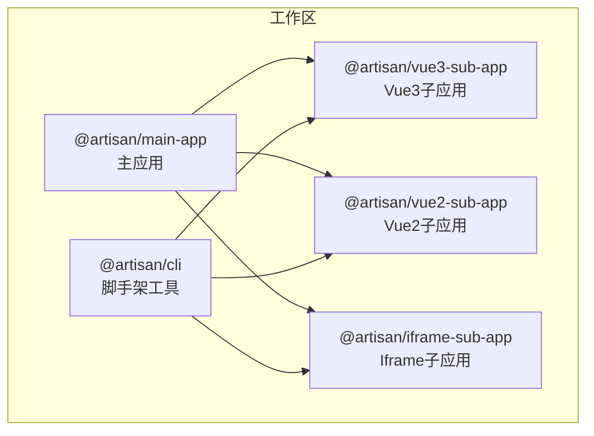
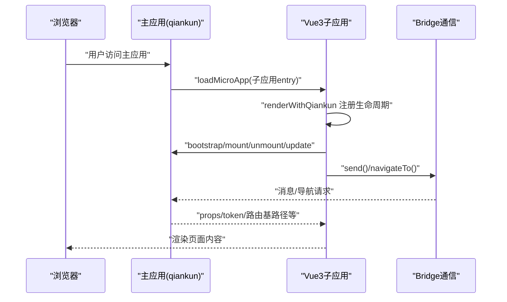
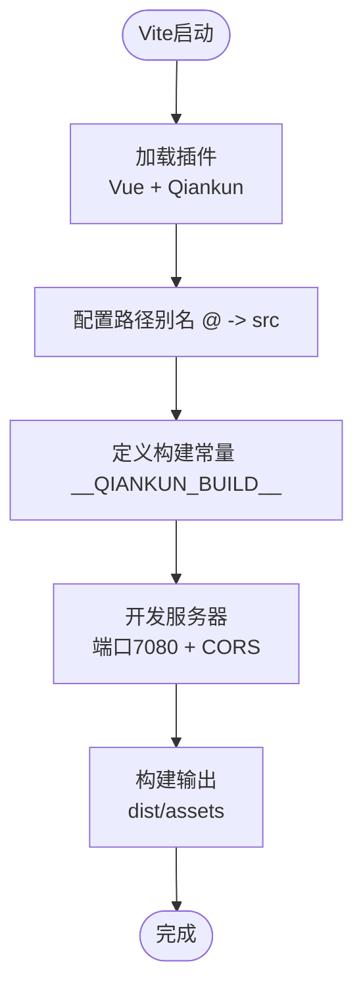
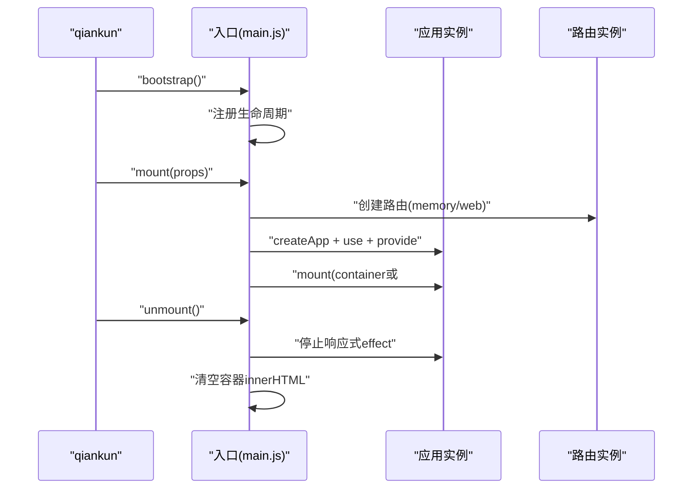
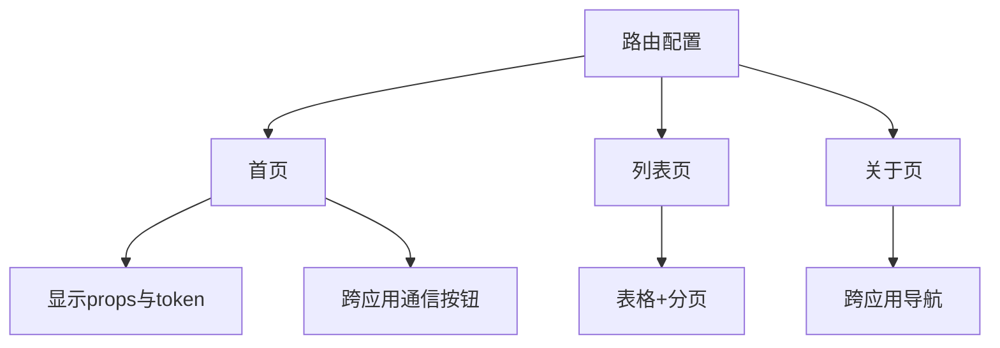
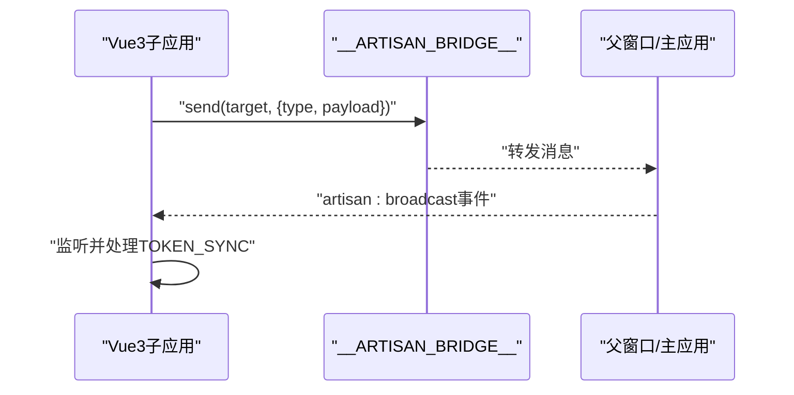
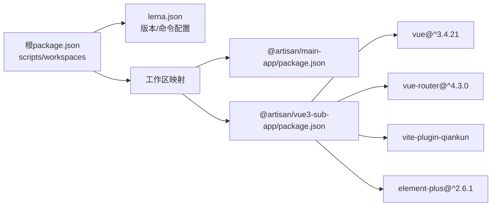

# Vue3子应用开发

<cite>
**本文档引用的文件**
- [README.md](file://README.md)
- [package.json](file://package.json)
- [lerna.json](file://lerna.json)
- [packages/vue3-sub-app/package.json](file://packages/vue3-sub-app/package.json)
- [packages/vue3-sub-app/vite.config.js](file://packages/vue3-sub-app/vite.config.js)
- [packages/vue3-sub-app/src/main.js](file://packages/vue3-sub-app/src/main.js)
- [packages/vue3-sub-app/src/router/index.js](file://packages/vue3-sub-app/src/router/index.js)
- [packages/vue3-sub-app/src/App.vue](file://packages/vue3-sub-app/src/App.vue)
- [packages/vue3-sub-app/src/views/Home.vue](file://packages/vue3-sub-app/src/views/Home.vue)
- [packages/vue3-sub-app/src/views/List.vue](file://packages/vue3-sub-app/src/views/List.vue)
- [packages/vue3-sub-app/src/views/About.vue](file://packages/vue3-sub-app/src/views/About.vue)
- [packages/vue3-sub-app/index.html](file://packages/vue3-sub-app/index.html)
- [packages/main-app/package.json](file://packages/main-app/package.json)
</cite>

## 目录
1. [简介](#简介)
2. [项目结构](#项目结构)
3. [核心组件](#核心组件)
4. [架构总览](#架构总览)
5. [详细组件分析](#详细组件分析)
6. [依赖关系分析](#依赖关系分析)
7. [性能考虑](#性能考虑)
8. [故障排除指南](#故障排除指南)
9. [结论](#结论)
10. [附录](#附录)

## 简介
本指南面向需要在微前端环境中开发与维护Vue3子应用的工程师。项目采用Monorepo架构，基于Lerna管理多包工作区，支持qiankun的loadMicroApp模式，提供主应用与多种类型子应用（Vue3/Vue2/Iframe/Link）的统一开发体验。Vue3子应用示例展示了从项目结构、Vite构建配置、qiankun适配器设置，到路由与组件开发、状态管理、跨应用通信与部署上线的完整流程。

## 项目结构
仓库采用Monorepo组织方式，核心目录与职责如下：
- packages/main-app：主应用，负责微前端编排、状态管理、布局系统与qiankun集成
- packages/vue3-sub-app：Vue3子应用示例，演示qiankun接入、独立运行、跨应用通信
- packages/vue2-sub-app：Vue2子应用示例（对比参考）
- packages/iframe-sub-app：iframe子应用示例（对比参考）
- packages/cli：脚手架工具，支持快速生成各类应用模板
- user-docs：基于VitePress的文档站点

图表来源
- [package.json](file://package.json#L6-L9)
- [lerna.json](file://lerna.json#L5-L8)

章节来源
- [README.md](file://README.md#L62-L76)
- [package.json](file://package.json#L6-L27)
- [lerna.json](file://lerna.json#L1-L25)

## 核心组件
- Vite构建与qiankun适配：通过vite-plugin-qiankun插件在开发与构建阶段注入qiankun生命周期钩子，支持独立运行与微前端挂载两种模式
- 应用入口与渲染：在入口文件中根据是否处于qiankun环境选择history类型与挂载目标，提供安全的unmount处理
- 路由系统：基于vue-router，qiankun模式下使用memory history，独立运行使用web history
- 跨应用通信：通过window.__ARTISAN_BRIDGE__桥接实现消息发送、导航跳转与广播事件监听
- UI生态：集成Element Plus，提供丰富的UI组件与主题样式

章节来源
- [packages/vue3-sub-app/vite.config.js](file://packages/vue3-sub-app/vite.config.js#L1-L41)
- [packages/vue3-sub-app/src/main.js](file://packages/vue3-sub-app/src/main.js#L1-L115)
- [packages/vue3-sub-app/src/router/index.js](file://packages/vue3-sub-app/src/router/index.js#L1-L20)
- [packages/vue3-sub-app/src/App.vue](file://packages/vue3-sub-app/src/App.vue#L1-L129)
- [packages/vue3-sub-app/src/views/Home.vue](file://packages/vue3-sub-app/src/views/Home.vue#L1-L167)
- [packages/vue3-sub-app/src/views/List.vue](file://packages/vue3-sub-app/src/views/List.vue#L1-L104)
- [packages/vue3-sub-app/src/views/About.vue](file://packages/vue3-sub-app/src/views/About.vue#L1-L81)

## 架构总览
Vue3子应用在微前端中的运行时交互如下：

图表来源
- [packages/vue3-sub-app/src/main.js](file://packages/vue3-sub-app/src/main.js#L71-L105)
- [README.md](file://README.md#L98-L120)

## 详细组件分析

### Vite构建配置与qiankun适配
- 插件链：Vue插件 + vite-plugin-qiankun插件，自动注入qiankun生命周期
- 路径别名：@指向src目录，便于模块导入
- 构建常量：通过define注入__QIANKUN_BUILD__，用于条件编译
- 开发服务器：端口7080，开启CORS与跨域头
- 构建输出：指定index.html为Rollup输入，输出dist/assets

图表来源
- [packages/vue3-sub-app/vite.config.js](file://packages/vue3-sub-app/vite.config.js#L9-L40)

章节来源
- [packages/vue3-sub-app/vite.config.js](file://packages/vue3-sub-app/vite.config.js#L1-L41)

### 应用入口与生命周期
- 渲染函数：根据是否处于qiankun挂载阶段选择history类型；通过provide注入运行模式；保存props到全局属性；优先在container内查找#app挂载点
- 生命周期钩子：bootstrap/mount/unmount/update，其中unmount避免直接调用app.unmount，改为停止响应式effect并清空容器
- 独立运行：当不在qiankun环境下，直接以独立模式渲染

图表来源
- [packages/vue3-sub-app/src/main.js](file://packages/vue3-sub-app/src/main.js#L18-L105)

章节来源
- [packages/vue3-sub-app/src/main.js](file://packages/vue3-sub-app/src/main.js#L1-L115)

### 路由配置与页面开发
- 路由定义：根路径、列表页、关于页，均采用异步组件按需加载
- 页面组件：首页展示props与token、提供跨应用通信按钮；列表页提供表格与分页；关于页展示应用信息与导航按钮

图表来源
- [packages/vue3-sub-app/src/router/index.js](file://packages/vue3-sub-app/src/router/index.js#L1-L20)
- [packages/vue3-sub-app/src/views/Home.vue](file://packages/vue3-sub-app/src/views/Home.vue#L1-L167)
- [packages/vue3-sub-app/src/views/List.vue](file://packages/vue3-sub-app/src/views/List.vue#L1-L104)
- [packages/vue3-sub-app/src/views/About.vue](file://packages/vue3-sub-app/src/views/About.vue#L1-L81)

章节来源
- [packages/vue3-sub-app/src/router/index.js](file://packages/vue3-sub-app/src/router/index.js#L1-L20)
- [packages/vue3-sub-app/src/views/Home.vue](file://packages/vue3-sub-app/src/views/Home.vue#L1-L167)
- [packages/vue3-sub-app/src/views/List.vue](file://packages/vue3-sub-app/src/views/List.vue#L1-L104)
- [packages/vue3-sub-app/src/views/About.vue](file://packages/vue3-sub-app/src/views/About.vue#L1-L81)

### 跨应用通信与状态管理
- 通信机制：通过window.__ARTISAN_BRIDGE__发送消息、导航到其他应用或主应用
- 广播监听：监听artisan:broadcast事件，处理TOKEN_SYNC等业务事件
- 独立运行模式：通过inject获取运行模式，区分qiankun/iframe/独立运行三种场景

图表来源
- [packages/vue3-sub-app/src/App.vue](file://packages/vue3-sub-app/src/App.vue#L44-L52)
- [packages/vue3-sub-app/src/views/Home.vue](file://packages/vue3-sub-app/src/views/Home.vue#L87-L109)
- [README.md](file://README.md#L130-L141)

章节来源
- [packages/vue3-sub-app/src/App.vue](file://packages/vue3-sub-app/src/App.vue#L1-L129)
- [packages/vue3-sub-app/src/views/Home.vue](file://packages/vue3-sub-app/src/views/Home.vue#L1-L167)
- [README.md](file://README.md#L130-L141)

### 组件开发模式与UI生态
- 组件风格：Composition API + script setup，配合Element Plus提供丰富UI能力
- 样式组织：scoped样式隔离，组件内样式局部生效
- 交互设计：提供按钮、表格、分页、消息提示等常用交互

章节来源
- [packages/vue3-sub-app/src/views/Home.vue](file://packages/vue3-sub-app/src/views/Home.vue#L1-L167)
- [packages/vue3-sub-app/src/views/List.vue](file://packages/vue3-sub-app/src/views/List.vue#L1-L104)
- [packages/vue3-sub-app/src/views/About.vue](file://packages/vue3-sub-app/src/views/About.vue#L1-L81)

## 依赖关系分析
- 包管理：使用Lerna + npm workspaces统一管理多包依赖与发布
- 子应用依赖：Vue3、vue-router、Element Plus、vite-plugin-qiankun
- 主应用依赖：qiankun、Pinia、持久化插件、Element Plus等

图表来源
- [package.json](file://package.json#L6-L27)
- [lerna.json](file://lerna.json#L1-L25)
- [packages/vue3-sub-app/package.json](file://packages/vue3-sub-app/package.json#L12-L21)
- [packages/main-app/package.json](file://packages/main-app/package.json#L12-L29)

章节来源
- [package.json](file://package.json#L1-L50)
- [lerna.json](file://lerna.json#L1-L25)
- [packages/vue3-sub-app/package.json](file://packages/vue3-sub-app/package.json#L1-L23)
- [packages/main-app/package.json](file://packages/main-app/package.json#L1-L31)

## 性能考虑
- 代码分割：路由异步组件按需加载，减少首屏体积
- 资源优化：Vite构建产物按目录分离，rollupOptions明确输入输出
- 历史模式：qiankun模式使用memory history，避免URL副作用
- 卸载安全：避免在unmount阶段直接调用app.unmount，改用停止响应式effect与清空容器，降低DOM操作风险

章节来源
- [packages/vue3-sub-app/src/router/index.js](file://packages/vue3-sub-app/src/router/index.js#L1-L20)
- [packages/vue3-sub-app/vite.config.js](file://packages/vue3-sub-app/vite.config.js#L33-L39)
- [packages/vue3-sub-app/src/main.js](file://packages/vue3-sub-app/src/main.js#L79-L101)

## 故障排除指南
- 独立运行与qiankun模式切换：确认入口文件中运行模式判断逻辑与history选择
- 卸载异常：若出现unmount相关报错，检查是否直接调用了app.unmount，应遵循示例中的安全处理方式
- 跨域问题：开发阶段确保Vite server开启CORS与允许的origin/headers
- 路由跳转：qiankun模式下需通过props.subPath进行初始路由导航

章节来源
- [packages/vue3-sub-app/src/main.js](file://packages/vue3-sub-app/src/main.js#L30-L66)
- [packages/vue3-sub-app/vite.config.js](file://packages/vue3-sub-app/vite.config.js#L25-L32)
- [packages/vue3-sub-app/src/main.js](file://packages/vue3-sub-app/src/main.js#L61-L63)

## 结论
该Vue3子应用示例完整展示了微前端场景下的工程化实践：从Monorepo组织、Vite构建配置、qiankun适配器设置，到路由与组件开发、跨应用通信与部署流程。遵循本文档的最佳实践与性能建议，可高效构建稳定可靠的Vue3子应用。

## 附录

### 开发与部署流程
- 安装依赖：在根目录执行安装命令
- 启动所有应用：使用并行脚本同时启动主应用与各子应用
- 单独启动：分别启动主应用与Vue3子应用（端口分别为8080与7080）
- 构建产物：各应用独立构建，输出至各自dist目录
- 文档服务：启动VitePress文档站点

章节来源
- [README.md](file://README.md#L26-L61)
- [package.json](file://package.json#L10-L27)

### CLI使用
- 全局链接CLI：在packages/cli目录执行链接命令
- 创建主应用/子应用：支持创建不同类型的微应用模板

章节来源
- [README.md](file://README.md#L78-L96)

### 微应用配置示例
- 唯一标识、名称、入口地址、激活规则、容器选择器、状态、版本、预加载、类型、布局选项等字段

章节来源
- [README.md](file://README.md#L98-L120)