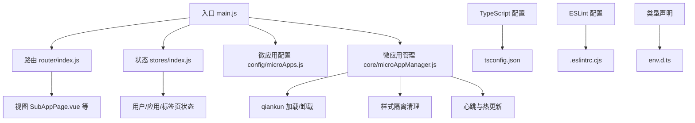
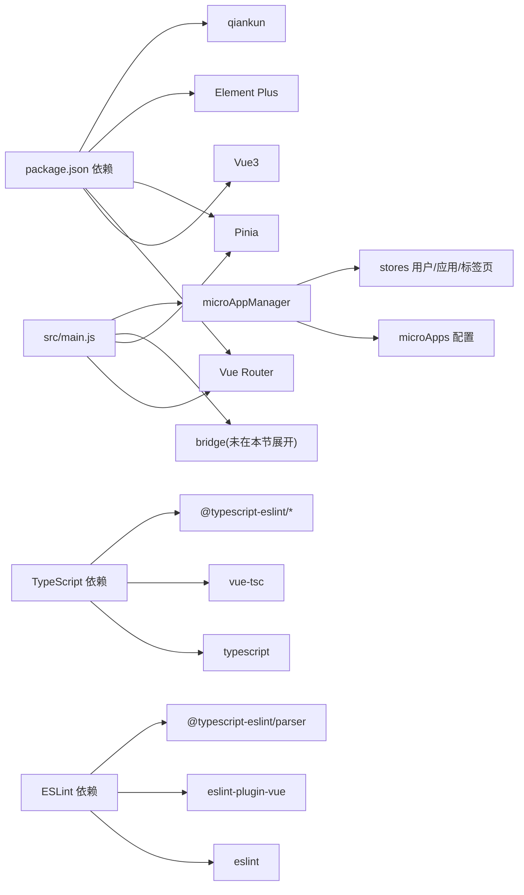

# 主应用开发

<cite>
**本文引用的文件**
- [packages/main-app/package.json](file://packages/main-app/package.json)
- [packages/main-app/vite.config.js](file://packages/main-app/vite.config.js)
- [packages/main-app/src/main.js](file://packages/main-app/src/main.js)
- [packages/main-app/src/config/microApps.js](file://packages/main-app/src/config/microApps.js)
- [packages/main-app/src/core/microAppManager.js](file://packages/main-app/src/core/microAppManager.js)
- [packages/main-app/src/router/index.js](file://packages/main-app/src/router/index.js)
- [packages/main-app/src/stores/index.js](file://packages/main-app/src/stores/index.js)
- [packages/main-app/tsconfig.json](file://packages/main-app/tsconfig.json)
- [packages/main-app/tsconfig.node.json](file://packages/main-app/tsconfig.node.json)
- [packages/main-app/.eslintrc.cjs](file://packages/main-app/.eslintrc.cjs)
- [packages/main-app/src/env.d.ts](file://packages/main-app/src/env.d.ts)
</cite>

## 更新摘要
**所做更改**
- 新增 TypeScript 配置章节，涵盖 tsconfig.json 和 tsconfig.node.json 的完整配置说明
- 新增 ESLint 配置章节，详细说明 .eslintrc.cjs 的规则配置和扩展设置
- 更新开发工具链章节，包含 TypeScript 编译检查和 ESLint 代码质量检查
- 更新依赖版本信息，反映最新的 TypeScript、ESLint 和相关插件版本
- 新增类型声明文件 env.d.ts 的说明，涵盖 Vue 模块声明和环境变量类型定义
- 优化开发服务器设置，包含主机、端口、跨域和头部配置

## 目录
1. [简介](#简介)
2. [项目结构](#项目结构)
3. [核心组件](#核心组件)
4. [架构总览](#架构总览)
5. [组件详解](#组件详解)
6. [开发工具链](#开发工具链)
7. [依赖关系分析](#依赖关系分析)
8. [性能考量](#性能考量)
9. [故障排除指南](#故障排除指南)
10. [结论](#结论)
11. [附录](#附录)

## 简介
本指南面向主应用开发者，系统讲解主应用的初始化流程、qiankun 微前端引擎集成、微应用生命周期管理、微应用配置系统、主子应用通信协调（路由同步、状态共享、事件传递）、开发与部署最佳实践，以及调试、性能优化与故障排除方法。内容基于仓库中主应用包的实际实现，确保读者能够快速上手并稳定落地。

**更新** 本版本新增了完整的 TypeScript 和 ESLint 配置支持，提升了代码质量和开发体验。开发服务器经过优化，提供了更好的开发体验和跨域支持。

## 项目结构
主应用位于 packages/main-app，采用 Vite + Vue3 + Pinia + Element Plus 技术栈，通过 qiankun 实现微前端集成。核心目录与职责概览如下：
- src/main.js：应用入口，负责创建 Vue 应用、注册插件、桥接通信、挂载根组件
- src/router/index.js：路由定义与守卫，支持主应用与多类子应用的路径映射
- src/stores/*：状态管理（Pinia），提供应用状态、用户状态、标签页状态等
- src/config/microApps.js：微应用配置中心，集中管理各子应用的入口、激活规则、布局选项等
- src/core/microAppManager.js：微应用管理器，封装加载、卸载、预加载、心跳检测、热更新、样式隔离清理等能力
- vite.config.js：构建与开发服务器配置，含别名、CSS 预处理器、分包策略、端口与跨域设置
- package.json：依赖与脚本定义（dev/build/preview/lint/typecheck）
- **新增** tsconfig.json：TypeScript 编译配置，支持严格模式和模块解析
- **新增** tsconfig.node.json：Node 环境 TypeScript 配置
- **新增** .eslintrc.cjs：ESLint 配置文件，支持 Vue3 和 TypeScript 语法检查
- **新增** src/env.d.ts：环境变量和模块声明类型定义

**图表来源**
- [packages/main-app/src/main.js](file://packages/main-app/src/main.js#L1-L40)
- [packages/main-app/src/router/index.js](file://packages/main-app/src/router/index.js#L1-L130)
- [packages/main-app/src/stores/index.js](file://packages/main-app/src/stores/index.js#L1-L12)
- [packages/main-app/src/config/microApps.js](file://packages/main-app/src/config/microApps.js#L1-L110)
- [packages/main-app/src/core/microAppManager.js](file://packages/main-app/src/core/microAppManager.js#L1-L515)
- [packages/main-app/tsconfig.json](file://packages/main-app/tsconfig.json#L1-L46)
- [packages/main-app/.eslintrc.cjs](file://packages/main-app/.eslintrc.cjs#L1-L56)
- [packages/main-app/src/env.d.ts](file://packages/main-app/src/env.d.ts#L1-L29)

**章节来源**
- [packages/main-app/package.json](file://packages/main-app/package.json#L1-L35)
- [packages/main-app/vite.config.js](file://packages/main-app/vite.config.js#L1-L43)

## 核心组件
- 应用入口与初始化
  - 创建 Vue 应用、安装路由与状态管理、注册 Element Plus 及图标组件、初始化跨应用桥接、挂载根节点
  - 将微应用管理器暴露至全局以便调试
- 路由系统
  - 定义主应用与子应用的路由映射，支持通配符路径；在前置守卫中设置加载态与激活应用，在后置守卫中维护标签页
- 状态管理
  - 使用 Pinia 并启用持久化插件，导出应用、用户、标签页等 Store 供业务模块使用
- 微应用配置
  - 统一声明各子应用的入口地址、激活规则、容器、状态、版本、预加载、类型、布局选项与自定义属性
- 微应用管理器
  - 提供加载/卸载/刷新、预加载、心跳检测、热更新、样式隔离清理、错误日志、上下线控制等能力

**章节来源**
- [packages/main-app/src/main.js](file://packages/main-app/src/main.js#L1-L40)
- [packages/main-app/src/router/index.js](file://packages/main-app/src/router/index.js#L1-L130)
- [packages/main-app/src/stores/index.js](file://packages/main-app/src/stores/index.js#L1-L12)
- [packages/main-app/src/config/microApps.js](file://packages/main-app/src/config/microApps.js#L1-L110)
- [packages/main-app/src/core/microAppManager.js](file://packages/main-app/src/core/microAppManager.js#L1-L515)

## 架构总览
主应用通过路由驱动进入子应用页面，微应用管理器根据配置与激活规则加载对应子应用（qiankun 或 iframe），并通过桥接通道传递令牌、路由基座、应用 ID 等上下文。管理器还负责生命周期监控、样式隔离清理、热更新检测与错误记录。

**图表来源**
- [packages/main-app/src/router/index.js](file://packages/main-app/src/router/index.js#L42-L52)
- [packages/main-app/src/core/microAppManager.js](file://packages/main-app/src/core/microAppManager.js#L96-L134)

## 组件详解

### 应用初始化与入口
- 初始化步骤
  - 创建 Vue 应用实例，安装路由与状态管理，注册 Element Plus 及图标组件
  - 初始化跨应用桥接，随后挂载根节点
  - 将微应用管理器挂载到全局以便调试
- 关键点
  - 插件顺序与依赖关系明确，确保状态与路由在应用层面可用
  - 全局暴露管理器便于开发期排查

**章节来源**
- [packages/main-app/src/main.js](file://packages/main-app/src/main.js#L1-L40)

### 路由系统与激活规则
- 路由设计
  - 主应用首页、应用管理、多应用实例同屏等页面
  - 子应用路由：以 /vue3/:pathMatch、/vue2/:pathMatch、/iframe/:pathMatch 匹配，meta 中携带 appId
- 激活规则
  - 在前置守卫中根据目标路由 meta/appId 设置当前激活应用
  - 在后置守卫中关闭加载态并添加标签页
- 与微应用的关系
  - 路由仅负责"进入子应用页面"，具体加载由微应用管理器按配置执行

**章节来源**
- [packages/main-app/src/router/index.js](file://packages/main-app/src/router/index.js#L1-L130)

### 微应用配置系统
- 配置项要点
  - id/name/entry/activeRule/container/status/version/lastModified/preload/type/layoutType/layoutOptions/props
  - props 中包含 routerBase 等关键字段，用于子应用路由基座
- 查询与更新
  - 提供按 ID、状态、类型查询与动态更新配置的能力
- 类型支持
  - 支持 vue3、vue2、iframe、link 等类型，link 类型会直接打开新窗口

**章节来源**
- [packages/main-app/src/config/microApps.js](file://packages/main-app/src/config/microApps.js#L1-L110)

### 微应用管理器（核心）
- 能力概览
  - 加载/卸载/刷新：支持 qiankun 与 iframe 两类子应用
  - 预加载：对满足条件的应用进行预取
  - 心跳检测：定期检查应用健康状态或向 iframe 发送 PING
  - 热更新：通过 HEAD 请求 last-modified 检测变更并自动刷新
  - 样式隔离清理：移除 qiankun 注入的样式与子应用入口相关资源
  - 错误日志：统一记录并限制数量
  - 上下线控制：动态更新配置并按需卸载
- 关键流程
  - 加载流程：校验配置与状态 -> 防重 -> 选择加载路径 -> 传入 props（token、mainRouter、bridge、appId）-> 等待挂载 -> 启动心跳/热更新
  - 卸载流程：停止心跳 -> 卸载应用或移除 iframe -> 清理容器 -> 清理样式 -> 删除记录
  - 预加载流程：筛选满足条件的应用 -> 执行预取 -> 更新预加载状态
  - 热更新流程：HEAD 请求获取 last-modified -> 比较缓存 -> 新于缓存则刷新

**图表来源**
- [packages/main-app/src/core/microAppManager.js](file://packages/main-app/src/core/microAppManager.js#L11-L515)

**章节来源**
- [packages/main-app/src/core/microAppManager.js](file://packages/main-app/src/core/microAppManager.js#L1-L515)

### 跨应用通信与事件传递
- 令牌与上下文传递
  - 通过 props 将 token、mainRouter、bridge、appId 等传递给子应用
- iframe 初始化
  - iframe 加载完成后通过桥接通道发送 INIT 消息，携带 token 与 appId
- 心跳与 PING
  - 对 iframe 应用周期性发送 PING，维持连接健康
- 事件通道
  - 通过桥接模块实现主子应用间的消息传递（具体实现位于桥接模块）

**章节来源**
- [packages/main-app/src/core/microAppManager.js](file://packages/main-app/src/core/microAppManager.js#L96-L134)
- [packages/main-app/src/core/microAppManager.js](file://packages/main-app/src/core/microAppManager.js#L206-L220)
- [packages/main-app/src/core/microAppManager.js](file://packages/main-app/src/core/microAppManager.js#L364-L375)

## 开发工具链

### TypeScript 配置
主应用采用完整的 TypeScript 支持，配置文件位于 tsconfig.json 和 tsconfig.node.json：

- 编译选项配置
  - 目标版本：ES2020，模块系统：ESNext，库支持：DOM、DOM.Iterable
  - 模块解析：bundler，允许导入 TS 扩展名，JSON 模块解析
  - 严格模式：启用，无未使用局部变量和参数检查
  - 路径映射：@/* 指向 ./src/*
- 类型声明
  - 包含 vite/client、element-plus/global、node 类型
  - 支持 Vue 模块声明和 SCSS 模块声明
- 节点环境配置
  - tsconfig.node.json 专用于 Vite 配置文件的 TypeScript 检查

**章节来源**
- [packages/main-app/tsconfig.json](file://packages/main-app/tsconfig.json#L1-L46)
- [packages/main-app/tsconfig.node.json](file://packages/main-app/tsconfig.node.json#L1-L12)
- [packages/main-app/src/env.d.ts](file://packages/main-app/src/env.d.ts#L1-L29)

### ESLint 配置
ESLint 配置文件 .eslintrc.cjs 提供全面的代码质量检查：

- 扩展配置
  - 基础：eslint:recommended
  - Vue3：plugin:vue/vue3-recommended
  - TypeScript：plugin:@typescript-eslint/recommended
- 解析器设置
  - vue-eslint-parser，@typescript-eslint/parser
  - ES 最新版本，模块类型：module
- 规则配置
  - TypeScript 特定规则：禁用显式 any、require 导入等
  - Vue 规则：多词组件名禁用、HTML 警告等
  - JavaScript 规则：console 控制、debugger 处理等
- 文件覆盖
  - JS/Vue 文件：禁用某些 TypeScript 规则
  - TS/TSX 文件：启用未使用变量警告

**章节来源**
- [packages/main-app/.eslintrc.cjs](file://packages/main-app/.eslintrc.cjs#L1-L56)

### 开发服务器优化
开发服务器配置经过优化，提供更好的开发体验：

- 服务器设置
  - 主机：0.0.0.0（允许外部访问）
  - 端口：8080
  - CORS：启用跨域支持
  - 严格端口：false（端口占用时自动调整）
  - 自动打开：false（避免不必要的浏览器打开）
  - 自定义头部：Access-Control-Allow-Origin: *
- CSS 预处理器
  - Sass/SCSS 配置，支持全局变量注入
  - 通过 additionalData 注入主题变量

**章节来源**
- [packages/main-app/vite.config.js](file://packages/main-app/vite.config.js#L12-L21)
- [packages/main-app/vite.config.js](file://packages/main-app/vite.config.js#L22-L27)

### 开发流程与最佳实践
- 项目初始化
  - 安装依赖后，使用 dev 脚本启动本地服务（默认端口 8080）
  - 构建产物输出至 dist，静态资源目录 assets
- TypeScript 开发
  - 使用 vue-tsc 进行类型检查，确保代码类型安全
  - 通过 env.d.ts 定义环境变量类型，提升开发体验
- 代码质量保证
  - 使用 ESLint 进行语法检查和代码风格规范
  - 通过 lint 和 lint:fix 脚本自动化代码质量检查
- 路由与页面
  - 在路由中为每个子应用配置独立路径段，并在 meta 中标注 appId
  - 页面组件中通过容器占位渲染子应用
- 微应用接入
  - 在配置文件中新增/更新子应用配置，设置激活规则与容器
  - 如需预加载，开启 preload 并保证入口可达
- 状态与标签页
  - 在路由守卫中维护加载态与标签页，提升用户体验
- 构建优化
  - 通过手动分包策略将 element-plus 与 vue 生态拆分，减少首屏体积
  - CSS 预处理器注入全局变量，统一主题风格

**章节来源**
- [packages/main-app/package.json](file://packages/main-app/package.json#L6-L13)
- [packages/main-app/vite.config.js](file://packages/main-app/vite.config.js#L29-L42)
- [packages/main-app/src/router/index.js](file://packages/main-app/src/router/index.js#L93-L127)

## 依赖关系分析
- 外部依赖
  - Vue3、Vue Router、Pinia、Element Plus、qiankun、axios、lodash-es 等
- 内部依赖
  - main.js 依赖 router、stores、bridge、microAppManager
  - router 依赖 stores
  - microAppManager 依赖 microApps、stores、bridge
- 构建与开发
  - Vite 插件与别名配置、CSS 预处理、分包策略、开发服务器端口与跨域头
- **新增** TypeScript 依赖
  - typescript、vue-tsc、@typescript-eslint/eslint-plugin 等
- **新增** ESLint 依赖
  - eslint、eslint-plugin-vue、@typescript-eslint/parser 等

**图表来源**
- [packages/main-app/package.json](file://packages/main-app/package.json#L14-L33)
- [packages/main-app/tsconfig.json](file://packages/main-app/tsconfig.json#L29)
- [packages/main-app/.eslintrc.cjs](file://packages/main-app/.eslintrc.cjs#L8-L22)
- [packages/main-app/src/main.js](file://packages/main-app/src/main.js#L1-L35)
- [packages/main-app/src/core/microAppManager.js](file://packages/main-app/src/core/microAppManager.js#L1-L10)
- [packages/main-app/src/config/microApps.js](file://packages/main-app/src/config/microApps.js#L1-L10)

**章节来源**
- [packages/main-app/package.json](file://packages/main-app/package.json#L1-L35)
- [packages/main-app/src/main.js](file://packages/main-app/src/main.js#L1-L35)

## 性能考量
- 分包与缓存
  - 通过 Rollup manualChunks 将 element-plus 与 vue 生态独立打包，提升缓存命中率
- 样式隔离
  - 启用沙箱样式隔离，并在卸载时清理 qiankun 注入的样式与子应用入口相关资源，避免样式污染与内存泄漏
- 预加载
  - 对满足条件的应用执行预取，缩短首次加载时间
- 资源过滤
  - 排除 Element Plus/UI 的 CSS 资源，避免与主应用重复引入
- **新增** TypeScript 优化
  - 通过 noEmit 配置避免重复编译，提升构建性能
  - 使用 bundler 模块解析，优化模块打包效率

**章节来源**
- [packages/main-app/vite.config.js](file://packages/main-app/vite.config.js#L34-L41)
- [packages/main-app/src/core/microAppManager.js](file://packages/main-app/src/core/microAppManager.js#L108-L120)
- [packages/main-app/src/core/microAppManager.js](file://packages/main-app/src/core/microAppManager.js#L288-L313)
- [packages/main-app/src/core/microAppManager.js](file://packages/main-app/src/core/microAppManager.js#L421-L440)
- [packages/main-app/tsconfig.json](file://packages/main-app/tsconfig.json#L13)

## 故障排除指南
- 常见问题定位
  - 应用未找到或已下线：检查配置中的 id、status 与入口地址
  - 容器未找到：确认容器元素存在且传入的是 DOM 而非选择器字符串
  - 重复加载：确保同一 appId 同时只加载一个实例
  - 样式污染：卸载后检查是否清理了 qiankun 注入样式与子应用入口资源
- 日志与调试
  - 查看控制台输出与错误日志队列，定位加载失败原因
  - 通过全局暴露的微应用管理器查看已加载应用与错误详情
- 热更新与心跳
  - 若热更新未生效，检查子应用入口的 last-modified 响应头与 HEAD 请求可达性
  - iframe 心跳异常时，检查桥接通道与 PING/PONG 交互
- **新增** TypeScript 相关问题
  - 类型检查失败：运行 npm run typecheck 检查类型定义
  - 模块解析错误：检查 tsconfig.json 中的路径映射配置
  - 编译错误：确认 TypeScript 版本兼容性和类型声明文件完整性
- **新增** ESLint 相关问题
  - 规则冲突：检查 .eslintrc.cjs 中的规则配置和文件覆盖设置
  - 语法检查失败：运行 npm run lint 或 npm run lint:fix 修复常见问题
- **新增** 开发服务器问题
  - 端口占用：开发服务器会自动调整端口，检查控制台输出
  - 跨域问题：确认 CORS 配置和 Access-Control-Allow-Origin 头设置
  - 外部访问：确保 host 设置为 0.0.0.0 以允许外部设备访问

**章节来源**
- [packages/main-app/src/core/microAppManager.js](file://packages/main-app/src/core/microAppManager.js#L52-L62)
- [packages/main-app/src/core/microAppManager.js](file://packages/main-app/src/core/microAppManager.js#L89-L91)
- [packages/main-app/src/core/microAppManager.js](file://packages/main-app/src/core/microAppManager.js#L157-L164)
- [packages/main-app/src/core/microAppManager.js](file://packages/main-app/src/core/microAppManager.js#L288-L313)
- [packages/main-app/src/core/microAppManager.js](file://packages/main-app/src/core/microAppManager.js#L392-L415)
- [packages/main-app/src/core/microAppManager.js](file://packages/main-app/src/core/microAppManager.js#L364-L375)
- [packages/main-app/tsconfig.json](file://packages/main-app/tsconfig.json#L1-L46)
- [packages/main-app/.eslintrc.cjs](file://packages/main-app/.eslintrc.cjs#L1-L56)
- [packages/main-app/vite.config.js](file://packages/main-app/vite.config.js#L12-L21)

## 结论
本指南基于仓库实际实现，系统梳理了主应用初始化、qiankun 集成、微应用配置与生命周期管理、路由与状态协同、跨应用通信、性能优化与故障排除等关键环节。**更新** 本版本新增了完整的 TypeScript 和 ESLint 配置支持，显著提升了代码质量和开发效率。开发服务器经过优化，提供了更好的开发体验和跨域支持。建议在开发中遵循配置集中化、加载流程标准化、样式隔离与清理规范化、错误日志可追溯、类型安全和代码质量检查以及开发服务器最佳实践的原则，以获得稳定可靠的微前端主应用体验。

## 附录
- 开发命令
  - 启动：npm run dev（默认端口 8080）
  - 构建：npm run build
  - 预览：npm run preview
  - 代码检查：npm run lint
  - 自动修复：npm run lint:fix
  - 类型检查：npm run typecheck
- 构建产物
  - 输出目录：dist
  - 静态资源目录：assets
- 调试入口
  - 全局访问微应用管理器：window.__ARTISAN_MICRO_APP_MANAGER__
- **新增** TypeScript 配置
  - 主配置：tsconfig.json
  - 节点配置：tsconfig.node.json
  - 环境声明：src/env.d.ts
- **新增** 代码质量工具
  - ESLint 配置：.eslintrc.cjs
  - 规则扩展：Vue3、TypeScript、推荐规则
- **新增** 开发服务器配置
  - 主机：0.0.0.0（允许外部访问）
  - 端口：8080
  - CORS：启用跨域支持
  - 自定义头部：Access-Control-Allow-Origin: *

**章节来源**
- [packages/main-app/package.json](file://packages/main-app/package.json#L6-L13)
- [packages/main-app/vite.config.js](file://packages/main-app/vite.config.js#L29-L42)
- [packages/main-app/src/main.js](file://packages/main-app/src/main.js#L36-L38)
- [packages/main-app/tsconfig.json](file://packages/main-app/tsconfig.json#L1-L46)
- [packages/main-app/.eslintrc.cjs](file://packages/main-app/.eslintrc.cjs#L1-L56)
- [packages/main-app/src/env.d.ts](file://packages/main-app/src/env.d.ts#L1-L29)