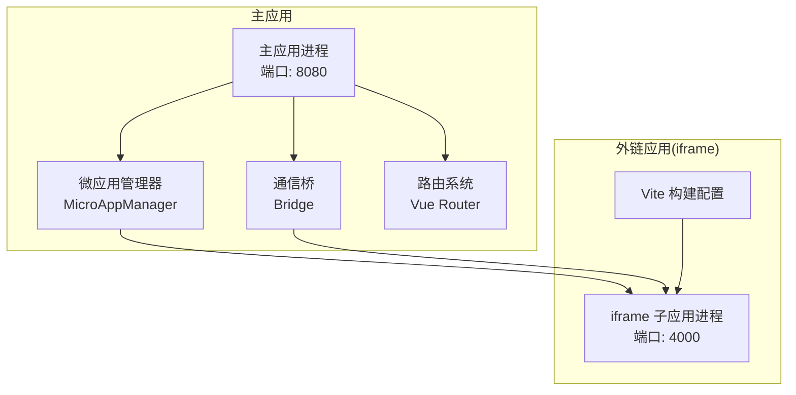
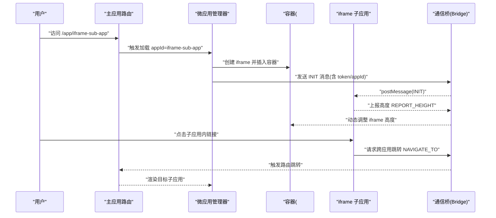
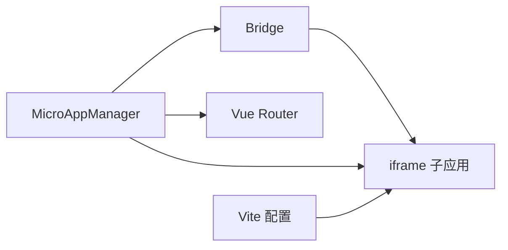
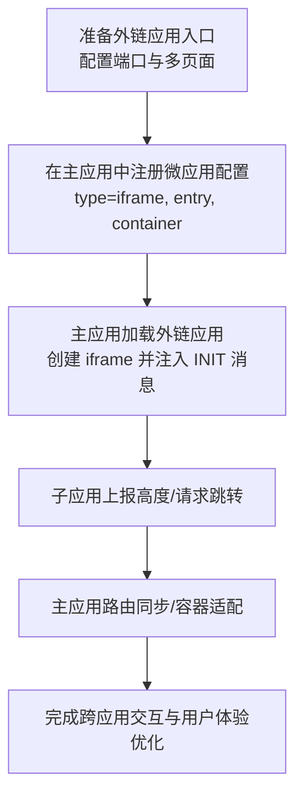

# 外链应用开发

<cite>
**本文引用的文件**
- [README.md](file://README.md)
- [packages/iframe-sub-app/vite.config.js](file://packages/iframe-sub-app/vite.config.js)
- [packages/main-app/src/core/microAppManager.js](file://packages/main-app/src/core/microAppManager.js)
- [packages/main-app/src/core/bridge.js](file://packages/main-app/src/core/bridge.js)
- [packages/main-app/src/router/index.js](file://packages/main-app/src/router/index.js)
- [user-docs/api/micro-app-manager.md](file://user-docs/api/micro-app-manager.md)
- [user-docs/guide/sub-apps.md](file://user-docs/guide/sub-apps.md)
</cite>

## 目录
1. [简介](#简介)
2. [项目结构](#项目结构)
3. [核心组件](#核心组件)
4. [架构总览](#架构总览)
5. [详细组件分析](#详细组件分析)
6. [依赖关系分析](#依赖关系分析)
7. [性能考量](#性能考量)
8. [故障排查指南](#故障排查指南)
9. [结论](#结论)
10. [附录](#附录)

## 简介
本指南面向需要开发“外链应用”（iframe 子应用）的开发者，围绕以下主题展开：外链应用的配置方法与集成模式（URL 配置、激活规则、容器管理）、导航与路由同步、用户体验优化、与主应用的交互（参数传递、状态同步、事件通信），以及开发最佳实践（URL 设计、安全与性能）。文档结合仓库中的实际实现，提供可落地的步骤与可视化图示。

## 项目结构
- 主应用与子应用采用 Monorepo 架构，使用 Lerna + npm workspace 管理。
- 外链应用属于 iframe 类型子应用，通过 postMessage 与主应用通信，具备独立构建与端口配置。
- 主应用负责微应用生命周期管理、路由编排、跨应用通信桥接与容器渲染。

图表来源
- [packages/main-app/src/core/microAppManager.js](file://packages/main-app/src/core/microAppManager.js#L1-L515)
- [packages/main-app/src/core/bridge.js](file://packages/main-app/src/core/bridge.js#L1-L241)
- [packages/main-app/src/router/index.js](file://packages/main-app/src/router/index.js#L1-L130)
- [packages/iframe-sub-app/vite.config.js](file://packages/iframe-sub-app/vite.config.js#L1-L23)

章节来源
- [README.md](file://README.md#L62-L76)
- [README.md](file://README.md#L17-L25)

## 核心组件
- 微应用管理器（MicroAppManager）：负责加载、卸载、刷新、预加载、心跳检测、样式隔离与清理、错误日志收集等。
- 通信桥（Bridge）：负责主应用与 iframe 子应用之间的消息收发、跨应用跳转、token 同步、高度上报等。
- 路由系统（Vue Router）：定义激活规则与容器映射，承载外链应用的路由入口与参数透传。
- 外链应用构建配置（Vite）：定义端口、CORS 与多页面构建入口。

章节来源
- [packages/main-app/src/core/microAppManager.js](file://packages/main-app/src/core/microAppManager.js#L1-L515)
- [packages/main-app/src/core/bridge.js](file://packages/main-app/src/core/bridge.js#L1-L241)
- [packages/main-app/src/router/index.js](file://packages/main-app/src/router/index.js#L1-L130)
- [packages/iframe-sub-app/vite.config.js](file://packages/iframe-sub-app/vite.config.js#L1-L23)

## 架构总览
外链应用以 iframe 形式嵌入主应用容器，主应用通过 MicroAppManager 创建 iframe 并注入初始消息；iframe 内容通过 Bridge 与主应用进行双向通信，实现导航、参数传递、状态同步与事件广播。

图表来源
- [packages/main-app/src/router/index.js](file://packages/main-app/src/router/index.js#L16-L74)
- [packages/main-app/src/core/microAppManager.js](file://packages/main-app/src/core/microAppManager.js#L173-L232)
- [packages/main-app/src/core/bridge.js](file://packages/main-app/src/core/bridge.js#L32-L78)

## 详细组件分析

### 外链应用配置与集成
- URL 配置
  - 外链应用入口 entry 为独立域名/端口，主应用通过 MicroAppManager 加载时拼接 options.path 作为子路径。
  - 外链应用构建配置中定义端口与多页面入口，便于本地联调与产物发布。
- 激活规则设置
  - 主应用路由中为外链应用定义路径前缀（如 /iframe/:pathMatch），用于识别与渲染。
  - 激活规则与容器选择器在微应用配置中声明，主应用根据 appId 与容器选择器进行挂载。
- 容器管理
  - MicroAppManager 在加载 iframe 时创建 iframe 元素并插入指定容器，卸载时清理容器与样式，避免样式污染。

章节来源
- [packages/iframe-sub-app/vite.config.js](file://packages/iframe-sub-app/vite.config.js#L1-L23)
- [packages/main-app/src/router/index.js](file://packages/main-app/src/router/index.js#L64-L74)
- [packages/main-app/src/core/microAppManager.js](file://packages/main-app/src/core/microAppManager.js#L173-L232)

### 导航处理与路由同步
- 主应用路由
  - 通过 /app/:appId 统一承载子应用渲染，携带 subPath 与查询参数，实现子应用内的二次路由同步。
  - 路由守卫负责设置激活应用、关闭加载态与标签页管理。
- 跨应用跳转
  - 通过 Bridge 的 NAVIGATE_TO/NAVIGATE_TO_MAIN 消息类型，主应用内部完成路由跳转。
  - 子应用可通过 window.__ARTISAN_BRIDGE__ 触发跨应用跳转。

章节来源
- [packages/main-app/src/router/index.js](file://packages/main-app/src/router/index.js#L16-L23)
- [packages/main-app/src/router/index.js](file://packages/main-app/src/router/index.js#L92-L127)
- [packages/main-app/src/core/bridge.js](file://packages/main-app/src/core/bridge.js#L32-L49)
- [README.md](file://README.md#L130-L141)

### 用户体验优化
- 自适应高度
  - 子应用通过 REPORT_HEIGHT 上报滚动高度，主应用动态调整 iframe 高度，避免滚动条出现。
- 心跳检测
  - 对 iframe 子应用定期发送 PING，监测健康状态；对 qiankun 子应用定期检查挂载状态。
- 热更新检测
  - 对非 iframe 子应用通过 HEAD 请求 last-modified 判断热更新，自动刷新。

章节来源
- [packages/main-app/src/core/bridge.js](file://packages/main-app/src/core/bridge.js#L65-L72)
- [packages/main-app/src/core/microAppManager.js](file://packages/main-app/src/core/microAppManager.js#L340-L375)
- [packages/main-app/src/core/microAppManager.js](file://packages/main-app/src/core/microAppManager.js#L392-L415)

### 与主应用的交互
- 参数传递
  - 通过路由 query（subPath、自定义参数）与 Bridge 消息体 payload 双通道传递。
- 状态同步
  - Bridge 提供 TOKEN_SYNC 广播，主应用统一同步 token 到所有子应用。
- 事件通信
  - Bridge 支持注册/移除消息处理器，实现点对点或广播事件通信。

章节来源
- [packages/main-app/src/core/bridge.js](file://packages/main-app/src/core/bridge.js#L176-L182)
- [packages/main-app/src/core/bridge.js](file://packages/main-app/src/core/bridge.js#L119-L131)
- [packages/main-app/src/core/bridge.js](file://packages/main-app/src/core/bridge.js#L159-L171)

### 开发最佳实践
- URL 设计
  - 外链应用入口使用独立端口与明确的 entry 前缀，避免与主应用路由冲突。
  - 子应用内路由采用 history 模式并以 appId 为命名空间，保证多实例场景下的隔离。
- 安全性
  - 严格校验 postMessage 的 origin，仅允许受信源。
  - iframe 使用 sandbox 属性限制能力，最小权限原则。
- 性能优化
  - 合理使用预加载与热更新检测，减少首屏等待。
  - 控制样式隔离范围，避免全局样式污染。

章节来源
- [packages/main-app/src/core/bridge.js](file://packages/main-app/src/core/bridge.js#L96-L101)
- [packages/main-app/src/core/microAppManager.js](file://packages/main-app/src/core/microAppManager.js#L188-L189)
- [user-docs/guide/sub-apps.md](file://user-docs/guide/sub-apps.md#L148-L155)

### 完整配置示例与使用场景
- 外链应用配置要点
  - 在微应用配置中声明 id、name、entry、activeRule、container、type、layoutOptions 等字段。
  - 对外链应用设置 type: 'iframe'，并确保 entry 与端口正确。
- 使用场景
  - 场景一：在主应用中以 iframe 承载第三方页面，通过 Bridge 进行参数传递与状态同步。
  - 场景二：在子应用内发起跨应用跳转，主应用路由统一处理并渲染目标子应用。
  - 场景三：子应用动态上报高度，主应用自适应调整容器尺寸。

章节来源
- [README.md](file://README.md#L98-L120)
- [README.md](file://README.md#L130-L141)
- [user-docs/api/micro-app-manager.md](file://user-docs/api/micro-app-manager.md#L13-L31)
- [user-docs/guide/sub-apps.md](file://user-docs/guide/sub-apps.md#L117-L155)

## 依赖关系分析
- 主应用依赖 qiankun 进行微前端加载与沙箱隔离，同时维护 Bridge 与 Router。
- 外链应用依赖 Vite 进行本地开发与构建，暴露独立端口。
- MicroAppManager 与 Bridge 是主应用对外链应用进行生命周期与通信控制的核心。

图表来源
- [packages/main-app/src/core/microAppManager.js](file://packages/main-app/src/core/microAppManager.js#L1-L515)
- [packages/main-app/src/core/bridge.js](file://packages/main-app/src/core/bridge.js#L1-L241)
- [packages/main-app/src/router/index.js](file://packages/main-app/src/router/index.js#L1-L130)
- [packages/iframe-sub-app/vite.config.js](file://packages/iframe-sub-app/vite.config.js#L1-L23)

## 性能考量
- 预加载与热更新
  - 对非 iframe 子应用启用预加载与 last-modified 检测，提升加载速度与更新效率。
- 样式隔离与清理
  - 通过 qiankun 的实验性样式隔离与自定义清理逻辑，避免样式泄漏。
- 心跳与错误监控
  - 定期心跳检测与错误日志收集，有助于快速定位问题并恢复。

章节来源
- [packages/main-app/src/core/microAppManager.js](file://packages/main-app/src/core/microAppManager.js#L421-L440)
- [packages/main-app/src/core/microAppManager.js](file://packages/main-app/src/core/microAppManager.js#L292-L313)
- [packages/main-app/src/core/microAppManager.js](file://packages/main-app/src/core/microAppManager.js#L473-L489)

## 故障排查指南
- iframe 无法加载
  - 检查容器是否存在、entry 地址与端口是否正确、CORS 与 sandbox 配置。
- 跨应用跳转无效
  - 确认 Bridge 的 allowedOrigins 是否包含子应用 origin，消息类型是否正确。
- 高度异常或滚动条出现
  - 确保子应用在加载完成后上报高度，主应用已接收并调整 iframe 高度。
- 应用状态异常
  - 查看 MicroAppManager 的错误日志与心跳状态，必要时执行卸载与重新加载。

章节来源
- [packages/main-app/src/core/microAppManager.js](file://packages/main-app/src/core/microAppManager.js#L238-L284)
- [packages/main-app/src/core/bridge.js](file://packages/main-app/src/core/bridge.js#L96-L101)
- [packages/main-app/src/core/bridge.js](file://packages/main-app/src/core/bridge.js#L65-L72)
- [user-docs/api/micro-app-manager.md](file://user-docs/api/micro-app-manager.md#L99-L116)

## 结论
通过 MicroAppManager 与 Bridge 的协同，主应用能够稳定地加载、管理与通信外链应用；借助路由与容器机制，实现灵活的导航与用户体验优化。遵循本文的配置方法、交互模式与最佳实践，可高效构建安全、可维护且高性能的外链应用。

## 附录
- 外链应用开发流程概览

图表来源
- [packages/iframe-sub-app/vite.config.js](file://packages/iframe-sub-app/vite.config.js#L1-L23)
- [packages/main-app/src/core/microAppManager.js](file://packages/main-app/src/core/microAppManager.js#L173-L232)
- [packages/main-app/src/core/bridge.js](file://packages/main-app/src/core/bridge.js#L65-L72)
- [packages/main-app/src/router/index.js](file://packages/main-app/src/router/index.js#L16-L23)