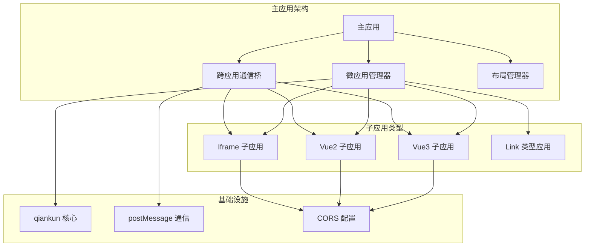
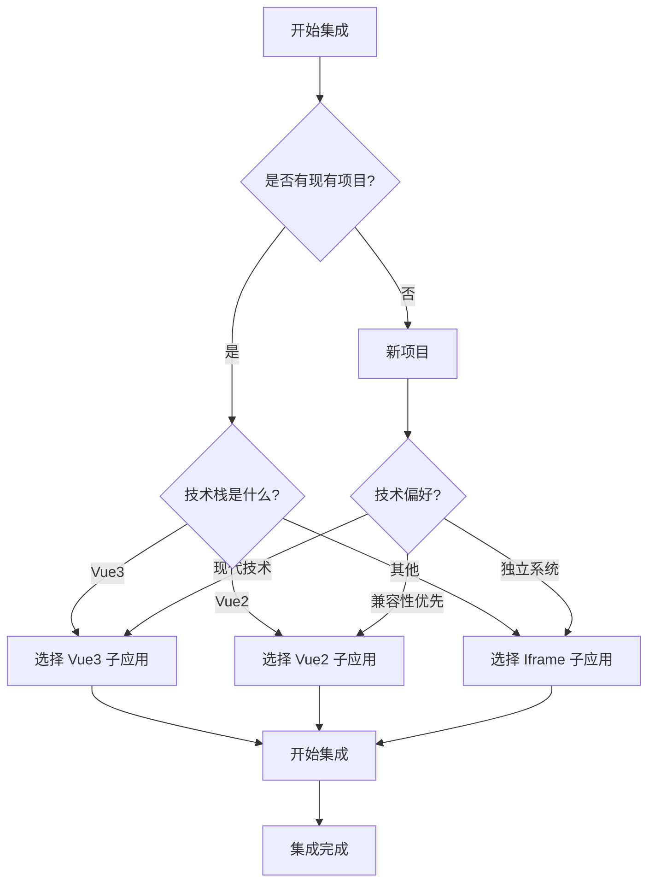

# 子应用集成指南

<cite>
**本文档引用的文件**
- [README.md](file://README.md)
- [SUB_APP_INTEGRATION.md](file://SUB_APP_INTEGRATION.md)
- [QUICK_START.md](file://QUICK_START.md)
- [DOCUMENTATION_SUMMARY.md](file://DOCUMENTATION_SUMMARY.md)
- [lerna.json](file://lerna.json)
- [user-docs/guide/getting-started.md](file://user-docs/guide/getting-started.md)
- [user-docs/guide/main-app.md](file://user-docs/guide/main-app.md)
- [user-docs/guide/sub-apps.md](file://user-docs/guide/sub-apps.md)
- [user-docs/api/README.md](file://user-docs/api/README.md)
- [user-docs/api/micro-app-manager.md](file://user-docs/api/micro-app-manager.md)
- [user-docs/api/bridge.md](file://user-docs/api/bridge.md)
- [packages/main-app/src/core/microAppManager.js](file://packages/main-app/src/core/microAppManager.js)
- [packages/main-app/src/core/bridge.js](file://packages/main-app/src/core/bridge.js)
- [packages/main-app/src/core/layoutManager.js](file://packages/main-app/src/core/layoutManager.js)
</cite>

## 目录
1. [项目概述](#项目概述)
2. [核心架构](#核心架构)
3. [子应用类型](#子应用类型)
4. [Vue3 子应用集成](#vue3-子应用集成)
5. [Vue2 子应用集成](#vue2-子应用集成)
6. [Iframe 子应用集成](#iframe-子应用集成)
7. [Link 类型应用](#link-类型应用)
8. [跨应用通信](#跨应用通信)
9. [布局系统集成](#布局系统集成)
10. [部署与配置](#部署与配置)
11. [故障排除](#故障排除)
12. [最佳实践](#最佳实践)

## 项目概述

Artisan 是一个企业级微前端基础平台脚手架，采用 Monorepo 架构，基于 qiankun 的 loadMicroApp 模式实现主应用对多类型子应用的统一加载与管理。

### 核心特性

- **多种子应用支持**：Vue3/Vue2/iframe/link 四种应用类型全覆盖
- **布局编排系统**：4种布局类型，灵活配置，满足各种业务场景  
- **跨应用通信**：完整的 Bridge 机制，支持主应用与子应用双向通信
- **iframe 安全治理**：完善的安全策略，postMessage 通信与 origin 校验
- **多实例同屏**：支持同一页面加载多个不同子应用实例
- **CLI 工具**：命令行快速创建子应用，提升开发效率

### 技术栈

- **主应用**：Vue 3.5.29 + Vite 7.3.1 + qiankun 2.10.16
- **UI 组件库**：Element Plus 2.13.2
- **状态管理**：Pinia 3.x
- **Monorepo 管理**：Lerna + npm workspace

## 核心架构



**图表来源**
- [packages/main-app/src/core/microAppManager.js:1-560](file://packages/main-app/src/core/microAppManager.js#L1-L560)
- [packages/main-app/src/core/bridge.js:1-258](file://packages/main-app/src/core/bridge.js#L1-L258)
- [packages/main-app/src/core/layoutManager.js:1-142](file://packages/main-app/src/core/layoutManager.js#L1-L142)

## 子应用类型

### 四种子应用类型对比

| 类型 | 技术栈 | 构建工具 | 适用场景 | 集成复杂度 |
|------|--------|---------|---------|-----------|
| **vue3** | Vue 3.x + vue-router 5.x | Vite + vite-plugin-qiankun | 新项目、现代化应用 | 简单 |
| **vue2** | Vue 2.x + vue-router 3.x | Vue CLI | 遗留项目、Vue2 生态 | 中等 |
| **iframe** | 任意技术栈 | 任意 | 第三方系统、独立应用 | 简单 |
| **link** | - | - | 外部链接、快速跳转 | 无需集成 |

### 技术选型建议



**图表来源**
- [SUB_APP_INTEGRATION.md:33-41](file://SUB_APP_INTEGRATION.md#L33-L41)

## Vue3 子应用集成

### 依赖安装

```bash
cd your-vue3-app
npm install vite-plugin-qiankun --save-dev
```

### Vite 配置

```javascript
import { defineConfig } from 'vite'
import vue from '@vitejs/plugin-vue'
import qiankun from 'vite-plugin-qiankun'

export default defineConfig({
  plugins: [
    vue(),
    qiankun('your-app-id', {
      useDevMode: true
    })
  ],
  server: {
    port: 7080,
    cors: true,
    headers: {
      'Access-Control-Allow-Origin': '*'
    }
  }
})
```

### 入口文件改造

```javascript
import { createApp } from 'vue'
import { createRouter, createMemoryHistory } from 'vue-router'
import { renderWithQiankun } from 'vite-plugin-qiankun/dist/helper'

let app = null
let router = null

function render(props = {}, isQiankunMount = false) {
  // 路由模式选择
  const history = isQiankunMount 
    ? createMemoryHistory() 
    : createWebHistory('/')
  
  router = createRouter({
    history,
    routes
  })
  
  app = createApp(App)
  app.use(router)
  
  // 挂载点选择
  const mountEl = props.container
    ? (props.container.querySelector('#app') || props.container)
    : document.getElementById('app')
  
  app.mount(mountEl)
  
  // 内存历史导航
  if (isQiankunMount) {
    router.push(props.subPath || '/')
  }
}

// 注册生命周期
renderWithQiankun({
  bootstrap() {
    console.log('[Your App] Bootstrap')
  },
  mount(props) {
    render(props, true)
  },
  unmount(props) {
    // 停止响应式系统
    if (app?._instance?.scope) {
      app._instance.scope.stop()
    }
    app = null
    router = null
  }
})

// 独立运行
if (!qiankunWindow.__POWERED_BY_QIANKUN__) {
  render({}, false)
}
```

**章节来源**
- [SUB_APP_INTEGRATION.md:44-233](file://SUB_APP_INTEGRATION.md#L44-L233)
- [user-docs/guide/sub-apps.md:16-143](file://user-docs/guide/sub-apps.md#L16-L143)

## Vue2 子应用集成

### Vue CLI 配置

```javascript
const { name } = require('./package.json')

module.exports = {
  publicPath: '//localhost:3000/',
  devServer: {
    host: '0.0.0.0',
    port: 3000,
    headers: {
      'Access-Control-Allow-Origin': '*'
    }
  },
  configureWebpack: {
    output: {
      library: `${name}-[name]`,
      libraryTarget: 'umd',
      chunkLoadingGlobal: `webpackJsonp_${name}`
    }
  }
}
```

### 入口文件改造

```javascript
import Vue from 'vue'
import VueRouter from 'vue-router'

let instance = null
let router = null

function render(props = {}, isQiankunMount = false) {
  // 路由模式选择
  router = new VueRouter({
    mode: isQiankunMount ? 'abstract' : 'history',
    base: '/',
    routes
  })
  
  // 挂载点选择
  const mountEl = props.container
    ? (props.container.querySelector('#app') || props.container)
    : '#app'
  
  // 创建实例
  instance = new Vue({
    router,
    render: h => h(App)
  }).$mount(mountEl)
  
  // 路由导航
  if (props.subPath) {
    router.push(props.subPath)
  } else if (isQiankunMount) {
    router.push('/')
  }
}

// 独立运行
if (!window.__POWERED_BY_QIANKUN__) {
  render({}, false)
}

// 生命周期函数
export async function bootstrap() {
  console.log('[Your App] Bootstrap')
}

export async function mount(props) {
  render(props, true)
}

export async function unmount() {
  if (instance) {
    instance.$destroy()
    if (instance.$el) {
      instance.$el.innerHTML = ''
    }
  }
}
```

**章节来源**
- [SUB_APP_INTEGRATION.md:276-426](file://SUB_APP_INTEGRATION.md#L276-L426)
- [user-docs/guide/sub-apps.md:210-310](file://user-docs/guide/sub-apps.md#L210-L310)

## Iframe 子应用集成

### CORS 配置

```javascript
export default defineConfig({
  server: {
    host: '0.0.0.0',
    port: 9080,
    headers: {
      'Access-Control-Allow-Origin': '*'
    }
  }
})
```

### 通信桥实现

```javascript
class IframeBridge {
  constructor() {
    this.allowedOrigins = [
      'http://localhost:8080',
      window.location.origin
    ]
    
    this.handlers = new Map()
    window.addEventListener('message', this.handleMessage.bind(this))
  }
  
  handleMessage(event) {
    // Origin 校验
    if (!this.allowedOrigins.includes(event.origin)) {
      console.warn('[Iframe Bridge] Invalid origin:', event.origin)
      return
    }
    
    const { type, payload } = event.data
    
    switch (type) {
      case 'NAVIGATE_TO':
        this.navigateTo(payload.appId, payload.path)
        break
      case 'CUSTOM_EVENT':
        this.$emit(payload.event, payload.data)
        break
    }
  }
  
  send(message) {
    window.parent.postMessage(message, '*')
  }
  
  navigateTo(appId, path) {
    this.send({
      type: 'NAVIGATE_TO',
      payload: { appId, path }
    })
  }
  
  reportHeight() {
    const height = document.documentElement.scrollHeight
    this.send({
      type: 'REPORT_HEIGHT',
      payload: { height }
    })
  }
}

export const bridge = new IframeBridge()
```

**章节来源**
- [SUB_APP_INTEGRATION.md:446-562](file://SUB_APP_INTEGRATION.md#L446-L562)
- [user-docs/guide/sub-apps.md:388-533](file://user-docs/guide/sub-apps.md#L388-L533)

## Link 类型应用

### 配置示例

```javascript
{
  id: 'external-docs',
  name: '外部文档',
  entry: 'https://example.com/docs',
  type: 'link',
  layoutType: 'blank'
}
```

### 加载行为

```javascript
// microAppManager.js 内部处理
if (config.type === 'link') {
  window.open(config.entry, '_blank')
  return null  // 不加载容器
}
```

**章节来源**
- [user-docs/guide/sub-apps.md:613-644](file://user-docs/guide/sub-apps.md#L613-L644)

## 跨应用通信

### Bridge API 使用

```javascript
// 在子应用中跳转到其他应用
window.__ARTISAN_BRIDGE__.navigateTo({
  appId: 'vue2-sub-app',
  path: '/list',
  query: { id: 1 }
})

// 跳转到主应用
window.__ARTISAN_BRIDGE__.navigateToMain('/home')

// 发送消息
window.__ARTISAN_BRIDGE__.emit('custom-event', { data: 'value' })

// 监听消息
window.__ARTISAN_BRIDGE__.on('custom-event', (payload) => {
  console.log('收到消息:', payload)
})
```

### 消息类型

| 消息类型 | 方向 | 说明 |
|---------|------|------|
| NAVIGATE_TO | 子→主 | 跳转到指定子应用 |
| NAVIGATE_TO_MAIN | 子→主 | 跳转到主应用路由 |
| REQUEST_TOKEN | 子→主 | 请求 token |
| TOKEN_RESPONSE | 主→子 | Token 响应 |
| TOKEN_SYNC | 主→子 | Token 同步广播 |
| PING | 主→子 | 心跳请求（iframe） |
| PONG | 子→主 | 心跳响应 |
| REPORT_HEIGHT | 子→主 | Iframe 高度上报 |
| MESSAGE | 双向 | 通用消息 |

**章节来源**
- [user-docs/api/bridge.md:1-185](file://user-docs/api/bridge.md#L1-L185)
- [packages/main-app/src/core/bridge.js:1-258](file://packages/main-app/src/core/bridge.js#L1-L258)

## 布局系统集成

### 布局类型

```javascript
export const LayoutTypes = {
  DEFAULT: 'default',      // 默认布局（含头部和侧边栏）
  FULL: 'full',           // 全屏布局（无导航元素）
  EMBEDDED: 'embedded',   // 嵌入式布局（轻量级）
  BLANK: 'blank'          // 空白布局（仅内容）
}
```

### 布局选项

```javascript
layoutOptions: {
  showHeader: true,    // 显示头部
  showSidebar: true,   // 显示侧边栏
  showFooter: false,   // 显示底部
  keepAlive: false     // 页面缓存
}
```

### 自动布局切换

```javascript
// 在 App.vue 的路由守卫中
if (wasInSubApp && !isInSubApp) {
  layoutManager.reset()
}

if (microAppConfig) {
  layoutManager.setLayoutFromMicroApp(microAppConfig)
}
```

**章节来源**
- [user-docs/guide/main-app.md:236-313](file://user-docs/guide/main-app.md#L236-L313)
- [packages/main-app/src/core/layoutManager.js:1-142](file://packages/main-app/src/core/layoutManager.js#L1-L142)

## 部署与配置

### 端口配置

| 应用 | 默认端口 | 配置文件 |
|------|---------|---------|
| 主应用 | 8080 | vite.config.js |
| Vue3 子应用 | 7080 | vite.config.js |
| Vue2 子应用 | 3000 | vue.config.js |
| Iframe 子应用 | 9080 | vite.config.js |

### 环境变量

```bash
# .env.mock
VITE_USE_MICRO_APPS_API=false

# .env.development  
VITE_USE_MICRO_APPS_API=true
VITE_MICRO_APPS_API_URL=http://your-backend.com/api/micro-apps
```

### 微应用配置

```javascript
{
  id: 'vue3-sub-app',
  name: 'Vue3 子应用',
  entry: 'http://localhost:7080',
  activeRule: '/vue3',
  type: 'vue3',
  layoutType: 'default',
  layoutOptions: {
    showHeader: true,
    showSidebar: true,
    keepAlive: false
  },
  status: 'online',
  version: '1.0.0',
  lastModified: Date.now(),
  preload: true,
  props: {
    routerBase: '/vue3'
  }
}
```

**章节来源**
- [user-docs/guide/getting-started.md:80-121](file://user-docs/guide/getting-started.md#L80-L121)
- [user-docs/guide/main-app.md:422-466](file://user-docs/guide/main-app.md#L422-L466)

## 故障排除

### 常见问题与解决方案

#### 样式污染问题

**症状**：主应用样式被子应用覆盖，Element Plus 组件显示异常

**解决方案**：
- 使用 CSS Modules 或 Scoped CSS
- 避免使用全局样式重置
- 在 qiankun 环境下不加载 Element Plus CSS

#### 路由跳转失败

**症状**：点击链接后 URL 变化但页面不刷新

**解决方案**：
- 确保使用正确的路由模式
- Vue3：Memory History（qiankun 环境）
- Vue2：Abstract 模式（qiankun 环境）

#### 跨域请求失败

**症状**：开发环境报 CORS 错误

**解决方案**：
```javascript
// vite.config.js
export default defineConfig({
  server: {
    headers: {
      'Access-Control-Allow-Origin': '*',
      'Access-Control-Allow-Methods': 'GET, POST, PUT, DELETE, PATCH, OPTIONS',
      'Access-Control-Allow-Headers': 'X-Requested-With, Content-Type, Authorization'
    }
  }
})
```

#### 卸载时报错

**症状**：切换页面时控制台报错 "Cannot read property 'vnode' of null"

**解决方案**：
- Vue3：停止响应式系统而非直接调用 app.unmount()
- Vue2：捕获异常并清理 DOM

**章节来源**
- [SUB_APP_INTEGRATION.md:651-780](file://SUB_APP_INTEGRATION.md#L651-L780)

## 最佳实践

### 项目组织

```
my-sub-app/
├── src/
│   ├── api/              # API 接口
│   ├── components/       # 公共组件
│   ├── views/           # 页面组件
│   ├── stores/          # 状态管理
│   └── utils/           # 工具函数
├── .env.development     # 开发环境变量
└── .env.production      # 生产环境变量
```

### 命名规范

- **应用 ID**：使用 kebab-case，如 `user-management`
- **路由路径**：与应用 ID 保持一致，如 `/user-management`
- **端口号**：避免冲突，建议使用 7xxx、8xxx、9xxx

### 性能优化

- 对常用应用启用 `preload: true`
- 使用 `keepAlive: true` 缓存不常变化的应用
- 按需加载大型组件
- 优化构建产物大小

### 安全考虑

- iframe 应用注意配置 CSP 策略
- 敏感操作需要权限验证
- 跨域资源共享设置合理的白名单

### 调试技巧

```javascript
// 在浏览器控制台调试
window.__ARTISAN_MICRO_APP_MANAGER__.loadedApps
window.__ARTISAN_BRIDGE__.navigateTo({
  appId: 'vue3-sub-app',
  path: '/'
})
window.__ARTISAN_LAYOUT_MANAGER__.setLayout('full')
```

**章节来源**
- [user-docs/guide/getting-started.md:365-400](file://user-docs/guide/getting-started.md#L365-L400)
- [user-docs/api/README.md:531-562](file://user-docs/api/README.md#L531-L562)

## 总结

Artisan 微前端平台提供了完整的子应用集成解决方案，支持四种不同类型的子应用，具备完善的通信机制、布局系统和安全治理。通过遵循本文档的集成指南和最佳实践，可以快速、稳定地将现有应用迁移到微前端架构中。

关键要点：
- 选择合适的子应用类型（Vue3/Vue2/Iframe/Link）
- 严格遵守路由隔离和样式隔离原则
- 正确配置 CORS 和跨域通信
- 利用 Bridge 进行跨应用通信
- 合理使用布局系统和预加载机制
- 建立完善的错误处理和监控体系

通过系统化的集成流程和最佳实践指导，Artisan 平台能够帮助企业高效构建现代化的微前端应用生态系统。