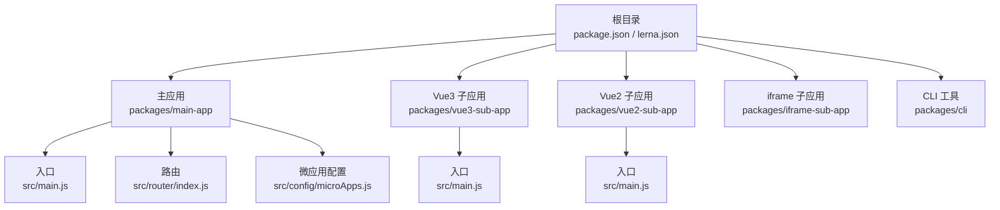
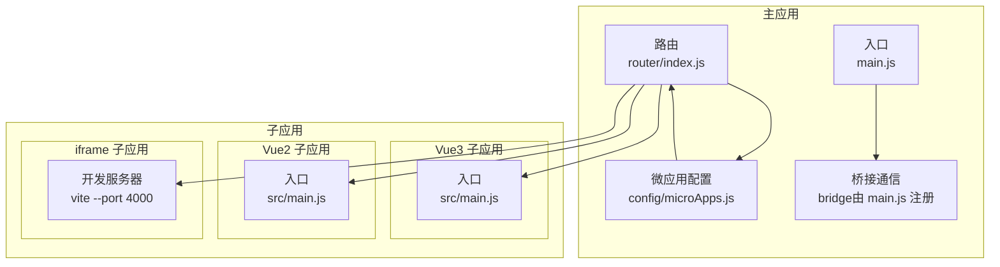
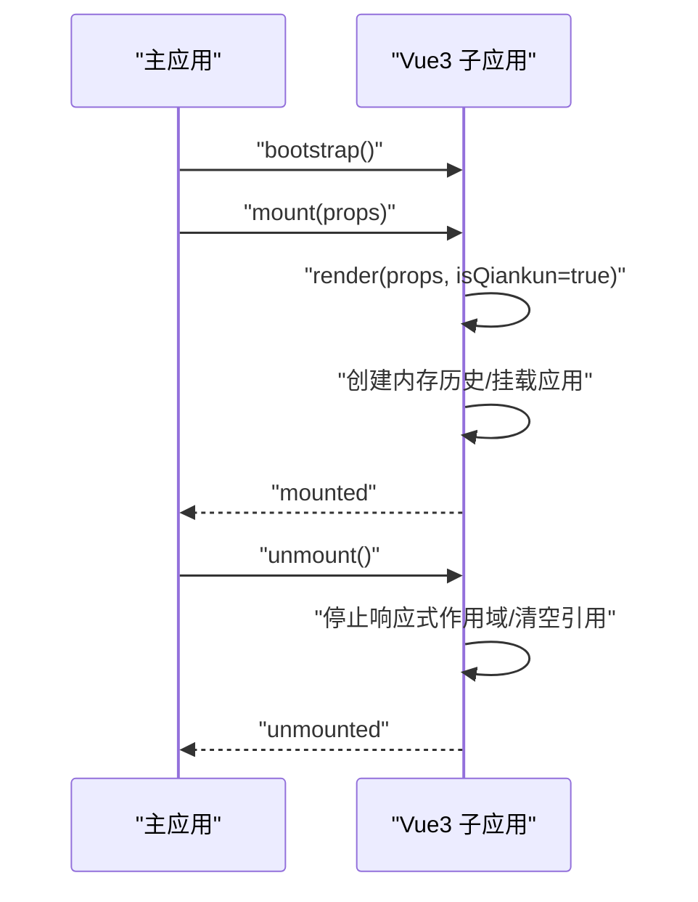
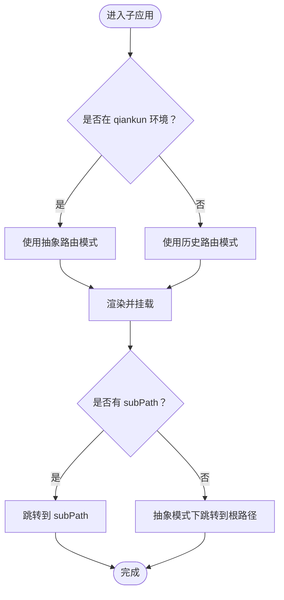
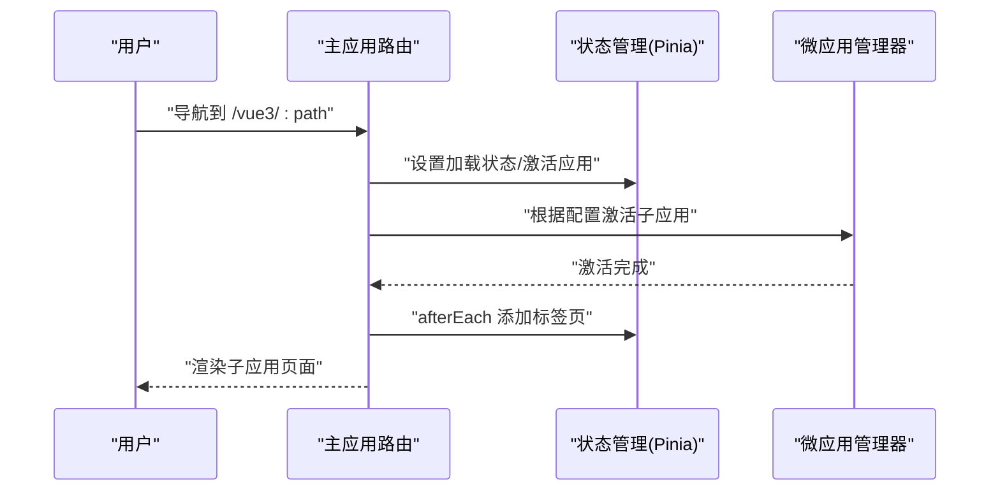
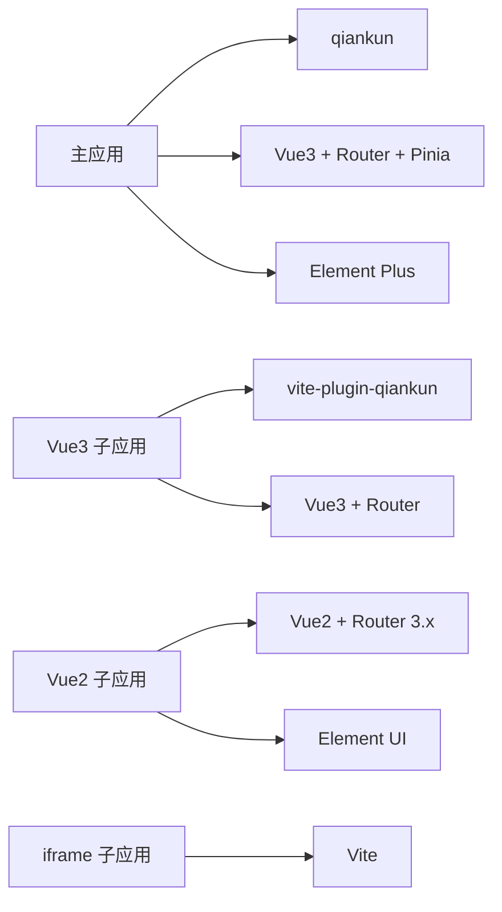

# 应用开发

<cite>
**本文引用的文件**
- [README.md](file://README.md)
- [package.json](file://package.json)
- [lerna.json](file://lerna.json)
- [packages/main-app/package.json](file://packages/main-app/package.json)
- [packages/vue3-sub-app/package.json](file://packages/vue3-sub-app/package.json)
- [packages/vue2-sub-app/package.json](file://packages/vue2-sub-app/package.json)
- [packages/iframe-sub-app/package.json](file://packages/iframe-sub-app/package.json)
- [packages/main-app/src/main.js](file://packages/main-app/src/main.js)
- [packages/main-app/src/router/index.js](file://packages/main-app/src/router/index.js)
- [packages/main-app/src/config/microApps.js](file://packages/main-app/src/config/microApps.js)
- [packages/vue3-sub-app/src/main.js](file://packages/vue3-sub-app/src/main.js)
- [packages/vue2-sub-app/src/main.js](file://packages/vue2-sub-app/src/main.js)
</cite>

## 目录
1. [简介](#简介)
2. [项目结构](#项目结构)
3. [核心组件](#核心组件)
4. [架构总览](#架构总览)
5. [详细组件分析](#详细组件分析)
6. [依赖关系分析](#依赖关系分析)
7. [性能考虑](#性能考虑)
8. [故障排查指南](#故障排查指南)
9. [结论](#结论)
10. [附录](#附录)

## 简介
本指南面向企业级微前端应用开发，围绕主应用与多类型子应用（Vue3、Vue2、iframe、link）的开发方法进行系统讲解。重点覆盖：
- 微应用配置文件的结构与参数含义（激活规则、容器选择器、状态管理、版本控制等）
- Vue3 子应用的开发模式、路由与生命周期适配
- Vue2 子应用的兼容性处理与迁移注意事项
- iframe 子应用的安全策略、跨域治理与通信机制
- 外链应用的集成方法与最佳实践
- 开发流程、调试技巧与性能优化建议

## 项目结构
该仓库采用 Monorepo 架构，使用 Lerna + npm workspace 管理多包协作；主应用与各类子应用分别位于 packages 目录下，并提供统一的开发与构建脚本。

图表来源
- [package.json](file://package.json#L10-L26)
- [lerna.json](file://lerna.json#L1-L25)
- [packages/main-app/src/main.js](file://packages/main-app/src/main.js#L1-L40)
- [packages/main-app/src/router/index.js](file://packages/main-app/src/router/index.js#L1-L130)
- [packages/main-app/src/config/microApps.js](file://packages/main-app/src/config/microApps.js#L1-L110)
- [packages/vue3-sub-app/src/main.js](file://packages/vue3-sub-app/src/main.js#L1-L123)
- [packages/vue2-sub-app/src/main.js](file://packages/vue2-sub-app/src/main.js#L1-L121)

章节来源
- [package.json](file://package.json#L1-L50)
- [lerna.json](file://lerna.json#L1-L25)

## 核心组件
- 主应用：负责微应用编排、路由与状态管理、桥接通信、布局系统与调试暴露。
- 微应用配置：集中定义各子应用的入口、激活规则、容器、状态、版本、布局选项与扩展属性。
- Vue3 子应用：基于 vite-plugin-qiankun 的生命周期适配，内存历史与样式隔离策略。
- Vue2 子应用：兼容 Vue2 生态与 qiankun 生命周期，抽象路由模式与销毁清理。
- iframe 子应用：作为外部资源嵌入，强调安全与跨域治理。

章节来源
- [packages/main-app/src/main.js](file://packages/main-app/src/main.js#L1-L40)
- [packages/main-app/src/config/microApps.js](file://packages/main-app/src/config/microApps.js#L1-L110)
- [packages/vue3-sub-app/src/main.js](file://packages/vue3-sub-app/src/main.js#L1-L123)
- [packages/vue2-sub-app/src/main.js](file://packages/vue2-sub-app/src/main.js#L1-L121)

## 架构总览
整体采用 qiankun 的 loadMicroApp 模式，主应用通过微应用配置驱动子应用的注册、激活与卸载；不同子应用类型共享统一的容器与布局体系，同时在路由与生命周期层面做差异化适配。

图表来源
- [packages/main-app/src/main.js](file://packages/main-app/src/main.js#L1-L40)
- [packages/main-app/src/router/index.js](file://packages/main-app/src/router/index.js#L1-L130)
- [packages/main-app/src/config/microApps.js](file://packages/main-app/src/config/microApps.js#L1-L110)
- [packages/vue3-sub-app/src/main.js](file://packages/vue3-sub-app/src/main.js#L1-L123)
- [packages/vue2-sub-app/src/main.js](file://packages/vue2-sub-app/src/main.js#L1-L121)
- [packages/iframe-sub-app/package.json](file://packages/iframe-sub-app/package.json#L6-L10)

## 详细组件分析

### 微应用配置文件结构与参数说明
微应用配置集中于主应用侧，用于声明子应用的入口地址、激活规则、容器选择器、状态、版本、布局与扩展属性。典型字段如下：
- id：子应用唯一标识
- name：显示名称
- entry：子应用入口地址（通常为开发服务器地址）
- activeRule：激活规则（如路径前缀）
- container：挂载容器选择器
- status：在线/离线状态
- version/lastModified：版本与最后修改时间
- preload：是否预加载
- type：子应用类型（vue3/vue2/iframe/link）
- layoutType/layoutOptions：布局类型与选项
- props：传递给子应用的额外属性（如 routerBase）

章节来源
- [packages/main-app/src/config/microApps.js](file://packages/main-app/src/config/microApps.js#L1-L110)
- [README.md](file://README.md#L98-L120)

### Vue3 子应用开发模式与生命周期
- 路由模式：在 qiankun 环境使用内存历史（memory history），独立运行使用 Web 历史（web history），以避免全局路由污染与状态冲突。
- 样式隔离：在非 qiankun 独立运行时按需同步加载 Element Plus 样式，避免与主应用样式发生全局选择器冲突。
- 生命周期：通过 renderWithQiankun 注册 bootstrap/mount/unmount/update；卸载阶段不直接调用 app.unmount，而是停止响应式作用域并清空引用，交由 qiankun 与主应用清理 DOM。
- 挂载策略：优先在容器内查找 #app，否则直接挂载到容器；内存历史需要手动导航到初始路由或 subPath。

图表来源
- [packages/vue3-sub-app/src/main.js](file://packages/vue3-sub-app/src/main.js#L79-L113)

章节来源
- [packages/vue3-sub-app/src/main.js](file://packages/vue3-sub-app/src/main.js#L1-L123)

### Vue2 子应用兼容性与迁移要点
- 路由模式：在 qiankun 环境使用抽象模式（abstract，类似 memory history），独立运行使用 history 模式。
- 生命周期：导出 bootstrap/mount/unmount/update 函数，遵循 qiankun 生命周期约定。
- 销毁清理：在 unmount 中销毁实例并清空容器内容，异常被忽略但不会阻断卸载流程。
- 挂载策略：优先在容器内查找 #app，否则使用容器选择器；抽象模式下需要手动 push 初始路由。

图表来源
- [packages/vue2-sub-app/src/main.js](file://packages/vue2-sub-app/src/main.js#L34-L67)

章节来源
- [packages/vue2-sub-app/src/main.js](file://packages/vue2-sub-app/src/main.js#L1-L121)

### iframe 子应用的安全策略、跨域治理与通信
- 安全策略：iframe 子应用通过受控的入口地址加载，主应用在容器中统一管理其生命周期与可见性。
- 跨域治理：iframe 场景下的跨域访问需结合 CSP、X-Frame-Options、postMessage 通信与可信域名白名单策略。
- 通信机制：推荐使用 postMessage 实现主应用与 iframe 子应用之间的双向通信，确保消息来源校验与数据序列化安全。

章节来源
- [README.md](file://README.md#L13-L13)

### 外链应用集成方法与最佳实践
- 集成方式：将外链作为 link 类型的微应用配置，通过主应用路由或菜单触发跳转。
- 最佳实践：在外链打开前进行来源校验与二次确认，提供返回主应用的便捷入口，记录外链访问日志以便审计。

章节来源
- [packages/main-app/src/config/microApps.js](file://packages/main-app/src/config/microApps.js#L1-L110)
- [README.md](file://README.md#L98-L120)

### 主应用路由与状态管理
- 路由设计：主应用路由包含首页、子应用占位页、多应用实例演示页、应用管理页以及各子应用的激活路径；beforeEach 设置加载状态与当前激活应用；afterEach 维护标签页。
- 状态管理：基于 Pinia 并启用持久化插件，提供应用状态与标签页状态的集中管理。
- 调试暴露：将微应用管理器挂载至 window 以供调试。

图表来源
- [packages/main-app/src/router/index.js](file://packages/main-app/src/router/index.js#L93-L127)
- [packages/main-app/src/main.js](file://packages/main-app/src/main.js#L17-L31)

章节来源
- [packages/main-app/src/router/index.js](file://packages/main-app/src/router/index.js#L1-L130)
- [packages/main-app/src/main.js](file://packages/main-app/src/main.js#L1-L40)

## 依赖关系分析
- 主应用依赖 qiankun、Vue3、Vue Router、Pinia、Element Plus 等，提供微前端编排与 UI 基础能力。
- Vue3 子应用依赖 vite-plugin-qiankun，实现与主应用的生命周期对接。
- Vue2 子应用依赖 Vue2、Vue Router 3.x 与 Element UI，保持对旧生态的支持。
- iframe 子应用依赖 Vite，作为外部资源示例。

图表来源
- [packages/main-app/package.json](file://packages/main-app/package.json#L12-L29)
- [packages/vue3-sub-app/package.json](file://packages/vue3-sub-app/package.json#L12-L21)
- [packages/vue2-sub-app/package.json](file://packages/vue2-sub-app/package.json#L11-L24)
- [packages/iframe-sub-app/package.json](file://packages/iframe-sub-app/package.json#L6-L13)

章节来源
- [packages/main-app/package.json](file://packages/main-app/package.json#L1-L31)
- [packages/vue3-sub-app/package.json](file://packages/vue3-sub-app/package.json#L1-L23)
- [packages/vue2-sub-app/package.json](file://packages/vue2-sub-app/package.json#L1-L31)
- [packages/iframe-sub-app/package.json](file://packages/iframe-sub-app/package.json#L1-L15)

## 性能考虑
- 预加载策略：对常用子应用开启预加载，缩短首次激活延迟。
- 路由懒加载：主应用与子应用均采用路由懒加载，减少首屏体积。
- 样式隔离：子应用在独立运行时按需加载样式，避免重复引入造成体积膨胀。
- 卸载清理：子应用卸载时停止响应式作用域并清空容器，防止内存泄漏。
- 构建优化：利用 Vite 的原生预构建与按需打包能力，结合 qiankun 的沙箱与隔离策略，平衡性能与稳定性。

## 故障排查指南
- 子应用未激活：检查微应用配置中的激活规则与容器选择器是否匹配当前路由。
- 样式冲突：确认子应用在 qiankun 环境下未重复加载全局样式，独立运行时再按需加载。
- 路由异常：核对子应用在 qiankun 环境下的历史模式（内存/抽象）与初始路由跳转逻辑。
- 卸载失败：避免在子应用生命周期内直接调用卸载 API，遵循“停止响应式作用域 + 清空引用”的清理流程。
- 调试定位：通过主应用暴露的微应用管理器与浏览器控制台日志快速定位问题。

章节来源
- [packages/main-app/src/main.js](file://packages/main-app/src/main.js#L36-L37)
- [packages/vue3-sub-app/src/main.js](file://packages/vue3-sub-app/src/main.js#L87-L113)
- [packages/vue2-sub-app/src/main.js](file://packages/vue2-sub-app/src/main.js#L97-L113)

## 结论
本项目提供了完整的微前端开发样板，覆盖主应用编排、多类型子应用适配、路由与状态管理、桥接通信与调试支持。通过规范化的微应用配置与生命周期适配，可稳定支撑多团队并行开发与演进。

## 附录
- CLI 使用：全局安装 CLI 后，可通过命令快速创建主应用与各类子应用脚手架。
- 端口与启动：主应用与各子应用分别提供独立端口与启动脚本，支持并行开发与联调。
- 文档服务：内置 VitePress 文档站点，便于知识沉淀与团队协作。

章节来源
- [README.md](file://README.md#L78-L96)
- [README.md](file://README.md#L17-L25)
- [README.md](file://README.md#L143-L149)