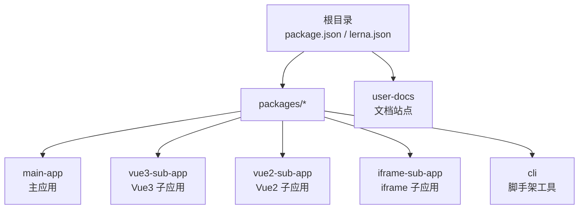
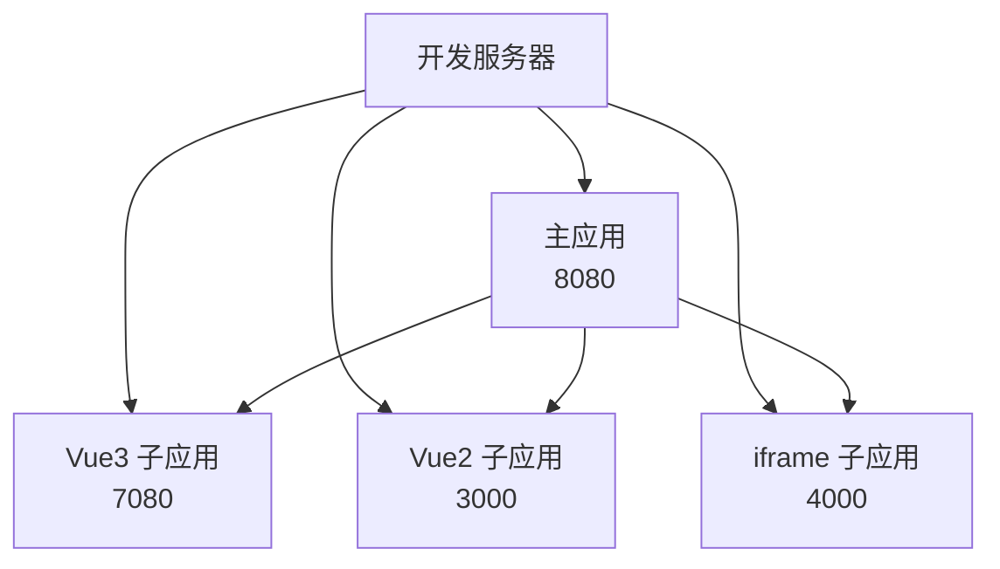
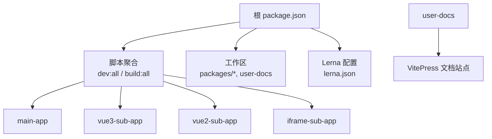

# 快速开始

<cite>
**本文引用的文件**
- [README.md](file://README.md)
- [package.json](file://package.json)
- [lerna.json](file://lerna.json)
- [packages/main-app/package.json](file://packages/main-app/package.json)
- [packages/main-app/vite.config.js](file://packages/main-app/vite.config.js)
- [packages/vue3-sub-app/package.json](file://packages/vue3-sub-app/package.json)
- [packages/vue3-sub-app/vite.config.js](file://packages/vue3-sub-app/vite.config.js)
- [packages/vue2-sub-app/package.json](file://packages/vue2-sub-app/package.json)
- [packages/iframe-sub-app/package.json](file://packages/iframe-sub-app/package.json)
- [packages/cli/package.json](file://packages/cli/package.json)
- [user-docs/guide/getting-started.md](file://user-docs/guide/getting-started.md)
- [user-docs/api/micro-app-manager.md](file://user-docs/api/micro-app-manager.md)
- [user-docs/api/bridge.md](file://user-docs/api/bridge.md)
- [user-docs/.vitepress/config.js](file://user-docs/.vitepress/config.js)
</cite>

## 目录
1. [简介](#简介)
2. [项目结构](#项目结构)
3. [核心组件](#核心组件)
4. [架构总览](#架构总览)
5. [详细组件分析](#详细组件分析)
6. [依赖分析](#依赖分析)
7. [性能考虑](#性能考虑)
8. [故障排除指南](#故障排除指南)
9. [结论](#结论)
10. [附录](#附录)

## 简介
本指南面向首次接触 Artisan 微前端平台的开发者，目标是在约 30 分钟内完成环境准备、项目启动与验证，成功运行第一个微前端应用。内容涵盖环境要求、依赖安装、启动命令、端口配置、常见问题排查以及实用的命令行示例。

## 项目结构
该仓库采用 Monorepo 架构，使用 Lerna + npm workspaces 管理多包。核心目录与职责如下：
- packages/main-app：Vue3 主应用，提供微前端容器与路由编排
- packages/vue3-sub-app：Vue3 子应用示例
- packages/vue2-sub-app：Vue2 子应用示例
- packages/iframe-sub-app：iframe 子应用示例
- packages/cli：脚手架 CLI 工具，用于快速生成新应用
- user-docs：VitePress 文档站点

图表来源
- [package.json](file://package.json#L6-L9)
- [lerna.json](file://lerna.json#L5-L8)

章节来源
- [README.md](file://README.md#L62-L76)
- [package.json](file://package.json#L6-L9)
- [lerna.json](file://lerna.json#L5-L8)

## 核心组件
- 主应用（main-app）：基于 Vite + Vue3 + qiankun，提供微前端容器与路由编排能力
- Vue3 子应用（vue3-sub-app）：示例子应用，使用 vite-plugin-qiankun 注入微前端支持
- Vue2 子应用（vue2-sub-app）：示例子应用，使用 @vue/cli-service 提供开发服务器
- iframe 子应用（iframe-sub-app）：示例子应用，通过 iframe 方式集成
- CLI 工具（cli）：提供快速创建主应用与各类子应用的脚手架命令

章节来源
- [packages/main-app/package.json](file://packages/main-app/package.json#L1-L31)
- [packages/vue3-sub-app/package.json](file://packages/vue3-sub-app/package.json#L1-L23)
- [packages/vue2-sub-app/package.json](file://packages/vue2-sub-app/package.json#L1-L31)
- [packages/iframe-sub-app/package.json](file://packages/iframe-sub-app/package.json#L1-L15)
- [packages/cli/package.json](file://packages/cli/package.json#L1-L32)

## 架构总览
下图展示了各应用在本地开发时的端口分配与启动关系，便于同时启动多个应用进行联调。

图表来源
- [README.md](file://README.md#L17-L25)
- [packages/main-app/vite.config.js](file://packages/main-app/vite.config.js#L12-L18)
- [packages/vue3-sub-app/vite.config.js](file://packages/vue3-sub-app/vite.config.js#L25-L32)
- [packages/vue2-sub-app/package.json](file://packages/vue2-sub-app/package.json#L7)
- [packages/iframe-sub-app/package.json](file://packages/iframe-sub-app/package.json#L7)

## 详细组件分析

### 环境准备与安装
- 环境要求
  - Node.js 版本：满足根目录 engines 字段要求
  - 包管理器：推荐使用 npm，版本建议满足用户文档中的最低要求
- 克隆与安装
  - 克隆仓库后，在项目根目录执行依赖安装命令
- 启动方式
  - 启动全部应用：使用统一的并行启动脚本
  - 单独启动：分别启动主应用与各子应用

章节来源
- [user-docs/guide/getting-started.md](file://user-docs/guide/getting-started.md#L3-L7)
- [user-docs/guide/getting-started.md](file://user-docs/guide/getting-started.md#L8-L14)
- [user-docs/guide/getting-started.md](file://user-docs/guide/getting-started.md#L16-L38)
- [package.json](file://package.json#L32-L34)
- [package.json](file://package.json#L10-L26)

### 端口配置与默认端口
- 主应用：8080
- Vue3 子应用：7080
- Vue2 子应用：3000
- iframe 子应用：4000

章节来源
- [README.md](file://README.md#L17-L25)
- [packages/main-app/vite.config.js](file://packages/main-app/vite.config.js#L12-L18)
- [packages/vue3-sub-app/vite.config.js](file://packages/vue3-sub-app/vite.config.js#L25-L32)
- [packages/vue2-sub-app/package.json](file://packages/vue2-sub-app/package.json#L7)
- [packages/iframe-sub-app/package.json](file://packages/iframe-sub-app/package.json#L7)

### 启动流程与命令行示例
- 安装依赖
  - 在根目录执行安装命令
- 启动全部应用
  - 使用并行启动脚本，同时启动主应用与各子应用
- 单独启动
  - 分别启动主应用与各子应用，便于调试与联调

章节来源
- [user-docs/guide/getting-started.md](file://user-docs/guide/getting-started.md#L8-L14)
- [user-docs/guide/getting-started.md](file://user-docs/guide/getting-started.md#L16-L38)
- [package.json](file://package.json#L10-L26)

### CLI 使用与脚手架
- CLI 安装
  - 进入 CLI 包目录，使用链接方式全局安装
- 创建应用
  - 支持创建主应用与多种类型的子应用
- 注意事项
  - CLI 对 Node.js 版本有要求，需满足其 engines 字段

章节来源
- [user-docs/guide/getting-started.md](file://user-docs/guide/getting-started.md#L65-L80)
- [README.md](file://README.md#L78-L96)
- [packages/cli/package.json](file://packages/cli/package.json#L20-L22)

### 微应用管理与跨应用通信
- 微应用管理器
  - 提供加载、卸载、刷新、预加载、状态控制、实例统计与错误日志等功能
- 跨应用通信桥
  - 基于 postMessage 的桥接 API，支持消息订阅、广播、定向发送、导航跳转等

章节来源
- [user-docs/api/micro-app-manager.md](file://user-docs/api/micro-app-manager.md#L1-L143)
- [user-docs/api/bridge.md](file://user-docs/api/bridge.md#L1-L150)

## 依赖分析
- 根包管理
  - 使用 npm workspaces 管理工作区
  - 使用 Lerna 统一发布与版本管理
- 开发脚本
  - 通过 npm scripts 将各包的 dev/build 命令聚合为统一入口
  - 并行启动脚本用于同时启动多个应用
- 文档站点
  - VitePress 文档站点独立工作区，提供在线文档与导航

图表来源
- [package.json](file://package.json#L6-L9)
- [package.json](file://package.json#L10-L26)
- [lerna.json](file://lerna.json#L4-L8)
- [user-docs/.vitepress/config.js](file://user-docs/.vitepress/config.js#L1-L55)

章节来源
- [package.json](file://package.json#L6-L9)
- [package.json](file://package.json#L10-L26)
- [lerna.json](file://lerna.json#L4-L8)
- [user-docs/.vitepress/config.js](file://user-docs/.vitepress/config.js#L1-L55)

## 性能考虑
- 主应用构建优化
  - 通过 Rollup 手动分包，分离第三方库与框架依赖，提升缓存命中率
- 子应用开发体验
  - 各应用独立端口，避免端口冲突，便于并行开发
- 跨应用通信
  - 使用事件订阅与广播机制，减少耦合；注意合理清理监听器，避免内存泄漏

章节来源
- [packages/main-app/vite.config.js](file://packages/main-app/vite.config.js#L26-L38)
- [packages/vue3-sub-app/vite.config.js](file://packages/vue3-sub-app/vite.config.js#L33-L39)

## 故障排除指南
- 端口占用
  - 若本地端口被占用，先释放对应端口或调整各应用的端口配置
- Node.js 版本不匹配
  - 根包与 CLI 包均声明了 Node.js 版本要求，需满足最低版本
- 依赖安装失败
  - 清理缓存后重试安装；确认网络与镜像源可用
- 文档站点无法访问
  - 确认文档工作区已正确安装依赖并启动开发服务器

章节来源
- [package.json](file://package.json#L32-L34)
- [packages/cli/package.json](file://packages/cli/package.json#L20-L22)
- [user-docs/guide/getting-started.md](file://user-docs/guide/getting-started.md#L3-L7)
- [user-docs/.vitepress/config.js](file://user-docs/.vitepress/config.js#L1-L55)

## 结论
按照本指南完成环境准备与依赖安装后，您可以在约 30 分钟内启动并验证主应用与各子应用的联调效果。若遇到问题，可依据“故障排除指南”逐项排查。随着对平台的深入，建议进一步阅读文档站点与 API 文档以掌握高级特性。

## 附录
- 常用命令清单
  - 安装依赖：在根目录执行安装命令
  - 启动全部应用：使用并行启动脚本
  - 启动单个应用：分别启动主应用与各子应用
  - 文档站点：启动文档开发服务器
- 端口对照表
  - 主应用：8080
  - Vue3 子应用：7080
  - Vue2 子应用：3000
  - iframe 子应用：4000

章节来源
- [user-docs/guide/getting-started.md](file://user-docs/guide/getting-started.md#L8-L38)
- [README.md](file://README.md#L17-L25)
- [package.json](file://package.json#L10-L26)
- [packages/main-app/vite.config.js](file://packages/main-app/vite.config.js#L12-L18)
- [packages/vue3-sub-app/vite.config.js](file://packages/vue3-sub-app/vite.config.js#L25-L32)
- [packages/vue2-sub-app/package.json](file://packages/vue2-sub-app/package.json#L7)
- [packages/iframe-sub-app/package.json](file://packages/iframe-sub-app/package.json#L7)