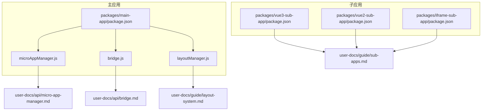
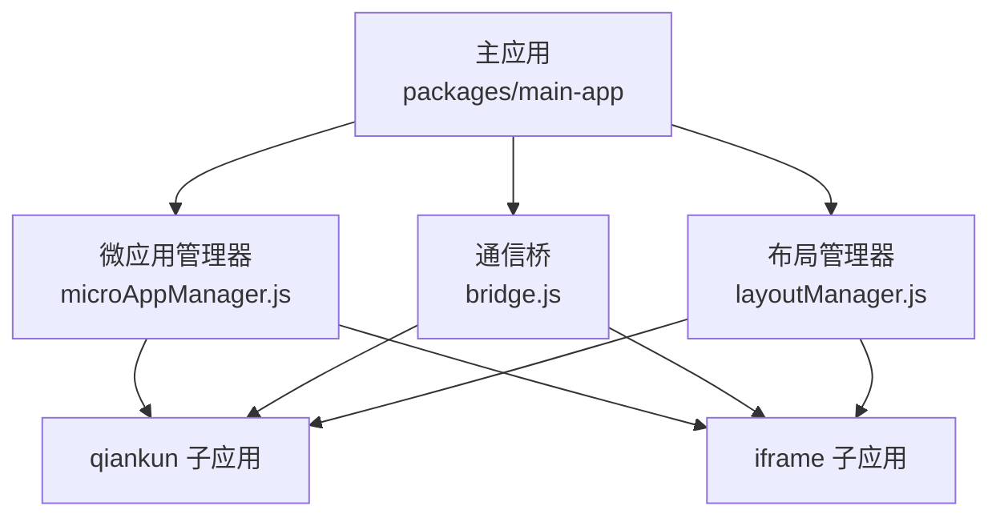
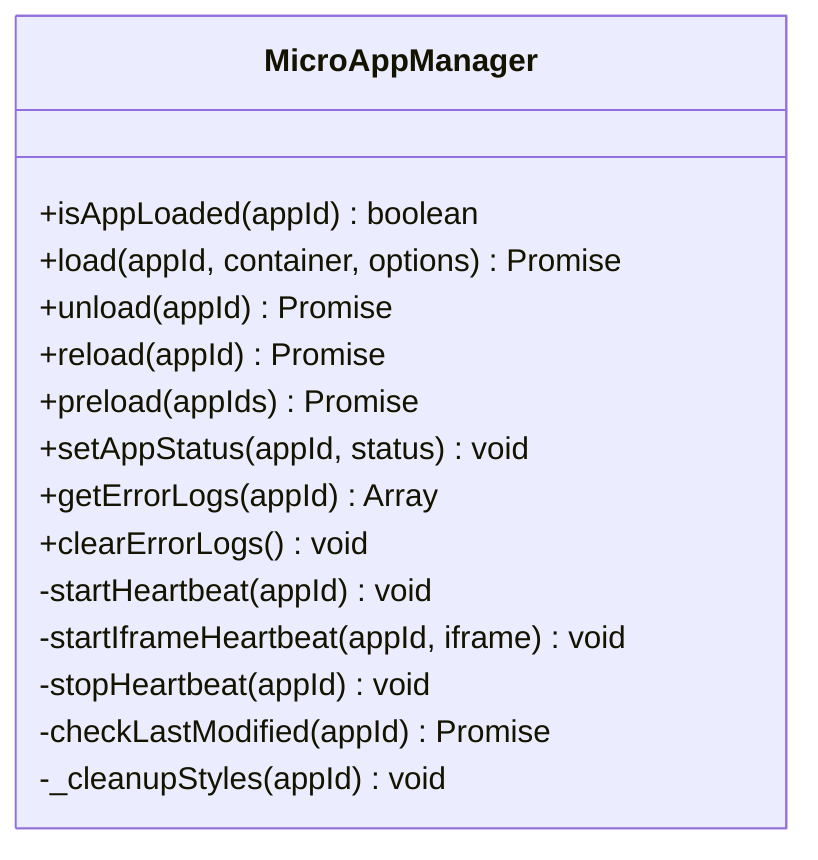
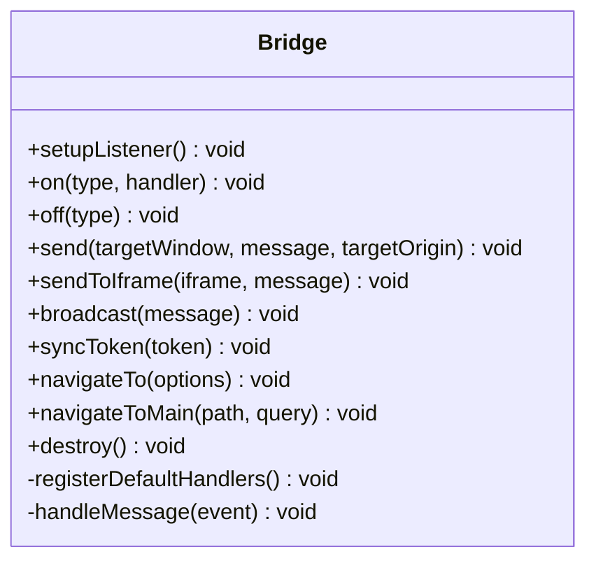
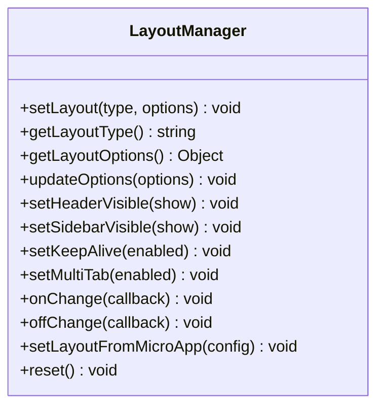
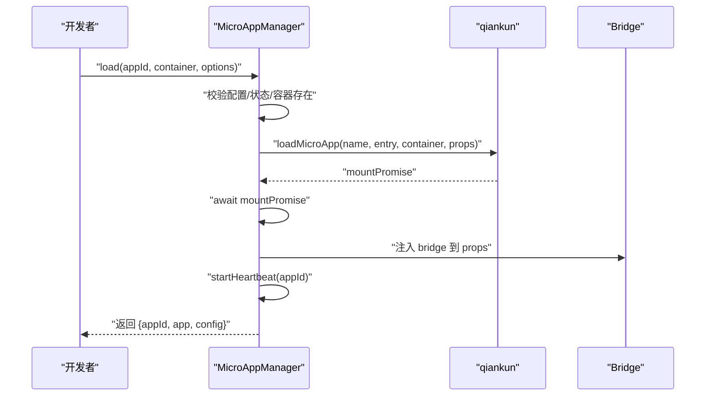
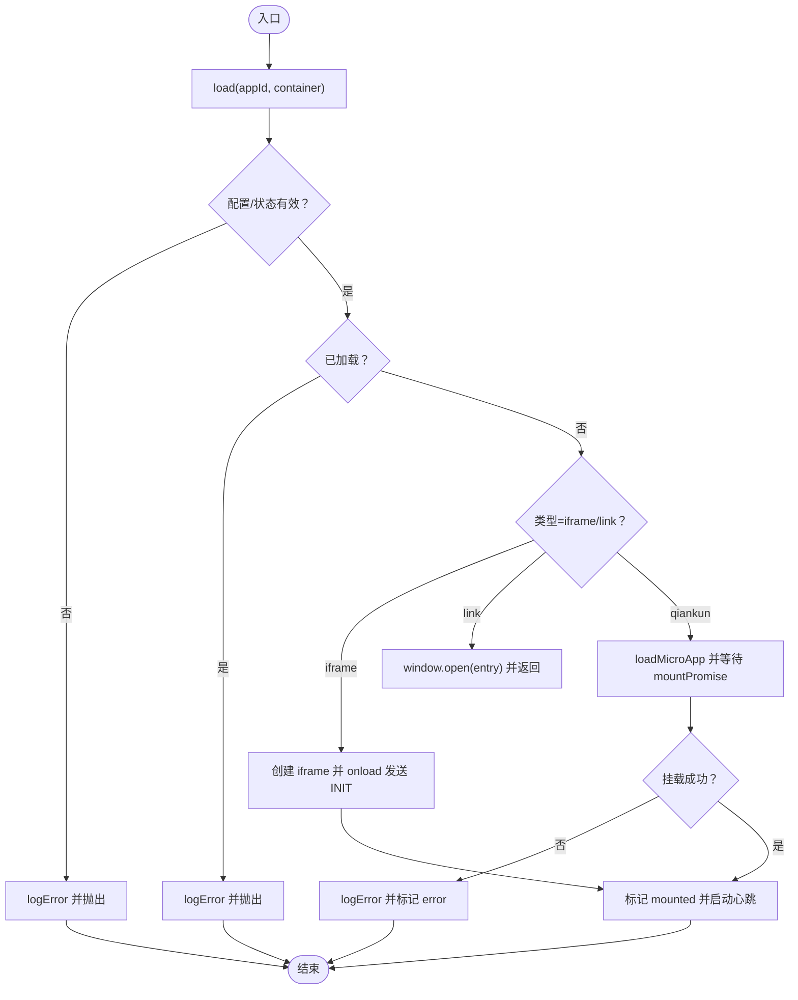
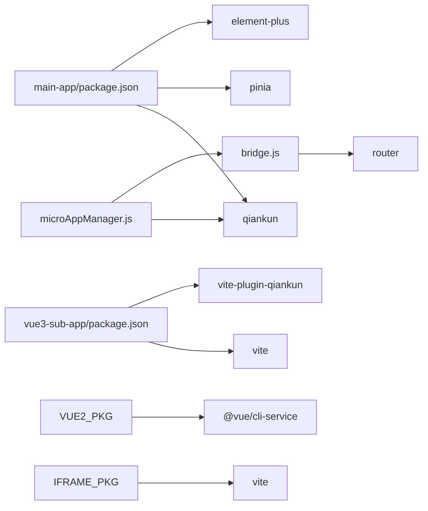

# 故障排除

<cite>
**本文引用的文件**
- [README.md](file://README.md)
- [package.json](file://package.json)
- [packages/main-app/package.json](file://packages/main-app/package.json)
- [packages/vue3-sub-app/package.json](file://packages/vue3-sub-app/package.json)
- [packages/vue2-sub-app/package.json](file://packages/vue2-sub-app/package.json)
- [packages/iframe-sub-app/package.json](file://packages/iframe-sub-app/package.json)
- [user-docs/guide/sub-apps.md](file://user-docs/guide/sub-apps.md)
- [user-docs/guide/layout-system.md](file://user-docs/guide/layout-system.md)
- [user-docs/api/micro-app-manager.md](file://user-docs/api/micro-app-manager.md)
- [user-docs/api/bridge.md](file://user-docs/api/bridge.md)
- [packages/main-app/src/core/microAppManager.js](file://packages/main-app/src/core/microAppManager.js)
- [packages/main-app/src/core/bridge.js](file://packages/main-app/src/core/bridge.js)
- [packages/main-app/src/core/layoutManager.js](file://packages/main-app/src/core/layoutManager.js)
</cite>

## 目录
1. [简介](#简介)
2. [项目结构](#项目结构)
3. [核心组件](#核心组件)
4. [架构总览](#架构总览)
5. [详细组件分析](#详细组件分析)
6. [依赖关系分析](#依赖关系分析)
7. [性能考虑](#性能考虑)
8. [故障排除指南](#故障排除指南)
9. [结论](#结论)
10. [附录](#附录)

## 简介
本指南面向使用该微前端脚手架进行开发的工程师，聚焦“快速定位与解决常见问题”。内容覆盖微应用加载失败、通信异常、布局错乱、性能瓶颈、网络与跨域、浏览器兼容性等主题，并提供调试工具、日志分析、错误追踪策略及问题上报流程，帮助开发者独立高效地解决问题。

## 项目结构
该项目采用 Monorepo 架构，使用 Lerna + npm workspaces 管理多包；主应用与多种类型子应用（Vue3/Vue2/iframe/link）在同一仓库内协同开发，便于统一调试与发布。

**图示来源**
- [packages/main-app/package.json](file://packages/main-app/package.json#L1-L31)
- [packages/vue3-sub-app/package.json](file://packages/vue3-sub-app/package.json#L1-L23)
- [packages/vue2-sub-app/package.json](file://packages/vue2-sub-app/package.json#L1-L31)
- [packages/iframe-sub-app/package.json](file://packages/iframe-sub-app/package.json#L1-L15)
- [user-docs/guide/sub-apps.md](file://user-docs/guide/sub-apps.md#L1-L170)
- [user-docs/guide/layout-system.md](file://user-docs/guide/layout-system.md#L1-L125)
- [user-docs/api/micro-app-manager.md](file://user-docs/api/micro-app-manager.md#L1-L143)
- [user-docs/api/bridge.md](file://user-docs/api/bridge.md#L1-L150)

**章节来源**
- [README.md](file://README.md#L62-L76)
- [package.json](file://package.json#L1-L50)

## 核心组件
- 微应用管理器：负责加载、卸载、刷新、预加载、心跳检测、热更新探测、错误日志与样式隔离清理。
- 通信桥：基于 postMessage 的跨应用通信，支持主子间、子子间消息、心跳、高度上报、令牌同步、跨应用跳转。
- 布局管理器：动态切换布局类型与选项，支持头部/侧边栏显隐、keepAlive、多标签页等。

**章节来源**
- [packages/main-app/src/core/microAppManager.js](file://packages/main-app/src/core/microAppManager.js#L1-L515)
- [packages/main-app/src/core/bridge.js](file://packages/main-app/src/core/bridge.js#L1-L241)
- [packages/main-app/src/core/layoutManager.js](file://packages/main-app/src/core/layoutManager.js#L1-L175)

## 架构总览
主应用通过微应用管理器统一调度 qiankun 或 iframe 子应用；通信桥负责主子、子子之间的消息与跳转；布局管理器控制页面骨架与容器渲染。

**图示来源**
- [packages/main-app/src/core/microAppManager.js](file://packages/main-app/src/core/microAppManager.js#L1-L515)
- [packages/main-app/src/core/bridge.js](file://packages/main-app/src/core/bridge.js#L1-L241)
- [packages/main-app/src/core/layoutManager.js](file://packages/main-app/src/core/layoutManager.js#L1-L175)

## 详细组件分析

### 组件A：微应用管理器（加载/卸载/心跳/热更新）
- 关键职责
  - 加载：根据类型（qiankun/iframe/link）选择加载路径，注入 props（token、bridge、appId），启用沙箱与样式隔离，等待挂载完成并记录状态。
  - 卸载：停止心跳、卸载 qiankun 应用、清理容器、移除注入样式，兜底清理以防异常。
  - 心跳：定期检测 qiankun 应用健康状态；iframe 子应用周期性发送 PING 并接收 PONG。
  - 热更新：对非 iframe 子应用执行 HEAD 请求检查 last-modified，若变更则自动 reload。
  - 错误日志：统一记录错误栈与时间，保留最近 100 条，支持按应用过滤与清空。
  - 预加载：对配置为预加载且在线的应用执行 prefetch。
- 典型风险点
  - 容器不存在或被提前销毁导致挂载失败。
  - 重复加载同一 appId。
  - qiankun 沙箱样式污染未清理。
  - iframe 未正确校验 origin 导致通信失败或安全问题。

**图示来源**
- [packages/main-app/src/core/microAppManager.js](file://packages/main-app/src/core/microAppManager.js#L11-L515)

**章节来源**
- [packages/main-app/src/core/microAppManager.js](file://packages/main-app/src/core/microAppManager.js#L38-L165)
- [packages/main-app/src/core/microAppManager.js](file://packages/main-app/src/core/microAppManager.js#L167-L232)
- [packages/main-app/src/core/microAppManager.js](file://packages/main-app/src/core/microAppManager.js#L238-L284)
- [packages/main-app/src/core/microAppManager.js](file://packages/main-app/src/core/microAppManager.js#L340-L386)
- [packages/main-app/src/core/microAppManager.js](file://packages/main-app/src/core/microAppManager.js#L392-L415)
- [packages/main-app/src/core/microAppManager.js](file://packages/main-app/src/core/microAppManager.js#L421-L440)
- [packages/main-app/src/core/microAppManager.js](file://packages/main-app/src/core/microAppManager.js#L473-L508)

### 组件B：通信桥（postMessage、心跳、令牌同步、跨应用跳转）
- 关键职责
  - 消息监听：仅允许白名单 origin，解析消息类型并调用对应处理器。
  - 默认处理器：导航到子应用/主应用、请求/响应令牌、心跳 PING/PONG、iframe 高度上报、通用消息。
  - 发送：支持向任意窗口或 iframe 发送消息，广播给所有子应用（iframe 与 qiankun 通过不同通道）。
  - 全局暴露：初始化时将常用方法暴露到 window.__ARTISAN_BRIDGE__，供子应用直接使用。
- 典型风险点
  - 未设置监听或监听重复注册。
  - 目标 origin 未正确设置导致消息被浏览器拦截。
  - 未校验 origin 导致任意来源消息注入。

**图示来源**
- [packages/main-app/src/core/bridge.js](file://packages/main-app/src/core/bridge.js#L9-L241)

**章节来源**
- [packages/main-app/src/core/bridge.js](file://packages/main-app/src/core/bridge.js#L83-L114)
- [packages/main-app/src/core/bridge.js](file://packages/main-app/src/core/bridge.js#L139-L155)
- [packages/main-app/src/core/bridge.js](file://packages/main-app/src/core/bridge.js#L161-L171)
- [packages/main-app/src/core/bridge.js](file://packages/main-app/src/core/bridge.js#L225-L238)

### 组件C：布局管理器（动态布局切换）
- 关键职责
  - 提供布局类型枚举与动态切换接口，支持头部/侧边栏显隐、keepAlive、多标签页等选项。
  - 提供从微应用配置直接设置布局的能力，支持监听布局变化回调。
- 典型风险点
  - 传入未知布局类型导致回退至默认布局。
  - 选项合并不当造成视觉错乱。

**图示来源**
- [packages/main-app/src/core/layoutManager.js](file://packages/main-app/src/core/layoutManager.js#L18-L175)

**章节来源**
- [packages/main-app/src/core/layoutManager.js](file://packages/main-app/src/core/layoutManager.js#L40-L67)
- [packages/main-app/src/core/layoutManager.js](file://packages/main-app/src/core/layoutManager.js#L151-L156)

### API/服务组件：加载流程时序（以 qiankun 为例）

**图示来源**
- [packages/main-app/src/core/microAppManager.js](file://packages/main-app/src/core/microAppManager.js#L49-L165)
- [packages/main-app/src/core/bridge.js](file://packages/main-app/src/core/bridge.js#L225-L238)

### 复杂逻辑组件：错误日志与清理流程

**图示来源**
- [packages/main-app/src/core/microAppManager.js](file://packages/main-app/src/core/microAppManager.js#L49-L165)

## 依赖关系分析
- 主应用依赖 qiankun、Pinia、Element Plus 等；子应用分别使用 Vite 或 Vue CLI。
- 微应用管理器依赖 qiankun 的 loadMicroApp/prefetchApps，依赖 bridge 进行通信。
- 通信桥依赖 window.postMessage 与路由跳转能力。
- 布局管理器与路由/容器渲染解耦，通过配置驱动。

**图示来源**
- [packages/main-app/package.json](file://packages/main-app/package.json#L12-L22)
- [packages/vue3-sub-app/package.json](file://packages/vue3-sub-app/package.json#L12-L21)
- [packages/vue2-sub-app/package.json](file://packages/vue2-sub-app/package.json#L11-L24)
- [packages/iframe-sub-app/package.json](file://packages/iframe-sub-app/package.json#L6-L14)

**章节来源**
- [packages/main-app/package.json](file://packages/main-app/package.json#L12-L22)
- [packages/vue3-sub-app/package.json](file://packages/vue3-sub-app/package.json#L12-L21)
- [packages/vue2-sub-app/package.json](file://packages/vue2-sub-app/package.json#L11-L24)
- [packages/iframe-sub-app/package.json](file://packages/iframe-sub-app/package.json#L6-L14)

## 性能考虑
- 预加载：对配置为预加载且在线的应用执行 prefetch，减少首次加载延迟。
- 心跳检测：每 30 秒检测一次应用健康状态，及时发现异常。
- 样式隔离：启用 qiankun 实验性样式隔离并清理注入样式，避免样式污染影响渲染性能。
- 热更新：HEAD 检测 last-modified，有更新自动 reload，降低人工干预成本。
- 建议
  - 控制同时加载的子应用数量，避免并发过高导致主线程阻塞。
  - 对大体积子应用启用懒加载与分包策略。
  - 使用浏览器性能面板监控帧率、内存与网络请求。

**章节来源**
- [packages/main-app/src/core/microAppManager.js](file://packages/main-app/src/core/microAppManager.js#L421-L440)
- [packages/main-app/src/core/microAppManager.js](file://packages/main-app/src/core/microAppManager.js#L340-L357)
- [packages/main-app/src/core/microAppManager.js](file://packages/main-app/src/core/microAppManager.js#L109-L120)
- [packages/main-app/src/core/microAppManager.js](file://packages/main-app/src/core/microAppManager.js#L392-L415)

## 故障排除指南

### 一、微应用加载失败
- 症状
  - 控制台报“容器不存在”“应用已加载”“应用在挂载期间被卸载”等错误。
  - qiankun 子应用白屏或路由不生效。
  - iframe 子应用空白或报跨域/沙箱限制。
- 快速排查步骤
  - 确认容器元素存在且未被提前销毁。
  - 确认 appId 未重复加载。
  - 确认子应用入口与路由基座正确（qiankun 子应用需遵循生命周期导出约定）。
  - 确认 iframe 的 sandbox 属性与目标 origin 设置正确。
- 解决方案
  - 修正容器选择器或确保在正确时机调用加载。
  - 使用管理器提供的卸载后再加载流程。
  - 检查子应用构建产物与入口配置，确保 name 与 appId 一致。
  - 对 iframe 子应用设置允许的 targetOrigin 并进行 origin 校验。
- 参考实现
  - 加载流程与错误记录：[packages/main-app/src/core/microAppManager.js](file://packages/main-app/src/core/microAppManager.js#L49-L165)
  - iframe 加载与初始化消息发送：[packages/main-app/src/core/microAppManager.js](file://packages/main-app/src/core/microAppManager.js#L173-L232)
  - 子应用生命周期与入口约定：[user-docs/guide/sub-apps.md](file://user-docs/guide/sub-apps.md#L10-L45)

**章节来源**
- [packages/main-app/src/core/microAppManager.js](file://packages/main-app/src/core/microAppManager.js#L85-L91)
- [packages/main-app/src/core/microAppManager.js](file://packages/main-app/src/core/microAppManager.js#L65-L69)
- [packages/main-app/src/core/microAppManager.js](file://packages/main-app/src/core/microAppManager.js#L173-L232)
- [user-docs/guide/sub-apps.md](file://user-docs/guide/sub-apps.md#L10-L45)

### 二、通信异常（心跳中断、消息丢失、跨域）
- 症状
  - 控制台出现“拒绝消息/未知消息类型/PONG 未收到”等提示。
  - 子应用无法接收令牌同步或跨应用跳转。
- 快速排查步骤
  - 确认通信桥监听已初始化且未重复注册。
  - 确认消息类型与 payload 结构符合约定。
  - 确认 iframe 目标 origin 与 allowedOrigins 匹配。
  - 确认子应用已正确暴露 window.__ARTISAN_BRIDGE__。
- 解决方案
  - 调用 setupBridge 初始化监听并在全局暴露桥方法。
  - 为 iframe 设置正确的 targetOrigin，避免使用通配符导致拦截。
  - 使用 bridge.broadcast 或 sendToIframe 分别广播或定向发送消息。
- 参考实现
  - 通信桥初始化与全局暴露：[packages/main-app/src/core/bridge.js](file://packages/main-app/src/core/bridge.js#L225-L238)
  - 默认处理器（心跳/跳转/令牌/高度上报）：[packages/main-app/src/core/bridge.js](file://packages/main-app/src/core/bridge.js#L32-L78)
  - iframe 消息发送与心跳：[packages/main-app/src/core/bridge.js](file://packages/main-app/src/core/bridge.js#L150-L155)
  - Bridge API 说明：[user-docs/api/bridge.md](file://user-docs/api/bridge.md#L1-L150)

**章节来源**
- [packages/main-app/src/core/bridge.js](file://packages/main-app/src/core/bridge.js#L83-L114)
- [packages/main-app/src/core/bridge.js](file://packages/main-app/src/core/bridge.js#L225-L238)
- [user-docs/api/bridge.md](file://user-docs/api/bridge.md#L124-L150)

### 三、布局错乱（头部/侧边栏/多标签异常）
- 症状
  - 页面出现空白或元素重叠。
  - 多标签页切换无效或 keepAlive 生效异常。
- 快速排查步骤
  - 确认传入的布局类型在枚举范围内。
  - 确认 layoutOptions 合并顺序与预期一致。
  - 确认路由 meta 或微应用配置中的 layoutType 正确。
- 解决方案
  - 使用 setLayoutFromMicroApp 直接从配置设置布局。
  - 通过 updateOptions 动态调整 showHeader/showSidebar/keepAlive/multiTab。
- 参考实现
  - 布局类型与选项定义：[packages/main-app/src/core/layoutManager.js](file://packages/main-app/src/core/layoutManager.js#L6-L33)
  - 动态切换与选项更新：[packages/main-app/src/core/layoutManager.js](file://packages/main-app/src/core/layoutManager.js#L40-L94)
  - 布局系统文档与配置示例：[user-docs/guide/layout-system.md](file://user-docs/guide/layout-system.md#L1-L125)

**章节来源**
- [packages/main-app/src/core/layoutManager.js](file://packages/main-app/src/core/layoutManager.js#L40-L94)
- [user-docs/guide/layout-system.md](file://user-docs/guide/layout-system.md#L68-L125)

### 四、性能问题诊断与优化
- 诊断方法
  - 使用浏览器性能面板观察帧率、CPU、内存与网络请求。
  - 检查微应用管理器的心跳与热更新日志，确认是否存在频繁 reload。
  - 查看错误日志与样式清理是否正常，避免样式污染导致重绘开销。
- 优化建议
  - 启用预加载与分包策略，减少首屏加载时间。
  - 控制同时加载的子应用数量，避免主线程阻塞。
  - 对大体量子应用启用懒加载与 keepAlive 合理使用。
- 参考实现
  - 预加载与热更新：[packages/main-app/src/core/microAppManager.js](file://packages/main-app/src/core/microAppManager.js#L421-L440)
  - 心跳检测与样式清理：[packages/main-app/src/core/microAppManager.js](file://packages/main-app/src/core/microAppManager.js#L340-L357)

**章节来源**
- [packages/main-app/src/core/microAppManager.js](file://packages/main-app/src/core/microAppManager.js#L340-L357)
- [packages/main-app/src/core/microAppManager.js](file://packages/main-app/src/core/microAppManager.js#L421-L440)

### 五、网络问题与跨域限制
- 症状
  - iframe 子应用加载 403/404 或被浏览器拦截。
  - qiankun 子应用样式或资源跨域失败。
- 快速排查步骤
  - 确认子应用服务端允许跨域（Access-Control-Allow-Origin）。
  - 确认 iframe 的 sandbox 与 targetOrigin 设置正确。
  - 确认主子应用端口与 allowedOrigins 匹配。
- 解决方案
  - 在子应用 devServer 中开启 CORS 或设置允许的源。
  - 为 iframe 指定精确的 targetOrigin，避免通配符导致拦截。
- 参考实现
  - 允许的 origin 列表与消息监听：[packages/main-app/src/core/bridge.js](file://packages/main-app/src/core/bridge.js#L11-L27)
  - iframe 消息发送与 targetOrigin：[packages/main-app/src/core/bridge.js](file://packages/main-app/src/core/bridge.js#L150-L155)
  - 子应用跨域配置示例（Vue2）：[user-docs/guide/sub-apps.md](file://user-docs/guide/sub-apps.md#L100-L115)

**章节来源**
- [packages/main-app/src/core/bridge.js](file://packages/main-app/src/core/bridge.js#L11-L27)
- [packages/main-app/src/core/bridge.js](file://packages/main-app/src/core/bridge.js#L150-L155)
- [user-docs/guide/sub-apps.md](file://user-docs/guide/sub-apps.md#L100-L115)

### 六、浏览器兼容性
- 症状
  - Vue2 子应用在较老浏览器表现异常。
  - qiankun 沙箱在部分浏览器下样式隔离失效。
- 快速排查步骤
  - 检查 browserslist 配置与 polyfill。
  - 确认沙箱实验特性在目标浏览器可用。
- 解决方案
  - 在 Vue2 子应用中完善 browserslist 与 core-js polyfill。
  - 如遇沙箱问题，尝试关闭实验性样式隔离或降级方案。
- 参考实现
  - Vue2 浏览器兼容配置：[packages/vue2-sub-app/package.json](file://packages/vue2-sub-app/package.json#L25-L29)
  - 沙箱样式隔离开关：[packages/main-app/src/core/microAppManager.js](file://packages/main-app/src/core/microAppManager.js#L109-L120)

**章节来源**
- [packages/vue2-sub-app/package.json](file://packages/vue2-sub-app/package.json#L25-L29)
- [packages/main-app/src/core/microAppManager.js](file://packages/main-app/src/core/microAppManager.js#L109-L120)

### 七、调试工具与日志分析
- 调试工具
  - 浏览器开发者工具：Network/Console/Performance。
  - 微应用管理器错误日志 API：获取/清空/按应用过滤。
  - Bridge 日志：消息收发与心跳日志。
- 日志分析技巧
  - 优先查看最近 100 条错误日志，定位时间线。
  - 结合心跳与热更新日志判断应用健康状况。
  - 对 iframe 通信，关注 REPORT_HEIGHT 与 PING/PONG。
- 参考实现
  - 错误日志 API：[user-docs/api/micro-app-manager.md](file://user-docs/api/micro-app-manager.md#L99-L116)
  - 错误记录与保留策略：[packages/main-app/src/core/microAppManager.js](file://packages/main-app/src/core/microAppManager.js#L473-L508)
  - Bridge 日志输出位置：[packages/main-app/src/core/bridge.js](file://packages/main-app/src/core/bridge.js#L96-L114)

**章节来源**
- [user-docs/api/micro-app-manager.md](file://user-docs/api/micro-app-manager.md#L99-L116)
- [packages/main-app/src/core/microAppManager.js](file://packages/main-app/src/core/microAppManager.js#L473-L508)
- [packages/main-app/src/core/bridge.js](file://packages/main-app/src/core/bridge.js#L96-L114)

### 八、错误追踪策略
- 建议
  - 在业务层捕获微应用加载/卸载异常，统一上报到错误日志。
  - 对 iframe 通信异常记录 origin 与消息类型，便于定位。
  - 对心跳失败与热更新失败建立告警阈值。
- 参考实现
  - 错误日志记录与保留：[packages/main-app/src/core/microAppManager.js](file://packages/main-app/src/core/microAppManager.js#L473-L508)
  - 心跳停止与清理：[packages/main-app/src/core/microAppManager.js](file://packages/main-app/src/core/microAppManager.js#L381-L386)

**章节来源**
- [packages/main-app/src/core/microAppManager.js](file://packages/main-app/src/core/microAppManager.js#L473-L508)
- [packages/main-app/src/core/microAppManager.js](file://packages/main-app/src/core/microAppManager.js#L381-L386)

### 九、问题上报标准流程
- 信息收集清单
  - 环境：Node 版本、浏览器版本、操作系统。
  - 端口与服务：主应用与各子应用端口、部署环境。
  - 微应用配置：appId、entry、type、status、layoutType。
  - 日志：最近 100 条错误日志、Bridge 收发日志、心跳日志。
  - 网络：跨域配置、CORS 响应头、iframe targetOrigin。
- 上报渠道
  - 使用仓库 issue 模板提交，附带上述信息与最小复现步骤。
- 参考实现
  - 错误日志 API：[user-docs/api/micro-app-manager.md](file://user-docs/api/micro-app-manager.md#L99-L116)
  - Bridge API：[user-docs/api/bridge.md](file://user-docs/api/bridge.md#L1-L150)

**章节来源**
- [user-docs/api/micro-app-manager.md](file://user-docs/api/micro-app-manager.md#L99-L116)
- [user-docs/api/bridge.md](file://user-docs/api/bridge.md#L1-L150)

## 结论
通过本指南，开发者可以系统化地定位与解决微应用加载、通信、布局、性能、网络与跨域等常见问题。建议在日常开发中结合错误日志、心跳与热更新机制，配合浏览器调试工具，形成标准化的诊断与修复流程，提升问题解决效率与系统稳定性。

## 附录
- 快速命令
  - 启动所有应用：npm run dev:all
  - 启动主应用：npm run dev:main
  - 启动 Vue3 子应用：npm run dev:vue3
  - 启动 Vue2 子应用：npm run dev:vue2
  - 启动 iframe 子应用：npm run dev:iframe
- 参考文档
  - 子应用类型与入口约定：[user-docs/guide/sub-apps.md](file://user-docs/guide/sub-apps.md#L1-L170)
  - 布局系统与配置：[user-docs/guide/layout-system.md](file://user-docs/guide/layout-system.md#L1-L125)
  - MicroAppManager API：[user-docs/api/micro-app-manager.md](file://user-docs/api/micro-app-manager.md#L1-L143)
  - Bridge API：[user-docs/api/bridge.md](file://user-docs/api/bridge.md#L1-L150)

**章节来源**
- [README.md](file://README.md#L26-L54)
- [user-docs/guide/sub-apps.md](file://user-docs/guide/sub-apps.md#L1-L170)
- [user-docs/guide/layout-system.md](file://user-docs/guide/layout-system.md#L1-L125)
- [user-docs/api/micro-app-manager.md](file://user-docs/api/micro-app-manager.md#L1-L143)
- [user-docs/api/bridge.md](file://user-docs/api/bridge.md#L1-L150)