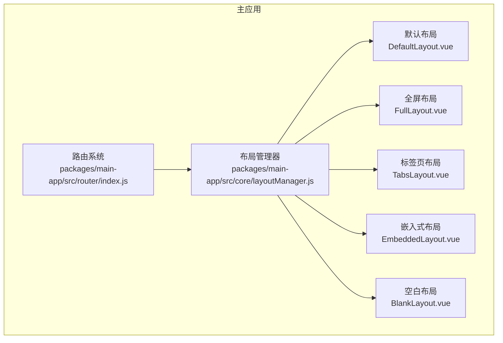
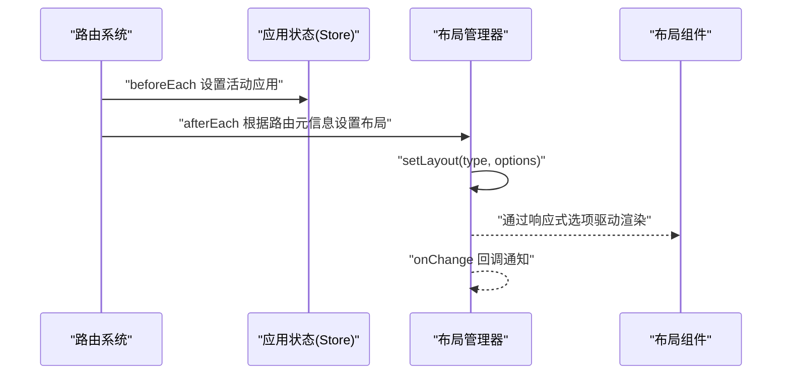
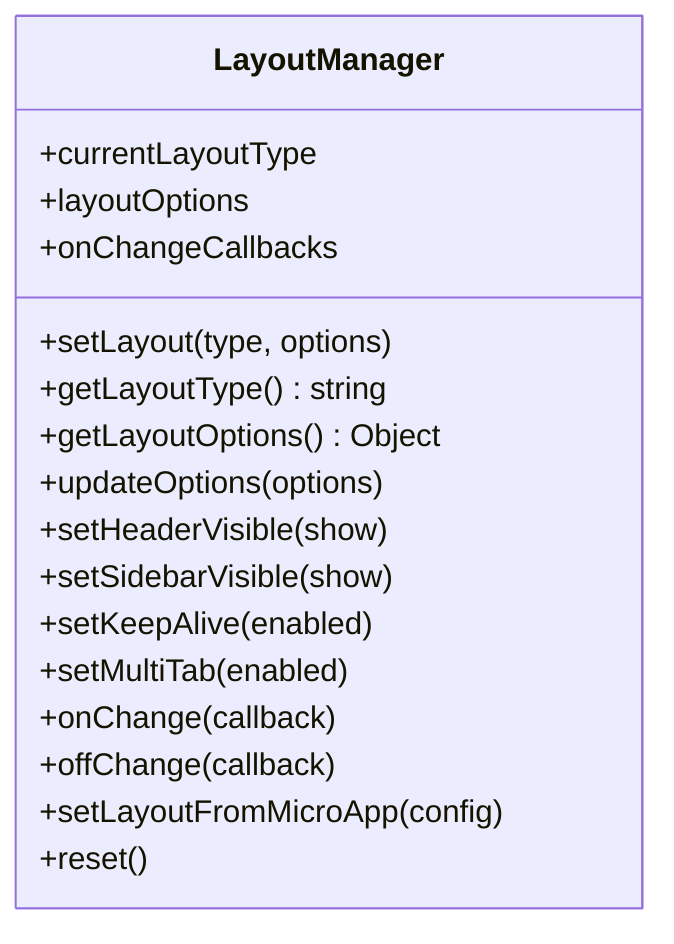
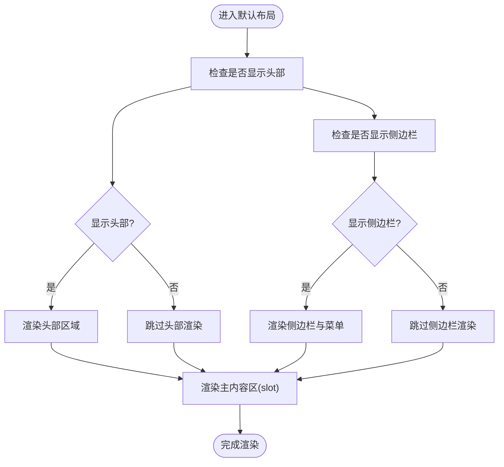
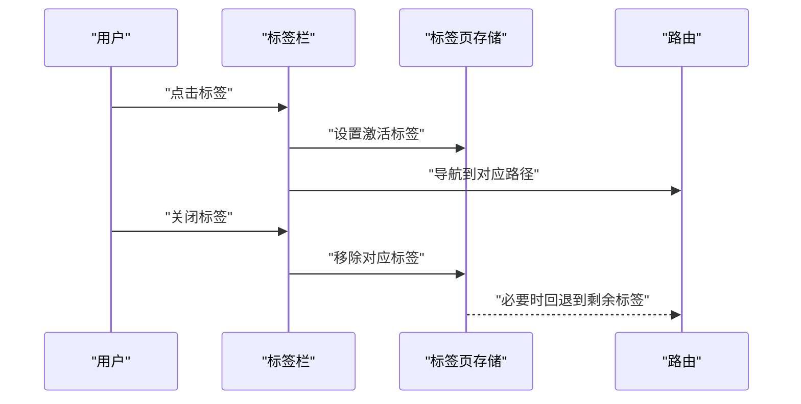
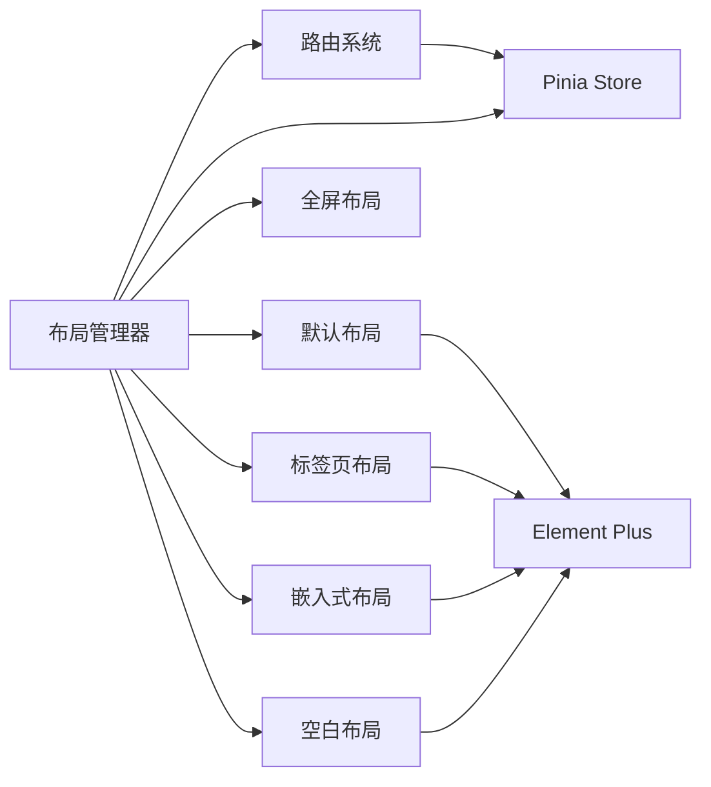

# 布局架构

<cite>
**本文引用的文件**
- [README.md](file://README.md)
- [布局系统.md](file://user-docs/guide/layout-system.md)
- [layoutManager.js](file://packages/main-app/src/core/layoutManager.js)
- [DefaultLayout.vue](file://packages/main-app/src/components/layout/DefaultLayout.vue)
- [FullLayout.vue](file://packages/main-app/src/components/layout/FullLayout.vue)
- [TabsLayout.vue](file://packages/main-app/src/components/layout/TabsLayout.vue)
- [EmbeddedLayout.vue](file://packages/main-app/src/components/layout/EmbeddedLayout.vue)
- [BlankLayout.vue](file://packages/main-app/src/components/layout/BlankLayout.vue)
- [index.js](file://packages/main-app/src/router/index.js)
- [package.json](file://packages/main-app/package.json)
</cite>

## 目录
1. [简介](#简介)
2. [项目结构](#项目结构)
3. [核心组件](#核心组件)
4. [架构总览](#架构总览)
5. [详细组件分析](#详细组件分析)
6. [依赖关系分析](#依赖关系分析)
7. [性能考量](#性能考量)
8. [故障排查指南](#故障排查指南)
9. [结论](#结论)
10. [附录](#附录)

## 简介
本文件系统化阐述该微前端主应用的多布局系统：设计理念、五种布局类型的架构设计、动态切换机制与配置管理、布局管理器核心逻辑、布局组件组合模式与响应式适配、布局状态持久化与主题策略、以及可扩展接口与自定义布局开发指南。目标是帮助开发者在不深入源码的情况下，也能快速理解并高效使用与扩展布局体系。

## 项目结构
- 布局系统位于主应用包内，采用“布局管理器 + 布局组件”的分层设计：
  - 布局管理器负责全局布局状态与配置的集中控制与事件通知。
  - 布局组件以组合模式提供不同视觉与交互形态，通过插槽承载子应用内容。
- 路由层通过元信息(meta)声明布局类型，并在导航过程中联动布局管理器与标签页存储。

图表来源
- [layoutManager.js](file://packages/main-app/src/core/layoutManager.js#L1-L175)
- [index.js](file://packages/main-app/src/router/index.js#L1-L130)
- [DefaultLayout.vue](file://packages/main-app/src/components/layout/DefaultLayout.vue#L1-L259)
- [FullLayout.vue](file://packages/main-app/src/components/layout/FullLayout.vue#L1-L17)
- [TabsLayout.vue](file://packages/main-app/src/components/layout/TabsLayout.vue#L1-L227)
- [EmbeddedLayout.vue](file://packages/main-app/src/components/layout/EmbeddedLayout.vue#L1-L39)
- [BlankLayout.vue](file://packages/main-app/src/components/layout/BlankLayout.vue#L1-L16)

章节来源
- [README.md](file://README.md#L1-L158)
- [布局系统.md](file://user-docs/guide/layout-system.md#L1-L125)
- [package.json](file://packages/main-app/package.json#L1-L31)

## 核心组件
- 布局管理器
  - 提供布局类型枚举与全局状态(ref)。
  - 支持动态设置布局类型、合并更新布局选项、监听变更回调、从微应用配置初始化布局、重置默认布局。
  - 对外暴露便捷方法：显隐头部/侧边栏、开启/关闭 KeepAlive、开启/关闭多标签模式。
- 布局组件
  - 默认布局：包含头部、面包屑、侧边菜单与主内容区，支持折叠切换与图标映射。
  - 全屏布局：无头部/侧边栏，仅插槽容器。
  - 标签页布局：左侧菜单 + 顶部标签栏 + 主内容区，内置标签页增删改查与刷新操作。
  - 嵌入式布局：带面包屑的上下结构，适合嵌入子应用但不替换主路由。
  - 空白布局：纯容器，用于独立页面（如登录页）。

章节来源
- [layoutManager.js](file://packages/main-app/src/core/layoutManager.js#L1-L175)
- [DefaultLayout.vue](file://packages/main-app/src/components/layout/DefaultLayout.vue#L1-L259)
- [FullLayout.vue](file://packages/main-app/src/components/layout/FullLayout.vue#L1-L17)
- [TabsLayout.vue](file://packages/main-app/src/components/layout/TabsLayout.vue#L1-L227)
- [EmbeddedLayout.vue](file://packages/main-app/src/components/layout/EmbeddedLayout.vue#L1-L39)
- [BlankLayout.vue](file://packages/main-app/src/components/layout/BlankLayout.vue#L1-L16)

## 架构总览
- 设计理念
  - 统一入口：通过布局管理器集中控制布局类型与选项，避免分散配置。
  - 组合优先：布局组件以插槽组合承载子应用内容，便于复用与扩展。
  - 响应式适配：布局组件内部使用计算属性与样式控制响应式行为（如侧边栏宽度、标签栏布局）。
  - 可观测性：提供 onChange 回调，便于订阅布局变化进行额外处理。
- 动态切换机制
  - 路由守卫根据 meta.layout 设置初始布局；也可在运行时通过布局管理器动态切换。
  - 切换时合并新选项并触发回调，确保全局状态一致。
- 配置管理
  - 路由级配置：meta.layout 指定布局类型。
  - 微应用配置：layoutType 与 layoutOptions 决定子应用进入后的布局形态。
  - 运行时配置：通过布局管理器提供的方法或 updateOptions 手动调整。

图表来源
- [index.js](file://packages/main-app/src/router/index.js#L92-L127)
- [layoutManager.js](file://packages/main-app/src/core/layoutManager.js#L40-L67)

章节来源
- [布局系统.md](file://user-docs/guide/layout-system.md#L68-L116)
- [index.js](file://packages/main-app/src/router/index.js#L1-L130)
- [layoutManager.js](file://packages/main-app/src/core/layoutManager.js#L1-L175)

## 详细组件分析

### 布局管理器类图

图表来源
- [layoutManager.js](file://packages/main-app/src/core/layoutManager.js#L18-L172)

章节来源
- [layoutManager.js](file://packages/main-app/src/core/layoutManager.js#L1-L175)

### 默认布局(DefaultLayout)
- 结构与职责
  - 外层容器包含侧边栏、头部与主内容区。
  - 侧边栏支持折叠，菜单项根据在线应用动态生成。
  - 头部包含面包屑、折叠按钮与用户下拉菜单。
  - 通过计算属性读取布局选项，实现对头部/侧边栏的条件渲染。
- 响应式适配
  - 侧边栏宽度根据折叠状态动态计算，保证布局紧凑与展开时的可读性。
- 与布局管理器协作
  - 通过响应式绑定 layoutManager.layoutOptions，实现运行时选项变更的即时生效。

图表来源
- [DefaultLayout.vue](file://packages/main-app/src/components/layout/DefaultLayout.vue#L1-L259)

章节来源
- [DefaultLayout.vue](file://packages/main-app/src/components/layout/DefaultLayout.vue#L1-L259)

### 全屏布局(FullLayout)
- 结构与职责
  - 无任何装饰元素，仅提供一个占满视口的插槽容器，适合全屏展示的场景。
- 适用场景
  - 报表、大屏可视化、全屏视频播放等。

章节来源
- [FullLayout.vue](file://packages/main-app/src/components/layout/FullLayout.vue#L1-L17)

### 标签页布局(TabsLayout)
- 结构与职责
  - 左侧菜单 + 顶部标签栏 + 主内容区。
  - 标签栏支持点击切换、关闭、刷新、关闭其他与关闭全部等操作。
- 与标签页存储协作
  - 通过 Pinia 标签页存储维护标签集合与当前激活标签，布局组件仅负责 UI 行为。

图表来源
- [TabsLayout.vue](file://packages/main-app/src/components/layout/TabsLayout.vue#L109-L138)

章节来源
- [TabsLayout.vue](file://packages/main-app/src/components/layout/TabsLayout.vue#L1-L227)

### 嵌入式布局(EmbeddedLayout)
- 结构与职责
  - 上下结构：顶部面包屑 + 下方内容区，适合在现有页面中嵌入子应用而不改变主路由。
- 适用场景
  - 控制台内的子功能模块、仪表盘中的子视图等。

章节来源
- [EmbeddedLayout.vue](file://packages/main-app/src/components/layout/EmbeddedLayout.vue#L1-L39)

### 空白布局(BlankLayout)
- 结构与职责
  - 纯容器，无任何装饰，适合独立页面（如登录页）。
- 适用场景
  - 登录、注册、错误页等。

章节来源
- [BlankLayout.vue](file://packages/main-app/src/components/layout/BlankLayout.vue#L1-L16)

## 依赖关系分析
- 布局管理器依赖
  - Vue 响应式系统(ref)用于状态管理。
  - 与路由系统协作：通过路由守卫在导航前后设置布局与标签页。
  - 与 Pinia 存储协作：读取应用状态与标签页状态，驱动布局组件渲染。
- 布局组件依赖
  - Element Plus 组件库用于菜单、面包屑、头部、侧边栏与标签栏。
  - SCSS 样式控制布局外观与响应式行为。
- 外部集成
  - qiankun 微前端框架用于子应用加载，布局系统在主应用中统一编排。

图表来源
- [layoutManager.js](file://packages/main-app/src/core/layoutManager.js#L1-L175)
- [index.js](file://packages/main-app/src/router/index.js#L1-L130)
- [DefaultLayout.vue](file://packages/main-app/src/components/layout/DefaultLayout.vue#L1-L259)
- [TabsLayout.vue](file://packages/main-app/src/components/layout/TabsLayout.vue#L1-L227)
- [EmbeddedLayout.vue](file://packages/main-app/src/components/layout/EmbeddedLayout.vue#L1-L39)
- [BlankLayout.vue](file://packages/main-app/src/components/layout/BlankLayout.vue#L1-L16)
- [package.json](file://packages/main-app/package.json#L12-L22)

章节来源
- [package.json](file://packages/main-app/package.json#L1-L31)

## 性能考量
- 渲染优化
  - 使用 Vue 计算属性与响应式选项，减少不必要的重渲染。
  - 标签页布局中对标签栏使用虚拟滚动与懒加载，避免大量标签导致的性能问题。
- 资源管理
  - KeepAlive 选项按需启用，避免长时间驻留造成内存占用过高。
  - 多标签模式下建议结合路由级别的 keep-alive 策略，平衡性能与体验。
- 主题与样式
  - 布局组件样式采用 SCSS，建议统一主题变量与暗色模式适配，减少重复计算与重绘。

## 故障排查指南
- 常见问题
  - 布局未生效：确认路由 meta 中的 layout 字段与微应用配置中的 layoutType 是否正确。
  - 侧边栏不显示：检查布局选项中的 showSidebar 是否被手动关闭。
  - 标签页异常：检查标签页存储的状态与当前激活标签是否一致。
  - 动态切换无效：确认是否通过布局管理器的 setLayout 或 updateOptions 方法进行更新。
- 排查步骤
  - 打开浏览器控制台，观察布局管理器的日志输出，定位切换链路。
  - 在布局组件中打印响应式选项，确认选项合并逻辑是否符合预期。
  - 检查路由守卫是否正确设置了活动应用与布局类型。

章节来源
- [layoutManager.js](file://packages/main-app/src/core/layoutManager.js#L40-L67)
- [index.js](file://packages/main-app/src/router/index.js#L92-L127)

## 结论
该布局系统以“布局管理器 + 布局组件”为核心，实现了多布局类型、动态切换与配置管理的统一编排。通过组合模式与响应式适配，既满足了复杂业务场景下的灵活布局需求，又保持了良好的可维护性与扩展性。配合路由与状态管理，能够稳定支撑微前端环境下的多子应用布局编排。

## 附录

### 布局类型与选项规范
- 布局类型
  - default：默认布局（含头部和侧边栏）
  - full：全屏布局（无头部和侧边栏）
  - tabs：多标签页布局（支持多标签与缓存）
  - embedded：嵌入式布局（不替换主路由）
  - blank：空白布局（完全空白）
- 布局选项
  - showHeader：是否显示头部
  - showSidebar：是否显示侧边栏
  - keepAlive：是否缓存页面
  - multiTab：是否支持多标签

章节来源
- [README.md](file://README.md#L122-L129)
- [布局系统.md](file://user-docs/guide/layout-system.md#L117-L125)

### 动态切换与配置示例
- 路由级别配置
  - 在路由 meta 中设置 layout 字段，决定进入该路由时的布局类型。
- 微应用配置
  - 在微应用配置中指定 layoutType 与 layoutOptions，进入子应用时自动应用。
- 运行时切换
  - 通过布局管理器的方法动态切换布局类型与选项，并触发回调。

章节来源
- [布局系统.md](file://user-docs/guide/layout-system.md#L68-L116)
- [index.js](file://packages/main-app/src/router/index.js#L5-L85)
- [layoutManager.js](file://packages/main-app/src/core/layoutManager.js#L148-L156)

### 自定义布局开发指南
- 开发步骤
  - 新建布局组件，遵循现有布局的插槽与样式约定。
  - 在布局管理器中新增布局类型枚举，并在 setLayout 中处理新类型。
  - 在路由或微应用配置中引用新布局类型。
- 最佳实践
  - 保持布局组件的单一职责，尽量通过插槽承载内容。
  - 使用响应式选项驱动 UI 行为，避免硬编码。
  - 提供清晰的默认选项与合理的禁用策略，降低接入成本。

章节来源
- [layoutManager.js](file://packages/main-app/src/core/layoutManager.js#L6-L12)
- [DefaultLayout.vue](file://packages/main-app/src/components/layout/DefaultLayout.vue#L1-L259)
- [TabsLayout.vue](file://packages/main-app/src/components/layout/TabsLayout.vue#L1-L227)