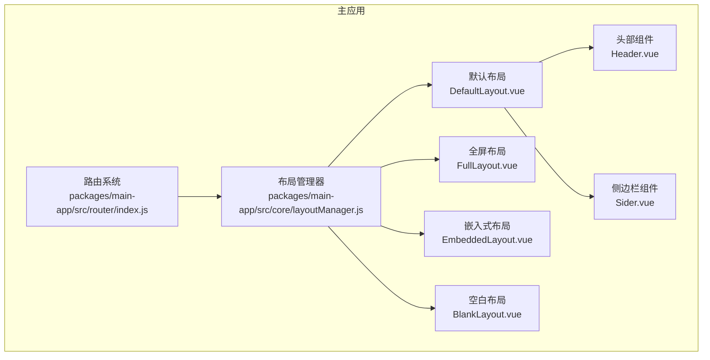
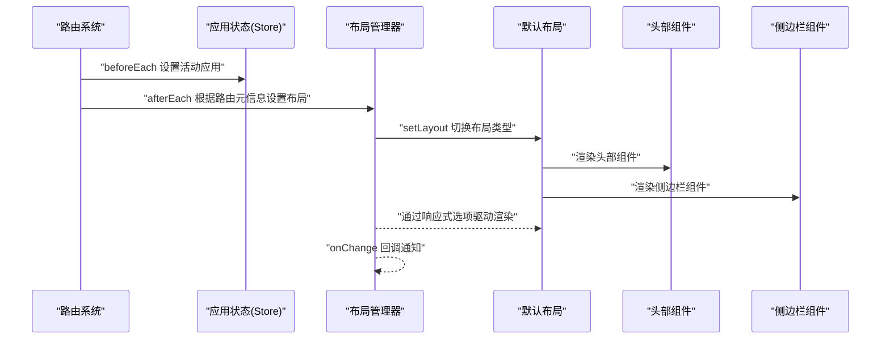
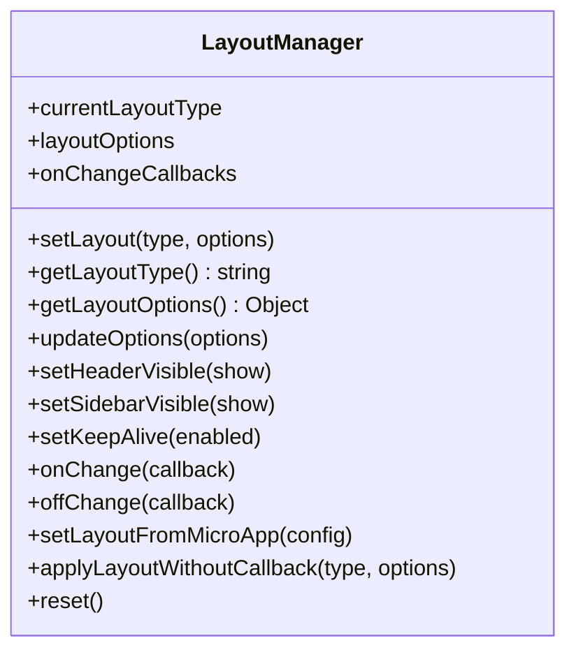
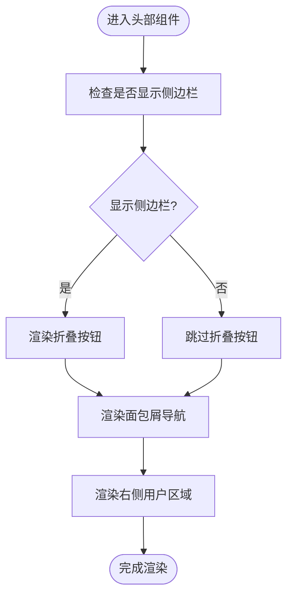
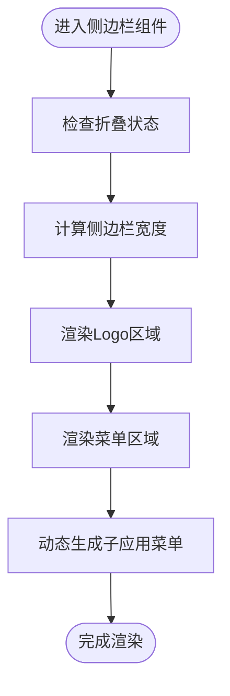
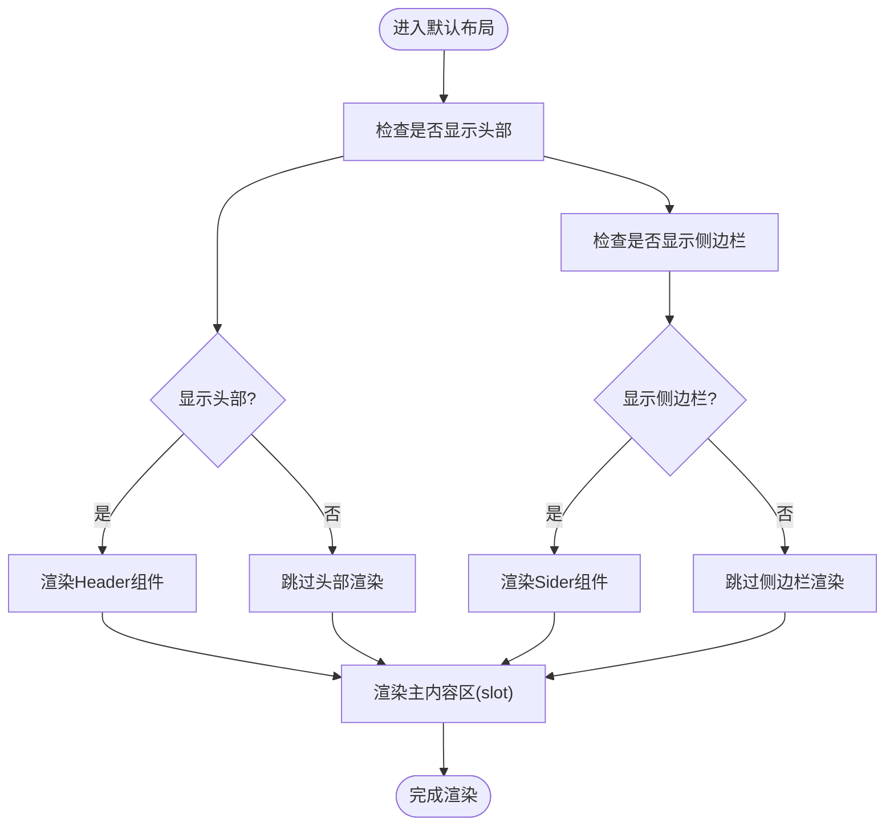
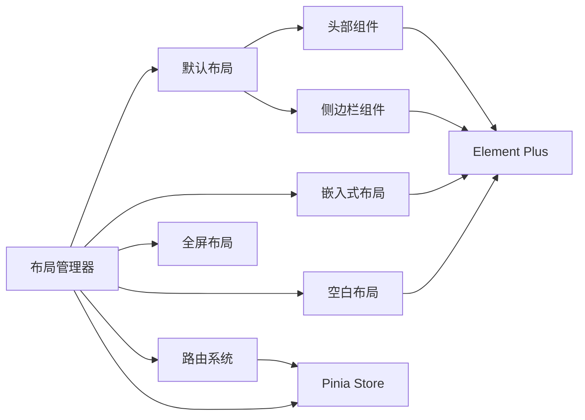

# 布局架构

<cite>
**本文引用的文件**
- [README.md](file://README.md)
- [布局系统.md](file://user-docs/guide/layout-system.md)
- [layoutManager.js](file://packages/main-app/src/core/layoutManager.js)
- [DefaultLayout.vue](file://packages/main-app/src/components/layout/DefaultLayout.vue)
- [FullLayout.vue](file://packages/main-app/src/components/layout/FullLayout.vue)
- [Header.vue](file://packages/main-app/src/components/layout/Header.vue)
- [Sider.vue](file://packages/main-app/src/components/layout/Sider.vue)
- [EmbeddedLayout.vue](file://packages/main-app/src/components/layout/EmbeddedLayout.vue)
- [BlankLayout.vue](file://packages/main-app/src/components/layout/BlankLayout.vue)
- [index.js](file://packages/main-app/src/router/index.js)
- [package.json](file://packages/main-app/package.json)
</cite>

## 更新摘要
**所做更改**
- 移除了标签页布局相关的所有内容和配置
- 新增了Header.vue和Sider.vue可复用组件的详细分析
- 更新了布局类型枚举，移除了tabs类型
- 重构了默认布局的架构说明，强调组件化设计
- 更新了布局管理器的配置选项说明

## 目录
1. [简介](#简介)
2. [项目结构](#项目结构)
3. [核心组件](#核心组件)
4. [架构总览](#架构总览)
5. [详细组件分析](#详细组件分析)
6. [依赖关系分析](#依赖关系分析)
7. [性能考量](#性能考量)
8. [故障排查指南](#故障排查指南)
9. [结论](#结论)
10. [附录](#附录)

## 简介
本文件系统化阐述该微前端主应用的多布局系统：设计理念、四种布局类型的架构设计、动态切换机制与配置管理、布局管理器核心逻辑、布局组件组合模式与响应式适配、布局状态持久化与主题策略、以及可扩展接口与自定义布局开发指南。目标是帮助开发者在不深入源码的情况下，也能快速理解并高效使用与扩展布局体系。

## 项目结构
- 布局系统位于主应用包内，采用"布局管理器 + 可复用组件"的分层设计：
  - 布局管理器负责全局布局状态与配置的集中控制与事件通知。
  - 可复用组件以组合模式提供不同视觉与交互形态，通过插槽承载子应用内容。
- 路由层通过元信息(meta)声明布局类型，并在导航过程中联动布局管理器。

```mermaid
graph TB
subgraph "主应用"
LM["布局管理器<br/>packages/main-app/src/core/layoutManager.js"]
RT["路由系统<br/>packages/main-app/src/router/index.js"]
DL["默认布局<br/>DefaultLayout.vue"]
FL["全屏布局<br/>FullLayout.vue"]
EL["嵌入式布局<br/>EmbeddedLayout.vue"]
BL["空白布局<br/>BlankLayout.vue"]
HD["头部组件<br/>Header.vue"]
SD["侧边栏组件<br/>Sider.vue"]
end
RT --> LM
LM --> DL
LM --> FL
LM --> EL
LM --> BL
DL --> HD
DL --> SD
```

**图表来源**
- [layoutManager.js](file://packages/main-app/src/core/layoutManager.js#L1-L187)
- [index.js](file://packages/main-app/src/router/index.js#L1-L130)
- [DefaultLayout.vue](file://packages/main-app/src/components/layout/DefaultLayout.vue#L1-L78)
- [FullLayout.vue](file://packages/main-app/src/components/layout/FullLayout.vue#L1-L17)
- [Header.vue](file://packages/main-app/src/components/layout/Header.vue#L1-L134)
- [Sider.vue](file://packages/main-app/src/components/layout/Sider.vue#L1-L156)
- [EmbeddedLayout.vue](file://packages/main-app/src/components/layout/EmbeddedLayout.vue#L1-L39)
- [BlankLayout.vue](file://packages/main-app/src/components/layout/BlankLayout.vue#L1-L16)

**章节来源**
- [README.md](file://README.md#L1-L158)
- [布局系统.md](file://user-docs/guide/layout-system.md#L1-L125)
- [package.json](file://packages/main-app/package.json#L1-L31)

## 核心组件
- 布局管理器
  - 提供布局类型枚举与全局状态(ref)。
  - 支持动态设置布局类型、合并更新布局选项、监听变更回调、从微应用配置初始化布局、重置默认布局。
  - 对外暴露便捷方法：显隐头部/侧边栏、开启/关闭 KeepAlive。
- 可复用组件
  - Header组件：提供统一的头部区域，包含面包屑导航、折叠按钮、用户信息和Token管理。
  - Sider组件：提供统一的侧边栏菜单，支持折叠切换、动态菜单生成和应用图标映射。
- 布局组件
  - 默认布局：组合Header和Sider组件，提供完整的头部、侧边栏和主内容区。
  - 全屏布局：无头部/侧边栏，仅插槽容器。
  - 嵌入式布局：带面包屑的上下结构，适合嵌入子应用但不替换主路由。
  - 空白布局：纯容器，用于独立页面（如登录页）。

**章节来源**
- [layoutManager.js](file://packages/main-app/src/core/layoutManager.js#L1-L187)
- [Header.vue](file://packages/main-app/src/components/layout/Header.vue#L1-L134)
- [Sider.vue](file://packages/main-app/src/components/layout/Sider.vue#L1-L156)
- [DefaultLayout.vue](file://packages/main-app/src/components/layout/DefaultLayout.vue#L1-L78)
- [FullLayout.vue](file://packages/main-app/src/components/layout/FullLayout.vue#L1-L17)
- [EmbeddedLayout.vue](file://packages/main-app/src/components/layout/EmbeddedLayout.vue#L1-L39)
- [BlankLayout.vue](file://packages/main-app/src/components/layout/BlankLayout.vue#L1-L16)

## 架构总览
- 设计理念
  - 统一入口：通过布局管理器集中控制布局类型与选项，避免分散配置。
  - 组件化优先：Header和Sider作为可复用组件，通过组合模式提供不同视觉与交互形态。
  - 响应式适配：组件内部使用计算属性与样式控制响应式行为（如侧边栏宽度、头部布局）。
  - 可观测性：提供 onChange 回调，便于订阅布局变化进行额外处理。
- 动态切换机制
  - 路由守卫根据 meta.layout 设置初始布局；也可在运行时通过布局管理器动态切换。
  - 切换时合并新选项并触发回调，确保全局状态一致。
- 配置管理
  - 路由级配置：meta.layout 指定布局类型。
  - 微应用配置：layoutType 与 layoutOptions 决定子应用进入后的布局形态。
  - 运行时配置：通过布局管理器提供的方法或 updateOptions 手动调整。

```mermaid
sequenceDiagram
participant R as "路由系统"
participant S as "应用状态(Store)"
participant M as "布局管理器"
participant D as "默认布局"
participant H as "头部组件"
participant Sd as "侧边栏组件"
R->>S : "beforeEach 设置活动应用"
R->>M : "afterEach 根据路由元信息设置布局"
M->>D : "setLayout 切换布局类型"
D->>H : "渲染头部组件"
D->>Sd : "渲染侧边栏组件"
M-->>D : "通过响应式选项驱动渲染"
M-->>M : "onChange 回调通知"
```

**图表来源**
- [index.js](file://packages/main-app/src/router/index.js#L92-L127)
- [layoutManager.js](file://packages/main-app/src/core/layoutManager.js#L38-L65)
- [DefaultLayout.vue](file://packages/main-app/src/components/layout/DefaultLayout.vue#L1-L78)

**章节来源**
- [布局系统.md](file://user-docs/guide/layout-system.md#L68-L116)
- [index.js](file://packages/main-app/src/router/index.js#L1-L130)
- [layoutManager.js](file://packages/main-app/src/core/layoutManager.js#L1-L187)

## 详细组件分析

### 布局管理器类图

```mermaid
classDiagram
class LayoutManager {
+currentLayoutType
+layoutOptions
+onChangeCallbacks
+setLayout(type, options)
+getLayoutType() string
+getLayoutOptions() Object
+updateOptions(options)
+setHeaderVisible(show)
+setSidebarVisible(show)
+setKeepAlive(enabled)
+onChange(callback)
+offChange(callback)
+setLayoutFromMicroApp(config)
+applyLayoutWithoutCallback(type, options)
+reset()
}
```

**图表来源**
- [layoutManager.js](file://packages/main-app/src/core/layoutManager.js#L17-L181)

**章节来源**
- [layoutManager.js](file://packages/main-app/src/core/layoutManager.js#L1-L187)

### 头部组件分析
- 结构与职责
  - 外层容器包含左侧面包屑区域和右侧用户信息区域。
  - 左侧区域包含折叠按钮、面包屑导航和应用名称。
  - 右侧区域包含Token输入框、用户头像和下拉菜单。
  - 支持响应式折叠，根据侧边栏状态动态调整布局。
- 响应式适配
  - 通过props接收collapsed和showSidebar参数，实现动态布局调整。
  - 使用Element Plus图标组件提供折叠/展开状态的视觉反馈。
- 与布局管理器协作
  - 通过emit事件与父组件通信，实现侧边栏折叠状态的同步。

```mermaid
flowchart TD
Start(["进入头部组件"]) --> CheckShowSidebar["检查是否显示侧边栏"]
CheckShowSidebar --> SidebarYes{"显示侧边栏?"}
SidebarYes --> |是| RenderCollapseBtn["渲染折叠按钮"]
SidebarYes --> |否| SkipCollapseBtn["跳过折叠按钮"]
RenderCollapseBtn --> RenderBreadcrumb["渲染面包屑导航"]
SkipCollapseBtn --> RenderBreadcrumb
RenderBreadcrumb --> RenderRightArea["渲染右侧用户区域"]
RenderRightArea --> End(["完成渲染"])
```

**图表来源**
- [Header.vue](file://packages/main-app/src/components/layout/Header.vue#L1-L134)

**章节来源**
- [Header.vue](file://packages/main-app/src/components/layout/Header.vue#L1-L134)

### 侧边栏组件分析
- 结构与职责
  - 外层容器包含Logo区域和菜单区域。
  - Logo区域支持折叠状态下的简写显示和折叠按钮。
  - 菜单区域包含静态菜单项和动态生成的子应用菜单。
  - 支持折叠切换，动态计算宽度和图标映射。
- 响应式适配
  - 通过computed属性动态计算侧边栏宽度，支持平滑过渡动画。
  - 根据折叠状态动态调整菜单项的显示方式。
- 与应用状态协作
  - 从Pinia store读取onlineApps数据，动态生成子应用菜单。
  - 支持不同类型的子应用使用不同的图标显示。

```mermaid
flowchart TD
Start(["进入侧边栏组件"]) --> CheckCollapsed["检查折叠状态"]
CheckCollapsed --> WidthCalc["计算侧边栏宽度"]
WidthCalc --> RenderLogo["渲染Logo区域"]
RenderLogo --> RenderMenu["渲染菜单区域"]
RenderMenu --> DynamicApps["动态生成子应用菜单"]
DynamicApps --> End(["完成渲染"])
```

**图表来源**
- [Sider.vue](file://packages/main-app/src/components/layout/Sider.vue#L1-L156)

**章节来源**
- [Sider.vue](file://packages/main-app/src/components/layout/Sider.vue#L1-L156)

### 默认布局(DefaultLayout)
- 结构与职责
  - 外层容器采用Element Plus的container布局系统。
  - 条件渲染Header和Sider组件，支持头部和侧边栏的独立开关。
  - 主内容区通过插槽承载子应用内容。
- 组件组合模式
  - 通过组合Header和Sider组件，实现布局的模块化和可复用性。
  - 支持响应式选项控制组件的显示状态。
- 与布局管理器协作
  - 通过computed属性监听layoutManager的layoutOptions，实现运行时选项变更的即时生效。

```mermaid
flowchart TD
Start(["进入默认布局"]) --> CheckHeader["检查是否显示头部"]
CheckHeader --> HeaderYes{"显示头部?"}
HeaderYes --> |是| RenderHeader["渲染Header组件"]
HeaderYes --> |否| SkipHeader["跳过头部渲染"]
CheckHeader --> CheckSidebar["检查是否显示侧边栏"]
CheckSidebar --> SidebarYes{"显示侧边栏?"}
SidebarYes --> |是| RenderSidebar["渲染Sider组件"]
SidebarYes --> |否| SkipSidebar["跳过侧边栏渲染"]
RenderHeader --> Main["渲染主内容区(slot)"]
RenderSidebar --> Main
SkipHeader --> Main
SkipSidebar --> Main
Main --> End(["完成渲染"])
```

**图表来源**
- [DefaultLayout.vue](file://packages/main-app/src/components/layout/DefaultLayout.vue#L1-L78)

**章节来源**
- [DefaultLayout.vue](file://packages/main-app/src/components/layout/DefaultLayout.vue#L1-L78)

### 全屏布局(FullLayout)
- 结构与职责
  - 无任何装饰元素，仅提供一个占满视口的插槽容器，适合全屏展示的场景。
- 适用场景
  - 报表、大屏可视化、全屏视频播放等。

**章节来源**
- [FullLayout.vue](file://packages/main-app/src/components/layout/FullLayout.vue#L1-L17)

### 嵌入式布局(EmbeddedLayout)
- 结构与职责
  - 上下结构：顶部面包屑 + 下方内容区，适合在现有页面中嵌入子应用而不改变主路由。
- 适用场景
  - 控制台内的子功能模块、仪表盘中的子视图等。

**章节来源**
- [EmbeddedLayout.vue](file://packages/main-app/src/components/layout/EmbeddedLayout.vue#L1-L39)

### 空白布局(BlankLayout)
- 结构与职责
  - 纯容器，无任何装饰，适合独立页面（如登录页）。
- 适用场景
  - 登录、注册、错误页等。

**章节来源**
- [BlankLayout.vue](file://packages/main-app/src/components/layout/BlankLayout.vue#L1-L16)

## 依赖关系分析
- 布局管理器依赖
  - Vue 响应式系统(ref)用于状态管理。
  - 与路由系统协作：通过路由守卫在导航前后设置布局与标签页。
  - 与 Pinia 存储协作：读取应用状态与标签页状态，驱动布局组件渲染。
- 可复用组件依赖
  - Element Plus 组件库用于菜单、面包屑、头部、侧边栏与标签栏。
  - SCSS 样式控制布局外观与响应式行为。
- 布局组件依赖
  - Header和Sider组件作为基础可复用组件，被DefaultLayout组合使用。
  - 通过props和emits实现组件间的通信。
- 外部集成
  - qiankun 微前端框架用于子应用加载，布局系统在主应用中统一编排。

```mermaid
graph LR
LM["布局管理器"] --> RT["路由系统"]
LM --> DL["默认布局"]
LM --> FL["全屏布局"]
LM --> EL["嵌入式布局"]
LM --> BL["空白布局"]
DL --> HD["头部组件"]
DL --> SD["侧边栏组件"]
HD --> EP["Element Plus"]
SD --> EP
EL --> EP
BL --> EP
RT --> Store["Pinia Store"]
LM --> Store
```

**图表来源**
- [layoutManager.js](file://packages/main-app/src/core/layoutManager.js#L1-L187)
- [index.js](file://packages/main-app/src/router/index.js#L1-L130)
- [DefaultLayout.vue](file://packages/main-app/src/components/layout/DefaultLayout.vue#L1-L78)
- [Header.vue](file://packages/main-app/src/components/layout/Header.vue#L1-L134)
- [Sider.vue](file://packages/main-app/src/components/layout/Sider.vue#L1-L156)
- [EmbeddedLayout.vue](file://packages/main-app/src/components/layout/EmbeddedLayout.vue#L1-L39)
- [BlankLayout.vue](file://packages/main-app/src/components/layout/BlankLayout.vue#L1-L16)
- [package.json](file://packages/main-app/package.json#L12-L22)

**章节来源**
- [package.json](file://packages/main-app/package.json#L1-L31)

## 性能考量
- 渲染优化
  - 使用 Vue 计算属性与响应式选项，减少不必要的重渲染。
  - Header和Sider组件通过props接收状态，避免深层组件树的重复计算。
  - 默认布局中使用条件渲染，只在需要时渲染头部和侧边栏。
- 资源管理
  - KeepAlive 选项按需启用，避免长时间驻留造成内存占用过高。
  - 可复用组件的图标资源通过动态导入，减少初始加载时间。
- 主题与样式
  - 布局组件样式采用 SCSS，建议统一主题变量与暗色模式适配，减少重复计算与重绘。
  - Header和Sider组件支持主题切换，通过CSS变量实现动态样式更新。

## 故障排查指南
- 常见问题
  - 布局未生效：确认路由 meta 中的 layout 字段与微应用配置中的 layoutType 是否正确。
  - 侧边栏不显示：检查布局选项中的 showSidebar 是否被手动关闭。
  - 头部组件异常：检查Header组件的props传递和事件监听是否正常。
  - 组件通信失败：确认Header和Sider组件的emit事件是否正确触发。
  - 动态切换无效：确认是否通过布局管理器的 setLayout 或 updateOptions 方法进行更新。
- 排查步骤
  - 打开浏览器控制台，观察布局管理器的日志输出，定位切换链路。
  - 在布局组件中打印响应式选项，确认选项合并逻辑是否符合预期。
  - 检查路由守卫是否正确设置了活动应用与布局类型。
  - 验证Header和Sider组件的props和emits是否正确传递。

**章节来源**
- [layoutManager.js](file://packages/main-app/src/core/layoutManager.js#L38-L65)
- [index.js](file://packages/main-app/src/router/index.js#L92-L127)
- [Header.vue](file://packages/main-app/src/components/layout/Header.vue#L67-L90)
- [Sider.vue](file://packages/main-app/src/components/layout/Sider.vue#L89-L111)

## 结论
该布局系统以"布局管理器 + 可复用组件 + 布局组件"为核心，实现了多布局类型、动态切换与配置管理的统一编排。通过Header和Sider可复用组件的引入，简化了架构设计，提高了组件的复用性和可维护性。通过组合模式与响应式适配，既满足了复杂业务场景下的灵活布局需求，又保持了良好的可扩展性。配合路由与状态管理，能够稳定支撑微前端环境下的多子应用布局编排。

## 附录

### 布局类型与选项规范
- 布局类型
  - default：默认布局（含头部和侧边栏）
  - full：全屏布局（无头部和侧边栏）
  - embedded：嵌入式布局（不替换主路由）
  - blank：空白布局（完全空白）
- 布局选项
  - showHeader：是否显示头部
  - showSidebar：是否显示侧边栏
  - keepAlive：是否缓存页面

**章节来源**
- [layoutManager.js](file://packages/main-app/src/core/layoutManager.js#L6-L11)
- [布局系统.md](file://user-docs/guide/layout-system.md#L117-L125)

### 动态切换与配置示例
- 路由级别配置
  - 在路由 meta 中设置 layout 字段，决定进入该路由时的布局类型。
- 微应用配置
  - 在微应用配置中指定 layoutType 与 layoutOptions，进入子应用时自动应用。
- 运行时切换
  - 通过布局管理器的方法动态切换布局类型与选项，并触发回调。

**章节来源**
- [布局系统.md](file://user-docs/guide/layout-system.md#L68-L116)
- [index.js](file://packages/main-app/src/router/index.js#L5-L85)
- [layoutManager.js](file://packages/main-app/src/core/layoutManager.js#L87-L116)

### 自定义布局开发指南
- 开发步骤
  - 新建布局组件，遵循现有布局的插槽与样式约定。
  - 在布局管理器中新增布局类型枚举，并在 setLayout 中处理新类型。
  - 在路由或微应用配置中引用新布局类型。
- 最佳实践
  - 保持布局组件的单一职责，尽量通过插槽承载内容。
  - 使用响应式选项驱动 UI 行为，避免硬编码。
  - 提供清晰的默认选项与合理的禁用策略，降低接入成本。
  - 参考Header和Sider组件的设计模式，实现可复用的UI组件。

**章节来源**
- [layoutManager.js](file://packages/main-app/src/core/layoutManager.js#L6-L11)
- [DefaultLayout.vue](file://packages/main-app/src/components/layout/DefaultLayout.vue#L1-L78)
- [Header.vue](file://packages/main-app/src/components/layout/Header.vue#L1-L134)
- [Sider.vue](file://packages/main-app/src/components/layout/Sider.vue#L1-L156)