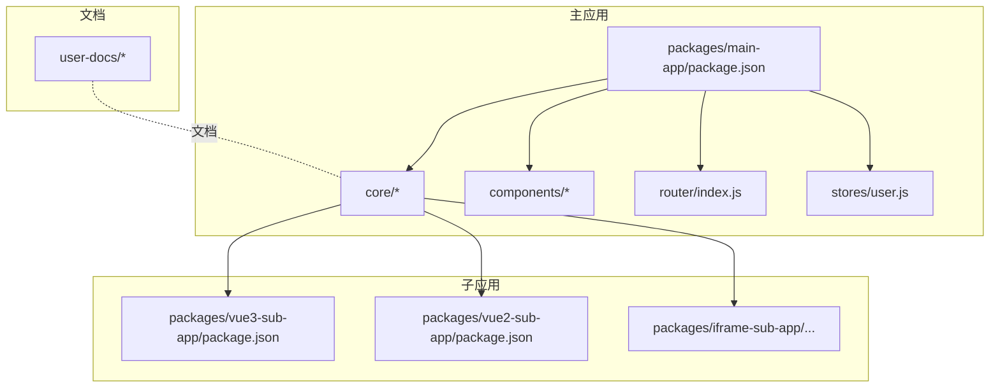
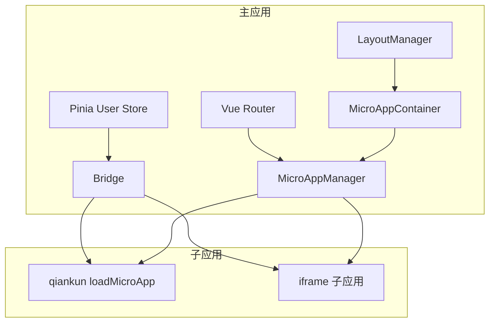
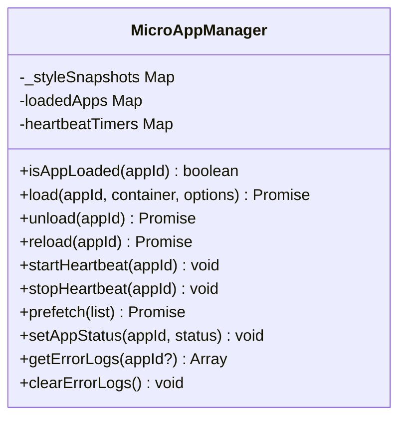
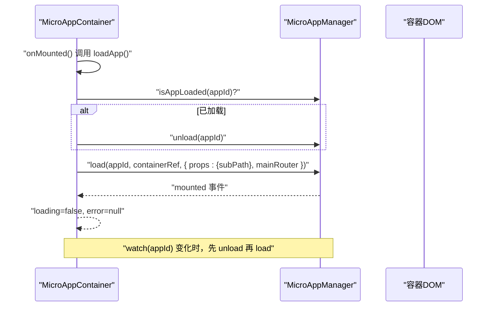
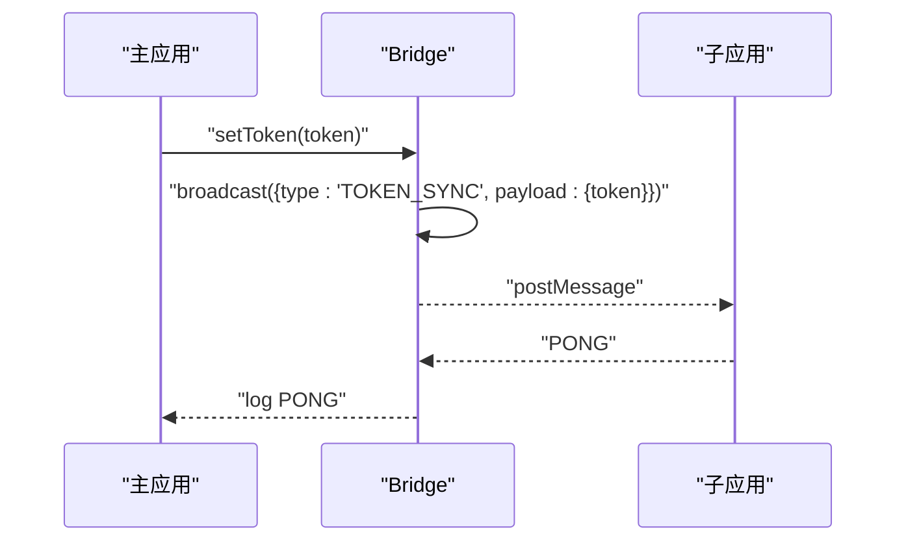
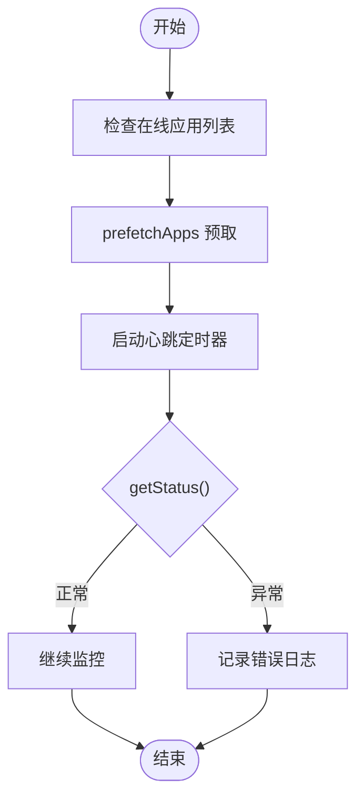
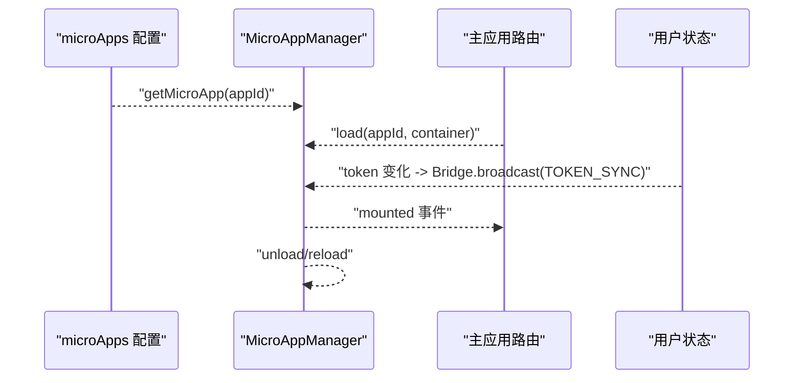
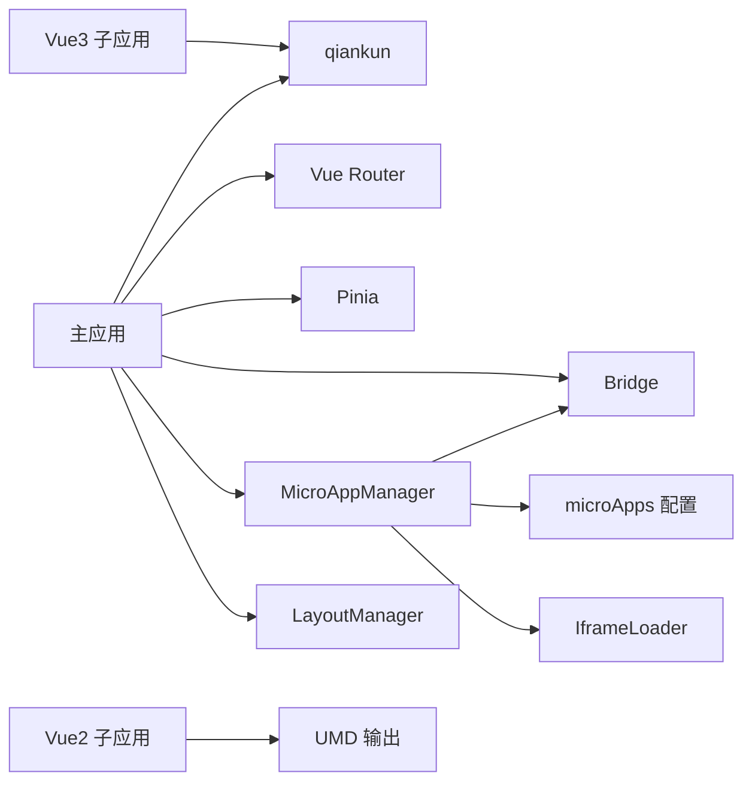

# 微前端架构

<cite>
**本文引用的文件**
- [README.md](file://README.md)
- [package.json](file://package.json)
- [packages/main-app/package.json](file://packages/main-app/package.json)
- [packages/vue3-sub-app/package.json](file://packages/vue3-sub-app/package.json)
- [packages/vue2-sub-app/package.json](file://packages/vue2-sub-app/package.json)
- [packages/main-app/src/core/microAppManager.js](file://packages/main-app/src/core/microAppManager.js)
- [packages/main-app/src/components/MicroAppContainer.vue](file://packages/main-app/src/components/MicroAppContainer.vue)
- [packages/main-app/src/config/microApps.js](file://packages/main-app/src/config/microApps.js)
- [packages/main-app/src/core/bridge.js](file://packages/main-app/src/core/bridge.js)
- [packages/main-app/src/core/iframeLoader.js](file://packages/main-app/src/core/iframeLoader.js)
- [packages/main-app/src/core/layoutManager.js](file://packages/main-app/src/core/layoutManager.js)
- [packages/main-app/src/stores/user.js](file://packages/main-app/src/stores/user.js)
- [packages/main-app/src/router/index.js](file://packages/main-app/src/router/index.js)
- [packages/vue3-sub-app/vite.config.js](file://packages/vue3-sub-app/vite.config.js)
- [packages/vue2-sub-app/vue.config.js](file://packages/vue2-sub-app/vue.config.js)
- [user-docs/guide/main-app.md](file://user-docs/guide/main-app.md)
- [user-docs/guide/layout-system.md](file://user-docs/guide/layout-system.md)
- [user-docs/api/micro-app-manager.md](file://user-docs/api/micro-app-manager.md)
- [user-docs/api/bridge.md](file://user-docs/api/bridge.md)
</cite>

## 目录
1. [简介](#简介)
2. [项目结构](#项目结构)
3. [核心组件](#核心组件)
4. [架构总览](#架构总览)
5. [组件详细分析](#组件详细分析)
6. [依赖关系分析](#依赖关系分析)
7. [性能考量](#性能考量)
8. [故障排查指南](#故障排查指南)
9. [结论](#结论)
10. [附录](#附录)

## 简介
本项目为企业级微前端基础平台脚手架，采用 Monorepo 架构，基于 qiankun 的 loadMicroApp 模式实现主应用对多类子应用（Vue3/Vue2/iframe/link）的统一加载与管理。项目提供完善的布局编排系统、跨应用通信桥、状态管理与持久化、iframe 跨域治理、多实例同屏加载、以及预加载、心跳检测、动态上下线等高级能力，满足复杂业务场景下的微前端工程化落地。

## 项目结构
- 顶层使用 Lerna + npm workspace 管理多包协作，主应用与各子应用分别位于 packages 目录下。
- 主应用依赖 qiankun，使用 Vite + Vue3 + Vue Router + Pinia 构建。
- 子应用包含 Vue3 示例（配合 vite-plugin-qiankun）、Vue2 示例（基于 @vue/cli），以及 iframe 示例。
- user-docs 提供 VitePress 文档，涵盖快速上手、部署、布局系统、主应用指南等。

**图表来源**
- [packages/main-app/package.json](file://packages/main-app/package.json#L1-L31)
- [packages/vue3-sub-app/package.json](file://packages/vue3-sub-app/package.json#L1-L23)
- [packages/vue2-sub-app/package.json](file://packages/vue2-sub-app/package.json#L1-L31)

**章节来源**
- [README.md](file://README.md#L62-L76)
- [package.json](file://package.json#L6-L27)

## 核心组件
- 微应用管理器（MicroAppManager）：负责 loadMicroApp 模式加载、卸载、刷新、预加载、心跳检测、错误日志、上下线控制、样式隔离清理等。
- 跨应用通信桥（Bridge）：基于 postMessage 的消息桥，支持 origin 校验、token 同步、广播、导航跳转、高度上报等。
- 布局管理器（LayoutManager）：动态切换布局类型与选项，支持 default/full/tabs/embedded/blank。
- 微应用容器（MicroAppContainer）：封装容器加载、遮罩、错误提示、重试逻辑，与管理器协同。
- 路由与状态：主应用路由负责激活应用与标签页管理；Pinia 用户状态与 Bridge 协作实现 token 同步。
- 子应用构建：Vue3 子应用使用 vite-plugin-qiankun；Vue2 子应用使用 @vue/cli UMD 输出。

**章节来源**
- [packages/main-app/src/core/microAppManager.js](file://packages/main-app/src/core/microAppManager.js#L1-L507)
- [packages/main-app/src/core/bridge.js](file://packages/main-app/src/core/bridge.js#L1-L241)
- [packages/main-app/src/core/layoutManager.js](file://packages/main-app/src/core/layoutManager.js#L1-L175)
- [packages/main-app/src/components/MicroAppContainer.vue](file://packages/main-app/src/components/MicroAppContainer.vue#L1-L105)
- [packages/main-app/src/stores/user.js](file://packages/main-app/src/stores/user.js#L1-L73)
- [packages/main-app/src/router/index.js](file://packages/main-app/src/router/index.js#L1-L130)
- [packages/vue3-sub-app/vite.config.js](file://packages/vue3-sub-app/vite.config.js#L1-L41)
- [packages/vue2-sub-app/vue.config.js](file://packages/vue2-sub-app/vue.config.js#L1-L21)

## 架构总览
主应用通过 MicroAppManager 统一调度 qiankun 的 loadMicroApp，按需加载不同类型的子应用；Bridge 提供主子间通信；LayoutManager 控制页面布局；用户状态通过 Pinia 管理并在登录/登出时同步至子应用。

**图表来源**
- [packages/main-app/src/router/index.js](file://packages/main-app/src/router/index.js#L1-L130)
- [packages/main-app/src/stores/user.js](file://packages/main-app/src/stores/user.js#L1-L73)
- [packages/main-app/src/core/microAppManager.js](file://packages/main-app/src/core/microAppManager.js#L1-L507)
- [packages/main-app/src/core/bridge.js](file://packages/main-app/src/core/bridge.js#L1-L241)
- [packages/main-app/src/core/layoutManager.js](file://packages/main-app/src/core/layoutManager.js#L1-L175)
- [packages/main-app/src/components/MicroAppContainer.vue](file://packages/main-app/src/components/MicroAppContainer.vue#L1-L105)

## 组件详细分析

### 微应用管理器（MicroAppManager）
- 职责
  - load：根据 appId 获取配置，校验状态与容器，调用 loadMicroApp 或 iframe 加载器；对 qiankun 应用启用实验性样式隔离，排除主应用 UI 框架资源；记录实例状态与错误日志。
  - unload/reload：停止心跳、卸载 qiankun 应用或移除 iframe，清理子应用注入的样式与资源；reload 先卸载再加载。
  - 预加载：基于 prefetchApps 批量预取在线应用资源。
  - 心跳检测：定期检查 qiankun 应用状态，维护心跳定时器；iframe 专用心跳通过 Bridge REPORT_HEIGHT/PING 流程实现。
  - 上下线控制：动态更新配置状态，offline 时自动卸载。
  - 错误日志：集中记录并限制数量，提供查询与清空接口。
  - 样式隔离清理：卸载时移除 qiankun 注入的样式及子应用入口域名相关的 link/style。
- 关键点
  - name 必须与 vite-plugin-qiankun 注册名一致（即 appId），否则生命周期钩子无法找到。
  - 传入 DOM 元素而非选择器字符串，避免容器变更导致后续挂载失败。
  - 对 Element Plus/UI 的 CSS 通过 excludeAssetFilter 排除，避免样式冲突。

**图表来源**
- [packages/main-app/src/core/microAppManager.js](file://packages/main-app/src/core/microAppManager.js#L1-L507)

**章节来源**
- [packages/main-app/src/core/microAppManager.js](file://packages/main-app/src/core/microAppManager.js#L11-L31)
- [packages/main-app/src/core/microAppManager.js](file://packages/main-app/src/core/microAppManager.js#L49-L120)
- [packages/main-app/src/core/microAppManager.js](file://packages/main-app/src/core/microAppManager.js#L174-L225)
- [packages/main-app/src/core/microAppManager.js](file://packages/main-app/src/core/microAppManager.js#L238-L334)
- [packages/main-app/src/core/microAppManager.js](file://packages/main-app/src/core/microAppManager.js#L336-L458)
- [packages/main-app/src/core/microAppManager.js](file://packages/main-app/src/core/microAppManager.js#L468-L507)

### 微应用容器（MicroAppContainer）
- 职责
  - 在组件挂载时尝试加载应用，若应用已在别处加载则先卸载，避免重复实例。
  - 提供加载遮罩、错误提示与重试按钮，错误时触发 error 事件。
  - 监听 appId 变化，自动卸载旧实例并加载新实例。
- 交互
  - 通过 microAppManager.load/unload 与管理器交互。
  - 将 props.subPath 透传给子应用，结合主应用 router 形成子应用内导航。

**图表来源**
- [packages/main-app/src/components/MicroAppContainer.vue](file://packages/main-app/src/components/MicroAppContainer.vue#L51-L105)
- [packages/main-app/src/core/microAppManager.js](file://packages/main-app/src/core/microAppManager.js#L49-L120)

**章节来源**
- [packages/main-app/src/components/MicroAppContainer.vue](file://packages/main-app/src/components/MicroAppContainer.vue#L1-L105)

### 跨应用通信桥（Bridge）
- 职责
  - 统一消息协议与处理器注册，支持 NAVIGATE_TO/NAVIGATE_TO_MAIN/TOKEN_SYNC/LOGOUT/REPORT_HEIGHT/PING 等。
  - origin 白名单校验，防止非法来源消息。
  - 提供 send/sendToIframe/broadcast/syncToken 等方法。
  - 暴露 window.__ARTISAN_BRIDGE__ 供子应用调用。
- 与主应用协作
  - 用户登录后通过 Pinia Store 自动广播 TOKEN_SYNC。
  - 登录态变更时广播 LOGOUT 通知子应用清理。

**图表来源**
- [packages/main-app/src/core/bridge.js](file://packages/main-app/src/core/bridge.js#L139-L182)
- [packages/main-app/src/stores/user.js](file://packages/main-app/src/stores/user.js#L16-L23)

**章节来源**
- [packages/main-app/src/core/bridge.js](file://packages/main-app/src/core/bridge.js#L1-L241)
- [packages/main-app/src/stores/user.js](file://packages/main-app/src/stores/user.js#L1-L73)
- [user-docs/api/bridge.md](file://user-docs/api/bridge.md#L1-L102)

### 布局管理器（LayoutManager）
- 职责
  - 管理布局类型与选项（显示头部/侧边栏、keepAlive、多标签）。
  - 提供 setLayout/updateOptions/setHeaderVisible/setSidebarVisible/setKeepAlive/setMultiTab 等 API。
  - 支持从微应用配置直接设置布局。
- 与路由联动
  - 路由 meta 中可声明 layoutType，主应用在导航时根据微应用配置动态切换布局。

**章节来源**
- [packages/main-app/src/core/layoutManager.js](file://packages/main-app/src/core/layoutManager.js#L1-L175)
- [user-docs/guide/layout-system.md](file://user-docs/guide/layout-system.md#L1-L115)

### 子应用构建与注册（Vue3/Vue2/iframe）
- Vue3 子应用
  - 使用 vite-plugin-qiankun，在开发模式下启用 useDevMode，构建时通过 define 常量区分 qiankun 构建环境。
  - 与主应用约定 name=appId，保证生命周期钩子可用。
- Vue2 子应用
  - 使用 @vue/cli，输出 UMD，公共路径指向子应用端口，便于跨域访问。
- iframe 子应用
  - 由 IframeLoader 管理创建、通信与高度自适应，支持 sandbox 安全策略。

**章节来源**
- [packages/vue3-sub-app/vite.config.js](file://packages/vue3-sub-app/vite.config.js#L1-L41)
- [packages/vue2-sub-app/vue.config.js](file://packages/vue2-sub-app/vue.config.js#L1-L21)
- [packages/main-app/src/core/iframeLoader.js](file://packages/main-app/src/core/iframeLoader.js#L1-L109)

### 预加载、热更新检测与心跳监控
- 预加载
  - 通过 prefetchApps 对在线应用进行预取，提升首次加载速度。
- 热更新检测
  - 通过 lastModified 字段与缓存对比，结合 reload 机制实现动态热更新。
- 心跳监控
  - qiankun 应用：定期调用 getStatus 并记录心跳状态。
  - iframe：通过 Bridge 的 REPORT_HEIGHT 与 PING/PONG 协议实现心跳与高度同步。

**图表来源**
- [packages/main-app/src/core/microAppManager.js](file://packages/main-app/src/core/microAppManager.js#L435-L440)
- [packages/main-app/src/core/microAppManager.js](file://packages/main-app/src/core/microAppManager.js#L340-L356)

**章节来源**
- [packages/main-app/src/core/microAppManager.js](file://packages/main-app/src/core/microAppManager.js#L435-L440)
- [packages/main-app/src/core/microAppManager.js](file://packages/main-app/src/core/microAppManager.js#L340-L356)

### 微应用注册流程与配置管理
- 注册流程
  - 在主应用配置 microApps，定义 id/name/entry/activeRule/container/status/version/lastModified/preload/type/layout 等字段。
  - 通过 getMicroApp/getOnlineMicroApps/getMicroAppsByType/updateMicroAppConfig 等 API 管理配置。
- 生命周期管理
  - load → mounted → running（或 error）。
  - unload → 清理 DOM、样式、定时器与错误日志。
  - reload → 卸载后重新加载，适合热更新场景。
- 状态同步
  - 用户 token 通过 Pinia Store 变更后，Bridge 广播 TOKEN_SYNC；登出时广播 LOGOUT。

**图表来源**
- [packages/main-app/src/config/microApps.js](file://packages/main-app/src/config/microApps.js#L1-L110)
- [packages/main-app/src/core/microAppManager.js](file://packages/main-app/src/core/microAppManager.js#L49-L120)
- [packages/main-app/src/stores/user.js](file://packages/main-app/src/stores/user.js#L16-L23)

**章节来源**
- [packages/main-app/src/config/microApps.js](file://packages/main-app/src/config/microApps.js#L1-L110)
- [packages/main-app/src/core/microAppManager.js](file://packages/main-app/src/core/microAppManager.js#L49-L120)
- [packages/main-app/src/stores/user.js](file://packages/main-app/src/stores/user.js#L1-L73)

## 依赖关系分析
- 主应用依赖 qiankun，使用 loadMicroApp 模式；同时依赖 Vue3、Vue Router、Pinia、Element Plus 等。
- 子应用 Vue3 通过 vite-plugin-qiankun 注册生命周期；Vue2 通过 @vue/cli UMD 输出。
- Bridge 依赖 Pinia 用户状态与路由；MicroAppManager 依赖 Bridge、微应用配置与路由实例。
- IframeLoader 与 Bridge 协作实现 iframe 通信与高度自适应。

**图表来源**
- [packages/main-app/package.json](file://packages/main-app/package.json#L12-L22)
- [packages/vue3-sub-app/package.json](file://packages/vue3-sub-app/package.json#L12-L21)
- [packages/vue2-sub-app/package.json](file://packages/vue2-sub-app/package.json#L11-L16)
- [packages/main-app/src/core/microAppManager.js](file://packages/main-app/src/core/microAppManager.js#L1-L507)
- [packages/main-app/src/core/bridge.js](file://packages/main-app/src/core/bridge.js#L1-L241)
- [packages/main-app/src/core/iframeLoader.js](file://packages/main-app/src/core/iframeLoader.js#L1-L109)
- [packages/main-app/src/config/microApps.js](file://packages/main-app/src/config/microApps.js#L1-L110)

**章节来源**
- [packages/main-app/package.json](file://packages/main-app/package.json#L12-L22)
- [packages/vue3-sub-app/package.json](file://packages/vue3-sub-app/package.json#L12-L21)
- [packages/vue2-sub-app/package.json](file://packages/vue2-sub-app/package.json#L11-L16)

## 性能考量
- 预加载：对在线应用执行 prefetch，减少首屏等待时间。
- 单例与防重复：同一 appId 同时仅允许一个实例，避免资源竞争。
- 样式隔离：启用 qiankun 实验性样式隔离，排除主应用 UI 框架资源，降低样式冲突成本。
- 心跳与错误日志：定期心跳检测与错误日志上限，有助于快速定位问题并减少内存占用。
- 多实例同屏：通过路由与容器分离支持多应用同屏，注意容器与路由的解耦设计。

## 故障排查指南
- 应用未加载
  - 检查配置 status 是否为 online，容器是否存在，entry 地址是否可达。
  - 查看错误日志：microAppManager.getErrorLogs(appId)。
- 卸载后残留样式
  - 确认 unload 是否执行，检查 qiankun 注入样式与子应用入口域名相关 link/style 是否被清理。
- iframe 高度异常
  - 子应用需上报 REPORT_HEIGHT，主应用 Bridge 会自动设置 iframe 高度。
- 心跳中断
  - 检查定时器是否仍在运行，确认子应用是否持续发送心跳消息。
- 登录态不同步
  - 确认用户 Store 的 token 变更后是否触发 Bridge.broadcast(TOKEN_SYNC)，子应用是否正确接收。

**章节来源**
- [packages/main-app/src/core/microAppManager.js](file://packages/main-app/src/core/microAppManager.js#L473-L507)
- [packages/main-app/src/core/bridge.js](file://packages/main-app/src/core/bridge.js#L65-L72)
- [packages/main-app/src/stores/user.js](file://packages/main-app/src/stores/user.js#L16-L23)

## 结论
本项目以 qiankun loadMicroApp 模式为核心，结合自研微应用管理器、通信桥与布局管理器，实现了多类型子应用的统一接入与高效管理。通过预加载、心跳监控、动态上下线与样式隔离等机制，兼顾了性能与稳定性；配合完善的文档与 CLI 工具，便于团队快速扩展与迭代。

## 附录
- 快速开始与端口配置参见根目录 README。
- 主应用指南与 API 文档参见 user-docs/guide 与 user-docs/api。

**章节来源**
- [README.md](file://README.md#L17-L54)
- [user-docs/guide/main-app.md](file://user-docs/guide/main-app.md#L1-L95)
- [user-docs/api/micro-app-manager.md](file://user-docs/api/micro-app-manager.md#L103-L143)
- [user-docs/api/bridge.md](file://user-docs/api/bridge.md#L1-L102)