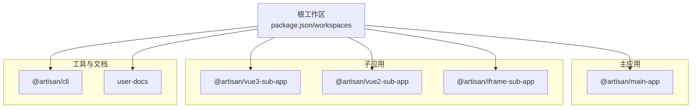
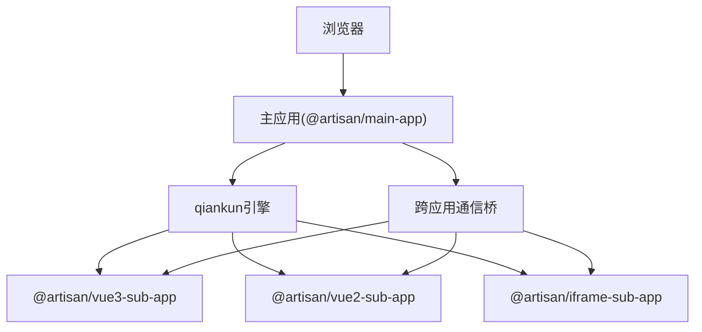
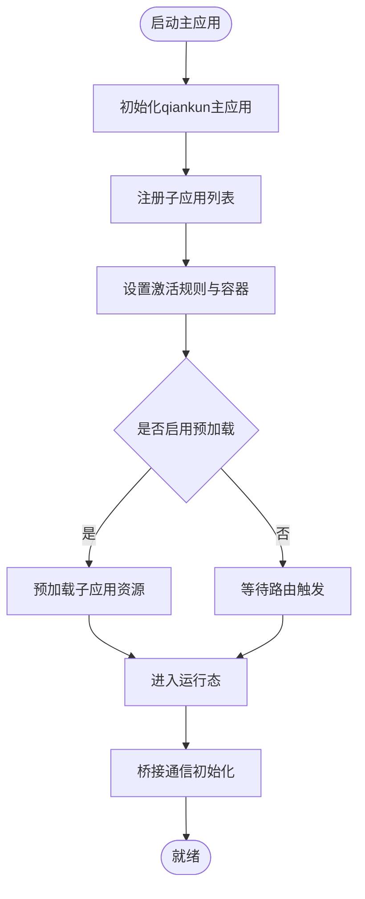
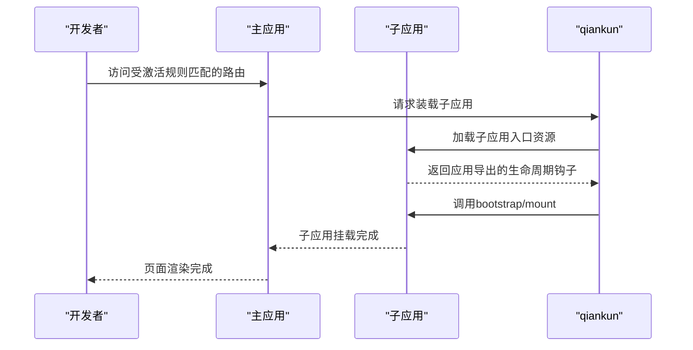
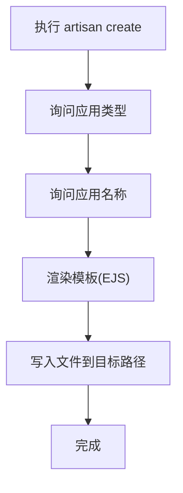
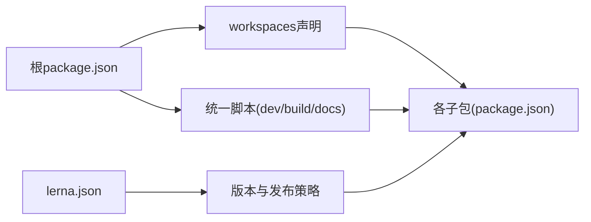

# 整体架构

<cite>
**本文引用的文件**
- [README.md](file://README.md)
- [lerna.json](file://lerna.json)
- [package.json](file://package.json)
- [packages/main-app/package.json](file://packages/main-app/package.json)
- [packages/vue3-sub-app/package.json](file://packages/vue3-sub-app/package.json)
- [packages/vue2-sub-app/package.json](file://packages/vue2-sub-app/package.json)
- [packages/iframe-sub-app/package.json](file://packages/iframe-sub-app/package.json)
- [packages/cli/package.json](file://packages/cli/package.json)
- [user-docs/package.json](file://user-docs/package.json)
</cite>

## 目录
1. [引言](#引言)
2. [项目结构](#项目结构)
3. [核心组件](#核心组件)
4. [架构总览](#架构总览)
5. [详细组件分析](#详细组件分析)
6. [依赖分析](#依赖分析)
7. [性能考虑](#性能考虑)
8. [故障排查指南](#故障排查指南)
9. [结论](#结论)
10. [附录](#附录)

## 引言
本文件面向Artisan微前端平台的整体架构文档，重点阐述以下内容：
- Monorepo架构优势与实现：结合Lerna与npm workspaces的配置策略与工作流
- 主应用与子应用的分层架构：qiankun微前端引擎在loadMicroApp模式下的集成方案
- 模块化组织结构、依赖关系与构建流程
- 系统边界图、组件层次图与数据流向图
- 架构决策的技术考量与扩展性设计原则

## 项目结构
Artisan采用Monorepo组织方式，以Lerna管理包版本与发布，以npm workspaces统一管理依赖与脚本。根目录通过workspaces声明各子包，同时在lerna.json中定义包扫描范围与发布策略。

- 根包管理
  - 根package.json定义了统一的开发脚本与工作区范围，便于并行启动与构建
  - lerna.json定义了包扫描路径、忽略变更、发布命令等策略
- 包分布
  - packages/main-app：主应用，承载路由、状态、布局编排与qiankun集成
  - packages/vue3-sub-app / packages/vue2-sub-app / packages/iframe-sub-app：三类子应用示例
  - packages/cli：脚手架CLI工具，用于快速生成各类子应用模板
  - user-docs：VitePress文档站点

**图表来源**
- [package.json](file://package.json#L6-L9)
- [lerna.json](file://lerna.json#L5-L8)

**章节来源**
- [README.md](file://README.md#L62-L76)
- [package.json](file://package.json#L6-L27)
- [lerna.json](file://lerna.json#L1-L25)

## 核心组件
- 主应用（@artisan/main-app）
  - 技术栈：Vue3 + vue-router + Pinia + Element Plus + axios + lodash-es
  - 关键职责：qiankun主应用注册、微应用生命周期编排、全局状态与持久化、布局系统、跨应用通信桥接
- 子应用（@artisan/vue3-sub-app / @artisan/vue2-sub-app / @artisan/iframe-sub-app）
  - Vue3子应用：基于Vite + vite-plugin-qiankun
  - Vue2子应用：基于Vue CLI（兼容旧项目）
  - Iframe子应用：独立运行的iframe示例
- CLI（@artisan/cli）
  - 提供artisan create命令族，按模板生成主应用或子应用骨架
- 文档（user-docs）
  - VitePress文档站点，提供部署、布局、桥接等指南

**章节来源**
- [packages/main-app/package.json](file://packages/main-app/package.json#L12-L22)
- [packages/vue3-sub-app/package.json](file://packages/vue3-sub-app/package.json#L12-L21)
- [packages/vue2-sub-app/package.json](file://packages/vue2-sub-app/package.json#L11-L24)
- [packages/iframe-sub-app/package.json](file://packages/iframe-sub-app/package.json#L6-L13)
- [packages/cli/package.json](file://packages/cli/package.json#L5-L19)
- [user-docs/package.json](file://user-docs/package.json#L6-L10)

## 架构总览
系统采用“主应用+多子应用”的分层架构，qiankun以loadMicroApp模式进行子应用装载与生命周期管理。主应用负责全局路由与状态、布局编排与跨应用通信；子应用各自独立开发与构建，通过统一的入口与激活规则接入主应用。

**图表来源**
- [README.md](file://README.md#L98-L120)
- [packages/main-app/package.json](file://packages/main-app/package.json#L17)
- [packages/vue3-sub-app/package.json](file://packages/vue3-sub-app/package.json#L20)

**章节来源**
- [README.md](file://README.md#L8-L15)
- [README.md](file://README.md#L98-L120)

## 详细组件分析

### 主应用（@artisan/main-app）
- 角色定位
  - 微前端主应用，承载全局状态（Pinia + 持久化）、路由编排、布局系统、qiankun主应用注册与子应用生命周期管理
- 关键能力
  - qiankun集成：注册子应用、设置激活规则、容器选择器、预加载策略
  - 布局系统：支持五种布局类型（默认、全屏、多标签页、嵌入式、空白）
  - 跨应用通信：通过bridge机制实现导航与事件传递
  - 依赖生态：Vue3、vue-router、Pinia、Element Plus、axios、lodash-es
- 开发与构建
  - Vite开发服务器，端口8080
  - 并行启动与构建由根脚本统一调度

**图表来源**
- [README.md](file://README.md#L98-L120)
- [packages/main-app/package.json](file://packages/main-app/package.json#L12-L22)

**章节来源**
- [packages/main-app/package.json](file://packages/main-app/package.json#L6-L22)

### 子应用（@artisan/vue3-sub-app / @artisan/vue2-sub-app / @artisan/iframe-sub-app）
- Vue3子应用
  - 技术栈：Vue3 + vue-router + vite + vite-plugin-qiankun
  - 独立开发与构建，端口7080
- Vue2子应用
  - 技术栈：Vue2 + vue-router + Vue CLI
  - 兼容历史项目，端口3000
- Iframe子应用
  - 独立开发与构建，端口4000
  - 可作为iframe沙箱隔离的外部系统接入示例

**图表来源**
- [README.md](file://README.md#L98-L120)
- [packages/vue3-sub-app/package.json](file://packages/vue3-sub-app/package.json#L20)
- [packages/vue2-sub-app/package.json](file://packages/vue2-sub-app/package.json#L11-L24)
- [packages/iframe-sub-app/package.json](file://packages/iframe-sub-app/package.json#L6-L13)

**章节来源**
- [packages/vue3-sub-app/package.json](file://packages/vue3-sub-app/package.json#L6-L21)
- [packages/vue2-sub-app/package.json](file://packages/vue2-sub-app/package.json#L6-L24)
- [packages/iframe-sub-app/package.json](file://packages/iframe-sub-app/package.json#L6-L13)

### CLI工具（@artisan/cli）
- 功能
  - artisan create命令族：创建主应用或子应用骨架
  - 交互式问答与模板渲染（EJS），输出到目标工作区
- 依赖
  - commander（命令解析）、inquirer（交互）、chalk/ora（终端美化）、fs-extra（文件操作）

**图表来源**
- [packages/cli/package.json](file://packages/cli/package.json#L5-L19)

**章节来源**
- [packages/cli/package.json](file://packages/cli/package.json#L1-L32)
- [README.md](file://README.md#L78-L96)

### 文档站点（user-docs）
- 技术栈：VitePress
- 作用：提供部署、布局系统、主应用与子应用指南、桥接通信等文档
- 开发与构建：通过根脚本统一调度

**章节来源**
- [user-docs/package.json](file://user-docs/package.json#L6-L10)
- [README.md](file://README.md#L143-L149)

## 依赖分析
- Monorepo管理
  - npm workspaces：统一管理依赖与脚本，避免重复安装，提升开发体验
  - Lerna：版本管理、变更检测、发布消息与分支策略
- 包间依赖
  - 主应用依赖qiankun，子应用通过插件或独立运行接入
  - CLI与各应用通过模板与脚本解耦
- 脚本与任务编排
  - 根脚本通过--workspace参数调用各包脚本，支持并行启动与构建

**图表来源**
- [package.json](file://package.json#L6-L27)
- [lerna.json](file://lerna.json#L1-L25)

**章节来源**
- [package.json](file://package.json#L6-L27)
- [lerna.json](file://lerna.json#L1-L25)

## 性能考虑
- 预加载策略
  - 在主应用中为常用子应用开启预加载，缩短首次激活时延
- 构建优化
  - 各子应用独立构建，减少无关包体积；主应用按需引入UI与工具库
- 运行时隔离
  - iframe子应用可提供更强的沙箱隔离，适合接入第三方系统
- 并行开发
  - 根脚本并行启动多应用，提升迭代效率

[本节为通用指导，无需列出具体文件来源]

## 故障排查指南
- 启动端口冲突
  - 主应用与子应用默认端口已规划，若冲突请调整各包的开发脚本端口
- 子应用未激活
  - 检查主应用中的激活规则与容器选择器配置
- qiankun生命周期异常
  - 确认子应用导出生命周期钩子，并检查入口资源可访问性
- 文档站点无法启动
  - 确保VitePress依赖已安装并通过根脚本启动

**章节来源**
- [README.md](file://README.md#L17-L25)
- [README.md](file://README.md#L98-L120)
- [user-docs/package.json](file://user-docs/package.json#L6-L10)

## 结论
Artisan微前端平台通过Monorepo与qiankun的组合，实现了主应用与多子应用的高内聚低耦合架构。Lerna与npm workspaces协同管理版本与依赖，CLI工具降低新应用接入成本，文档站点保障知识沉淀。该架构在扩展性、可维护性与团队协作方面具备良好基础，适合企业级微前端平台的长期演进。

[本节为总结性内容，无需列出具体文件来源]

## 附录
- 端口与应用映射
  - 主应用：8080
  - Vue3子应用：7080
  - Vue2子应用：3000
  - Iframe子应用：4000
- 常用命令
  - 启动全部：npm run dev:all
  - 构建全部：npm run build:all
  - 文档开发：npm run docs:dev

**章节来源**
- [README.md](file://README.md#L17-L54)