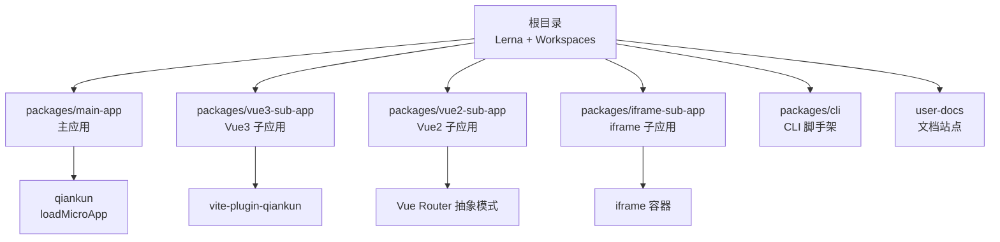
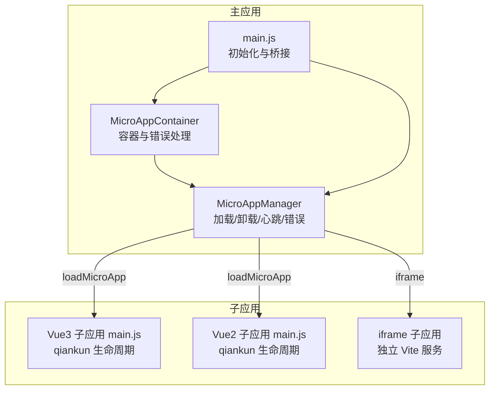
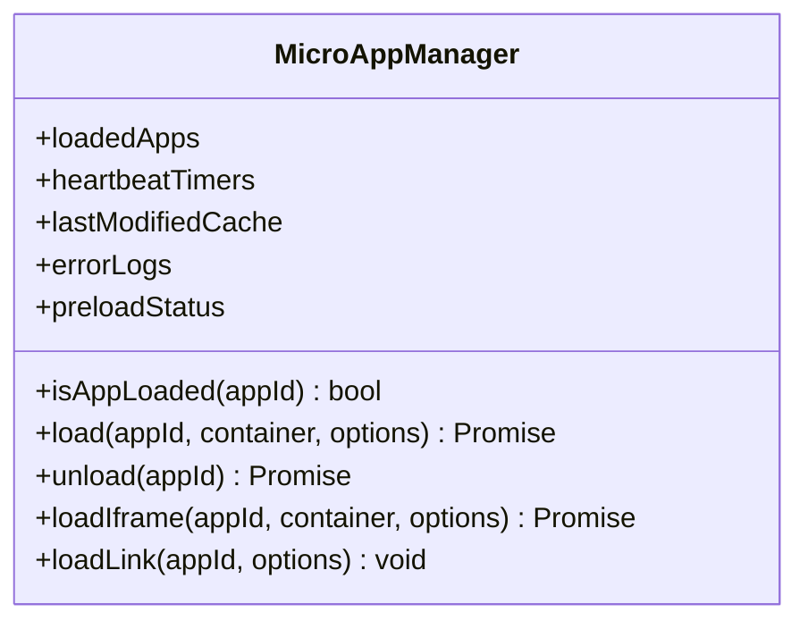
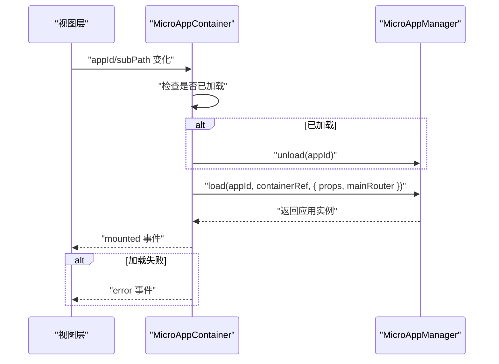
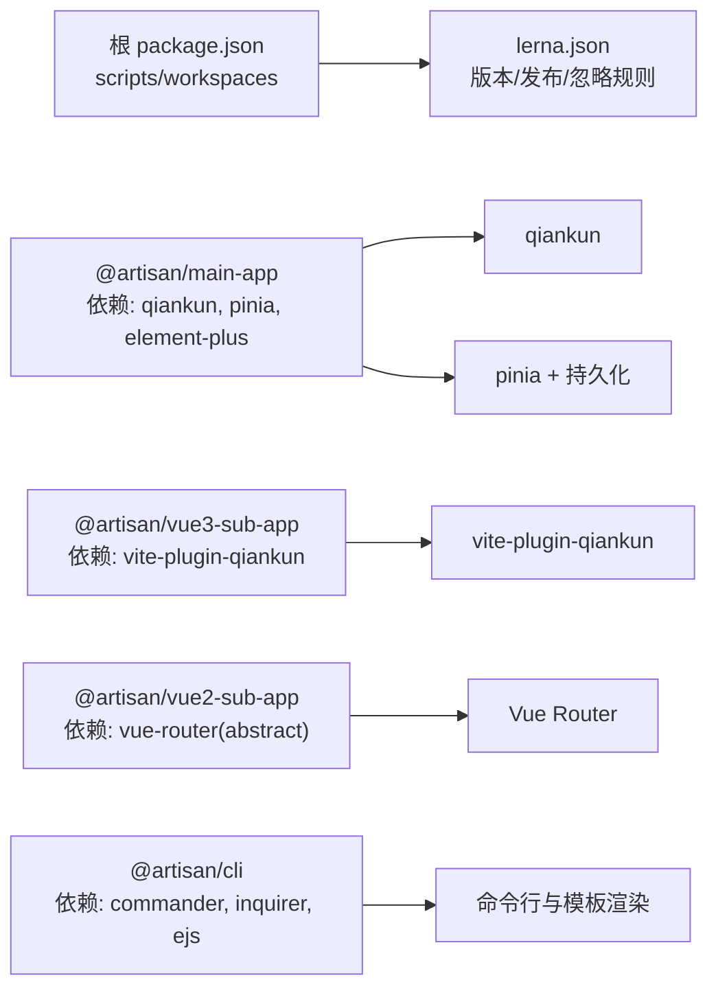

# 架构设计

<cite>
**本文引用的文件**
- [README.md](file://README.md)
- [lerna.json](file://lerna.json)
- [package.json](file://package.json)
- [packages/main-app/package.json](file://packages/main-app/package.json)
- [packages/main-app/vite.config.js](file://packages/main-app/vite.config.js)
- [packages/main-app/src/main.js](file://packages/main-app/src/main.js)
- [packages/main-app/src/core/microAppManager.js](file://packages/main-app/src/core/microAppManager.js)
- [packages/main-app/src/components/MicroAppContainer.vue](file://packages/main-app/src/components/MicroAppContainer.vue)
- [packages/vue3-sub-app/package.json](file://packages/vue3-sub-app/package.json)
- [packages/vue3-sub-app/vite.config.js](file://packages/vue3-sub-app/vite.config.js)
- [packages/vue3-sub-app/src/main.js](file://packages/vue3-sub-app/src/main.js)
- [packages/vue2-sub-app/package.json](file://packages/vue2-sub-app/package.json)
- [packages/vue2-sub-app/src/main.js](file://packages/vue2-sub-app/src/main.js)
- [packages/iframe-sub-app/package.json](file://packages/iframe-sub-app/package.json)
- [packages/cli/package.json](file://packages/cli/package.json)
</cite>

## 目录
1. [简介](#简介)
2. [项目结构](#项目结构)
3. [核心组件](#核心组件)
4. [架构总览](#架构总览)
5. [详细组件分析](#详细组件分析)
6. [依赖分析](#依赖分析)
7. [性能考量](#性能考量)
8. [故障排查指南](#故障排查指南)
9. [结论](#结论)
10. [附录](#附录)

## 简介
Artisan 微前端平台是一个企业级的 Monorepo 脚手架，采用 Lerna + npm workspaces 管理多包结构，主应用基于 Vue3 + Vite + qiankun（loadMicroApp 模式），支持多种类型的子应用（Vue3/Vue2/iframe/link）。平台提供完整的跨应用通信桥（bridge）、布局编排系统、状态持久化（Pinia + 持久化插件）、iframe 跨域治理与安全策略，并支持同屏多应用实例加载。

## 项目结构
仓库采用 Monorepo 架构，根目录通过 Lerna 和 npm workspaces 统一管理各子包。核心目录与职责如下：
- packages/main-app：主应用，负责微应用编排、状态管理、跨应用通信桥初始化、容器组件与 qiankun 集成
- packages/vue3-sub-app：Vue3 子应用示例，使用 vite-plugin-qiankun 提供生命周期与沙箱隔离
- packages/vue2-sub-app：Vue2 子应用示例，兼容 qiankun 生命周期与路由抽象模式
- packages/iframe-sub-app：iframe 子应用示例，演示 iframe 类型微应用的接入与治理
- packages/cli：脚手架 CLI，用于快速生成主应用与各类子应用模板
- user-docs：VitePress 文档站点

**图表来源**
- [lerna.json](file://lerna.json#L1-L25)
- [package.json](file://package.json#L6-L9)
- [packages/main-app/package.json](file://packages/main-app/package.json#L12-L22)
- [packages/vue3-sub-app/package.json](file://packages/vue3-sub-app/package.json#L12-L21)
- [packages/vue2-sub-app/package.json](file://packages/vue2-sub-app/package.json#L11-L16)
- [packages/iframe-sub-app/package.json](file://packages/iframe-sub-app/package.json#L1-L15)

**章节来源**
- [README.md](file://README.md#L62-L76)
- [lerna.json](file://lerna.json#L1-L25)
- [package.json](file://package.json#L6-L27)

## 核心组件
- 微应用管理器（MicroAppManager）：封装 qiankun 的 loadMicroApp，统一管理应用生命周期、预加载、心跳检测、错误日志与样式快照等
- 微应用容器组件（MicroAppContainer）：提供加载遮罩、错误展示、重试机制与容器生命周期绑定
- 主应用入口（main.js）：初始化 Pinia/Pinia持久化、Element Plus、路由与桥接（bridge）；暴露微应用管理器便于调试
- Vue3 子应用入口（main.js）：通过 vite-plugin-qiankun 注册生命周期；qiankun 模式下使用 memory history 并避免直接 unmount
- Vue2 子应用入口（main.js）：兼容 qiankun 生命周期；qiankun 模式下使用 abstract 路由模式
- CLI 工具：提供创建主应用与子应用的命令行能力

**章节来源**
- [packages/main-app/src/core/microAppManager.js](file://packages/main-app/src/core/microAppManager.js#L1-L123)
- [packages/main-app/src/components/MicroAppContainer.vue](file://packages/main-app/src/components/MicroAppContainer.vue#L1-L105)
- [packages/main-app/src/main.js](file://packages/main-app/src/main.js#L1-L40)
- [packages/vue3-sub-app/src/main.js](file://packages/vue3-sub-app/src/main.js#L1-L123)
- [packages/vue2-sub-app/src/main.js](file://packages/vue2-sub-app/src/main.js#L1-L121)
- [packages/cli/package.json](file://packages/cli/package.json#L1-L32)

## 架构总览
整体架构围绕“主应用 + 多子应用”的微前端模式展开，主应用通过 qiankun 的 loadMicroApp 动态加载子应用，子应用在独立运行或被主应用装载时分别采用不同的路由模式与资源加载策略。跨应用通信通过桥接（bridge）实现，状态管理采用 Pinia 并结合持久化插件。

**图表来源**
- [packages/main-app/src/main.js](file://packages/main-app/src/main.js#L10-L37)
- [packages/main-app/src/core/microAppManager.js](file://packages/main-app/src/core/microAppManager.js#L49-L123)
- [packages/main-app/src/components/MicroAppContainer.vue](file://packages/main-app/src/components/MicroAppContainer.vue#L51-L83)
- [packages/vue3-sub-app/src/main.js](file://packages/vue3-sub-app/src/main.js#L79-L113)
- [packages/vue2-sub-app/src/main.js](file://packages/vue2-sub-app/src/main.js#L82-L113)
- [packages/iframe-sub-app/package.json](file://packages/iframe-sub-app/package.json#L1-L15)

## 详细组件分析

### 微应用管理器（MicroAppManager）
- 职责
  - 统一加载/卸载微应用，支持 Vue3/Vue2/iframe/link 类型
  - 预加载策略与状态缓存（preloaded、lastModified）
  - 心跳检测与错误日志记录
  - 样式快照与沙箱隔离（experimentalStyleIsolation）
  - 令牌透传与主应用路由注入
- 关键流程
  - load(appId, container, options)：校验配置与状态，区分 iframe/link 与 qiankun 加载路径，设置 sandbox 与 props
  - unload(appId)：清理内存引用与容器内容
  - isAppLoaded(appId)：防重复加载
  - loadIframe/loadLink：iframe 直接注入容器；link 打开新窗口
- 性能与稳定性
  - 使用 markRaw 降低响应式开销
  - 通过容器元素而非选择器字符串传入，避免 DOM 变更导致的定位失效
  - 对样式进行快照与隔离，减少全局污染

**图表来源**
- [packages/main-app/src/core/microAppManager.js](file://packages/main-app/src/core/microAppManager.js#L11-L31)

**章节来源**
- [packages/main-app/src/core/microAppManager.js](file://packages/main-app/src/core/microAppManager.js#L1-L123)

### 微应用容器组件（MicroAppContainer）
- 职责
  - 提供加载遮罩与错误展示
  - 监听 appId 变化并自动卸载/加载
  - 将主应用路由与 props 注入微应用
- 关键流程
  - onMounted 触发加载
  - watch 监听 appId 变化，必要时先卸载再加载
  - 发射 mounted/unmounted/error 事件供上层处理

**图表来源**
- [packages/main-app/src/components/MicroAppContainer.vue](file://packages/main-app/src/components/MicroAppContainer.vue#L51-L83)
- [packages/main-app/src/core/microAppManager.js](file://packages/main-app/src/core/microAppManager.js#L49-L123)

**章节来源**
- [packages/main-app/src/components/MicroAppContainer.vue](file://packages/main-app/src/components/MicroAppContainer.vue#L1-L105)

### 主应用入口（main.js）
- 初始化顺序
  - 创建应用实例与 Pinia（启用持久化插件）
  - 安装 Element Plus 与图标组件
  - 初始化桥接（bridge）与微应用管理器
  - 暴露管理器至全局以便调试
- 与微应用的关系
  - 通过 props 将 token、主应用路由、bridge、appId 传递给子应用
  - 作为统一的状态中心与通信枢纽

**章节来源**
- [packages/main-app/src/main.js](file://packages/main-app/src/main.js#L1-L40)

### Vue3 子应用入口（main.js）
- 生命周期
  - 使用 vite-plugin-qiankun 的 renderWithQiankun 注册 bootstrap/mount/unmount/update
  - qiankun 模式下使用 memory history，独立运行使用 web history
- 安全与稳定性
  - 避免在 unmount 中直接调用 app.unmount，改为停止响应式作用域并清理引用
  - 独立运行时按需加载 Element Plus 样式，避免与主应用冲突

**章节来源**
- [packages/vue3-sub-app/src/main.js](file://packages/vue3-sub-app/src/main.js#L1-L123)

### Vue2 子应用入口（main.js）
- 生命周期
  - 显式导出 bootstrap/mount/unmount/update
  - qiankun 模式下使用 abstract 路由模式，独立运行使用 history
- 安全与稳定性
  - 在 unmount 中销毁实例并清理容器内容
  - 通过 data 注入 mainProps 与 isQiankunMode

**章节来源**
- [packages/vue2-sub-app/src/main.js](file://packages/vue2-sub-app/src/main.js#L1-L121)

### iframe 子应用
- 特点
  - 独立 Vite 服务端口，通过 MicroAppManager 的 iframe 分支加载
  - 支持跨域治理与安全策略（详见文档）

**章节来源**
- [packages/iframe-sub-app/package.json](file://packages/iframe-sub-app/package.json#L1-L15)

### CLI 工具
- 能力
  - 创建主应用与多种类型子应用的脚手架命令
  - 基于模板生成与交互式问答
- 依赖
  - commander（命令定义）、inquirer（交互）、fs-extra/ejs（模板渲染）

**章节来源**
- [packages/cli/package.json](file://packages/cli/package.json#L1-L32)

## 依赖分析
- 包管理与发布
  - Lerna 管理版本与发布流程，忽略变更范围包括文档与测试
  - npm workspaces 统一管理工作区，根 scripts 提供一键启动/构建/发布
- 主应用依赖
  - qiankun：微前端引擎与 loadMicroApp
  - Pinia + 持久化：状态管理与持久化
  - Element Plus：UI 组件库
- Vue3 子应用依赖
  - vite-plugin-qiankun：提供 qiankun 生命周期与沙箱
- Vue2 子应用依赖
  - Vue Router（abstract 模式）：qiankun 下的路由适配
- CLI 依赖
  - chalk/commander/inquirer/fs-extra/ora/ejs：命令行与模板渲染

**图表来源**
- [package.json](file://package.json#L6-L27)
- [lerna.json](file://lerna.json#L1-L25)
- [packages/main-app/package.json](file://packages/main-app/package.json#L12-L22)
- [packages/vue3-sub-app/package.json](file://packages/vue3-sub-app/package.json#L12-L21)
- [packages/vue2-sub-app/package.json](file://packages/vue2-sub-app/package.json#L11-L16)
- [packages/cli/package.json](file://packages/cli/package.json#L12-L19)

**章节来源**
- [package.json](file://package.json#L6-L27)
- [lerna.json](file://lerna.json#L1-L25)
- [packages/main-app/package.json](file://packages/main-app/package.json#L12-L22)
- [packages/vue3-sub-app/package.json](file://packages/vue3-sub-app/package.json#L12-L21)
- [packages/vue2-sub-app/package.json](file://packages/vue2-sub-app/package.json#L11-L16)
- [packages/cli/package.json](file://packages/cli/package.json#L12-L19)

## 性能考量
- 代码分割与打包优化
  - 主应用构建配置中对 element-plus 与 vue 生态进行 manualChunks，减少重复依赖
  - 子应用构建指定输入 HTML，避免多余入口
- 运行时性能
  - 微应用管理器使用 markRaw 降低响应式开销
  - 子应用在 qiankun 模式下使用 memory/history 抽象，避免全局路由污染
- 资源隔离
  - 开启沙箱实验性样式隔离，配合样式快照，降低全局样式污染风险

**章节来源**
- [packages/main-app/vite.config.js](file://packages/main-app/vite.config.js#L26-L38)
- [packages/vue3-sub-app/vite.config.js](file://packages/vue3-sub-app/vite.config.js#L33-L39)
- [packages/main-app/src/core/microAppManager.js](file://packages/main-app/src/core/microAppManager.js#L116-L123)

## 故障排查指南
- 加载失败
  - 检查容器是否存在与可访问
  - 查看错误事件与 errorLogs，确认网络/入口/状态
- 重复加载
  - 确认 isAppLoaded 判定逻辑，避免同一 appId 多次加载
- 卸载异常
  - Vue3：不要直接调用 app.unmount，改用停止响应式作用域与清理引用
  - Vue2：确保 $destroy 正常执行并清理容器内容
- 路由不生效
  - qiankun 模式下需传入 subPath 并在 mount 后手动 push 初始路由
- 跨域与样式污染
  - 开启沙箱隔离与样式快照；iframe 场景遵循跨域治理策略

**章节来源**
- [packages/main-app/src/components/MicroAppContainer.vue](file://packages/main-app/src/components/MicroAppContainer.vue#L77-L82)
- [packages/main-app/src/core/microAppManager.js](file://packages/main-app/src/core/microAppManager.js#L49-L123)
- [packages/vue3-sub-app/src/main.js](file://packages/vue3-sub-app/src/main.js#L87-L113)
- [packages/vue2-sub-app/src/main.js](file://packages/vue2-sub-app/src/main.js#L97-L113)

## 结论
该架构以 Monorepo 为基础，通过 Lerna 与 npm workspaces 实现多包协同开发与发布；主应用采用 qiankun 的 loadMicroApp 模式，统一管理多类型子应用，兼顾性能与稳定性。微应用容器与管理器提供了完善的生命周期控制、错误处理与资源隔离能力；跨应用通信桥与 Pinia 持久化为状态共享与通信提供了坚实基础。整体设计具备良好的扩展性与可维护性，适合企业级微前端平台的长期演进。

## 附录
- 端口与启动
  - 主应用：8080
  - Vue3 子应用：7080
  - Vue2 子应用：3000
  - iframe 子应用：4000
- CLI 使用
  - 全局链接后可通过 artisan create 命令创建主应用与子应用

**章节来源**
- [README.md](file://README.md#L17-L54)
- [README.md](file://README.md#L78-L96)