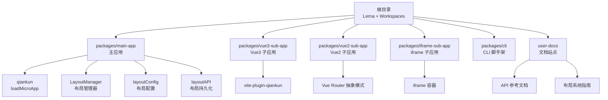
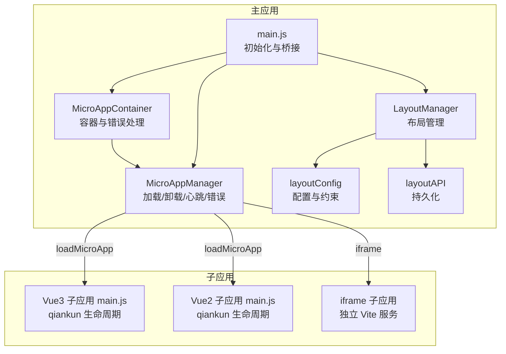
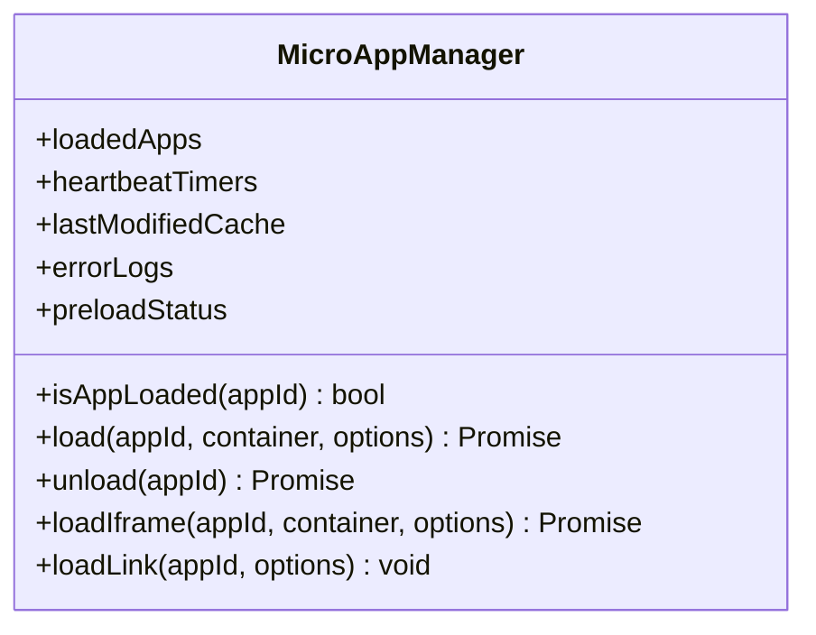
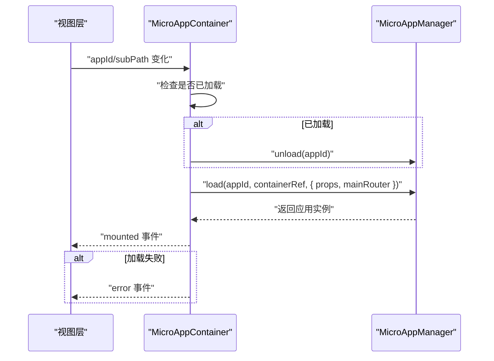
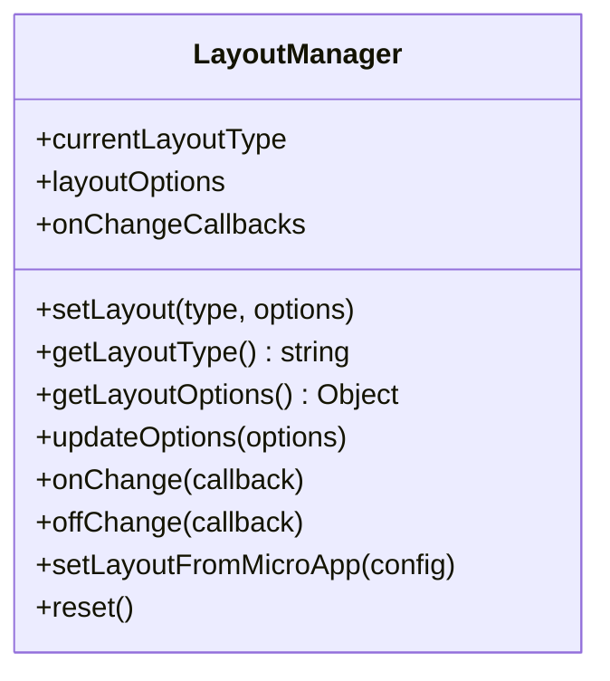
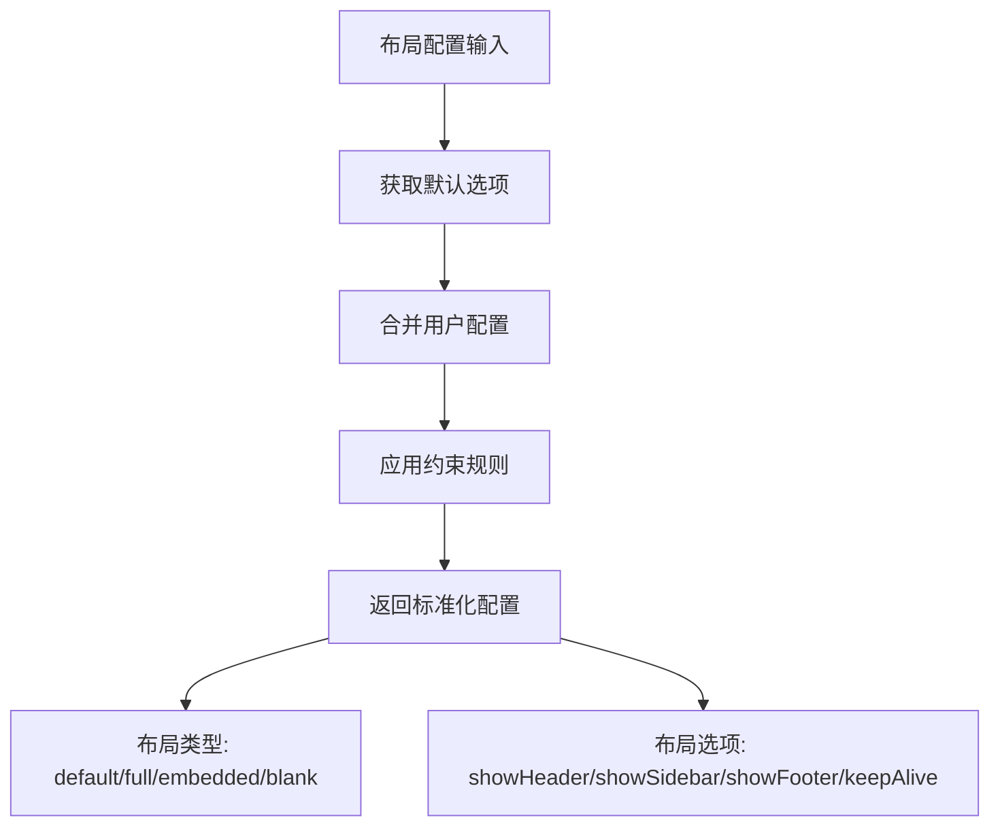
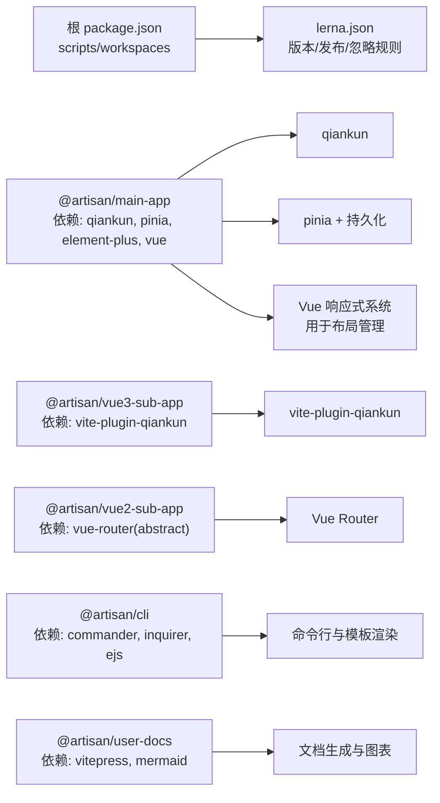

# 架构设计

<cite>
**本文引用的文件**
- [README.md](file://README.md)
- [lerna.json](file://lerna.json)
- [package.json](file://package.json)
- [packages/main-app/package.json](file://packages/main-app/package.json)
- [packages/main-app/vite.config.js](file://packages/main-app/vite.config.js)
- [packages/main-app/src/main.js](file://packages/main-app/src/main.js)
- [packages/main-app/src/core/microAppManager.js](file://packages/main-app/src/core/microAppManager.js)
- [packages/main-app/src/components/MicroAppContainer.vue](file://packages/main-app/src/components/MicroAppContainer.vue)
- [packages/main-app/src/core/layoutManager.js](file://packages/main-app/src/core/layoutManager.js)
- [packages/main-app/src/config/layoutConfig.js](file://packages/main-app/src/config/layoutConfig.js)
- [packages/main-app/src/api/layout.js](file://packages/main-app/src/api/layout.js)
- [packages/main-app/src/config/microApps.js](file://packages/main-app/src/config/microApps.js)
- [packages/main-app/src/core/bridge.js](file://packages/main-app/src/core/bridge.js)
- [packages/vue3-sub-app/package.json](file://packages/vue3-sub-app/package.json)
- [packages/vue3-sub-app/vite.config.js](file://packages/vue3-sub-app/vite.config.js)
- [packages/vue3-sub-app/src/main.js](file://packages/vue3-sub-app/src/main.js)
- [packages/vue2-sub-app/package.json](file://packages/vue2-sub-app/package.json)
- [packages/vue2-sub-app/src/main.js](file://packages/vue2-sub-app/src/main.js)
- [packages/iframe-sub-app/package.json](file://packages/iframe-sub-app/package.json)
- [packages/cli/package.json](file://packages/cli/package.json)
- [user-docs/api/README.md](file://user-docs/api/README.md)
- [user-docs/guide/layout-system.md](file://user-docs/guide/layout-system.md)
- [user-docs/guide/layout-system-complete-guide.md](file://user-docs/guide/layout-system-complete-guide.md)
</cite>

## 更新摘要
**变更内容**
- 新增布局系统架构分析（LayoutManager、layoutConfig、布局API）
- 整合API参考文档体系（MicroAppManager、Bridge、LayoutManager、配置API）
- 更新架构总览图，包含布局管理器
- 新增布局约束与配置标准化机制
- 扩展跨应用通信与布局管理的集成分析

## 目录
1. [简介](#简介)
2. [项目结构](#项目结构)
3. [核心组件](#核心组件)
4. [架构总览](#架构总览)
5. [详细组件分析](#详细组件分析)
6. [布局系统架构](#布局系统架构)
7. [API参考体系](#api参考体系)
8. [依赖分析](#依赖分析)
9. [性能考量](#性能考量)
10. [故障排查指南](#故障排查指南)
11. [结论](#结论)
12. [附录](#附录)

## 简介
Artisan 微前端平台是一个企业级的 Monorepo 脚手架，采用 Lerna + npm workspaces 管理多包结构，主应用基于 Vue3 + Vite + qiankun（loadMicroApp 模式），支持多种类型的子应用（Vue3/Vue2/iframe/link）。平台提供完整的跨应用通信桥（bridge）、**新增布局编排系统**、状态持久化（Pinia + 持久化插件）、iframe 跨域治理与安全策略，并支持同屏多应用实例加载。

**更新** 新增了完整的布局管理系统，支持四种布局类型（default、full、embedded、blank）和智能约束机制，提供灵活的页面布局控制能力。

## 项目结构
仓库采用 Monorepo 架构，根目录通过 Lerna 和 npm workspaces 统一管理各子包。核心目录与职责如下：
- packages/main-app：主应用，负责微应用编排、状态管理、跨应用通信桥初始化、容器组件与 qiankun 集成、**新增布局管理器**
- packages/vue3-sub-app：Vue3 子应用示例，使用 vite-plugin-qiankun 提供生命周期与沙箱隔离
- packages/vue2-sub-app：Vue2 子应用示例，兼容 qiankun 生命周期与路由抽象模式
- packages/iframe-sub-app：iframe 子应用示例，演示 iframe 类型微应用的接入与治理
- packages/cli：脚手架 CLI，用于快速生成主应用与各类子应用模板
- user-docs：**新增VitePress文档站点**，包含API参考和布局系统指南

```mermaid
graph TB
Root["根目录<br/>Lerna + Workspaces"] --> PkgMain["packages/main-app<br/>主应用"]
Root --> PkgVue3["packages/vue3-sub-app<br/>Vue3 子应用"]
Root --> PkgVue2["packages/vue2-sub-app<br/>Vue2 子应用"]
Root --> PkgIframe["packages/iframe-sub-app<br/>iframe 子应用"]
Root --> PkgCLI["packages/cli<br/>CLI 脚手架"]
Root --> Docs["user-docs<br/>文档站点"]
PkgMain --> Qiankun["qiankun<br/>loadMicroApp"]
PkgMain --> LayoutMgr["LayoutManager<br/>布局管理器"]
PkgMain --> LayoutConfig["layoutConfig<br/>布局配置"]
PkgMain --> LayoutAPI["layoutAPI<br/>布局持久化"]
PkgVue3 --> VitePlugin["vite-plugin-qiankun"]
PkgVue2 --> VueRouter["Vue Router 抽象模式"]
PkgIframe --> Iframe["iframe 容器"]
Docs --> APIDocs["API 参考文档"]
Docs --> LayoutGuide["布局系统指南"]
```

**图表来源**
- [lerna.json:1-25](file://lerna.json#L1-L25)
- [package.json:6-9](file://package.json#L6-L9)
- [packages/main-app/package.json:12-22](file://packages/main-app/package.json#L12-L22)
- [packages/main-app/src/core/layoutManager.js:17-32](file://packages/main-app/src/core/layoutManager.js#L17-L32)
- [packages/main-app/src/config/layoutConfig.js:26-87](file://packages/main-app/src/config/layoutConfig.js#L26-L87)
- [packages/main-app/src/api/layout.js:1-20](file://packages/main-app/src/api/layout.js#L1-L20)

**章节来源**
- [README.md:62-76](file://README.md#L62-L76)
- [lerna.json:1-25](file://lerna.json#L1-L25)
- [package.json:6-27](file://package.json#L6-L27)

## 核心组件
- 微应用管理器（MicroAppManager）：封装 qiankun 的 loadMicroApp，统一管理应用生命周期、预加载、心跳检测、错误日志与样式快照等
- **新增布局管理器（LayoutManager）**：提供四种布局类型管理、布局选项配置、约束验证和变化监听
- 微应用容器组件（MicroAppContainer）：提供加载遮罩、错误展示、重试机制与容器生命周期绑定
- 主应用入口（main.js）：初始化 Pinia/Pinia持久化、Element Plus、路由与桥接（bridge）；暴露微应用管理器便于调试
- Vue3 子应用入口（main.js）：通过 vite-plugin-qiankun 注册生命周期；qiankun 模式下使用 memory history 并避免直接 unmount
- Vue2 子应用入口（main.js）：兼容 qiankun 生命周期；qiankun 模式下使用 abstract 路由模式
- **新增布局配置模块（layoutConfig）**：定义布局类型约束、默认选项和配置标准化机制
- **新增布局API模块（layoutAPI）**：支持mock和API两种模式的布局数据持久化
- CLI 工具：提供创建主应用与子应用的命令行能力

**章节来源**
- [packages/main-app/src/core/microAppManager.js:1-123](file://packages/main-app/src/core/microAppManager.js#L1-L123)
- [packages/main-app/src/core/layoutManager.js:1-142](file://packages/main-app/src/core/layoutManager.js#L1-L142)
- [packages/main-app/src/components/MicroAppContainer.vue:1-105](file://packages/main-app/src/components/MicroAppContainer.vue#L1-L105)
- [packages/main-app/src/main.js:1-40](file://packages/main-app/src/main.js#L1-L40)
- [packages/main-app/src/config/layoutConfig.js:1-205](file://packages/main-app/src/config/layoutConfig.js#L1-L205)
- [packages/main-app/src/api/layout.js:1-156](file://packages/main-app/src/api/layout.js#L1-L156)
- [packages/vue3-sub-app/src/main.js:1-123](file://packages/vue3-sub-app/src/main.js#L1-L123)
- [packages/vue2-sub-app/src/main.js:1-121](file://packages/vue2-sub-app/src/main.js#L1-L121)
- [packages/cli/package.json:1-32](file://packages/cli/package.json#L1-L32)

## 架构总览
整体架构围绕"主应用 + 多子应用"的微前端模式展开，主应用通过 qiankun 的 loadMicroApp 动态加载子应用，子应用在独立运行或被主应用装载时分别采用不同的路由模式与资源加载策略。跨应用通信通过桥接（bridge）实现，状态管理采用 Pinia 并结合持久化插件。**新增的布局系统提供灵活的页面布局控制能力**。

```mermaid
graph TB
subgraph "主应用"
MA_Main["main.js<br/>初始化与桥接"]
MA_Manager["MicroAppManager<br/>加载/卸载/心跳/错误"]
MA_Container["MicroAppContainer<br/>容器与错误处理"]
MA_LayoutMgr["LayoutManager<br/>布局管理"]
MA_LayoutConfig["layoutConfig<br/>配置与约束"]
MA_LayoutAPI["layoutAPI<br/>持久化"]
end
subgraph "子应用"
V3_Main["Vue3 子应用 main.js<br/>qiankun 生命周期"]
V2_Main["Vue2 子应用 main.js<br/>qiankun 生命周期"]
Iframe_App["iframe 子应用<br/>独立 Vite 服务"]
end
MA_Manager --> |loadMicroApp| V3_Main
MA_Manager --> |loadMicroApp| V2_Main
MA_Manager --> |iframe| Iframe_App
MA_Container --> MA_Manager
MA_Main --> MA_Manager
MA_Main --> MA_Container
MA_Main --> MA_LayoutMgr
MA_LayoutMgr --> MA_LayoutConfig
MA_LayoutMgr --> MA_LayoutAPI
```

**图表来源**
- [packages/main-app/src/main.js:10-37](file://packages/main-app/src/main.js#L10-L37)
- [packages/main-app/src/core/microAppManager.js:49-123](file://packages/main-app/src/core/microAppManager.js#L49-L123)
- [packages/main-app/src/components/MicroAppContainer.vue:51-83](file://packages/main-app/src/components/MicroAppContainer.vue#L51-L83)
- [packages/main-app/src/core/layoutManager.js:17-32](file://packages/main-app/src/core/layoutManager.js#L17-L32)
- [packages/main-app/src/config/layoutConfig.js:26-87](file://packages/main-app/src/config/layoutConfig.js#L26-L87)
- [packages/main-app/src/api/layout.js:14-19](file://packages/main-app/src/api/layout.js#L14-L19)

## 详细组件分析

### 微应用管理器（MicroAppManager）
- 职责
  - 统一加载/卸载微应用，支持 Vue3/Vue2/iframe/link 类型
  - 预加载策略与状态缓存（preloaded、lastModified）
  - 心跳检测与错误日志记录
  - 样式快照与沙箱隔离（experimentalStyleIsolation）
  - 令牌透传与主应用路由注入
- 关键流程
  - load(appId, container, options)：校验配置与状态，区分 iframe/link 与 qiankun 加载路径，设置 sandbox 与 props
  - unload(appId)：清理内存引用与容器内容
  - isAppLoaded(appId)：防重复加载
  - loadIframe/loadLink：iframe 直接注入容器；link 打开新窗口
- 性能与稳定性
  - 使用 markRaw 降低响应式开销
  - 通过容器元素而非选择器字符串传入，避免 DOM 变更导致的定位失效
  - 对样式进行快照与隔离，减少全局污染

```mermaid
classDiagram
class MicroAppManager {
+loadedApps
+heartbeatTimers
+lastModifiedCache
+errorLogs
+preloadStatus
+isAppLoaded(appId) bool
+load(appId, container, options) Promise
+unload(appId) Promise
+loadIframe(appId, container, options) Promise
+loadLink(appId, options) void
}
```

**图表来源**
- [packages/main-app/src/core/microAppManager.js:11-31](file://packages/main-app/src/core/microAppManager.js#L11-L31)

**章节来源**
- [packages/main-app/src/core/microAppManager.js:1-123](file://packages/main-app/src/core/microAppManager.js#L1-L123)

### 微应用容器组件（MicroAppContainer）
- 职责
  - 提供加载遮罩与错误展示
  - 监听 appId 变化并自动卸载/加载
  - 将主应用路由与 props 注入微应用
- 关键流程
  - onMounted 触发加载
  - watch 监听 appId 变化，必要时先卸载再加载
  - 发射 mounted/unmounted/error 事件供上层处理

```mermaid
sequenceDiagram
participant View as "视图层"
participant Container as "MicroAppContainer"
participant Manager as "MicroAppManager"
View->>Container : "appId/subPath 变化"
Container->>Container : "检查是否已加载"
alt 已加载
Container->>Manager : "unload(appId)"
end
Container->>Manager : "load(appId, containerRef, { props, mainRouter })"
Manager-->>Container : "返回应用实例"
Container-->>View : "mounted 事件"
alt 加载失败
Container-->>View : "error 事件"
end
```

**图表来源**
- [packages/main-app/src/components/MicroAppContainer.vue:51-83](file://packages/main-app/src/components/MicroAppContainer.vue#L51-L83)
- [packages/main-app/src/core/microAppManager.js:49-123](file://packages/main-app/src/core/microAppManager.js#L49-L123)

**章节来源**
- [packages/main-app/src/components/MicroAppContainer.vue:1-105](file://packages/main-app/src/components/MicroAppContainer.vue#L1-L105)

### 主应用入口（main.js）
- 初始化顺序
  - 创建应用实例与 Pinia（启用持久化插件）
  - 安装 Element Plus 与图标组件
  - 初始化桥接（bridge）与微应用管理器
  - **新增** 初始化布局管理器
  - 暴露管理器至全局以便调试
- 与微应用的关系
  - 通过 props 将 token、主应用路由、bridge、appId 传递给子应用
  - 作为统一的状态中心与通信枢纽

**章节来源**
- [packages/main-app/src/main.js:1-40](file://packages/main-app/src/main.js#L1-L40)

## 布局系统架构

### 布局管理器（LayoutManager）
- 职责
  - 管理四种布局类型（default、full、embedded、blank）
  - 维护布局选项（showHeader、showSidebar、showFooter、keepAlive）
  - 提供布局切换、选项更新和变化监听
  - 与微应用配置集成，支持从微应用配置自动设置布局
- 关键特性
  - 响应式布局状态管理
  - 布局变化回调机制
  - 默认布局重置功能
  - 与微应用配置的无缝集成

```mermaid
classDiagram
class LayoutManager {
+currentLayoutType
+layoutOptions
+onChangeCallbacks
+setLayout(type, options)
+getLayoutType() string
+getLayoutOptions() Object
+updateOptions(options)
+onChange(callback)
+offChange(callback)
+setLayoutFromMicroApp(config)
+reset()
}
```

**图表来源**
- [packages/main-app/src/core/layoutManager.js:17-136](file://packages/main-app/src/core/layoutManager.js#L17-L136)

### 布局配置管理（layoutConfig）
- 职责
  - 定义四种布局类型的默认选项和约束规则
  - 提供布局配置的标准化、验证和建议功能
  - 支持布局兼容性检查和约束应用
- 核心功能
  - **布局类型配置映射**：定义每种布局类型的默认选项和约束
  - **约束应用机制**：自动覆盖与约束冲突的配置选项
  - **配置验证**：检查布局配置的有效性和兼容性
  - **配置标准化**：合并默认值、应用约束并返回标准化配置

```mermaid
flowchart TD
A[布局配置输入] --> B[获取默认选项]
B --> C[合并用户配置]
C --> D[应用约束规则]
D --> E[返回标准化配置]
E --> F[布局类型: default/full/embedded/blank]
E --> G[布局选项: showHeader/showSidebar/showFooter/keepAlive]
```

**图表来源**
- [packages/main-app/src/config/layoutConfig.js:184-193](file://packages/main-app/src/config/layoutConfig.js#L184-L193)

### 布局API持久化（layoutAPI）
- 职责
  - 支持两种数据持久化模式：mock（localStorage）和API（后端接口）
  - 提供布局数据的保存、加载和清除功能
  - 实现API模式下的降级机制，确保数据可靠性
- 模式切换
  - **Mock模式**：开发和演示环境使用localStorage存储
  - **API模式**：生产环境使用后端API存储，支持降级回退
- 容错机制
  - API调用失败时自动降级到localStorage
  - 网络错误时从localStorage恢复数据
  - 双重存储保证数据持久化

**章节来源**
- [packages/main-app/src/core/layoutManager.js:1-142](file://packages/main-app/src/core/layoutManager.js#L1-L142)
- [packages/main-app/src/config/layoutConfig.js:1-205](file://packages/main-app/src/config/layoutConfig.js#L1-L205)
- [packages/main-app/src/api/layout.js:1-156](file://packages/main-app/src/api/layout.js#L1-L156)

## API参考体系

### MicroAppManager API
- **导入方式**：`import { microAppManager } from '@/core/microAppManager'`
- **核心方法**
  - `load(appId, container, options)`：加载微应用
  - `unload(appId)`：卸载微应用
  - `reload(appId)`：刷新微应用
  - `preload(appIds)`：预加载微应用资源
- **状态管理**
  - `setAppStatus(appId, status)`：设置应用状态
  - `isAppLoaded(appId)`：检查应用是否已加载
  - `getLoadedCount()`：获取已加载应用数量
- **错误管理**
  - `getErrorLogs(appId?)`：获取错误日志
  - `clearErrorLogs()`：清空错误日志
- **属性**
  - `loadedApps`：已加载应用信息
  - `errorLogs`：错误日志数组
  - `preloadStatus`：预加载状态映射

### Bridge API
- **导入方式**：`import { bridge } from '@/core/bridge'`
- **消息处理**
  - `on(type, handler)`：注册消息处理器
  - `off(type)`：移除消息处理器
  - `send(targetWindow, message, targetOrigin?)`：发送消息到指定窗口
  - `broadcast(message)`：广播消息给所有子应用
- **Token管理**
  - `syncToken(token)`：同步token到所有子应用
- **导航功能**
  - `navigateTo(options)`：跳转到子应用
  - `navigateToMain(path, query?)`：跳转到主应用
- **生命周期**
  - `destroy()`：销毁bridge，移除监听器

### LayoutManager API
- **导入方式**：`import { layoutManager } from '@/core/layoutManager'`
- **布局设置**
  - `setLayout(type, options?)`：设置布局类型和选项
  - `updateOptions(options)`：更新布局选项
  - `setLayoutFromMicroApp(microAppConfig)`：根据微应用配置设置布局
  - `reset()`：重置为默认布局
- **获取信息**
  - `getLayoutType()`：获取当前布局类型
  - `getLayoutOptions()`：获取当前布局选项
- **监听变化**
  - `onChange(callback)`：监听布局变化
  - `offChange(callback)`：移除监听器

### 配置API
- **微应用配置结构**
  - `id`：唯一标识（必须与 vite-plugin-qiankun 注册名一致）
  - `name`：应用名称
  - `entry`：入口地址（完整 URL）
  - `activeRule`：激活规则（路由前缀）
  - `type`：应用类型（'vue3' | 'vue2' | 'iframe' | 'link'）
  - `layoutType`：布局类型（'default' | 'full' | 'embedded' | 'blank'）
  - `layoutOptions`：布局选项（包含 showHeader、showSidebar、showFooter、keepAlive）
  - `status`：状态（'online' | 'offline'）
  - `version`：版本号
  - `lastModified`：最后修改时间戳
  - `preload`：是否预加载
  - `props`：传递给子应用的属性
- **配置标准化**
  - 使用 `normalizeLayoutConfig()` 自动应用布局约束
  - 配置中与约束冲突的选项会被覆盖
- **环境变量**
  - `VITE_USE_MICRO_APPS_API`：true/false，控制从API加载还是使用mock
  - `VITE_MICRO_APPS_API_URL`：后端API地址

**章节来源**
- [user-docs/api/README.md:1-573](file://user-docs/api/README.md#L1-L573)

## 依赖分析
- 包管理与发布
  - Lerna 管理版本与发布流程，忽略变更范围包括文档与测试
  - npm workspaces 统一管理工作区，根 scripts 提供一键启动/构建/发布
- 主应用依赖
  - qiankun：微前端引擎与 loadMicroApp
  - Pinia + 持久化：状态管理与持久化
  - Element Plus：UI 组件库
  - **新增** Vue响应式系统：用于布局管理器的状态管理
- Vue3 子应用依赖
  - vite-plugin-qiankun：提供 qiankun 生命周期与沙箱
- Vue2 子应用依赖
  - Vue Router（abstract 模式）：qiankun 下的路由适配
- CLI 依赖
  - chalk/commander/inquirer/fs-extra/ora/ejs：命令行与模板渲染
- **新增** 文档系统依赖
  - VitePress：文档站点生成
  - Mermaid：图表渲染

```mermaid
graph LR
RootPkg["根 package.json<br/>scripts/workspaces"] --> LernaCfg["lerna.json<br/>版本/发布/忽略规则"]
MA["@artisan/main-app<br/>依赖: qiankun, pinia, element-plus, vue"] --> QiankunDep["qiankun"]
MA --> PiniaDep["pinia + 持久化"]
MA --> VueReactive["Vue 响应式系统<br/>用于布局管理"]
V3["@artisan/vue3-sub-app<br/>依赖: vite-plugin-qiankun"] --> VitePluginDep["vite-plugin-qiankun"]
V2["@artisan/vue2-sub-app<br/>依赖: vue-router(abstract)"] --> VR2["Vue Router"]
CLI["@artisan/cli<br/>依赖: commander, inquirer, ejs"] --> CLI_Deps["命令行与模板渲染"]
Docs["@artisan/user-docs<br/>依赖: vitepress, mermaid"] --> DocsDeps["文档生成与图表"]
```

**图表来源**
- [package.json:6-27](file://package.json#L6-L27)
- [lerna.json:1-25](file://lerna.json#L1-L25)
- [packages/main-app/package.json:12-22](file://packages/main-app/package.json#L12-L22)
- [packages/vue3-sub-app/package.json:12-21](file://packages/vue3-sub-app/package.json#L12-L21)
- [packages/vue2-sub-app/package.json:11-16](file://packages/vue2-sub-app/package.json#L11-L16)
- [packages/cli/package.json:12-19](file://packages/cli/package.json#L12-L19)

**章节来源**
- [package.json:6-27](file://package.json#L6-L27)
- [lerna.json:1-25](file://lerna.json#L1-L25)
- [packages/main-app/package.json:12-22](file://packages/main-app/package.json#L12-L22)
- [packages/vue3-sub-app/package.json:12-21](file://packages/vue3-sub-app/package.json#L12-L21)
- [packages/vue2-sub-app/package.json:11-16](file://packages/vue2-sub-app/package.json#L11-L16)
- [packages/cli/package.json:12-19](file://packages/cli/package.json#L12-L19)

## 性能考量
- 代码分割与打包优化
  - 主应用构建配置中对 element-plus 与 vue 生态进行 manualChunks，减少重复依赖
  - 子应用构建指定输入 HTML，避免多余入口
- 运行时性能
  - 微应用管理器使用 markRaw 降低响应式开销
  - 子应用在 qiankun 模式下使用 memory/history 抽象，避免全局路由污染
  - **新增** 布局管理器使用Vue响应式系统，提供高效的布局状态管理
- 资源隔离
  - 开启沙箱实验性样式隔离，配合样式快照，降低全局样式污染风险
- **新增** 布局性能优化
  - 布局切换采用响应式更新，避免不必要的DOM重绘
  - 布局配置标准化减少运行时计算开销
  - 布局API支持本地存储，避免重复网络请求

**章节来源**
- [packages/main-app/vite.config.js:26-38](file://packages/main-app/vite.config.js#L26-L38)
- [packages/vue3-sub-app/vite.config.js:33-39](file://packages/vue3-sub-app/vite.config.js#L33-L39)
- [packages/main-app/src/core/microAppManager.js:116-123](file://packages/main-app/src/core/microAppManager.js#L116-L123)
- [packages/main-app/src/core/layoutManager.js:1-142](file://packages/main-app/src/core/layoutManager.js#L1-L142)

## 故障排查指南
- 加载失败
  - 检查容器是否存在与可访问
  - 查看错误事件与 errorLogs，确认网络/入口/状态
- 重复加载
  - 确认 isAppLoaded 判定逻辑，避免同一 appId 多次加载
- 卸载异常
  - Vue3：不要直接调用 app.unmount，改用停止响应式作用域与清理引用
  - Vue2：确保 $destroy 正常执行并清理容器内容
- 路由不生效
  - qiankun 模式下需传入 subPath 并在 mount 后手动 push 初始路由
- 跨域与样式污染
  - 开启沙箱隔离与样式快照；iframe 场景遵循跨域治理策略
- **新增** 布局相关问题
  - 布局切换不生效：检查布局类型是否在支持范围内，确认约束规则
  - 布局配置无效：确认配置是否符合布局类型的约束条件
  - 布局API异常：检查环境变量配置，确认API模式下的降级机制
  - 布局持久化失败：检查localStorage权限和网络连接状态

**章节来源**
- [packages/main-app/src/components/MicroAppContainer.vue:77-82](file://packages/main-app/src/components/MicroAppContainer.vue#L77-L82)
- [packages/main-app/src/core/microAppManager.js:49-123](file://packages/main-app/src/core/microAppManager.js#L49-L123)
- [packages/vue3-sub-app/src/main.js:87-113](file://packages/vue3-sub-app/src/main.js#L87-L113)
- [packages/vue2-sub-app/src/main.js:97-113](file://packages/vue2-sub-app/src/main.js#L97-L113)
- [user-docs/guide/layout-system.md:84-104](file://user-docs/guide/layout-system.md#L84-L104)

## 结论
该架构以 Monorepo 为基础，通过 Lerna 与 npm workspaces 实现多包协同开发与发布；主应用采用 qiankun 的 loadMicroApp 模式，统一管理多类型子应用，兼顾性能与稳定性。**新增的布局系统提供了灵活的页面布局控制能力，支持四种布局类型和智能约束机制，满足不同业务场景的需求**。微应用容器与管理器提供了完善的生命周期控制、错误处理与资源隔离能力；跨应用通信桥与 Pinia 持久化为状态共享与通信提供了坚实基础。**全新的API参考文档体系为开发者提供了完整的API使用指南和最佳实践**。整体设计具备良好的扩展性与可维护性，适合企业级微前端平台的长期演进。

## 附录
- 端口与启动
  - 主应用：8080
  - Vue3 子应用：7080
  - Vue2 子应用：3000
  - iframe 子应用：4000
- CLI 使用
  - 全局链接后可通过 artisan create 命令创建主应用与子应用
- **新增** API调试对象
  - `window.__ARTISAN_MICRO_APP_MANAGER__`：微应用管理器
  - `window.__ARTISAN_BRIDGE__`：跨应用通信桥
  - `window.__ARTISAN_LAYOUT_MANAGER__`：布局管理器
- **新增** 布局系统配置
  - `VITE_USE_LAYOUT_API`：true/false，控制布局数据持久化模式
  - `VITE_API_BASE_URL`：后端API基础URL

**章节来源**
- [README.md:17-54](file://README.md#L17-L54)
- [README.md:78-96](file://README.md#L78-L96)
- [user-docs/api/README.md:531-563](file://user-docs/api/README.md#L531-L563)