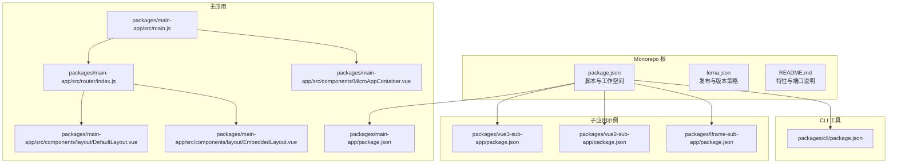
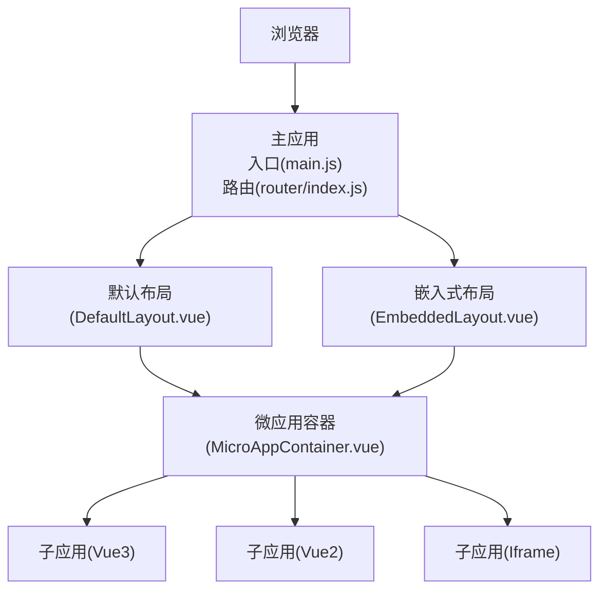
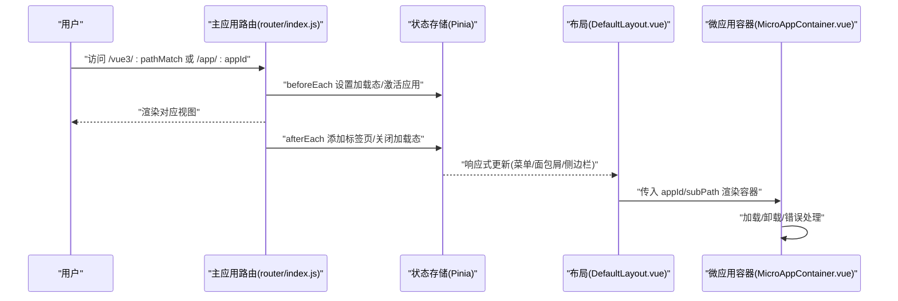
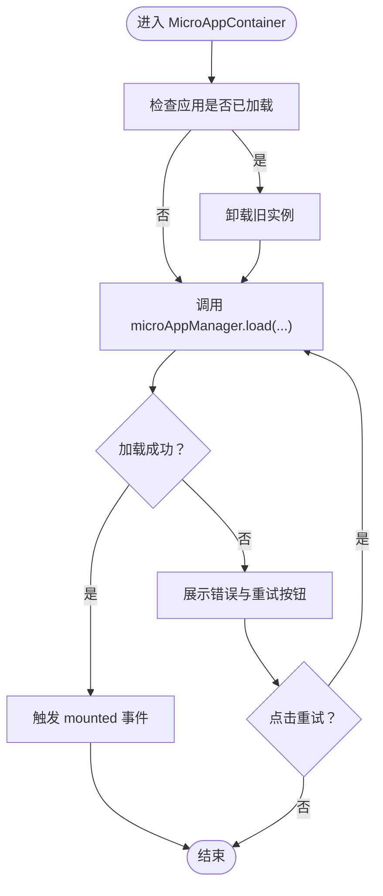
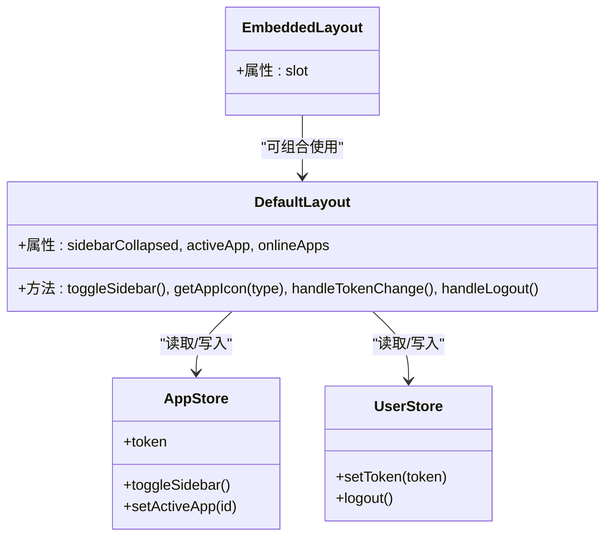
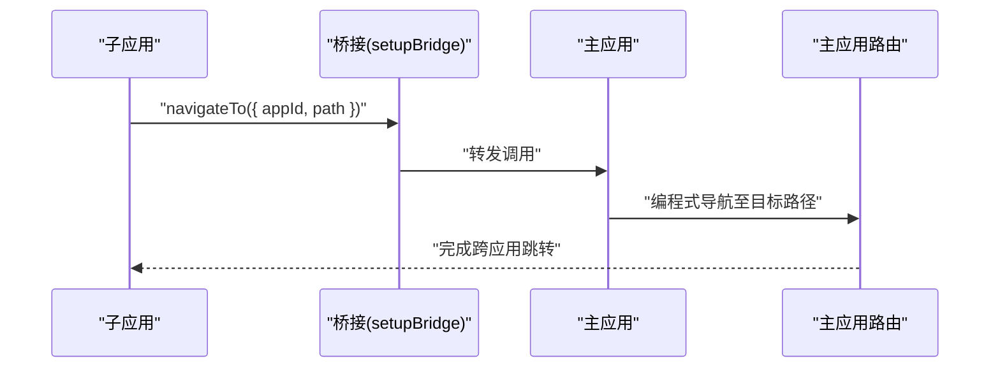
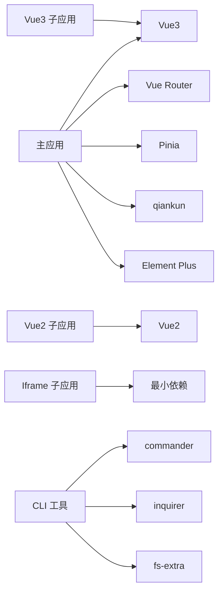

# 组件交互

<cite>
**本文引用的文件**
- [README.md](file://README.md)
- [package.json](file://package.json)
- [lerna.json](file://lerna.json)
- [packages/main-app/src/main.js](file://packages/main-app/src/main.js)
- [packages/main-app/src/router/index.js](file://packages/main-app/src/router/index.js)
- [packages/main-app/src/components/MicroAppContainer.vue](file://packages/main-app/src/components/MicroAppContainer.vue)
- [packages/main-app/src/components/layout/DefaultLayout.vue](file://packages/main-app/src/components/layout/DefaultLayout.vue)
- [packages/main-app/src/components/layout/EmbeddedLayout.vue](file://packages/main-app/src/components/layout/EmbeddedLayout.vue)
- [packages/main-app/package.json](file://packages/main-app/package.json)
- [packages/vue3-sub-app/package.json](file://packages/vue3-sub-app/package.json)
- [packages/vue2-sub-app/package.json](file://packages/vue2-sub-app/package.json)
- [packages/iframe-sub-app/package.json](file://packages/iframe-sub-app/package.json)
- [packages/cli/package.json](file://packages/cli/package.json)
</cite>

## 目录
1. [简介](#简介)
2. [项目结构](#项目结构)
3. [核心组件](#核心组件)
4. [架构总览](#架构总览)
5. [详细组件分析](#详细组件分析)
6. [依赖分析](#依赖分析)
7. [性能考虑](#性能考虑)
8. [故障排查指南](#故障排查指南)
9. [结论](#结论)
10. [附录](#附录)

## 简介
本项目是一个基于 Monorepo 的企业级微前端基础平台脚手架，采用 Lerna + npm workspaces 管理多包结构，支持 Vue3 主应用与多种类型子应用（Vue3/Vue2/iframe/link）的统一编排与通信。项目提供完整的布局系统、跨应用通信桥接、状态管理与持久化、路由守卫与权限控制、以及 iframe 跨域治理等能力，旨在为复杂业务场景下的多应用协同提供稳定可靠的基础设施。

## 项目结构
仓库采用 Monorepo 结构，通过 Lerna 管理工作空间，核心模块包括：
- 主应用：packages/main-app（Vue3 + Pinia + Element Plus + qiankun 集成）
- 子应用示例：packages/vue3-sub-app、packages/vue2-sub-app、packages/iframe-sub-app
- CLI 工具：packages/cli（快速生成各类微应用模板）
- 用户文档：user-docs（VitePress）

**图表来源**
- [package.json](file://package.json#L1-L50)
- [lerna.json](file://lerna.json#L1-L25)
- [packages/main-app/src/main.js](file://packages/main-app/src/main.js#L1-L40)
- [packages/main-app/src/router/index.js](file://packages/main-app/src/router/index.js#L1-L130)
- [packages/main-app/src/components/MicroAppContainer.vue](file://packages/main-app/src/components/MicroAppContainer.vue#L1-L167)
- [packages/main-app/src/components/layout/DefaultLayout.vue](file://packages/main-app/src/components/layout/DefaultLayout.vue#L1-L259)
- [packages/main-app/src/components/layout/EmbeddedLayout.vue](file://packages/main-app/src/components/layout/EmbeddedLayout.vue#L1-L39)
- [packages/main-app/package.json](file://packages/main-app/package.json#L1-L31)
- [packages/vue3-sub-app/package.json](file://packages/vue3-sub-app/package.json#L1-L23)
- [packages/vue2-sub-app/package.json](file://packages/vue2-sub-app/package.json#L1-L31)
- [packages/iframe-sub-app/package.json](file://packages/iframe-sub-app/package.json#L1-L15)
- [packages/cli/package.json](file://packages/cli/package.json#L1-L32)

**章节来源**
- [README.md](file://README.md#L62-L76)
- [package.json](file://package.json#L1-L50)
- [lerna.json](file://lerna.json#L1-L25)

## 核心组件
- 应用入口与初始化：主应用在入口文件中完成应用创建、插件注册、状态管理与全局桥接初始化，并挂载到 DOM。
- 路由系统与导航守卫：主应用定义多条路由，包含子应用占位路由、多应用实例路由与应用管理路由；通过 beforeEach 设置加载态与激活应用，afterEach 维护标签页与加载态。
- 微应用容器：封装 qiankun 加载/卸载流程，提供加载遮罩、错误展示与重试机制，保证容器 DOM 稳定以便子应用挂载。
- 布局系统：提供默认、全屏、多标签页、嵌入式、空白五种布局，支持侧边栏折叠、面包屑、用户信息与 Token 管理。
- 状态管理：Pinia + 持久化插件，提供应用状态、用户状态、标签页状态等跨组件共享。

**章节来源**
- [packages/main-app/src/main.js](file://packages/main-app/src/main.js#L1-L40)
- [packages/main-app/src/router/index.js](file://packages/main-app/src/router/index.js#L1-L130)
- [packages/main-app/src/components/MicroAppContainer.vue](file://packages/main-app/src/components/MicroAppContainer.vue#L1-L167)
- [packages/main-app/src/components/layout/DefaultLayout.vue](file://packages/main-app/src/components/layout/DefaultLayout.vue#L1-L259)
- [packages/main-app/src/components/layout/EmbeddedLayout.vue](file://packages/main-app/src/components/layout/EmbeddedLayout.vue#L1-L39)
- [packages/main-app/package.json](file://packages/main-app/package.json#L12-L22)

## 架构总览
主应用作为微前端中枢，负责：
- 初始化与插件装配（路由、状态、UI 组件库、桥接）
- 路由编排与导航守卫（加载态、激活应用、标签页维护）
- 微应用生命周期管理（加载、卸载、错误处理、重试）
- 布局编排与权限控制（侧边菜单、面包屑、用户信息、Token）
- 与子应用的跨应用通信（桥接与路由跳转）

**图表来源**
- [packages/main-app/src/main.js](file://packages/main-app/src/main.js#L1-L40)
- [packages/main-app/src/router/index.js](file://packages/main-app/src/router/index.js#L1-L130)
- [packages/main-app/src/components/layout/DefaultLayout.vue](file://packages/main-app/src/components/layout/DefaultLayout.vue#L1-L259)
- [packages/main-app/src/components/layout/EmbeddedLayout.vue](file://packages/main-app/src/components/layout/EmbeddedLayout.vue#L1-L39)
- [packages/main-app/src/components/MicroAppContainer.vue](file://packages/main-app/src/components/MicroAppContainer.vue#L1-L167)

## 详细组件分析

### 路由系统与导航守卫
- 路由定义：包含首页、子应用占位页、多应用实例页、应用管理页及各子应用专属通配路由。
- 导航守卫：
  - beforeEach：设置加载态、根据目标路由元信息或参数确定当前激活应用。
  - afterEach：关闭加载态、按标题添加标签页、记录标签页 keepAlive 策略。
- 与微应用联动：通过设置激活应用 ID，驱动布局与容器渲染对应子应用。

**图表来源**
- [packages/main-app/src/router/index.js](file://packages/main-app/src/router/index.js#L92-L127)
- [packages/main-app/src/components/layout/DefaultLayout.vue](file://packages/main-app/src/components/layout/DefaultLayout.vue#L125-L166)
- [packages/main-app/src/components/MicroAppContainer.vue](file://packages/main-app/src/components/MicroAppContainer.vue#L51-L101)

**章节来源**
- [packages/main-app/src/router/index.js](file://packages/main-app/src/router/index.js#L1-L130)
- [packages/main-app/src/components/layout/DefaultLayout.vue](file://packages/main-app/src/components/layout/DefaultLayout.vue#L106-L166)
- [packages/main-app/src/components/MicroAppContainer.vue](file://packages/main-app/src/components/MicroAppContainer.vue#L28-L124)

### 微应用容器与生命周期管理
- 容器职责：维持容器 DOM 不被卸载，提供加载遮罩、错误提示与重试按钮；在组件挂载时加载子应用，在卸载前卸载子应用。
- 生命周期策略：
  - 加载：检测是否已加载，必要时先卸载再加载；向 microAppManager 传递 props 与主应用路由实例。
  - 卸载：在合适的生命周期钩子中卸载，避免 DOM 已移除导致的挂载异常。
  - 错误处理：捕获异常，展示错误结果与重试按钮。
- 重载能力：暴露 reload 方法，便于调试与运行时刷新。

**图表来源**
- [packages/main-app/src/components/MicroAppContainer.vue](file://packages/main-app/src/components/MicroAppContainer.vue#L51-L123)

**章节来源**
- [packages/main-app/src/components/MicroAppContainer.vue](file://packages/main-app/src/components/MicroAppContainer.vue#L1-L167)

### 布局系统与权限控制
- 默认布局：包含侧边栏菜单、面包屑、头部区域（折叠按钮、Token 输入、用户下拉）。菜单项动态来自在线应用列表，支持图标区分不同类型子应用。
- 嵌入式布局：简洁的面包屑与内容区，适合内嵌场景。
- 权限与状态：通过 Pinia 管理 Token 与用户信息，侧边栏折叠状态与激活应用状态在布局中响应式更新；面包屑根据当前激活应用动态展示。

**图表来源**
- [packages/main-app/src/components/layout/DefaultLayout.vue](file://packages/main-app/src/components/layout/DefaultLayout.vue#L106-L166)
- [packages/main-app/src/components/layout/EmbeddedLayout.vue](file://packages/main-app/src/components/layout/EmbeddedLayout.vue#L1-L39)

**章节来源**
- [packages/main-app/src/components/layout/DefaultLayout.vue](file://packages/main-app/src/components/layout/DefaultLayout.vue#L1-L259)
- [packages/main-app/src/components/layout/EmbeddedLayout.vue](file://packages/main-app/src/components/layout/EmbeddedLayout.vue#L1-L39)

### 跨应用通信与桥接
- 桥接初始化：主应用入口调用 setupBridge 完成桥接注册，为子应用提供跨应用通信能力。
- 路由跳转：子应用可通过桥接调用 navigateTo 或 navigateToMain 实现跨应用导航。
- 通信协议：桥接提供统一的 API 接口，约定参数结构与返回值，确保主应用与子应用间消息传递的一致性与可追踪性。

**图表来源**
- [packages/main-app/src/main.js](file://packages/main-app/src/main.js#L10-L31)
- [README.md](file://README.md#L130-L141)

**章节来源**
- [packages/main-app/src/main.js](file://packages/main-app/src/main.js#L1-L40)
- [README.md](file://README.md#L130-L141)

### 状态管理模式
- 状态库：Pinia + 持久化插件，确保刷新后状态不丢失。
- 主要状态：
  - 应用状态：激活应用、加载态、侧边栏折叠状态、在线应用列表。
  - 用户状态：Token、登录态、登出。
  - 标签页状态：标签页集合、keepAlive 策略。
- 响应式更新：布局与容器通过 storeToRefs 订阅状态变化，实现无侵入的状态驱动渲染。

**章节来源**
- [packages/main-app/src/main.js](file://packages/main-app/src/main.js#L17-L29)
- [packages/main-app/src/router/index.js](file://packages/main-app/src/router/index.js#L92-L127)
- [packages/main-app/src/components/layout/DefaultLayout.vue](file://packages/main-app/src/components/layout/DefaultLayout.vue#L125-L131)

## 依赖分析
- 主应用依赖：Vue3、Vue Router、Pinia、Pinia 持久化、Element Plus、Axios、Lodash、qiankun。
- 子应用示例：Vue3/Vue2 对应生态，iframe 示例最小化依赖。
- CLI 工具：命令行交互与模板生成，依赖 chalk、commander、inquirer、fs-extra、ora、ejs。

**图表来源**
- [packages/main-app/package.json](file://packages/main-app/package.json#L12-L22)
- [packages/vue3-sub-app/package.json](file://packages/vue3-sub-app/package.json#L12-L16)
- [packages/vue2-sub-app/package.json](file://packages/vue2-sub-app/package.json#L11-L16)
- [packages/iframe-sub-app/package.json](file://packages/iframe-sub-app/package.json#L1-L15)
- [packages/cli/package.json](file://packages/cli/package.json#L12-L19)

**章节来源**
- [packages/main-app/package.json](file://packages/main-app/package.json#L1-L31)
- [packages/vue3-sub-app/package.json](file://packages/vue3-sub-app/package.json#L1-L23)
- [packages/vue2-sub-app/package.json](file://packages/vue2-sub-app/package.json#L1-L31)
- [packages/iframe-sub-app/package.json](file://packages/iframe-sub-app/package.json#L1-L15)
- [packages/cli/package.json](file://packages/cli/package.json#L1-L32)

## 性能考虑
- 微应用预加载：主应用配置支持预加载，减少首次切换延迟。
- 容器稳定性：保持容器 DOM 常驻，避免 qiankun 挂载时找不到有效节点导致的异常。
- 加载与错误处理：提供骨架屏与错误提示，改善用户体验与可恢复性。
- 状态持久化：Pinia 持久化降低刷新成本，提升二次访问速度。
- 路由守卫轻量：仅做必要的状态设置与标签页维护，避免阻塞导航。

[本节为通用建议，无需列出具体文件来源]

## 故障排查指南
- 子应用无法加载：
  - 检查容器 DOM 是否存在且可见，确认未在卸载阶段提前销毁。
  - 查看控制台错误信息，优先尝试重试按钮。
- 切换路由后子应用未更新：
  - 确认 appId 参数是否正确传递至容器组件。
  - 检查路由元信息中的 appId 与激活应用逻辑。
- 布局异常：
  - 检查侧边栏折叠状态与在线应用列表是否正确更新。
  - 确认 Token 变更是否触发用户状态更新。
- 调试辅助：
  - 主应用入口导出微应用管理器对象，便于在浏览器控制台查看加载状态与实例信息。

**章节来源**
- [packages/main-app/src/components/MicroAppContainer.vue](file://packages/main-app/src/components/MicroAppContainer.vue#L103-L116)
- [packages/main-app/src/router/index.js](file://packages/main-app/src/router/index.js#L92-L127)
- [packages/main-app/src/main.js](file://packages/main-app/src/main.js#L36-L40)

## 结论
该微前端平台通过清晰的 Monorepo 结构、完善的路由与布局体系、稳定的微应用容器与桥接通信机制，实现了主应用与多类型子应用之间的高效协同。结合状态持久化与路由守卫，系统在可用性、可维护性与扩展性方面具备良好基础。后续可在错误边界细化、性能监控埋点与权限模型增强等方面持续演进。

[本节为总结性内容，无需列出具体文件来源]

## 附录
- 端口与启动：主应用 8080、Vue3 子应用 7080、Vue2 子应用 3000、Iframe 子应用 4000；支持并行开发与构建。
- CLI 快速创建：全局链接 CLI 后，可一键生成主应用与各类子应用模板。

**章节来源**
- [README.md](file://README.md#L17-L54)
- [README.md](file://README.md#L78-L96)