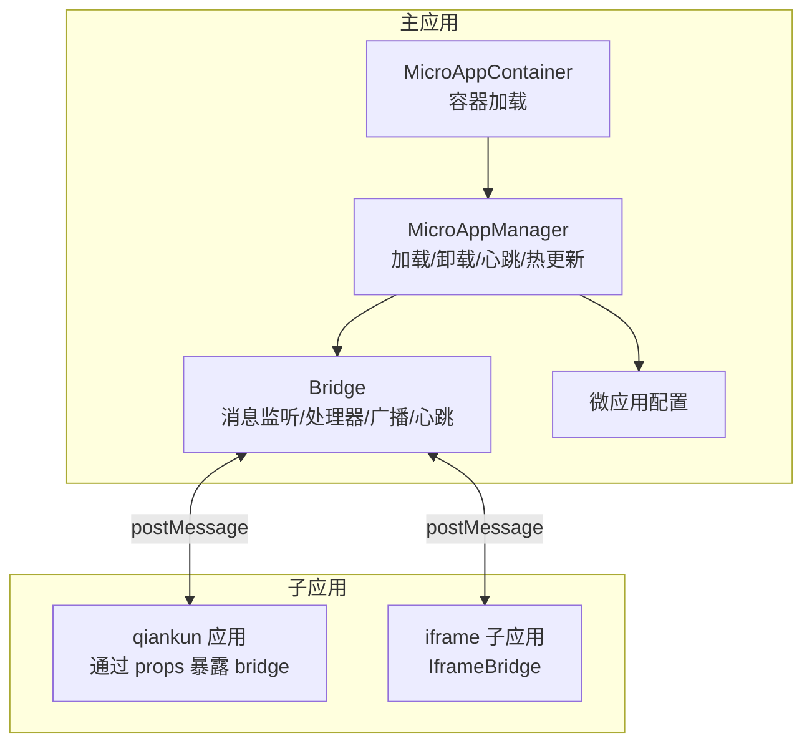
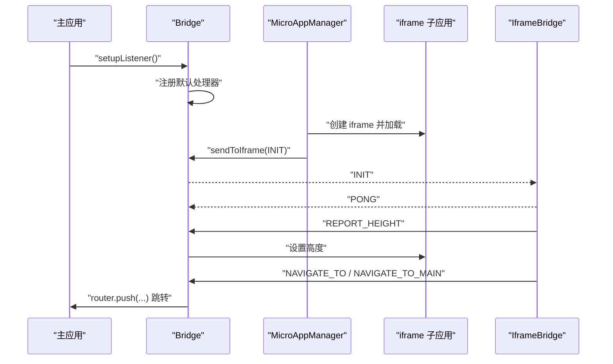
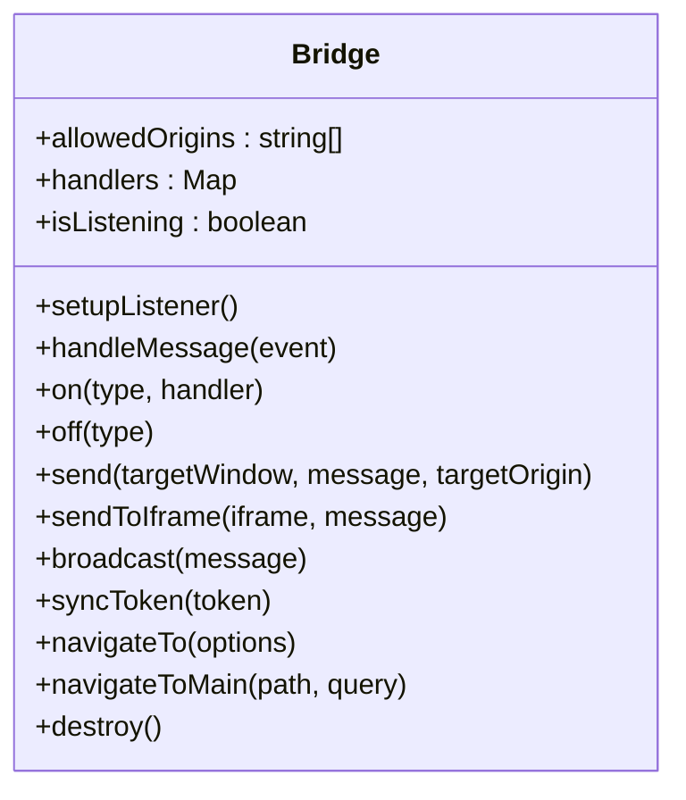
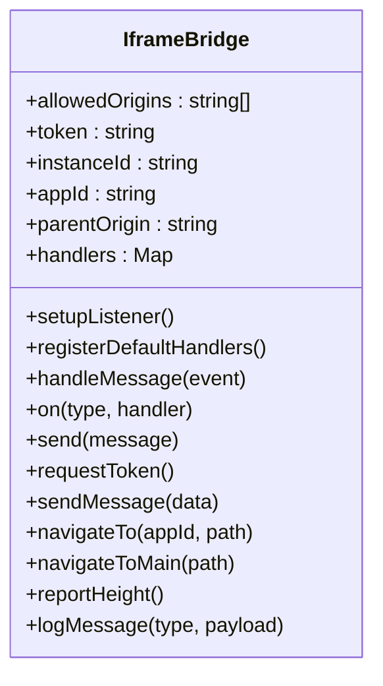
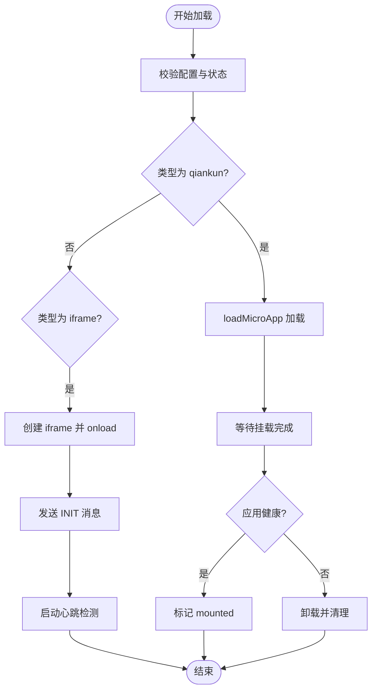
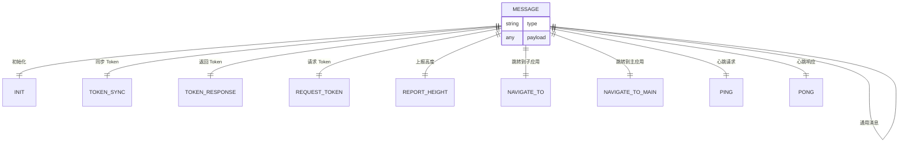
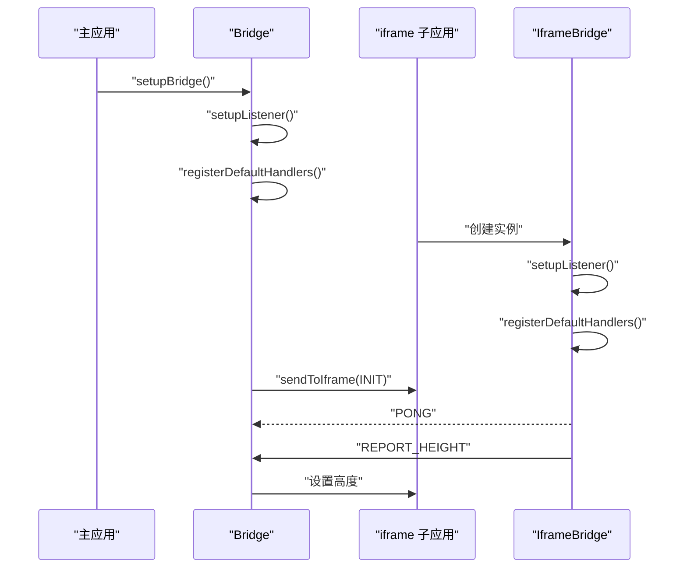
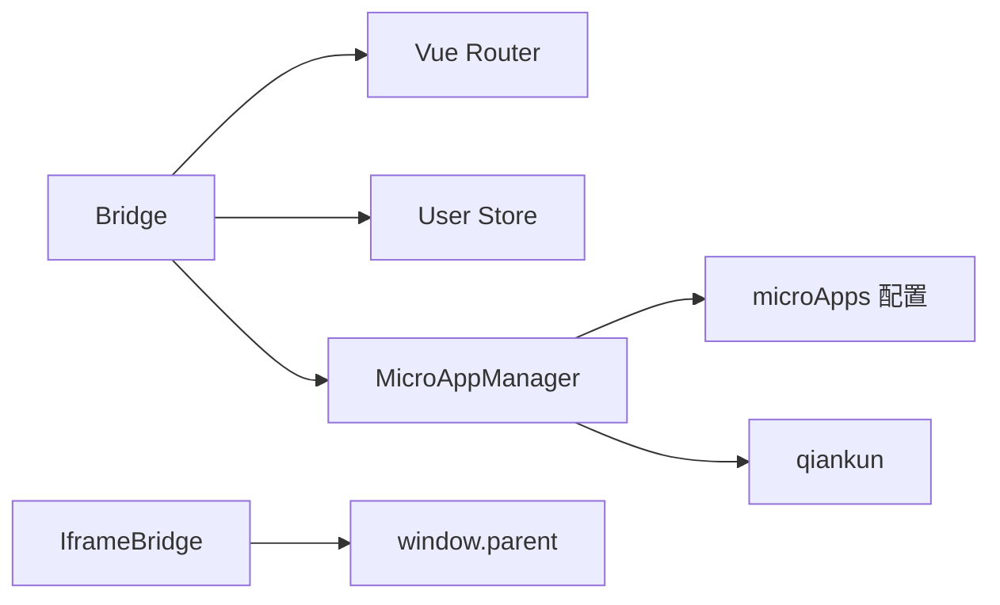

# 通信架构

<cite>
**本文引用的文件**
- [README.md](file://README.md)
- [packages/main-app/src/core/bridge.js](file://packages/main-app/src/core/bridge.js)
- [packages/iframe-sub-app/src/bridge.js](file://packages/iframe-sub-app/src/bridge.js)
- [packages/main-app/src/core/microAppManager.js](file://packages/main-app/src/core/microAppManager.js)
- [packages/main-app/src/config/microApps.js](file://packages/main-app/src/config/microApps.js)
- [user-docs/guide/iframe-governance.md](file://user-docs/guide/iframe-governance.md)
- [user-docs/api/bridge.md](file://user-docs/api/bridge.md)
- [packages/main-app/src/components/MicroAppContainer.vue](file://packages/main-app/src/components/MicroAppContainer.vue)
</cite>

## 目录
1. [简介](#简介)
2. [项目结构](#项目结构)
3. [核心组件](#核心组件)
4. [架构总览](#架构总览)
5. [详细组件分析](#详细组件分析)
6. [依赖关系分析](#依赖关系分析)
7. [性能考量](#性能考量)
8. [故障排查指南](#故障排查指南)
9. [结论](#结论)
10. [附录](#附录)

## 简介
本项目提供一套完整的跨应用通信架构，基于 postMessage 实现主应用与多种类型子应用（Vue3/Vue2/qiankun沙箱、iframe）之间的双向通信。通信桥统一抽象了消息协议、处理器注册、事件监听、跨域安全校验、心跳检测、高度上报、路由跳转与状态共享等能力，并通过微应用管理器对不同加载模式进行适配与生命周期管理。

## 项目结构
- 主应用负责桥接初始化、消息监听、路由跳转、广播与心跳控制，并将桥能力暴露至全局供子应用调用。
- 子应用通过 iframe 桥或 qiankun 暴露的 bridge 对象进行通信；iframe 子应用内置独立桥以与主应用交互。
- 微应用管理器负责应用加载、卸载、心跳、热更新检测、样式隔离与清理等。

图表来源
- [packages/main-app/src/core/bridge.js](file://packages/main-app/src/core/bridge.js#L1-L241)
- [packages/main-app/src/core/microAppManager.js](file://packages/main-app/src/core/microAppManager.js#L1-L515)
- [packages/main-app/src/config/microApps.js](file://packages/main-app/src/config/microApps.js#L1-L110)
- [packages/iframe-sub-app/src/bridge.js](file://packages/iframe-sub-app/src/bridge.js#L1-L216)
- [packages/main-app/src/components/MicroAppContainer.vue](file://packages/main-app/src/components/MicroAppContainer.vue#L46-L105)

章节来源
- [README.md](file://README.md#L1-L158)
- [packages/main-app/src/core/bridge.js](file://packages/main-app/src/core/bridge.js#L1-L241)
- [packages/main-app/src/core/microAppManager.js](file://packages/main-app/src/core/microAppManager.js#L1-L515)
- [packages/main-app/src/config/microApps.js](file://packages/main-app/src/config/microApps.js#L1-L110)
- [packages/iframe-sub-app/src/bridge.js](file://packages/iframe-sub-app/src/bridge.js#L1-L216)
- [packages/main-app/src/components/MicroAppContainer.vue](file://packages/main-app/src/components/MicroAppContainer.vue#L46-L105)

## 核心组件
- Bridge（主应用侧）：统一消息监听、处理器注册、跨域校验、广播、心跳、路由跳转、Token 同步、高度上报等。
- IframeBridge（iframe 子应用侧）：与主应用通过 postMessage 通信，支持初始化、心跳、高度上报、导航、Token 请求/同步等。
- MicroAppManager：负责应用加载/卸载、心跳检测、热更新检测、样式隔离与清理、错误日志记录。
- 微应用配置：集中管理各子应用的入口、类型、激活规则、布局选项等。

章节来源
- [packages/main-app/src/core/bridge.js](file://packages/main-app/src/core/bridge.js#L1-L241)
- [packages/iframe-sub-app/src/bridge.js](file://packages/iframe-sub-app/src/bridge.js#L1-L216)
- [packages/main-app/src/core/microAppManager.js](file://packages/main-app/src/core/microAppManager.js#L1-L515)
- [packages/main-app/src/config/microApps.js](file://packages/main-app/src/config/microApps.js#L1-L110)

## 架构总览
通信采用“主应用桥 + 子应用桥”的双桥设计：
- 主应用桥负责接收消息、路由跳转、广播、心跳与高度适配。
- 子应用桥负责发送消息、请求 Token、上报高度、心跳响应与跨应用导航。
- qiankun 子应用通过 props 注入 bridge 对象，iframe 子应用通过 window.parent/postMessage 通信。
- 跨域安全通过 origin 白名单校验与 sandbox 限制保障。

图表来源
- [packages/main-app/src/core/bridge.js](file://packages/main-app/src/core/bridge.js#L83-L114)
- [packages/main-app/src/core/microAppManager.js](file://packages/main-app/src/core/microAppManager.js#L173-L232)
- [packages/iframe-sub-app/src/bridge.js](file://packages/iframe-sub-app/src/bridge.js#L36-L88)

## 详细组件分析

### Bridge 组件（主应用侧）
- 功能要点
  - 消息监听与跨域校验：仅接受白名单 origin 或同源消息。
  - 默认处理器：导航、Token 请求/响应、心跳、高度上报、通用消息。
  - 处理器注册/注销：on/off 提供动态扩展。
  - 发送接口：send/sendToIframe 广播：broadcast。
  - 能力暴露：setupBridge 将 navigateTo、navigateToMain、send、on、off 暴露至 window.__ARTISAN_BRIDGE__。
- 关键流程
  - 初始化：registerDefaultHandlers 注册内置消息类型处理器。
  - 接收消息：handleMessage 校验 origin，分发到对应处理器。
  - 广播：遍历 iframe 并 sendToIframe，同时派发自定义事件供 qiankun 子应用监听。

图表来源
- [packages/main-app/src/core/bridge.js](file://packages/main-app/src/core/bridge.js#L1-L241)

章节来源
- [packages/main-app/src/core/bridge.js](file://packages/main-app/src/core/bridge.js#L1-L241)
- [user-docs/api/bridge.md](file://user-docs/api/bridge.md#L1-L150)

### IframeBridge 组件（iframe 子应用侧）
- 功能要点
  - 消息监听与跨域校验：仅接受白名单 origin。
  - 默认处理器：INIT、TOKEN_SYNC/TOKEN_RESPONSE、PING/PONG、RESIZE。
  - 能力封装：requestToken、sendMessage、navigateTo、navigateToMain、reportHeight。
  - 日志记录：logMessage 将消息写入页面面板。
- 关键流程
  - 初始化：收到 INIT 后更新 token/instanceId/appId，并上报高度。
  - 心跳：收到 PING 后回送 PONG。
  - 导航：向主应用发送 NAVIGATE_TO/NAVIGATE_TO_MAIN。
  - Token：通过 REQUEST_TOKEN 获取主应用 Token 并同步。

图表来源
- [packages/iframe-sub-app/src/bridge.js](file://packages/iframe-sub-app/src/bridge.js#L1-L216)

章节来源
- [packages/iframe-sub-app/src/bridge.js](file://packages/iframe-sub-app/src/bridge.js#L1-L216)
- [user-docs/guide/iframe-governance.md](file://user-docs/guide/iframe-governance.md#L1-L138)

### MicroAppManager 组件（应用加载与生命周期）
- 功能要点
  - 加载策略：区分 qiankun 与 iframe；link 类型直接打开新窗口。
  - 生命周期：加载/挂载/卸载/重载；卸载时清理样式与容器。
  - 心跳检测：定时发送 PING，检测应用健康状态。
  - 热更新检测：通过 HEAD 请求 last-modified 判断变更并自动 reload。
  - 错误日志：记录并限制最近 100 条错误。
- 关键流程
  - load：校验配置与状态，qiankun 通过 loadMicroApp 加载，iframe 手动创建并 onload 后发送 INIT。
  - unload：停止心跳，卸载 qiankun 应用或移除 iframe，清理样式与容器。
  - startIframeHeartbeat：每 30 秒向 iframe 发送 PING，确保通信链路可用。

图表来源
- [packages/main-app/src/core/microAppManager.js](file://packages/main-app/src/core/microAppManager.js#L49-L165)
- [packages/main-app/src/core/microAppManager.js](file://packages/main-app/src/core/microAppManager.js#L173-L232)

章节来源
- [packages/main-app/src/core/microAppManager.js](file://packages/main-app/src/core/microAppManager.js#L1-L515)
- [packages/main-app/src/config/microApps.js](file://packages/main-app/src/config/microApps.js#L1-L110)
- [packages/main-app/src/components/MicroAppContainer.vue](file://packages/main-app/src/components/MicroAppContainer.vue#L46-L105)

### 通信协议与消息类型
- 消息格式
  - type：字符串，表示消息类型。
  - payload：任意数据体。
- 内置消息类型
  - INIT：主应用 -> iframe 子应用，传递 token、appId 等。
  - TOKEN_SYNC：主应用 -> 子应用，同步 Token。
  - TOKEN_RESPONSE：主应用 -> 子应用，返回 Token。
  - REQUEST_TOKEN：子应用 -> 主应用，请求 Token。
  - REPORT_HEIGHT：子应用 -> 主应用，上报高度。
  - NAVIGATE_TO：子应用 -> 主应用，跨应用跳转到子应用。
  - NAVIGATE_TO_MAIN：子应用 -> 主应用，跳转到主应用。
  - PING/PONG：双向心跳检测。
  - MESSAGE：通用消息。

图表来源
- [user-docs/guide/iframe-governance.md](file://user-docs/guide/iframe-governance.md#L42-L64)
- [user-docs/api/bridge.md](file://user-docs/api/bridge.md#L136-L150)

章节来源
- [user-docs/guide/iframe-governance.md](file://user-docs/guide/iframe-governance.md#L42-L64)
- [user-docs/api/bridge.md](file://user-docs/api/bridge.md#L136-L150)

### 跨域安全与治理
- 跨域策略
  - 严格 origin 白名单校验：主应用与子应用均在构造函数中维护 allowedOrigins。
  - 同源放行：允许 window.location.origin。
  - iframe sandbox：启用 allow-scripts/allow-same-origin/allow-forms/allow-popups。
- 治理建议
  - 禁止直接访问 iframe DOM，统一使用 postMessage。
  - 生产环境将 localhost 示例端口替换为实际域名。
  - 对外暴露的桥方法仅限必要接口，避免泄露内部实现。

章节来源
- [packages/main-app/src/core/bridge.js](file://packages/main-app/src/core/bridge.js#L96-L101)
- [packages/iframe-sub-app/src/bridge.js](file://packages/iframe-sub-app/src/bridge.js#L95-L99)
- [user-docs/guide/iframe-governance.md](file://user-docs/guide/iframe-governance.md#L3-L40)

### Token 同步、路由跳转与状态共享
- Token 同步
  - 主应用通过 bridge.broadcast 发送 TOKEN_SYNC，iframe 子应用收到后更新本地 token 并回显。
  - 子应用可通过 REQUEST_TOKEN 向主应用请求 Token，主应用通过 TOKEN_RESPONSE 返回。
- 路由跳转
  - 子应用通过 NAVIGATE_TO/NAVIGATE_TO_MAIN 发起跳转，主应用通过 router.push 完成。
  - 主应用桥提供 navigateTo/navigateToMain 便捷方法，也可通过 window.__ARTISAN_BRIDGE__ 调用。
- 状态共享
  - 通过消息广播实现全局状态同步（如 Token）。
  - qiankun 子应用通过 props 注入 bridge，实现与主应用的状态互通。

章节来源
- [packages/main-app/src/core/bridge.js](file://packages/main-app/src/core/bridge.js#L34-L58)
- [packages/iframe-sub-app/src/bridge.js](file://packages/iframe-sub-app/src/bridge.js#L55-L75)
- [user-docs/api/bridge.md](file://user-docs/api/bridge.md#L83-L122)

### 通信桥初始化流程与事件监听
- 主应用初始化
  - 调用 setupBridge 启动消息监听，注册默认处理器，将桥能力暴露到 window.__ARTISAN_BRIDGE__。
- 子应用初始化
  - iframe 子应用创建 IframeBridge 实例，注册默认处理器并监听消息。
  - qiankun 子应用通过 props 接收 bridge 对象，直接使用其 on/send 等方法。
- 心跳与高度上报
  - 主应用通过 startIframeHeartbeat 定期发送 PING，子应用回送 PONG。
  - 子应用在 load/resize 时上报高度，主应用调整 iframe 高度。

图表来源
- [packages/main-app/src/core/bridge.js](file://packages/main-app/src/core/bridge.js#L225-L238)
- [packages/iframe-sub-app/src/bridge.js](file://packages/iframe-sub-app/src/bridge.js#L27-L89)
- [packages/main-app/src/core/microAppManager.js](file://packages/main-app/src/core/microAppManager.js#L206-L220)

章节来源
- [packages/main-app/src/core/bridge.js](file://packages/main-app/src/core/bridge.js#L225-L238)
- [packages/iframe-sub-app/src/bridge.js](file://packages/iframe-sub-app/src/bridge.js#L27-L89)
- [packages/main-app/src/core/microAppManager.js](file://packages/main-app/src/core/microAppManager.js#L206-L220)

## 依赖关系分析
- Bridge 依赖
  - 主应用路由：用于跨应用跳转。
  - 用户状态存储：用于获取/同步 Token。
  - MicroAppManager：用于 sendToIframe、心跳控制。
- IframeBridge 依赖
  - window.parent：用于与主应用通信。
  - DOM：用于高度计算与日志输出。
- MicroAppManager 依赖
  - qiankun：加载/卸载 qiankun 应用。
  - 微应用配置：根据配置决定加载策略与属性。
  - 样式隔离：清理 qiankun 注入的样式，避免污染。

图表来源
- [packages/main-app/src/core/bridge.js](file://packages/main-app/src/core/bridge.js#L1-L241)
- [packages/main-app/src/core/microAppManager.js](file://packages/main-app/src/core/microAppManager.js#L1-L515)
- [packages/main-app/src/config/microApps.js](file://packages/main-app/src/config/microApps.js#L1-L110)

章节来源
- [packages/main-app/src/core/bridge.js](file://packages/main-app/src/core/bridge.js#L1-L241)
- [packages/main-app/src/core/microAppManager.js](file://packages/main-app/src/core/microAppManager.js#L1-L515)
- [packages/main-app/src/config/microApps.js](file://packages/main-app/src/config/microApps.js#L1-L110)

## 性能考量
- 心跳频率：默认 30 秒一次，可根据网络状况调整，避免过于频繁导致主线程压力。
- 消息广播：广播给所有 iframe 时注意目标数量，避免大规模消息风暴。
- 高度上报：建议在 resize 时节流/防抖，减少频繁 DOM 测量。
- 样式清理：卸载时及时清理 qiankun 注入样式，避免累积造成内存与渲染压力。
- 热更新检测：HEAD 请求频率不宜过高，建议结合缓存与增量策略。

## 故障排查指南
- 无法接收消息
  - 检查 origin 白名单是否包含对方 origin。
  - 确认消息类型正确且处理器已注册。
- iframe 高度不更新
  - 确认子应用在 load/resize 时调用 reportHeight。
  - 检查主应用是否收到 REPORT_HEIGHT 并设置 iframe 高度。
- 跳转无效
  - 确认子应用发送的是 NAVIGATE_TO/NAVIGATE_TO_MAIN。
  - 检查主应用路由是否存在对应路径。
- Token 同步失败
  - 子应用是否发送 REQUEST_TOKEN；主应用是否返回 TOKEN_RESPONSE。
  - 检查主应用是否调用 syncToken 广播 TOKEN_SYNC。
- 卸载后残留
  - 确认 MicroAppManager 卸载流程是否执行样式清理与容器清空。
  - 检查心跳定时器是否停止。

章节来源
- [packages/main-app/src/core/bridge.js](file://packages/main-app/src/core/bridge.js#L96-L114)
- [packages/iframe-sub-app/src/bridge.js](file://packages/iframe-sub-app/src/bridge.js#L95-L115)
- [packages/main-app/src/core/microAppManager.js](file://packages/main-app/src/core/microAppManager.js#L238-L284)

## 结论
本通信架构通过 Bridge/IframeBridge 抽象统一了主子应用间的通信协议，配合 MicroAppManager 完成加载、心跳、热更新与样式隔离等关键能力。依托 postMessage 与严格的跨域校验，系统在保证安全性的同时实现了灵活的跨应用导航、状态共享与可观测性。建议在生产环境中完善域名白名单、消息幂等与错误恢复策略，持续优化心跳与上报频率，提升整体稳定性与性能。

## 附录
- API 参考与使用示例请参阅 Bridge API 文档。
- iframe 跨域治理与通信协议规范请参阅 iframe 治理文档。

章节来源
- [user-docs/api/bridge.md](file://user-docs/api/bridge.md#L1-L150)
- [user-docs/guide/iframe-governance.md](file://user-docs/guide/iframe-governance.md#L1-L138)