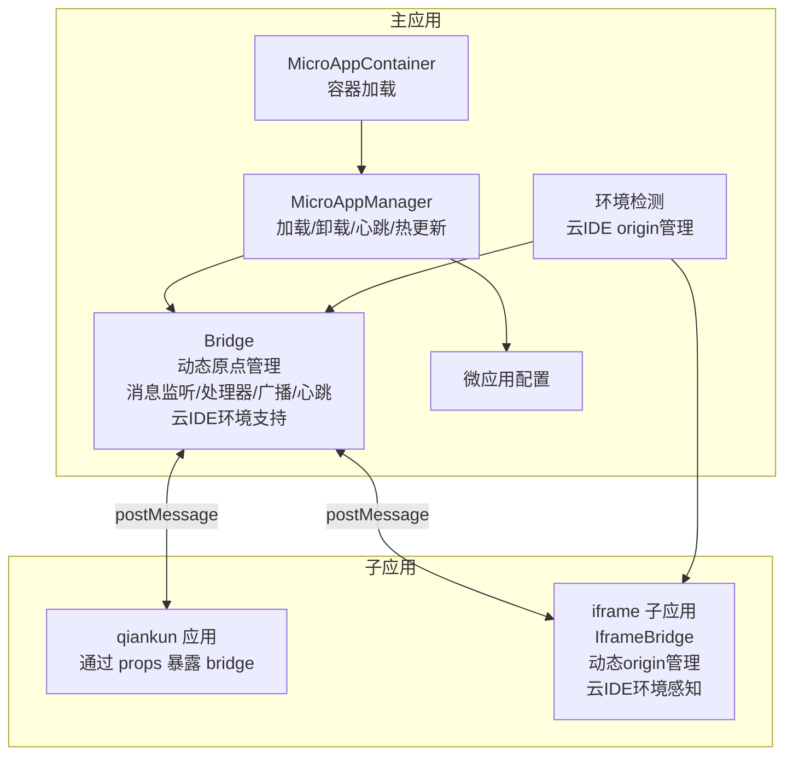
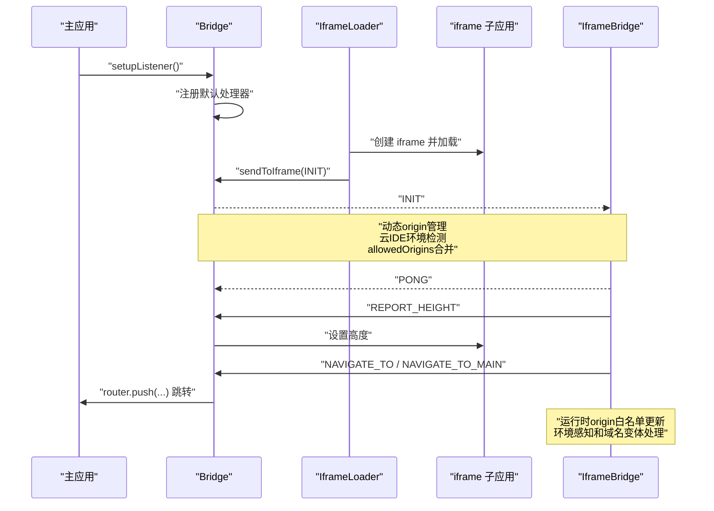
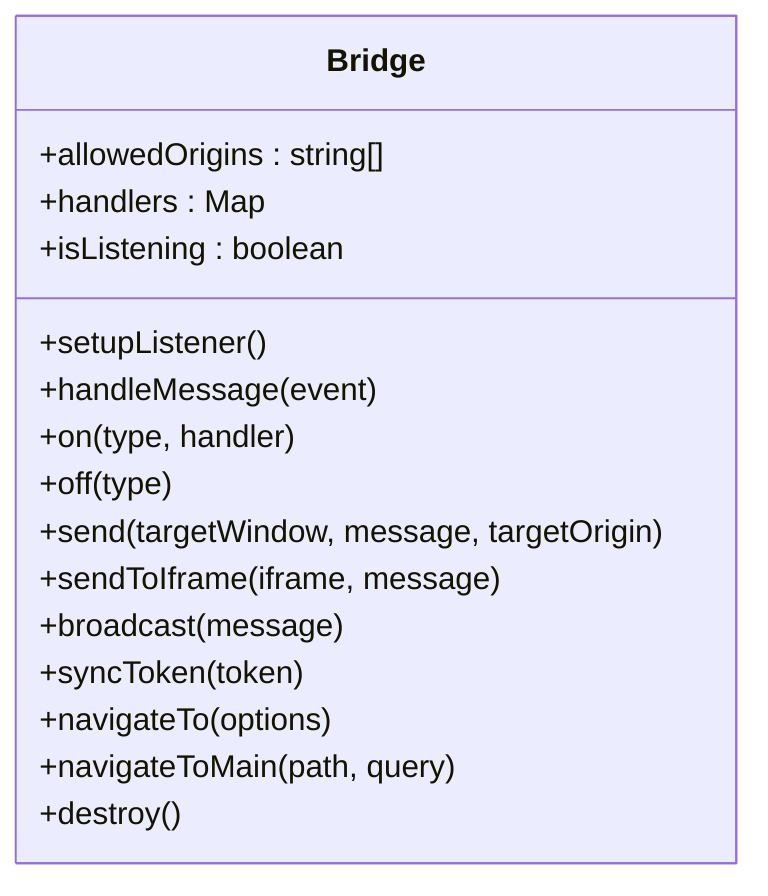
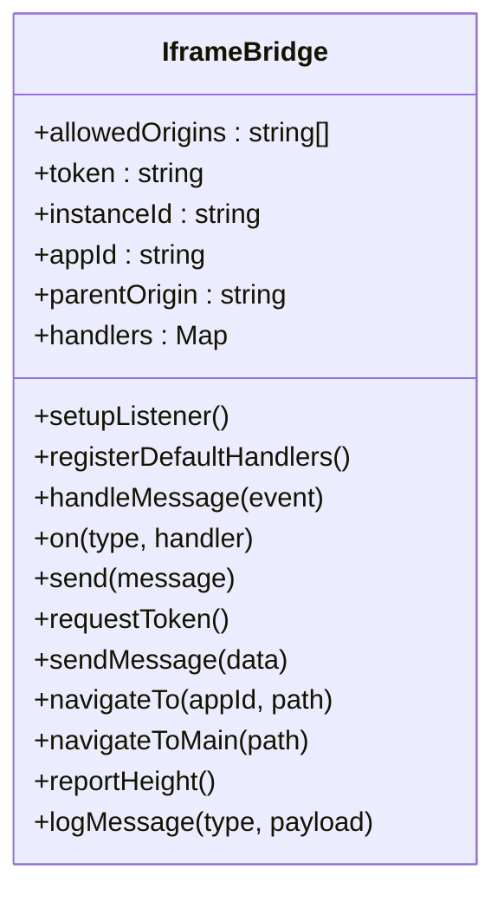
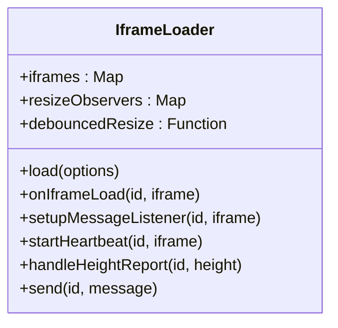
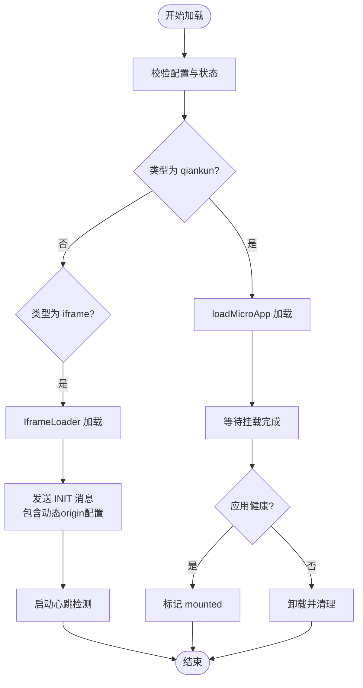
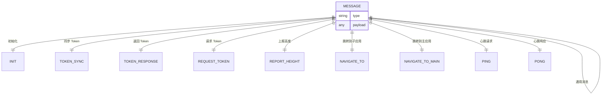
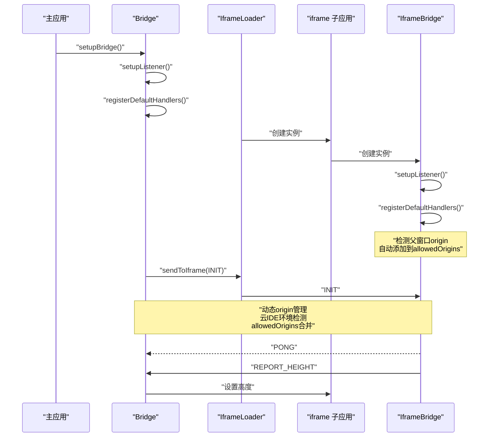
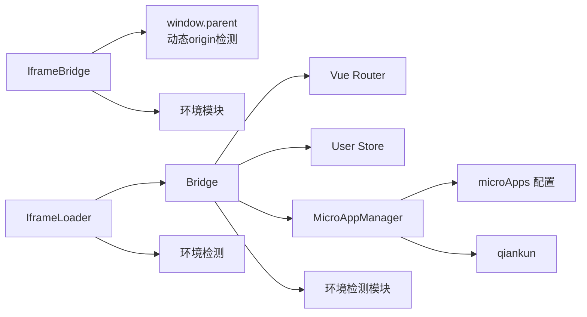

# 通信架构

<cite>
**本文引用的文件**
- [README.md](file://README.md)
- [packages/main-app/src/core/bridge.js](file://packages/main-app/src/core/bridge.js)
- [packages/iframe-sub-app/src/bridge.js](file://packages/iframe-sub-app/src/bridge.js)
- [packages/main-app/src/core/microAppManager.js](file://packages/main-app/src/core/microAppManager.js)
- [packages/main-app/src/config/microApps.js](file://packages/main-app/src/config/microApps.js)
- [user-docs/guide/iframe-governance.md](file://user-docs/guide/iframe-governance.md)
- [user-docs/api/bridge.md](file://user-docs/api/bridge.md)
- [packages/main-app/src/components/MicroAppContainer.vue](file://packages/main-app/src/components/MicroAppContainer.vue)
- [user-docs/guide/deployment.md](file://user-docs/guide/deployment.md)
- [packages/iframe-sub-app/vite.config.js](file://packages/iframe-sub-app/vite.config.js)
- [packages/main-app/src/core/iframeLoader.js](file://packages/main-app/src/core/iframeLoader.js)
- [packages/iframe-sub-app/src/env.js](file://packages/iframe-sub-app/src/env.js)
</cite>

## 更新摘要
**变更内容**
- 新增动态原点管理功能，支持运行时动态添加允许的源
- 增强CORS兼容性，提供更灵活的跨域通信解决方案
- 优化iframe子应用的origin白名单管理机制
- 完善部署指南中的CORS配置说明
- 新增云IDE环境下的动态origin检测和管理

## 目录
1. [简介](#简介)
2. [项目结构](#项目结构)
3. [核心组件](#核心组件)
4. [架构总览](#架构总览)
5. [详细组件分析](#详细组件分析)
6. [依赖关系分析](#依赖关系分析)
7. [性能考量](#性能考量)
8. [故障排查指南](#故障排查指南)
9. [结论](#结论)
10. [附录](#附录)

## 简介
本项目提供一套完整的跨应用通信架构，基于 postMessage 实现主应用与多种类型子应用（Vue3/Vue2/qiankun沙箱、iframe）之间的双向通信。通信桥统一抽象了消息协议、处理器注册、事件监听、跨域安全校验、心跳检测、高度上报、路由跳转与状态共享等能力，并通过微应用管理器对不同加载模式进行适配与生命周期管理。

**更新** 通信架构现已包含动态原点管理和增强的CORS兼容性，确保跨应用通信的安全性和兼容性，支持运行时动态添加允许的源，提供更灵活的跨域通信解决方案。特别针对云IDE环境（GitHub Codespaces、Gitpod等）提供了智能的origin检测和动态管理机制。

## 项目结构
- 主应用负责桥接初始化、消息监听、路由跳转、广播与心跳控制，并将桥能力暴露至全局供子应用调用。
- 子应用通过 iframe 桥或 qiankun 暴露的 bridge 对象进行通信；iframe 子应用内置独立桥以与主应用交互。
- 微应用管理器负责应用加载、卸载、心跳、热更新检测、样式隔离与清理等。
- **新增** 动态原点管理：主应用和子应用都支持运行时动态添加origin到白名单。

```mermaid
graph TB
subgraph "主应用"
MA_Bridge["Bridge<br/>动态原点管理<br/>消息监听/处理器/广播/心跳<br/>云IDE环境支持"]
MA_Manager["MicroAppManager<br/>加载/卸载/心跳/热更新"]
MA_Config["微应用配置"]
MA_Container["MicroAppContainer<br/>容器加载"]
MA_Env["环境检测<br/>云IDE origin管理"]
end
subgraph "子应用"
Qiankun_App["qiankun 应用<br/>通过 props 暴露 bridge"]
Iframe_App["iframe 子应用<br/>IframeBridge<br/>动态origin管理<br/>云IDE环境感知"]
end
MA_Bridge <-- postMessage --> Qiankun_App
MA_Bridge <-- postMessage --> Iframe_App
MA_Manager --> MA_Bridge
MA_Manager --> MA_Config
MA_Container --> MA_Manager
MA_Env --> MA_Bridge
MA_Env --> Iframe_App
```

**图表来源**
- [packages/main-app/src/core/bridge.js](file://packages/main-app/src/core/bridge.js#L1-L264)
- [packages/main-app/src/core/microAppManager.js](file://packages/main-app/src/core/microAppManager.js#L1-L508)
- [packages/main-app/src/config/microApps.js](file://packages/main-app/src/config/microApps.js#L1-L120)
- [packages/iframe-sub-app/src/bridge.js](file://packages/iframe-sub-app/src/bridge.js#L1-L238)
- [packages/main-app/src/components/MicroAppContainer.vue](file://packages/main-app/src/components/MicroAppContainer.vue#L46-L105)
- [packages/main-app/src/core/iframeLoader.js](file://packages/main-app/src/core/iframeLoader.js#L1-L374)
- [packages/iframe-sub-app/src/env.js](file://packages/iframe-sub-app/src/env.js#L1-L145)

**章节来源**
- [README.md](file://README.md#L1-L158)
- [packages/main-app/src/core/bridge.js](file://packages/main-app/src/core/bridge.js#L1-L264)
- [packages/main-app/src/core/microAppManager.js](file://packages/main-app/src/core/microAppManager.js#L1-L508)
- [packages/main-app/src/config/microApps.js](file://packages/main-app/src/config/microApps.js#L1-L120)
- [packages/iframe-sub-app/src/bridge.js](file://packages/iframe-sub-app/src/bridge.js#L1-L238)
- [packages/main-app/src/components/MicroAppContainer.vue](file://packages/main-app/src/components/MicroAppContainer.vue#L46-L105)
- [packages/main-app/src/core/iframeLoader.js](file://packages/main-app/src/core/iframeLoader.js#L1-L374)
- [packages/iframe-sub-app/src/env.js](file://packages/iframe-sub-app/src/env.js#L1-L145)

## 核心组件
- Bridge（主应用侧）：统一消息监听、处理器注册、跨域校验、广播、心跳、路由跳转、Token 同步、高度上报等。**新增动态原点管理功能**，支持云IDE环境的origin自动检测和添加。
- IframeBridge（iframe 子应用侧）：与主应用通过 postMessage 通信，支持初始化、心跳、高度上报、导航、Token 请求/同步等。**增强origin白名单管理**，支持从INIT消息动态更新allowedOrigins。
- MicroAppManager：负责应用加载/卸载、心跳检测、热更新检测、样式隔离与清理、错误日志记录。
- 微应用配置：集中管理各子应用的入口、类型、激活规则、布局选项等。
- **新增** IframeLoader：专门负责iframe子应用的加载、通信和动态origin管理。
- **新增** 环境检测模块：智能识别云IDE环境并生成相应的origin配置。

**章节来源**
- [packages/main-app/src/core/bridge.js](file://packages/main-app/src/core/bridge.js#L1-L264)
- [packages/iframe-sub-app/src/bridge.js](file://packages/iframe-sub-app/src/bridge.js#L1-L238)
- [packages/main-app/src/core/microAppManager.js](file://packages/main-app/src/core/microAppManager.js#L1-L508)
- [packages/main-app/src/config/microApps.js](file://packages/main-app/src/config/microApps.js#L1-L120)
- [packages/main-app/src/core/iframeLoader.js](file://packages/main-app/src/core/iframeLoader.js#L1-L374)
- [packages/iframe-sub-app/src/env.js](file://packages/iframe-sub-app/src/env.js#L1-L145)

## 架构总览
通信采用"主应用桥 + 子应用桥"的双桥设计：
- 主应用桥负责接收消息、路由跳转、广播、心跳与高度适配。**支持动态原点管理**，包括云IDE环境的智能origin检测。
- 子应用桥负责发送消息、请求 Token、上报高度、心跳响应与跨应用导航。**支持运行时origin白名单更新**，从主应用INIT消息中接收动态配置。
- qiankun 子应用通过 props 注入 bridge 对象，iframe 子应用通过 window.parent/postMessage 通信。
- 跨域安全通过 origin 白名单校验与 sandbox 限制保障。**增强CORS兼容性**，支持云IDE环境的多域名变体。

```mermaid
sequenceDiagram
participant Main as "主应用"
participant Bridge as "Bridge"
participant IframeLoader as "IframeLoader"
participant Iframe as "iframe 子应用"
participant IframeBridge as "IframeBridge"
Main->>Bridge : "setupListener()"
Bridge->>Bridge : "注册默认处理器"
IframeLoader->>Iframe : "创建 iframe 并加载"
IframeLoader->>Bridge : "sendToIframe(INIT)"
Bridge-->>IframeBridge : "INIT"
Note over Bridge,IframeBridge : "动态origin管理<br/>云IDE环境检测<br/>allowedOrigins合并"
IframeBridge-->>Bridge : "PONG"
IframeBridge->>Bridge : "REPORT_HEIGHT"
Bridge->>Iframe : "设置高度"
IframeBridge->>Bridge : "NAVIGATE_TO / NAVIGATE_TO_MAIN"
Bridge->>Main : "router.push(...) 跳转"
Note over IframeBridge : "运行时origin白名单更新<br/>环境感知和域名变体处理"
```

**图表来源**
- [packages/main-app/src/core/bridge.js](file://packages/main-app/src/core/bridge.js#L83-L114)
- [packages/main-app/src/core/microAppManager.js](file://packages/main-app/src/core/microAppManager.js#L173-L232)
- [packages/iframe-sub-app/src/bridge.js](file://packages/iframe-sub-app/src/bridge.js#L36-L88)
- [packages/main-app/src/core/iframeLoader.js](file://packages/main-app/src/core/iframeLoader.js#L101-L188)

## 详细组件分析

### Bridge 组件（主应用侧）
- 功能要点
  - 消息监听与跨域校验：仅接受白名单 origin 或同源消息。**支持动态origin管理**，包括云IDE环境的智能检测。
  - 默认处理器：导航、Token 请求/响应、心跳、高度上报、通用消息。
  - 处理器注册/注销：on/off 提供动态扩展。
  - 发送接口：send/sendToIframe 广播：broadcast。
  - 能力暴露：setupBridge 将 navigateTo、navigateToMain、send、on、off 暴露至 window.__ARTISAN_BRIDGE__。
  - **新增** 云IDE环境支持：自动检测GitHub Codespaces、Gitpod等环境的origin变体并添加到白名单。
- 关键流程
  - 初始化：registerDefaultHandlers 注册内置消息类型处理器。
  - 接收消息：handleMessage 校验 origin，分发到对应处理器。
  - 广播：遍历 iframe 并 sendToIframe，同时派发自定义事件供 qiankun 子应用监听。
  - **新增** 动态origin管理：在构造函数中检测云IDE环境并生成相应的origin列表。

```mermaid
classDiagram
class Bridge {
+allowedOrigins : string[]
+handlers : Map
+isListening : boolean
+setupListener()
+handleMessage(event)
+on(type, handler)
+off(type)
+send(targetWindow, message, targetOrigin)
+sendToIframe(iframe, message)
+broadcast(message)
+syncToken(token)
+navigateTo(options)
+navigateToMain(path, query)
+destroy()
}
```

**图表来源**
- [packages/main-app/src/core/bridge.js](file://packages/main-app/src/core/bridge.js#L1-L264)

**章节来源**
- [packages/main-app/src/core/bridge.js](file://packages/main-app/src/core/bridge.js#L1-L264)
- [user-docs/api/bridge.md](file://user-docs/api/bridge.md#L1-L150)

### IframeBridge 组件（iframe 子应用侧）
- 功能要点
  - 消息监听与跨域校验：仅接受白名单 origin。**支持运行时动态更新allowedOrigins**。
  - 默认处理器：INIT、TOKEN_SYNC/TOKEN_RESPONSE、PING/PONG、RESIZE。
  - 能力封装：requestToken、sendMessage、navigateTo、navigateToMain、reportHeight。
  - 日志记录：logMessage 将消息写入页面面板。
  - **动态origin管理**：自动检测父窗口origin并添加到allowedOrigins。
  - **新增** 环境感知：通过env.js模块检测云IDE环境并相应调整origin配置。
- 关键流程
  - 初始化：收到 INIT 后更新 token/instanceId/appId，并上报高度。**支持从INIT消息中接收allowedOrigins配置**。
  - 心跳：收到 PING 后回送 PONG。
  - 导航：向主应用发送 NAVIGATE_TO/NAVIGATE_TO_MAIN。
  - Token：通过 REQUEST_TOKEN 获取主应用 Token 并同步。
  - **origin管理**：运行时动态添加父窗口origin到白名单，支持环境特定的域名变体。

```mermaid
classDiagram
class IframeBridge {
+allowedOrigins : string[]
+token : string
+instanceId : string
+appId : string
+parentOrigin : string
+handlers : Map
+setupListener()
+registerDefaultHandlers()
+handleMessage(event)
+on(type, handler)
+send(message)
+requestToken()
+sendMessage(data)
+navigateTo(appId, path)
+navigateToMain(path)
+reportHeight()
+logMessage(type, payload)
}
```

**图表来源**
- [packages/iframe-sub-app/src/bridge.js](file://packages/iframe-sub-app/src/bridge.js#L1-L238)

**章节来源**
- [packages/iframe-sub-app/src/bridge.js](file://packages/iframe-sub-app/src/bridge.js#L1-L238)
- [user-docs/guide/iframe-governance.md](file://user-docs/guide/iframe-governance.md#L1-L138)
- [packages/iframe-sub-app/src/env.js](file://packages/iframe-sub-app/src/env.js#L1-L145)

### IframeLoader 组件（iframe子应用加载器）
- **新增** 功能要点
  - 专门负责iframe子应用的加载、通信和生命周期管理。
  - **动态origin管理**：在加载时动态生成allowedOrigins列表，包括云IDE环境的域名变体。
  - 消息监听：监听来自iframe子应用的消息并处理。
  - 心跳检测：定期向iframe发送PING消息，检测通信链路健康状态。
  - 高度自适应：监听REPORT_HEIGHT消息并调整iframe高度。
- 关键流程
  - 加载：创建iframe元素，设置sandbox属性，监听load事件。
  - 初始化：发送INIT消息，包含动态生成的allowedOrigins配置。
  - 通信：注册消息监听器，处理来自子应用的各种消息类型。
  - 健康监控：启动心跳检测，监控子应用状态。

```mermaid
classDiagram
class IframeLoader {
+iframes : Map
+resizeObservers : Map
+debouncedResize : Function
+load(options)
+onIframeLoad(id, iframe)
+setupMessageListener(id, iframe)
+startHeartbeat(id, iframe)
+handleHeightReport(id, height)
+send(id, message)
}
```

**图表来源**
- [packages/main-app/src/core/iframeLoader.js](file://packages/main-app/src/core/iframeLoader.js#L1-L374)

**章节来源**
- [packages/main-app/src/core/iframeLoader.js](file://packages/main-app/src/core/iframeLoader.js#L1-L374)

### 环境检测模块（env.js）
- **新增** 功能要点
  - 智能检测云IDE环境（GitHub Codespaces、Gitpod、VSCode Dev Containers等）。
  - 生成相应的origin配置，支持多种域名变体。
  - 提供环境类型判断：development、staging、production、cloud-ide。
  - 获取父应用origin信息，支持跨域场景。
- 关键流程
  - 环境检测：通过hostname特征识别云IDE环境。
  - origin生成：为不同云IDE平台生成对应的域名变体。
  - 环境暴露：提供环境类型和origin检测结果。

**章节来源**
- [packages/iframe-sub-app/src/env.js](file://packages/iframe-sub-app/src/env.js#L1-L145)

### MicroAppManager 组件（应用加载与生命周期）
- 功能要点
  - 加载策略：区分 qiankun 与 iframe；link 类型直接打开新窗口。
  - 生命周期：加载/挂载/卸载/重载；卸载时清理样式与容器。
  - 心跳检测：定时发送 PING，检测应用健康状态。
  - 热更新检测：通过 HEAD 请求 last-modified 判断变更并自动 reload。
  - 错误日志：记录并限制最近 100 条错误。
- 关键流程
  - load：校验配置与状态，qiankun 通过 loadMicroApp 加载，iframe 通过 IframeLoader 加载。
  - unload：停止心跳，卸载 qiankun 应用或移除 iframe，清理样式与容器。
  - startIframeHeartbeat：每 30 秒向 iframe 发送 PING，确保通信链路可用。

```mermaid
flowchart TD
Start(["开始加载"]) --> CheckConfig["校验配置与状态"]
CheckConfig --> TypeQiankun{"类型为 qiankun?"}
TypeQiankun --> |是| LoadQiankun["loadMicroApp 加载"]
TypeQiankun --> |否| TypeIframe{"类型为 iframe?"}
TypeIframe --> |是| LoadIframe["IframeLoader 加载"]
LoadIframe --> SendInit["发送 INIT 消息<br/>包含动态origin配置"]
SendInit --> StartHB["启动心跳检测"]
LoadQiankun --> Mount["等待挂载完成"]
Mount --> Healthy{"应用健康?"}
Healthy --> |是| Ready["标记 mounted"]
Healthy --> |否| Unload["卸载并清理"]
StartHB --> End(["结束"])
Ready --> End
Unload --> End
```

**图表来源**
- [packages/main-app/src/core/microAppManager.js](file://packages/main-app/src/core/microAppManager.js#L49-L165)
- [packages/main-app/src/core/microAppManager.js](file://packages/main-app/src/core/microAppManager.js#L173-L232)

**章节来源**
- [packages/main-app/src/core/microAppManager.js](file://packages/main-app/src/core/microAppManager.js#L1-L508)
- [packages/main-app/src/config/microApps.js](file://packages/main-app/src/config/microApps.js#L1-L120)
- [packages/main-app/src/components/MicroAppContainer.vue](file://packages/main-app/src/components/MicroAppContainer.vue#L46-L105)

### 通信协议与消息类型
- 消息格式
  - type：字符串，表示消息类型。
  - payload：任意数据体。
- 内置消息类型
  - INIT：主应用 -> iframe 子应用，传递 token、appId 等。**支持allowedOrigins配置**。
  - TOKEN_SYNC：主应用 -> 子应用，同步 Token。
  - TOKEN_RESPONSE：主应用 -> 子应用，返回 Token。
  - REQUEST_TOKEN：子应用 -> 主应用，请求 Token。
  - REPORT_HEIGHT：子应用 -> 主应用，上报高度。
  - NAVIGATE_TO：子应用 -> 主应用，跨应用跳转到子应用。
  - NAVIGATE_TO_MAIN：子应用 -> 主应用，跳转到主应用。
  - PING/PONG：双向心跳检测。
  - MESSAGE：通用消息。

```mermaid
erDiagram
MESSAGE {
string type
any payload
}
MESSAGE ||--|| INIT : "初始化"
MESSAGE ||--|| TOKEN_SYNC : "同步 Token"
MESSAGE ||--|| TOKEN_RESPONSE : "返回 Token"
MESSAGE ||--|| REQUEST_TOKEN : "请求 Token"
MESSAGE ||--|| REPORT_HEIGHT : "上报高度"
MESSAGE ||--|| NAVIGATE_TO : "跳转到子应用"
MESSAGE ||--|| NAVIGATE_TO_MAIN : "跳转到主应用"
MESSAGE ||--|| PING : "心跳请求"
MESSAGE ||--|| PONG : "心跳响应"
MESSAGE ||--|| MESSAGE : "通用消息"
```

**图表来源**
- [user-docs/guide/iframe-governance.md](file://user-docs/guide/iframe-governance.md#L42-L64)
- [user-docs/api/bridge.md](file://user-docs/api/bridge.md#L136-L150)

**章节来源**
- [user-docs/guide/iframe-governance.md](file://user-docs/guide/iframe-governance.md#L42-L64)
- [user-docs/api/bridge.md](file://user-docs/api/bridge.md#L136-L150)

### 跨域安全与治理
- 跨域策略
  - 严格 origin 白名单校验：主应用与子应用均在构造函数中维护 allowedOrigins。
  - **动态origin管理**：iframe子应用自动检测父窗口origin并添加到白名单。
  - 同源放行：允许 window.location.origin。
  - iframe sandbox：启用 allow-scripts/allow-same-origin/allow-forms/allow-popups。
  - **增强CORS兼容性**：支持运行时动态更新allowedOrigins配置。
  - **新增** 云IDE环境支持：自动检测GitHub Codespaces、Gitpod等环境的域名变体。
- 治理建议
  - 禁止直接访问 iframe DOM，统一使用 postMessage。
  - 生产环境将 localhost 示例端口替换为实际域名。
  - 对外暴露的桥方法仅限必要接口，避免泄露内部实现。
  - **合理配置CORS头，支持跨域资源共享**。
  - **新增** 在云IDE环境中，确保所有可能的域名变体都在allowedOrigins中。

**章节来源**
- [packages/main-app/src/core/bridge.js](file://packages/main-app/src/core/bridge.js#L96-L101)
- [packages/iframe-sub-app/src/bridge.js](file://packages/iframe-sub-app/src/bridge.js#L95-L99)
- [user-docs/guide/iframe-governance.md](file://user-docs/guide/iframe-governance.md#L3-L40)
- [user-docs/guide/deployment.md](file://user-docs/guide/deployment.md#L67-L86)

### Token 同步、路由跳转与状态共享
- Token 同步
  - 主应用通过 bridge.broadcast 发送 TOKEN_SYNC，iframe 子应用收到后更新本地 token 并回显。
  - 子应用可通过 REQUEST_TOKEN 向主应用请求 Token，主应用通过 TOKEN_RESPONSE 返回。
- 路由跳转
  - 子应用通过 NAVIGATE_TO/NAVIGATE_TO_MAIN 发起跳转，主应用通过 router.push 完成。
  - 主应用桥提供 navigateTo/navigateToMain 便捷方法，也可通过 window.__ARTISAN_BRIDGE__ 调用。
- 状态共享
  - 通过消息广播实现全局状态同步（如 Token）。
  - qiankun 子应用通过 props 注入 bridge，实现与主应用的状态互通。

**章节来源**
- [packages/main-app/src/core/bridge.js](file://packages/main-app/src/core/bridge.js#L34-L58)
- [packages/iframe-sub-app/src/bridge.js](file://packages/iframe-sub-app/src/bridge.js#L55-L75)
- [user-docs/api/bridge.md](file://user-docs/api/bridge.md#L83-L122)

### 通信桥初始化流程与事件监听
- 主应用初始化
  - 调用 setupBridge 启动消息监听，注册默认处理器，将桥能力暴露到 window.__ARTISAN_BRIDGE__。
- 子应用初始化
  - iframe 子应用创建 IframeBridge 实例，注册默认处理器并监听消息。**自动检测并添加父窗口origin到白名单**。
  - qiankun 子应用通过 props 接收 bridge 对象，直接使用其 on/send 等方法。
- 心跳与高度上报
  - 主应用通过 startIframeHeartbeat 定期发送 PING，子应用回送 PONG。
  - 子应用在 load/resize 时上报高度，主应用调整 iframe 高度。

```mermaid
sequenceDiagram
participant Main as "主应用"
participant Bridge as "Bridge"
participant IframeLoader as "IframeLoader"
participant Iframe as "iframe 子应用"
participant IframeBridge as "IframeBridge"
Main->>Bridge : "setupBridge()"
Bridge->>Bridge : "setupListener()"
Bridge->>Bridge : "registerDefaultHandlers()"
IframeLoader->>Iframe : "创建实例"
Iframe->>IframeBridge : "创建实例"
IframeBridge->>IframeBridge : "setupListener()"
IframeBridge->>IframeBridge : "registerDefaultHandlers()"
Note over IframeBridge : "检测父窗口origin<br/>自动添加到allowedOrigins"
Bridge->>IframeLoader : "sendToIframe(INIT)"
IframeLoader->>IframeBridge : "INIT"
Note over Bridge,IframeBridge : "动态origin管理<br/>云IDE环境检测<br/>allowedOrigins合并"
IframeBridge-->>Bridge : "PONG"
IframeBridge->>Bridge : "REPORT_HEIGHT"
Bridge->>Iframe : "设置高度"
```

**图表来源**
- [packages/main-app/src/core/bridge.js](file://packages/main-app/src/core/bridge.js#L225-L238)
- [packages/iframe-sub-app/src/bridge.js](file://packages/iframe-sub-app/src/bridge.js#L27-L89)
- [packages/main-app/src/core/microAppManager.js](file://packages/main-app/src/core/microAppManager.js#L206-L220)
- [packages/main-app/src/core/iframeLoader.js](file://packages/main-app/src/core/iframeLoader.js#L101-L188)

**章节来源**
- [packages/main-app/src/core/bridge.js](file://packages/main-app/src/core/bridge.js#L225-L238)
- [packages/iframe-sub-app/src/bridge.js](file://packages/iframe-sub-app/src/bridge.js#L27-L89)
- [packages/main-app/src/core/microAppManager.js](file://packages/main-app/src/core/microAppManager.js#L206-L220)
- [packages/main-app/src/core/iframeLoader.js](file://packages/main-app/src/core/iframeLoader.js#L101-L188)

### 动态原点管理机制
- **主应用动态管理**
  - Bridge类维护allowedOrigins数组，支持运行时扩展。
  - 通过registerDefaultHandlers注册内置处理器，支持origin白名单验证。
  - **新增** 云IDE环境检测：自动检测GitHub Codespaces、Gitpod等环境的origin变体。
  - **新增** 动态origin生成：根据当前环境生成可能的域名变体并添加到白名单。
- **子应用动态管理**
  - IframeBridge自动检测父窗口origin并添加到allowedOrigins。
  - 支持从INIT消息中接收allowedOrigins配置，实现运行时动态更新。
  - 通过Set去重确保origin列表的唯一性。
  - **新增** 环境感知：通过env.js模块检测云IDE环境并相应调整origin配置。
- **origin白名单更新流程**
  - 运行时检测：window.parent.location.origin
  - 祖先origin检测：window.location.ancestorOrigins
  - 配置合并：从INIT消息中合并allowedOrigins配置
  - 去重处理：使用Set确保origin唯一性
  - **新增** 云IDE域名变体：为不同云IDE平台生成对应的域名变体

**章节来源**
- [packages/main-app/src/core/bridge.js](file://packages/main-app/src/core/bridge.js#L10-L40)
- [packages/iframe-sub-app/src/bridge.js](file://packages/iframe-sub-app/src/bridge.js#L6-L38)
- [packages/iframe-sub-app/src/bridge.js](file://packages/iframe-sub-app/src/bridge.js#L53-L62)
- [packages/main-app/src/core/iframeLoader.js](file://packages/main-app/src/core/iframeLoader.js#L104-L139)
- [packages/iframe-sub-app/src/env.js](file://packages/iframe-sub-app/src/env.js#L1-L145)

## 依赖关系分析
- Bridge 依赖
  - 主应用路由：用于跨应用跳转。
  - 用户状态存储：用于获取/同步 Token。
  - MicroAppManager：用于 sendToIframe、心跳控制。
  - **新增** 环境检测：用于云IDE环境的origin自动检测。
- IframeBridge 依赖
  - window.parent：用于与主应用通信。**支持动态origin检测**。
  - DOM：用于高度计算与日志输出。
  - **新增** 环境模块：用于云IDE环境感知。
- IframeLoader 依赖
  - **新增** Bridge：用于与iframe子应用通信。
  - **新增** 环境检测：用于云IDE环境的origin生成。
- MicroAppManager 依赖
  - qiankun：加载/卸载 qiankun 应用。
  - 微应用配置：根据配置决定加载策略与属性。
  - 样式隔离：清理 qiankun 注入的样式，避免污染。

```mermaid
graph LR
Bridge["Bridge"] --> Router["Vue Router"]
Bridge --> Store["User Store"]
Bridge --> Manager["MicroAppManager"]
Bridge --> Env["环境检测模块"]
IframeBridge["IframeBridge"] --> Parent["window.parent<br/>动态origin检测"]
IframeBridge --> EnvModule["环境模块"]
IframeLoader["IframeLoader"] --> Bridge
IframeLoader --> EnvDetect["环境检测"]
Manager --> Config["microApps 配置"]
Manager --> Qiankun["qiankun"]
```

**图表来源**
- [packages/main-app/src/core/bridge.js](file://packages/main-app/src/core/bridge.js#L1-L264)
- [packages/main-app/src/core/microAppManager.js](file://packages/main-app/src/core/microAppManager.js#L1-L508)
- [packages/main-app/src/config/microApps.js](file://packages/main-app/src/config/microApps.js#L1-L120)
- [packages/main-app/src/core/iframeLoader.js](file://packages/main-app/src/core/iframeLoader.js#L1-L374)
- [packages/iframe-sub-app/src/env.js](file://packages/iframe-sub-app/src/env.js#L1-L145)

**章节来源**
- [packages/main-app/src/core/bridge.js](file://packages/main-app/src/core/bridge.js#L1-L264)
- [packages/main-app/src/core/microAppManager.js](file://packages/main-app/src/core/microAppManager.js#L1-L508)
- [packages/main-app/src/config/microApps.js](file://packages/main-app/src/config/microApps.js#L1-L120)
- [packages/main-app/src/core/iframeLoader.js](file://packages/main-app/src/core/iframeLoader.js#L1-L374)
- [packages/iframe-sub-app/src/env.js](file://packages/iframe-sub-app/src/env.js#L1-L145)

## 性能考量
- 心跳频率：默认 30 秒一次，可根据网络状况调整，避免过于频繁导致主线程压力。
- 消息广播：广播给所有 iframe 时注意目标数量，避免大规模消息风暴。
- 高度上报：建议在 resize 时节流/防抖，减少频繁 DOM 测量。
- 样式清理：卸载时及时清理 qiankun 注入样式，避免累积造成内存与渲染压力。
- 热更新检测：HEAD 请求频率不宜过高，建议结合缓存与增量策略。
- **origin白名单优化**：使用Set去重，避免重复origin检查带来的性能损耗。
- **新增** 云IDE环境优化：动态origin检测只在需要时进行，避免不必要的计算。
- **新增** IframeLoader优化：使用debounce函数优化resize事件处理。

## 故障排查指南
- 无法接收消息
  - 检查 origin 白名单是否包含对方 origin。**确认是否为动态添加的origin**。
  - 确认消息类型正确且处理器已注册。
  - **检查CORS配置是否正确**。
  - **新增** 检查云IDE环境下的origin变体是否正确添加。
- iframe 高度不更新
  - 确认子应用在 load/resize 时调用 reportHeight。
  - 检查主应用是否收到 REPORT_HEIGHT 并设置 iframe 高度。
- 跳转无效
  - 确认子应用发送的是 NAVIGATE_TO/NAVIGATE_TO_MAIN。
  - 检查主应用路由是否存在对应路径。
- Token 同步失败
  - 子应用是否发送 REQUEST_TOKEN；主应用是否返回 TOKEN_RESPONSE。
  - 检查主应用是否调用 syncToken 广播 TOKEN_SYNC。
- 卸载后残留
  - 确认 MicroAppManager 卸载流程是否执行样式清理与容器清空。
  - 检查心跳定时器是否停止。
- **origin验证失败**
  - **确认动态origin是否正确添加到allowedOrigins**。
  - **检查CORS头配置是否允许跨域访问**。
  - **验证iframe sandbox配置是否正确**。
  - **新增** 检查云IDE环境下的域名变体是否包含在allowedOrigins中。
- **新增** IframeLoader相关问题
  - **检查IframeLoader是否正确生成动态origin配置**。
  - **验证云IDE环境检测是否正常工作**。
  - **确认INIT消息中的allowedOrigins配置是否正确传递**。

**章节来源**
- [packages/main-app/src/core/bridge.js](file://packages/main-app/src/core/bridge.js#L96-L114)
- [packages/iframe-sub-app/src/bridge.js](file://packages/iframe-sub-app/src/bridge.js#L95-L115)
- [packages/main-app/src/core/microAppManager.js](file://packages/main-app/src/core/microAppManager.js#L238-L284)
- [packages/main-app/src/core/iframeLoader.js](file://packages/main-app/src/core/iframeLoader.js#L101-L188)

## 结论
本通信架构通过 Bridge/IframeBridge 抽象统一了主子应用间的通信协议，配合 MicroAppManager 完成加载、心跳、热更新与样式隔离等关键能力。依托 postMessage 与严格的跨域校验，系统在保证安全性的同时实现了灵活的跨应用导航、状态共享与可观测性。

**更新** 新增的动态原点管理和增强的CORS兼容性进一步提升了系统的灵活性和安全性，支持运行时动态添加允许的源，提供更完善的跨域通信解决方案。特别是针对云IDE环境（GitHub Codespaces、Gitpod等）的智能origin检测和管理，使得系统能够在复杂的开发环境中保持稳定的跨域通信能力。

建议在生产环境中完善域名白名单、消息幂等与错误恢复策略，持续优化心跳与上报频率，提升整体稳定性与性能。同时，建议定期审查动态origin配置，确保只包含必要的域名变体，避免过度放宽安全限制。

## 附录
- API 参考与使用示例请参阅 Bridge API 文档。
- iframe 跨域治理与通信协议规范请参阅 iframe 治理文档。
- **部署指南中包含详细的CORS配置说明**。
- **新增** 云IDE环境配置和动态origin管理的最佳实践。

**章节来源**
- [user-docs/api/bridge.md](file://user-docs/api/bridge.md#L1-L150)
- [user-docs/guide/iframe-governance.md](file://user-docs/guide/iframe-governance.md#L1-L138)
- [user-docs/guide/deployment.md](file://user-docs/guide/deployment.md#L1-L145)
- [packages/iframe-sub-app/src/env.js](file://packages/iframe-sub-app/src/env.js#L1-L145)