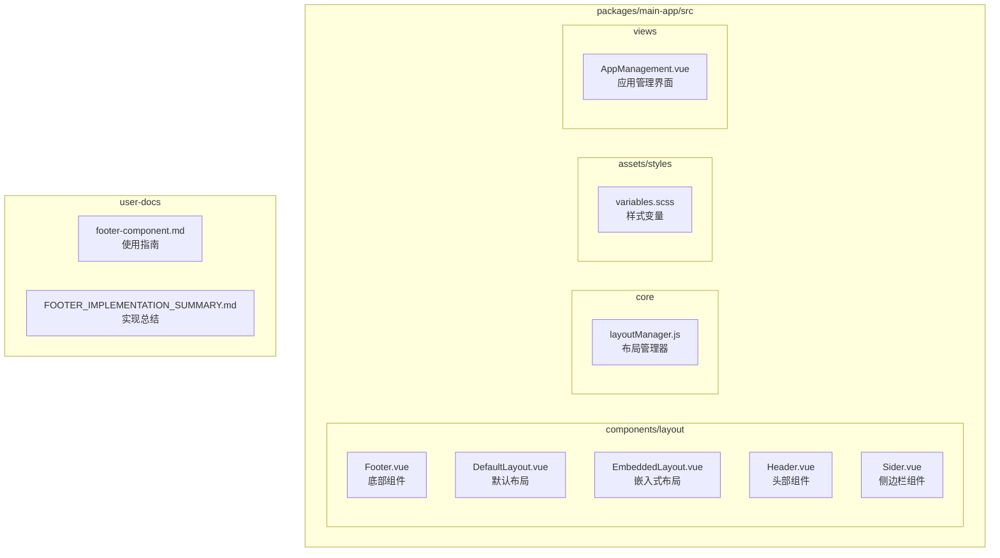
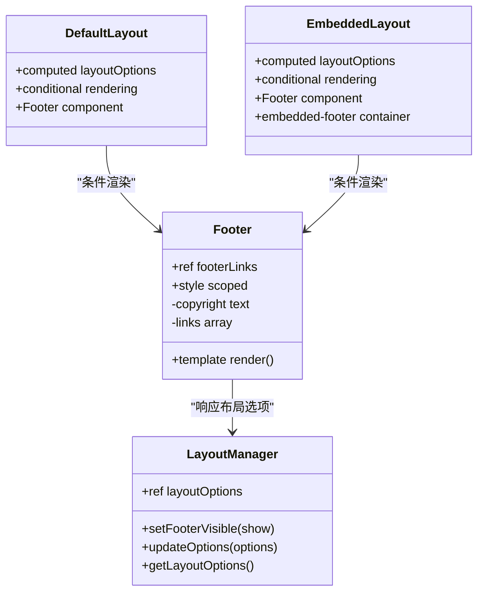
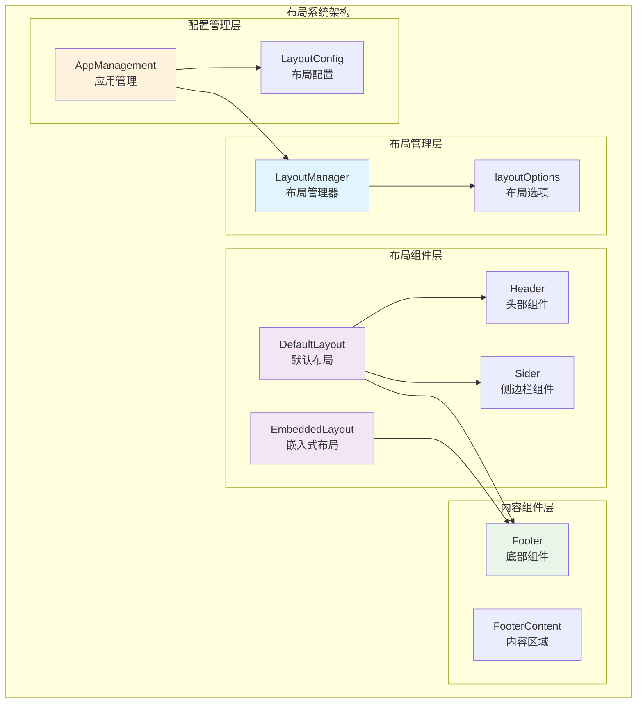
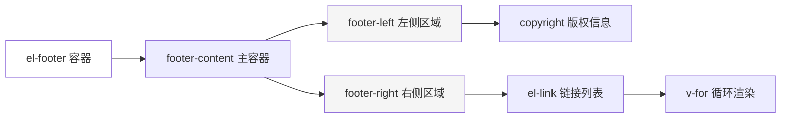
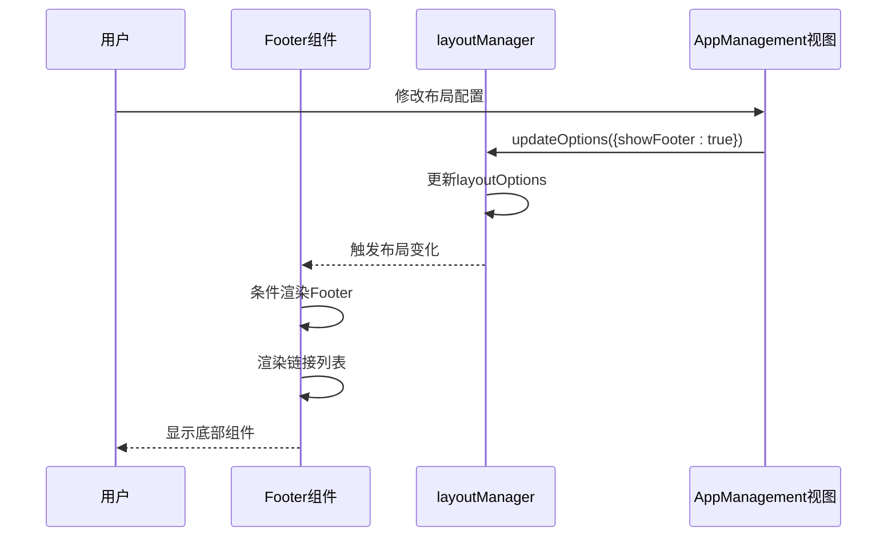
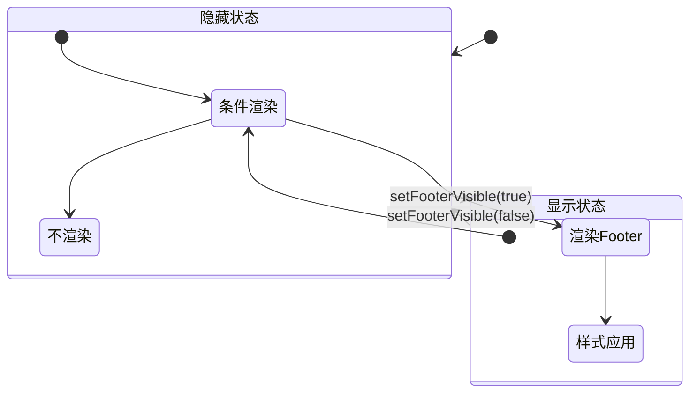
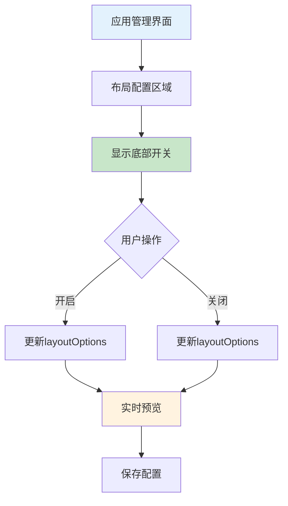
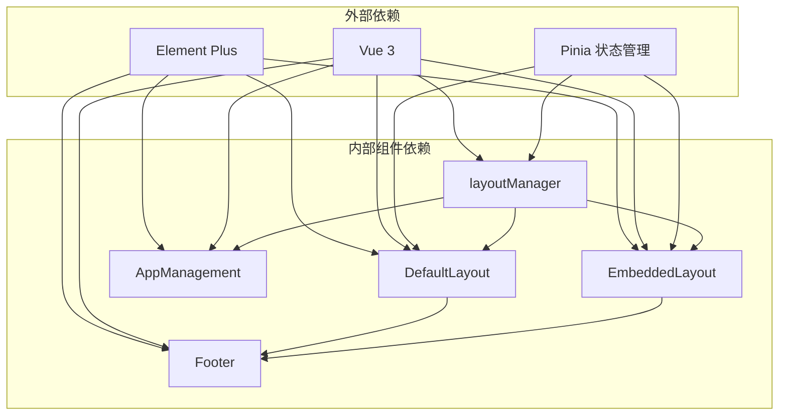
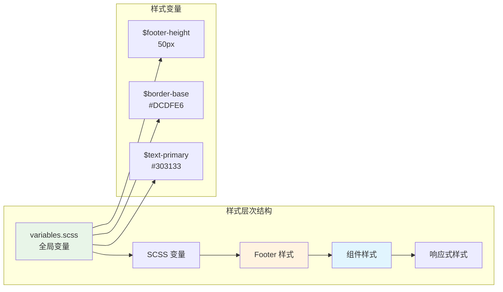
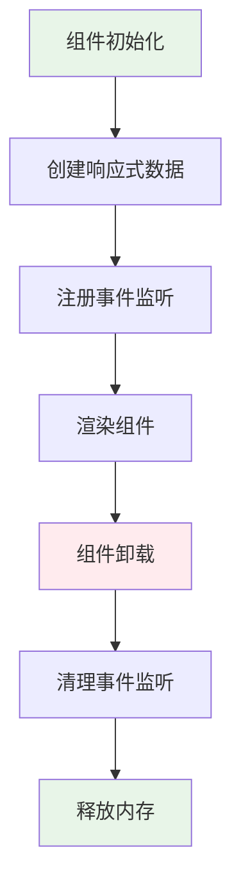

# Footer 组件

<cite>
**本文档引用的文件**
- [Footer.vue](file://packages/main-app/src/components/layout/Footer.vue)
- [layoutManager.js](file://packages/main-app/src/core/layoutManager.js)
- [DefaultLayout.vue](file://packages/main-app/src/components/layout/DefaultLayout.vue)
- [EmbeddedLayout.vue](file://packages/main-app/src/components/layout/EmbeddedLayout.vue)
- [variables.scss](file://packages/main-app/src/assets/styles/variables.scss)
- [AppManagement.vue](file://packages/main-app/src/views/AppManagement.vue)
- [footer-component.md](file://user-docs/guide/footer-component.md)
- [FOOTER_IMPLEMENTATION_SUMMARY.md](file://FOOTER_IMPLEMENTATION_SUMMARY.md)
</cite>

## 目录
1. [简介](#简介)
2. [项目结构](#项目结构)
3. [核心组件](#核心组件)
4. [架构概览](#架构概览)
5. [详细组件分析](#详细组件分析)
6. [依赖关系分析](#依赖关系分析)
7. [性能考虑](#性能考虑)
8. [故障排除指南](#故障排除指南)
9. [结论](#结论)

## 简介

Footer 组件是 Artisan 基础前端平台中的一个可复用底部布局组件，提供了统一的页面底部展示区域。该组件与现有的 Header 组件保持一致的设计风格和使用方式，支持响应式布局、可配置的快捷链接列表，并与整个布局系统无缝集成。

## 项目结构

该项目采用 Monorepo 架构，Footer 组件位于主应用包中，具体文件组织如下：

**图表来源**
- [Footer.vue](file://packages/main-app/src/components/layout/Footer.vue#L1-L72)
- [layoutManager.js](file://packages/main-app/src/core/layoutManager.js#L1-L197)
- [DefaultLayout.vue](file://packages/main-app/src/components/layout/DefaultLayout.vue#L1-L84)

**章节来源**
- [package.json](file://package.json#L1-L50)

## 核心组件

### Footer 组件核心特性

Footer 组件具有以下核心功能特性：

- **统一版权信息展示**：显示 © 年份和公司名称
- **可配置快捷链接**：支持自定义链接列表，包括文档、GitHub、关于我们等
- **响应式布局支持**：自动适应容器宽度和屏幕尺寸
- **Element Plus 集成**：使用 el-footer、el-link、el-breadcrumb 等组件
- **样式定制化**：支持通过 SCSS 变量进行样式定制

### 组件结构分析

**图表来源**
- [Footer.vue](file://packages/main-app/src/components/layout/Footer.vue#L24-L32)
- [layoutManager.js](file://packages/main-app/src/core/layoutManager.js#L115-L117)
- [DefaultLayout.vue](file://packages/main-app/src/components/layout/DefaultLayout.vue#L25-L27)

**章节来源**
- [Footer.vue](file://packages/main-app/src/components/layout/Footer.vue#L1-L72)
- [layoutManager.js](file://packages/main-app/src/core/layoutManager.js#L17-L32)

## 架构概览

Footer 组件在整个系统架构中的位置和交互关系如下：

**图表来源**
- [layoutManager.js](file://packages/main-app/src/core/layoutManager.js#L17-L32)
- [DefaultLayout.vue](file://packages/main-app/src/components/layout/DefaultLayout.vue#L33-L59)
- [EmbeddedLayout.vue](file://packages/main-app/src/components/layout/EmbeddedLayout.vue#L18-L24)

## 详细组件分析

### Footer 组件实现

#### 组件结构设计

Footer 组件采用简洁的双列布局设计：

**图表来源**
- [Footer.vue](file://packages/main-app/src/components/layout/Footer.vue#L1-L22)

#### 链接配置机制

Footer 组件支持动态链接配置，通过响应式数据实现：

**图表来源**
- [layoutManager.js](file://packages/main-app/src/core/layoutManager.js#L88-L93)
- [AppManagement.vue](file://packages/main-app/src/views/AppManagement.vue#L303-L313)

**章节来源**
- [Footer.vue](file://packages/main-app/src/components/layout/Footer.vue#L24-L32)
- [layoutManager.js](file://packages/main-app/src/core/layoutManager.js#L115-L117)

### 布局管理器集成

#### 布局选项配置

布局管理器提供完整的布局控制能力：

| 配置项 | 类型 | 默认值 | 描述 |
|--------|------|--------|------|
| showHeader | Boolean | true | 是否显示头部组件 |
| showSidebar | Boolean | true | 是否显示侧边栏组件 |
| showFooter | Boolean | false | 是否显示底部组件 |
| keepAlive | Boolean | false | 是否启用缓存 |

#### 动态控制机制

**图表来源**
- [layoutManager.js](file://packages/main-app/src/core/layoutManager.js#L115-L117)
- [DefaultLayout.vue](file://packages/main-app/src/components/layout/DefaultLayout.vue#L25-L27)

**章节来源**
- [layoutManager.js](file://packages/main-app/src/core/layoutManager.js#L23-L28)
- [AppManagement.vue](file://packages/main-app/src/views/AppManagement.vue#L127-L133)

### 应用管理界面集成

#### 可视化配置界面

应用管理界面提供了直观的 Footer 配置选项：

**图表来源**
- [AppManagement.vue](file://packages/main-app/src/views/AppManagement.vue#L127-L133)
- [AppManagement.vue](file://packages/main-app/src/views/AppManagement.vue#L303-L313)

**章节来源**
- [AppManagement.vue](file://packages/main-app/src/views/AppManagement.vue#L37-L170)

## 依赖关系分析

### 组件间依赖关系

**图表来源**
- [DefaultLayout.vue](file://packages/main-app/src/components/layout/DefaultLayout.vue#L38-L41)
- [EmbeddedLayout.vue](file://packages/main-app/src/components/layout/EmbeddedLayout.vue#L20-L21)
- [layoutManager.js](file://packages/main-app/src/core/layoutManager.js#L1-L1)

### 样式依赖关系

Footer 组件的样式系统采用模块化设计：

**图表来源**
- [variables.scss](file://packages/main-app/src/assets/styles/variables.scss#L33)
- [Footer.vue](file://packages/main-app/src/components/layout/Footer.vue#L34-L70)

**章节来源**
- [variables.scss](file://packages/main-app/src/assets/styles/variables.scss#L1-L41)
- [Footer.vue](file://packages/main-app/src/components/layout/Footer.vue#L34-L70)

## 性能考虑

### 渲染优化策略

Footer 组件采用了多项性能优化措施：

1. **条件渲染优化**：仅在需要时渲染底部组件
2. **响应式数据管理**：使用 ref 和 computed 确保最小化重渲染
3. **样式作用域隔离**：scoped 样式避免样式冲突
4. **组件懒加载**：通过动态导入减少初始加载时间

### 内存管理

**图表来源**
- [Footer.vue](file://packages/main-app/src/components/layout/Footer.vue#L24-L32)
- [layoutManager.js](file://packages/main-app/src/core/layoutManager.js#L133-L146)

## 故障排除指南

### 常见问题及解决方案

#### 问题1：Footer 组件不显示

**可能原因**：
- `showFooter` 选项未设置为 true
- 布局类型不支持 Footer 显示
- 样式冲突导致组件不可见

**解决步骤**：
1. 检查布局选项配置
2. 验证布局类型支持 Footer
3. 检查样式冲突

#### 问题2：链接点击无效

**可能原因**：
- 链接 URL 配置错误
- target 属性设置问题
- 跨域访问限制

**解决步骤**：
1. 验证链接 URL 格式
2. 检查 target 属性设置
3. 测试跨域访问权限

#### 问题3：样式显示异常

**可能原因**：
- SCSS 变量未正确导入
- 样式优先级冲突
- 响应式断点设置不当

**解决步骤**：
1. 确认变量导入路径
2. 检查样式优先级
3. 验证响应式断点

**章节来源**
- [AppManagement.vue](file://packages/main-app/src/views/AppManagement.vue#L149-L156)
- [Footer.vue](file://packages/main-app/src/components/layout/Footer.vue#L34-L70)

## 结论

Footer 组件作为 Artisan 基础前端平台的重要组成部分，成功实现了以下目标：

### 技术成就

1. **组件化设计**：独立可复用的 Footer 组件，符合现代前端开发最佳实践
2. **响应式支持**：完全支持响应式布局，适配各种设备和屏幕尺寸
3. **配置灵活性**：支持运行时动态控制，满足不同业务场景需求
4. **样式定制化**：通过 SCSS 变量实现灵活的样式定制
5. **可视化配置**：应用管理界面提供直观的配置体验

### 架构优势

- **解耦设计**：Footer 组件与布局系统松耦合，便于维护和扩展
- **统一管理**：通过 layoutManager 统一管理布局配置
- **类型安全**：完整的 TypeScript 类型定义确保开发安全性
- **性能优化**：采用多项性能优化策略，确保良好的用户体验

### 发展前景

Footer 组件为后续的功能扩展奠定了良好基础，未来可以考虑：

1. **国际化支持**：添加多语言支持功能
2. **动态配置**：支持从配置文件动态加载链接列表
3. **主题系统**：集成完整的主题定制系统
4. **无障碍访问**：增强无障碍访问支持
5. **SEO 优化**：添加 SEO 友好的元数据支持

通过本次实现，Footer 组件不仅满足了当前的功能需求，更为整个系统的可扩展性和可维护性做出了重要贡献。