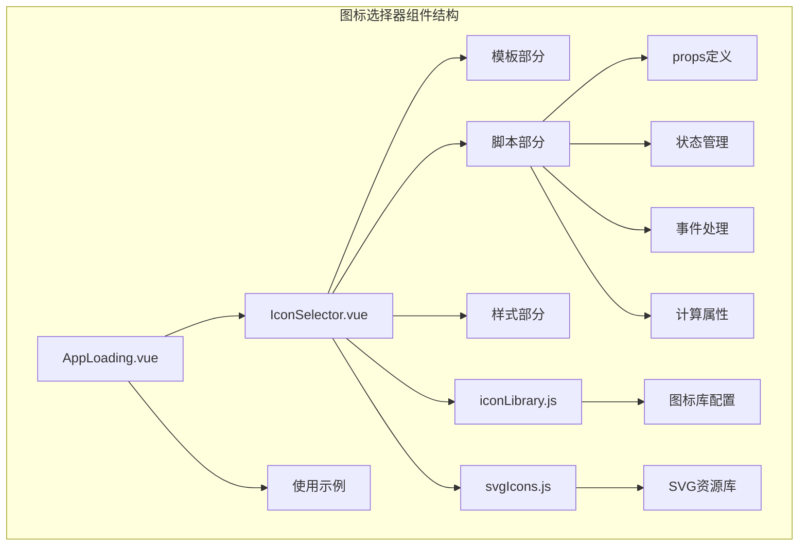
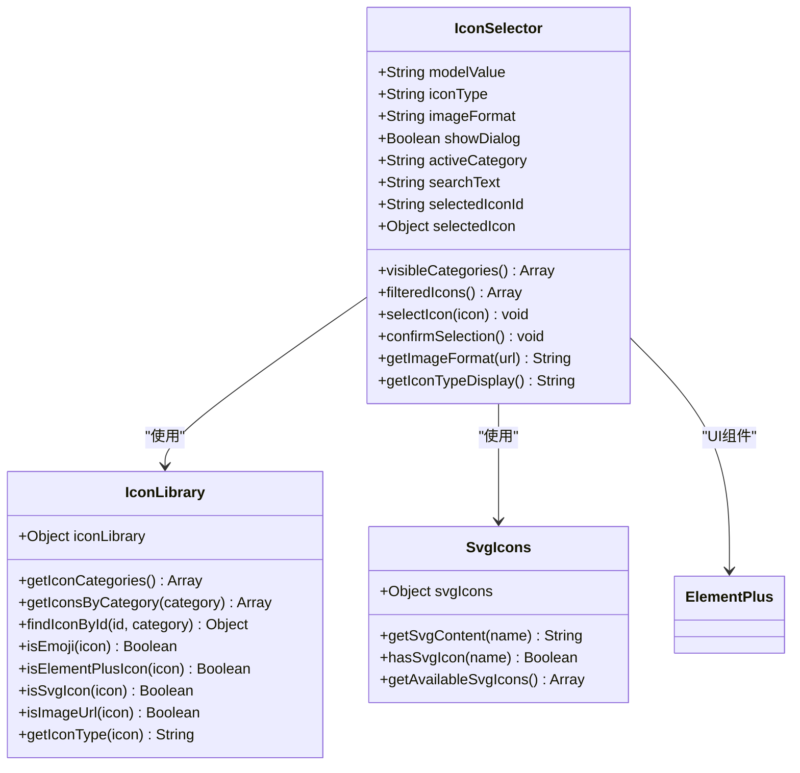
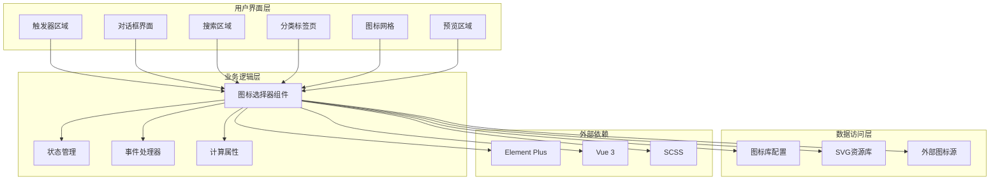
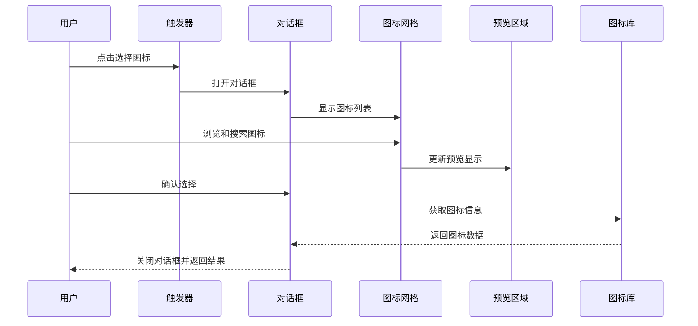
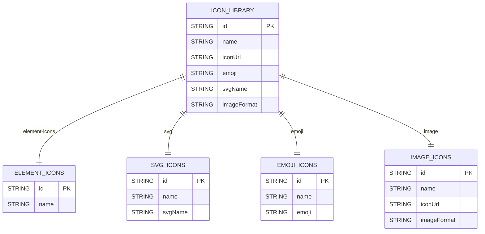
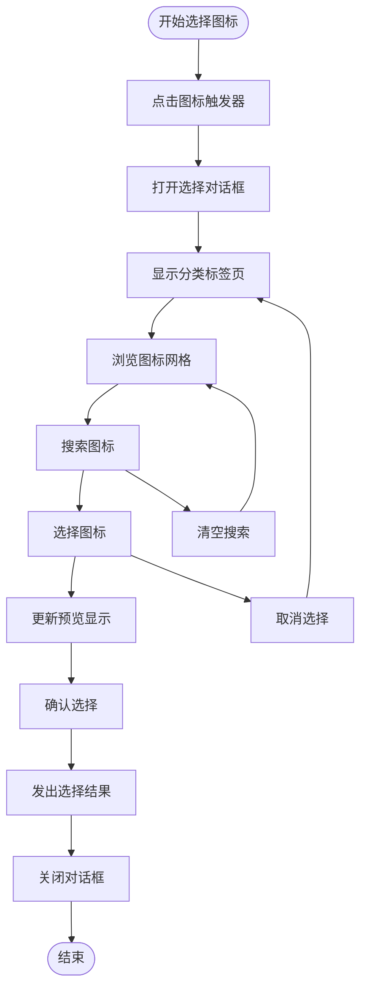
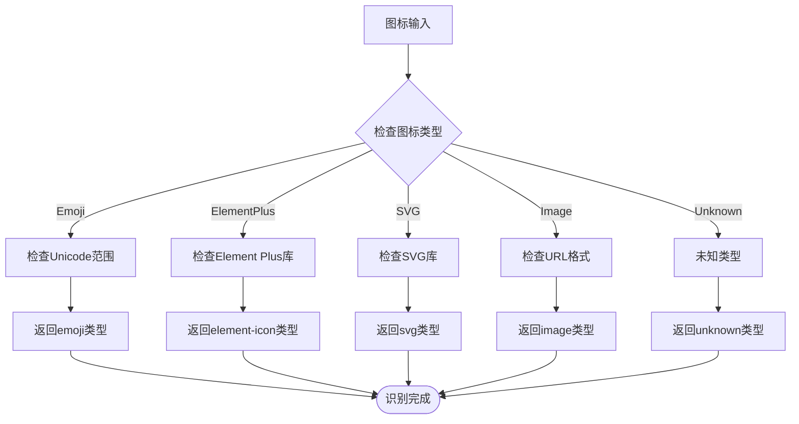
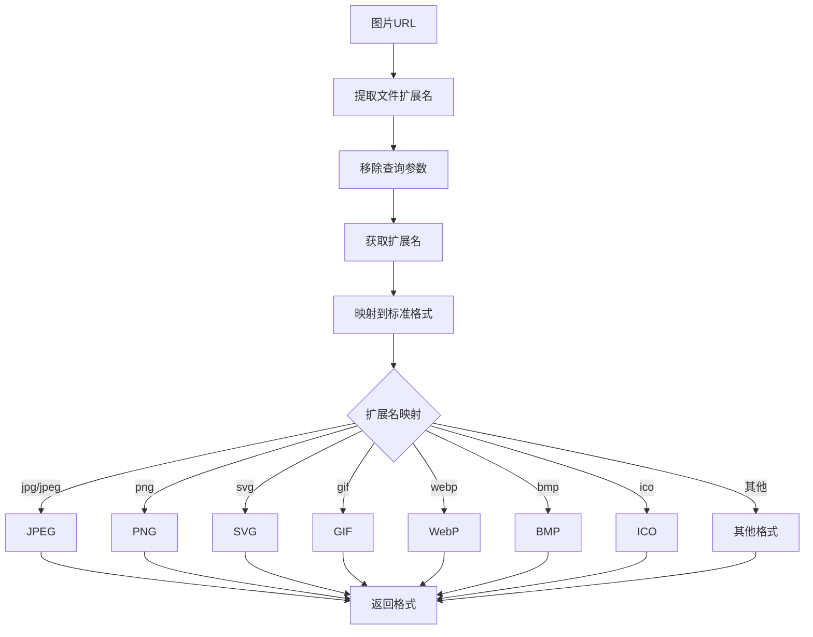
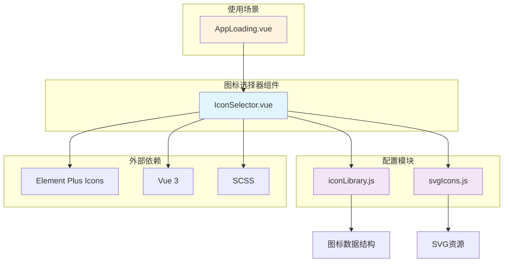
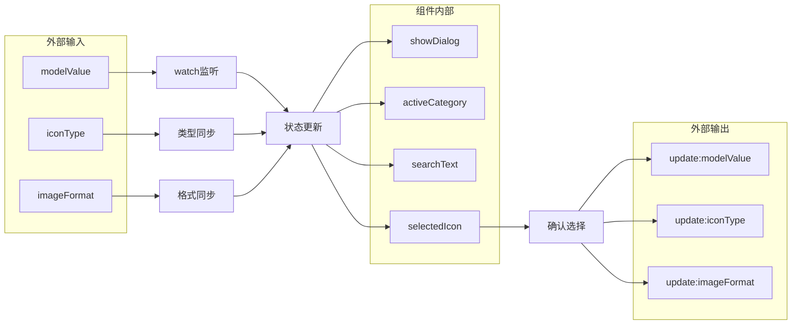

# 图标选择器组件

<cite>
**本文档引用的文件**
- [IconSelector.vue](file://packages/main-app/src/components/IconSelector.vue)
- [iconLibrary.js](file://packages/main-app/src/config/iconLibrary.js)
- [svgIcons.js](file://packages/main-app/src/config/svgIcons.js)
- [AppLoading.vue](file://packages/main-app/src/views/AppLoading.vue)
</cite>

## 目录
1. [简介](#简介)
2. [项目结构](#项目结构)
3. [核心组件](#核心组件)
4. [架构概览](#架构概览)
5. [详细组件分析](#详细组件分析)
6. [依赖关系分析](#依赖关系分析)
7. [性能考虑](#性能考虑)
8. [故障排除指南](#故障排除指南)
9. [结论](#结论)

## 简介

图标选择器组件是一个功能完整的图标选择界面，允许用户从多种图标类型中选择合适的图标。该组件支持四种主要的图标类型：Element Plus 内置图标、SVG 自定义图标、Emoji 表情符号和远程图片。组件提供了直观的图形界面，包含图标网格浏览、搜索功能、实时预览和分类切换等特性。

该组件采用现代化的 Vue 3 Composition API 构建，使用 Element Plus 作为 UI 组件库，实现了响应式设计和良好的用户体验。组件设计遵循单一职责原则，将图标选择逻辑与显示逻辑分离，便于维护和扩展。

## 项目结构

图标选择器组件位于主应用包中，采用模块化组织结构：

**图表来源**
- [IconSelector.vue:1-629](file://packages/main-app/src/components/IconSelector.vue#L1-L629)
- [iconLibrary.js:1-479](file://packages/main-app/src/config/iconLibrary.js#L1-L479)
- [svgIcons.js:1-86](file://packages/main-app/src/config/svgIcons.js#L1-L86)

**章节来源**
- [IconSelector.vue:1-629](file://packages/main-app/src/components/IconSelector.vue#L1-L629)
- [iconLibrary.js:1-479](file://packages/main-app/src/config/iconLibrary.js#L1-L479)

## 核心组件

### 组件架构设计

图标选择器组件采用了清晰的分层架构设计：

**图表来源**
- [IconSelector.vue:128-369](file://packages/main-app/src/components/IconSelector.vue#L128-L369)
- [iconLibrary.js:19-479](file://packages/main-app/src/config/iconLibrary.js#L19-L479)
- [svgIcons.js:7-86](file://packages/main-app/src/config/svgIcons.js#L7-L86)

### 主要功能特性

组件具备以下核心功能：

1. **多类型图标支持**：支持 Element Plus 图标、SVG 图标、Emoji 表情和远程图片
2. **智能分类管理**：提供四个主要分类的图标网格展示
3. **实时搜索功能**：支持按名称和 ID 搜索图标
4. **动态预览系统**：实时显示所选图标的预览效果
5. **响应式设计**：适配不同屏幕尺寸和设备
6. **错误处理机制**：优雅处理图片加载失败等异常情况

**章节来源**
- [IconSelector.vue:134-147](file://packages/main-app/src/components/IconSelector.vue#L134-L147)
- [IconSelector.vue:157-181](file://packages/main-app/src/components/IconSelector.vue#L157-L181)

## 架构概览

### 整体架构设计

**图表来源**
- [IconSelector.vue:1-126](file://packages/main-app/src/components/IconSelector.vue#L1-L126)
- [iconLibrary.js:1-17](file://packages/main-app/src/config/iconLibrary.js#L1-L17)

### 数据流架构

**图表来源**
- [IconSelector.vue:26-124](file://packages/main-app/src/components/IconSelector.vue#L26-L124)
- [IconSelector.vue:247-279](file://packages/main-app/src/components/IconSelector.vue#L247-L279)

## 详细组件分析

### 图标库配置系统

图标库采用集中式配置管理，支持四种主要的图标类型：

**图表来源**
- [iconLibrary.js:19-377](file://packages/main-app/src/config/iconLibrary.js#L19-L377)

#### Element Plus 图标集

Element Plus 图标集包含完整的 332 个官方图标，涵盖系统、箭头、文档、媒体、交通、食物、物品和天气等多个类别。每个图标都包含唯一的 ID 和中文名称，便于用户理解和使用。

#### SVG 自定义图标库

SVG 图标库提供了一系列常用的自定义图标，包括技术栈标志（Vue、React、Angular）和通用图标（星形、爱心、用户、设置等）。这些图标以 SVG 字符串形式存储，可以直接渲染到页面中。

#### Emoji 表情符号集合

Emoji 图标库包含了 20 个常用的 Unicode 表情符号，为界面添加了丰富的表情元素。所有 Emoji 都经过 Unicode 范围验证，确保兼容性。

#### 远程图片图标集

远程图片图标集提供了四个占位符图片，使用 Picsum 服务生成的随机图片。这些图片展示了不同格式的支持情况，包括 JPEG、PNG、SVG 和 GIF。

**章节来源**
- [iconLibrary.js:21-377](file://packages/main-app/src/config/iconLibrary.js#L21-L377)

### 图标选择流程

**图表来源**
- [IconSelector.vue:189-279](file://packages/main-app/src/components/IconSelector.vue#L189-L279)

### 图标类型识别机制

组件实现了智能的图标类型识别系统，能够自动判断用户输入的图标类型：

**图表来源**
- [iconLibrary.js:415-479](file://packages/main-app/src/config/iconLibrary.js#L415-L479)

**章节来源**
- [IconSelector.vue:335-368](file://packages/main-app/src/components/IconSelector.vue#L335-L368)
- [iconLibrary.js:415-479](file://packages/main-app/src/config/iconLibrary.js#L415-L479)

### 图片格式检测系统

对于远程图片类型的图标，组件提供了智能的图片格式检测功能：

**图表来源**
- [IconSelector.vue:299-324](file://packages/main-app/src/components/IconSelector.vue#L299-L324)

**章节来源**
- [IconSelector.vue:299-324](file://packages/main-app/src/components/IconSelector.vue#L299-L324)

## 依赖关系分析

### 组件依赖图

**图表来源**
- [IconSelector.vue:129-132](file://packages/main-app/src/components/IconSelector.vue#L129-L132)
- [AppLoading.vue:359-360](file://packages/main-app/src/views/AppLoading.vue#L359-L360)

### 数据依赖关系

组件的数据流遵循单向数据流原则，确保数据的一致性和可预测性：

**图表来源**
- [IconSelector.vue:134-149](file://packages/main-app/src/components/IconSelector.vue#L134-L149)
- [IconSelector.vue:335-368](file://packages/main-app/src/components/IconSelector.vue#L335-L368)

**章节来源**
- [IconSelector.vue:134-149](file://packages/main-app/src/components/IconSelector.vue#L134-L149)
- [IconSelector.vue:335-368](file://packages/main-app/src/components/IconSelector.vue#L335-L368)

## 性能考虑

### 渲染优化策略

图标选择器组件采用了多项性能优化措施：

1. **虚拟滚动支持**：对于大量图标的场景，可以考虑实现虚拟滚动以减少 DOM 元素数量
2. **懒加载机制**：SVG 图标和远程图片采用懒加载策略，提升初始渲染速度
3. **缓存机制**：图标库数据和 SVG 内容进行内存缓存，避免重复计算
4. **防抖搜索**：搜索功能实现防抖机制，减少不必要的重新渲染

### 内存管理

组件在设计时充分考虑了内存使用效率：

- 图标数据采用扁平化存储，避免深层嵌套导致的内存浪费
- SVG 字符串按需渲染，不占用额外的 DOM 空间
- 图片加载失败时及时清理占位符元素，防止内存泄漏

### 网络性能

对于远程图片类型的图标，组件提供了以下优化：

- 图片格式检测采用异步处理，避免阻塞主线程
- 支持图片格式自动识别，减少手动配置的工作量
- 错误处理机制确保网络异常时的用户体验

## 故障排除指南

### 常见问题及解决方案

#### 图标无法显示

**问题描述**：选择的图标在界面上无法正常显示

**可能原因**：
1. 图标类型识别失败
2. SVG 字符串格式错误
3. 远程图片加载超时

**解决方法**：
1. 检查图标 ID 是否存在于对应的图标库中
2. 验证 SVG 字符串的 XML 格式是否正确
3. 确认远程图片的 URL 是否有效且可访问

#### 搜索功能异常

**问题描述**：搜索框无法正确过滤图标

**可能原因**：
1. 搜索文本编码问题
2. 图标名称包含特殊字符
3. 计算属性缓存未更新

**解决方法**：
1. 确保搜索文本使用 UTF-8 编码
2. 检查图标名称是否包含不可见字符
3. 强制刷新计算属性缓存

#### 图片加载失败

**问题描述**：远程图片图标无法加载显示

**可能原因**：
1. 网络连接不稳定
2. 图片 URL 格式不正确
3. CORS 跨域限制

**解决方法**：
1. 检查网络连接状态
2. 验证图片 URL 的完整性和正确性
3. 配置服务器的 CORS 头部信息

**章节来源**
- [IconSelector.vue:230-244](file://packages/main-app/src/components/IconSelector.vue#L230-L244)

### 调试技巧

1. **开发者工具**：使用浏览器开发者工具监控组件的生命周期和状态变化
2. **控制台日志**：在关键函数中添加 console.log 输出调试信息
3. **断点调试**：在 watch 监听器和事件处理器中设置断点
4. **性能分析**：使用性能面板分析组件的渲染性能

## 结论

图标选择器组件是一个设计精良、功能完善的 UI 组件，具有以下显著特点：

1. **功能完整性**：支持四种主要的图标类型，满足大多数应用场景需求
2. **用户体验优秀**：提供直观的图形界面和流畅的交互体验
3. **代码质量高**：采用现代化的 Vue 3 技术栈，代码结构清晰易维护
4. **扩展性强**：模块化的架构设计便于功能扩展和定制

该组件在实际项目中展现了良好的稳定性和可靠性，为用户提供了便捷的图标选择体验。通过合理的架构设计和性能优化，组件能够在各种使用场景下保持高效的运行表现。

未来可以考虑的功能增强包括：支持自定义图标上传、实现图标收藏功能、增加图标导入导出能力等，进一步提升组件的实用性和灵活性。