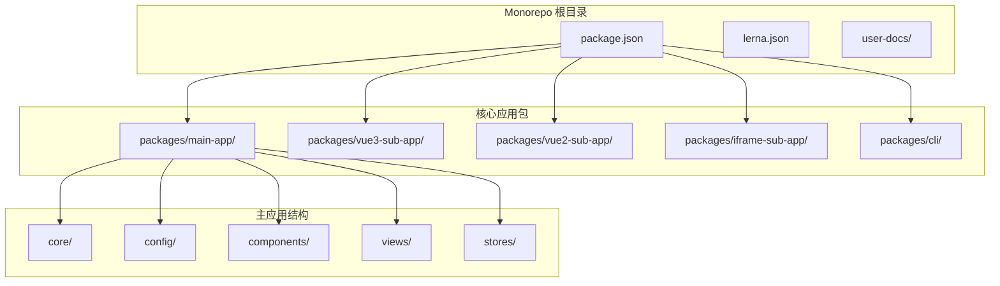
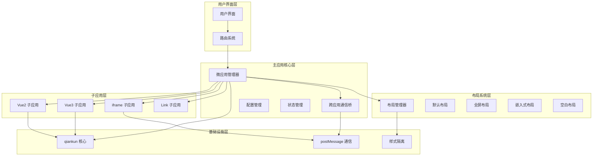
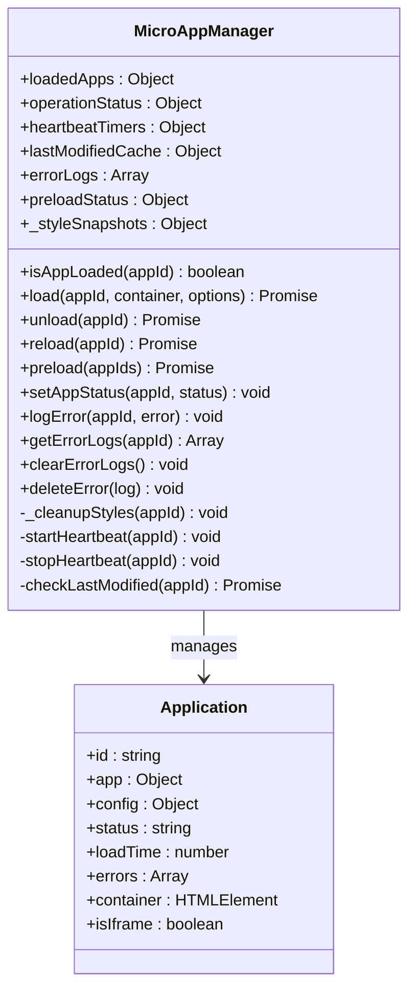
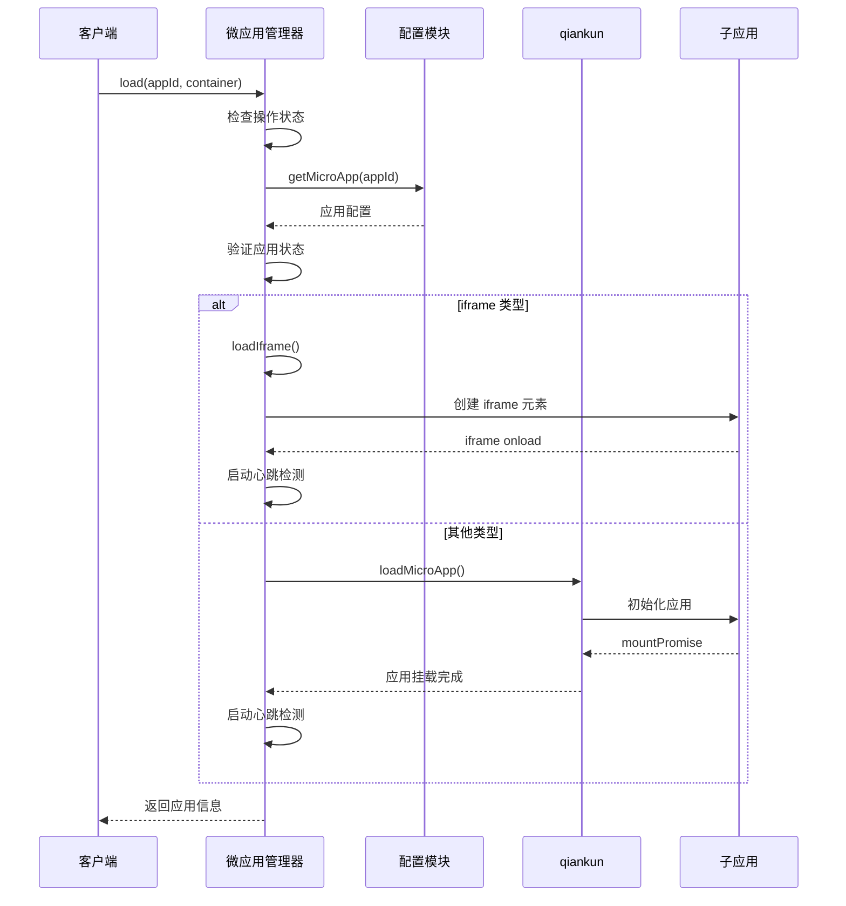
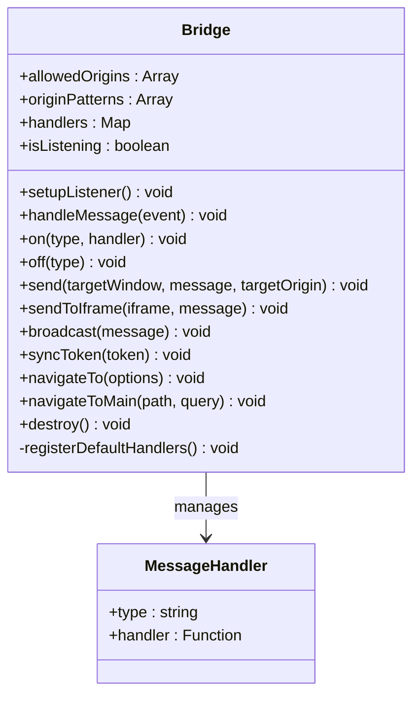
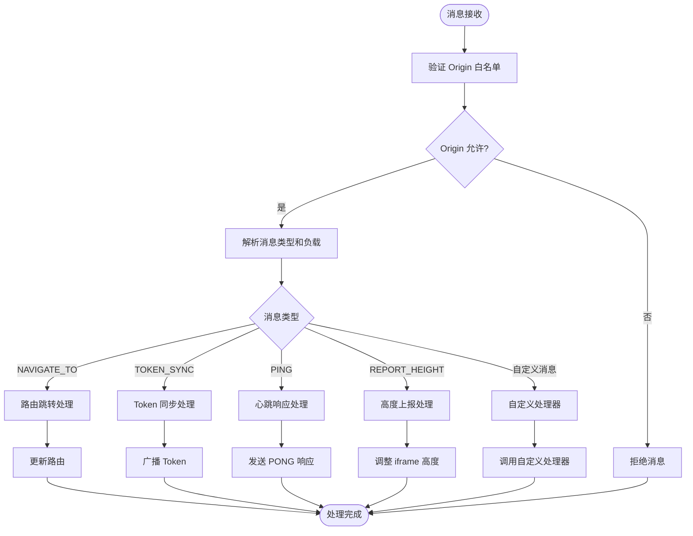

# 多应用同屏布局系统

<cite>
**本文档引用的文件**
- [README.md](file://README.md)
- [package.json](file://package.json)
- [lerna.json](file://lerna.json)
- [QUICK_START.md](file://QUICK_START.md)
- [SUB_APP_INTEGRATION.md](file://SUB_APP_INTEGRATION.md)
- [packages/main-app/src/core/microAppManager.js](file://packages/main-app/src/core/microAppManager.js)
- [packages/main-app/src/core/bridge.js](file://packages/main-app/src/core/bridge.js)
- [packages/main-app/src/config/microApps.js](file://packages/main-app/src/config/microApps.js)
- [packages/main-app/package.json](file://packages/main-app/package.json)
- [packages/vue3-sub-app/package.json](file://packages/vue3-sub-app/package.json)
- [packages/vue2-sub-app/package.json](file://packages/vue2-sub-app/package.json)
- [packages/iframe-sub-app/package.json](file://packages/iframe-sub-app/package.json)
</cite>

## 目录
1. [简介](#简介)
2. [项目结构](#项目结构)
3. [核心组件](#核心组件)
4. [架构概览](#架构概览)
5. [详细组件分析](#详细组件分析)
6. [依赖关系分析](#依赖关系分析)
7. [性能考虑](#性能考虑)
8. [故障排除指南](#故障排除指南)
9. [结论](#结论)

## 简介

Artisan 是一个企业级微前端基础平台脚手架，采用 Monorepo 架构，基于 qiankun 的 loadMicroApp 模式实现主应用对多类型子应用的统一加载与管理。该系统的核心特色包括：

- **多应用同屏布局系统**：支持在同一页面加载多个不同子应用实例
- **四种布局类型**：default（默认）、full（全屏）、embedded（嵌入式）、blank（空白）
- **跨应用通信机制**：基于 postMessage 的 Bridge 机制
- **多种子应用支持**：Vue3/Vue2/iframe/link 四种应用类型全覆盖
- **高级功能**：预加载系统、热更新检测、心跳检测、错误日志管理

## 项目结构

该项目采用 Lerna + npm workspace 的 Monorepo 架构，包含以下主要包：

**图表来源**
- [package.json:1-52](file://package.json#L1-L52)
- [lerna.json:1-25](file://lerna.json#L1-L25)

**章节来源**
- [README.md:159-181](file://README.md#L159-L181)
- [package.json:6-9](file://package.json#L6-L9)

## 核心组件

### 微应用管理器 (MicroAppManager)

微应用管理器是整个系统的核心组件，负责管理所有子应用的生命周期：

- **应用加载与卸载**：支持四种应用类型（vue3、vue2、iframe、link）
- **并发控制**：防止同一应用的重复加载
- **状态管理**：跟踪应用的加载状态、错误信息
- **心跳检测**：30秒间隔检测应用健康状态
- **热更新检测**：基于 lastModified 头部的自动热更新

### 跨应用通信桥 (Bridge)

Bridge 提供了主应用与子应用之间的双向通信能力：

- **消息类型**：支持 NAVIGATE_TO、TOKEN_SYNC、PING/PONG 等内置消息
- **安全机制**：基于 Origin 校验的 postMessage 通信
- **动态匹配**：支持正则表达式的动态 Origin 匹配
- **广播功能**：支持向所有子应用广播消息

### 微应用配置管理

提供灵活的微应用配置管理机制：

- **数据源模式**：支持 mock 和 API 两种数据源
- **布局配置标准化**：根据布局类型自动应用默认配置
- **动态更新**：支持运行时更新应用配置

**章节来源**
- [packages/main-app/src/core/microAppManager.js:1-560](file://packages/main-app/src/core/microAppManager.js#L1-L560)
- [packages/main-app/src/core/bridge.js:1-258](file://packages/main-app/src/core/bridge.js#L1-L258)
- [packages/main-app/src/config/microApps.js:1-184](file://packages/main-app/src/config/microApps.js#L1-L184)

## 架构概览

系统采用分层架构设计，实现了主应用与子应用的解耦：

**图表来源**
- [packages/main-app/src/core/microAppManager.js:11-34](file://packages/main-app/src/core/microAppManager.js#L11-L34)
- [packages/main-app/src/core/bridge.js:9-40](file://packages/main-app/src/core/bridge.js#L9-L40)

## 详细组件分析

### 微应用管理器详细分析

微应用管理器实现了完整的应用生命周期管理：

**图表来源**
- [packages/main-app/src/core/microAppManager.js:11-34](file://packages/main-app/src/core/microAppManager.js#L11-L34)

#### 应用加载流程

**图表来源**
- [packages/main-app/src/core/microAppManager.js:52-176](file://packages/main-app/src/core/microAppManager.js#L52-L176)

**章节来源**
- [packages/main-app/src/core/microAppManager.js:52-176](file://packages/main-app/src/core/microAppManager.js#L52-L176)

### 跨应用通信桥详细分析

Bridge 实现了安全的跨应用通信机制：

**图表来源**
- [packages/main-app/src/core/bridge.js:9-40](file://packages/main-app/src/core/bridge.js#L9-L40)

#### 消息处理流程

**图表来源**
- [packages/main-app/src/core/bridge.js:45-91](file://packages/main-app/src/core/bridge.js#L45-L91)

**章节来源**
- [packages/main-app/src/core/bridge.js:45-91](file://packages/main-app/src/core/bridge.js#L45-L91)

### 布局系统详细分析

系统支持四种布局类型，每种布局都有其特定的使用场景：

| 布局类型 | 描述 | 使用场景 | 关键特性 |
|---------|------|---------|----------|
| **default** | 默认布局（含头部和侧边栏） | 后台管理系统、企业应用 | 标准化导航结构，支持菜单折叠 |
| **full** | 全屏布局（无导航元素） | 数据大屏、沉浸式展示 | 100%屏幕适配，无任何导航干扰 |
| **embedded** | 嵌入式布局（轻量级） | 嵌入第三方应用、轻量化展示 | 最小化导航元素，适合嵌入场景 |
| **blank** | 空白布局（仅内容） | 登录页、欢迎页、极简页面 | 完全空白，仅显示内容区域 |

**章节来源**
- [README.md:251-259](file://README.md#L251-L259)

## 依赖关系分析

系统依赖关系清晰，各组件职责明确：

```mermaid
graph TB
subgraph "主应用依赖"
MainVue[Vue 3.5.29]
MainRouter[Vue Router 5.0.3]
MainPinia[Pinia 3.0.4]
MainQiankun[qiankun 2.10.16]
MainElement[Element Plus 2.13.2]
end
subgraph "子应用依赖"
Vue3[Vue 3.5.29]
Vue3Router[Vue Router 5.0.3]
Vue3Element[Element Plus 2.13.2]
Vue2[Vue 2.7.16]
Vue2Router[Vue Router 3.6.5]
Vue2UI[Element UI 2.15.14]
end
subgraph "开发工具"
Vite[Vite 7.3.1]
ESLint[ESLint 8.57.0]
TypeScript[TypeScript 5.9.3]
end
subgraph "基础设施"
Lerna[Lerna 9.0.4]
GridLayout[Grid Layout Plus 1.1.1]
Axios[Axios 1.13.5]
Lodash[Lodash-es 4.17.21]
end
MainVue --> MainRouter
MainVue --> MainPinia
MainVue --> MainQiankun
MainVue --> MainElement
Vue3 --> Vue3Router
Vue3 --> Vue3Element
Vue2 --> Vue2Router
Vue2 --> Vue2UI
MainVue --> Vite
Vue3 --> Vite
Vue2 --> Vite
MainVue --> ESLint
Vue3 --> ESLint
Vue2 --> ESLint
MainVue --> GridLayout
MainVue --> Axios
MainVue --> Lodash
```

**图表来源**
- [packages/main-app/package.json:15-26](file://packages/main-app/package.json#L15-L26)
- [packages/vue3-sub-app/package.json:14-18](file://packages/vue3-sub-app/package.json#L14-L18)
- [packages/vue2-sub-app/package.json:11-16](file://packages/vue2-sub-app/package.json#L11-L16)

**章节来源**
- [packages/main-app/package.json:15-26](file://packages/main-app/package.json#L15-L26)
- [packages/vue3-sub-app/package.json:14-18](file://packages/vue3-sub-app/package.json#L14-L18)
- [packages/vue2-sub-app/package.json:11-16](file://packages/vue2-sub-app/package.json#L11-L16)

## 性能考虑

系统在设计时充分考虑了性能优化：

### 预加载机制
- 使用 qiankun 的 prefetch API 提升应用访问速度
- 支持按需预加载和批量预加载
- 预加载状态实时跟踪和管理

### 热更新检测
- 基于 lastModified 头部的自动热更新
- 30秒间隔的心跳检测机制
- 应用健康状态监控

### 样式隔离
- qiankun 的 experimentalStyleIsolation 模式
- 自动清理子应用注入的样式标签
- 防止样式污染主应用

### 内存管理
- 完整的应用卸载流程
- 响应式系统的正确清理
- 容器内容的彻底清空

## 故障排除指南

### 常见问题及解决方案

#### 端口冲突问题
**症状**：应用启动失败，提示端口被占用
**解决方案**：
- 检查端口占用情况：`lsof -i :端口号`
- 修改应用配置文件中的端口号
- 关闭占用端口的进程

#### CORS 跨域问题
**症状**：子应用无法加载，出现跨域错误
**解决方案**：
- 确保子应用配置了正确的 CORS 响应头
- 在开发环境中设置 `Access-Control-Allow-Origin: '*'`
- 检查服务器的 CORS 配置

#### 样式冲突问题
**症状**：主应用样式被子应用覆盖
**解决方案**：
- 使用 scoped 样式或 CSS Modules
- 避免使用全局样式重置
- 使用命名空间隔离样式

#### 路由跳转失败
**症状**：点击链接后 URL 变化但页面不刷新
**解决方案**：
- 确保子应用使用正确的路由模式（Memory/Abstract）
- 在 qiankun 环境下手动导航到初始路由
- 检查 activeRule 配置是否正确

**章节来源**
- [QUICK_START.md:274-363](file://QUICK_START.md#L274-L363)
- [SUB_APP_INTEGRATION.md:651-795](file://SUB_APP_INTEGRATION.md#L651-L795)

## 结论

Artisan 多应用同屏布局系统是一个功能完善、架构清晰的企业级微前端解决方案。系统的主要优势包括：

1. **完整的生命周期管理**：从应用加载到卸载的全流程管理
2. **灵活的布局系统**：四种布局类型满足不同业务场景需求
3. **安全的通信机制**：基于 Origin 校验的跨应用通信
4. **高性能的架构设计**：预加载、热更新、样式隔离等优化措施
5. **完善的错误处理**：全面的错误日志记录和管理

该系统为企业级微前端应用提供了坚实的基础，支持多应用同屏展示和复杂的企业应用场景。通过合理的架构设计和丰富的功能特性，Artisan 为微前端技术的落地提供了可靠的解决方案。