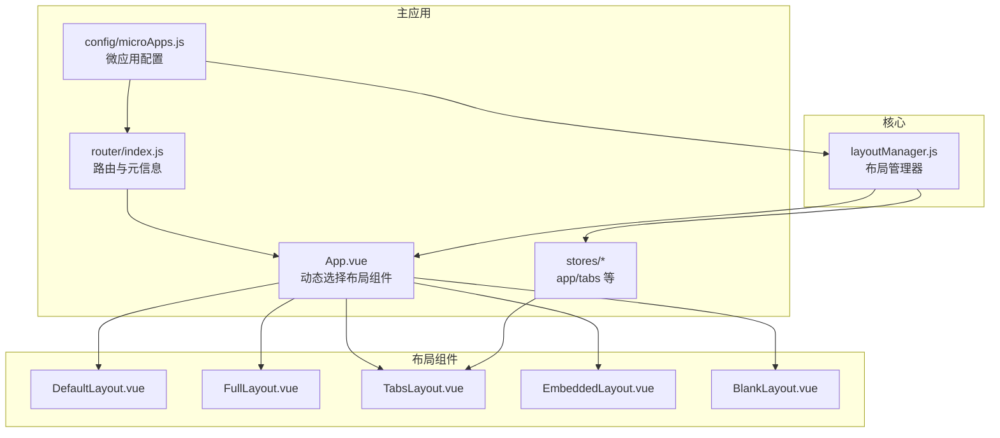
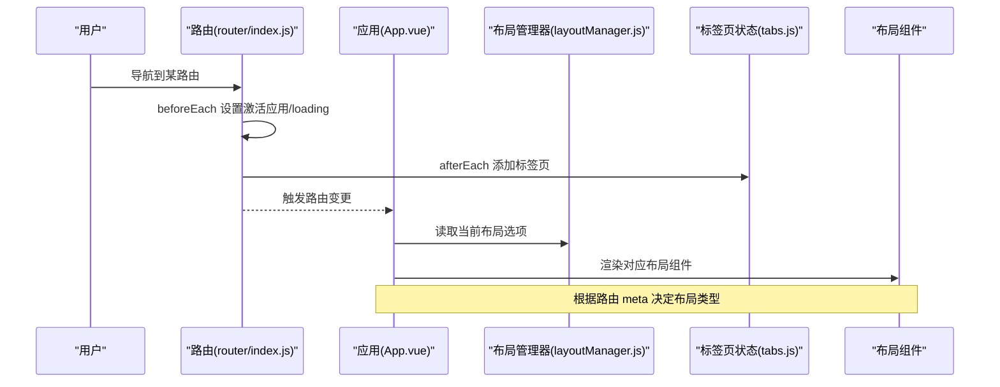
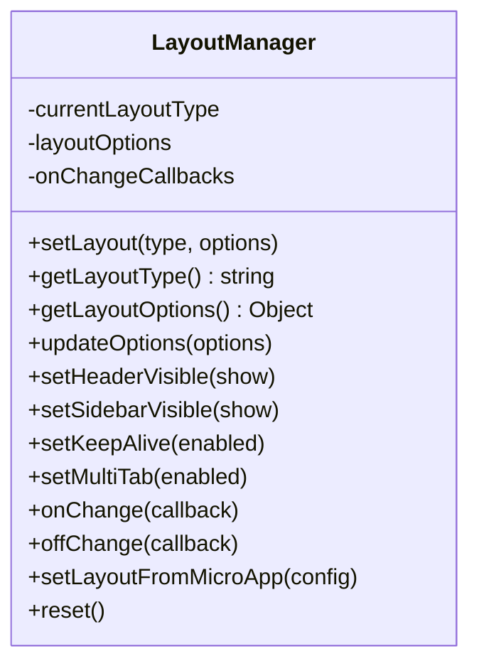
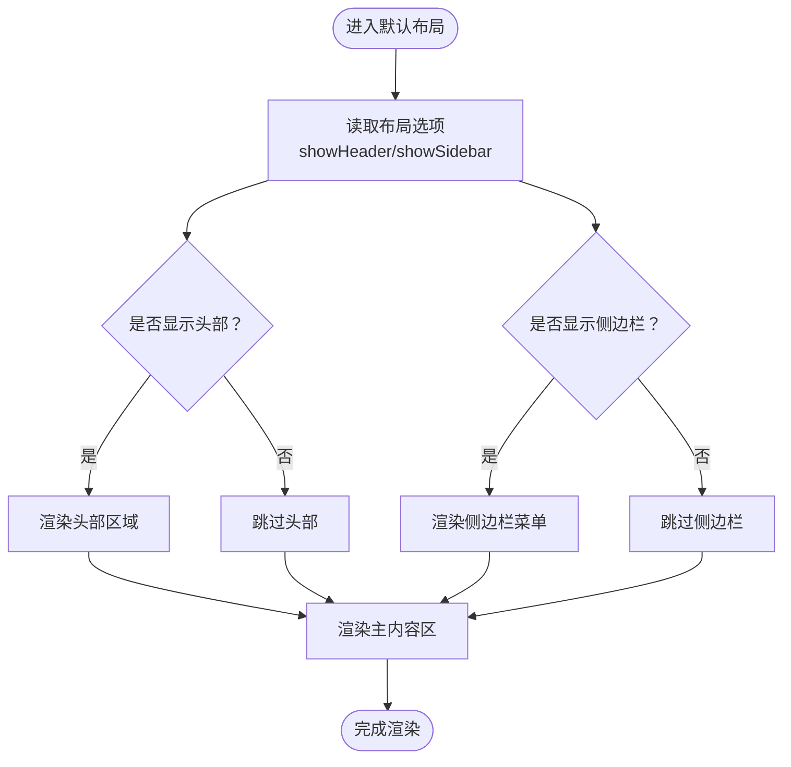
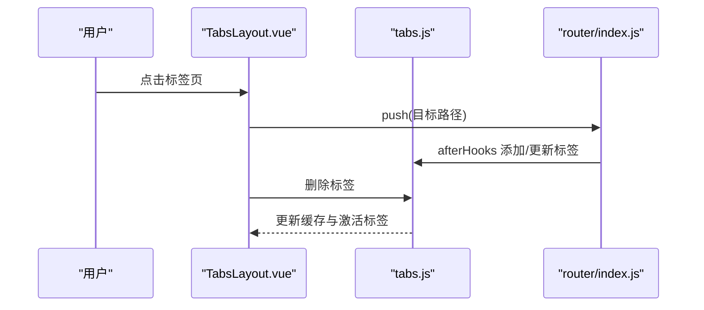
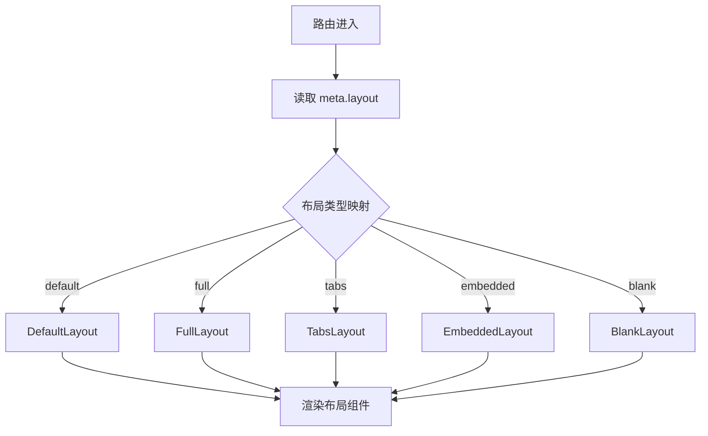
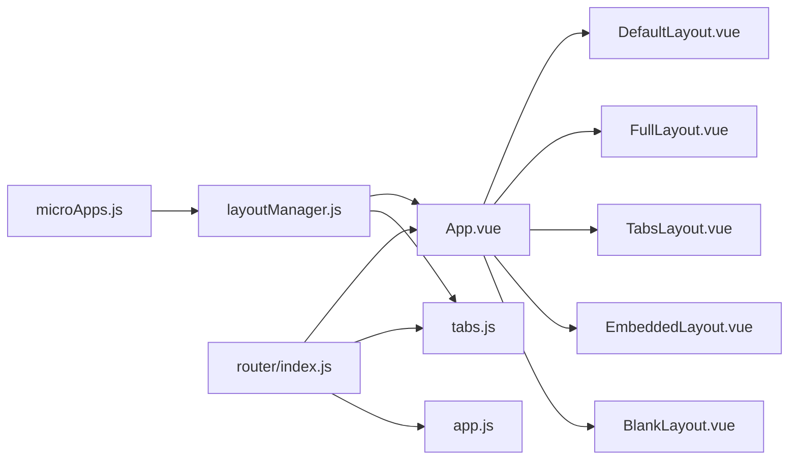

# 布局管理器

<cite>
**本文引用的文件**
- [README.md](file://README.md)
- [布局系统.md](file://user-docs/guide/layout-system.md)
- [App.vue](file://packages/main-app/src/App.vue)
- [layoutManager.js](file://packages/main-app/src/core/layoutManager.js)
- [DefaultLayout.vue](file://packages/main-app/src/components/layout/DefaultLayout.vue)
- [FullLayout.vue](file://packages/main-app/src/components/layout/FullLayout.vue)
- [TabsLayout.vue](file://packages/main-app/src/components/layout/TabsLayout.vue)
- [EmbeddedLayout.vue](file://packages/main-app/src/components/layout/EmbeddedLayout.vue)
- [BlankLayout.vue](file://packages/main-app/src/components/layout/BlankLayout.vue)
- [tabs.js](file://packages/main-app/src/stores/tabs.js)
- [router/index.js](file://packages/main-app/src/router/index.js)
- [microApps.js](file://packages/main-app/src/config/microApps.js)
- [app.js](file://packages/main-app/src/stores/app.js)
</cite>

## 目录
1. [简介](#简介)
2. [项目结构](#项目结构)
3. [核心组件](#核心组件)
4. [架构总览](#架构总览)
5. [详细组件分析](#详细组件分析)
6. [依赖关系分析](#依赖关系分析)
7. [性能考量](#性能考量)
8. [故障排查指南](#故障排查指南)
9. [结论](#结论)
10. [附录](#附录)

## 简介
本文件面向“布局管理器”的技术文档，围绕主应用中的五种布局类型进行系统化说明：默认布局、全屏布局、标签页布局、嵌入式布局与空白布局。文档覆盖布局切换机制、动态配置管理、响应式适配策略、组件生命周期与状态同步、性能优化建议，并提供配置项、扩展方法与集成指南，帮助开发者在不同业务场景下灵活使用布局系统。

## 项目结构
主应用采用单页应用架构，通过路由元信息控制布局类型；布局组件通过运行时动态选择渲染；布局选项由全局布局管理器统一维护；标签页功能由独立状态管理模块提供；微应用配置集中管理，支持按应用维度设置布局类型与选项。

图表来源
- [App.vue](file://packages/main-app/src/App.vue#L1-L43)
- [router/index.js](file://packages/main-app/src/router/index.js#L1-L130)
- [layoutManager.js](file://packages/main-app/src/core/layoutManager.js#L1-L174)
- [DefaultLayout.vue](file://packages/main-app/src/components/layout/DefaultLayout.vue#L1-L259)
- [FullLayout.vue](file://packages/main-app/src/components/layout/FullLayout.vue#L1-L17)
- [TabsLayout.vue](file://packages/main-app/src/components/layout/TabsLayout.vue#L1-L227)
- [EmbeddedLayout.vue](file://packages/main-app/src/components/layout/EmbeddedLayout.vue#L1-L39)
- [BlankLayout.vue](file://packages/main-app/src/components/layout/BlankLayout.vue#L1-L16)
- [tabs.js](file://packages/main-app/src/stores/tabs.js#L1-L144)
- [microApps.js](file://packages/main-app/src/config/microApps.js#L1-L110)

章节来源
- [README.md](file://README.md#L1-L158)
- [布局系统.md](file://user-docs/guide/layout-system.md#L1-L125)

## 核心组件
- 布局管理器：负责布局类型与选项的动态设置、变更通知、从微应用配置初始化布局。
- 布局组件：五种布局组件分别承担不同的容器职责与交互行为。
- 路由与元信息：通过路由 meta 控制布局类型，驱动 App.vue 的动态选择。
- 状态管理：tabs store 提供标签页增删改查与缓存同步；app store 提供侧边栏、激活应用等状态。
- 微应用配置：集中声明各子应用的布局类型与选项，支持运行时更新。

章节来源
- [layoutManager.js](file://packages/main-app/src/core/layoutManager.js#L1-L174)
- [App.vue](file://packages/main-app/src/App.vue#L1-L43)
- [router/index.js](file://packages/main-app/src/router/index.js#L1-L130)
- [tabs.js](file://packages/main-app/src/stores/tabs.js#L1-L144)
- [app.js](file://packages/main-app/src/stores/app.js#L1-L110)
- [microApps.js](file://packages/main-app/src/config/microApps.js#L1-L110)

## 架构总览
布局系统以“路由元信息 + 动态组件 + 全局布局管理器 + 状态管理”为核心，形成可配置、可扩展、可复用的布局编排体系。

图表来源
- [router/index.js](file://packages/main-app/src/router/index.js#L92-L127)
- [App.vue](file://packages/main-app/src/App.vue#L38-L41)
- [layoutManager.js](file://packages/main-app/src/core/layoutManager.js#L24-L33)
- [tabs.js](file://packages/main-app/src/stores/tabs.js#L25-L39)

## 详细组件分析

### 布局管理器（LayoutManager）
- 职责
  - 维护当前布局类型与布局选项（头部、侧边栏、多标签、缓存）。
  - 提供动态切换布局、更新选项、从微应用配置初始化布局、重置默认布局等能力。
  - 提供布局变更回调订阅与移除。
- 关键接口
  - setLayout(type, options)
  - getLayoutType()
  - getLayoutOptions()
  - updateOptions(options)
  - setHeaderVisible/showSidebar/setKeepAlive/setMultiTab
  - onChange/offChange
  - setLayoutFromMicroApp(config)
  - reset()

图表来源
- [layoutManager.js](file://packages/main-app/src/core/layoutManager.js#L18-L174)

章节来源
- [layoutManager.js](file://packages/main-app/src/core/layoutManager.js#L1-L174)

### 默认布局（DefaultLayout）
- 特点
  - 包含头部与侧边栏，菜单支持折叠与展开，面包屑导航，用户下拉。
  - 侧边栏根据折叠状态动态调整宽度，支持子应用导航。
- 关键联动
  - 读取布局选项控制头部/侧边栏显示。
  - 与 app store 同步侧边栏折叠状态与激活应用。
  - 与 tabs store 同步标签页标题与缓存。

图表来源
- [DefaultLayout.vue](file://packages/main-app/src/components/layout/DefaultLayout.vue#L1-L259)
- [layoutManager.js](file://packages/main-app/src/core/layoutManager.js#L24-L29)
- [app.js](file://packages/main-app/src/stores/app.js#L9-L16)

章节来源
- [DefaultLayout.vue](file://packages/main-app/src/components/layout/DefaultLayout.vue#L1-L259)
- [layoutManager.js](file://packages/main-app/src/core/layoutManager.js#L24-L29)
- [app.js](file://packages/main-app/src/stores/app.js#L1-L110)

### 全屏布局（FullLayout）
- 特点
  - 无头部与侧边栏，子应用全屏展示，适合报表、大屏等场景。
- 适用场景
  - 无需导航与控制面板的纯内容展示。

章节来源
- [FullLayout.vue](file://packages/main-app/src/components/layout/FullLayout.vue#L1-L17)

### 标签页布局（TabsLayout）
- 特点
  - 左侧菜单 + 顶部标签栏 + 主内容区，支持标签页增删、刷新、关闭其他/全部。
  - 与 tabs store 强耦合，负责标签页状态与缓存同步。
- 关键逻辑
  - 标签点击跳转、删除标签并处理当前激活标签。
  - 提供批量关闭与刷新操作。

图表来源
- [TabsLayout.vue](file://packages/main-app/src/components/layout/TabsLayout.vue#L116-L138)
- [tabs.js](file://packages/main-app/src/stores/tabs.js#L41-L62)
- [router/index.js](file://packages/main-app/src/router/index.js#L111-L126)

章节来源
- [TabsLayout.vue](file://packages/main-app/src/components/layout/TabsLayout.vue#L1-L227)
- [tabs.js](file://packages/main-app/src/stores/tabs.js#L1-L144)
- [router/index.js](file://packages/main-app/src/router/index.js#L1-L130)

### 嵌入式布局（EmbeddedLayout）
- 特点
  - 子应用嵌入页面，不替换主路由，适合内嵌第三方页面或特定场景。
- 适用场景
  - 需要保留主应用导航与控制，同时展示子应用内容。

章节来源
- [EmbeddedLayout.vue](file://packages/main-app/src/components/layout/EmbeddedLayout.vue#L1-L39)

### 空白布局（BlankLayout）
- 特点
  - 完全空白，常用于登录页、独立页面等。
- 适用场景
  - 不需要任何装饰的独立页面。

章节来源
- [BlankLayout.vue](file://packages/main-app/src/components/layout/BlankLayout.vue#L1-L16)

### 路由与布局映射
- 路由 meta 中的 layout 字段决定当前页面使用的布局类型。
- App.vue 基于当前路由 meta 动态选择布局组件并渲染。
- 路由守卫在跳转前后设置激活应用、loading 状态，并向 tabs store 添加标签页。

图表来源
- [App.vue](file://packages/main-app/src/App.vue#L30-L41)
- [router/index.js](file://packages/main-app/src/router/index.js#L92-L127)

章节来源
- [App.vue](file://packages/main-app/src/App.vue#L1-L43)
- [router/index.js](file://packages/main-app/src/router/index.js#L1-L130)

## 依赖关系分析
- App.vue 依赖路由元信息与布局管理器，动态选择布局组件。
- 布局组件依赖布局管理器提供的选项，以及状态管理模块（如 tabs store）。
- 路由守卫依赖 app store 与 tabs store，完成应用激活与标签页管理。
- 微应用配置提供布局类型与选项的初始值，布局管理器可据此初始化。

图表来源
- [App.vue](file://packages/main-app/src/App.vue#L1-L43)
- [layoutManager.js](file://packages/main-app/src/core/layoutManager.js#L1-L174)
- [router/index.js](file://packages/main-app/src/router/index.js#L1-L130)
- [tabs.js](file://packages/main-app/src/stores/tabs.js#L1-L144)
- [app.js](file://packages/main-app/src/stores/app.js#L1-L110)
- [microApps.js](file://packages/main-app/src/config/microApps.js#L1-L110)

章节来源
- [App.vue](file://packages/main-app/src/App.vue#L1-L43)
- [layoutManager.js](file://packages/main-app/src/core/layoutManager.js#L1-L174)
- [router/index.js](file://packages/main-app/src/router/index.js#L1-L130)
- [tabs.js](file://packages/main-app/src/stores/tabs.js#L1-L144)
- [app.js](file://packages/main-app/src/stores/app.js#L1-L110)
- [microApps.js](file://packages/main-app/src/config/microApps.js#L1-L110)

## 性能考量
- KeepAlive 缓存
  - tabs store 维护 cachedViews，结合 App.vue 的 keep-alive include 实现页面缓存。
  - 建议仅对频繁访问且状态稳定的页面启用缓存，避免内存占用过高。
- 标签页数量控制
  - 提供关闭其他/全部标签页能力，防止标签页过多导致渲染与内存压力。
- 路由懒加载
  - 路由组件采用异步加载，减少首屏体积。
- 布局切换开销
  - 布局切换涉及组件重新挂载，应避免频繁切换；必要时合并布局选项更新。

章节来源
- [App.vue](file://packages/main-app/src/App.vue#L4-L8)
- [tabs.js](file://packages/main-app/src/stores/tabs.js#L18-L19)
- [router/index.js](file://packages/main-app/src/router/index.js#L9-L13)

## 故障排查指南
- 布局类型无效
  - 现象：传入未知布局类型时未生效。
  - 处理：布局管理器会回退到默认布局并输出警告；请检查传入类型是否在枚举范围内。
- 标签页无法关闭
  - 现象：固定标签（不可关闭）无法删除。
  - 处理：标签页配置中 closable=false 的标签为固定标签，属于预期行为。
- 头部/侧边栏显示异常
  - 现象：切换布局后头部或侧边栏未按预期显示。
  - 处理：确认路由 meta.layout 与布局选项（showHeader/showSidebar）设置正确；默认布局组件会读取布局管理器选项。
- 刷新后标签页丢失
  - 现象：刷新页面后标签页状态丢失。
  - 处理：tabs store 已持久化至本地存储；若仍丢失，检查持久化配置与浏览器存储限制。
- 嵌入式布局内容溢出
  - 现象：嵌入式布局内容滚动异常。
  - 处理：检查嵌入式布局容器样式与 slot 内容高度设置。

章节来源
- [layoutManager.js](file://packages/main-app/src/core/layoutManager.js#L44-L47)
- [tabs.js](file://packages/main-app/src/stores/tabs.js#L47-L48)
- [DefaultLayout.vue](file://packages/main-app/src/components/layout/DefaultLayout.vue#L6-L9)
- [router/index.js](file://packages/main-app/src/router/index.js#L138-L143)
- [EmbeddedLayout.vue](file://packages/main-app/src/components/layout/EmbeddedLayout.vue#L33-L37)

## 结论
该布局系统通过“路由元信息 + 动态组件 + 全局布局管理器 + 状态管理”的组合，实现了灵活、可配置、可扩展的布局编排能力。开发者可根据业务需求选择合适的布局类型，并通过布局管理器与微应用配置实现动态切换与持久化。配合标签页与缓存策略，可在保证用户体验的同时兼顾性能与可维护性。

## 附录

### 布局类型与配置选项
- 布局类型
  - default：默认布局（含头部与侧边栏）
  - full：全屏布局（无头部与侧边栏）
  - tabs：多标签页布局（支持多标签与缓存）
  - embedded：嵌入式布局（子应用嵌入页面）
  - blank：空白布局（完全空白）
- 布局选项
  - showHeader：是否显示头部
  - showSidebar：是否显示侧边栏
  - keepAlive：是否缓存页面
  - multiTab：是否支持多标签

章节来源
- [布局系统.md](file://user-docs/guide/layout-system.md#L3-L66)
- [layoutManager.js](file://packages/main-app/src/core/layoutManager.js#L24-L29)

### 布局切换与动态配置
- 路由级别配置
  - 在路由 meta 中设置 layout 字段，驱动 App.vue 动态选择布局组件。
- 微应用配置
  - 在微应用配置中设置 layoutType 与 layoutOptions，布局管理器可据此初始化。
- 动态切换
  - 通过布局管理器的 setLayout 与 updateOptions 实现运行时切换与选项更新。

章节来源
- [布局系统.md](file://user-docs/guide/layout-system.md#L68-L115)
- [router/index.js](file://packages/main-app/src/router/index.js#L9-L13)
- [microApps.js](file://packages/main-app/src/config/microApps.js#L17-L23)
- [layoutManager.js](file://packages/main-app/src/core/layoutManager.js#L40-L94)

### 生命周期与状态同步
- App.vue
  - 基于路由计算 currentLayout 并渲染对应布局组件。
  - 通过 keep-alive 与 tabs store 的 cachedViews 实现页面缓存。
- tabs store
  - 维护标签列表、激活标签与缓存视图集合。
  - 提供添加、删除、关闭其他/全部、刷新等操作。
- 路由守卫
  - beforeEach 设置激活应用与 loading；
  - afterEach 添加标签页并写入标题与缓存标志。

章节来源
- [App.vue](file://packages/main-app/src/App.vue#L38-L43)
- [tabs.js](file://packages/main-app/src/stores/tabs.js#L25-L80)
- [router/index.js](file://packages/main-app/src/router/index.js#L92-L127)

### 响应式适配策略
- 默认布局
  - 侧边栏宽度随折叠状态动态变化，适配窄屏设备。
- 标签页布局
  - 标签栏采用卡片式设计，支持横向滚动与批量操作，提升多任务场景下的可用性。
- 全屏布局
  - 无装饰元素，最大化内容可视区域，适合大屏与报表类场景。
- 嵌入式布局
  - 保持主应用导航一致性，同时允许子应用内容独立滚动。
- 空白布局
  - 无约束容器，便于定制独立页面的响应式设计。

章节来源
- [DefaultLayout.vue](file://packages/main-app/src/components/layout/DefaultLayout.vue#L133-L134)
- [TabsLayout.vue](file://packages/main-app/src/components/layout/TabsLayout.vue#L186-L219)
- [FullLayout.vue](file://packages/main-app/src/components/layout/FullLayout.vue#L10-L16)
- [EmbeddedLayout.vue](file://packages/main-app/src/components/layout/EmbeddedLayout.vue#L18-L38)
- [BlankLayout.vue](file://packages/main-app/src/components/layout/BlankLayout.vue#L10-L15)

### 自定义扩展方法
- 新增布局类型
  - 在 App.vue 的布局映射中注册新组件，并在路由 meta 中使用新类型。
  - 若需要新的布局选项，扩展布局管理器的选项结构并在布局组件中消费。
- 扩展标签页行为
  - 在 tabs store 中增加自定义动作（如分组、搜索、历史记录），并通过布局组件暴露相应 UI。
- 微应用维度定制
  - 在微应用配置中为不同应用设置不同的布局类型与选项，实现差异化体验。

章节来源
- [App.vue](file://packages/main-app/src/App.vue#L30-L36)
- [layoutManager.js](file://packages/main-app/src/core/layoutManager.js#L24-L29)
- [tabs.js](file://packages/main-app/src/stores/tabs.js#L25-L136)
- [microApps.js](file://packages/main-app/src/config/microApps.js#L17-L23)

### 集成指南
- 在路由中为页面设置 meta.layout。
- 在微应用配置中设置 layoutType 与 layoutOptions。
- 如需运行时切换，调用布局管理器的 setLayout 与 updateOptions。
- 对需要缓存的页面，确保标签页配置中 keepAlive 为真，并在 tabs store 中维护缓存视图集合。

章节来源
- [布局系统.md](file://user-docs/guide/layout-system.md#L68-L115)
- [router/index.js](file://packages/main-app/src/router/index.js#L9-L13)
- [microApps.js](file://packages/main-app/src/config/microApps.js#L17-L23)
- [layoutManager.js](file://packages/main-app/src/core/layoutManager.js#L40-L94)
- [tabs.js](file://packages/main-app/src/stores/tabs.js#L34-L36)