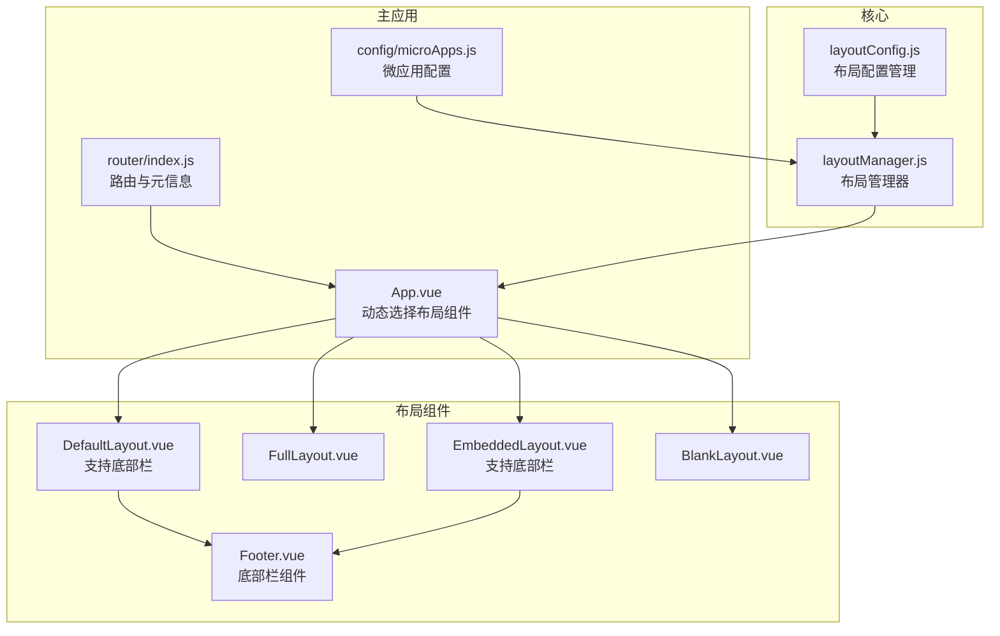
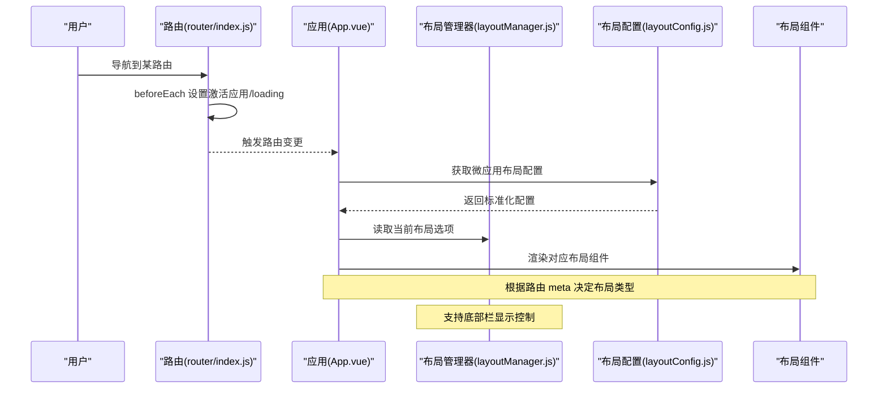
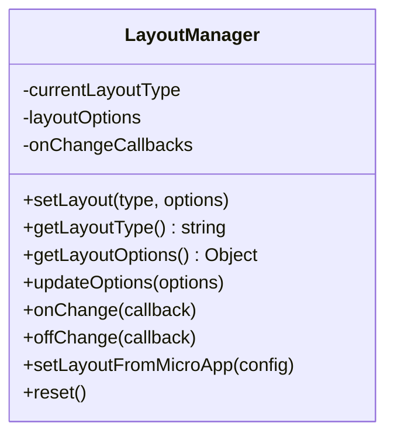
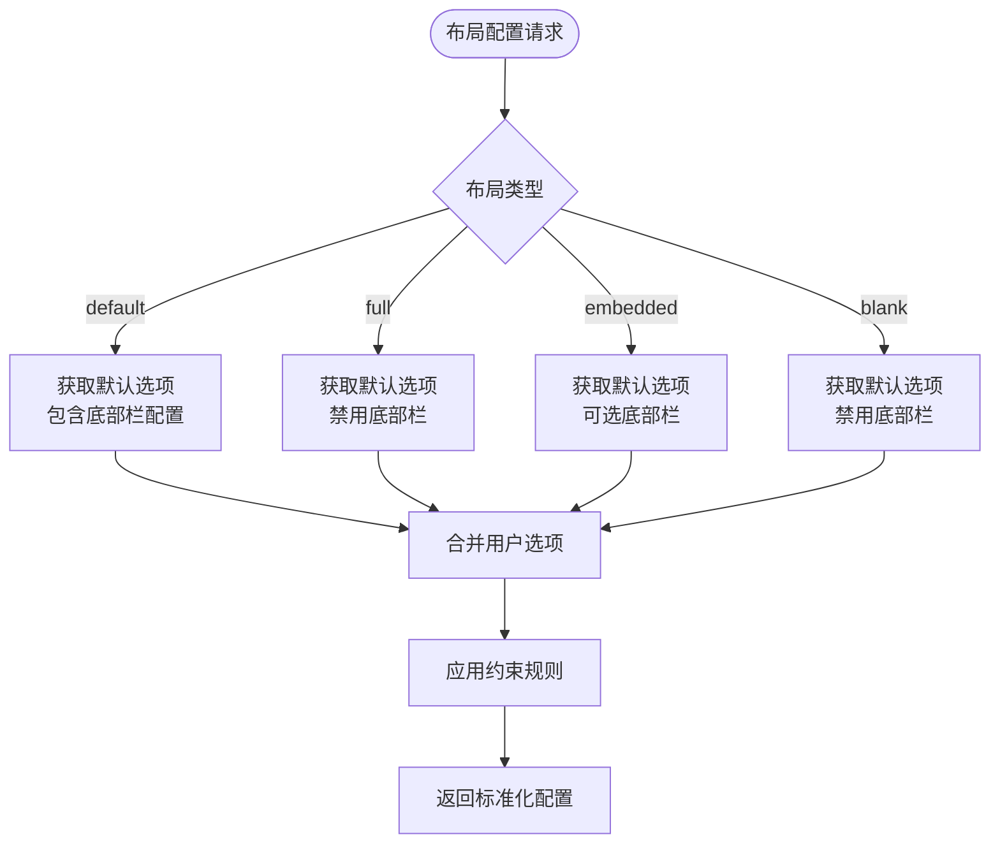
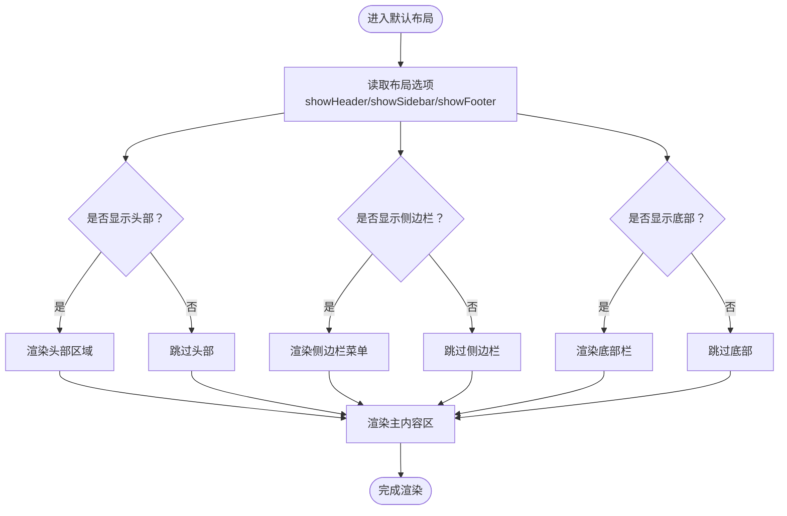
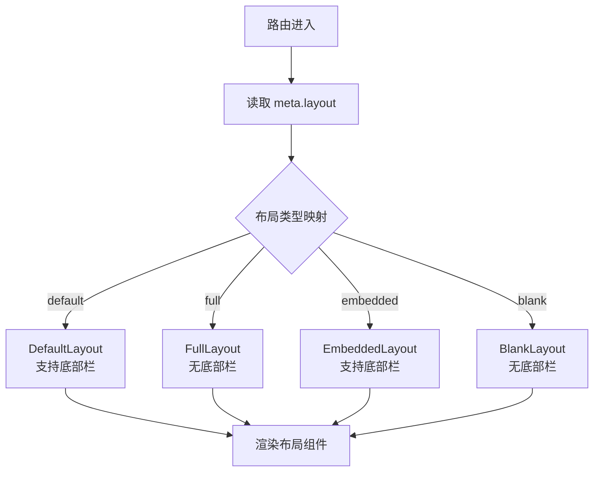
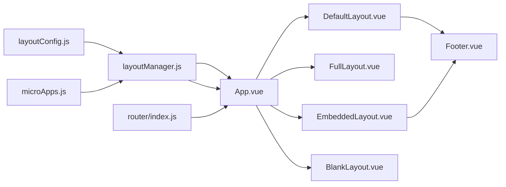

# 布局管理器

<cite>
**本文档引用的文件**
- [layoutManager.js](file://packages/main-app/src/core/layoutManager.js)
- [layoutConfig.js](file://packages/main-app/src/config/layoutConfig.js)
- [App.vue](file://packages/main-app/src/App.vue)
- [DefaultLayout.vue](file://packages/main-app/src/components/layout/DefaultLayout.vue)
- [FullLayout.vue](file://packages/main-app/src/components/layout/FullLayout.vue)
- [EmbeddedLayout.vue](file://packages/main-app/src/components/layout/EmbeddedLayout.vue)
- [BlankLayout.vue](file://packages/main-app/src/components/layout/BlankLayout.vue)
- [Footer.vue](file://packages/main-app/src/components/layout/Footer.vue)
- [router/index.js](file://packages/main-app/src/router/index.js)
</cite>

## 更新摘要
**所做更改**
- 新增 Footer 组件支持，完善底部栏渲染功能
- 简化布局配置管理，移除冗余的布局类型配置
- 增强布局类型验证和标准化处理
- 更新布局组件以支持底部栏渲染逻辑

## 目录
1. [简介](#简介)
2. [项目结构](#项目结构)
3. [核心组件](#核心组件)
4. [架构总览](#架构总览)
5. [详细组件分析](#详细组件分析)
6. [依赖关系分析](#依赖关系分析)
7. [性能考量](#性能考量)
8. [故障排查指南](#故障排查指南)
9. [结论](#结论)
10. [附录](#附录)

## 简介
本文件面向"布局管理器"的技术文档，围绕主应用中的四种布局类型进行系统化说明：默认布局、全屏布局、嵌入式布局与空白布局。文档覆盖布局切换机制、动态配置管理、响应式适配策略、组件生命周期与状态同步、性能优化建议，并提供配置项、扩展方法与集成指南，帮助开发者在不同业务场景下灵活使用布局系统。

**更新** 本次更新集成了 Footer 组件支持，简化了布局配置管理，增强了布局类型验证和标准化处理，完善了布局管理系统的功能完整性。

## 项目结构
主应用采用单页应用架构，通过路由元信息控制布局类型；布局组件通过运行时动态选择渲染；布局选项由全局布局管理器统一维护；微应用配置集中管理，支持按应用维度设置布局类型与选项。

```mermaid
graph TB
subgraph "主应用"
APP["App.vue<br/>动态选择布局组件"]
ROUTER["router/index.js<br/>路由与元信息"]
CONFIG["config/microApps.js<br/>微应用配置"]
end
subgraph "布局组件"
DEF["DefaultLayout.vue<br/>支持底部栏"]
FULL["FullLayout.vue"]
EMB["EmbeddedLayout.vue<br/>支持底部栏"]
BLK["BlankLayout.vue"]
FOOTER["Footer.vue<br/>底部栏组件"]
end
subgraph "核心"
LM["layoutManager.js<br/>布局管理器"]
LC["layoutConfig.js<br/>布局配置管理"]
end
ROUTER --> APP
APP --> DEF
APP --> FULL
APP --> EMB
APP --> BLK
LM --> APP
LC --> LM
CONFIG --> LM
DEF --> FOOTER
EMB --> FOOTER
```

**图表来源**
- [App.vue:1-165](file://packages/main-app/src/App.vue#L1-L165)
- [layoutManager.js:1-142](file://packages/main-app/src/core/layoutManager.js#L1-L142)
- [layoutConfig.js:1-205](file://packages/main-app/src/config/layoutConfig.js#L1-L205)
- [Footer.vue:1-72](file://packages/main-app/src/components/layout/Footer.vue#L1-L72)

**章节来源**
- [App.vue:1-165](file://packages/main-app/src/App.vue#L1-L165)
- [layoutManager.js:1-142](file://packages/main-app/src/core/layoutManager.js#L1-L142)
- [layoutConfig.js:1-205](file://packages/main-app/src/config/layoutConfig.js#L1-L205)

## 核心组件
- 布局管理器：负责布局类型与选项的动态设置、变更通知、从微应用配置初始化布局。
- 布局配置管理：提供布局配置的标准化、验证和约束应用功能。
- 布局组件：四种布局组件分别承担不同的容器职责与交互行为，支持底部栏渲染。
- 路由与元信息：通过路由 meta 控制布局类型，驱动 App.vue 的动态选择。
- 微应用配置：集中声明各子应用的布局类型与选项，支持运行时更新。

**更新** 新增 Footer 组件支持，布局管理器现在支持完整的头部、侧边栏、底部和缓存配置管理。

**章节来源**
- [layoutManager.js:1-142](file://packages/main-app/src/core/layoutManager.js#L1-L142)
- [layoutConfig.js:1-205](file://packages/main-app/src/config/layoutConfig.js#L1-L205)
- [App.vue:1-165](file://packages/main-app/src/App.vue#L1-L165)
- [router/index.js:1-155](file://packages/main-app/src/router/index.js#L1-L155)

## 架构总览
布局系统以"路由元信息 + 动态组件 + 全局布局管理器 + 布局配置管理 + 状态管理"为核心，形成可配置、可扩展、可复用的布局编排体系。

```mermaid
sequenceDiagram
participant U as "用户"
participant R as "路由(router/index.js)"
participant A as "应用(App.vue)"
participant L as "布局管理器(layoutManager.js)"
participant LC as "布局配置(layoutConfig.js)"
participant C as "布局组件"
U->>R : 导航到某路由
R->>R : beforeEach 设置激活应用/loading
R-->>A : 触发路由变更
A->>LC : 获取微应用布局配置
LC-->>A : 返回标准化配置
A->>L : 读取当前布局选项
A->>C : 渲染对应布局组件
Note over A,C : 根据路由 meta 决定布局类型
Note over L : 支持底部栏显示控制
```

**图表来源**
- [router/index.js:112-152](file://packages/main-app/src/router/index.js#L112-L152)
- [App.vue:62-108](file://packages/main-app/src/App.vue#L62-L108)
- [layoutManager.js:39-66](file://packages/main-app/src/core/layoutManager.js#L39-L66)
- [layoutConfig.js:184-193](file://packages/main-app/src/config/layoutConfig.js#L184-L193)

## 详细组件分析

### 布局管理器（LayoutManager）
- 职责
  - 维护当前布局类型与布局选项（头部、侧边栏、底部、缓存）。
  - 提供动态切换布局、更新选项、从微应用配置初始化布局、强制应用布局等功能。
  - 提供布局变更回调订阅与移除。
- 关键接口
  - setLayout(type, options)
  - getLayoutType()
  - getLayoutOptions()
  - updateOptions(options)
  - setLayoutFromMicroApp(config)
  - reset()

**更新** 布局管理器已更新以支持底部栏显示控制，但当前版本中未提供专门的 setFooterVisible 方法。

```mermaid
classDiagram
class LayoutManager {
-currentLayoutType
-layoutOptions
-onChangeCallbacks
+setLayout(type, options)
+getLayoutType() string
+getLayoutOptions() Object
+updateOptions(options)
+onChange(callback)
+offChange(callback)
+setLayoutFromMicroApp(config)
+reset()
}
```

**图表来源**
- [layoutManager.js:17-139](file://packages/main-app/src/core/layoutManager.js#L17-L139)

**章节来源**
- [layoutManager.js:1-142](file://packages/main-app/src/core/layoutManager.js#L1-L142)

### 布局配置管理（LayoutConfig）
- 职责
  - 定义每种布局类型的默认选项和约束规则。
  - 提供布局配置的标准化、验证和建议功能。
  - 支持获取布局类型列表、兼容选项和约束应用。
- 关键功能
  - getDefaultLayoutOptions(layoutType)
  - getCompatibleOptions(layoutType)
  - applyLayoutConstraints(layoutType, options)
  - validateLayoutConfig(layoutType, options)
  - normalizeLayoutConfig(layoutType, options)
  - getAllLayoutTypes()

**更新** 布局配置管理已简化，移除了冗余的布局类型配置，专注于核心布局类型的默认选项和约束规则。

```mermaid
flowchart TD
Start(["布局配置请求"]) --> Type{"布局类型"}
Type --> |default| Default["获取默认选项<br/>包含底部栏配置"]
Type --> |full| Full["获取默认选项<br/>禁用底部栏"]
Type --> |embedded| Embedded["获取默认选项<br/>可选底部栏"]
Type --> |blank| Blank["获取默认选项<br/>禁用底部栏"]
Default --> Merge["合并用户选项"]
Full --> Merge
Embedded --> Merge
Blank --> Merge
Merge --> Constraints["应用约束规则"]
Constraints --> Result["返回标准化配置"]
```

**图表来源**
- [layoutConfig.js:184-193](file://packages/main-app/src/config/layoutConfig.js#L184-L193)

**章节来源**
- [layoutConfig.js:1-205](file://packages/main-app/src/config/layoutConfig.js#L1-L205)

### 默认布局（DefaultLayout）
- 特点
  - 包含头部与侧边栏，菜单支持折叠与展开，面包屑导航，用户下拉。
  - 侧边栏根据折叠状态动态调整宽度，支持子应用导航。
  - **新增** 支持底部栏渲染，通过 showFooter 选项控制显示。
- 关键联动
  - 读取布局选项控制头部/侧边栏/底部显示。
  - 与 app store 同步侧边栏折叠状态与激活应用。

```mermaid
flowchart TD
Start(["进入默认布局"]) --> ReadOpts["读取布局选项<br/>showHeader/showSidebar/showFooter"]
ReadOpts --> RenderHeader{"是否显示头部？"}
RenderHeader --> |是| Header["渲染头部区域"]
RenderHeader --> |否| SkipHeader["跳过头部"]
ReadOpts --> RenderSidebar{"是否显示侧边栏？"}
RenderSidebar --> |是| Sidebar["渲染侧边栏菜单"]
RenderSidebar --> |否| SkipSidebar["跳过侧边栏"]
ReadOpts --> RenderFooter{"是否显示底部？"}
RenderFooter --> |是| Footer["渲染底部栏"]
RenderFooter --> |否| SkipFooter["跳过底部"]
Header --> Content["渲染主内容区"]
SkipHeader --> Content
Sidebar --> Content
SkipSidebar --> Content
Footer --> Content
SkipFooter --> Content
Content --> End(["完成渲染"])
```

**图表来源**
- [DefaultLayout.vue:1-84](file://packages/main-app/src/components/layout/DefaultLayout.vue#L1-L84)
- [layoutManager.js:23-28](file://packages/main-app/src/core/layoutManager.js#L23-L28)
- [App.vue:46-47](file://packages/main-app/src/App.vue#L46-L47)

**章节来源**
- [DefaultLayout.vue:1-84](file://packages/main-app/src/components/layout/DefaultLayout.vue#L1-L84)
- [layoutManager.js:23-28](file://packages/main-app/src/core/layoutManager.js#L23-L28)
- [App.vue:46-47](file://packages/main-app/src/App.vue#L46-L47)

### 全屏布局（FullLayout）
- 特点
  - 无头部与侧边栏，子应用全屏展示，适合报表、大屏等场景。
  - **更新** 不支持底部栏显示，保持全屏无装饰状态。
- 适用场景
  - 无需导航与控制面板的纯内容展示。

**章节来源**
- [FullLayout.vue:1-17](file://packages/main-app/src/components/layout/FullLayout.vue#L1-L17)

### 嵌入式布局（EmbeddedLayout）
- 特点
  - 子应用嵌入页面，不替换主路由，适合内嵌第三方页面或特定场景。
  - 包含面包屑导航，提供清晰的页面层级指示。
  - **新增** 支持底部栏渲染，通过 showFooter 选项控制显示。
- 适用场景
  - 需要保留主应用导航与控制，同时展示子应用内容。

**章节来源**
- [EmbeddedLayout.vue:1-97](file://packages/main-app/src/components/layout/EmbeddedLayout.vue#L1-L97)

### 空白布局（BlankLayout）
- 特点
  - 完全空白，常用于登录页、独立页面等。
  - **更新** 不支持底部栏显示，保持完全空白状态。
- 适用场景
  - 不需要任何装饰的独立页面。

**章节来源**
- [BlankLayout.vue:1-16](file://packages/main-app/src/components/layout/BlankLayout.vue#L1-L16)

### 路由与布局映射
- 路由 meta 中的 layout 字段决定当前页面使用的布局类型。
- App.vue 基于当前路由 meta 动态选择布局组件并渲染。
- 路由守卫在跳转前后设置激活应用、loading 状态。

```mermaid
flowchart TD
RouteEnter["路由进入"] --> Meta["读取 meta.layout"]
Meta --> Map{"布局类型映射"}
Map --> |default| Def["DefaultLayout<br/>支持底部栏"]
Map --> |full| Full["FullLayout<br/>无底部栏"]
Map --> |embedded| Emb["EmbeddedLayout<br/>支持底部栏"]
Map --> |blank| Blk["BlankLayout<br/>无底部栏"]
Def --> Render["渲染布局组件"]
Full --> Render
Emb --> Render
Blk --> Render
```

**图表来源**
- [App.vue:55-60](file://packages/main-app/src/App.vue#L55-L60)
- [router/index.js:112-152](file://packages/main-app/src/router/index.js#L112-L152)

**章节来源**
- [App.vue:1-165](file://packages/main-app/src/App.vue#L1-L165)
- [router/index.js:1-155](file://packages/main-app/src/router/index.js#L1-L155)

### 底部栏组件（Footer）
- 特点
  - 提供标准的页脚组件，包含版权信息和链接导航。
  - 支持动态显示/隐藏，与布局管理器的 showFooter 选项关联。
- 结构组成
  - 左侧版权信息区域
  - 右侧链接导航区域
  - 响应式布局设计

**章节来源**
- [Footer.vue:1-72](file://packages/main-app/src/components/layout/Footer.vue#L1-L72)

## 依赖关系分析
- App.vue 依赖路由元信息与布局管理器，动态选择布局组件。
- 布局组件依赖布局管理器提供的选项，以及状态管理模块（如 app store）。
- 路由守卫依赖 app store，完成应用激活与标签页管理。
- 微应用配置提供布局类型与选项的初始值，布局管理器可据此初始化。
- 布局配置管理为布局系统提供标准化和验证功能。
- **新增** 底部栏组件与布局管理器协同工作，实现底部栏的动态控制。

```mermaid
graph LR
LM["layoutManager.js"] --> APP["App.vue"]
LC["layoutConfig.js"] --> LM
APP --> DEF["DefaultLayout.vue"]
APP --> FULL["FullLayout.vue"]
APP --> EMB["EmbeddedLayout.vue"]
APP --> BLK["BlankLayout.vue"]
DEF --> FOOTER["Footer.vue"]
EMB --> FOOTER
ROUTER["router/index.js"] --> APP
CONFIG["microApps.js"] --> LM
LM --> APP
```

**图表来源**
- [App.vue:1-165](file://packages/main-app/src/App.vue#L1-L165)
- [layoutManager.js:1-142](file://packages/main-app/src/core/layoutManager.js#L1-L142)
- [layoutConfig.js:1-205](file://packages/main-app/src/config/layoutConfig.js#L1-L205)
- [router/index.js:1-155](file://packages/main-app/src/router/index.js#L1-L155)

**章节来源**
- [App.vue:1-165](file://packages/main-app/src/App.vue#L1-L165)
- [layoutManager.js:1-142](file://packages/main-app/src/core/layoutManager.js#L1-L142)
- [layoutConfig.js:1-205](file://packages/main-app/src/config/layoutConfig.js#L1-L205)
- [router/index.js:1-155](file://packages/main-app/src/router/index.js#L1-L155)

## 性能考量
- KeepAlive 缓存
  - App.vue 维护 cachedViews，结合 keep-alive include 实现页面缓存。
  - 建议仅对频繁访问且状态稳定的页面启用缓存，避免内存占用过高。
- 路由懒加载
  - 路由组件采用异步加载，减少首屏体积。
- 布局切换开销
  - 布局切换涉及组件重新挂载，应避免频繁切换；必要时合并布局选项更新。
- 配置验证开销
  - 布局配置标准化和验证功能在初始化时执行，避免运行时性能影响。
- **新增** 底部栏渲染优化
  - 底部栏组件采用条件渲染，仅在 showFooter 为 true 时渲染，避免不必要的 DOM 操作。

**章节来源**
- [App.vue:32-53](file://packages/main-app/src/App.vue#L32-L53)
- [router/index.js:107-110](file://packages/main-app/src/router/index.js#L107-L110)
- [layoutConfig.js:184-193](file://packages/main-app/src/config/layoutConfig.js#L184-L193)

## 故障排查指南
- 布局类型无效
  - 现象：传入未知布局类型时未生效。
  - 处理：布局管理器会回退到默认布局并输出警告；请检查传入类型是否在枚举范围内。
- 头部/侧边栏显示异常
  - 现象：切换布局后头部或侧边栏未按预期显示。
  - 处理：确认路由 meta.layout 与布局选项（showHeader/showSidebar）设置正确；默认布局组件会读取布局管理器选项。
- **新增** 底部栏显示异常
  - 现象：底部栏未按预期显示或隐藏。
  - 处理：确认布局选项中 showFooter 设置正确；检查布局组件的条件渲染逻辑；验证布局管理器的布局选项配置。
- 刷新后标签页丢失
  - 现象：刷新页面后标签页状态丢失。
  - 处理：App.vue 已处理缓存视图列表；若仍丢失，检查缓存配置与浏览器存储限制。
- 嵌入式布局内容溢出
  - 现象：嵌入式布局内容滚动异常。
  - 处理：检查嵌入式布局容器样式与 slot 内容高度设置。
- 布局配置验证失败
  - 现象：布局配置标准化或验证过程中出现错误。
  - 处理：检查布局类型是否有效，选项是否与布局类型兼容；查看控制台中的验证警告和错误信息。

**章节来源**
- [layoutManager.js:42-46](file://packages/main-app/src/core/layoutManager.js#L42-L46)
- [DefaultLayout.vue:25-27](file://packages/main-app/src/components/layout/DefaultLayout.vue#L25-L27)
- [router/index.js:112-152](file://packages/main-app/src/router/index.js#L112-L152)
- [EmbeddedLayout.vue:29-31](file://packages/main-app/src/components/layout/EmbeddedLayout.vue#L29-L31)
- [layoutConfig.js:139-175](file://packages/main-app/src/config/layoutConfig.js#L139-L175)

## 结论
该布局系统通过"路由元信息 + 动态组件 + 全局布局管理器 + 布局配置管理 + 状态管理"的组合，实现了灵活、可配置、可扩展的布局编排能力。本次更新集成了 Footer 组件支持，简化了布局配置管理，增强了布局类型验证和标准化处理，完善了布局管理系统的功能完整性。开发者可根据业务需求选择合适的布局类型，并通过布局管理器与微应用配置实现动态切换与持久化。配合标签页与缓存策略，可在保证用户体验的同时兼顾性能与可维护性。

## 附录

### 布局类型与配置选项
- 布局类型
  - default：默认布局（含头部与侧边栏，支持底部栏）
  - full：全屏布局（无头部与侧边栏，无底部栏）
  - embedded：嵌入式布局（子应用嵌入页面，支持底部栏）
  - blank：空白布局（完全空白，无底部栏）
- 布局选项
  - showHeader：是否显示头部
  - showSidebar：是否显示侧边栏
  - showFooter：是否显示底部（**新增**）
  - keepAlive：是否缓存页面

**更新** 新增底部栏显示控制选项，完善了布局配置选项的完整性。

**章节来源**
- [layoutManager.js:6-11](file://packages/main-app/src/core/layoutManager.js#L6-L11)
- [layoutManager.js:23-28](file://packages/main-app/src/core/layoutManager.js#L23-L28)
- [layoutConfig.js:26-87](file://packages/main-app/src/config/layoutConfig.js#L26-L87)

### 布局切换与动态配置
- 路由级别配置
  - 在路由 meta 中设置 layout 字段，驱动 App.vue 动态选择布局组件。
- 微应用配置
  - 在微应用配置中设置 layoutType 与 layoutOptions，布局管理器可据此初始化。
- 动态切换
  - 通过布局管理器的 setLayout 与 updateOptions 实现运行时切换与选项更新。
  - **新增** 通过布局管理器的 updateOptions 方法动态控制底部栏显示。
- 配置标准化
  - 使用 normalizeLayoutConfig 进行布局配置的标准化处理。
- 配置验证
  - 使用 validateLayoutConfig 验证布局配置的有效性。

**更新** 新增底部栏显示控制的动态配置方法。

**章节来源**
- [App.vue:62-108](file://packages/main-app/src/App.vue#L62-L108)
- [layoutManager.js:39-93](file://packages/main-app/src/core/layoutManager.js#L39-L93)
- [layoutConfig.js:184-193](file://packages/main-app/src/config/layoutConfig.js#L184-L193)
- [layoutConfig.js:139-175](file://packages/main-app/src/config/layoutConfig.js#L139-L175)

### 生命周期与状态同步
- App.vue
  - 基于路由计算 currentLayout 并渲染对应布局组件。
  - 通过 keep-alive 与 cachedViews 实现页面缓存。
- 路由守卫
  - beforeEach 设置激活应用与 loading 状态。
  - afterEach 处理导航失败的情况。

**章节来源**
- [App.vue:62-108](file://packages/main-app/src/App.vue#L62-L108)
- [router/index.js:112-152](file://packages/main-app/src/router/index.js#L112-L152)

### 响应式适配策略
- 默认布局
  - 侧边栏宽度随折叠状态动态变化，适配窄屏设备。
  - **新增** 底部栏支持响应式布局，在窄屏设备上自动调整显示。
- 全屏布局
  - 无装饰元素，最大化内容可视区域，适合大屏与报表类场景。
- 嵌入式布局
  - 保持主应用导航一致性，同时允许子应用内容独立滚动。
  - **新增** 底部栏在嵌入式布局中提供一致的页脚体验。
- 空白布局
  - 无约束容器，便于定制独立页面的响应式设计。

**更新** 新增底部栏的响应式适配策略。

**章节来源**
- [DefaultLayout.vue:61-84](file://packages/main-app/src/components/layout/DefaultLayout.vue#L61-L84)
- [FullLayout.vue:10-16](file://packages/main-app/src/components/layout/FullLayout.vue#L10-L16)
- [EmbeddedLayout.vue:65-97](file://packages/main-app/src/components/layout/EmbeddedLayout.vue#L65-L97)
- [BlankLayout.vue:10-15](file://packages/main-app/src/components/layout/BlankLayout.vue#L10-L15)

### 自定义扩展方法
- 新增布局类型
  - 在 App.vue 的布局映射中注册新组件，并在路由 meta 中使用新类型。
  - 若需要新的布局选项，扩展布局管理器的选项结构并在布局组件中消费。
- 扩展标签页行为
  - 在 App.vue 中增加自定义动作（如分组、搜索、历史记录），并通过布局组件暴露相应 UI。
- 微应用维度定制
  - 在微应用配置中为不同应用设置不同的布局类型与选项，实现差异化体验。
- 布局配置扩展
  - 通过修改 layoutConfig.js 中的布局类型配置，添加新的布局类型和约束规则。
  - **新增** 在布局类型配置中添加底部栏相关约束和默认值。

**更新** 新增底部栏配置扩展方法。

**章节来源**
- [App.vue:55-60](file://packages/main-app/src/App.vue#L55-L60)
- [layoutManager.js:23-28](file://packages/main-app/src/core/layoutManager.js#L23-L28)
- [layoutConfig.js:26-87](file://packages/main-app/src/config/layoutConfig.js#L26-L87)

### 集成指南
- 在路由中为页面设置 meta.layout。
- 在微应用配置中设置 layoutType 与 layoutOptions。
- 如需运行时切换，调用布局管理器的 setLayout 与 updateOptions。
- **新增** 如需控制底部栏显示，调用布局管理器的 updateOptions 方法设置 showFooter 选项。
- 对需要缓存的页面，确保路由 meta.keepAlive 为真，并在 App.vue 中维护缓存视图集合。
- 使用布局配置管理功能进行配置标准化和验证。

**更新** 新增底部栏显示控制的集成方法。

**章节来源**
- [App.vue:62-108](file://packages/main-app/src/App.vue#L62-L108)
- [layoutManager.js:39-93](file://packages/main-app/src/core/layoutManager.js#L39-L93)
- [layoutConfig.js:184-193](file://packages/main-app/src/config/layoutConfig.js#L184-L193)
- [router/index.js:128-135](file://packages/main-app/src/router/index.js#L128-L135)