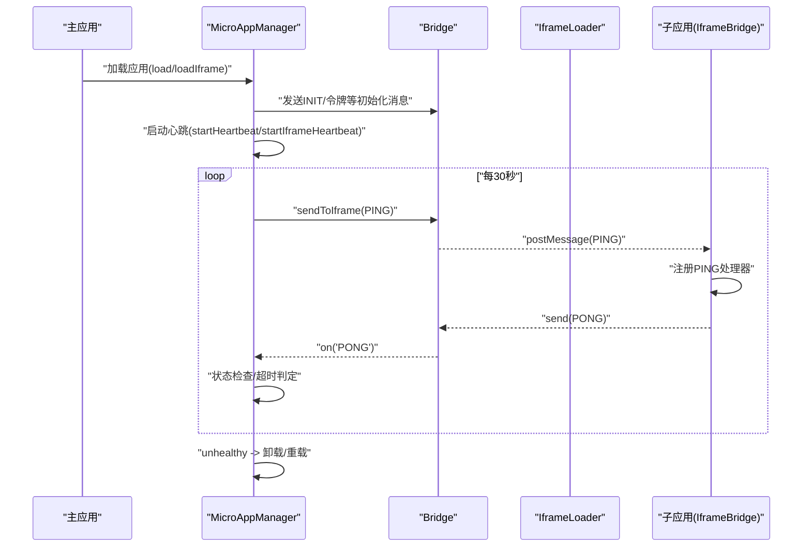
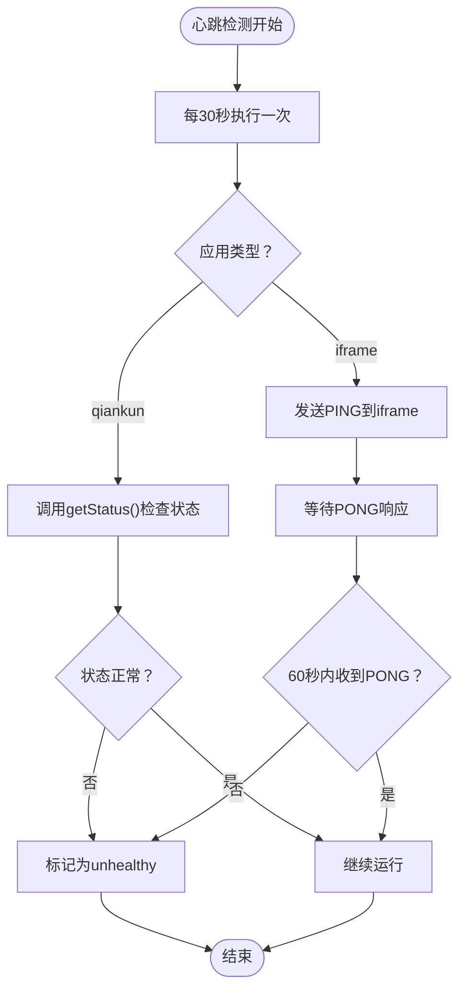
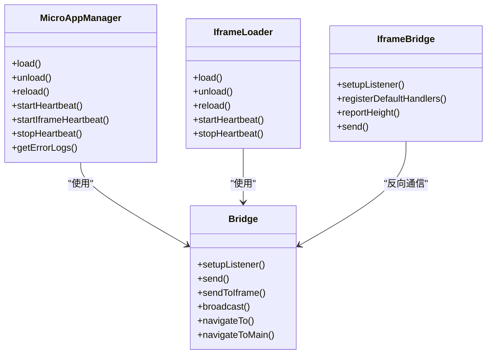

# 健康监测系统

<cite>
**本文引用的文件**   
- [microAppManager.js](file://packages/main-app/src/core/microAppManager.js)
- [bridge.js](file://packages/main-app/src/core/bridge.js)
- [iframeLoader.js](file://packages/main-app/src/core/iframeLoader.js)
- [bridge.js（iframe子应用）](file://packages/iframe-sub-app/src/bridge.js)
- [iframe-governance.md](file://user-docs/guide/iframe-governance.md)
- [config.md](file://user-docs/api/config.md)
- [SubAppPage.vue](file://packages/main-app/src/views/SubAppPage.vue)
- [package.json](file://package.json)
</cite>

## 目录
1. [简介](#简介)
2. [项目结构](#项目结构)
3. [核心组件](#核心组件)
4. [架构总览](#架构总览)
5. [详细组件分析](#详细组件分析)
6. [依赖关系分析](#依赖关系分析)
7. [性能考量](#性能考量)
8. [故障排查指南](#故障排查指南)
9. [结论](#结论)
10. [附录](#附录)

## 简介
本技术文档聚焦“健康监测系统”，围绕心跳检测机制、状态监控与异常告警展开，深入解析以下关键点：
- startHeartbeat() 与 startIframeHeartbeat() 的心跳发送频率、检测间隔与状态判断逻辑
- 不同应用类型（qiankun 应用 vs iframe 应用）的心跳实现差异
- unhealthy 状态的判定标准、错误恢复机制与自动重连策略
- 心跳检测的配置参数、监控指标与告警规则设置
- 健康监测的调试工具、性能分析与故障诊断方法

## 项目结构
该项目采用 monorepo 结构，主要涉及以下模块：
- 主应用核心：负责微应用加载、通信桥接、心跳检测与卸载清理
- iframe 子应用：通过 postMessage 与主应用通信，实现心跳响应与高度上报
- 文档：提供 iframe 跨域治理、通信协议与心跳检测的规范说明
- 配置：微应用配置结构与类型定义

```mermaid
graph TB
subgraph "主应用"
MAM["MicroAppManager<br/>加载/卸载/心跳"]
BR["Bridge<br/>消息桥接/监听"]
IL["IframeLoader<br/>iframe专用加载器"]
end
subgraph "子应用"
ISB["IframeBridge<br/>子应用消息桥"]
end
subgraph "文档与配置"
DOC["iframe-governance.md<br/>心跳与治理规范"]
CFG["config.md<br/>微应用配置结构"]
end
MAM --> BR
MAM --> IL
BR <- --> ISB
DOC --> MAM
DOC --> IL
CFG --> MAM
```

图表来源
- [microAppManager.js](file://packages/main-app/src/core/microAppManager.js#L1-L515)
- [bridge.js](file://packages/main-app/src/core/bridge.js#L1-L241)
- [iframeLoader.js](file://packages/main-app/src/core/iframeLoader.js#L1-L334)
- [bridge.js（iframe子应用）](file://packages/iframe-sub-app/src/bridge.js#L1-L216)
- [iframe-governance.md](file://user-docs/guide/iframe-governance.md#L1-L138)
- [config.md](file://user-docs/api/config.md#L1-L121)

章节来源
- [package.json](file://package.json#L1-L50)

## 核心组件
- MicroAppManager：负责 qiankun 应用与 iframe 应用的统一加载、状态管理与心跳检测；提供卸载与错误日志记录能力
- Bridge：主应用侧消息桥，负责监听与转发消息、心跳响应、广播与令牌同步
- IframeLoader：iframe 专用加载器，负责 iframe 生命周期、消息监听、心跳检测与高度自适应
- IframeBridge（子应用）：iframe 子应用侧消息桥，负责接收主应用消息、心跳响应、高度上报与导航跳转

章节来源
- [microAppManager.js](file://packages/main-app/src/core/microAppManager.js#L1-L515)
- [bridge.js](file://packages/main-app/src/core/bridge.js#L1-L241)
- [iframeLoader.js](file://packages/main-app/src/core/iframeLoader.js#L1-L334)
- [bridge.js（iframe子应用）](file://packages/iframe-sub-app/src/bridge.js#L1-L216)

## 架构总览
健康监测系统以“心跳检测”为核心，贯穿主应用与子应用之间的通信链路。主应用通过 Bridge 向子应用发送 PING，子应用通过 IframeBridge 响应 PONG；主应用根据心跳响应与应用状态进行健康判定，并在异常时触发卸载与重载流程。



图表来源
- [microAppManager.js](file://packages/main-app/src/core/microAppManager.js#L144-L146)
- [microAppManager.js](file://packages/main-app/src/core/microAppManager.js#L340-L375)
- [bridge.js](file://packages/main-app/src/core/bridge.js#L150-L155)
- [bridge.js](file://packages/main-app/src/core/bridge.js#L60-L78)
- [iframeLoader.js](file://packages/main-app/src/core/iframeLoader.js#L215-L231)
- [bridge.js（iframe子应用）](file://packages/iframe-sub-app/src/bridge.js#L77-L83)

## 详细组件分析

### 心跳检测机制与状态监控
- 心跳发送频率：主应用定时器每 30 秒发送一次 PING
- 检测间隔：心跳检测周期为 30 秒
- 状态判断逻辑：
  - qiankun 应用：通过 getStatus() 判断应用生命周期状态，若处于未挂载或卸载中，则标记为 unhealthy
  - iframe 应用：主应用仅发送 PING，不主动检查子应用状态；子应用需在 60 秒内响应 PONG，否则主应用认为超时并标记为 unhealthy



图表来源
- [microAppManager.js](file://packages/main-app/src/core/microAppManager.js#L340-L356)
- [microAppManager.js](file://packages/main-app/src/core/microAppManager.js#L364-L374)
- [iframeLoader.js](file://packages/main-app/src/core/iframeLoader.js#L215-L231)
- [bridge.js（iframe子应用）](file://packages/iframe-sub-app/src/bridge.js#L77-L83)

章节来源
- [microAppManager.js](file://packages/main-app/src/core/microAppManager.js#L340-L375)
- [iframeLoader.js](file://packages/main-app/src/core/iframeLoader.js#L215-L231)
- [bridge.js（iframe子应用）](file://packages/iframe-sub-app/src/bridge.js#L77-L83)

### 不同应用类型的心跳实现差异
- qiankun 应用
  - 由 MicroAppManager 统一管理生命周期与状态
  - startHeartbeat() 通过 getStatus() 主动检查应用健康状态
  - 适合对应用生命周期有强约束的场景
- iframe 应用
  - 由 IframeLoader 独立管理心跳与消息监听
  - startIframeHeartbeat() 仅发送 PING，不主动检查子应用状态
  - 子应用必须在 60 秒内响应 PONG，否则视为不健康
  - 更贴近“黑盒”通信模型，依赖子应用自身稳定性

章节来源
- [microAppManager.js](file://packages/main-app/src/core/microAppManager.js#L144-L146)
- [microAppManager.js](file://packages/main-app/src/core/microAppManager.js#L340-L356)
- [microAppManager.js](file://packages/main-app/src/core/microAppManager.js#L364-L374)
- [iframeLoader.js](file://packages/main-app/src/core/iframeLoader.js#L215-L231)

### unhealthy 状态的判定标准与恢复策略
- 判定标准
  - qiankun 应用：getStatus() 返回未挂载或卸载中
  - iframe 应用：超过 60 秒未收到 PONG
- 错误恢复机制
  - MicroAppManager 提供 unload() 与 reload()，在应用标记为 unhealthy 后可触发卸载与重新加载
  - 若应用配置为 offline，则自动卸载
- 自动重连策略
  - 当前实现未内置自动重连循环；建议在业务层结合 unload()/reload() 与定时任务实现重试与退避策略

章节来源
- [microAppManager.js](file://packages/main-app/src/core/microAppManager.js#L320-L334)
- [microAppManager.js](file://packages/main-app/src/core/microAppManager.js#L447-L458)
- [iframeLoader.js](file://packages/main-app/src/core/iframeLoader.js#L225-L229)

### 心跳检测的配置参数、监控指标与告警规则
- 配置参数
  - 心跳发送间隔：固定 30 秒（主应用定时器）
  - iframe 超时阈值：60 秒（主应用侧超时判定）
  - 允许的通信源：主应用与子应用均维护 allowedOrigins 白名单
- 监控指标
  - 应用状态：loading/mounted/error/unhealthy
  - 错误日志：包含 appId、message、stack、time
  - 已加载应用数量：getLoadedCount()
- 告警规则设置
  - 建议规则：当应用状态持续 30 秒为 unhealthy 或错误日志数量在 1 分钟内超过阈值时触发告警
  - 告警渠道：控制台日志、业务监控面板或外部告警系统

章节来源
- [microAppManager.js](file://packages/main-app/src/core/microAppManager.js#L464-L466)
- [microAppManager.js](file://packages/main-app/src/core/microAppManager.js#L473-L501)
- [bridge.js](file://packages/main-app/src/core/bridge.js#L12-L17)
- [bridge.js（iframe子应用）](file://packages/iframe-sub-app/src/bridge.js#L7-L12)

### 调试工具、性能分析与故障诊断
- 调试工具
  - 控制台日志：主应用与子应用均输出消息收发与心跳响应日志
  - 错误日志：通过 getErrorLogs(appId) 获取特定应用错误堆栈
  - 页面可视化：子应用页面展示消息日志与高度上报结果
- 性能分析
  - 心跳频率与超时阈值：可根据网络环境与业务需求调整（当前固定值）
  - 防抖与节流：iframe 高度上报使用防抖（100ms），减少频繁 DOM 更新
- 故障诊断
  - 检查 allowedOrigins 是否正确配置，避免消息被拒绝
  - 确认子应用是否正确注册 PING 处理器并返回 PONG
  - 观察应用状态变化与错误日志，定位异常根因

章节来源
- [bridge.js](file://packages/main-app/src/core/bridge.js#L96-L114)
- [bridge.js（iframe子应用）](file://packages/iframe-sub-app/src/bridge.js#L94-L115)
- [iframeLoader.js](file://packages/main-app/src/core/iframeLoader.js#L18-L18)
- [SubAppPage.vue](file://packages/main-app/src/views/SubAppPage.vue#L41-L86)

## 依赖关系分析
- MicroAppManager 依赖 Bridge 进行消息桥接，依赖 qiankun 生命周期接口进行状态检查
- IframeLoader 独立维护心跳定时器与消息监听，通过 Bridge 与子应用通信
- 子应用通过 IframeBridge 注册消息处理器，响应主应用指令



图表来源
- [microAppManager.js](file://packages/main-app/src/core/microAppManager.js#L1-L515)
- [bridge.js](file://packages/main-app/src/core/bridge.js#L1-L241)
- [iframeLoader.js](file://packages/main-app/src/core/iframeLoader.js#L1-L334)
- [bridge.js（iframe子应用）](file://packages/iframe-sub-app/src/bridge.js#L1-L216)

章节来源
- [microAppManager.js](file://packages/main-app/src/core/microAppManager.js#L1-L515)
- [bridge.js](file://packages/main-app/src/core/bridge.js#L1-L241)
- [iframeLoader.js](file://packages/main-app/src/core/iframeLoader.js#L1-L334)
- [bridge.js（iframe子应用）](file://packages/iframe-sub-app/src/bridge.js#L1-L216)

## 性能考量
- 心跳频率与资源占用：30 秒一次的心跳频率对 CPU 与内存开销较小，适合大多数场景
- iframe 超时阈值：60 秒的超时阈值兼顾稳定性与实时性，可根据网络质量调整
- 防抖优化：iframe 高度上报使用防抖，降低频繁布局计算带来的性能损耗
- 建议：在高并发或弱网环境下，可考虑动态调整心跳间隔与超时阈值，或引入指数退避策略

## 故障排查指南
- 问题：子应用无响应 PONG
  - 检查子应用是否正确注册 PING 处理器并返回 PONG
  - 确认 allowedOrigins 配置是否包含子应用域名
- 问题：应用状态长时间为 unhealthy
  - 查看错误日志，定位具体异常
  - 检查应用生命周期钩子是否正常执行
- 问题：iframe 高度不自适应
  - 确认子应用是否正确上报高度
  - 检查主应用是否启用 autoHeight 与防抖设置

章节来源
- [bridge.js（iframe子应用）](file://packages/iframe-sub-app/src/bridge.js#L77-L83)
- [bridge.js](file://packages/main-app/src/core/bridge.js#L96-L114)
- [iframeLoader.js](file://packages/main-app/src/core/iframeLoader.js#L181-L191)

## 结论
健康监测系统通过统一的心跳检测机制与状态监控，实现了对 qiankun 与 iframe 应用的可靠健康保障。qiankun 应用侧重生命周期状态检查，iframe 应用侧重通信响应验证。通过合理的配置参数、监控指标与告警规则，可在生产环境中实现稳定可靠的微前端运行时健康保障。

## 附录
- 心跳检测与跨域治理规范参考：[iframe-governance.md](file://user-docs/guide/iframe-governance.md#L97-L115)
- 微应用配置结构参考：[config.md](file://user-docs/api/config.md#L5-L28)
- 应用类型与容器渲染参考：[SubAppPage.vue](file://packages/main-app/src/views/SubAppPage.vue#L41-L86)