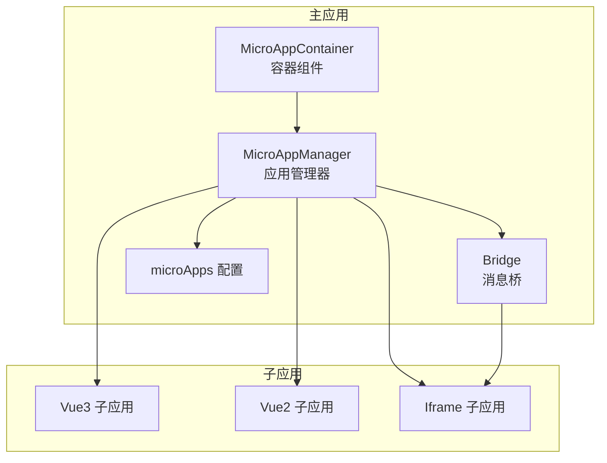
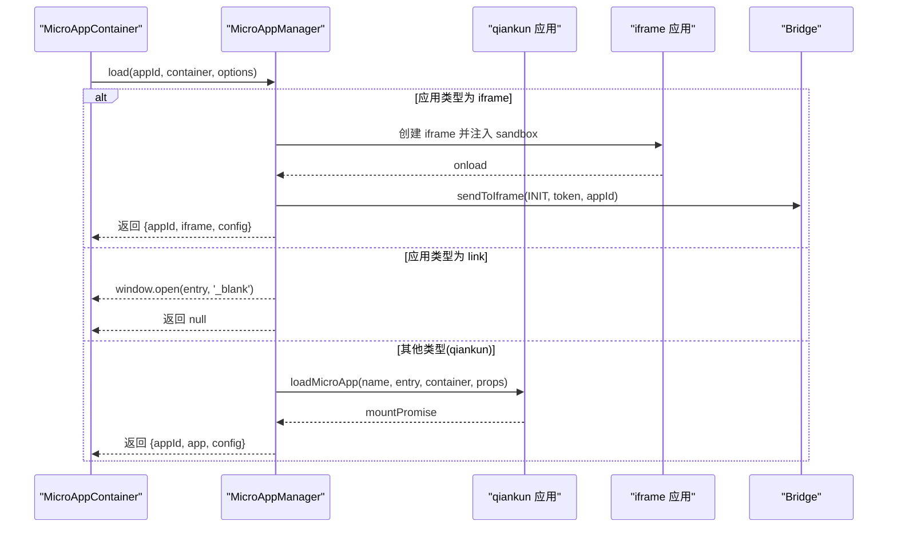
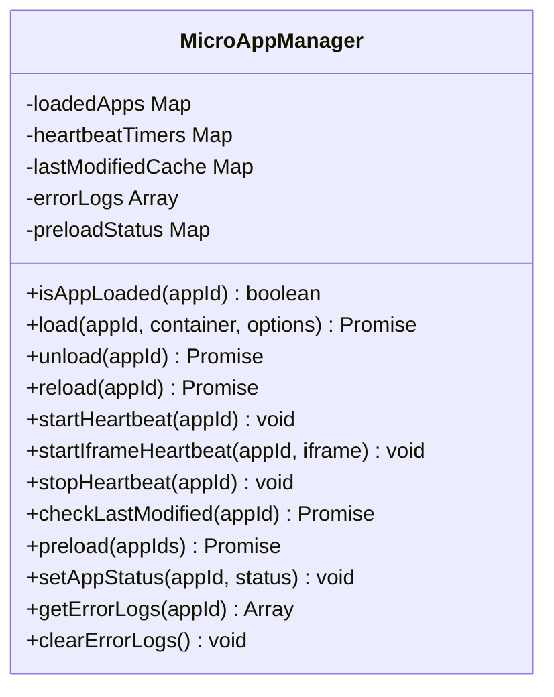
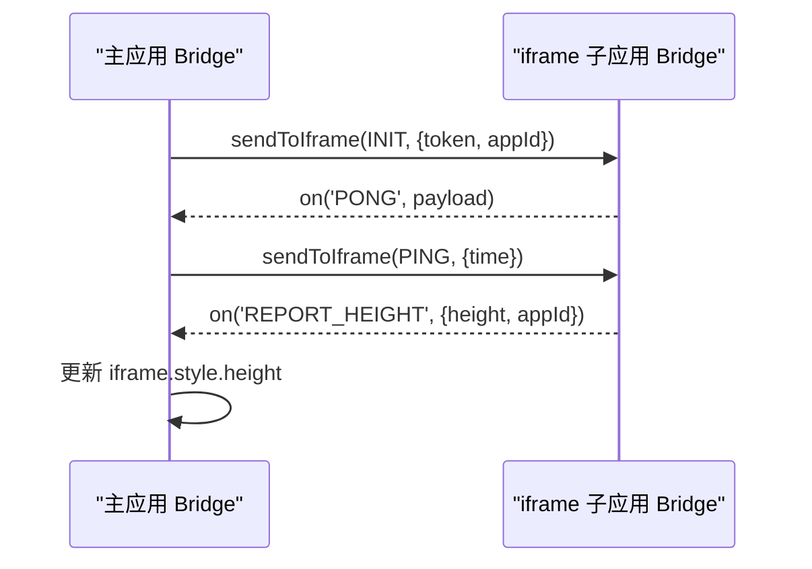
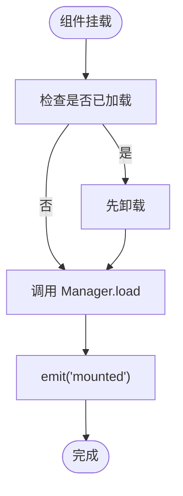
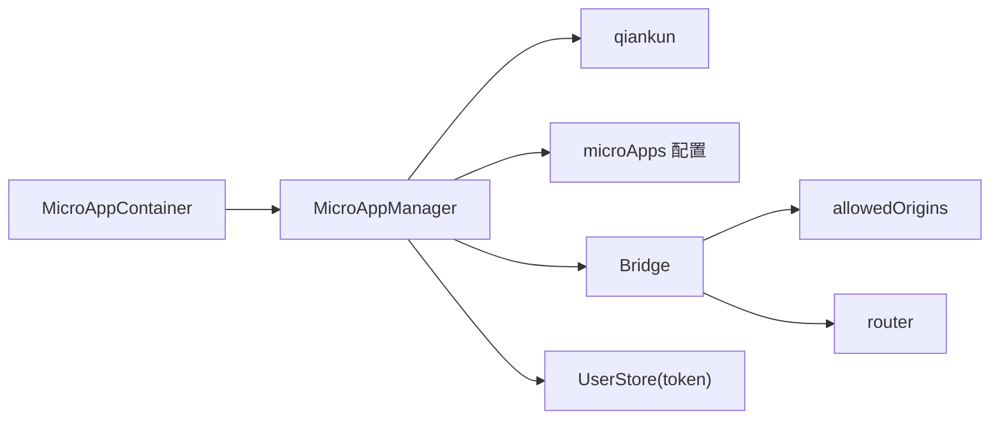
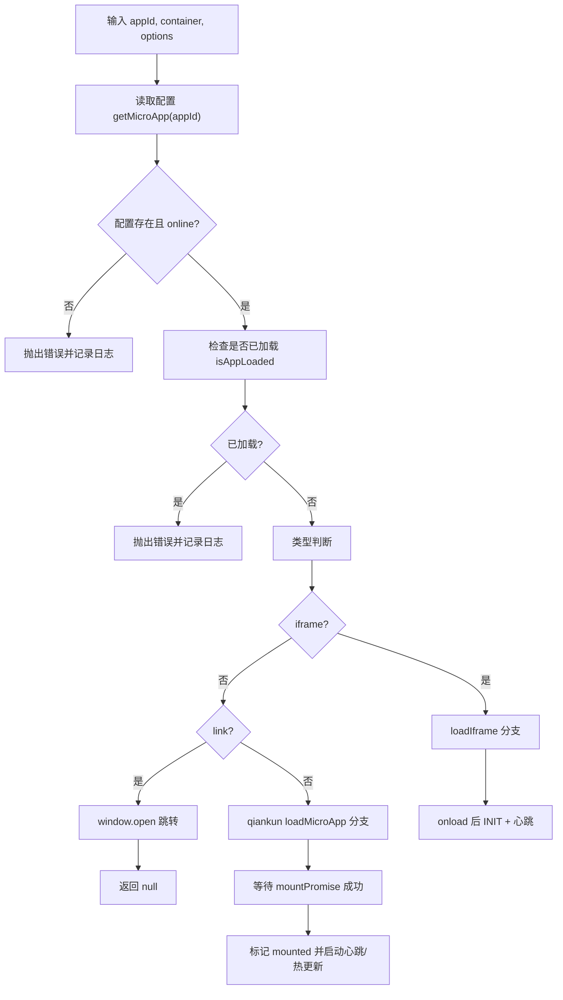
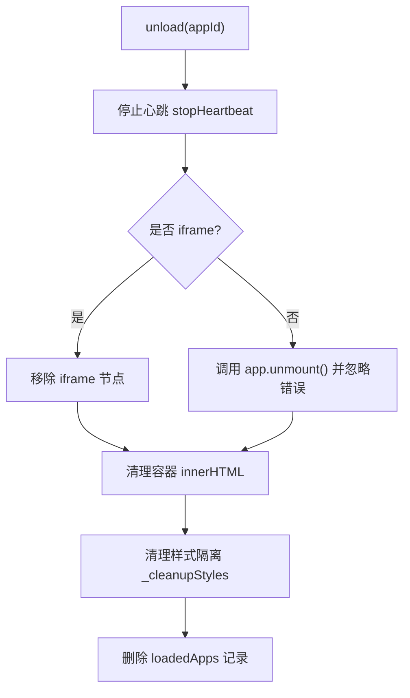
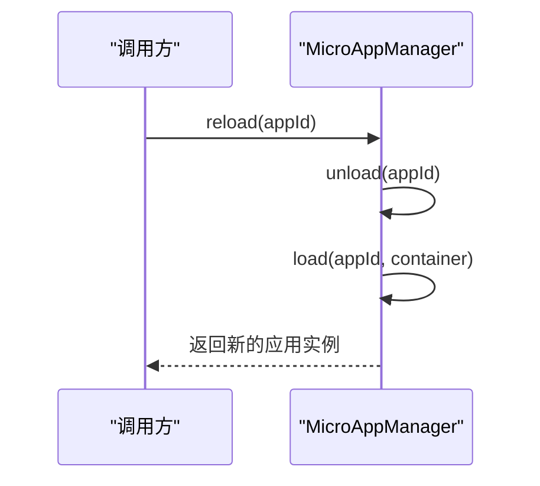

# 应用生命周期管理

<cite>
**本文引用的文件**
- [packages/main-app/src/core/microAppManager.js](file://packages/main-app/src/core/microAppManager.js)
- [packages/main-app/src/config/microApps.js](file://packages/main-app/src/config/microApps.js)
- [packages/main-app/src/components/MicroAppContainer.vue](file://packages/main-app/src/components/MicroAppContainer.vue)
- [packages/main-app/src/core/bridge.js](file://packages/main-app/src/core/bridge.js)
- [packages/iframe-sub-app/src/bridge.js](file://packages/iframe-sub-app/src/bridge.js)
- [packages/vue3-sub-app/src/main.js](file://packages/vue3-sub-app/src/main.js)
- [packages/vue2-sub-app/src/main.js](file://packages/vue2-sub-app/src/main.js)
- [user-docs/api/micro-app-manager.md](file://user-docs/api/micro-app-manager.md)
- [README.md](file://README.md)
</cite>

## 目录
1. [简介](#简介)
2. [项目结构](#项目结构)
3. [核心组件](#核心组件)
4. [架构总览](#架构总览)
5. [详细组件分析](#详细组件分析)
6. [依赖关系分析](#依赖关系分析)
7. [性能考量](#性能考量)
8. [故障排查指南](#故障排查指南)
9. [结论](#结论)
10. [附录](#附录)

## 简介
本技术文档围绕微应用生命周期管理功能展开，系统性解析以下能力：
- 应用加载（load）：参数校验、容器检查、qiankun 应用初始化与属性传递、iframe 与 link 类型分支处理
- 应用卸载（unload）：优雅卸载流程、DOM 清理、样式隔离清理、错误兜底
- 应用刷新（reload）：无感刷新实现、容器状态保持
- 状态检查（isAppLoaded）：应用存在性判断
- 特殊类型处理：iframe 类型应用的特殊处理逻辑；link 类型应用的直接跳转机制
- API 使用示例、错误处理方案与性能优化建议

## 项目结构
本仓库采用 Monorepo 架构，主应用与各类型子应用分别位于 packages 下的不同包中。微应用生命周期管理的核心逻辑集中在主应用的 microAppManager 与相关桥接模块中。

图表来源
- [packages/main-app/src/core/microAppManager.js](file://packages/main-app/src/core/microAppManager.js#L1-L515)
- [packages/main-app/src/config/microApps.js](file://packages/main-app/src/config/microApps.js#L1-L110)
- [packages/main-app/src/components/MicroAppContainer.vue](file://packages/main-app/src/components/MicroAppContainer.vue#L1-L167)
- [packages/main-app/src/core/bridge.js](file://packages/main-app/src/core/bridge.js#L1-L241)
- [packages/vue3-sub-app/src/main.js](file://packages/vue3-sub-app/src/main.js#L1-L115)
- [packages/vue2-sub-app/src/main.js](file://packages/vue2-sub-app/src/main.js#L1-L120)
- [packages/iframe-sub-app/src/bridge.js](file://packages/iframe-sub-app/src/bridge.js#L53-L215)

章节来源
- [README.md](file://README.md#L62-L76)

## 核心组件
- MicroAppManager：微应用生命周期与状态管理的核心类，负责 load、unload、reload、isAppLoaded、心跳检测、样式清理、预加载、上下线控制等
- Bridge：主应用与子应用之间的消息桥，支持 origin 校验、消息分发、广播、心跳、高度上报等
- MicroAppContainer：承载容器组件，封装加载/卸载/重试逻辑，与 MicroAppManager 协作
- microApps 配置：集中定义各子应用的入口、类型、激活规则、布局选项等

章节来源
- [packages/main-app/src/core/microAppManager.js](file://packages/main-app/src/core/microAppManager.js#L11-L515)
- [packages/main-app/src/core/bridge.js](file://packages/main-app/src/core/bridge.js#L9-L241)
- [packages/main-app/src/components/MicroAppContainer.vue](file://packages/main-app/src/components/MicroAppContainer.vue#L28-L167)
- [packages/main-app/src/config/microApps.js](file://packages/main-app/src/config/microApps.js#L1-L110)

## 架构总览
微应用生命周期管理以 MicroAppManager 为中心，结合 Bridge 实现主子应用间通信，配合容器组件完成渲染与交互。不同类型的子应用（qiankun、iframe、link）在 load 流程中走不同的分支，卸载与刷新流程统一由 Manager 统一调度。

图表来源
- [packages/main-app/src/core/microAppManager.js](file://packages/main-app/src/core/microAppManager.js#L49-L165)
- [packages/main-app/src/core/microAppManager.js](file://packages/main-app/src/core/microAppManager.js#L173-L232)
- [packages/main-app/src/core/bridge.js](file://packages/main-app/src/core/bridge.js#L150-L155)

## 详细组件分析

### MicroAppManager：生命周期与状态管理
- load(appId, container, options)
  - 参数校验：应用存在性、状态、重复加载防护
  - 容器检查：支持字符串选择器或 HTMLElement
  - 类型分支：
    - iframe：创建 iframe，注入 sandbox，onload 后通过 Bridge 发送 INIT 消息，启动心跳
    - link：直接 window.open 跳转新窗口
    - 其他：调用 qiankun loadMicroApp，传递 props（token、mainRouter、bridge、appId 等），启用沙箱与样式隔离，等待 mountPromise
  - 状态与监控：记录加载时间、状态、错误；启动心跳检测；对非 iframe 应用进行 last-modified 热更新检查
- unload(appId)
  - 停止心跳
  - 优雅卸载：
    - iframe：移除 iframe 节点
    - qiankun：调用 app.unmount() 并忽略错误
  - 清理：容器 innerHTML 清空、样式隔离清理（data-qiankun 与子应用 entry 注入的 link/style）
  - 删除内存记录
- reload(appId)
  - 先 unload 再 load，保证容器状态保持
- isAppLoaded(appId)
  - 基于 loadedApps 映射判断
- 心跳检测与热更新
  - qiankun 应用：定期查询 getStatus，若处于未挂载/卸载中则标记为不健康
  - iframe 应用：周期性向子应用发送 PING，子应用回 PONG
  - 热更新：对非 iframe 应用 HEAD 请求 entry 的 last-modified，若变更则自动 reload
- 预加载与上下线
  - 预加载：对配置为 preload 且在线的应用发起 prefetch
  - 上下线：setAppStatus 将应用置为 offline 时，若已加载则自动卸载

图表来源
- [packages/main-app/src/core/microAppManager.js](file://packages/main-app/src/core/microAppManager.js#L11-L515)

章节来源
- [packages/main-app/src/core/microAppManager.js](file://packages/main-app/src/core/microAppManager.js#L38-L165)
- [packages/main-app/src/core/microAppManager.js](file://packages/main-app/src/core/microAppManager.js#L238-L334)
- [packages/main-app/src/core/microAppManager.js](file://packages/main-app/src/core/microAppManager.js#L340-L386)
- [packages/main-app/src/core/microAppManager.js](file://packages/main-app/src/core/microAppManager.js#L392-L415)
- [packages/main-app/src/core/microAppManager.js](file://packages/main-app/src/core/microAppManager.js#L421-L440)
- [packages/main-app/src/core/microAppManager.js](file://packages/main-app/src/core/microAppManager.js#L447-L458)

### Bridge：主子应用通信
- 功能要点
  - 消息监听与处理：setupListener，handleMessage，按 type 分发
  - 默认处理器：导航、请求 token、心跳响应、高度上报等
  - 发送接口：send、sendToIframe、broadcast、syncToken
  - 跨域安全：allowedOrigins 白名单校验
- 与 iframe 的协作
  - 主应用通过 Bridge 向 iframe 发送 INIT、PING 等消息
  - iframe 侧通过 window.iframeBridge 接收并回 PONG，上报高度等

图表来源
- [packages/main-app/src/core/bridge.js](file://packages/main-app/src/core/bridge.js#L96-L114)
- [packages/main-app/src/core/bridge.js](file://packages/main-app/src/core/bridge.js#L150-L155)
- [packages/iframe-sub-app/src/bridge.js](file://packages/iframe-sub-app/src/bridge.js#L78-L83)
- [packages/iframe-sub-app/src/bridge.js](file://packages/iframe-sub-app/src/bridge.js#L180-L198)

章节来源
- [packages/main-app/src/core/bridge.js](file://packages/main-app/src/core/bridge.js#L9-L241)
- [packages/iframe-sub-app/src/bridge.js](file://packages/iframe-sub-app/src/bridge.js#L53-L215)

### MicroAppContainer：容器组件与生命周期协作
- 职责
  - 提供稳定容器 DOM，避免 qiankun 挂载时找不到节点
  - 在组件挂载时触发 load，页面切换或 appId 变更时触发卸载与重新加载
  - onBeforeUnmount 中仅卸载已挂载状态的应用，避免干扰加载过程
  - 暴露 reload 方法供外部触发
- 与 Manager 的协作
  - 加载前检查并必要时先卸载已加载实例
  - 传递 props（如 subPath、mainRouter）给子应用

图表来源
- [packages/main-app/src/components/MicroAppContainer.vue](file://packages/main-app/src/components/MicroAppContainer.vue#L51-L83)
- [packages/main-app/src/components/MicroAppContainer.vue](file://packages/main-app/src/components/MicroAppContainer.vue#L107-L116)

章节来源
- [packages/main-app/src/components/MicroAppContainer.vue](file://packages/main-app/src/components/MicroAppContainer.vue#L28-L167)

### 子应用适配：qiankun 与 iframe
- Vue3 子应用
  - renderWithQiankun 注册生命周期
  - mount 时根据是否 qiankun 模式选择 history 类型，memory history 需手动导航
  - unmount 时避免直接调用 app.unmount，改为停止响应式作用域并清理引用与容器内容
- Vue2 子应用
  - render 函数中根据是否 qiankun 模式选择路由模式
  - unmount 中销毁实例并清理容器
- Iframe 子应用
  - 通过 window.iframeBridge 接收 INIT、PING 等消息，回 PONG 并上报高度

章节来源
- [packages/vue3-sub-app/src/main.js](file://packages/vue3-sub-app/src/main.js#L18-L105)
- [packages/vue2-sub-app/src/main.js](file://packages/vue2-sub-app/src/main.js#L22-L113)
- [packages/iframe-sub-app/src/bridge.js](file://packages/iframe-sub-app/src/bridge.js#L78-L83)

## 依赖关系分析
- MicroAppManager 依赖
  - qiankun：loadMicroApp、prefetchApps
  - microApps 配置：getMicroApp、updateMicroAppConfig
  - Bridge：sendToIframe、广播
  - 用户状态：useUserStore（token）
- Bridge 依赖
  - 允许的 origin 白名单
  - 路由：router（用于导航）
- 容器组件依赖
  - MicroAppManager
  - vue-router

图表来源
- [packages/main-app/src/core/microAppManager.js](file://packages/main-app/src/core/microAppManager.js#L1-L5)
- [packages/main-app/src/core/bridge.js](file://packages/main-app/src/core/bridge.js#L11-L27)
- [packages/main-app/src/components/MicroAppContainer.vue](file://packages/main-app/src/components/MicroAppContainer.vue#L30-L31)

章节来源
- [packages/main-app/src/core/microAppManager.js](file://packages/main-app/src/core/microAppManager.js#L1-L5)
- [packages/main-app/src/core/bridge.js](file://packages/main-app/src/core/bridge.js#L1-L27)
- [packages/main-app/src/components/MicroAppContainer.vue](file://packages/main-app/src/components/MicroAppContainer.vue#L28-L31)

## 性能考量
- 预加载（prefetch）：对配置为 preload 且在线的应用发起预取，减少首次加载延迟
- 样式隔离与清理：启用 experimentalStyleIsolation，卸载时清理 data-qiankun 与子应用 entry 注入的样式，避免样式污染
- 心跳检测：30 秒一次的心跳，及时发现异常状态
- 热更新：HEAD last-modified 检测，自动 reload，提升开发体验
- 容器稳定性：容器始终存在于 DOM 中，确保 qiankun 正常挂载

章节来源
- [packages/main-app/src/core/microAppManager.js](file://packages/main-app/src/core/microAppManager.js#L421-L440)
- [packages/main-app/src/core/microAppManager.js](file://packages/main-app/src/core/microAppManager.js#L108-L120)
- [packages/main-app/src/core/microAppManager.js](file://packages/main-app/src/core/microAppManager.js#L292-L313)
- [packages/main-app/src/core/microAppManager.js](file://packages/main-app/src/core/microAppManager.js#L340-L357)
- [packages/main-app/src/core/microAppManager.js](file://packages/main-app/src/core/microAppManager.js#L392-L415)

## 故障排查指南
- 加载失败
  - 检查应用是否存在、状态是否 online、是否重复加载
  - 检查容器是否存在、是否传入正确的 HTMLElement 或选择器
  - 查看错误日志：getErrorLogs(appId)
- 卸载异常
  - 若卸载过程中出现错误，Manager 会强制清理容器与样式，确保无残留
- 心跳异常
  - qiankun 应用：getStatus 返回未挂载或卸载中则标记为不健康
  - iframe 应用：未收到 PONG 或 PING 超时
- 热更新未生效
  - 确认非 iframe 应用且 entry 支持 HEAD 请求，last-modified 可用
- 预加载无效
  - 确认应用配置为 online 且 preload 为 true，且类型非 iframe

章节来源
- [packages/main-app/src/core/microAppManager.js](file://packages/main-app/src/core/microAppManager.js#L52-L69)
- [packages/main-app/src/core/microAppManager.js](file://packages/main-app/src/core/microAppManager.js#L238-L284)
- [packages/main-app/src/core/microAppManager.js](file://packages/main-app/src/core/microAppManager.js#L340-L357)
- [packages/main-app/src/core/microAppManager.js](file://packages/main-app/src/core/microAppManager.js#L392-L415)
- [packages/main-app/src/core/microAppManager.js](file://packages/main-app/src/core/microAppManager.js#L421-L440)

## 结论
本方案以 MicroAppManager 为核心，结合 Bridge 实现主子应用通信，统一管理 qiankun 与 iframe 等多类型子应用的生命周期。通过容器稳定性、样式隔离、心跳检测与热更新机制，保障微前端系统的可靠性与可维护性。同时提供完善的 API 与错误处理策略，便于上层业务集成与扩展。

## 附录

### API 使用示例
- 加载应用
  - 通过 MicroAppContainer 触发加载，或直接调用 Manager.load
  - 传递 props（如 subPath、mainRouter）给子应用
- 卸载应用
  - 调用 Manager.unload(appId)，自动清理容器与样式
- 刷新应用
  - 调用 Manager.reload(appId)，先卸载再重新加载，保持容器状态
- 预加载
  - 调用 Manager.preload(appIds) 或不传参预加载所有配置为 preload 的应用
- 设置应用上下线
  - 调用 Manager.setAppStatus(appId, status)，若置为 offline 且已加载则自动卸载

章节来源
- [user-docs/api/micro-app-manager.md](file://user-docs/api/micro-app-manager.md#L13-L76)
- [packages/main-app/src/components/MicroAppContainer.vue](file://packages/main-app/src/components/MicroAppContainer.vue#L65-L74)
- [packages/main-app/src/core/microAppManager.js](file://packages/main-app/src/core/microAppManager.js#L421-L440)
- [packages/main-app/src/core/microAppManager.js](file://packages/main-app/src/core/microAppManager.js#L447-L458)

### 关键流程图

#### load() 参数校验与容器检查

图表来源
- [packages/main-app/src/core/microAppManager.js](file://packages/main-app/src/core/microAppManager.js#L49-L165)
- [packages/main-app/src/core/microAppManager.js](file://packages/main-app/src/core/microAppManager.js#L173-L232)

#### unload() 优雅卸载与清理

图表来源
- [packages/main-app/src/core/microAppManager.js](file://packages/main-app/src/core/microAppManager.js#L238-L284)
- [packages/main-app/src/core/microAppManager.js](file://packages/main-app/src/core/microAppManager.js#L292-L313)

#### reload() 无感刷新

图表来源
- [packages/main-app/src/core/microAppManager.js](file://packages/main-app/src/core/microAppManager.js#L319-L334)