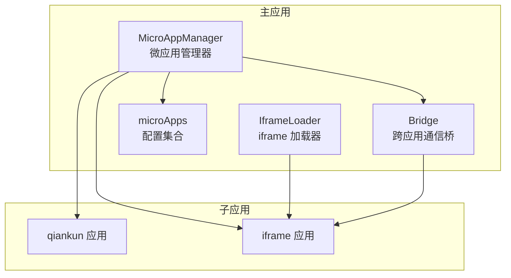
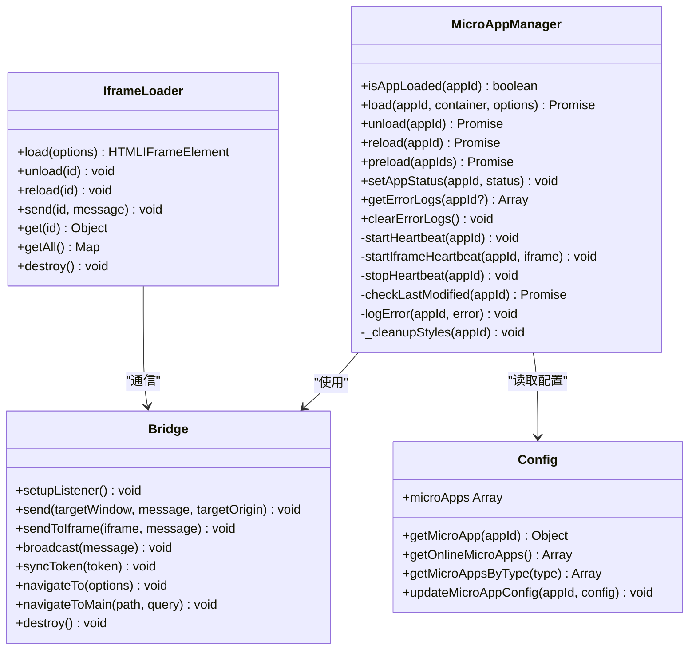
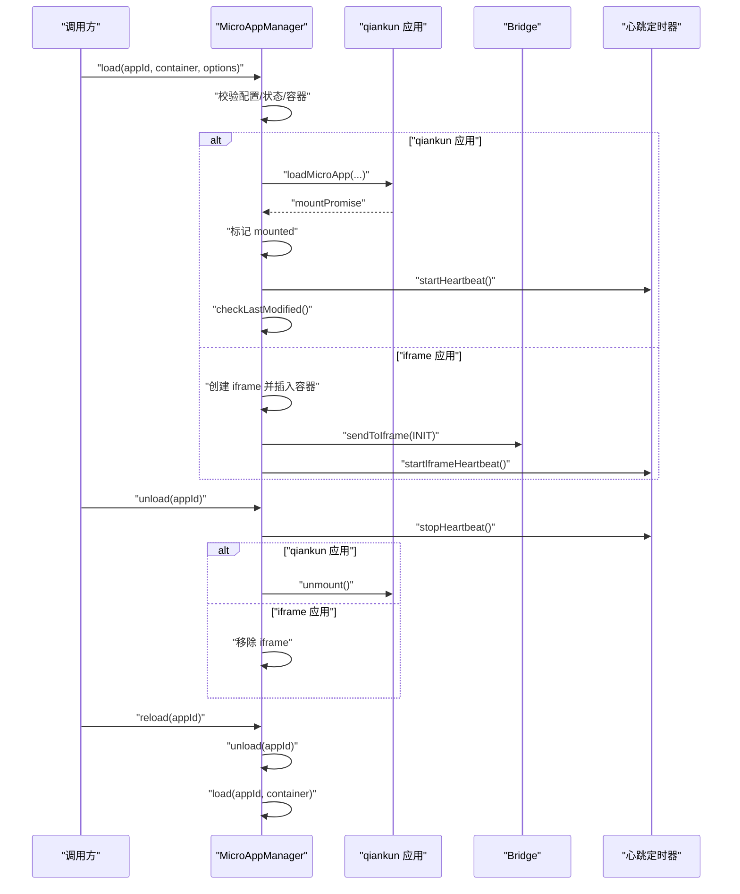
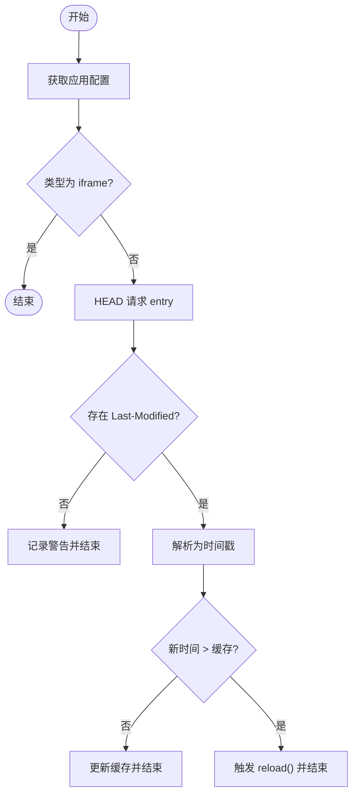
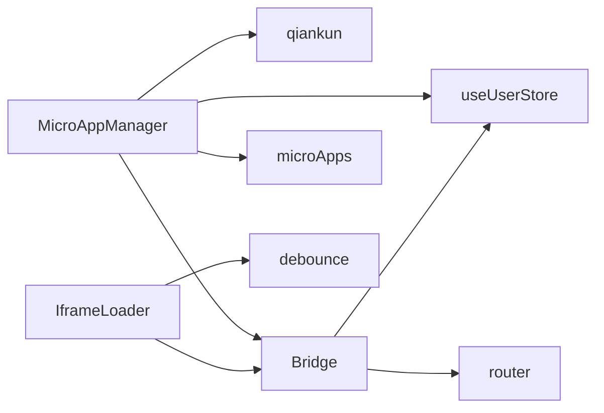

# 微应用管理器

<cite>
**本文引用的文件**
- [packages/main-app/src/core/microAppManager.js](file://packages/main-app/src/core/microAppManager.js)
- [packages/main-app/src/config/microApps.js](file://packages/main-app/src/config/microApps.js)
- [packages/main-app/src/core/bridge.js](file://packages/main-app/src/core/bridge.js)
- [packages/main-app/src/core/iframeLoader.js](file://packages/main-app/src/core/iframeLoader.js)
- [user-docs/api/micro-app-manager.md](file://user-docs/api/micro-app-manager.md)
- [user-docs/api/config.md](file://user-docs/api/config.md)
- [user-docs/guide/getting-started.md](file://user-docs/guide/getting-started.md)
- [user-docs/guide/sub-apps.md](file://user-docs/guide/sub-apps.md)
- [README.md](file://README.md)
- [package.json](file://package.json)
</cite>

## 目录
1. [简介](#简介)
2. [项目结构](#项目结构)
3. [核心组件](#核心组件)
4. [架构总览](#架构总览)
5. [详细组件分析](#详细组件分析)
6. [依赖关系分析](#依赖关系分析)
7. [性能考量](#性能考量)
8. [故障排除指南](#故障排除指南)
9. [结论](#结论)
10. [附录](#附录)

## 简介
本技术文档围绕微应用管理器展开，系统性解析其单例模式实现、多实例支持机制、应用生命周期管理、load()/unload()/reload()/isAppLoaded()等关键流程，并深入阐述热更新检测（Last-Modified）、心跳检测系统、预加载功能与错误日志管理。同时提供API接口说明、配置参数、使用示例与最佳实践，帮助开发者快速掌握微应用管理的核心原理与高级用法。

## 项目结构
本仓库采用 Monorepo 架构，微应用管理器位于主应用包内，核心文件包括：
- 微应用管理器：packages/main-app/src/core/microAppManager.js
- 微应用配置：packages/main-app/src/config/microApps.js
- 跨应用通信桥：packages/main-app/src/core/bridge.js
- iframe 加载器：packages/main-app/src/core/iframeLoader.js
- 用户文档：user-docs/api/micro-app-manager.md、user-docs/api/config.md、user-docs/guide/getting-started.md、user-docs/guide/sub-apps.md

图表来源
- [packages/main-app/src/core/microAppManager.js](file://packages/main-app/src/core/microAppManager.js#L1-L515)
- [packages/main-app/src/config/microApps.js](file://packages/main-app/src/config/microApps.js#L1-L110)
- [packages/main-app/src/core/bridge.js](file://packages/main-app/src/core/bridge.js#L1-L241)
- [packages/main-app/src/core/iframeLoader.js](file://packages/main-app/src/core/iframeLoader.js#L1-L334)

章节来源
- [README.md](file://README.md#L62-L76)
- [package.json](file://package.json#L6-L9)

## 核心组件
- 微应用管理器（MicroAppManager）：负责应用加载、卸载、刷新、状态检查、心跳检测、热更新检测、预加载、错误日志与样式清理。
- 跨应用通信桥（Bridge）：统一的消息通道，支持主应用与子应用、子应用与子应用之间的通信；提供心跳、高度上报、导航跳转、令牌同步等能力。
- iframe 加载器（IframeLoader）：独立的 iframe 生命周期管理与通信封装，补充主应用内的 iframe 管理能力。
- 微应用配置（microApps）：集中管理各子应用的配置项，提供查询、过滤与动态更新能力。

章节来源
- [packages/main-app/src/core/microAppManager.js](file://packages/main-app/src/core/microAppManager.js#L11-L31)
- [packages/main-app/src/core/bridge.js](file://packages/main-app/src/core/bridge.js#L9-L27)
- [packages/main-app/src/core/iframeLoader.js](file://packages/main-app/src/core/iframeLoader.js#L9-L19)
- [packages/main-app/src/config/microApps.js](file://packages/main-app/src/config/microApps.js#L5-L69)

## 架构总览
微应用管理器以单例模式对外暴露，内部维护运行态应用映射、心跳定时器、lastModified 缓存、错误日志与预加载状态。对 qiankun 子应用通过 loadMicroApp 管理生命周期；对 iframe 子应用通过原生 iframe 与 Bridge 进行通信与心跳检测；对 link 类型直接触发浏览器跳转。

图表来源
- [packages/main-app/src/core/microAppManager.js](file://packages/main-app/src/core/microAppManager.js#L11-L515)
- [packages/main-app/src/core/bridge.js](file://packages/main-app/src/core/bridge.js#L9-L241)
- [packages/main-app/src/core/iframeLoader.js](file://packages/main-app/src/core/iframeLoader.js#L9-L334)
- [packages/main-app/src/config/microApps.js](file://packages/main-app/src/config/microApps.js#L5-L110)

## 详细组件分析

### 单例模式实现
- 微应用管理器通过类构造并在模块末尾导出单例实例，保证全局唯一性与状态一致性。
- Bridge 与 IframeLoader 同样采用单例导出，便于跨模块共享与统一管理。

章节来源
- [packages/main-app/src/core/microAppManager.js](file://packages/main-app/src/core/microAppManager.js#L511-L515)
- [packages/main-app/src/core/bridge.js](file://packages/main-app/src/core/bridge.js#L219-L241)
- [packages/main-app/src/core/iframeLoader.js](file://packages/main-app/src/core/iframeLoader.js#L330-L334)

### 多实例支持机制
- 管理器内部以 appId 为键维护运行态应用映射，每个 appId 同时仅允许一个实例处于“已加载”状态。
- 对于 iframe 类型，管理器通过原生 iframe 元素进行装载与卸载，不依赖 qiankun 的实例池，从而天然支持同屏多实例（由调用方控制容器与实例 ID）。
- 若需要同屏多实例，建议为每个实例分配独立容器与唯一标识，并在调用 load()/unload() 时明确传入对应容器。

章节来源
- [packages/main-app/src/core/microAppManager.js](file://packages/main-app/src/core/microAppManager.js#L13-L14)
- [packages/main-app/src/core/microAppManager.js](file://packages/main-app/src/core/microAppManager.js#L64-L69)
- [packages/main-app/src/core/microAppManager.js](file://packages/main-app/src/core/microAppManager.js#L173-L232)

### 应用生命周期管理
- 加载（load）：校验配置与状态，解析容器，按类型分别处理 qiankun 或 iframe；等待挂载完成，记录状态并启动心跳与热更新检测。
- 卸载（unload）：停止心跳，调用 qiankun 的 unmount 或移除 iframe，清理容器与注入样式，删除映射。
- 刷新（reload）：先卸载再加载，保持容器不变，实现无缝刷新。
- 状态检查（isAppLoaded）：根据映射判断应用是否已加载。

图表来源
- [packages/main-app/src/core/microAppManager.js](file://packages/main-app/src/core/microAppManager.js#L49-L165)
- [packages/main-app/src/core/microAppManager.js](file://packages/main-app/src/core/microAppManager.js#L238-L284)
- [packages/main-app/src/core/microAppManager.js](file://packages/main-app/src/core/microAppManager.js#L319-L334)
- [packages/main-app/src/core/bridge.js](file://packages/main-app/src/core/bridge.js#L149-L155)

章节来源
- [packages/main-app/src/core/microAppManager.js](file://packages/main-app/src/core/microAppManager.js#L38-L165)
- [packages/main-app/src/core/microAppManager.js](file://packages/main-app/src/core/microAppManager.js#L238-L334)

### load() 加载流程
- 参数校验：appId 存在、状态 online、未重复加载。
- 容器解析：支持字符串选择器或 HTMLElement。
- 类型分支：
  - qiankun：构建 loadMicroApp 配置，传入用户令牌、主应用路由、Bridge 等 props，启用沙箱样式隔离与多实例模式。
  - iframe：创建 iframe，设置 sandbox，插入容器，onload 后发送 INIT 并启动心跳。
  - link：直接在新窗口打开入口地址。
- 成功后等待挂载完成，标记状态为 mounted，启动心跳与热更新检测。

章节来源
- [packages/main-app/src/core/microAppManager.js](file://packages/main-app/src/core/microAppManager.js#L49-L165)
- [packages/main-app/src/core/microAppManager.js](file://packages/main-app/src/core/microAppManager.js#L173-L232)

### unload() 卸载机制
- 停止心跳定时器。
- qiankun 应用：调用 unmount 并捕获异常，确保清理完成。
- iframe 应用：移除 iframe 节点，清理容器内容。
- 清理注入样式：移除 qiankun 样式与来自子应用 entry 的 link/style。
- 删除映射并输出日志。

章节来源
- [packages/main-app/src/core/microAppManager.js](file://packages/main-app/src/core/microAppManager.js#L238-L313)

### reload() 刷新功能
- 先执行 unload(appId)，再调用 load(appId, container) 重新加载。
- 保持容器不变，实现无感知刷新。

章节来源
- [packages/main-app/src/core/microAppManager.js](file://packages/main-app/src/core/microAppManager.js#L319-L334)

### isAppLoaded() 状态检查
- 通过内部映射判断应用是否已加载。

章节来源
- [packages/main-app/src/core/microAppManager.js](file://packages/main-app/src/core/microAppManager.js#L38-L40)

### 热更新检测机制（Last-Modified）
- 对非 iframe 类型应用，定期发起 HEAD 请求获取 Last-Modified。
- 将服务器时间转换为时间戳并与本地缓存比较，若新时间更大则触发 reload。
- 异常场景记录告警日志。

图表来源
- [packages/main-app/src/core/microAppManager.js](file://packages/main-app/src/core/microAppManager.js#L392-L415)

章节来源
- [packages/main-app/src/core/microAppManager.js](file://packages/main-app/src/core/microAppManager.js#L392-L415)

### 心跳检测系统
- qiankun 应用：每 30 秒检查 getStatus，若为 NOT_MOUNTED/UNMOUNTING 则标记为不健康。
- iframe 应用：每 30 秒向子应用发送 PING，子应用需回送 PONG；超过 60 秒无响应标记为不健康。
- 心跳定时器随应用卸载自动清理。

章节来源
- [packages/main-app/src/core/microAppManager.js](file://packages/main-app/src/core/microAppManager.js#L340-L386)
- [packages/main-app/src/core/bridge.js](file://packages/main-app/src/core/bridge.js#L60-L72)
- [packages/main-app/src/core/iframeLoader.js](file://packages/main-app/src/core/iframeLoader.js#L215-L231)

### 预加载功能
- 支持传入 appIds 或自动扫描配置中 preload=true 且状态 online 的应用。
- 调用 prefetchApps 执行预取，更新预加载状态映射。

章节来源
- [packages/main-app/src/core/microAppManager.js](file://packages/main-app/src/core/microAppManager.js#L421-L440)

### 错误日志管理
- 统一记录错误：包含 appId、message、stack、time。
- 限制保留最近 100 条，便于诊断与审计。
- 提供按应用过滤与清空接口。

章节来源
- [packages/main-app/src/core/microAppManager.js](file://packages/main-app/src/core/microAppManager.js#L473-L508)

### 跨应用通信桥（Bridge）
- 提供消息监听、注册/注销处理器、广播、令牌同步、导航跳转等能力。
- 对 iframe 通信进行 origin 校验与目标定位，确保安全可靠。
- 暴露 window.__ARTISAN_BRIDGE__ 供子应用使用。

章节来源
- [packages/main-app/src/core/bridge.js](file://packages/main-app/src/core/bridge.js#L9-L241)
- [packages/main-app/src/core/bridge.js](file://packages/main-app/src/core/bridge.js#L225-L238)

### iframe 加载器（IframeLoader）
- 独立管理 iframe 生命周期，支持自动高度、心跳、消息监听、刷新与卸载。
- 与 Bridge 协作完成初始化、心跳与导航转发。

章节来源
- [packages/main-app/src/core/iframeLoader.js](file://packages/main-app/src/core/iframeLoader.js#L9-L334)

## 依赖关系分析
- MicroAppManager 依赖：
  - qiankun：loadMicroApp/prefetchApps
  - Vue 响应式：reactive/markRaw
  - 配置模块：getMicroApp/updateMicroAppConfig
  - 用户状态：useUserStore
  - Bridge：跨应用通信
- Bridge 依赖：
  - 路由：router
  - 用户状态：useUserStore
- IframeLoader 依赖：
  - Bridge
  - 防抖工具：debounce

图表来源
- [packages/main-app/src/core/microAppManager.js](file://packages/main-app/src/core/microAppManager.js#L1-L6)
- [packages/main-app/src/core/bridge.js](file://packages/main-app/src/core/bridge.js#L1-L3)
- [packages/main-app/src/core/iframeLoader.js](file://packages/main-app/src/core/iframeLoader.js#L1-L4)

章节来源
- [packages/main-app/src/core/microAppManager.js](file://packages/main-app/src/core/microAppManager.js#L1-L6)
- [packages/main-app/src/core/bridge.js](file://packages/main-app/src/core/bridge.js#L1-L3)
- [packages/main-app/src/core/iframeLoader.js](file://packages/main-app/src/core/iframeLoader.js#L1-L4)

## 性能考量
- 多实例模式：通过 singular=false 与独立容器，避免 qiankun 实例池限制，提升并发加载能力。
- 样式隔离：启用 experimentalStyleIsolation 并在卸载时清理 qiankun 注入样式，降低样式污染风险。
- 预加载：对高频应用进行预取，缩短首次加载时间。
- 心跳与热更新：合理的心跳周期与热更新检测频率，平衡可靠性与网络开销。
- 错误日志：限制日志数量，避免内存膨胀。

章节来源
- [packages/main-app/src/core/microAppManager.js](file://packages/main-app/src/core/microAppManager.js#L108-L120)
- [packages/main-app/src/core/microAppManager.js](file://packages/main-app/src/core/microAppManager.js#L421-L440)
- [packages/main-app/src/core/microAppManager.js](file://packages/main-app/src/core/microAppManager.js#L473-L489)

## 故障排除指南
- 应用未找到或状态离线：检查配置是否存在、状态是否为 online。
- 容器不存在：确认传入的容器选择器或 HTMLElement 正确。
- 重复加载：确保同一 appId 仅有一个实例处于加载状态。
- qiankun 应用挂载失败：查看错误日志与状态，必要时手动卸载后重试。
- iframe 加载失败：检查 sandbox 配置、跨域与消息监听是否正常。
- 心跳异常：确认 PING/PONG 流程与 Bridge 配置正确。
- 热更新未生效：确认服务器支持 HEAD 请求与 Last-Modified 返回。

章节来源
- [packages/main-app/src/core/microAppManager.js](file://packages/main-app/src/core/microAppManager.js#L52-L62)
- [packages/main-app/src/core/microAppManager.js](file://packages/main-app/src/core/microAppManager.js#L89-L91)
- [packages/main-app/src/core/microAppManager.js](file://packages/main-app/src/core/microAppManager.js#L157-L164)
- [packages/main-app/src/core/bridge.js](file://packages/main-app/src/core/bridge.js#L96-L114)
- [packages/main-app/src/core/microAppManager.js](file://packages/main-app/src/core/microAppManager.js#L392-L415)

## 结论
微应用管理器通过单例模式、清晰的生命周期管理与完善的监控体系，实现了对多类型子应用的统一管控。结合热更新检测、心跳系统、预加载与错误日志，能够在复杂场景下保障稳定性与用户体验。建议在生产环境中配合严格的配置校验、容器隔离与日志审计，持续优化加载与刷新策略。

## 附录

### API 接口说明
- load(appId, container, options): Promise<{ appId, app, config }>
- unload(appId): Promise<void>
- reload(appId): Promise<void>
- preload(appIds?): Promise<void>
- setAppStatus(appId, status): void
- getErrorLogs(appId?): Array
- clearErrorLogs(): void
- isAppLoaded(appId): boolean

章节来源
- [user-docs/api/micro-app-manager.md](file://user-docs/api/micro-app-manager.md#L13-L116)
- [packages/main-app/src/core/microAppManager.js](file://packages/main-app/src/core/microAppManager.js#L38-L165)

### 配置参数
- id: 应用唯一标识
- name: 显示名称
- entry: 入口地址
- activeRule: 激活规则
- container: 容器选择器
- status: online/offline
- version: 版本号
- lastModified: 最后修改时间戳（用于热更新）
- preload: 是否预加载
- type: vue3/vue2/iframe/link
- layoutType/layoutOptions: 布局类型与选项
- props: 传递给子应用的额外属性

章节来源
- [user-docs/api/config.md](file://user-docs/api/config.md#L7-L28)
- [packages/main-app/src/config/microApps.js](file://packages/main-app/src/config/microApps.js#L5-L69)

### 使用示例
- 加载应用：调用 load(appId, container, { props }) 并等待 Promise 完成。
- 卸载应用：调用 unload(appId)。
- 刷新应用：调用 reload(appId)。
- 预加载应用：调用 preload([...])。
- 设置状态：调用 setAppStatus(appId, 'offline') 会自动卸载在线实例。

章节来源
- [user-docs/api/micro-app-manager.md](file://user-docs/api/micro-app-manager.md#L25-L116)
- [packages/main-app/src/core/microAppManager.js](file://packages/main-app/src/core/microAppManager.js#L421-L458)

### 最佳实践
- 为 iframe 子应用设置独立容器与唯一标识，避免样式与脚本冲突。
- 对高频访问的应用开启 preload，减少首屏等待。
- 为 qiankun 应用启用沙箱样式隔离，并在卸载时清理样式。
- 使用心跳与热更新检测保障应用健康与版本一致性。
- 严格校验 Bridge 的 origin 白名单，确保通信安全。
- 通过 getErrorLogs 与 clearErrorLogs 进行问题定位与清理。

章节来源
- [packages/main-app/src/core/microAppManager.js](file://packages/main-app/src/core/microAppManager.js#L108-L120)
- [packages/main-app/src/core/microAppManager.js](file://packages/main-app/src/core/microAppManager.js#L292-L313)
- [packages/main-app/src/core/bridge.js](file://packages/main-app/src/core/bridge.js#L96-L114)
- [packages/main-app/src/core/microAppManager.js](file://packages/main-app/src/core/microAppManager.js#L421-L458)