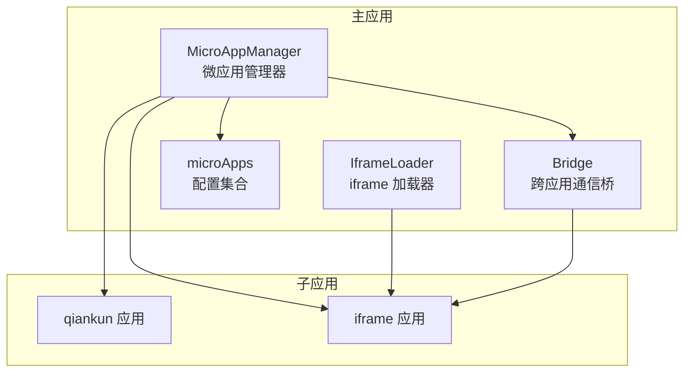
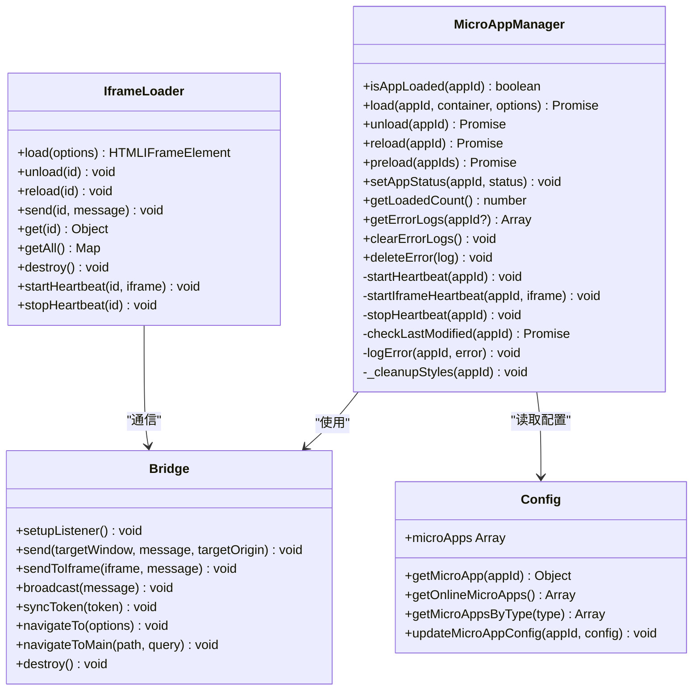
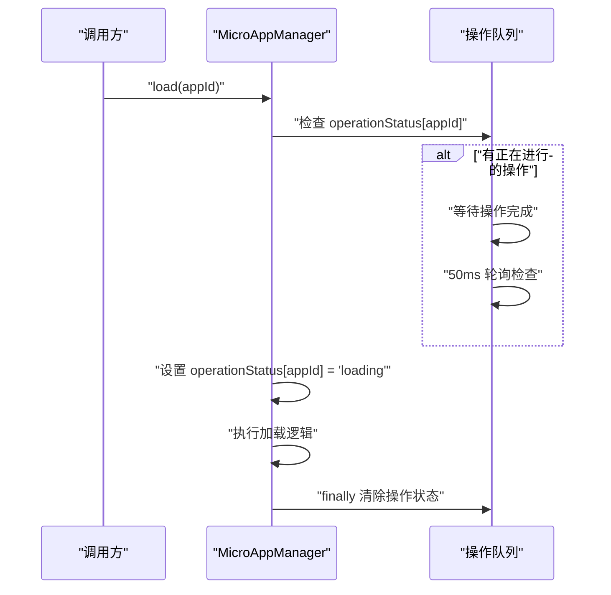
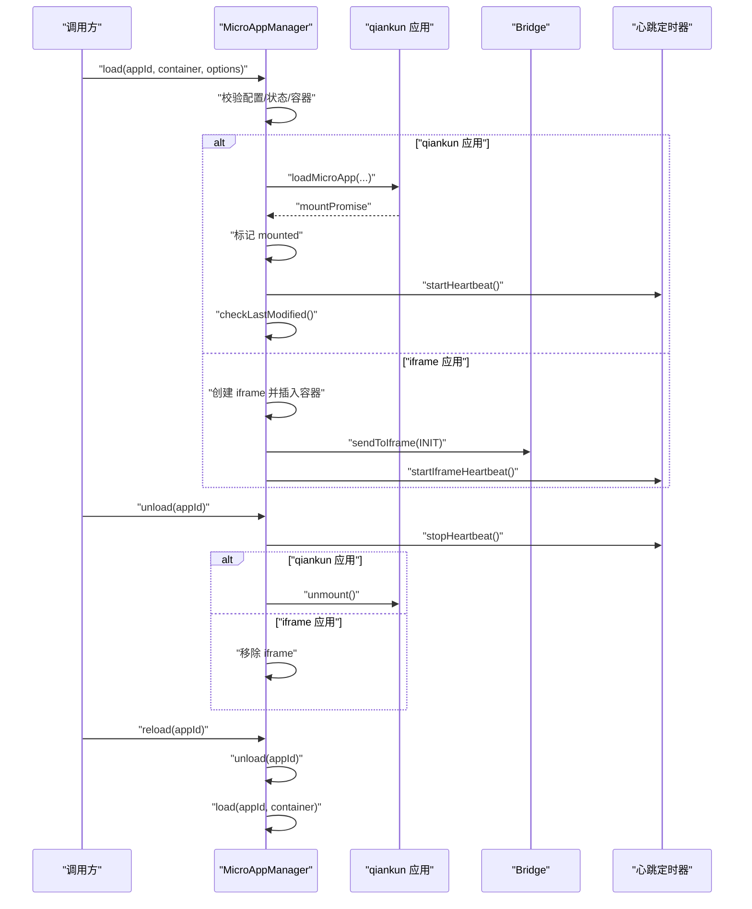
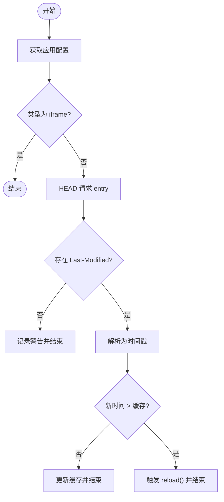
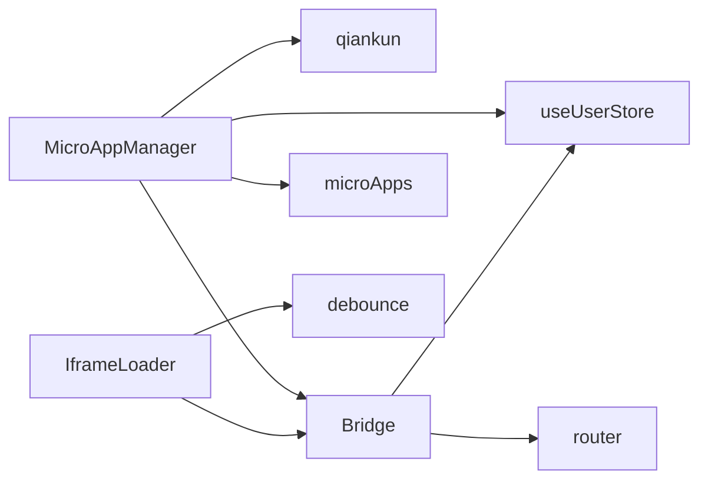

# 微应用管理器

<cite>
**本文引用的文件**
- [packages/main-app/src/core/microAppManager.js](file://packages/main-app/src/core/microAppManager.js)
- [packages/main-app/src/config/microApps.js](file://packages/main-app/src/config/microApps.js)
- [packages/main-app/src/core/bridge.js](file://packages/main-app/src/core/bridge.js)
- [packages/main-app/src/core/iframeLoader.js](file://packages/main-app/src/core/iframeLoader.js)
- [user-docs/api/micro-app-manager.md](file://user-docs/api/micro-app-manager.md)
- [user-docs/api/config.md](file://user-docs/api/config.md)
- [user-docs/guide/getting-started.md](file://user-docs/guide/getting-started.md)
- [user-docs/guide/sub-apps.md](file://user-docs/guide/sub-apps.md)
- [README.md](file://README.md)
- [package.json](file://package.json)
</cite>

## 更新摘要
**变更内容**
- 新增操作队列机制章节，详细说明防止并发冲突的实现
- 增强错误处理章节，说明增强的卸载错误处理和强制清理逻辑
- 更新样式清理功能章节，说明改进的样式隔离清理机制
- 更新API接口说明，添加新的 getLoadedCount() 方法
- 更新架构图和组件关系图，反映最新的功能增强

## 目录
1. [简介](#简介)
2. [项目结构](#项目结构)
3. [核心组件](#核心组件)
4. [架构总览](#架构总览)
5. [详细组件分析](#详细组件分析)
6. [依赖关系分析](#依赖关系分析)
7. [性能考量](#性能考量)
8. [故障排除指南](#故障排除指南)
9. [结论](#结论)
10. [附录](#附录)

## 简介
本技术文档围绕微应用管理器展开，系统性解析其单例模式实现、多应用实例支持机制、应用生命周期管理、load()/unload()/reload()/isAppLoaded()等关键流程，并深入阐述热更新检测（Last-Modified）、心跳检测系统、预加载功能与错误日志管理。最新版本增强了操作队列机制防止并发冲突、改进了样式清理功能、优化了错误处理，并提供了更完善的 API 接口。同时提供 API 接口说明、配置参数、使用示例与最佳实践，帮助开发者快速掌握微应用管理的核心原理与高级用法。

## 项目结构
本仓库采用 Monorepo 架构，微应用管理器位于主应用包内，核心文件包括：
- 微应用管理器：packages/main-app/src/core/microAppManager.js
- 微应用配置：packages/main-app/src/config/microApps.js
- 跨应用通信桥：packages/main-app/src/core/bridge.js
- iframe 加载器：packages/main-app/src/core/iframeLoader.js
- 用户文档：user-docs/api/micro-app-manager.md、user-docs/api/config.md、user-docs/guide/getting-started.md、user-docs/guide/sub-apps.md

```mermaid
graph TB
subgraph "主应用"
MAM["MicroAppManager<br/>微应用管理器"]
BR["Bridge<br/>跨应用通信桥"]
IL["IframeLoader<br/>iframe 加载器"]
CFG["microApps<br/>配置集合"]
end
subgraph "子应用"
QK["qiankun 应用"]
IF["iframe 应用"]
end
MAM --> QK
MAM --> IF
MAM --> BR
MAM --> CFG
IL --> IF
BR --> IF
```

**图表来源**
- [packages/main-app/src/core/microAppManager.js:1-560](file://packages/main-app/src/core/microAppManager.js#L1-L560)
- [packages/main-app/src/config/microApps.js:1-184](file://packages/main-app/src/config/microApps.js#L1-L184)
- [packages/main-app/src/core/bridge.js:1-258](file://packages/main-app/src/core/bridge.js#L1-L258)
- [packages/main-app/src/core/iframeLoader.js:1-335](file://packages/main-app/src/core/iframeLoader.js#L1-L335)

**章节来源**
- [README.md:62-76](file://README.md#L62-L76)
- [package.json:6-9](file://package.json#L6-L9)

## 核心组件
- **微应用管理器（MicroAppManager）**：负责应用加载、卸载、刷新、状态检查、心跳检测、热更新检测、预加载、错误日志与样式清理。最新版本增强了操作队列机制防止并发冲突、改进了样式清理功能和错误处理机制。
- **跨应用通信桥（Bridge）**：统一的消息通道，支持主应用与子应用、子应用与子应用之间的通信；提供心跳、高度上报、导航跳转、令牌同步等能力。
- **iframe 加载器（IframeLoader）**：独立的 iframe 生命周期管理与通信封装，补充主应用内的 iframe 管理能力，支持自动高度、心跳检测和消息监听。
- **微应用配置（microApps）**：集中管理各子应用的配置项，提供查询、过滤与动态更新能力。

**章节来源**
- [packages/main-app/src/core/microAppManager.js:11-34](file://packages/main-app/src/core/microAppManager.js#L11-L34)
- [packages/main-app/src/core/bridge.js:9-40](file://packages/main-app/src/core/bridge.js#L9-L40)
- [packages/main-app/src/core/iframeLoader.js:9-19](file://packages/main-app/src/core/iframeLoader.js#L9-L19)
- [packages/main-app/src/config/microApps.js:5-69](file://packages/main-app/src/config/microApps.js#L5-L69)

## 架构总览
微应用管理器以单例模式对外暴露，内部维护运行态应用映射、心跳定时器、lastModified 缓存、错误日志与预加载状态。对 qiankun 子应用通过 loadMicroApp 管理生命周期；对 iframe 子应用通过原生 iframe 与 Bridge 进行通信与心跳检测；对 link 类型直接触发浏览器跳转。最新版本引入了专门的操作队列机制防止并发冲突、专门的样式清理机制和增强的心跳检测系统。

```mermaid
classDiagram
class MicroAppManager {
+isAppLoaded(appId) boolean
+load(appId, container, options) Promise
+unload(appId) Promise
+reload(appId) Promise
+preload(appIds) Promise
+setAppStatus(appId, status) void
+getLoadedCount() number
+getErrorLogs(appId?) Array
+clearErrorLogs() void
+deleteError(log) void
-startHeartbeat(appId) void
-startIframeHeartbeat(appId, iframe) void
-stopHeartbeat(appId) void
-checkLastModified(appId) Promise
-logError(appId, error) void
-_cleanupStyles(appId) void
}
class Bridge {
+setupListener() void
+send(targetWindow, message, targetOrigin) void
+sendToIframe(iframe, message) void
+broadcast(message) void
+syncToken(token) void
+navigateTo(options) void
+navigateToMain(path, query) void
+destroy() void
}
class IframeLoader {
+load(options) HTMLIFrameElement
+unload(id) void
+reload(id) void
+send(id, message) void
+get(id) Object
+getAll() Map
+destroy() void
+startHeartbeat(id, iframe) void
+stopHeartbeat(id) void
}
class Config {
+microApps Array
+getMicroApp(appId) Object
+getOnlineMicroApps() Array
+getMicroAppsByType(type) Array
+updateMicroAppConfig(appId, config) void
}
MicroAppManager --> Bridge : "使用"
MicroAppManager --> Config : "读取配置"
IframeLoader --> Bridge : "通信"
```

**图表来源**
- [packages/main-app/src/core/microAppManager.js:11-560](file://packages/main-app/src/core/microAppManager.js#L11-L560)
- [packages/main-app/src/core/bridge.js:9-258](file://packages/main-app/src/core/bridge.js#L9-L258)
- [packages/main-app/src/core/iframeLoader.js:9-335](file://packages/main-app/src/core/iframeLoader.js#L9-L335)
- [packages/main-app/src/config/microApps.js:5-184](file://packages/main-app/src/config/microApps.js#L5-L184)

## 详细组件分析

### 单例模式实现
- 微应用管理器通过类构造并在模块末尾导出单例实例，保证全局唯一性与状态一致性。
- Bridge 与 IframeLoader 同样采用单例导出，便于跨模块共享与统一管理。

**章节来源**
- [packages/main-app/src/core/microAppManager.js:556-560](file://packages/main-app/src/core/microAppManager.js#L556-L560)
- [packages/main-app/src/core/bridge.js:230-258](file://packages/main-app/src/core/bridge.js#L230-L258)
- [packages/main-app/src/core/iframeLoader.js:332-335](file://packages/main-app/src/core/iframeLoader.js#L332-L335)

### 操作队列机制防止并发冲突
- **操作状态管理**：新增 operationStatus 对象，以 appId 为键跟踪每个应用的操作状态（loading/unloading）。
- **并发控制**：在 load() 和 unload() 方法中检查 operationStatus，如果检测到正在执行的操作，会等待操作完成后再继续。
- **阻塞等待**：使用 while 循环和 setTimeout(50ms) 实现轮询等待，确保不会造成阻塞。
- **状态清理**：无论操作成功与否，finally 块都会清除操作状态，防止状态泄漏。

**新增** 这是本次更新的重要功能增强，专门针对并发冲突问题进行了优化。

```mermaid
sequenceDiagram
participant Caller as "调用方"
participant Manager as "MicroAppManager"
participant Queue as "操作队列"
Caller->>Manager : "load(appId)"
Manager->>Queue : "检查 operationStatus[appId]"
alt "有正在进行的操作"
Queue->>Queue : "等待操作完成"
Queue->>Queue : "50ms 轮询检查"
end
Manager->>Manager : "设置 operationStatus[appId] = 'loading'"
Manager->>Manager : "执行加载逻辑"
Manager->>Queue : "finally 清除操作状态"
```

**图表来源**
- [packages/main-app/src/core/microAppManager.js:52-176](file://packages/main-app/src/core/microAppManager.js#L52-L176)
- [packages/main-app/src/core/microAppManager.js:254-316](file://packages/main-app/src/core/microAppManager.js#L254-L316)

**章节来源**
- [packages/main-app/src/core/microAppManager.js:16-17](file://packages/main-app/src/core/microAppManager.js#L16-L17)
- [packages/main-app/src/core/microAppManager.js:52-176](file://packages/main-app/src/core/microAppManager.js#L52-L176)
- [packages/main-app/src/core/microAppManager.js:254-316](file://packages/main-app/src/core/microAppManager.js#L254-L316)

### 多应用实例支持机制
- 管理器内部以 appId 为键维护运行态应用映射，每个 appId 同时仅允许一个实例处于"已加载"状态。
- 对于 iframe 类型，管理器通过原生 iframe 元素进行装载与卸载，不依赖 qiankun 的实例池，从而天然支持同屏多应用实例（由调用方控制容器与实例 ID）。
- 若需要同屏多应用实例，建议为每个实例分配独立容器与唯一标识，并在调用 load()/unload() 时明确传入对应容器。

**章节来源**
- [packages/main-app/src/core/microAppManager.js:13-14](file://packages/main-app/src/core/microAppManager.js#L13-L14)
- [packages/main-app/src/core/microAppManager.js:64-69](file://packages/main-app/src/core/microAppManager.js#L64-L69)
- [packages/main-app/src/core/microAppManager.js:166-225](file://packages/main-app/src/core/microAppManager.js#L166-L225)

### 应用生命周期管理
- **加载（load）**：校验配置与状态，解析容器，按类型分别处理 qiankun 或 iframe；等待挂载完成，记录状态并启动心跳与热更新检测。
- **卸载（unload）**：停止心跳，调用 qiankun 的 unmount 或移除 iframe，清理容器与注入样式，删除映射。
- **刷新（reload）**：先卸载再加载，保持容器不变，实现无缝刷新。
- **状态检查（isAppLoaded）**：根据映射判断应用是否已加载。

```mermaid
sequenceDiagram
participant Caller as "调用方"
participant Manager as "MicroAppManager"
participant QK as "qiankun 应用"
participant Bridge as "Bridge"
participant Timer as "心跳定时器"
Caller->>Manager : "load(appId, container, options)"
Manager->>Manager : "校验配置/状态/容器"
alt "qiankun 应用"
Manager->>QK : "loadMicroApp(...)"
QK-->>Manager : "mountPromise"
Manager->>Manager : "标记 mounted"
Manager->>Timer : "startHeartbeat()"
Manager->>Manager : "checkLastModified()"
else "iframe 应用"
Manager->>Manager : "创建 iframe 并插入容器"
Manager->>Bridge : "sendToIframe(INIT)"
Manager->>Timer : "startIframeHeartbeat()"
end
Caller->>Manager : "unload(appId)"
Manager->>Timer : "stopHeartbeat()"
alt "qiankun 应用"
Manager->>QK : "unmount()"
else "iframe 应用"
Manager->>Manager : "移除 iframe"
end
Caller->>Manager : "reload(appId)"
Manager->>Manager : "unload(appId)"
Manager->>Manager : "load(appId, container)"
```

**图表来源**
- [packages/main-app/src/core/microAppManager.js:52-176](file://packages/main-app/src/core/microAppManager.js#L52-L176)
- [packages/main-app/src/core/microAppManager.js:254-316](file://packages/main-app/src/core/microAppManager.js#L254-L316)
- [packages/main-app/src/core/microAppManager.js:351-366](file://packages/main-app/src/core/microAppManager.js#L351-L366)
- [packages/main-app/src/core/bridge.js:167-172](file://packages/main-app/src/core/bridge.js#L167-L172)

**章节来源**
- [packages/main-app/src/core/microAppManager.js:41-176](file://packages/main-app/src/core/microAppManager.js#L41-L176)
- [packages/main-app/src/core/microAppManager.js:254-366](file://packages/main-app/src/core/microAppManager.js#L254-L366)

### load() 加载流程
- **参数校验**：appId 存在、状态 online、未重复加载。
- **容器解析**：支持字符串选择器或 HTMLElement。
- **类型分支**：
  - qiankun：构建 loadMicroApp 配置，传入用户令牌、主应用路由、Bridge 等 props，启用沙箱样式隔离与多应用实例模式。
  - iframe：创建 iframe，设置 sandbox，插入容器，onload 后发送 INIT 并启动心跳。
  - link：直接在新窗口打开入口地址。
- **成功后等待挂载完成**，标记状态为 mounted，启动心跳与热更新检测。

**章节来源**
- [packages/main-app/src/core/microAppManager.js:52-176](file://packages/main-app/src/core/microAppManager.js#L52-L176)
- [packages/main-app/src/core/microAppManager.js:184-248](file://packages/main-app/src/core/microAppManager.js#L184-L248)

### unload() 卸载机制
- **操作队列检查**：检查 operationStatus，如果正在执行其他操作则等待完成。
- **设置操作状态**：设置 operationStatus[appId] = 'unloading'。
- **停止心跳定时器**。
- **qiankun 应用**：调用 unmount 并捕获异常，确保清理完成。
- **iframe 应用**：移除 iframe 节点，清理容器内容。
- **清理注入样式**：移除 qiankun 样式与来自子应用 entry 的 link/style。
- **强制清理逻辑**：在 finally 块中添加强制清理，确保即使在卸载过程中出现异常也能完全清理资源。
- **删除映射并输出日志**。

**更新** 增强了错误处理和强制清理逻辑，确保即使在卸载过程中出现异常也能完全清理资源。

**章节来源**
- [packages/main-app/src/core/microAppManager.js:254-316](file://packages/main-app/src/core/microAppManager.js#L254-L316)

### reload() 刷新功能
- 先执行 unload(appId)，再调用 load(appId, container) 重新加载。
- 保持容器不变，实现无感知刷新。

**章节来源**
- [packages/main-app/src/core/microAppManager.js:351-366](file://packages/main-app/src/core/microAppManager.js#L351-L366)

### isAppLoaded() 状态检查
- 通过内部映射判断应用是否已加载。

**章节来源**
- [packages/main-app/src/core/microAppManager.js:41-43](file://packages/main-app/src/core/microAppManager.js#L41-L43)

### getLoadedCount() 新增方法
- 获取当前已加载的应用数量。
- 基于 loadedApps 对象的键数量计算。

**新增** 提供了新的 API 方法用于监控应用加载状态。

**章节来源**
- [packages/main-app/src/core/microAppManager.js:496-498](file://packages/main-app/src/core/microAppManager.js#L496-L498)

### 热更新检测机制（Last-Modified）
- 对非 iframe 类型应用，定期发起 HEAD 请求获取 Last-Modified。
- 将服务器时间转换为时间戳并与本地缓存比较，若新时间更大则触发 reload。
- 异常场景记录告警日志。

```mermaid
flowchart TD
Start(["开始"]) --> GetCfg["获取应用配置"]
GetCfg --> TypeCheck{"类型为 iframe?"}
TypeCheck --> |是| End(["结束"])
TypeCheck --> |否| Fetch["HEAD 请求 entry"]
Fetch --> HasLM{"存在 Last-Modified?"}
HasLM --> |否| Warn["记录警告并结束"]
HasLM --> |是| Parse["解析为时间戳"]
Parse --> Compare{"新时间 > 缓存?"}
Compare --> |否| Cache["更新缓存并结束"]
Compare --> |是| Reload["触发 reload() 并结束"]
```

**图表来源**
- [packages/main-app/src/core/microAppManager.js:424-447](file://packages/main-app/src/core/microAppManager.js#L424-L447)

**章节来源**
- [packages/main-app/src/core/microAppManager.js:424-447](file://packages/main-app/src/core/microAppManager.js#L424-L447)

### 心跳检测系统
- **qiankun 应用**：每 30 秒检查 getStatus，若为 NOT_MOUNTED/UNMOUNTING 则标记为不健康。
- **iframe 应用**：每 30 秒向子应用发送 PING，子应用需回送 PONG；超过 60 秒无响应标记为不健康。
- **心跳定时器**随应用卸载自动清理。

**更新** 新增了专门的 `startIframeHeartbeat` 方法，提供更精确的 iframe 应用心跳检测机制。

**章节来源**
- [packages/main-app/src/core/microAppManager.js:372-407](file://packages/main-app/src/core/microAppManager.js#L372-L407)
- [packages/main-app/src/core/bridge.js:74-76](file://packages/main-app/src/core/bridge.js#L74-L76)
- [packages/main-app/src/core/iframeLoader.js:216-244](file://packages/main-app/src/core/iframeLoader.js#L216-L244)

### 样式清理功能增强
- **专门的样式清理方法**：`_cleanupStyles(appId)` 替代了原有的快照对比方式。
- **清理范围**：移除带 data-qiankun 属性的样式标签（qiankun experimentalStyleIsolation 模式注入），以及来自子应用 entry 的 link/style 标签。
- **避免误删**：不再使用快照对比，避免误删主应用样式。
- **清理时机**：在应用卸载时自动清理，防止样式污染。
- **操作队列集成**：样式清理在卸载流程中执行，确保资源完整性。

**新增** 这是本次更新的重要功能增强，专门针对样式隔离问题进行了优化。

**章节来源**
- [packages/main-app/src/core/microAppManager.js:324-345](file://packages/main-app/src/core/microAppManager.js#L324-L345)

### 预加载功能
- 支持传入 appIds 或自动扫描配置中 preload=true 且状态 online 的应用。
- 调用 prefetchApps 执行预取，更新预加载状态映射。

**章节来源**
- [packages/main-app/src/core/microAppManager.js:453-472](file://packages/main-app/src/core/microAppManager.js#L453-L472)

### 错误日志管理
- 统一记录错误：包含 appId、message、stack、time。
- 限制保留最近 100 条，便于诊断与审计。
- 提供按应用过滤与清空接口。
- **新增错误删除功能**：支持删除单条错误日志。

**章节来源**
- [packages/main-app/src/core/microAppManager.js:505-553](file://packages/main-app/src/core/microAppManager.js#L505-L553)

### 跨应用通信桥（Bridge）
- 提供消息监听、注册/注销处理器、广播、令牌同步、导航跳转等能力。
- 对 iframe 通信进行 origin 校验与目标定位，确保安全可靠。
- 暴露 window.__ARTISAN_BRIDGE__ 供子应用使用。

**章节来源**
- [packages/main-app/src/core/bridge.js:9-258](file://packages/main-app/src/core/bridge.js#L9-L258)
- [packages/main-app/src/core/bridge.js:230-258](file://packages/main-app/src/core/bridge.js#L230-L258)

### iframe 加载器（IframeLoader）
- 独立管理 iframe 生命周期，支持自动高度、心跳、消息监听、刷新与卸载。
- 与 Bridge 协作完成初始化、心跳与导航转发。

**章节来源**
- [packages/main-app/src/core/iframeLoader.js:9-335](file://packages/main-app/src/core/iframeLoader.js#L9-L335)

## 依赖关系分析
- **MicroAppManager 依赖**：
  - qiankun：loadMicroApp/prefetchApps
  - Vue 响应式：reactive/markRaw
  - 配置模块：getMicroApp/updateMicroAppConfig
  - 用户状态：useUserStore
  - Bridge：跨应用通信
- **Bridge 依赖**：
  - 路由：router
  - 用户状态：useUserStore
- **IframeLoader 依赖**：
  - Bridge
  - 防抖工具：debounce

```mermaid
graph LR
MAM["MicroAppManager"] --> QK["qiankun"]
MAM --> BR["Bridge"]
MAM --> CFG["microApps"]
MAM --> USR["useUserStore"]
BR --> RT["router"]
BR --> USR
IL["IframeLoader"] --> BR
IL --> Deb["debounce"]
```

**图表来源**
- [packages/main-app/src/core/microAppManager.js:1-6](file://packages/main-app/src/core/microAppManager.js#L1-L6)
- [packages/main-app/src/core/bridge.js:1-3](file://packages/main-app/src/core/bridge.js#L1-L3)
- [packages/main-app/src/core/iframeLoader.js:1-4](file://packages/main-app/src/core/iframeLoader.js#L1-L4)

**章节来源**
- [packages/main-app/src/core/microAppManager.js:1-6](file://packages/main-app/src/core/microAppManager.js#L1-L6)
- [packages/main-app/src/core/bridge.js:1-3](file://packages/main-app/src/core/bridge.js#L1-L3)
- [packages/main-app/src/core/iframeLoader.js:1-4](file://packages/main-app/src/core/iframeLoader.js#L1-L4)

## 性能考量
- **多应用实例模式**：通过 singular=false 与独立容器，避免 qiankun 实例池限制，提升并发加载能力。
- **样式隔离**：启用 experimentalStyleIsolation 并在卸载时清理 qiankun 注入样式，降低样式污染风险。
- **预加载**：对高频应用进行预取，缩短首次加载时间。
- **心跳与热更新**：合理的心跳周期与热更新检测频率，平衡可靠性与网络开销。
- **错误日志**：限制日志数量，避免内存膨胀。
- **样式清理优化**：专门的样式清理机制避免了快照对比的性能开销。
- **操作队列优化**：通过操作状态检查避免重复加载，提升并发安全性。

**更新** 新增了操作队列优化的性能考量。

**章节来源**
- [packages/main-app/src/core/microAppManager.js:108-113](file://packages/main-app/src/core/microAppManager.js#L108-L113)
- [packages/main-app/src/core/microAppManager.js:453-472](file://packages/main-app/src/core/microAppManager.js#L453-L472)
- [packages/main-app/src/core/microAppManager.js:505-521](file://packages/main-app/src/core/microAppManager.js#L505-L521)

## 故障排除指南
- **应用未找到或状态离线**：检查配置是否存在、状态是否为 online。
- **容器不存在**：确认传入的容器选择器或 HTMLElement 正确。
- **重复加载**：确保同一 appId 仅有一个实例处于加载状态。
- **qiankun 应用挂载失败**：查看错误日志与状态，必要时手动卸载后重试。
- **iframe 加载失败**：检查 sandbox 配置、跨域与消息监听是否正常。
- **心跳异常**：确认 PING/PONG 流程与 Bridge 配置正确。
- **热更新未生效**：确认服务器支持 HEAD 请求与 Last-Modified 返回。
- **样式污染**：检查样式清理是否正常执行，确认 _cleanupStyles 方法被调用。
- **并发冲突问题**：检查操作队列机制是否正常工作，避免同时对同一应用执行多个操作。
- **卸载失败**：检查强制清理逻辑，确保即使出现异常也能完全清理资源。

**更新** 新增了并发冲突和强制清理相关的故障排除指南。

**章节来源**
- [packages/main-app/src/core/microAppManager.js:66-85](file://packages/main-app/src/core/microAppManager.js#L66-L85)
- [packages/main-app/src/core/microAppManager.js:104-106](file://packages/main-app/src/core/microAppManager.js#L104-L106)
- [packages/main-app/src/core/microAppManager.js:234-237](file://packages/main-app/src/core/microAppManager.js#L234-L237)
- [packages/main-app/src/core/bridge.js:110-131](file://packages/main-app/src/core/bridge.js#L110-L131)
- [packages/main-app/src/core/microAppManager.js:424-447](file://packages/main-app/src/core/microAppManager.js#L424-L447)

## 结论
微应用管理器通过单例模式、清晰的生命周期管理与完善的监控体系，实现了对多类型子应用的统一管控。最新版本增强了操作队列机制防止并发冲突、样式清理功能、改进了心跳检测机制、优化了错误处理，并提供了更丰富的 API 接口。结合热更新检测、心跳系统、预加载与错误日志，能够在复杂场景下保障稳定性与用户体验。建议在生产环境中配合严格的配置校验、容器隔离与日志审计，持续优化加载与刷新策略。

## 附录

### API 接口说明
- **load(appId, container, options)**: Promise<{ appId, app, config }>
- **unload(appId)**: Promise<void>
- **reload(appId)**: Promise<void>
- **preload(appIds?)**: Promise<void>
- **setAppStatus(appId, status)**: void
- **getLoadedCount()**: number
- **getErrorLogs(appId?)**: Array
- **clearErrorLogs()**: void
- **deleteError(log)**: void
- **isAppLoaded(appId)**: boolean

**更新** 新增了 getLoadedCount()、deleteError() 方法。

**章节来源**
- [user-docs/api/micro-app-manager.md:13-168](file://user-docs/api/micro-app-manager.md#L13-L168)
- [packages/main-app/src/core/microAppManager.js:41-176](file://packages/main-app/src/core/microAppManager.js#L41-L176)

### 配置参数
- **id**: 应用唯一标识
- **name**: 显示名称
- **entry**: 入口地址
- **activeRule**: 激活规则
- **container**: 容器选择器
- **status**: online/offline
- **version**: 版本号
- **lastModified**: 最后修改时间戳（用于热更新）
- **preload**: 是否预加载
- **type**: vue3/vue2/iframe/link
- **layoutType/layoutOptions**: 布局类型与选项
- **props**: 传递给子应用的额外属性

**章节来源**
- [user-docs/api/config.md:7-28](file://user-docs/api/config.md#L7-L28)
- [packages/main-app/src/config/microApps.js:5-69](file://packages/main-app/src/config/microApps.js#L5-L69)

### 使用示例
- **加载应用**：调用 load(appId, container, { props }) 并等待 Promise 完成。
- **卸载应用**：调用 unload(appId)。
- **刷新应用**：调用 reload(appId)。
- **预加载应用**：调用 preload([...])。
- **设置状态**：调用 setAppStatus(appId, 'offline') 会自动卸载在线实例。
- **监控应用数量**：调用 getLoadedCount() 获取当前已加载应用数量。
- **删除单条错误日志**：调用 deleteError(log) 删除指定错误日志。

**更新** 新增了 getLoadedCount() 和 deleteError() 的使用示例。

**章节来源**
- [user-docs/api/micro-app-manager.md:25-168](file://user-docs/api/micro-app-manager.md#L25-L168)
- [packages/main-app/src/core/microAppManager.js:453-498](file://packages/main-app/src/core/microAppManager.js#L453-L498)

### 最佳实践
- 为 iframe 子应用设置独立容器与唯一标识，避免样式与脚本冲突。
- 对高频访问的应用开启 preload，减少首屏等待。
- 为 qiankun 应用启用沙箱样式隔离，并在卸载时清理样式。
- 使用心跳与热更新检测保障应用健康与版本一致性。
- 严格校验 Bridge 的 origin 白名单，确保通信安全。
- 通过 getErrorLogs 与 clearErrorLogs 进行问题定位与清理。
- 利用 getLoadedCount() 监控应用加载状态，及时发现异常。
- 在复杂场景下，考虑使用专门的样式清理机制避免样式污染。
- **并发控制**：避免同时对同一应用执行多个操作，利用操作队列机制确保安全性。
- **错误处理**：充分利用增强的错误处理和强制清理逻辑，确保资源完整性。

**更新** 新增了并发控制和错误处理的最佳实践。

**章节来源**
- [packages/main-app/src/core/microAppManager.js:108-113](file://packages/main-app/src/core/microAppManager.js#L108-L113)
- [packages/main-app/src/core/microAppManager.js:298-311](file://packages/main-app/src/core/microAppManager.js#L298-L311)
- [packages/main-app/src/core/bridge.js:110-131](file://packages/main-app/src/core/bridge.js#L110-L131)
- [packages/main-app/src/core/microAppManager.js:453-498](file://packages/main-app/src/core/microAppManager.js#L453-L498)