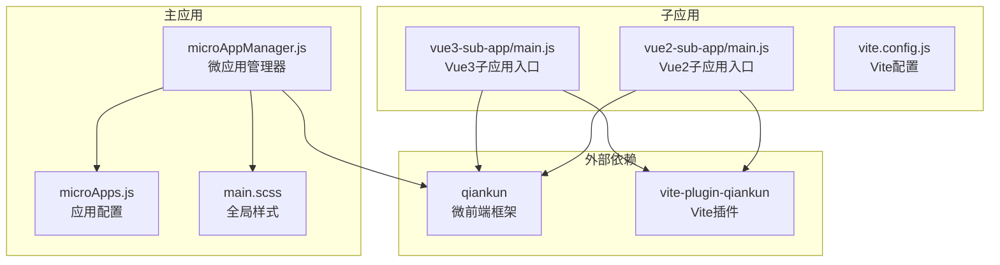
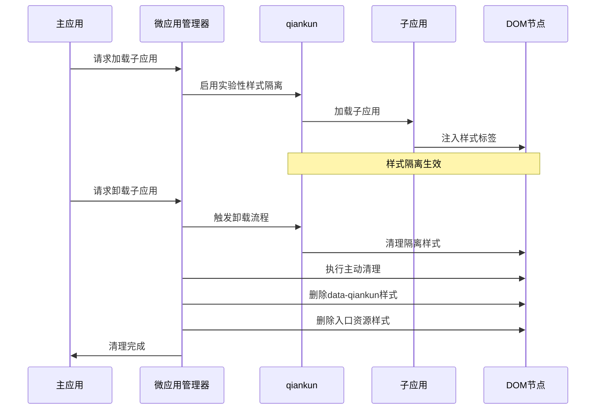
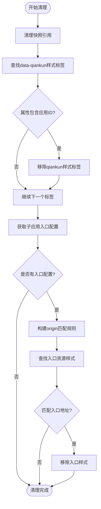
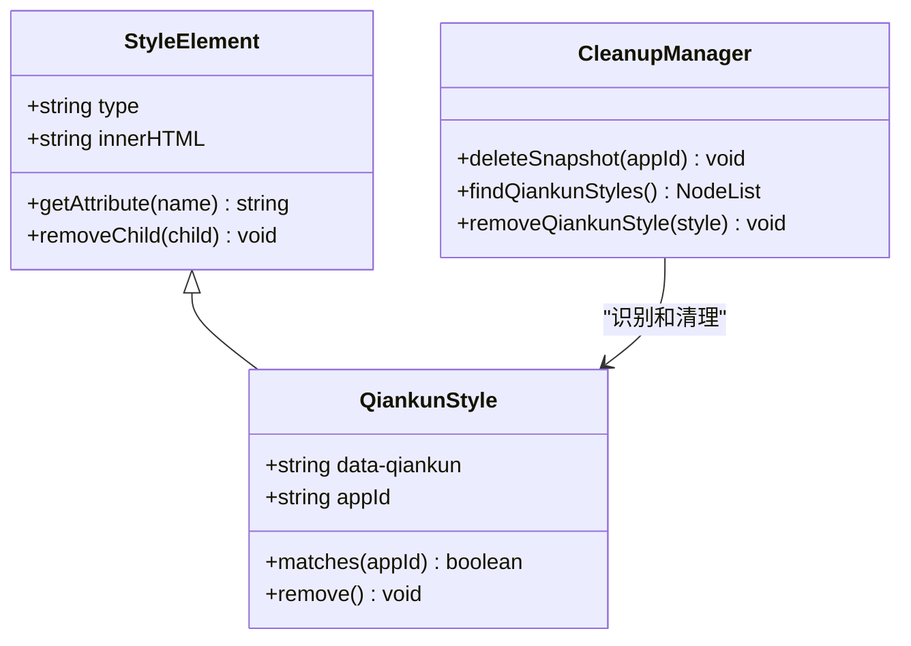
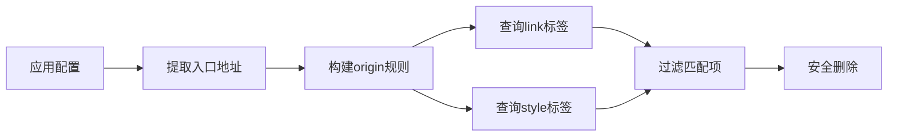
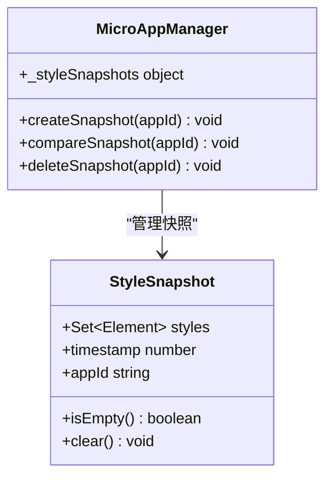
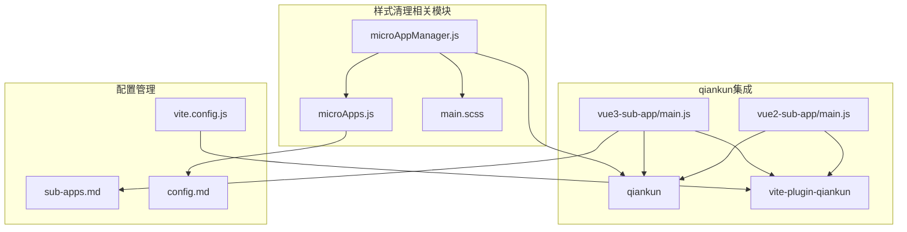
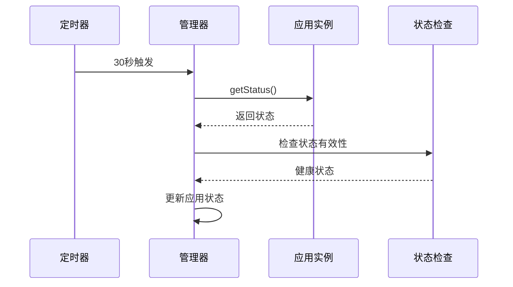

# 样式清理机制

<cite>
**本文档引用的文件**
- [microAppManager.js](file://packages/main-app/src/core/microAppManager.js)
- [microApps.js](file://packages/main-app/src/config/microApps.js)
- [main.scss](file://packages/main-app/src/assets/styles/main.scss)
- [vue3-sub-app/main.js](file://packages/vue3-sub-app/src/main.js)
- [vue2-sub-app/main.js](file://packages/vue2-sub-app/src/main.js)
- [vite.config.js](file://packages/vue3-sub-app/vite.config.js)
- [sub-apps.md](file://user-docs/guide/sub-apps.md)
- [config.md](file://user-docs/api/config.md)
</cite>

## 目录
1. [简介](#简介)
2. [项目结构](#项目结构)
3. [核心组件](#核心组件)
4. [架构概览](#架构概览)
5. [详细组件分析](#详细组件分析)
6. [依赖关系分析](#依赖关系分析)
7. [性能考量](#性能考量)
8. [故障排除指南](#故障排除指南)
9. [结论](#结论)
10. [附录](#附录)

## 简介
本技术文档深入解析本项目的样式清理机制，重点涵盖 qiankun 样式隔离、DOM 清理策略和 CSS 污染防护。文档详细说明 `_cleanupStyles()` 方法的样式标签识别、目标清理和安全删除逻辑，阐述 data-qiankun 属性样式的自动检测和清理机制，解释子应用入口资源的识别和批量清理功能。同时包含样式快照机制、内存泄漏防护和性能优化策略，并提供样式冲突的预防措施、调试工具和故障排除方法，以及样式清理的最佳实践和兼容性考虑。

## 项目结构
本项目采用多包架构，样式清理机制主要集中在主应用的微前端管理器中，配合子应用的 qiankun 集成实现完整的样式隔离和清理流程。



**图表来源**
- [microAppManager.js](file://packages/main-app/src/core/microAppManager.js#L1-L515)
- [microApps.js](file://packages/main-app/src/config/microApps.js#L1-L110)
- [main.scss](file://packages/main-app/src/assets/styles/main.scss#L1-L142)
- [vue3-sub-app/main.js](file://packages/vue3-sub-app/src/main.js#L1-L114)
- [vue2-sub-app/main.js](file://packages/vue2-sub-app/src/main.js#L1-L70)
- [vite.config.js](file://packages/vue3-sub-app/vite.config.js#L1-L35)

**章节来源**
- [microAppManager.js](file://packages/main-app/src/core/microAppManager.js#L1-L515)
- [microApps.js](file://packages/main-app/src/config/microApps.js#L1-L110)

## 核心组件
样式清理机制的核心组件包括：

### 微应用管理器 (MicroAppManager)
负责整个微前端应用的生命周期管理，包括样式清理的协调工作。

### 样式清理器 (_cleanupStyles)
专门处理样式标签的识别、过滤和删除，确保不会误删主应用样式。

### 应用配置管理
维护子应用的入口地址和类型信息，为样式清理提供必要的元数据。

**章节来源**
- [microAppManager.js](file://packages/main-app/src/core/microAppManager.js#L28-L31)
- [microAppManager.js](file://packages/main-app/src/core/microAppManager.js#L292-L313)
- [microApps.js](file://packages/main-app/src/config/microApps.js#L76-L78)

## 架构概览
样式清理机制的整体架构基于 qiankun 的实验性样式隔离功能，结合主应用的主动清理策略，形成双重防护体系。



**图表来源**
- [microAppManager.js](file://packages/main-app/src/core/microAppManager.js#L96-L120)
- [microAppManager.js](file://packages/main-app/src/core/microAppManager.js#L238-L284)
- [microAppManager.js](file://packages/main-app/src/core/microAppManager.js#L292-L313)

## 详细组件分析

### _cleanupStyles() 方法深度解析

#### 样式标签识别机制
清理方法采用双层识别策略：

1. **data-qiankun 属性识别**
   - 查找所有带有 `data-qiankun` 属性的样式标签
   - 通过属性值中的应用ID进行精确匹配
   - 仅删除属于当前应用的样式标签

2. **入口资源识别**
   - 获取子应用配置中的入口地址
   - 构造 origin 字段用于域名匹配
   - 查找包含入口地址的 link 和 style 标签



**图表来源**
- [microAppManager.js](file://packages/main-app/src/core/microAppManager.js#L292-L313)

#### 安全删除逻辑
清理过程采用安全的删除策略：

1. **渐进式清理**
   - 先清理快照引用，避免内存泄漏
   - 逐步删除特定样式的标签
   - 最后清理容器内容

2. **DOM 操作保护**
   - 使用 `parentNode?.removeChild()` 确保父节点存在
   - 避免直接操作可能不存在的元素
   - 提供异常处理和回退机制

3. **资源回收**
   - 清理样式快照集合
   - 释放相关内存引用
   - 防止循环引用导致的内存泄漏

**章节来源**
- [microAppManager.js](file://packages/main-app/src/core/microAppManager.js#L292-L313)
- [microAppManager.js](file://packages/main-app/src/core/microAppManager.js#L264-L282)

### data-qiankun 属性自动检测机制

#### 属性识别策略
qiankun 在启用实验性样式隔离时，会为每个注入的样式添加 `data-qiankun` 属性，格式为 `data-qiankun="应用ID"`。



**图表来源**
- [microAppManager.js](file://packages/main-app/src/core/microAppManager.js#L296-L303)

#### 自动清理流程
清理过程自动处理所有带有 data-qiankun 属性的样式标签：

1. **批量查询**
   - 使用 `document.querySelectorAll('style[data-qiankun]')` 获取所有相关样式
   - 遍历每个样式标签进行处理

2. **精确匹配**
   - 读取 `data-qiankun` 属性值
   - 检查属性值是否包含目标应用ID
   - 仅对匹配的样式执行删除操作

3. **安全删除**
   - 确保父节点存在后再删除
   - 避免删除过程中影响其他元素

**章节来源**
- [microAppManager.js](file://packages/main-app/src/core/microAppManager.js#L296-L303)

### 子应用入口资源识别和批量清理

#### 入口资源识别策略
除了 qiankun 注入的样式，还需要清理子应用通过入口地址加载的资源：



**图表来源**
- [microAppManager.js](file://packages/main-app/src/core/microAppManager.js#L305-L312)

#### 批量清理实现
清理方法支持同时处理多种类型的样式资源：

1. **link 样式表清理**
   - 查找 `href` 属性包含入口地址的 link 标签
   - 删除对应的样式表链接

2. **内联样式清理**
   - 查找 `data-src` 属性包含入口地址的 style 标签
   - 删除对应的内联样式内容

3. **域名匹配策略**
   - 使用 `origin` 字段确保精确匹配
   - 避免误删其他域名的样式资源

**章节来源**
- [microAppManager.js](file://packages/main-app/src/core/microAppManager.js#L305-L312)

### 样式快照机制

#### 快照设计原理
虽然当前实现不再使用快照对比，但系统仍保留了样式快照的基础设施：



**图表来源**
- [microAppManager.js](file://packages/main-app/src/core/microAppManager.js#L28-L30)
- [microAppManager.js](file://packages/main-app/src/core/microAppManager.js#L294)

#### 快照清理策略
当前版本采用更直接的清理方式：

1. **即时清理**
   - 在卸载应用时立即清理快照引用
   - 避免长时间持有 DOM 引用

2. **内存安全**
   - 使用 `delete` 操作符释放内存
   - 防止快照对象造成内存泄漏

3. **兼容性考虑**
   - 保持接口一致性
   - 为未来可能的快照对比功能预留空间

**章节来源**
- [microAppManager.js](file://packages/main-app/src/core/microAppManager.js#L294)

## 依赖关系分析

### 核心依赖关系图



**图表来源**
- [microAppManager.js](file://packages/main-app/src/core/microAppManager.js#L1-L5)
- [vue3-sub-app/main.js](file://packages/vue3-sub-app/src/main.js#L1-L3)
- [vite.config.js](file://packages/vue3-sub-app/vite.config.js#L1-L3)

### 外部依赖分析

#### qiankun 样式隔离
- **experimentalStyleIsolation**: 启用实验性样式隔离功能
- **sandbox 配置**: 提供沙箱环境下的样式隔离
- **excludeAssetFilter**: 排除特定全局样式文件

#### vite-plugin-qiankun
- **renderWithQiankun**: 包装子应用生命周期
- **qiankunWindow**: 检测 qiankun 环境
- **开发模式支持**: 区分开发和生产环境

**章节来源**
- [microAppManager.js](file://packages/main-app/src/core/microAppManager.js#L109-L120)
- [vue3-sub-app/main.js](file://packages/vue3-sub-app/src/main.js#L71-L105)

## 性能考量

### 内存泄漏防护策略

#### DOM 引用管理
1. **及时清理**
   - 卸载应用时立即清理所有样式引用
   - 使用 `innerHTML = ''` 清空容器内容
   - 删除快照引用避免循环引用

2. **垃圾回收优化**
   - 避免持有不必要的 DOM 引用
   - 使用弱引用模式减少内存占用
   - 及时释放事件监听器

#### 查询性能优化
1. **选择器优化**
   - 使用精确的选择器减少查询范围
   - 避免复杂的 CSS 选择器
   - 优先使用 ID 和类名选择器

2. **批量操作**
   - 使用 `querySelectorAll` 获取多个元素
   - 批量处理样式标签避免多次 DOM 操作
   - 减少浏览器重排和重绘

### 性能监控和诊断

#### 心跳检测机制
系统实现了应用健康状态监控：



**图表来源**
- [microAppManager.js](file://packages/main-app/src/core/microAppManager.js#L340-L356)

#### 性能指标
- **应用加载时间**: 记录应用挂载完成的时间
- **卸载耗时**: 监控样式清理的执行时间
- **内存使用**: 跟踪清理后的内存释放情况

**章节来源**
- [microAppManager.js](file://packages/main-app/src/core/microAppManager.js#L340-L387)

## 故障排除指南

### 常见问题诊断

#### 样式未完全清理
1. **检查 data-qiankun 属性**
   - 确认样式标签是否正确添加了属性
   - 验证属性值中的应用ID是否匹配

2. **验证入口地址匹配**
   - 检查子应用配置中的入口地址
   - 确认 origin 构建是否正确

3. **调试清理流程**
   ```javascript
   // 在清理前后检查样式数量
   console.log('清理前样式数量:', document.querySelectorAll('style').length);
   this._cleanupStyles(appId);
   console.log('清理后样式数量:', document.querySelectorAll('style').length);
   ```

#### 样式冲突问题
1. **检查全局样式**
   - 确认主应用的全局样式是否正确隔离
   - 验证 qiankun 的样式隔离功能

2. **审查子应用样式**
   - 检查子应用是否使用了全局样式
   - 确认样式作用域的正确性

3. **测试样式隔离**
   ```javascript
   // 测试样式隔离效果
   const isolatedStyles = document.querySelectorAll('style[data-qiankun]');
   console.log('隔离样式数量:', isolatedStyles.length);
   ```

### 调试工具和技巧

#### 开发环境调试
1. **浏览器开发者工具**
   - 使用 Elements 面板检查样式标签
   - 使用 Console 面板执行清理测试
   - 使用 Network 面板监控资源加载

2. **日志输出**
   - 添加详细的清理过程日志
   - 记录清理前后的 DOM 状态
   - 监控异常情况和错误信息

3. **性能分析**
   - 使用 Performance 面板分析清理耗时
   - 监控内存使用情况
   - 检查垃圾回收效果

#### 生产环境监控
1. **错误日志收集**
   - 记录样式清理过程中的异常
   - 监控清理失败的情况
   - 提供用户反馈渠道

2. **健康检查**
   - 实施应用状态监控
   - 定期检查样式隔离效果
   - 自动化故障检测

**章节来源**
- [microAppManager.js](file://packages/main-app/src/core/microAppManager.js#L473-L508)

## 结论
本项目的样式清理机制通过 qiankun 的实验性样式隔离和主应用的主动清理策略，形成了完善的 CSS 污染防护体系。核心的 `_cleanupStyles()` 方法采用双层识别机制，既能准确识别 qiankun 注入的样式，又能清理子应用通过入口地址加载的资源。系统还提供了内存泄漏防护、性能优化和故障排除等综合解决方案，确保微前端应用的样式管理既安全又高效。

## 附录

### 最佳实践建议

#### 样式管理最佳实践
1. **样式隔离配置**
   - 始终启用 qiankun 的实验性样式隔离
   - 正确配置沙箱环境参数
   - 使用精确的全局样式排除规则

2. **清理策略优化**
   - 在应用卸载时执行清理操作
   - 使用安全的 DOM 操作方法
   - 避免直接操作可能不存在的元素

3. **性能优化建议**
   - 减少样式标签的数量
   - 使用 CSS Modules 替代全局样式
   - 实施懒加载和按需加载策略

#### 兼容性考虑
1. **浏览器兼容性**
   - 确保选择器的兼容性
   - 测试不同浏览器的样式隔离效果
   - 提供降级方案

2. **框架兼容性**
   - 兼容 Vue2 和 Vue3 的生命周期
   - 支持不同版本的 qiankun
   - 处理 iframe 和 link 类型的应用

3. **部署兼容性**
   - 考虑 CDN 和本地部署的差异
   - 处理 HTTPS 和 HTTP 的混合场景
   - 配置正确的 CORS 策略

### 相关配置参考

#### qiankun 配置要点
- **experimentalStyleIsolation**: 启用样式隔离
- **excludeAssetFilter**: 排除全局样式
- **singular**: 控制单实例模式

#### 子应用配置要点
- **entry**: 正确设置入口地址
- **container**: 指定正确的容器选择器
- **props**: 传递必要的运行时参数

**章节来源**
- [microAppManager.js](file://packages/main-app/src/core/microAppManager.js#L109-L120)
- [microApps.js](file://packages/main-app/src/config/microApps.js#L76-L78)