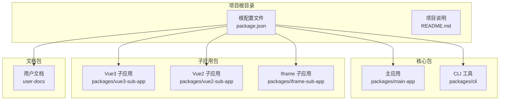
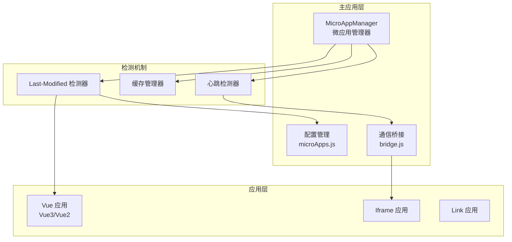
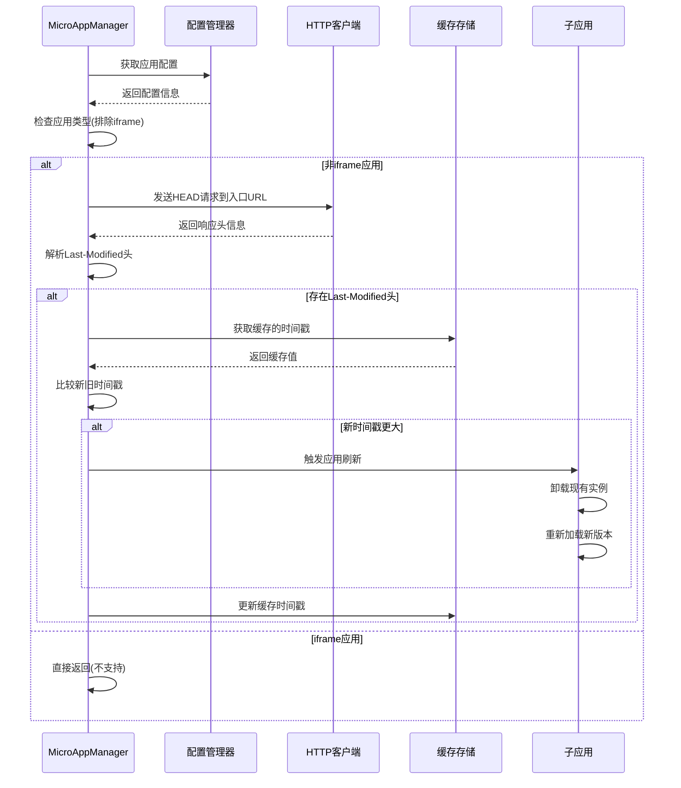
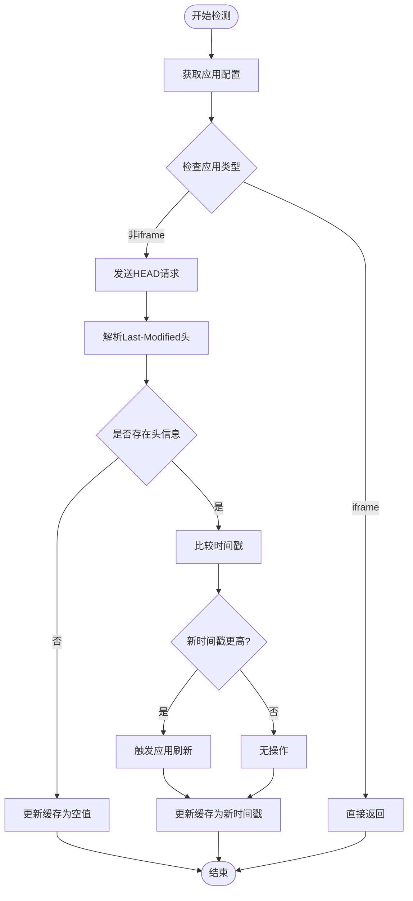
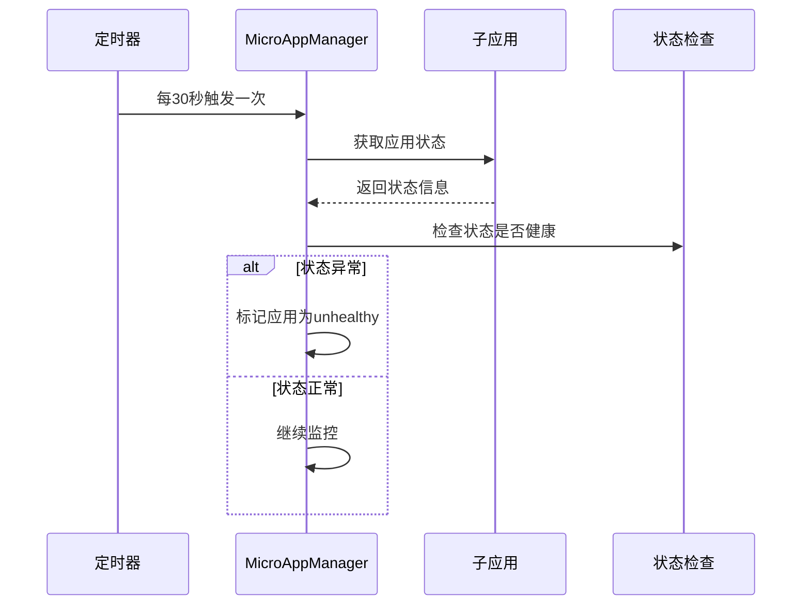
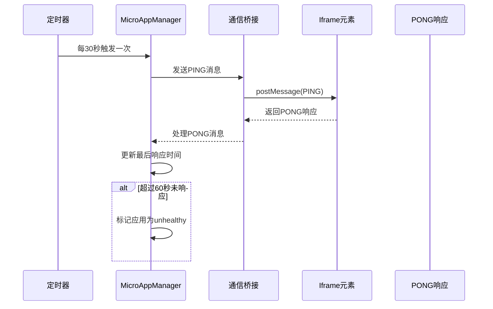
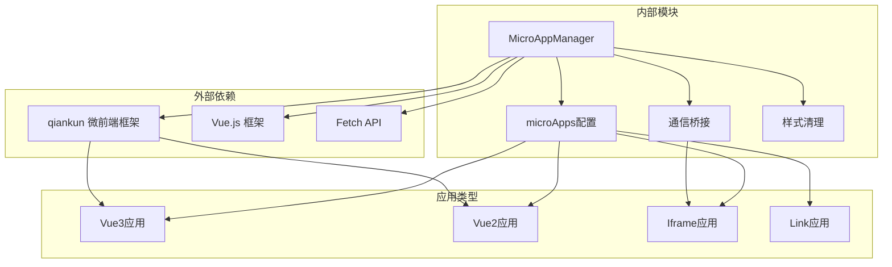
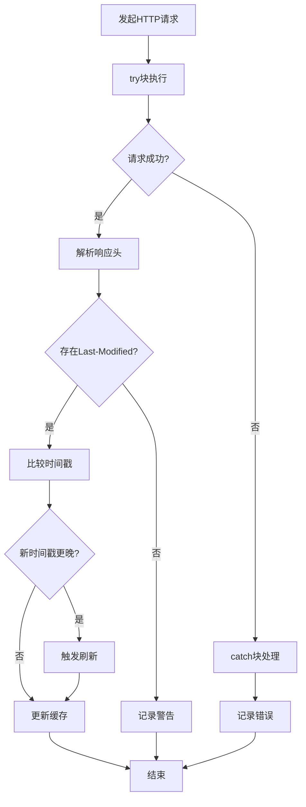

# 热更新检测机制

<cite>
**本文档引用的文件**
- [microAppManager.js](file://packages/main-app/src/core/microAppManager.js)
- [microApps.js](file://packages/main-app/src/config/microApps.js)
- [bridge.js](file://packages/main-app/src/core/bridge.js)
- [iframeLoader.js](file://packages/main-app/src/core/iframeLoader.js)
- [README.md](file://README.md)
- [package.json](file://package.json)
</cite>

## 目录
1. [简介](#简介)
2. [项目结构](#项目结构)
3. [核心组件](#核心组件)
4. [架构概览](#架构概览)
5. [详细组件分析](#详细组件分析)
6. [依赖关系分析](#依赖关系分析)
7. [性能考虑](#性能考虑)
8. [故障排除指南](#故障排除指南)
9. [结论](#结论)
10. [附录](#附录)

## 简介

本文档深入解析 Artisan Base Frontend 项目中的热更新检测机制，重点分析 Last-Modified 头部检查原理、缓存管理策略和自动刷新触发逻辑。该机制通过 HTTP HEAD 请求检查子应用入口的最后修改时间，实现对 Vue 应用的自动化热更新检测。

项目采用微前端架构，支持 Vue3、Vue2、iframe 和 link 四种应用类型。热更新检测机制主要针对 Vue 应用类型，通过 qiankun 微前端框架实现子应用的动态加载和卸载。

## 项目结构

项目采用 Monorepo 架构，使用 Lerna + npm workspace 管理多个包：



**图表来源**
- [package.json](file://package.json#L1-L50)
- [README.md](file://README.md#L62-L76)

**章节来源**
- [package.json](file://package.json#L1-L50)
- [README.md](file://README.md#L62-L76)

## 核心组件

热更新检测机制的核心组件包括：

### MicroAppManager 类
负责微应用的生命周期管理、热更新检测和状态监控。关键特性：
- Last-Modified 缓存管理
- 心跳检测机制
- 自动刷新触发逻辑
- 错误日志记录

### 应用配置管理
维护所有微应用的配置信息，包括应用类型、入口地址、状态等属性。

### 通信桥接系统
基于 postMessage 实现主应用与子应用之间的双向通信。

**章节来源**
- [microAppManager.js](file://packages/main-app/src/core/microAppManager.js#L11-L31)
- [microApps.js](file://packages/main-app/src/config/microApps.js#L5-L69)

## 架构概览



**图表来源**
- [microAppManager.js](file://packages/main-app/src/core/microAppManager.js#L392-L415)
- [microApps.js](file://packages/main-app/src/config/microApps.js#L76-L107)

## 详细组件分析

### Last-Modified 检测器工作流程

#### checkLastModified() 方法分析



**图表来源**
- [microAppManager.js](file://packages/main-app/src/core/microAppManager.js#L392-L415)

#### 时间戳比较算法

检测机制采用严格的时间比较策略：

1. **HTTP HEAD 请求**: 使用 `fetch()` API 发送 HEAD 请求，仅获取响应头信息
2. **Last-Modified 解析**: 从响应头中提取 `last-modified` 字段并转换为时间戳
3. **缓存对比**: 将新时间戳与缓存中的时间戳进行比较
4. **刷新触发**: 当新时间戳大于缓存时间戳时触发应用刷新

#### 缓存管理策略



**图表来源**
- [microAppManager.js](file://packages/main-app/src/core/microAppManager.js#L396-L414)

**章节来源**
- [microAppManager.js](file://packages/main-app/src/core/microAppManager.js#L392-L415)

### 心跳检测机制

#### Vue 应用心跳检测



**图表来源**
- [microAppManager.js](file://packages/main-app/src/core/microAppManager.js#L340-L356)

#### Iframe 应用心跳检测



**图表来源**
- [microAppManager.js](file://packages/main-app/src/core/microAppManager.js#L364-L374)
- [iframeLoader.js](file://packages/main-app/src/core/iframeLoader.js#L215-L230)

**章节来源**
- [microAppManager.js](file://packages/main-app/src/core/microAppManager.js#L340-L374)
- [iframeLoader.js](file://packages/main-app/src/core/iframeLoader.js#L215-L230)

### 应用类型支持情况

#### Vue 应用支持
- ✅ 支持 Last-Modified 热更新检测
- ✅ 支持自动刷新
- ✅ 支持预加载优化
- ✅ 支持心跳检测

#### Iframe 应用限制
- ❌ 不支持 Last-Modified 热更新检测
- ✅ 支持心跳检测机制
- ✅ 支持手动刷新
- ✅ 支持高度自适应

#### Link 应用
- ❌ 不支持热更新检测
- ❌ 不支持自动刷新
- ✅ 支持外部链接跳转

**章节来源**
- [microAppManager.js](file://packages/main-app/src/core/microAppManager.js#L392-L394)
- [microApps.js](file://packages/main-app/src/config/microApps.js#L5-L69)

## 依赖关系分析



**图表来源**
- [microAppManager.js](file://packages/main-app/src/core/microAppManager.js#L1-L5)
- [microApps.js](file://packages/main-app/src/config/microApps.js#L1-L4)

**章节来源**
- [microAppManager.js](file://packages/main-app/src/core/microAppManager.js#L1-L5)
- [microApps.js](file://packages/main-app/src/config/microApps.js#L1-L4)

## 性能考虑

### 检测频率控制

热更新检测采用定时轮询机制，存在以下性能特征：

- **检测间隔**: 30秒执行一次
- **请求类型**: 使用 HTTP HEAD 请求，仅获取响应头信息
- **并发控制**: 每个应用独立的检测定时器
- **资源消耗**: 相对较低，主要消耗在网络请求和时间比较上

### 异常处理机制



**图表来源**
- [microAppManager.js](file://packages/main-app/src/core/microAppManager.js#L396-L414)

### 性能优化建议

1. **合理设置检测频率**: 根据应用更新频率调整检测间隔
2. **缓存策略优化**: 利用浏览器缓存减少不必要的请求
3. **错误重试机制**: 实现指数退避的重试策略
4. **并发控制**: 避免同时检测过多应用导致的性能问题

**章节来源**
- [microAppManager.js](file://packages/main-app/src/core/microAppManager.js#L396-L414)

## 故障排除指南

### 常见问题及解决方案

#### Last-Modified 头部缺失
**现象**: 检测日志显示警告信息
**原因**: 服务器未正确设置 Last-Modified 响应头
**解决方案**: 
- 确保静态资源服务器正确配置 ETag/Last-Modified
- 检查构建工具是否生成正确的响应头
- 验证 CDN 配置是否保留响应头信息

#### 网络请求失败
**现象**: 控制台出现网络错误警告
**原因**: 网络连接问题或服务器不可达
**解决方案**:
- 检查应用入口 URL 配置
- 验证网络连接状态
- 确认服务器防火墙设置

#### 应用刷新异常
**现象**: 应用刷新后状态异常
**原因**: 卸载和重新加载过程中的状态丢失
**解决方案**:
- 确保应用具有完整的卸载生命周期
- 检查应用状态管理机制
- 验证路由状态的持久化

### 调试方法

#### 开启详细日志
```javascript
// 在开发环境中启用详细日志
console.log('[MicroAppManager] Debug mode enabled')
```

#### 检查配置状态
```javascript
// 验证应用配置
const config = getMicroApp(appId)
console.log('Application config:', config)
```

#### 监控检测结果
```javascript
// 查看检测缓存状态
console.log('LastModified cache:', microAppManager.lastModifiedCache)
```

**章节来源**
- [microAppManager.js](file://packages/main-app/src/core/microAppManager.js#L412-L413)

## 结论

Artisan Base Frontend 项目的热更新检测机制通过 Last-Modified 头部检查实现了对 Vue 应用的自动化热更新支持。该机制具有以下特点：

1. **精确性**: 基于 HTTP 响应头的精确时间比较
2. **效率性**: 使用 HEAD 请求减少数据传输量
3. **可靠性**: 完善的异常处理和错误日志记录
4. **扩展性**: 支持多种应用类型的差异化处理

对于 Iframe 应用，由于安全限制无法直接访问其响应头信息，因此采用心跳检测机制替代。这种设计既保证了安全性，又提供了有效的应用状态监控。

## 附录

### 配置选项说明

| 配置项 | 类型 | 默认值 | 描述 |
|--------|------|--------|------|
| `preload` | boolean | false | 是否预加载应用 |
| `status` | string | 'online' | 应用状态 (online/offline) |
| `type` | string | 'vue3' | 应用类型 (vue3/vue2/iframe/link) |
| `lastModified` | number | Date.now() | 最后修改时间戳 |
| `version` | string | '1.0.0' | 应用版本号 |

### 最佳实践建议

1. **生产环境部署**
   - 确保服务器正确配置 Last-Modified 响应头
   - 设置合理的检测频率避免过度请求
   - 实施错误重试和降级策略

2. **开发环境优化**
   - 使用本地开发服务器确保响应头正确设置
   - 启用详细的日志输出便于调试
   - 配置适当的缓存策略

3. **监控和告警**
   - 建立应用健康状态监控
   - 设置异常告警机制
   - 定期检查检测机制的运行状态