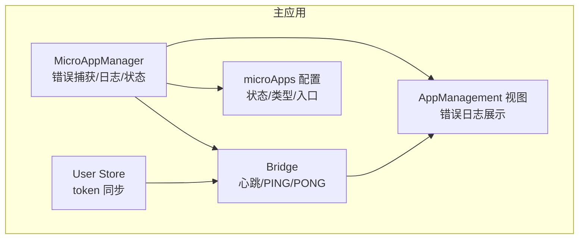
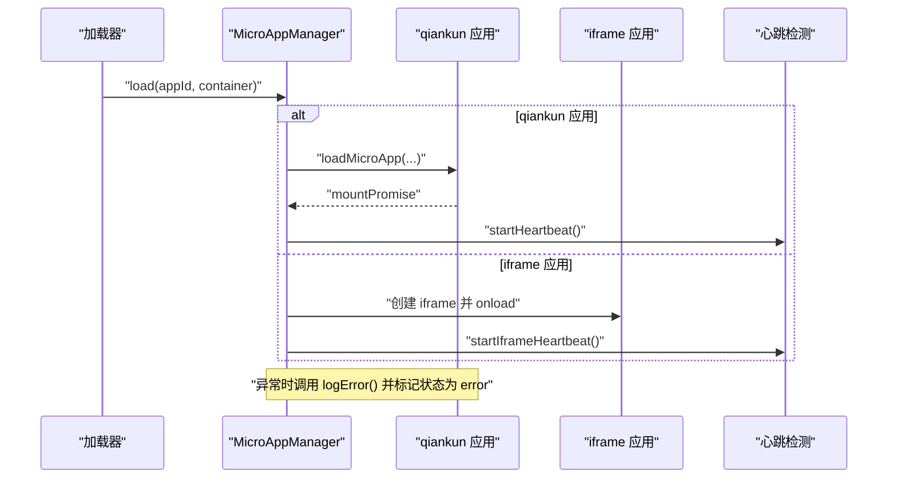
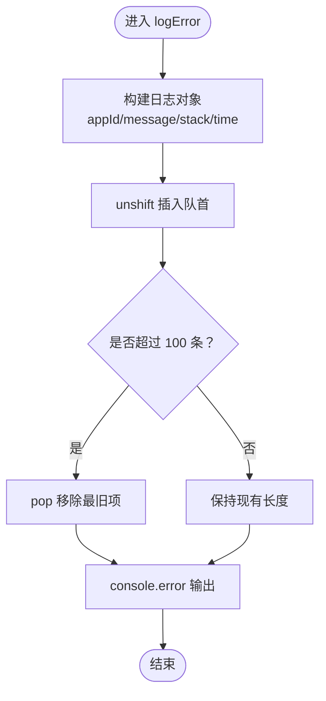
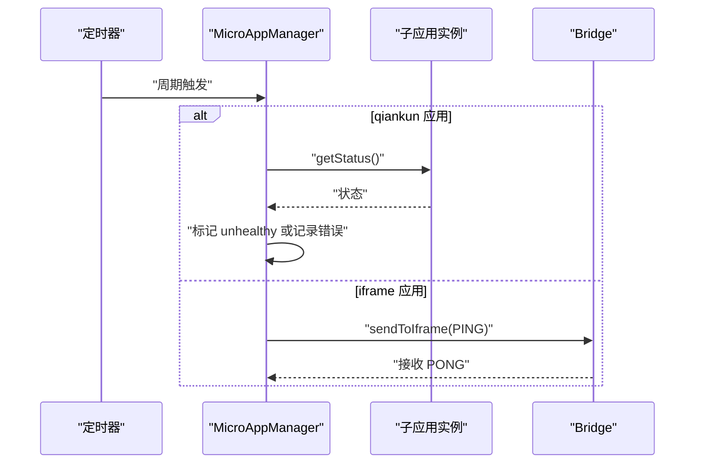
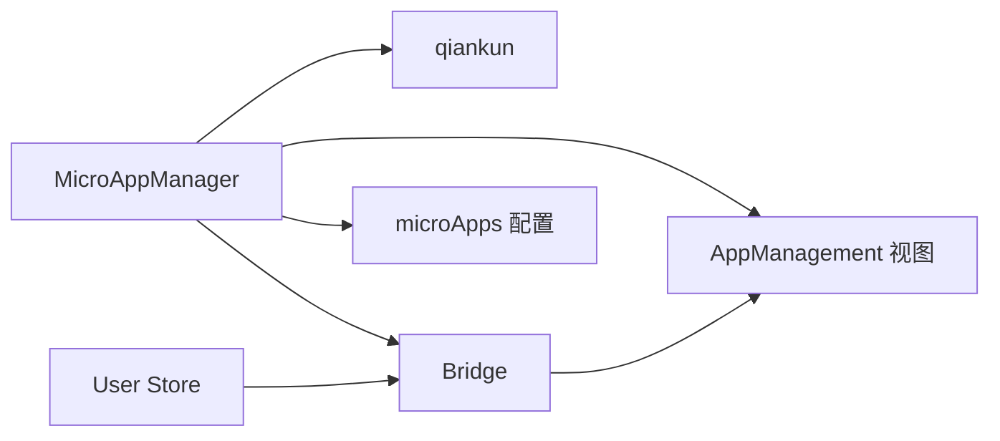

# 错误处理与日志管理

<cite>
**本文引用的文件**
- [packages/main-app/src/core/microAppManager.js](file://packages/main-app/src/core/microAppManager.js)
- [user-docs/api/micro-app-manager.md](file://user-docs/api/micro-app-manager.md)
- [packages/main-app/src/core/bridge.js](file://packages/main-app/src/core/bridge.js)
- [packages/main-app/src/config/microApps.js](file://packages/main-app/src/config/microApps.js)
- [packages/main-app/src/views/AppManagement.vue](file://packages/main-app/src/views/AppManagement.vue)
- [packages/main-app/src/stores/user.js](file://packages/main-app/src/stores/user.js)
- [README.md](file://README.md)
</cite>

## 目录
1. [简介](#简介)
2. [项目结构](#项目结构)
3. [核心组件](#核心组件)
4. [架构总览](#架构总览)
5. [组件详细分析](#组件详细分析)
6. [依赖关系分析](#依赖关系分析)
7. [性能考量](#性能考量)
8. [故障排查指南](#故障排查指南)
9. [结论](#结论)
10. [附录](#附录)

## 简介
本技术文档聚焦于微前端平台中的“错误处理与日志管理”能力，围绕 MicroAppManager 的错误捕获机制、日志记录策略、异常恢复流程展开，深入解析 logError() 方法的错误信息采集（包括消息、堆栈、时间戳）、错误日志的存储结构与容量控制、清理策略，并结合 getLoadedCount() 的应用实例统计与状态查询能力，给出错误分类、优先级处理与告警通知建议。同时提供最佳实践、调试技巧与性能影响分析，并覆盖错误日志查询 API 与批量清理功能的使用指南。

## 项目结构
本仓库采用 Monorepo 架构，错误处理与日志管理主要集中在主应用的 core 层与用户态文档层：
- 核心逻辑位于 MicroAppManager（错误捕获、日志记录、状态维护）
- 日志查询与展示位于管理界面视图组件
- 跨应用通信桥用于心跳与消息同步，间接支撑健康监测
- 应用配置集中管理，驱动加载与状态变更

图表来源
- [packages/main-app/src/core/microAppManager.js](file://packages/main-app/src/core/microAppManager.js#L1-L515)
- [packages/main-app/src/core/bridge.js](file://packages/main-app/src/core/bridge.js#L1-L241)
- [packages/main-app/src/config/microApps.js](file://packages/main-app/src/config/microApps.js#L1-L110)
- [packages/main-app/src/views/AppManagement.vue](file://packages/main-app/src/views/AppManagement.vue#L115-L140)
- [packages/main-app/src/stores/user.js](file://packages/main-app/src/stores/user.js#L1-L73)

章节来源
- [README.md](file://README.md#L62-L76)

## 核心组件
- MicroAppManager：负责微应用生命周期管理、错误捕获与日志记录、心跳检测、热更新检测、预加载与上下线控制；提供 getLoadedCount() 统计已加载实例数。
- Bridge：负责跨应用通信，支持心跳 PING/PONG、高度上报、广播消息等，辅助健康监测。
- microApps 配置：集中管理各子应用的状态、类型、入口、预加载等属性，驱动加载与卸载行为。
- AppManagement 视图：展示错误日志列表、格式化时间、应用详情等，便于运维与调试。
- User Store：维护用户 token，并通过 Bridge 同步至子应用，间接影响加载与通信。

章节来源
- [packages/main-app/src/core/microAppManager.js](file://packages/main-app/src/core/microAppManager.js#L11-L31)
- [packages/main-app/src/core/bridge.js](file://packages/main-app/src/core/bridge.js#L9-L27)
- [packages/main-app/src/config/microApps.js](file://packages/main-app/src/config/microApps.js#L5-L69)
- [packages/main-app/src/views/AppManagement.vue](file://packages/main-app/src/views/AppManagement.vue#L115-L140)
- [packages/main-app/src/stores/user.js](file://packages/main-app/src/stores/user.js#L16-L23)

## 架构总览
错误处理与日志管理贯穿微应用加载、运行、卸载全生命周期：
- 加载阶段：捕获配置缺失、离线状态、重复加载、容器不存在等错误，统一调用 logError() 记录并标记应用状态为 error。
- 运行阶段：启动心跳检测（qiankun 应用每 30 秒检查状态，iframe 应用每 30 秒发送 PING），异常时记录错误日志。
- 卸载阶段：清理容器、样式与定时器，若卸载过程出现异常，进行强制清理并记录错误。
- 日志管理：以数组形式在内存中维护最近 100 条错误日志，支持按应用过滤与批量清空。

图表来源
- [packages/main-app/src/core/microAppManager.js](file://packages/main-app/src/core/microAppManager.js#L49-L165)
- [packages/main-app/src/core/microAppManager.js](file://packages/main-app/src/core/microAppManager.js#L173-L232)
- [packages/main-app/src/core/microAppManager.js](file://packages/main-app/src/core/microAppManager.js#L340-L375)

## 组件详细分析

### MicroAppManager 错误处理与日志管理
- 错误捕获点
  - 配置校验失败、离线状态、重复加载、容器不存在等前置条件校验。
  - qiankun 应用挂载 Promise 抛错、卸载异常、iframe 加载失败等运行期异常。
- logError() 方法
  - 采集字段：应用 ID、错误消息、堆栈信息、时间戳。
  - 存储策略：使用 unshift 将新日志插入队首，随后检查长度上限（100），超过则 pop 移除最旧项。
  - 输出策略：控制台输出错误摘要，便于开发调试。
- 错误日志 API
  - getErrorLogs(appId?)：按应用过滤或返回全部日志。
  - clearErrorLogs()：清空所有错误日志。
- 状态与统计
  - getLoadedCount()：统计当前已加载应用数量，用于监控与告警阈值判断。
  - loadedApps 结构中维护每个应用的 status、errors 数组，便于快速定位异常应用。

图表来源
- [packages/main-app/src/core/microAppManager.js](file://packages/main-app/src/core/microAppManager.js#L473-L489)

章节来源
- [packages/main-app/src/core/microAppManager.js](file://packages/main-app/src/core/microAppManager.js#L49-L165)
- [packages/main-app/src/core/microAppManager.js](file://packages/main-app/src/core/microAppManager.js#L173-L232)
- [packages/main-app/src/core/microAppManager.js](file://packages/main-app/src/core/microAppManager.js#L464-L466)
- [packages/main-app/src/core/microAppManager.js](file://packages/main-app/src/core/microAppManager.js#L473-L508)

### Bridge 心跳与健康监测
- qiankun 应用：每 30 秒读取应用状态，若处于未挂载或卸载中，标记应用为不健康并记录警告日志。
- iframe 应用：每 30 秒向子应用发送 PING，子应用应答 PONG，用于检测通信链路健康。
- 与错误日志的关系：心跳异常会触发状态变更与日志记录，有助于快速发现异常应用。

图表来源
- [packages/main-app/src/core/microAppManager.js](file://packages/main-app/src/core/microAppManager.js#L340-L375)
- [packages/main-app/src/core/bridge.js](file://packages/main-app/src/core/bridge.js#L60-L72)
- [packages/main-app/src/core/bridge.js](file://packages/main-app/src/core/bridge.js#L150-L155)

章节来源
- [packages/main-app/src/core/microAppManager.js](file://packages/main-app/src/core/microAppManager.js#L340-L375)
- [packages/main-app/src/core/bridge.js](file://packages/main-app/src/core/bridge.js#L60-L72)
- [packages/main-app/src/core/bridge.js](file://packages/main-app/src/core/bridge.js#L150-L155)

### 应用配置与上下线控制
- microApps 配置集中管理各应用的 status、type、entry、preload 等属性。
- setAppStatus(appId, status)：支持将应用设为 offline，若应用已加载则自动卸载，确保系统一致性。
- 与错误日志的关系：离线状态下的加载会被立即捕获并记录错误日志。

章节来源
- [packages/main-app/src/config/microApps.js](file://packages/main-app/src/config/microApps.js#L76-L107)
- [packages/main-app/src/core/microAppManager.js](file://packages/main-app/src/core/microAppManager.js#L447-L458)

### 错误日志查询与展示
- AppManagement 视图组件展示错误日志列表，包含应用 ID、错误信息、时间等列，支持空状态提示。
- 时间格式化由组件内部方法 formatTime() 提供，便于阅读。

章节来源
- [packages/main-app/src/views/AppManagement.vue](file://packages/main-app/src/views/AppManagement.vue#L115-L140)

### getLoadedCount() 应用实例统计与状态查询
- getLoadedCount() 返回当前已加载应用数量，可用于：
  - 运维监控：观察并发实例数变化趋势。
  - 告警阈值：当实例数异常下降或上升过快时触发告警。
  - 性能评估：结合错误日志分析异常时段的实例规模。

章节来源
- [packages/main-app/src/core/microAppManager.js](file://packages/main-app/src/core/microAppManager.js#L464-L466)

## 依赖关系分析
- MicroAppManager 依赖 qiankun 的 loadMicroApp/prefetchApps、Pinia 状态管理、路由与 Bridge。
- Bridge 依赖 window.postMessage 与自定义消息协议，支持跨应用通信与心跳。
- microApps 配置为静态数据源，驱动加载与上下线控制。
- AppManagement 视图依赖 MicroAppManager 的错误日志 API 与格式化工具。

图表来源
- [packages/main-app/src/core/microAppManager.js](file://packages/main-app/src/core/microAppManager.js#L1-L11)
- [packages/main-app/src/core/bridge.js](file://packages/main-app/src/core/bridge.js#L1-L27)
- [packages/main-app/src/config/microApps.js](file://packages/main-app/src/config/microApps.js#L1-L110)
- [packages/main-app/src/views/AppManagement.vue](file://packages/main-app/src/views/AppManagement.vue#L115-L140)
- [packages/main-app/src/stores/user.js](file://packages/main-app/src/stores/user.js#L16-L23)

## 性能考量
- 内存占用
  - 错误日志以数组存储，最多保留 100 条，内存开销可控。
  - 若需长期留存，建议将错误日志持久化至本地存储或上传至日志服务。
- I/O 与渲染
  - 控制台输出仅在记录错误时触发，对主线程影响较小。
  - 视图组件渲染错误列表时，建议启用虚拟滚动与分页，避免大数据量导致卡顿。
- 心跳频率
  - 30 秒心跳检测频率适中，既保证及时发现问题，又避免频繁轮询带来的性能损耗。
- 预加载与热更新
  - 预加载减少首次加载延迟，但需注意网络与内存压力；热更新检测采用 HEAD 请求，成本较低。

[本节为通用性能讨论，不直接分析具体文件]

## 故障排查指南
- 常见问题定位
  - 加载失败：查看 logError() 记录的 message 与 stack，确认配置是否存在、入口是否可达、容器是否正确。
  - 重复加载：确认 isAppLoaded() 判定逻辑，避免同一 appId 多实例并发。
  - 卸载异常：关注 unload() 中的异常分支，必要时进行强制清理并记录错误。
  - 心跳异常：检查 PING/PONG 是否正常往返，确认 Bridge 的目标 origin 白名单配置。
- 调试技巧
  - 使用 getErrorLogs(appId) 过滤特定应用的错误历史，快速定位问题范围。
  - 使用 getLoadedCount() 观察实例数量变化，结合错误日志分析异常时段。
  - 在开发环境开启更详细的控制台输出，或临时提高错误日志上限以便复盘。
- 告警建议
  - 错误阈值：例如 1 分钟内同一应用错误次数超过 N 次，触发告警。
  - 健康度：连续多次心跳失败标记为不健康，触发降级或重载策略。
  - 上下线联动：应用被设为 offline 时，自动卸载并清空相关错误日志，避免干扰。

章节来源
- [packages/main-app/src/core/microAppManager.js](file://packages/main-app/src/core/microAppManager.js#L49-L165)
- [packages/main-app/src/core/microAppManager.js](file://packages/main-app/src/core/microAppManager.js#L238-L284)
- [packages/main-app/src/core/microAppManager.js](file://packages/main-app/src/core/microAppManager.js#L340-L375)
- [packages/main-app/src/core/bridge.js](file://packages/main-app/src/core/bridge.js#L96-L114)

## 结论
本方案通过 MicroAppManager 的统一错误捕获与日志记录、Bridge 的心跳健康监测、以及配置驱动的上下线控制，形成了闭环的错误处理与日志管理体系。logError() 方法标准化了错误信息采集与时间戳记录，配合 getLoadedCount() 的实例统计，为运维与监控提供了可靠依据。建议在生产环境中引入日志持久化与告警机制，进一步提升系统的可观测性与稳定性。

[本节为总结性内容，不直接分析具体文件]

## 附录

### 错误日志 API 使用指南
- 获取全部错误日志
  - 调用 getErrorLogs() 返回数组，包含 appId、message、stack、time 字段。
- 按应用过滤
  - 调用 getErrorLogs(appId) 返回该应用的错误日志集合。
- 清空错误日志
  - 调用 clearErrorLogs() 清空所有错误日志，释放内存。
- 实例统计
  - 调用 getLoadedCount() 获取当前已加载应用数量，用于监控与告警。

章节来源
- [user-docs/api/micro-app-manager.md](file://user-docs/api/micro-app-manager.md#L99-L116)
- [packages/main-app/src/core/microAppManager.js](file://packages/main-app/src/core/microAppManager.js#L496-L508)
- [packages/main-app/src/core/microAppManager.js](file://packages/main-app/src/core/microAppManager.js#L464-L466)

### 错误分类、优先级与告警机制建议
- 分类维度
  - 配置类：配置缺失、离线状态、非法类型等。
  - 加载类：入口不可达、容器不存在、重复加载等。
  - 运行类：qiankun 应用挂载失败、iframe 加载失败、心跳超时等。
  - 卸载类：卸载异常、样式清理失败等。
- 优先级
  - 致命：应用无法加载或卸载失败，阻断业务。
  - 高：心跳失败、接口异常，影响用户体验。
  - 中：重复加载、样式污染，影响稳定性。
  - 低：配置警告、非关键性异常，辅助优化。
- 告警策略
  - 实时告警：致命与高优先级错误即时通知。
  - 周期报告：汇总高/中优先级错误生成日报。
  - 自愈尝试：对可恢复错误（如心跳失败）自动重试或重启。

[本节为通用建议，不直接分析具体文件]