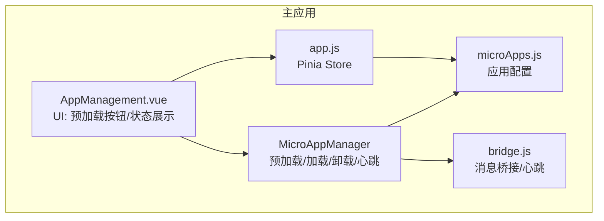
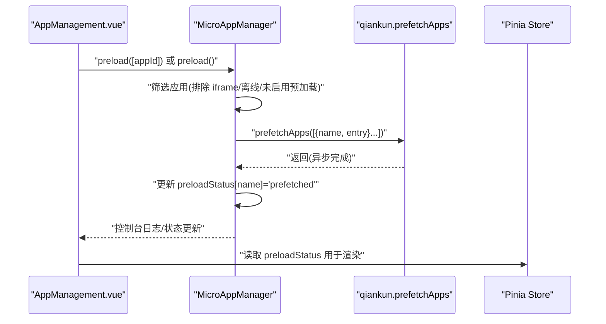
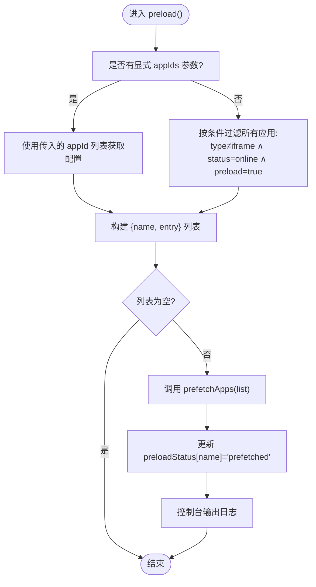
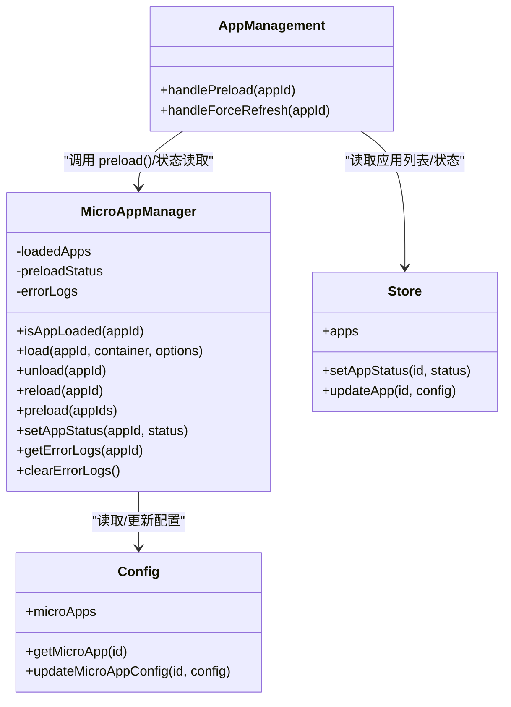

# 预加载系统

<cite>
**本文引用的文件**
- [packages/main-app/src/core/microAppManager.js](file://packages/main-app/src/core/microAppManager.js)
- [packages/main-app/src/views/AppManagement.vue](file://packages/main-app/src/views/AppManagement.vue)
- [packages/main-app/src/config/microApps.js](file://packages/main-app/src/config/microApps.js)
- [packages/main-app/src/stores/app.js](file://packages/main-app/src/stores/app.js)
- [packages/main-app/src/core/bridge.js](file://packages/main-app/src/core/bridge.js)
- [README.md](file://README.md)
</cite>

## 目录
1. [简介](#简介)
2. [项目结构](#项目结构)
3. [核心组件](#核心组件)
4. [架构总览](#架构总览)
5. [详细组件分析](#详细组件分析)
6. [依赖关系分析](#依赖关系分析)
7. [性能考量](#性能考量)
8. [故障排查指南](#故障排查指南)
9. [结论](#结论)
10. [附录](#附录)

## 简介
本文件面向“预加载系统”的技术文档，聚焦以下目标：
- 解析预加载策略、资源优化与性能提升机制
- 详解 preload() 方法的批量预加载逻辑、应用筛选条件与 qiankun 预取调用
- 阐述预加载状态管理、缓存策略与网络优化技术
- 说明预加载的应用类型限制（iframe 类型不支持预加载）与配置要求
- 提供预加载的时机选择、用户交互响应与资源竞争处理建议
- 给出配置项、性能监控与效果评估方法，以及失败回退与错误处理机制

## 项目结构
本仓库采用 Monorepo 架构，微前端框架基于 qiankun 的 loadMicroApp 模式。预加载系统位于主应用包内，核心文件包括：
- 微应用管理器：负责预加载、加载、卸载、心跳与错误日志等
- 应用管理界面：提供预加载按钮、状态展示与配置编辑
- 应用配置：定义各子应用的类型、入口、状态、是否预加载等
- 状态存储：Pinia Store 管理应用列表与状态
- 桥接通信：跨应用通信与心跳检测的基础能力

图表来源
- [packages/main-app/src/core/microAppManager.js](file://packages/main-app/src/core/microAppManager.js#L1-L515)
- [packages/main-app/src/views/AppManagement.vue](file://packages/main-app/src/views/AppManagement.vue#L1-L370)
- [packages/main-app/src/config/microApps.js](file://packages/main-app/src/config/microApps.js#L1-L110)
- [packages/main-app/src/stores/app.js](file://packages/main-app/src/stores/app.js#L1-L110)
- [packages/main-app/src/core/bridge.js](file://packages/main-app/src/core/bridge.js#L1-L241)

章节来源
- [README.md](file://README.md#L1-L158)

## 核心组件
- 预加载执行器：MicroAppManager.preload()
- 应用筛选器：按配置过滤（type !== iframe 且 status === online 且 preload === true）
- 预取调用：调用 qiankun 的 prefetchApps() 执行资源预取
- 状态管理：preloadStatus 响应式对象用于 UI 展示“已预加载”标记
- 错误日志：统一记录与清理，便于问题定位

章节来源
- [packages/main-app/src/core/microAppManager.js](file://packages/main-app/src/core/microAppManager.js#L417-L440)
- [packages/main-app/src/views/AppManagement.vue](file://packages/main-app/src/views/AppManagement.vue#L49-L73)
- [packages/main-app/src/config/microApps.js](file://packages/main-app/src/config/microApps.js#L1-L110)

## 架构总览
预加载系统围绕 MicroAppManager 展开，结合 UI 层触发与配置层约束，形成“配置驱动 + 事件触发 + qiankun 预取”的闭环。

图表来源
- [packages/main-app/src/views/AppManagement.vue](file://packages/main-app/src/views/AppManagement.vue#L264-L266)
- [packages/main-app/src/core/microAppManager.js](file://packages/main-app/src/core/microAppManager.js#L417-L440)
- [packages/main-app/src/stores/app.js](file://packages/main-app/src/stores/app.js#L1-L110)

## 详细组件分析

### 预加载策略与批量逻辑
- 触发方式
  - 手动触发：点击“预加载”按钮，传入单个 appId
  - 自动触发：页面挂载时自动对配置为预加载的应用进行批量预取
- 筛选条件
  - 仅对非 iframe 类型应用生效
  - 仅对 status 为 online 的应用生效
  - 仅对 preload 为 true 的应用生效
- 预取调用
  - 将满足条件的应用映射为 {name, entry} 列表
  - 调用 qiankun 的 prefetchApps() 执行预取
- 状态更新
  - 成功预取后，将对应应用的 preloadStatus 标记为“已预加载”
  - 控制台输出预取成功的应用列表

图表来源
- [packages/main-app/src/core/microAppManager.js](file://packages/main-app/src/core/microAppManager.js#L417-L440)

章节来源
- [packages/main-app/src/core/microAppManager.js](file://packages/main-app/src/core/microAppManager.js#L417-L440)
- [packages/main-app/src/views/AppManagement.vue](file://packages/main-app/src/views/AppManagement.vue#L330-L333)

### 应用类型限制与配置要求
- 类型限制
  - iframe 类型应用不参与预加载（UI 按钮禁用，筛选条件排除）
- 配置要求
  - status: 'online' 时才参与预加载
  - preload: true 时才参与预加载
  - entry: 预加载依赖有效的入口地址
- 示例配置字段
  - id/name/type/status/version/entry/preload/layoutType/layoutOptions/props

章节来源
- [packages/main-app/src/views/AppManagement.vue](file://packages/main-app/src/views/AppManagement.vue#L70-L71)
- [packages/main-app/src/core/microAppManager.js](file://packages/main-app/src/core/microAppManager.js#L421-L424)
- [packages/main-app/src/config/microApps.js](file://packages/main-app/src/config/microApps.js#L1-L110)
- [README.md](file://README.md#L98-L120)

### 预加载状态管理与 UI 展示
- 状态存储
  - MicroAppManager 内部维护 preloadStatus 响应式对象
  - UI 通过计算属性读取 preloadStatus，用于渲染“已预加载”标签
- UI 行为
  - “预加载”按钮对 iframe 类型禁用
  - 页面挂载时自动触发批量预加载
  - 支持手动触发单个应用预加载

章节来源
- [packages/main-app/src/core/microAppManager.js](file://packages/main-app/src/core/microAppManager.js#L25-L26)
- [packages/main-app/src/views/AppManagement.vue](file://packages/main-app/src/views/AppManagement.vue#L49-L73)
- [packages/main-app/src/views/AppManagement.vue](file://packages/main-app/src/views/AppManagement.vue#L330-L333)

### 网络优化与资源竞争
- 优化手段
  - 使用 qiankun 的 prefetchApps() 进行资源预取，减少首次加载延迟
  - 通过 HEAD 请求探测 last-modified 实现热更新检测（非 iframe 类型）
- 资源竞争
  - 预加载与实际加载可能同时发生，建议在 UI 层对“已预加载”应用跳过二次预取
  - 若存在大量预加载任务，建议分批或节流，避免网络拥塞

章节来源
- [packages/main-app/src/core/microAppManager.js](file://packages/main-app/src/core/microAppManager.js#L1-L5)
- [packages/main-app/src/core/microAppManager.js](file://packages/main-app/src/core/microAppManager.js#L392-L415)

### 用户交互与时机选择
- 时机选择
  - 页面初始化时自动预加载配置为预加载的应用
  - 用户手动点击“预加载”按钮对单个应用进行预加载
- 交互反馈
  - UI 展示“已预加载”标签
  - 控制台输出预加载结果日志
  - 错误日志集中管理，便于排查

章节来源
- [packages/main-app/src/views/AppManagement.vue](file://packages/main-app/src/views/AppManagement.vue#L330-L333)
- [packages/main-app/src/views/AppManagement.vue](file://packages/main-app/src/views/AppManagement.vue#L264-L266)
- [packages/main-app/src/core/microAppManager.js](file://packages/main-app/src/core/microAppManager.js#L438-L439)

### 错误处理与回退策略
- 错误记录
  - 统一记录错误日志，保留最近 100 条
  - 提供清空错误日志接口
- 回退策略
  - 预加载失败不影响后续加载流程
  - 加载阶段若出现异常，状态标记为 error，并记录错误
  - 对于 iframe 类型，加载失败会标记错误状态并记录

章节来源
- [packages/main-app/src/core/microAppManager.js](file://packages/main-app/src/core/microAppManager.js#L473-L507)
- [packages/main-app/src/core/microAppManager.js](file://packages/main-app/src/core/microAppManager.js#L223-L225)

## 依赖关系分析
- MicroAppManager 依赖
  - qiankun：prefetchApps/loadMicroApp
  - microApps 配置：筛选应用
  - Pinia Store：应用状态与配置持久化
  - bridge：消息桥接（与 iframe 心跳相关）
- UI 依赖
  - AppManagement.vue 依赖 MicroAppManager 的 preloadStatus 与 preload 方法
  - Pinia Store 提供应用列表与状态

图表来源
- [packages/main-app/src/core/microAppManager.js](file://packages/main-app/src/core/microAppManager.js#L1-L515)
- [packages/main-app/src/views/AppManagement.vue](file://packages/main-app/src/views/AppManagement.vue#L1-L370)
- [packages/main-app/src/config/microApps.js](file://packages/main-app/src/config/microApps.js#L1-L110)
- [packages/main-app/src/stores/app.js](file://packages/main-app/src/stores/app.js#L1-L110)

## 性能考量
- 预加载收益
  - 减少首屏切换延迟，提升用户体验
  - 与 qiankun 预取配合，提前建立子应用资源缓存
- 限制与注意
  - iframe 类型不支持预加载，避免无效请求
  - 预加载仅对 online 且 preload 的应用生效
- 建议
  - 对高频访问的应用开启预加载
  - 结合业务场景分批预加载，避免并发过高
  - 监控预加载成功率与首屏加载耗时，持续优化

## 故障排查指南
- 常见问题
  - 预加载按钮不可用：确认应用类型不是 iframe
  - 预加载无效果：检查应用 status 是否为 online 且 preload 是否为 true
  - 预加载报错：查看错误日志，定位具体应用与错误堆栈
- 排查步骤
  - 在应用管理界面查看“错误日志”卡片
  - 使用“强制刷新”对已加载应用进行重载
  - 清空错误日志后复现问题，观察控制台输出

章节来源
- [packages/main-app/src/views/AppManagement.vue](file://packages/main-app/src/views/AppManagement.vue#L104-L124)
- [packages/main-app/src/core/microAppManager.js](file://packages/main-app/src/core/microAppManager.js#L473-L507)

## 结论
预加载系统以配置驱动为核心，通过 MicroAppManager 的预加载逻辑与 UI 的交互，结合 qiankun 的资源预取能力，在保证安全（iframe 不预加载）的前提下，显著降低子应用切换时延。配合错误日志与状态管理，系统具备良好的可观测性与可维护性。建议在生产环境中根据业务热度与网络状况，合理规划预加载策略与监控指标，持续优化用户体验。

## 附录

### 配置项与字段说明
- 应用配置关键字段
  - id/name/type/status/version/entry/preload/layoutType/layoutOptions/props
- 预加载相关
  - status: 'online'/'offline'
  - preload: true/false
  - type: 'vue3'/'vue2'/'iframe'/'link'

章节来源
- [packages/main-app/src/config/microApps.js](file://packages/main-app/src/config/microApps.js#L1-L110)
- [README.md](file://README.md#L98-L120)

### 性能监控与效果评估方法
- 指标建议
  - 预加载成功率、首屏切换耗时、预加载命中率
- 采集点
  - 控制台日志（预加载成功/失败）
  - 错误日志（最近 100 条）
  - UI 状态（已预加载标签）

章节来源
- [packages/main-app/src/core/microAppManager.js](file://packages/main-app/src/core/microAppManager.js#L438-L439)
- [packages/main-app/src/core/microAppManager.js](file://packages/main-app/src/core/microAppManager.js#L473-L507)