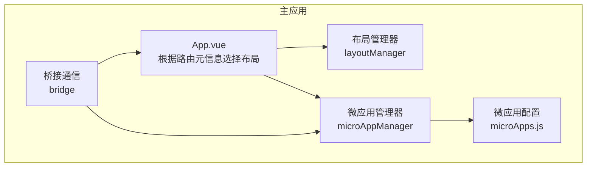
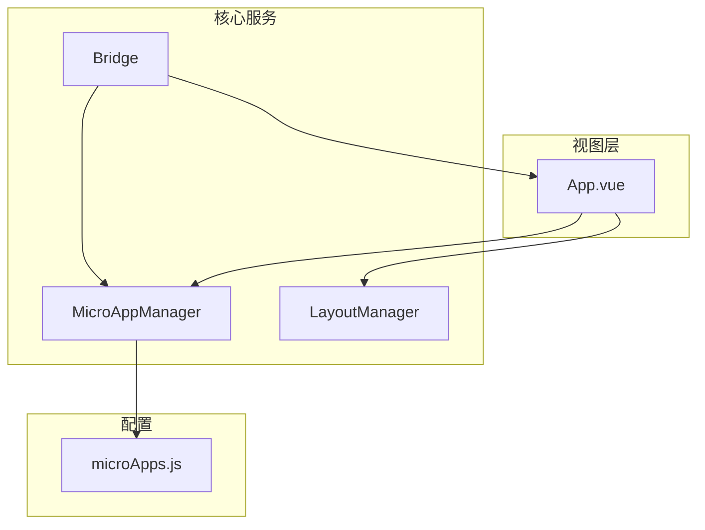
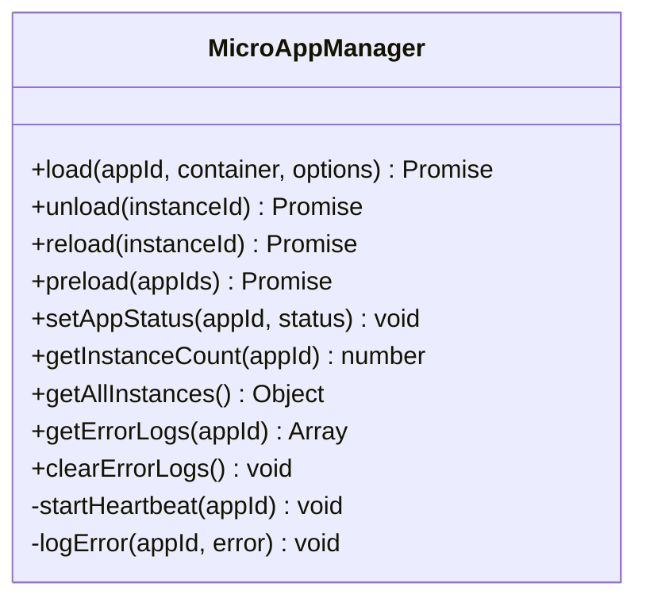
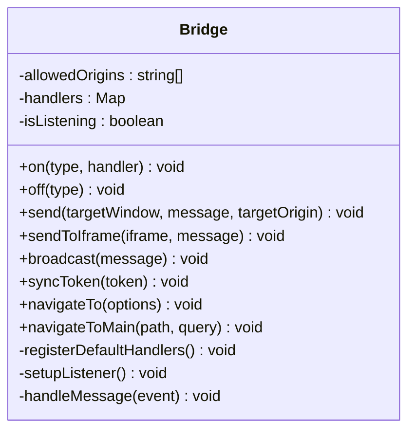
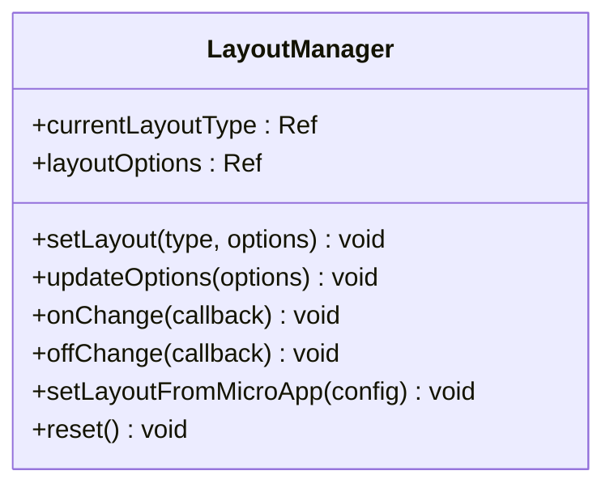
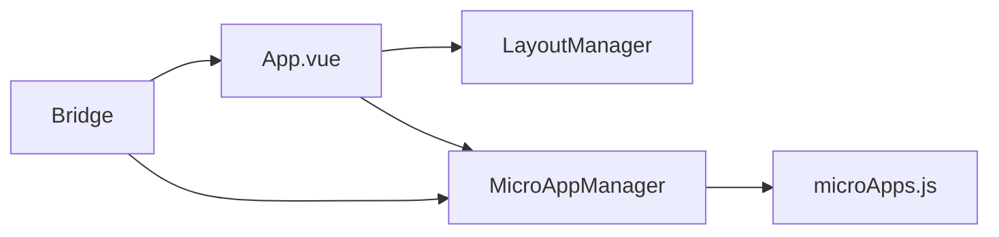

# 核心组件

<cite>
**本文引用的文件**
- [packages/main-app/src/core/microAppManager.js](file://packages/main-app/src/core/microAppManager.js)
- [packages/main-app/src/config/microApps.js](file://packages/main-app/src/config/microApps.js)
- [packages/main-app/src/core/bridge.js](file://packages/main-app/src/core/bridge.js)
- [packages/main-app/src/core/layoutManager.js](file://packages/main-app/src/core/layoutManager.js)
- [packages/main-app/src/App.vue](file://packages/main-app/src/App.vue)
- [user-docs/api/micro-app-manager.md](file://user-docs/api/micro-app-manager.md)
- [user-docs/api/bridge.md](file://user-docs/api/bridge.md)
- [user-docs/api/config.md](file://user-docs/api/config.md)
- [user-docs/guide/layout-system.md](file://user-docs/guide/layout-system.md)
</cite>

## 目录
1. [引言](#引言)
2. [项目结构](#项目结构)
3. [核心组件](#核心组件)
4. [架构总览](#架构总览)
5. [详细组件分析](#详细组件分析)
6. [依赖关系分析](#依赖关系分析)
7. [性能考虑](#性能考虑)
8. [故障排除指南](#故障排除指南)
9. [结论](#结论)
10. [附录](#附录)

## 引言
本文件面向核心组件模块，围绕以下主题展开：微应用管理器（MicroAppManager）的单例模式与多应用实例支持、热更新检测机制与预加载能力；跨应用通信系统（Bridge）的消息传递、安全校验与双向通信封装；布局管理器（LayoutManager）的五种布局类型、动态切换与配置管理。文档同时提供 API 说明、使用示例与最佳实践，并给出性能优化建议与故障排除指南，帮助开发者深入理解工作原理与扩展方式。

## 项目结构
核心组件位于主应用包内，采用按职责分层组织：
- 核心服务：微应用管理器、桥接通信、布局管理器
- 配置：微应用清单与查询辅助方法
- 视图层：基于路由元信息驱动的布局渲染

图表来源
- [packages/main-app/src/App.vue](file://packages/main-app/src/App.vue#L1-L43)
- [packages/main-app/src/core/microAppManager.js](file://packages/main-app/src/core/microAppManager.js#L298-L507)
- [packages/main-app/src/core/bridge.js](file://packages/main-app/src/core/bridge.js#L1-L166)
- [packages/main-app/src/core/layoutManager.js](file://packages/main-app/src/core/layoutManager.js#L1-L174)
- [packages/main-app/src/config/microApps.js](file://packages/main-app/src/config/microApps.js#L71-L109)

章节来源
- [packages/main-app/src/App.vue](file://packages/main-app/src/App.vue#L1-L43)
- [packages/main-app/src/core/microAppManager.js](file://packages/main-app/src/core/microAppManager.js#L298-L507)
- [packages/main-app/src/core/bridge.js](file://packages/main-app/src/core/bridge.js#L1-L166)
- [packages/main-app/src/core/layoutManager.js](file://packages/main-app/src/core/layoutManager.js#L1-L174)
- [packages/main-app/src/config/microApps.js](file://packages/main-app/src/config/microApps.js#L71-L109)

## 核心组件
- 微应用管理器（MicroAppManager）
  - 单例导出，提供加载、卸载、刷新、预加载、状态控制、实例统计与错误日志管理
  - 支持通过配置中心动态更新应用状态，离线时自动卸载
  - 提供心跳检测与资源清理能力
- 跨应用通信（Bridge）
  - 基于 postMessage 的消息桥，支持主子应用、子子应用双向通信
  - 内置默认处理器（导航、令牌、心跳、高度上报等），支持 origin 白名单校验
  - 提供发送、广播、iframe 专用发送等方法
- 布局管理器（LayoutManager）
  - 维护当前布局类型与布局选项，支持动态切换与回调通知
  - 可从微应用配置直接设置布局类型与选项，提供重置为默认布局的能力
- 视图层（App.vue）
  - 依据路由元信息（meta.layout）选择具体布局组件，结合 keep-alive 缓存策略

章节来源
- [packages/main-app/src/core/microAppManager.js](file://packages/main-app/src/core/microAppManager.js#L298-L507)
- [packages/main-app/src/core/bridge.js](file://packages/main-app/src/core/bridge.js#L1-L166)
- [packages/main-app/src/core/layoutManager.js](file://packages/main-app/src/core/layoutManager.js#L1-L174)
- [packages/main-app/src/App.vue](file://packages/main-app/src/App.vue#L1-L43)

## 架构总览
下图展示核心组件之间的交互关系与数据流：

图表来源
- [packages/main-app/src/App.vue](file://packages/main-app/src/App.vue#L1-L43)
- [packages/main-app/src/core/microAppManager.js](file://packages/main-app/src/core/microAppManager.js#L298-L507)
- [packages/main-app/src/core/bridge.js](file://packages/main-app/src/core/bridge.js#L1-L166)
- [packages/main-app/src/core/layoutManager.js](file://packages/main-app/src/core/layoutManager.js#L1-L174)
- [packages/main-app/src/config/microApps.js](file://packages/main-app/src/config/microApps.js#L71-L109)

## 详细组件分析

### 微应用管理器（MicroAppManager）
- 单例模式与导出
  - 通过构造函数创建实例并以命名导出形式对外暴露，确保全局唯一性与集中管理
- 多应用实例支持
  - 通过 appId 与容器分离的方式，支持同一应用在多个容器中并行加载，形成多应用实例
- 加载/卸载/刷新
  - load：根据 appId 读取配置，挂载到指定容器，记录实例信息
  - unload：移除实例、清理样式与脚本资源、触发卸载回调
  - reload：先卸载再重新加载，保证状态一致性
- 预加载
  - preload：批量预加载配置中声明 preload 的应用，提升后续访问速度
- 状态与健康检查
  - setAppStatus：更新应用状态，offline 时自动卸载
  - startHeartbeat：周期性检测应用健康状态，异常时标记为不健康
- 错误日志
  - logError/getErrorLogs/clearErrorLogs：统一记录与查询错误，限制历史条数

图表来源
- [packages/main-app/src/core/microAppManager.js](file://packages/main-app/src/core/microAppManager.js#L298-L507)

章节来源
- [packages/main-app/src/core/microAppManager.js](file://packages/main-app/src/core/microAppManager.js#L298-L507)
- [user-docs/api/micro-app-manager.md](file://user-docs/api/micro-app-manager.md#L1-L143)

### 跨应用通信（Bridge）
- 消息传递机制
  - on/off：注册与移除消息处理器
  - send/sendToIframe/broadcast：向目标窗口、iframe 或全部子应用发送消息
- 安全校验
  - allowedOrigins 白名单校验，拒绝非法来源消息
  - sendToIframe 自动推导目标 origin，避免跨域问题
- 双向通信封装
  - registerDefaultHandlers：内置导航、令牌、心跳、高度上报等常用消息类型
  - 支持主应用与子应用、子应用与子应用之间的消息互通
- 全局暴露
  - 初始化时可暴露至 window.__ARTISAN_BRIDGE__，便于子应用直接调用

图表来源
- [packages/main-app/src/core/bridge.js](file://packages/main-app/src/core/bridge.js#L1-L166)

章节来源
- [packages/main-app/src/core/bridge.js](file://packages/main-app/src/core/bridge.js#L1-L166)
- [user-docs/api/bridge.md](file://user-docs/api/bridge.md#L1-L150)

### 布局管理器（LayoutManager）
- 布局类型
  - default、full、tabs、embedded、blank 五种类型，分别对应不同的头部、侧边栏与缓存策略
- 动态切换与配置
  - setLayout：设置布局类型并合并选项，触发变更回调
  - updateOptions：更新布局选项
  - setLayoutFromMicroApp：从微应用配置直接设置布局
  - reset：恢复为默认布局
- 与视图层联动
  - App.vue 依据路由元信息（meta.layout）选择布局组件，结合 keep-alive 实现页面缓存

图表来源
- [packages/main-app/src/core/layoutManager.js](file://packages/main-app/src/core/layoutManager.js#L1-L174)
- [packages/main-app/src/App.vue](file://packages/main-app/src/App.vue#L1-L43)

章节来源
- [packages/main-app/src/core/layoutManager.js](file://packages/main-app/src/core/layoutManager.js#L1-L174)
- [packages/main-app/src/App.vue](file://packages/main-app/src/App.vue#L1-L43)
- [user-docs/guide/layout-system.md](file://user-docs/guide/layout-system.md#L1-L125)

### 配置与使用示例
- 微应用配置结构
  - 包含 id、name、entry、activeRule、container、status、version、lastModified、preload、type、layoutType、layoutOptions、props 等字段
- 辅助方法
  - getMicroApp、getOnlineMicroApps、getMicroAppsByType、updateMicroAppConfig
- 使用示例
  - 在路由 meta 中设置 layout
  - 在微应用配置中设置 layoutType 与 layoutOptions
  - 通过 layoutManager 动态切换布局

章节来源
- [user-docs/api/config.md](file://user-docs/api/config.md#L1-L121)
- [packages/main-app/src/config/microApps.js](file://packages/main-app/src/config/microApps.js#L71-L109)
- [user-docs/guide/layout-system.md](file://user-docs/guide/layout-system.md#L68-L115)

## 依赖关系分析
- 组件耦合
  - App.vue 依赖 LayoutManager 与路由元信息
  - MicroAppManager 依赖 microApps.js 进行配置读取与状态更新
  - Bridge 与 MicroAppManager 协作，通过消息驱动导航与状态同步
- 外部依赖
  - Vue 响应式系统（ref/computed/watch）
  - 浏览器 postMessage 与 iframe 通信
  - Element Plus 国际化与 UI 组件

图表来源
- [packages/main-app/src/App.vue](file://packages/main-app/src/App.vue#L1-L43)
- [packages/main-app/src/core/layoutManager.js](file://packages/main-app/src/core/layoutManager.js#L1-L174)
- [packages/main-app/src/core/microAppManager.js](file://packages/main-app/src/core/microAppManager.js#L298-L507)
- [packages/main-app/src/config/microApps.js](file://packages/main-app/src/config/microApps.js#L71-L109)
- [packages/main-app/src/core/bridge.js](file://packages/main-app/src/core/bridge.js#L1-L166)

## 性能考虑
- 预加载策略
  - 对高频应用启用 preload，减少首次加载延迟
  - 结合版本与 lastModified 字段进行热更新判断
- 心跳检测
  - 合理设置心跳间隔，避免频繁检测带来的性能开销
- 资源清理
  - 卸载时清理样式与脚本资源，防止内存泄漏
- 布局缓存
  - 合理使用 keepAlive 与 tabs 缓存，平衡内存占用与切换体验
- 消息处理
  - 严格 origin 校验，避免无效消息处理导致的性能浪费

## 故障排除指南
- 微应用无法加载
  - 检查配置中的 entry、activeRule、container 是否正确
  - 确认应用状态为 online，必要时通过 setAppStatus 切换
  - 查看错误日志：getErrorLogs(appId) 或 getAllInstances()
- 卸载后残留样式
  - 确保使用 unload 清理资源，或检查自定义入口是否遗留 link/style 标签
- 通信失败
  - 核对 allowedOrigins 是否包含目标 origin
  - 使用 sendToIframe 时确认 iframe 的 src 与 contentWindow 可用
- 布局异常
  - 检查路由 meta.layout 与微应用配置中的 layoutType 是否一致
  - 使用 reset 恢复默认布局验证问题范围

章节来源
- [packages/main-app/src/core/microAppManager.js](file://packages/main-app/src/core/microAppManager.js#L298-L507)
- [packages/main-app/src/core/bridge.js](file://packages/main-app/src/core/bridge.js#L1-L166)
- [packages/main-app/src/core/layoutManager.js](file://packages/main-app/src/core/layoutManager.js#L1-L174)

## 结论
本核心组件体系通过单例化的微应用管理器、安全可靠的跨应用通信桥与灵活的布局管理器，实现了微前端场景下的高内聚低耦合架构。开发者可通过配置中心统一管理应用与布局，借助 API 实现预加载、热更新检测与动态切换，配合最佳实践与故障排除指南，可快速构建稳定高效的微前端平台。

## 附录
- API 速查
  - 微应用管理器：load、unload、reload、preload、setAppStatus、getInstanceCount、getAllInstances、getErrorLogs、clearErrorLogs
  - 桥接通信：on、off、send、sendToIframe、broadcast、syncToken、navigateTo、navigateToMain
  - 布局管理器：setLayout、updateOptions、onChange、offChange、setLayoutFromMicroApp、reset
- 配置字段说明
  - id、name、entry、activeRule、container、status、version、lastModified、preload、type、layoutType、layoutOptions、props

章节来源
- [user-docs/api/micro-app-manager.md](file://user-docs/api/micro-app-manager.md#L1-L143)
- [user-docs/api/bridge.md](file://user-docs/api/bridge.md#L1-L150)
- [user-docs/api/config.md](file://user-docs/api/config.md#L1-L121)
- [user-docs/guide/layout-system.md](file://user-docs/guide/layout-system.md#L1-L125)