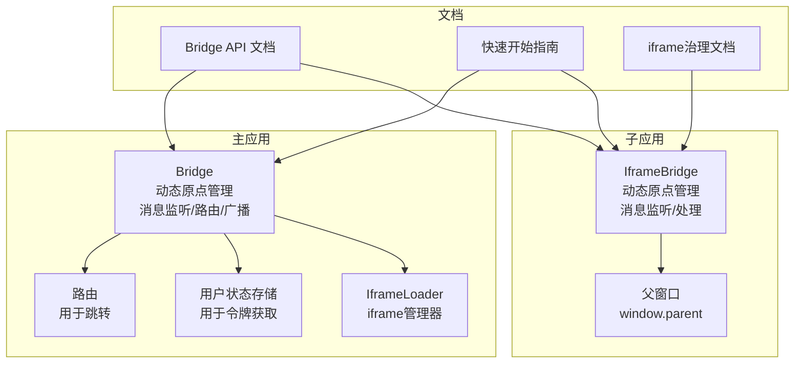
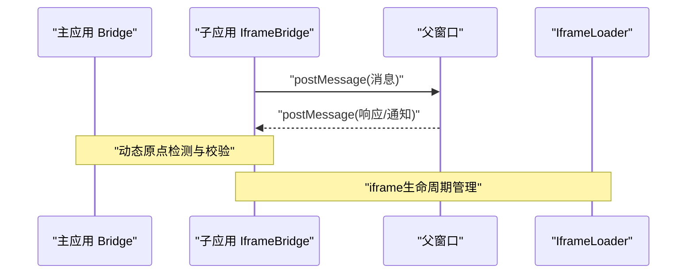
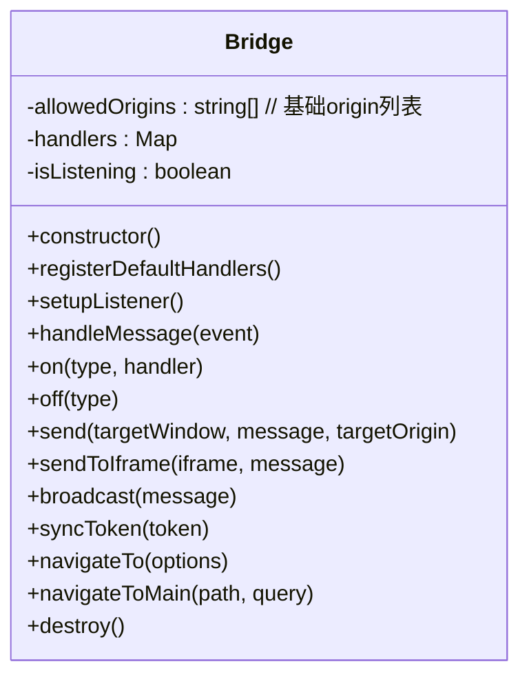
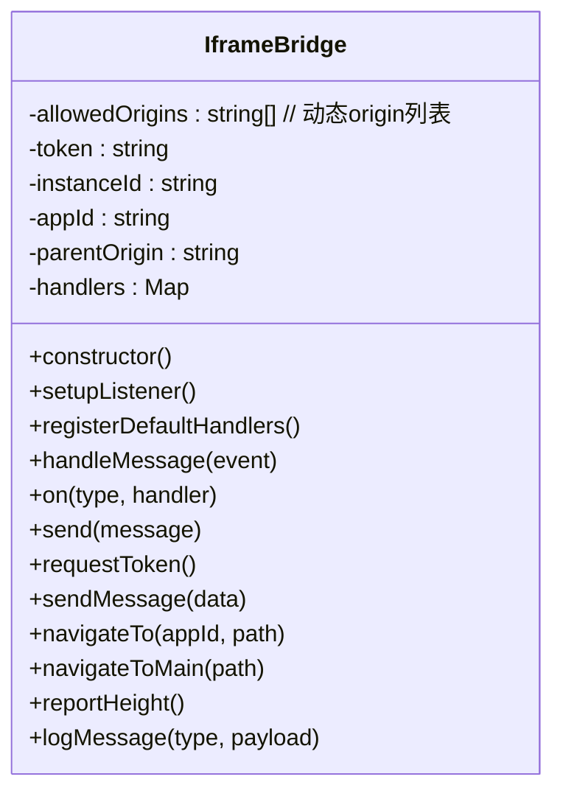
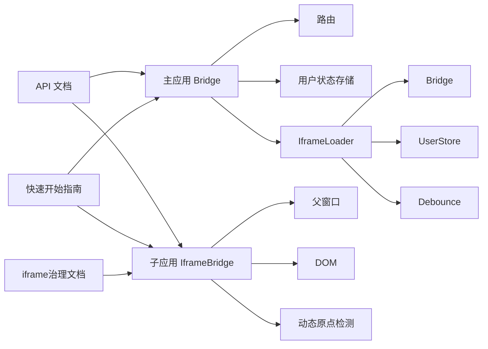

# 跨应用通信系统

<cite>
**本文引用的文件**
- [packages/main-app/src/core/bridge.js](file://packages/main-app/src/core/bridge.js)
- [packages/iframe-sub-app/src/bridge.js](file://packages/iframe-sub-app/src/bridge.js)
- [packages/main-app/src/core/iframeLoader.js](file://packages/main-app/src/core/iframeLoader.js)
- [user-docs/api/bridge.md](file://user-docs/api/bridge.md)
- [user-docs/guide/getting-started.md](file://user-docs/guide/getting-started.md)
- [user-docs/guide/iframe-governance.md](file://user-docs/guide/iframe-governance.md)
</cite>

## 更新摘要
**变更内容**
- 新增动态原点管理机制，支持自动检测父应用原点和嵌套iframe原点
- 引入Set去重机制，确保origin列表的唯一性
- 增强跨域安全校验的灵活性和可靠性
- 优化iframe子应用的origin白名单管理

## 目录
1. [简介](#简介)
2. [项目结构](#项目结构)
3. [核心组件](#核心组件)
4. [架构总览](#架构总览)
5. [详细组件分析](#详细组件分析)
6. [依赖关系分析](#依赖关系分析)
7. [性能考虑](#性能考虑)
8. [故障排除指南](#故障排除指南)
9. [结论](#结论)
10. [附录](#附录)

## 简介
本项目提供了一套基于 postMessage 的跨应用通信桥（Bridge）系统，支持主应用与子应用之间的双向通信，以及子应用与子应用之间的跨应用跳转。系统通过统一的消息类型与处理器机制，结合跨域安全校验、消息路由与异常处理策略，帮助开发者在微前端或多应用协作场景下实现稳定高效的通信。

**更新** 系统现已支持动态原点管理，包括自动检测父应用原点、嵌套iframe原点处理和Set去重机制，大幅提升了跨域通信的安全性和灵活性。

## 项目结构
该仓库采用多包结构（Lerna），核心通信桥位于主应用与 iframe 子应用中，文档位于 user-docs 中，便于开发者快速上手与查阅 API。

**图表来源**
- [packages/main-app/src/core/bridge.js](file://packages/main-app/src/core/bridge.js#L1-L246)
- [packages/iframe-sub-app/src/bridge.js](file://packages/iframe-sub-app/src/bridge.js#L1-L238)
- [packages/main-app/src/core/iframeLoader.js](file://packages/main-app/src/core/iframeLoader.js#L1-L334)
- [user-docs/api/bridge.md](file://user-docs/api/bridge.md#L1-L150)
- [user-docs/guide/getting-started.md](file://user-docs/guide/getting-started.md#L1-L87)
- [user-docs/guide/iframe-governance.md](file://user-docs/guide/iframe-governance.md#L1-L138)

## 核心组件
- **主应用 Bridge**：负责消息监听、默认处理器注册、消息分发、广播、令牌同步、路由跳转等。现已支持动态原点管理，自动检测并添加新的origin到白名单。
- **Iframe 子应用 IframeBridge**：负责与主应用通信的消息监听、默认处理器注册、令牌请求/同步、心跳、高度上报、导航等。具备智能的父应用原点检测和嵌套iframe原点处理能力。
- **IframeLoader**：新增的iframe管理器，负责iframe实例的生命周期管理、高度自适应和通信协调。
- **文档**：提供 API 说明、内置消息类型、使用示例与端口配置。

**章节来源**
- [packages/main-app/src/core/bridge.js](file://packages/main-app/src/core/bridge.js#L9-L32)
- [packages/iframe-sub-app/src/bridge.js](file://packages/iframe-sub-app/src/bridge.js#L5-L38)
- [packages/main-app/src/core/iframeLoader.js](file://packages/main-app/src/core/iframeLoader.js#L9-L39)
- [user-docs/api/bridge.md](file://user-docs/api/bridge.md#L1-L150)

## 架构总览
系统以 postMessage 为核心通信协议，主应用与子应用之间通过消息类型进行路由与处理。主应用维护允许的 origin 白名单并进行跨域校验；子应用同样维护白名单并向上游发送消息。**更新** 现在支持动态原点管理，通过智能检测机制自动维护origin白名单。

**图表来源**
- [packages/main-app/src/core/bridge.js](file://packages/main-app/src/core/bridge.js#L101-L106)
- [packages/iframe-sub-app/src/bridge.js](file://packages/iframe-sub-app/src/bridge.js#L116-L121)
- [packages/main-app/src/core/iframeLoader.js](file://packages/main-app/src/core/iframeLoader.js#L31-L119)

## 详细组件分析

### 主应用 Bridge 组件
- **职责**
  - 维护基础的 origin 列表并进行跨域校验。
  - 注册默认处理器：导航、令牌请求/响应、心跳、高度上报、通用消息。
  - 提供 on/off 注册/移除处理器。
  - 提供 send/sendToIframe/broadcast/syncToken/navigateTo/navigateToMain 等 API。
  - 初始化时设置消息监听，并将常用方法暴露到全局供子应用调用。
- **关键实现点**
  - 跨域校验：仅接受白名单或同源消息。
  - 默认处理器：根据内置消息类型执行相应业务逻辑（如路由跳转、高度调整、令牌同步）。
  - 广播：对所有匹配的 iframe 进行消息发送，并通过自定义事件向非 iframe 子应用广播。
  - 导航：通过路由 push 执行跨应用跳转。
  - **动态原点管理**：保留基础origin列表，为后续动态扩展预留空间。
- **性能与健壮性**
  - 使用 Map 存储处理器，O(1) 查找。
  - 广播遍历 DOM，建议在子应用数量较多时限制选择器范围或采用更细粒度的路由。
  - 销毁时移除监听与清理处理器，避免内存泄漏。

**图表来源**
- [packages/main-app/src/core/bridge.js](file://packages/main-app/src/core/bridge.js#L9-L222)

**章节来源**
- [packages/main-app/src/core/bridge.js](file://packages/main-app/src/core/bridge.js#L11-L17)
- [packages/main-app/src/core/bridge.js](file://packages/main-app/src/core/bridge.js#L37-L83)
- [packages/main-app/src/core/bridge.js](file://packages/main-app/src/core/bridge.js#L88-L119)
- [packages/main-app/src/core/bridge.js](file://packages/main-app/src/core/bridge.js#L144-L160)
- [packages/main-app/src/core/bridge.js](file://packages/main-app/src/core/bridge.js#L166-L176)
- [packages/main-app/src/core/bridge.js](file://packages/main-app/src/core/bridge.js#L182-L210)
- [packages/main-app/src/core/bridge.js](file://packages/main-app/src/core/bridge.js#L215-L222)

### Iframe 子应用 IframeBridge 组件
- **职责**
  - **动态原点检测**：自动检测父应用原点和嵌套iframe原点，确保通信安全。
  - 维护允许的 origin 列表并进行跨域校验。
  - 注册默认处理器：初始化、令牌同步/响应、心跳、尺寸变更。
  - 提供 send/requestToken/sendMessage/navigateTo/navigateToMain/reportHeight 等 API。
  - 将自身作为全局实例挂载至 window，便于子应用直接使用。
- **关键实现点**
  - **父应用原点检测**：通过 `window.parent.location.origin` 自动获取父应用origin。
  - **嵌套iframe原点处理**：使用 `window.location.ancestorOrigins` 处理多层嵌套情况。
  - **Set去重机制**：使用 `[...new Set([...this.allowedOrigins, ...payload.allowedOrigins])]` 确保origin唯一性。
  - 跨域校验：仅接受白名单消息。
  - 初始化：接收主应用下发的令牌、实例 ID、应用 ID、父窗口 origin，更新页面输入框并上报高度。
  - 令牌同步：接收主应用广播的令牌并更新本地状态。
  - 心跳：对 PING 响应 PONG，携带时间戳。
  - 导航：向主应用发送导航消息，由主应用执行路由跳转。
  - 高度上报：计算页面滚动高度并上报，主应用据此调整 iframe 高度。
- **性能与健壮性**
  - 使用 Map 存储处理器，O(1) 查找。
  - 高度上报建议节流，避免频繁 DOM 计算。
  - 页面日志记录仅用于调试，生产环境可关闭。

**图表来源**
- [packages/iframe-sub-app/src/bridge.js](file://packages/iframe-sub-app/src/bridge.js#L5-L232)

**章节来源**
- [packages/iframe-sub-app/src/bridge.js](file://packages/iframe-sub-app/src/bridge.js#L7-L28)
- [packages/iframe-sub-app/src/bridge.js](file://packages/iframe-sub-app/src/bridge.js#L52-L75)
- [packages/iframe-sub-app/src/bridge.js](file://packages/iframe-sub-app/src/bridge.js#L116-L137)
- [packages/iframe-sub-app/src/bridge.js](file://packages/iframe-sub-app/src/bridge.js#L149-L153)
- [packages/iframe-sub-app/src/bridge.js](file://packages/iframe-sub-app/src/bridge.js#L158-L163)
- [packages/iframe-sub-app/src/bridge.js](file://packages/iframe-sub-app/src/bridge.js#L182-L197)
- [packages/iframe-sub-app/src/bridge.js](file://packages/iframe-sub-app/src/bridge.js#L202-L220)

### IframeLoader 组件
**新增** 专门负责iframe实例的生命周期管理，包括加载、通信、高度自适应等功能。

- **职责**
  - 管理iframe实例的创建、销毁和缓存。
  - 监听iframe消息并进行路由分发。
  - 处理iframe高度自适应和心跳检测。
  - 提供统一的消息发送接口。
- **关键实现点**
  - 使用 Map 缓存iframe实例，支持批量管理。
  - 通过 `bridge.sendToIframe()` 发送消息，自动处理origin。
  - 集成心跳检测，监控iframe健康状态。
  - 提供防抖的高度更新机制，优化性能。

**章节来源**
- [packages/main-app/src/core/iframeLoader.js](file://packages/main-app/src/core/iframeLoader.js#L9-L334)

### sendToIframe() 与 sendToMicroApp() 实现原理与使用
- **sendToIframe()**
  - **更新** 现在使用 `new URL(iframe.src).origin` 自动从 iframe.src 解析目标 origin，提升安全性。
  - 实现要点：检查 iframe.contentWindow 是否存在，再通过 postMessage 发送。
  - 使用场景：主应用需要向某个 iframe 子应用推送消息（如令牌同步、高度上报）。
- **sendToMicroApp()**
  - 说明：在当前代码中未发现名为 sendToMicroApp 的方法。若需跨子应用通信，可通过主应用的广播或导航能力间接实现。
  - 替代方案：
    - 广播：主应用使用 bridge.broadcast() 向所有子应用广播消息。
    - 导航：通过 bridge.navigateTo() 或 bridge.navigateToMain() 实现跨应用跳转。

**章节来源**
- [packages/main-app/src/core/bridge.js](file://packages/main-app/src/core/bridge.js#L155-L160)
- [packages/main-app/src/core/bridge.js](file://packages/main-app/src/core/bridge.js#L166-L176)
- [packages/main-app/src/core/bridge.js](file://packages/main-app/src/core/bridge.js#L189-L210)

### 消息类型与路由系统
- **内置消息类型**
  - NAVIGATE_TO：跳转到子应用，payload 包含 appId、path、query。
  - NAVIGATE_TO_MAIN：跳转到主应用，payload 包含 path、query。
  - REQUEST_TOKEN：请求令牌，payload 包含实例 ID。
  - TOKEN_RESPONSE：令牌响应，payload 包含 token。
  - TOKEN_SYNC：令牌同步，payload 包含 token。
  - LOGOUT：登出通知。
  - REPORT_HEIGHT：高度上报（iframe），payload 包含 height、instanceId。
  - PING/PONG：心跳请求与响应。
  - MESSAGE：通用消息。
- **路由机制**
  - 主应用：根据 type 分发到对应处理器，执行路由跳转、令牌同步、高度调整等。
  - 子应用：根据 type 分发到对应处理器，执行初始化、心跳、导航、高度上报等。

**章节来源**
- [user-docs/api/bridge.md](file://user-docs/api/bridge.md#L136-L150)
- [packages/main-app/src/core/bridge.js](file://packages/main-app/src/core/bridge.js#L38-L83)
- [packages/iframe-sub-app/src/bridge.js](file://packages/iframe-sub-app/src/bridge.js#L52-L111)

### 动态原点管理机制
**新增** 系统的核心安全特性，确保跨域通信的动态性和安全性。

- **主应用动态原点管理**
  - 保留基础origin列表，为后续扩展预留空间。
  - 通过 `window.location.origin` 自动识别当前应用origin。
  - 支持运行时动态添加新的origin到白名单。
- **子应用动态原点检测**
  - **父应用原点检测**：通过 `window.parent.location.origin` 自动获取父应用origin。
  - **嵌套iframe原点处理**：使用 `window.location.ancestorOrigins` 处理多层嵌套情况。
  - **Set去重机制**：使用 `[...new Set([...this.allowedOrigins, ...payload.allowedOrigins])]` 确保origin唯一性。
- **跨域安全校验**
  - 接收消息时校验 event.origin 是否在白名单内或与当前窗口同源。
  - 若 origin 不受信任，直接拒绝并记录警告日志。
  - 发送消息时，iframe 子应用使用 iframe.src.origin 作为 targetOrigin，增强安全性。

**章节来源**
- [packages/main-app/src/core/bridge.js](file://packages/main-app/src/core/bridge.js#L11-L17)
- [packages/iframe-sub-app/src/bridge.js](file://packages/iframe-sub-app/src/bridge.js#L14-L28)
- [packages/iframe-sub-app/src/bridge.js](file://packages/iframe-sub-app/src/bridge.js#L59-L62)
- [packages/iframe-sub-app/src/bridge.js](file://packages/iframe-sub-app/src/bridge.js#L118-L121)

### 异常处理策略
- **跨域拒绝**：记录警告日志，不执行后续处理。
- **缺失 type**：忽略无效消息。
- **目标窗口不存在**：sendToIframe() 检查 iframe.contentWindow，避免空引用。
- **处理器缺失**：未找到对应 type 的处理器时静默忽略，保持系统稳健性。
- **动态原点异常**：父应用origin检测失败时回退到基础白名单。
- **销毁阶段**：移除消息监听与清理处理器，防止内存泄漏。

**章节来源**
- [packages/main-app/src/core/bridge.js](file://packages/main-app/src/core/bridge.js#L103-L106)
- [packages/main-app/src/core/bridge.js](file://packages/main-app/src/core/bridge.js#L155-L160)
- [packages/iframe-sub-app/src/bridge.js](file://packages/iframe-sub-app/src/bridge.js#L118-L121)
- [packages/iframe-sub-app/src/bridge.js](file://packages/iframe-sub-app/src/bridge.js#L215-L220)

### 消息格式规范与事件监听机制
- **消息格式**
  - type：字符串，标识消息类型。
  - payload：对象，承载业务数据。
- **事件监听**
  - 主应用与子应用均通过 window.addEventListener('message', ...) 注册监听。
  - 处理器通过 Map(type -> handler) 进行路由分发。
- **性能优化建议**
  - 为高频消息（如心跳、高度上报）添加节流/去抖。
  - 广播时限制选择器范围，避免全量扫描 DOM。
  - 在销毁前移除监听，避免重复绑定。
  - **动态原点管理**：使用Set去重机制，避免重复origin影响性能。

**章节来源**
- [packages/main-app/src/core/bridge.js](file://packages/main-app/src/core/bridge.js#L88-L119)
- [packages/iframe-sub-app/src/bridge.js](file://packages/iframe-sub-app/src/bridge.js#L43-L137)

### 使用示例与最佳实践
- **主应用侧**
  - 注册处理器：使用 bridge.on('TYPE', handler) 注册自定义消息处理。
  - 发送消息：使用 bridge.send(window, { type, payload }, targetOrigin) 或 bridge.sendToIframe(iframe, message)。
  - 广播与令牌同步：使用 bridge.broadcast(message) 与 bridge.syncToken(token)。
  - 跨应用跳转：使用 bridge.navigateTo({ appId, path, query }) 与 bridge.navigateToMain(path, query)。
- **子应用侧**
  - **动态原点检测**：等待主应用下发 INIT 消息，自动更新 allowedOrigins 列表。
  - 初始化：等待主应用下发 INIT 消息，完成令牌、实例 ID、应用 ID、父窗口 origin 的初始化。
  - 令牌同步：监听 TOKEN_SYNC，更新本地状态与页面输入框。
  - 心跳：监听 PING 并返回 PONG。
  - 导航：调用 navigateTo(appId, path) 或 navigateToMain(path)。
  - 高度上报：定期调用 reportHeight()。
- **最佳实践**
  - 明确消息类型命名规范，避免冲突。
  - 严格校验 payload 结构，必要时增加校验与默认值。
  - 对高频消息进行节流，减少主线程压力。
  - 在开发环境开启日志，在生产环境关闭或降级。
  - **动态原点管理**：充分利用自动检测功能，减少手动配置。

**章节来源**
- [user-docs/api/bridge.md](file://user-docs/api/bridge.md#L13-L25)
- [user-docs/api/bridge.md](file://user-docs/api/bridge.md#L38-L52)
- [user-docs/api/bridge.md](file://user-docs/api/bridge.md#L69-L81)
- [user-docs/api/bridge.md](file://user-docs/api/bridge.md#L83-L92)
- [user-docs/api/bridge.md](file://user-docs/api/bridge.md#L94-L122)
- [packages/iframe-sub-app/src/bridge.js](file://packages/iframe-sub-app/src/bridge.js#L52-L75)
- [packages/iframe-sub-app/src/bridge.js](file://packages/iframe-sub-app/src/bridge.js#L116-L137)

## 依赖关系分析
- **主应用 Bridge 依赖**
  - 路由：用于跨应用跳转。
  - 用户状态存储：用于令牌获取与同步。
  - IframeLoader：新增的iframe管理器依赖。
- **子应用 IframeBridge 依赖**
  - 父窗口：通过 window.parent.postMessage 与主应用通信。
  - DOM：用于高度计算与页面元素更新。
  - **动态原点检测**：依赖 window.parent 和 window.location.ancestorOrigins API。
- **IframeLoader 依赖**
  - Bridge：通过 bridge.sendToIframe() 发送消息。
  - UserStore：用于获取用户令牌。
  - Debounce：用于高度更新的防抖处理。
- **文档依赖**
  - API 文档与快速开始指南为使用提供入口。
  - iframe治理文档提供跨域安全指导。

**图表来源**
- [packages/main-app/src/core/bridge.js](file://packages/main-app/src/core/bridge.js#L1-L3)
- [packages/iframe-sub-app/src/bridge.js](file://packages/iframe-sub-app/src/bridge.js#L14-L28)
- [packages/main-app/src/core/iframeLoader.js](file://packages/main-app/src/core/iframeLoader.js#L1-L3)
- [user-docs/api/bridge.md](file://user-docs/api/bridge.md#L1-L150)
- [user-docs/guide/iframe-governance.md](file://user-docs/guide/iframe-governance.md#L1-L138)

**章节来源**
- [packages/main-app/src/core/bridge.js](file://packages/main-app/src/core/bridge.js#L1-L3)
- [packages/iframe-sub-app/src/bridge.js](file://packages/iframe-sub-app/src/bridge.js#L14-L28)
- [packages/main-app/src/core/iframeLoader.js](file://packages/main-app/src/core/iframeLoader.js#L1-L3)
- [user-docs/api/bridge.md](file://user-docs/api/bridge.md#L1-L150)
- [user-docs/guide/iframe-governance.md](file://user-docs/guide/iframe-governance.md#L1-L138)

## 性能考虑
- **消息处理**
  - 使用 Map 存储处理器，查找复杂度 O(1)。
  - 对高频消息（心跳、高度上报）建议节流/去抖，降低主线程压力。
- **广播与导航**
  - 广播遍历 DOM，建议限制选择器范围或采用更细粒度的路由。
  - 路由跳转由主应用统一处理，避免子应用重复实现。
- **资源释放**
  - 销毁时移除消息监听与清理处理器，防止内存泄漏。
- **跨域校验**
  - 白名单校验在每次消息到达时执行，建议保持列表精简，避免过多 origin 影响性能。
  - **动态原点管理**：使用Set去重机制，确保origin列表的唯一性和查询效率。
- **IframeLoader 性能**
  - 使用 Map 缓存iframe实例，避免重复创建。
  - 集成防抖的高度更新机制，减少DOM操作频率。
  - 心跳检测采用定时器管理，支持启停控制。

**章节来源**
- [packages/main-app/src/core/bridge.js](file://packages/main-app/src/core/bridge.js#L103-L106)
- [packages/iframe-sub-app/src/bridge.js](file://packages/iframe-sub-app/src/bridge.js#L61)
- [packages/main-app/src/core/iframeLoader.js](file://packages/main-app/src/core/iframeLoader.js#L17-L18)

## 故障排除指南
- **问题：消息被拒绝**
  - 可能原因：event.origin 不在白名单或与当前窗口不同源。
  - 处理方式：检查 allowedOrigins 配置，确认子应用 iframe 的 src 与主应用端口一致。
  - **动态原点问题**：检查父应用origin检测是否正常工作。
- **问题：sendToIframe() 无响应**
  - 可能原因：iframe.contentWindow 为空或 iframe 未正确加载。
  - 处理方式：确认 iframe 已渲染且 contentWindow 可用；检查 targetOrigin 是否正确。
- **问题：广播未生效**
  - 可能原因：DOM 选择器未匹配到 iframe；非 iframe 子应用未监听自定义事件。
  - 处理方式：确认 iframe id 前缀；非 iframe 子应用需监听 window 上的自定义事件。
- **问题：心跳/高度上报异常**
  - 可能原因：频率过高导致主线程阻塞；未正确处理 PING/PONG。
  - 处理方式：对心跳与高度上报添加节流；确保处理器正确返回响应。
- **问题：令牌同步失败**
  - 可能原因：主应用未正确获取用户令牌；子应用未监听 TOKEN_SYNC。
  - 处理方式：确认用户状态存储可用；确保子应用注册了 TOKEN_SYNC 处理器。
- **问题：动态原点检测失败**
  - 可能原因：嵌套iframe层级过深；window.parent 或 window.location.ancestorOrigins 不可用。
  - 处理方式：检查浏览器兼容性；确认父子窗口同源策略；验证origin检测逻辑。
- **问题：Set去重机制异常**
  - 可能原因：传入的allowedOrigins不是数组；包含重复元素。
  - 处理方式：确保传入的allowedOrigins是有效的数组；检查数据格式。

**章节来源**
- [packages/main-app/src/core/bridge.js](file://packages/main-app/src/core/bridge.js#L103-L106)
- [packages/main-app/src/core/bridge.js](file://packages/main-app/src/core/bridge.js#L155-L160)
- [packages/iframe-sub-app/src/bridge.js](file://packages/iframe-sub-app/src/bridge.js#L118-L121)
- [packages/iframe-sub-app/src/bridge.js](file://packages/iframe-sub-app/src/bridge.js#L59-L62)

## 结论
本跨应用通信系统以 postMessage 为基础，结合主应用与子应用两端的 Bridge 实现，提供了完善的跨域通信、消息路由、令牌同步与导航能力。**更新** 系统现已支持动态原点管理，包括自动检测父应用原点、嵌套iframe原点处理和Set去重机制，大幅提升了系统的安全性和灵活性。

通过严格的跨域校验与默认处理器机制，系统在保证安全性的同时，提供了良好的扩展性与易用性。新增的动态原点管理功能使得系统能够自动适应复杂的嵌套iframe场景，Set去重机制确保了origin列表的唯一性和查询效率。

建议在实际使用中遵循消息类型规范、进行性能优化与异常处理，并结合文档提供的示例与最佳实践快速落地。充分利用动态原点管理功能，减少手动配置，提升系统的自动化程度和安全性。

## 附录
- **端口与应用映射**
  - 主应用：8080
  - Vue3 子应用：7080
  - Vue2 子应用：3000
  - Iframe 子应用：9080
- **CLI 创建子应用**
  - 支持创建 Vue3/Vue2/iframe 类型子应用，便于快速扩展。
- **动态原点管理特性**
  - 自动检测父应用原点：`window.parent.location.origin`
  - 嵌套iframe原点处理：`window.location.ancestorOrigins`
  - Set去重机制：`[...new Set([...this.allowedOrigins, ...payload.allowedOrigins])]`
  - IframeLoader集成：提供统一的iframe生命周期管理

**章节来源**
- [user-docs/guide/getting-started.md](file://user-docs/guide/getting-started.md#L42-L48)
- [user-docs/guide/getting-started.md](file://user-docs/guide/getting-started.md#L65-L80)
- [packages/iframe-sub-app/src/bridge.js](file://packages/iframe-sub-app/src/bridge.js#L14-L28)
- [packages/iframe-sub-app/src/bridge.js](file://packages/iframe-sub-app/src/bridge.js#L59-L62)
- [packages/main-app/src/core/iframeLoader.js](file://packages/main-app/src/core/iframeLoader.js#L31-L119)