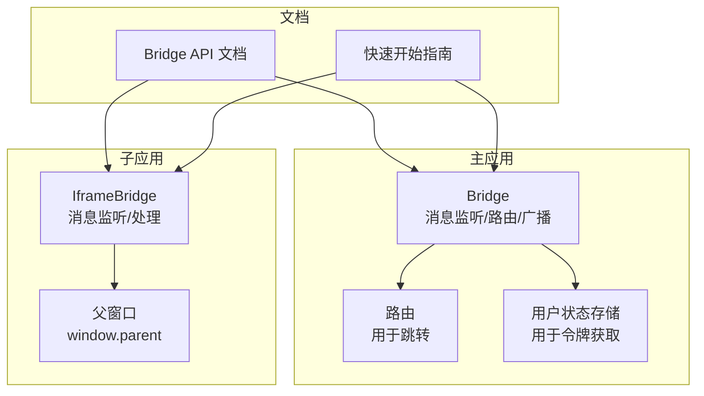
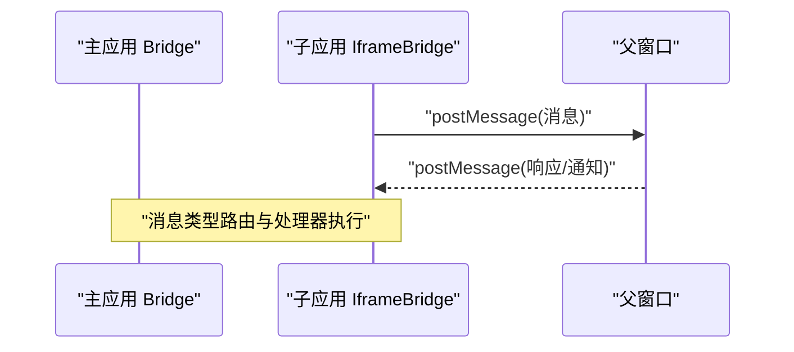
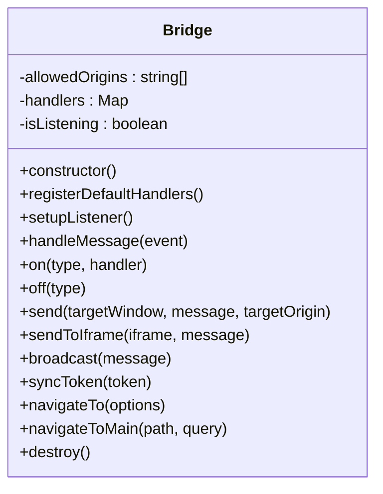
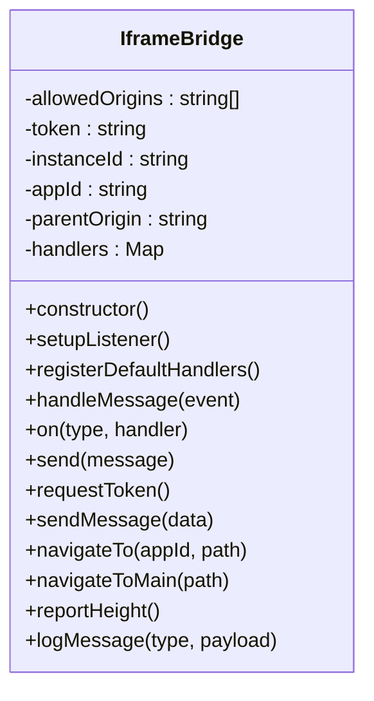
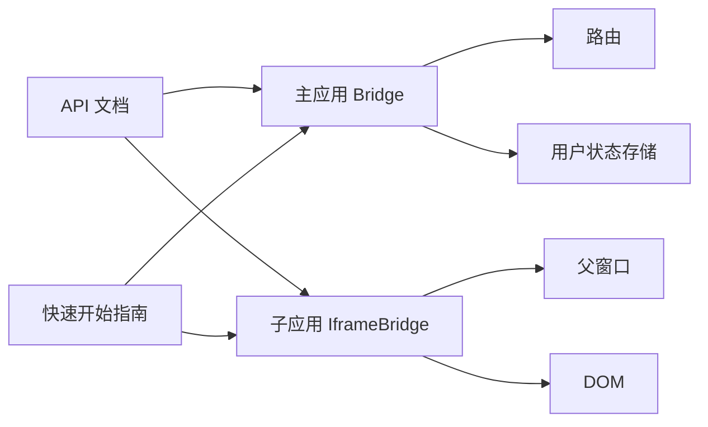

# 跨应用通信系统

<cite>
**本文引用的文件**
- [packages/main-app/src/core/bridge.js](file://packages/main-app/src/core/bridge.js)
- [packages/iframe-sub-app/src/bridge.js](file://packages/iframe-sub-app/src/bridge.js)
- [user-docs/api/bridge.md](file://user-docs/api/bridge.md)
- [user-docs/guide/getting-started.md](file://user-docs/guide/getting-started.md)
</cite>

## 目录
1. [简介](#简介)
2. [项目结构](#项目结构)
3. [核心组件](#核心组件)
4. [架构总览](#架构总览)
5. [详细组件分析](#详细组件分析)
6. [依赖关系分析](#依赖关系分析)
7. [性能考虑](#性能考虑)
8. [故障排除指南](#故障排除指南)
9. [结论](#结论)
10. [附录](#附录)

## 简介
本项目提供了一套基于 postMessage 的跨应用通信桥（Bridge）系统，支持主应用与子应用之间的双向通信，以及子应用与子应用之间的跨应用跳转。系统通过统一的消息类型与处理器机制，结合跨域安全校验、消息路由与异常处理策略，帮助开发者在微前端或多应用协作场景下实现稳定高效的通信。

## 项目结构
该仓库采用多包结构（Lerna），核心通信桥位于主应用与 iframe 子应用中，文档位于 user-docs 中，便于开发者快速上手与查阅 API。

图表来源
- [packages/main-app/src/core/bridge.js](file://packages/main-app/src/core/bridge.js#L1-L241)
- [packages/iframe-sub-app/src/bridge.js](file://packages/iframe-sub-app/src/bridge.js#L1-L216)
- [user-docs/api/bridge.md](file://user-docs/api/bridge.md#L1-L150)
- [user-docs/guide/getting-started.md](file://user-docs/guide/getting-started.md#L1-L87)

章节来源
- [user-docs/guide/getting-started.md](file://user-docs/guide/getting-started.md#L49-L63)

## 核心组件
- 主应用 Bridge：负责消息监听、默认处理器注册、消息分发、广播、令牌同步、路由跳转等。
- Iframe 子应用 IframeBridge：负责与主应用通信的消息监听、默认处理器注册、令牌请求/同步、心跳、高度上报、导航等。
- 文档：提供 API 说明、内置消息类型、使用示例与端口配置。

章节来源
- [packages/main-app/src/core/bridge.js](file://packages/main-app/src/core/bridge.js#L9-L27)
- [packages/iframe-sub-app/src/bridge.js](file://packages/iframe-sub-app/src/bridge.js#L5-L22)
- [user-docs/api/bridge.md](file://user-docs/api/bridge.md#L1-L150)

## 架构总览
系统以 postMessage 为核心通信协议，主应用与子应用之间通过消息类型进行路由与处理。主应用维护允许的 origin 白名单并进行跨域校验；子应用同样维护白名单并向上游发送消息。

图表来源
- [packages/main-app/src/core/bridge.js](file://packages/main-app/src/core/bridge.js#L96-L114)
- [packages/iframe-sub-app/src/bridge.js](file://packages/iframe-sub-app/src/bridge.js#L94-L115)

## 详细组件分析

### 主应用 Bridge 组件
- 职责
  - 维护允许的 origin 列表并进行跨域校验。
  - 注册默认处理器：导航、令牌请求/响应、心跳、高度上报、通用消息。
  - 提供 on/off 注册/移除处理器。
  - 提供 send/sendToIframe/broadcast/syncToken/navigateTo/navigateToMain 等 API。
  - 初始化时设置消息监听，并将常用方法暴露到全局供子应用调用。
- 关键实现点
  - 跨域校验：仅接受白名单或同源消息。
  - 默认处理器：根据内置消息类型执行相应业务逻辑（如路由跳转、高度调整、令牌同步）。
  - 广播：对所有匹配的 iframe 进行消息发送，并通过自定义事件向非 iframe 子应用广播。
  - 导航：通过路由 push 执行跨应用跳转。
- 性能与健壮性
  - 使用 Map 存储处理器，O(1) 查找。
  - 广播遍历 DOM，建议在子应用数量较多时限制选择器范围或采用更细粒度的路由。
  - 销毁时移除监听与清理处理器，避免内存泄漏。

图表来源
- [packages/main-app/src/core/bridge.js](file://packages/main-app/src/core/bridge.js#L9-L217)

章节来源
- [packages/main-app/src/core/bridge.js](file://packages/main-app/src/core/bridge.js#L11-L27)
- [packages/main-app/src/core/bridge.js](file://packages/main-app/src/core/bridge.js#L32-L78)
- [packages/main-app/src/core/bridge.js](file://packages/main-app/src/core/bridge.js#L83-L90)
- [packages/main-app/src/core/bridge.js](file://packages/main-app/src/core/bridge.js#L96-L114)
- [packages/main-app/src/core/bridge.js](file://packages/main-app/src/core/bridge.js#L121-L131)
- [packages/main-app/src/core/bridge.js](file://packages/main-app/src/core/bridge.js#L139-L143)
- [packages/main-app/src/core/bridge.js](file://packages/main-app/src/core/bridge.js#L150-L155)
- [packages/main-app/src/core/bridge.js](file://packages/main-app/src/core/bridge.js#L161-L171)
- [packages/main-app/src/core/bridge.js](file://packages/main-app/src/core/bridge.js#L177-L182)
- [packages/main-app/src/core/bridge.js](file://packages/main-app/src/core/bridge.js#L191-L205)
- [packages/main-app/src/core/bridge.js](file://packages/main-app/src/core/bridge.js#L210-L216)
- [packages/main-app/src/core/bridge.js](file://packages/main-app/src/core/bridge.js#L225-L238)

### Iframe 子应用 IframeBridge 组件
- 职责
  - 维护允许的 origin 列表并进行跨域校验。
  - 注册默认处理器：初始化、令牌同步/响应、心跳、尺寸变更。
  - 提供 send/requestToken/sendMessage/navigateTo/navigateToMain/reportHeight 等 API。
  - 将自身作为全局实例挂载至 window，便于子应用直接使用。
- 关键实现点
  - 跨域校验：仅接受白名单消息。
  - 初始化：接收主应用下发的令牌、实例 ID、应用 ID、父窗口 origin，更新页面输入框并上报高度。
  - 令牌同步：接收主应用广播的令牌并更新本地状态。
  - 心跳：对 PING 响应 PONG，携带时间戳。
  - 导航：向主应用发送导航消息，由主应用执行路由跳转。
  - 高度上报：计算页面滚动高度并上报，主应用据此调整 iframe 高度。
- 性能与健壮性
  - 使用 Map 存储处理器，O(1) 查找。
  - 高度上报建议节流，避免频繁 DOM 计算。
  - 页面日志记录仅用于调试，生产环境可关闭。

图表来源
- [packages/iframe-sub-app/src/bridge.js](file://packages/iframe-sub-app/src/bridge.js#L5-L210)

章节来源
- [packages/iframe-sub-app/src/bridge.js](file://packages/iframe-sub-app/src/bridge.js#L7-L12)
- [packages/iframe-sub-app/src/bridge.js](file://packages/iframe-sub-app/src/bridge.js#L27-L30)
- [packages/iframe-sub-app/src/bridge.js](file://packages/iframe-sub-app/src/bridge.js#L35-L53)
- [packages/iframe-sub-app/src/bridge.js](file://packages/iframe-sub-app/src/bridge.js#L55-L75)
- [packages/iframe-sub-app/src/bridge.js](file://packages/iframe-sub-app/src/bridge.js#L77-L83)
- [packages/iframe-sub-app/src/bridge.js](file://packages/iframe-sub-app/src/bridge.js#L85-L89)
- [packages/iframe-sub-app/src/bridge.js](file://packages/iframe-sub-app/src/bridge.js#L94-L115)
- [packages/iframe-sub-app/src/bridge.js](file://packages/iframe-sub-app/src/bridge.js#L120-L122)
- [packages/iframe-sub-app/src/bridge.js](file://packages/iframe-sub-app/src/bridge.js#L127-L131)
- [packages/iframe-sub-app/src/bridge.js](file://packages/iframe-sub-app/src/bridge.js#L136-L141)
- [packages/iframe-sub-app/src/bridge.js](file://packages/iframe-sub-app/src/bridge.js#L146-L155)
- [packages/iframe-sub-app/src/bridge.js](file://packages/iframe-sub-app/src/bridge.js#L160-L175)
- [packages/iframe-sub-app/src/bridge.js](file://packages/iframe-sub-app/src/bridge.js#L180-L198)
- [packages/iframe-sub-app/src/bridge.js](file://packages/iframe-sub-app/src/bridge.js#L203-L209)

### sendToIframe() 与 sendToMicroApp() 实现原理与使用
- sendToIframe()
  - 作用：向指定 iframe 发送消息，自动从 iframe.src 解析目标 origin，提升安全性。
  - 实现要点：检查 iframe.contentWindow 是否存在，再通过 postMessage 发送。
  - 使用场景：主应用需要向某个 iframe 子应用推送消息（如令牌同步、高度上报）。
- sendToMicroApp()
  - 说明：在当前代码中未发现名为 sendToMicroApp 的方法。若需跨子应用通信，可通过主应用的广播或导航能力间接实现。
  - 替代方案：
    - 广播：主应用使用 bridge.broadcast() 向所有子应用广播消息。
    - 导航：通过 bridge.navigateTo() 或 bridge.navigateToMain() 实现跨应用跳转。

章节来源
- [packages/main-app/src/core/bridge.js](file://packages/main-app/src/core/bridge.js#L150-L155)
- [packages/main-app/src/core/bridge.js](file://packages/main-app/src/core/bridge.js#L161-L171)
- [packages/main-app/src/core/bridge.js](file://packages/main-app/src/core/bridge.js#L191-L205)
- [packages/main-app/src/core/bridge.js](file://packages/main-app/src/core/bridge.js#L225-L238)

### 消息类型与路由系统
- 内置消息类型
  - NAVIGATE_TO：跳转到子应用，payload 包含 appId、path、query。
  - NAVIGATE_TO_MAIN：跳转到主应用，payload 包含 path、query。
  - REQUEST_TOKEN：请求令牌，payload 包含实例 ID。
  - TOKEN_RESPONSE：令牌响应，payload 包含 token。
  - TOKEN_SYNC：令牌同步，payload 包含 token。
  - LOGOUT：登出通知。
  - REPORT_HEIGHT：高度上报（iframe），payload 包含 height、appId。
  - PING/PONG：心跳请求与响应。
  - MESSAGE：通用消息。
- 路由机制
  - 主应用：根据 type 分发到对应处理器，执行路由跳转、令牌同步、高度调整等。
  - 子应用：根据 type 分发到对应处理器，执行初始化、心跳、导航、高度上报等。

章节来源
- [user-docs/api/bridge.md](file://user-docs/api/bridge.md#L136-L150)
- [packages/main-app/src/core/bridge.js](file://packages/main-app/src/core/bridge.js#L34-L49)
- [packages/main-app/src/core/bridge.js](file://packages/main-app/src/core/bridge.js#L52-L58)
- [packages/main-app/src/core/bridge.js](file://packages/main-app/src/core/bridge.js#L66-L72)
- [packages/iframe-sub-app/src/bridge.js](file://packages/iframe-sub-app/src/bridge.js#L37-L53)
- [packages/iframe-sub-app/src/bridge.js](file://packages/iframe-sub-app/src/bridge.js#L68-L75)
- [packages/iframe-sub-app/src/bridge.js](file://packages/iframe-sub-app/src/bridge.js#L78-L83)
- [packages/iframe-sub-app/src/bridge.js](file://packages/iframe-sub-app/src/bridge.js#L160-L175)

### 跨域安全校验机制
- 主应用与子应用均维护 allowedOrigins 白名单。
- 接收消息时校验 event.origin 是否在白名单内或与当前窗口同源。
- 若 origin 不受信任，直接拒绝并记录警告日志。
- 发送消息时，iframe 子应用使用 iframe.src.origin 作为 targetOrigin，增强安全性。

章节来源
- [packages/main-app/src/core/bridge.js](file://packages/main-app/src/core/bridge.js#L11-L17)
- [packages/main-app/src/core/bridge.js](file://packages/main-app/src/core/bridge.js#L96-L101)
- [packages/iframe-sub-app/src/bridge.js](file://packages/iframe-sub-app/src/bridge.js#L7-L12)
- [packages/iframe-sub-app/src/bridge.js](file://packages/iframe-sub-app/src/bridge.js#L95-L99)
- [packages/iframe-sub-app/src/bridge.js](file://packages/iframe-sub-app/src/bridge.js#L152-L154)

### 异常处理策略
- 跨域拒绝：记录警告日志，不执行后续处理。
- 缺失 type：忽略无效消息。
- 目标窗口不存在：sendToIframe() 检查 iframe.contentWindow，避免空引用。
- 处理器缺失：未找到对应 type 的处理器时静默忽略，保持系统稳健性。
- 销毁阶段：移除消息监听与清理处理器，防止内存泄漏。

章节来源
- [packages/main-app/src/core/bridge.js](file://packages/main-app/src/core/bridge.js#L96-L101)
- [packages/main-app/src/core/bridge.js](file://packages/main-app/src/core/bridge.js#L103-L105)
- [packages/main-app/src/core/bridge.js](file://packages/main-app/src/core/bridge.js#L150-L155)
- [packages/main-app/src/core/bridge.js](file://packages/main-app/src/core/bridge.js#L210-L216)
- [packages/iframe-sub-app/src/bridge.js](file://packages/iframe-sub-app/src/bridge.js#L94-L104)
- [packages/iframe-sub-app/src/bridge.js](file://packages/iframe-sub-app/src/bridge.js#L150-L155)

### 消息格式规范与事件监听机制
- 消息格式
  - type：字符串，标识消息类型。
  - payload：对象，承载业务数据。
- 事件监听
  - 主应用与子应用均通过 window.addEventListener('message', ...) 注册监听。
  - 处理器通过 Map(type -> handler) 进行路由分发。
- 性能优化建议
  - 为高频消息（如心跳、高度上报）添加节流/去抖。
  - 广播时限制选择器范围，避免全量扫描 DOM。
  - 在销毁前移除监听，避免重复绑定。

章节来源
- [packages/main-app/src/core/bridge.js](file://packages/main-app/src/core/bridge.js#L83-L90)
- [packages/main-app/src/core/bridge.js](file://packages/main-app/src/core/bridge.js#L121-L123)
- [packages/iframe-sub-app/src/bridge.js](file://packages/iframe-sub-app/src/bridge.js#L27-L30)
- [packages/iframe-sub-app/src/bridge.js](file://packages/iframe-sub-app/src/bridge.js#L120-L122)

### 使用示例与最佳实践
- 主应用侧
  - 注册处理器：使用 bridge.on('TYPE', handler) 注册自定义消息处理。
  - 发送消息：使用 bridge.send(window, { type, payload }, targetOrigin) 或 bridge.sendToIframe(iframe, message)。
  - 广播与令牌同步：使用 bridge.broadcast(message) 与 bridge.syncToken(token)。
  - 跨应用跳转：使用 bridge.navigateTo({ appId, path, query }) 与 bridge.navigateToMain(path, query)。
- 子应用侧
  - 初始化：等待主应用下发 INIT 消息，完成令牌、实例 ID、应用 ID、父窗口 origin 的初始化。
  - 令牌同步：监听 TOKEN_SYNC，更新本地状态与页面输入框。
  - 心跳：监听 PING 并返回 PONG。
  - 导航：调用 navigateTo(appId, path) 或 navigateToMain(path)。
  - 高度上报：定期调用 reportHeight()。
- 最佳实践
  - 明确消息类型命名规范，避免冲突。
  - 严格校验 payload 结构，必要时增加校验与默认值。
  - 对高频消息进行节流，减少主线程压力。
  - 在开发环境开启日志，在生产环境关闭或降级。

章节来源
- [user-docs/api/bridge.md](file://user-docs/api/bridge.md#L13-L25)
- [user-docs/api/bridge.md](file://user-docs/api/bridge.md#L38-L52)
- [user-docs/api/bridge.md](file://user-docs/api/bridge.md#L54-L67)
- [user-docs/api/bridge.md](file://user-docs/api/bridge.md#L69-L81)
- [user-docs/api/bridge.md](file://user-docs/api/bridge.md#L83-L92)
- [user-docs/api/bridge.md](file://user-docs/api/bridge.md#L94-L122)
- [user-docs/api/bridge.md](file://user-docs/api/bridge.md#L124-L134)
- [packages/main-app/src/core/bridge.js](file://packages/main-app/src/core/bridge.js#L225-L238)
- [packages/iframe-sub-app/src/bridge.js](file://packages/iframe-sub-app/src/bridge.js#L37-L53)
- [packages/iframe-sub-app/src/bridge.js](file://packages/iframe-sub-app/src/bridge.js#L68-L75)
- [packages/iframe-sub-app/src/bridge.js](file://packages/iframe-sub-app/src/bridge.js#L78-L83)
- [packages/iframe-sub-app/src/bridge.js](file://packages/iframe-sub-app/src/bridge.js#L160-L175)
- [packages/iframe-sub-app/src/bridge.js](file://packages/iframe-sub-app/src/bridge.js#L180-L198)

## 依赖关系分析
- 主应用 Bridge 依赖
  - 路由：用于跨应用跳转。
  - 用户状态存储：用于令牌获取与同步。
- 子应用 IframeBridge 依赖
  - 父窗口：通过 window.parent.postMessage 与主应用通信。
  - DOM：用于高度计算与页面元素更新。
- 文档依赖
  - API 文档与快速开始指南为使用提供入口。

图表来源
- [packages/main-app/src/core/bridge.js](file://packages/main-app/src/core/bridge.js#L1-L2)
- [packages/iframe-sub-app/src/bridge.js](file://packages/iframe-sub-app/src/bridge.js#L127-L131)
- [user-docs/api/bridge.md](file://user-docs/api/bridge.md#L1-L150)
- [user-docs/guide/getting-started.md](file://user-docs/guide/getting-started.md#L1-L87)

章节来源
- [packages/main-app/src/core/bridge.js](file://packages/main-app/src/core/bridge.js#L1-L2)
- [packages/iframe-sub-app/src/bridge.js](file://packages/iframe-sub-app/src/bridge.js#L127-L131)
- [user-docs/api/bridge.md](file://user-docs/api/bridge.md#L1-L150)
- [user-docs/guide/getting-started.md](file://user-docs/guide/getting-started.md#L1-L87)

## 性能考虑
- 消息处理
  - 使用 Map 存储处理器，查找复杂度 O(1)。
  - 对高频消息（心跳、高度上报）建议节流/去抖，降低主线程压力。
- 广播与导航
  - 广播遍历 DOM，建议限制选择器范围或采用更细粒度的路由。
  - 路由跳转由主应用统一处理，避免子应用重复实现。
- 资源释放
  - 销毁时移除消息监听与清理处理器，防止内存泄漏。
- 跨域校验
  - 白名单校验在每次消息到达时执行，建议保持列表精简，避免过多 origin 影响性能。

[本节为通用性能讨论，无需列出具体文件来源]

## 故障排除指南
- 问题：消息被拒绝
  - 可能原因：event.origin 不在白名单或与当前窗口不同源。
  - 处理方式：检查 allowedOrigins 配置，确认子应用 iframe 的 src 与主应用端口一致。
- 问题：sendToIframe() 无响应
  - 可能原因：iframe.contentWindow 为空或 iframe 未正确加载。
  - 处理方式：确认 iframe 已渲染且 contentWindow 可用；检查 targetOrigin 是否正确。
- 问题：广播未生效
  - 可能原因：DOM 选择器未匹配到 iframe；非 iframe 子应用未监听自定义事件。
  - 处理方式：确认 iframe id 前缀；非 iframe 子应用需监听 window 上的自定义事件。
- 问题：心跳/高度上报异常
  - 可能原因：频率过高导致主线程阻塞；未正确处理 PING/PONG。
  - 处理方式：对心跳与高度上报添加节流；确保处理器正确返回响应。
- 问题：令牌同步失败
  - 可能原因：主应用未正确获取用户令牌；子应用未监听 TOKEN_SYNC。
  - 处理方式：确认用户状态存储可用；确保子应用注册了 TOKEN_SYNC 处理器。

章节来源
- [packages/main-app/src/core/bridge.js](file://packages/main-app/src/core/bridge.js#L96-L101)
- [packages/main-app/src/core/bridge.js](file://packages/main-app/src/core/bridge.js#L150-L155)
- [packages/main-app/src/core/bridge.js](file://packages/main-app/src/core/bridge.js#L161-L171)
- [packages/iframe-sub-app/src/bridge.js](file://packages/iframe-sub-app/src/bridge.js#L95-L99)
- [packages/iframe-sub-app/src/bridge.js](file://packages/iframe-sub-app/src/bridge.js#L180-L198)

## 结论
本跨应用通信系统以 postMessage 为基础，结合主应用与子应用两端的 Bridge 实现，提供了完善的跨域通信、消息路由、令牌同步与导航能力。通过严格的跨域校验与默认处理器机制，系统在保证安全性的同时，提供了良好的扩展性与易用性。建议在实际使用中遵循消息类型规范、进行性能优化与异常处理，并结合文档提供的示例与最佳实践快速落地。

[本节为总结性内容，无需列出具体文件来源]

## 附录
- 端口与应用映射
  - 主应用：8080
  - Vue3 子应用：7080
  - Vue2 子应用：3000
  - Iframe 子应用：4000
- CLI 创建子应用
  - 支持创建 Vue3/Vue2/iframe 类型子应用，便于快速扩展。

章节来源
- [user-docs/guide/getting-started.md](file://user-docs/guide/getting-started.md#L42-L48)
- [user-docs/guide/getting-started.md](file://user-docs/guide/getting-started.md#L65-L80)