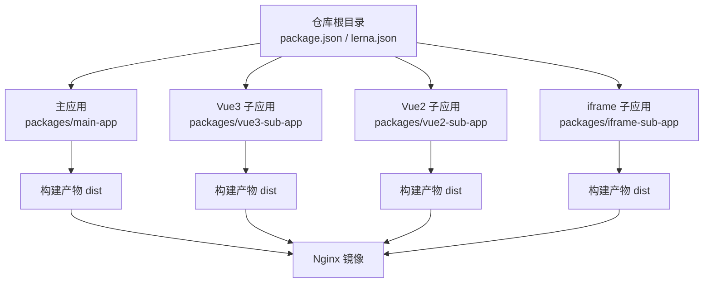
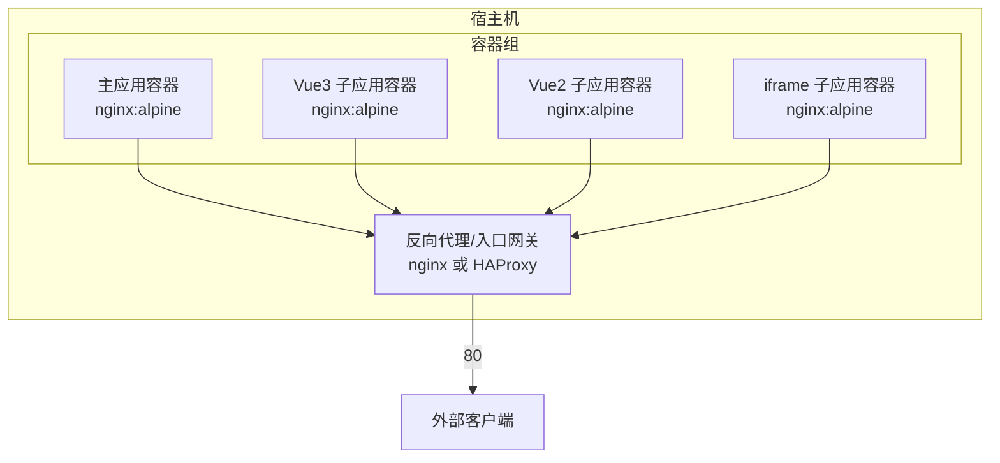
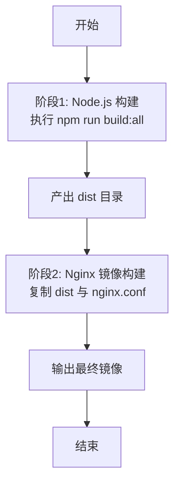
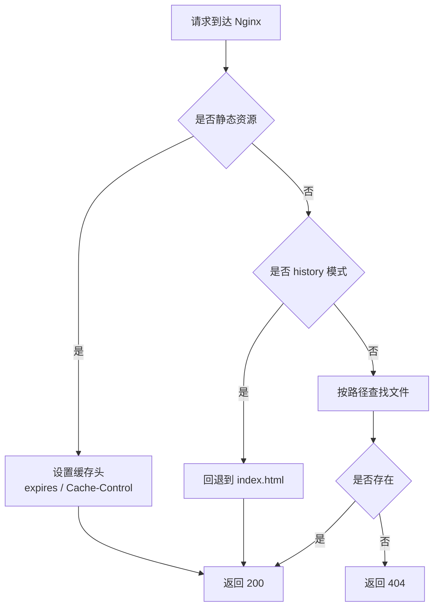
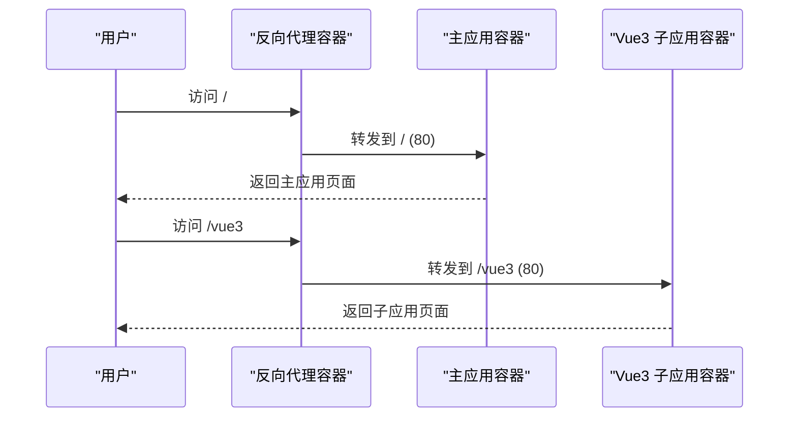
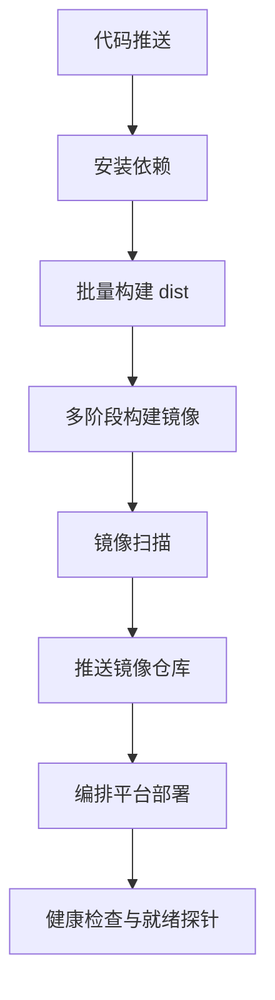
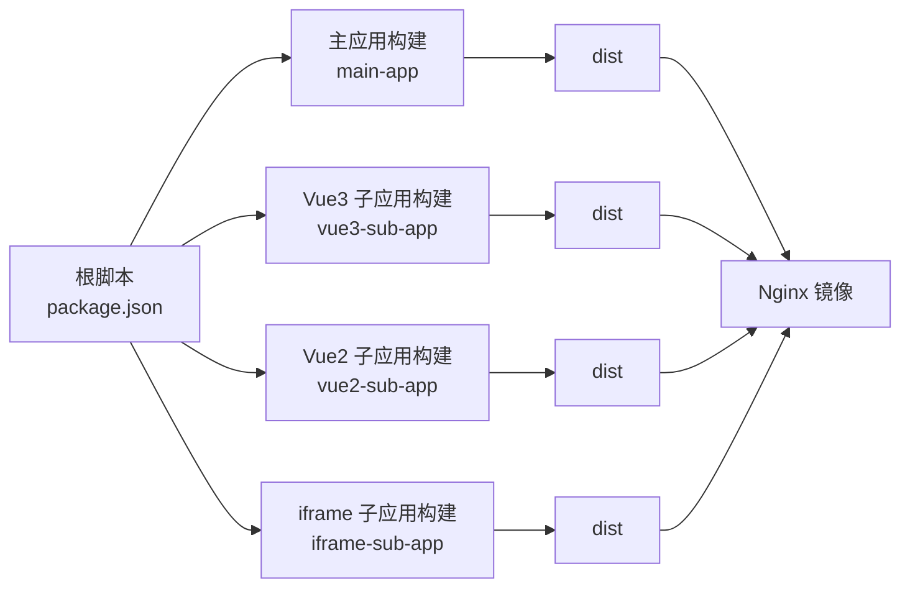

# Docker 部署

<cite>
**本文引用的文件**
- [README.md](file://README.md)
- [package.json](file://package.json)
- [lerna.json](file://lerna.json)
- [user-docs/guide/deployment.md](file://user-docs/guide/deployment.md)
- [packages/main-app/package.json](file://packages/main-app/package.json)
- [packages/main-app/vite.config.js](file://packages/main-app/vite.config.js)
- [packages/vue3-sub-app/package.json](file://packages/vue3-sub-app/package.json)
- [packages/vue3-sub-app/vite.config.js](file://packages/vue3-sub-app/vite.config.js)
- [packages/vue2-sub-app/package.json](file://packages/vue2-sub-app/package.json)
- [packages/vue2-sub-app/vue.config.js](file://packages/vue2-sub-app/vue.config.js)
- [packages/iframe-sub-app/package.json](file://packages/iframe-sub-app/package.json)
</cite>

## 目录
1. [简介](#简介)
2. [项目结构](#项目结构)
3. [核心组件](#核心组件)
4. [架构总览](#架构总览)
5. [详细组件分析](#详细组件分析)
6. [依赖关系分析](#依赖关系分析)
7. [性能考虑](#性能考虑)
8. [故障排查指南](#故障排查指南)
9. [结论](#结论)
10. [附录](#附录)

## 简介
本文件面向在生产环境中使用 Docker 进行容器化部署的团队，结合仓库现有构建与运行配置，提供从 Dockerfile 编写、Nginx 镜像优化、多阶段构建策略，到容器网络、端口映射、环境变量、docker-compose 编排、监控与日志、健康检查以及 CI/CD 自动化集成的完整实践指南。  
项目为微前端 Monorepo，包含主应用与多类子应用，均通过 Vite/Vue CLI 构建产物输出静态资源，推荐使用 Nginx 提供静态文件服务。

## 项目结构
- 顶层使用 Lerna 管理工作区，包含主应用与多个子应用包，统一的 npm scripts 负责开发与构建。
- 各应用独立的构建配置（Vite/Vue CLI）输出 dist 目录，作为容器内 Nginx 的静态根目录。
- 用户文档提供了 Nginx 部署与 Dockerfile 示例，便于直接落地。

**图示来源**
- [package.json](file://package.json#L10-L26)
- [lerna.json](file://lerna.json#L5-L7)
- [packages/main-app/package.json](file://packages/main-app/package.json#L6-L10)
- [packages/vue3-sub-app/package.json](file://packages/vue3-sub-app/package.json#L6-L10)
- [packages/vue2-sub-app/package.json](file://packages/vue2-sub-app/package.json#L6-L9)
- [packages/iframe-sub-app/package.json](file://packages/iframe-sub-app/package.json#L6-L9)

**章节来源**
- [README.md](file://README.md#L62-L76)
- [package.json](file://package.json#L6-L9)
- [lerna.json](file://lerna.json#L5-L7)

## 核心组件
- 构建与产物
  - 主应用与子应用均通过各自构建工具生成 dist 目录，作为静态站点发布。
  - 构建脚本由根目录统一调度，便于批量构建与 CI 执行。
- Nginx 静态服务
  - 使用 Nginx 提供静态文件服务，支持历史模式路由回退、静态资源缓存与 CORS。
  - 文档提供了针对主应用与子应用的 Nginx 配置示例，可直接复用。
- Docker 镜像
  - 文档提供了基于 Nginx 的最小 Dockerfile 示例，建议在此基础上进行多阶段优化与安全加固。

**章节来源**
- [package.json](file://package.json#L10-L26)
- [packages/main-app/package.json](file://packages/main-app/package.json#L6-L10)
- [packages/vue3-sub-app/package.json](file://packages/vue3-sub-app/package.json#L6-L10)
- [packages/vue2-sub-app/package.json](file://packages/vue2-sub-app/package.json#L6-L9)
- [packages/iframe-sub-app/package.json](file://packages/iframe-sub-app/package.json#L6-L9)
- [user-docs/guide/deployment.md](file://user-docs/guide/deployment.md#L132-L144)

## 架构总览
下图展示了容器化部署的整体架构：每个应用构建产物进入 Nginx 镜像，容器对外暴露 80 端口；通过 docker-compose 可编排多个应用服务，实现统一入口与反向代理。

**图示来源**
- [user-docs/guide/deployment.md](file://user-docs/guide/deployment.md#L20-L65)
- [user-docs/guide/deployment.md](file://user-docs/guide/deployment.md#L132-L144)

## 详细组件分析

### Dockerfile 编写与多阶段构建
- 基础镜像选择
  - 推荐使用官方 Nginx Alpine 镜像，体积小、安全基线完善。
- 构建步骤
  - 将各应用 dist 目录复制到 Nginx 静态根目录。
  - 复制自定义 Nginx 配置覆盖默认配置。
  - 暴露 80 端口，前台运行 Nginx。
- 多阶段构建建议
  - 第一阶段：使用 Node.js 构建各应用，输出 dist。
  - 第二阶段：仅拷贝 dist 到 Nginx 镜像，不包含构建工具链，降低攻击面。
  - 可引入只读文件系统、非 root 用户、最小权限等安全加固。
- 镜像优化策略
  - 合理分层，避免重复层；将变化频率低的层放在前面。
  - 使用 .dockerignore 排除 node_modules、.git 等无关内容。
  - 启用 gzip/br 压缩与静态资源缓存头，减少带宽与延迟。

**图示来源**
- [package.json](file://package.json#L16-L20)
- [user-docs/guide/deployment.md](file://user-docs/guide/deployment.md#L132-L144)

**章节来源**
- [user-docs/guide/deployment.md](file://user-docs/guide/deployment.md#L132-L144)

### Nginx 配置与静态资源优化
- 主应用与子应用分别提供 Nginx 配置示例，涵盖：
  - 监听 80 端口、根目录指向 dist、history 模式回退。
  - 静态资源缓存与 immutable 头部，提升缓存命中率。
  - CORS 头配置，确保跨域访问与预检缓存。
- 配置要点
  - 根据实际域名替换 server_name。
  - 静态资源路径与构建配置一致，避免 404。
  - 生产环境建议开启 gzip/br 压缩与缓存控制。

**图示来源**
- [user-docs/guide/deployment.md](file://user-docs/guide/deployment.md#L24-L42)
- [user-docs/guide/deployment.md](file://user-docs/guide/deployment.md#L47-L65)

**章节来源**
- [user-docs/guide/deployment.md](file://user-docs/guide/deployment.md#L20-L86)

### 容器网络、端口映射与环境变量
- 端口映射
  - 容器内统一监听 80，宿主机可根据需要映射到不同端口或通过反向代理统一入口。
- 网络配置
  - 建议使用自定义桥接网络，便于容器间通信与服务发现。
- 环境变量
  - 可通过环境变量控制构建目标（如 NODE_ENV）、CORS 允许源、静态资源前缀等。
  - 在 Nginx 中可通过 env 注入或 conf.d 动态配置实现差异化部署。

**章节来源**
- [user-docs/guide/deployment.md](file://user-docs/guide/deployment.md#L67-L86)
- [packages/main-app/vite.config.js](file://packages/main-app/vite.config.js#L26-L38)
- [packages/vue3-sub-app/vite.config.js](file://packages/vue3-sub-app/vite.config.js#L33-L39)
- [packages/vue2-sub-app/vue.config.js](file://packages/vue2-sub-app/vue.config.js#L6-L12)

### docker-compose 编排方案
- 组件拆分
  - 每个应用独立容器，共享同一反向代理入口。
  - 反向代理负责根据路径或域名转发到对应容器。
- 关键配置点
  - 网络：自定义桥接网络，便于容器互通与 DNS 解析。
  - 挂载：将各应用 dist 目录挂载到容器静态根目录，或在构建阶段复制。
  - 健康检查：对 Nginx 添加健康检查，探测 80 端口与首页可达性。
  - 日志：将容器标准输出重定向至宿主机日志系统，或使用集中式日志采集。

**图示来源**
- [user-docs/guide/deployment.md](file://user-docs/guide/deployment.md#L20-L65)

**章节来源**
- [user-docs/guide/deployment.md](file://user-docs/guide/deployment.md#L20-L65)

### 容器监控、日志管理与健康检查
- 健康检查
  - 在 Nginx 容器中添加健康检查，探测 80 端口与首页返回码。
- 日志
  - Nginx access/error 日志输出到标准输出，便于容器日志收集。
  - 可结合集中式日志系统（如 ELK/Fluentd/Loki）采集与分析。
- 监控
  - 指标：请求量、响应时间、错误率、缓存命中率。
  - 告警：基于阈值触发，结合容器编排平台的自动扩缩容。

**章节来源**
- [user-docs/guide/deployment.md](file://user-docs/guide/deployment.md#L20-L65)

### CI/CD 流水线中的 Docker 集成
- 触发条件
  - 代码合并到主分支后触发流水线。
- 步骤建议
  - 依赖安装：使用缓存的依赖层加速构建。
  - 构建：执行批量构建脚本，产出 dist。
  - 镜像构建：多阶段构建，复制 dist 到 Nginx 镜像。
  - 扫描：镜像安全扫描（如 Trivy/Snyk）。
  - 推送：推送到镜像仓库（私有/公有）。
  - 部署：通过编排平台拉起新版本，滚动更新。
- 版本与标签
  - 使用语义化版本或提交哈希作为镜像标签，便于回滚与追踪。

**图示来源**
- [package.json](file://package.json#L16-L20)
- [user-docs/guide/deployment.md](file://user-docs/guide/deployment.md#L132-L144)

**章节来源**
- [package.json](file://package.json#L10-L26)
- [user-docs/guide/deployment.md](file://user-docs/guide/deployment.md#L132-L144)

## 依赖关系分析
- 构建依赖
  - 根脚本统一调度各应用构建，确保产物一致性。
  - 各应用构建配置决定 dist 输出结构与静态资源路径。
- 运行依赖
  - Nginx 镜像提供静态服务，依赖 dist 与 Nginx 配置。
  - docker-compose 编排容器网络与服务发现。

**图示来源**
- [package.json](file://package.json#L10-L26)
- [packages/main-app/package.json](file://packages/main-app/package.json#L6-L10)
- [packages/vue3-sub-app/package.json](file://packages/vue3-sub-app/package.json#L6-L10)
- [packages/vue2-sub-app/package.json](file://packages/vue2-sub-app/package.json#L6-L9)
- [packages/iframe-sub-app/package.json](file://packages/iframe-sub-app/package.json#L6-L9)

**章节来源**
- [package.json](file://package.json#L10-L26)
- [packages/main-app/package.json](file://packages/main-app/package.json#L6-L10)
- [packages/vue3-sub-app/package.json](file://packages/vue3-sub-app/package.json#L6-L10)
- [packages/vue2-sub-app/package.json](file://packages/vue2-sub-app/package.json#L6-L9)
- [packages/iframe-sub-app/package.json](file://packages/iframe-sub-app/package.json#L6-L9)

## 性能考虑
- 构建优化
  - 合理拆分 vendor chunk，减少首屏加载体积。
  - 关闭 Source Map（生产环境），减小产物体积。
- 静态资源优化
  - 启用长期缓存与 immutable 头，配合文件指纹。
  - 开启压缩（gzip/br），降低传输体积。
- 运行优化
  - 使用 Nginx 缓存策略与上游健康检查，提升可用性。
  - 反向代理统一入口，便于限流与 WAF 防护。

**章节来源**
- [packages/main-app/vite.config.js](file://packages/main-app/vite.config.js#L26-L38)
- [packages/vue3-sub-app/vite.config.js](file://packages/vue3-sub-app/vite.config.js#L33-L39)
- [packages/vue2-sub-app/vue.config.js](file://packages/vue2-sub-app/vue.config.js#L6-L12)
- [user-docs/guide/deployment.md](file://user-docs/guide/deployment.md#L37-L42)

## 故障排查指南
- 404 页面
  - 检查 Nginx 根目录与 index 配置，确认 dist 结构一致。
  - 确认 history 模式回退规则生效。
- 跨域问题
  - 校验 CORS 头配置，确保允许主应用域名访问。
  - 预检请求缓存时间合理，避免浏览器缓存导致的旧策略。
- 构建路径问题
  - 子应用公共路径（base/publicPath）需与部署域名一致，避免静态资源 404。
- 健康检查失败
  - 检查容器 80 端口连通性与首页返回码。
  - 查看 Nginx 错误日志定位具体错误。

**章节来源**
- [user-docs/guide/deployment.md](file://user-docs/guide/deployment.md#L20-L86)
- [packages/main-app/vite.config.js](file://packages/main-app/vite.config.js#L26-L38)
- [packages/vue3-sub-app/vite.config.js](file://packages/vue3-sub-app/vite.config.js#L33-L39)
- [packages/vue2-sub-app/vue.config.js](file://packages/vue2-sub-app/vue.config.js#L6-L12)

## 结论
通过将各应用构建产物统一交给 Nginx 容器提供静态服务，并结合多阶段构建、镜像优化、docker-compose 编排与健康检查，可在保证性能与安全的前提下，实现稳定高效的微前端容器化部署。建议在 CI/CD 中固化上述流程，确保交付质量与可追溯性。

## 附录
- 端口与运行配置参考
  - 主应用开发端口：8080
  - Vue3 子应用开发端口：7080
  - Vue2 子应用开发端口：3000
  - iframe 子应用开发端口：4000
- 关键构建脚本
  - 批量构建：build:all
  - 单应用构建：build:main / build:vue3 / build:vue2 / build:iframe

**章节来源**
- [README.md](file://README.md#L17-L25)
- [package.json](file://package.json#L16-L20)