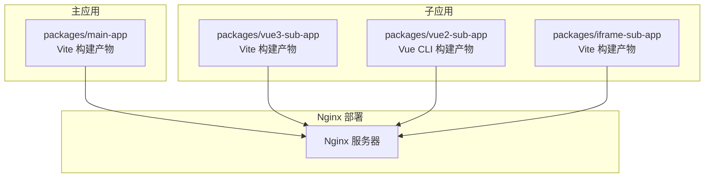
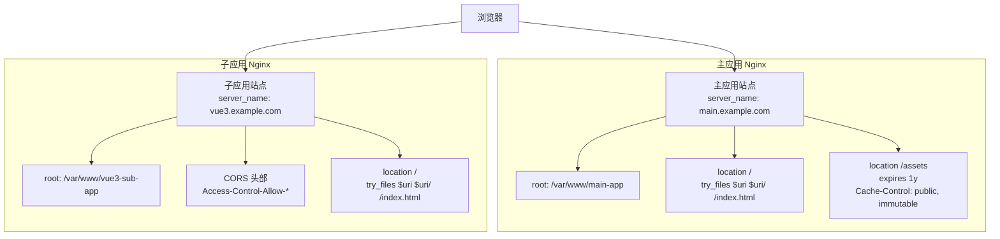
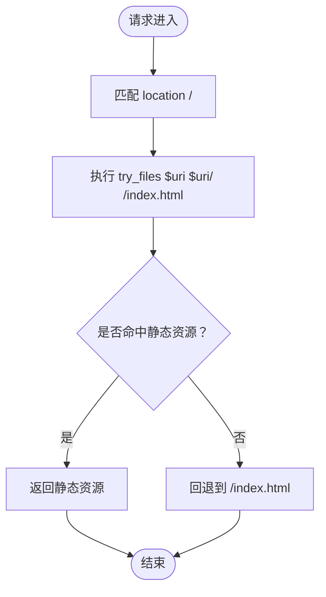
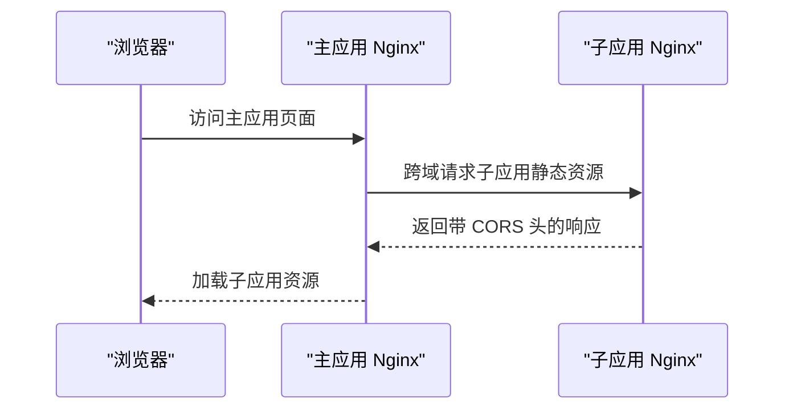
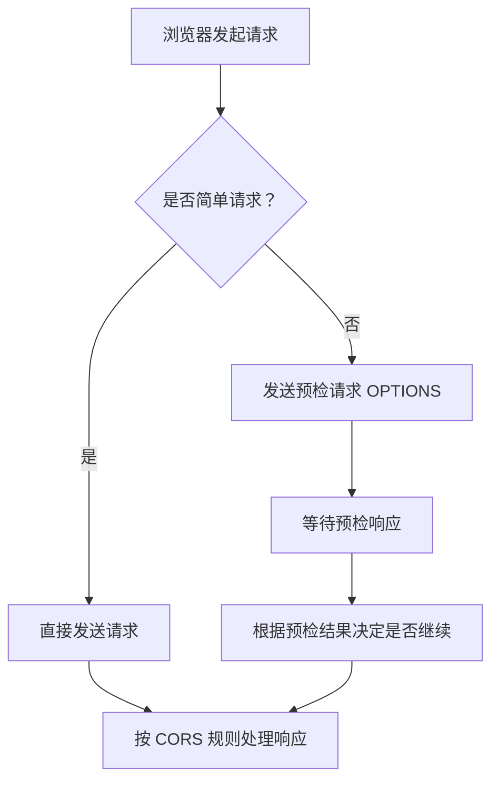
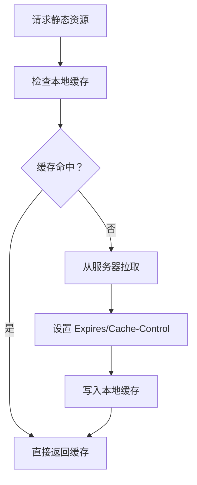
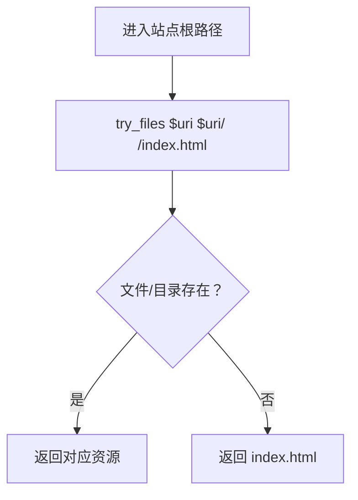
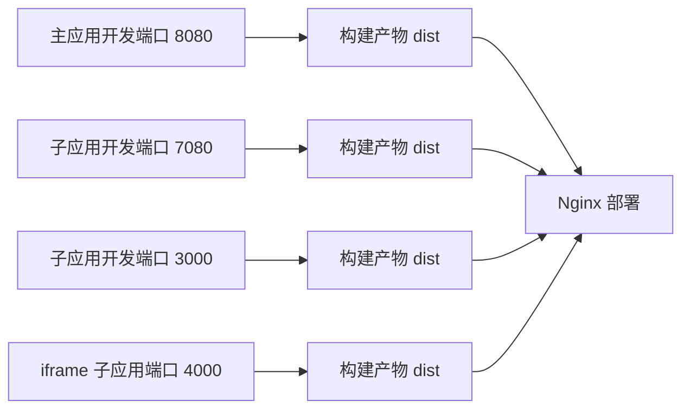

# Nginx 配置

<cite>
**本文引用的文件**
- [README.md](file://README.md)
- [package.json](file://package.json)
- [packages/main-app/vite.config.js](file://packages/main-app/vite.config.js)
- [packages/vue3-sub-app/vite.config.js](file://packages/vue3-sub-app/vite.config.js)
- [packages/vue2-sub-app/vue.config.js](file://packages/vue2-sub-app/vue.config.js)
- [user-docs/guide/deployment.md](file://user-docs/guide/deployment.md)
</cite>

## 目录
1. [简介](#简介)
2. [项目结构](#项目结构)
3. [核心组件](#核心组件)
4. [架构总览](#架构总览)
5. [详细组件分析](#详细组件分析)
6. [依赖分析](#依赖分析)
7. [性能考虑](#性能考虑)
8. [故障排查指南](#故障排查指南)
9. [结论](#结论)
10. [附录](#附录)

## 简介
本文件面向在生产环境中部署微前端系统的运维与开发人员，围绕主应用与子应用的 Nginx 服务器配置进行系统化说明。重点涵盖以下主题：
- 历史模式（history mode）的 Nginx 配置与 try_files 指令的作用
- 静态资源缓存策略：expires 与 Cache-Control 的配置要点
- CORS 配置的必要性与实现方式：允许的源、方法与头部设置
- 完整的 Nginx 配置示例与最佳实践建议

该仓库提供了主应用与多类子应用的开发端口、构建产物目录与公共路径配置，为 Nginx 部署提供了明确的依据。

**章节来源**
- [README.md](file://README.md#L1-L158)
- [package.json](file://package.json#L1-L50)

## 项目结构
本项目采用 Monorepo 架构，包含主应用与多种类型的子应用。各应用通过独立的构建配置输出静态资源，部署时由 Nginx 提供静态文件服务，并在子应用侧处理跨域访问。

**图表来源**
- [packages/main-app/vite.config.js](file://packages/main-app/vite.config.js#L26-L38)
- [packages/vue3-sub-app/vite.config.js](file://packages/vue3-sub-app/vite.config.js#L33-L39)
- [packages/vue2-sub-app/vue.config.js](file://packages/vue2-sub-app/vue.config.js#L13-L19)
- [user-docs/guide/deployment.md](file://user-docs/guide/deployment.md#L20-L65)

**章节来源**
- [README.md](file://README.md#L62-L76)
- [package.json](file://package.json#L6-L26)

## 核心组件
- 主应用（Vue3）：监听 8080 端口，构建产物输出至 dist/assets；部署时根目录指向 dist，入口为 index.html。
- Vue3 子应用：监听 7080 端口，构建产物输出至 dist/assets；部署时根目录指向 dist，入口为 index.html。
- Vue2 子应用：监听 3000 端口，构建产物输出至默认目录；部署时根目录指向构建输出目录，入口为 index.html。
- iframe 子应用：监听 4000 端口，构建产物输出至 dist/assets；部署时根目录指向 dist，入口为 index.html。
- Nginx 配置：主应用与子应用分别配置静态资源缓存、history 模式回退与 CORS 头部。

**章节来源**
- [README.md](file://README.md#L17-L25)
- [packages/main-app/vite.config.js](file://packages/main-app/vite.config.js#L26-L38)
- [packages/vue3-sub-app/vite.config.js](file://packages/vue3-sub-app/vite.config.js#L25-L32)
- [packages/vue2-sub-app/vue.config.js](file://packages/vue2-sub-app/vue.config.js#L6-L12)
- [user-docs/guide/deployment.md](file://user-docs/guide/deployment.md#L20-L65)

## 架构总览
下图展示了主应用与子应用在生产环境中的部署关系与 Nginx 的作用：

**图表来源**
- [user-docs/guide/deployment.md](file://user-docs/guide/deployment.md#L24-L43)
- [user-docs/guide/deployment.md](file://user-docs/guide/deployment.md#L47-L65)

## 详细组件分析

### 主应用 Nginx 配置
- 历史模式（history mode）：通过 location / 下的 try_files 将未命中资源的请求回退到 index.html，确保前端路由可正常工作。
- 静态资源缓存：对 /assets 路径设置一年过期与 immutable 标记，提升缓存命中率与加载性能。
- 根目录与入口：root 指向构建产物目录，index 指定入口页面。

**图表来源**
- [user-docs/guide/deployment.md](file://user-docs/guide/deployment.md#L32-L35)

**章节来源**
- [user-docs/guide/deployment.md](file://user-docs/guide/deployment.md#L22-L43)
- [packages/main-app/vite.config.js](file://packages/main-app/vite.config.js#L26-L38)

### 子应用 Nginx 配置
- CORS 配置：在子应用站点添加允许来源、方法与头部的响应头，满足主应用跨域访问子应用静态资源与接口的需求。
- 历史模式（history mode）：与主应用一致，通过 try_files 回退到 index.html。
- 静态资源缓存：建议对 /assets 路径设置长期缓存与 immutable 标记。

**图表来源**
- [user-docs/guide/deployment.md](file://user-docs/guide/deployment.md#L55-L63)
- [user-docs/guide/deployment.md](file://user-docs/guide/deployment.md#L67-L86)

**章节来源**
- [user-docs/guide/deployment.md](file://user-docs/guide/deployment.md#L45-L86)

### CORS 配置详解
- 允许的源：生产环境建议限定为具体域名，开发环境可临时允许所有源。
- 允许的方法：GET、POST、OPTIONS 等常用方法。
- 允许的头部：Content-Type、Authorization 等常见头部，必要时可扩展。
- 预检请求缓存：通过 Max-Age 减少重复预检请求。

**图表来源**
- [user-docs/guide/deployment.md](file://user-docs/guide/deployment.md#L67-L86)

**章节来源**
- [user-docs/guide/deployment.md](file://user-docs/guide/deployment.md#L67-L86)

### 静态资源缓存策略
- expires 与 Cache-Control：对静态资源目录设置长期有效与不可变标记，减少带宽消耗与服务器压力。
- 资源分组：建议将版本化的静态资源置于 /assets，便于统一缓存策略与失效控制。

**图表来源**
- [user-docs/guide/deployment.md](file://user-docs/guide/deployment.md#L37-L41)

**章节来源**
- [user-docs/guide/deployment.md](file://user-docs/guide/deployment.md#L37-L41)
- [packages/main-app/vite.config.js](file://packages/main-app/vite.config.js#L28-L28)

### 历史模式（History Mode）与 try_files
- try_files 的作用：当请求的文件或目录不存在时，将其回退到 index.html，使前端单页应用的路由在刷新或直链访问时仍能正确渲染。
- 配置位置：通常位于站点根路径 location 中，避免与静态资源路径冲突。

**图表来源**
- [user-docs/guide/deployment.md](file://user-docs/guide/deployment.md#L32-L35)

**章节来源**
- [user-docs/guide/deployment.md](file://user-docs/guide/deployment.md#L32-L35)

## 依赖分析
- 开发端口与构建产物：主应用与子应用分别在不同端口运行，构建产物目录与公共路径在各自配置文件中定义，部署时需与 Nginx 的 root 与 index 对齐。
- 跨域关系：主应用通过 Nginx 访问子应用，子应用需开启 CORS 以便主应用读取其静态资源与接口。
- Docker 部署：可通过容器镜像复制构建产物与 Nginx 配置文件的方式进行部署。

**图表来源**
- [README.md](file://README.md#L17-L25)
- [packages/main-app/vite.config.js](file://packages/main-app/vite.config.js#L26-L38)
- [packages/vue3-sub-app/vite.config.js](file://packages/vue3-sub-app/vite.config.js#L33-L39)
- [packages/vue2-sub-app/vue.config.js](file://packages/vue2-sub-app/vue.config.js#L13-L19)
- [user-docs/guide/deployment.md](file://user-docs/guide/deployment.md#L132-L144)

**章节来源**
- [README.md](file://README.md#L17-L25)
- [package.json](file://package.json#L10-L26)
- [user-docs/guide/deployment.md](file://user-docs/guide/deployment.md#L132-L144)

## 性能考虑
- 静态资源缓存：对 /assets 设置一年有效期与 immutable 标记，显著降低重复请求与带宽消耗。
- CDN 与边缘缓存：结合 CDN 可进一步提升全球访问速度与稳定性。
- Gzip/Br 压缩：启用压缩可减少传输体积，建议在 Nginx 层开启。
- 预热与预加载：对热点资源进行预热，优化首屏加载体验。
- 日志与监控：记录访问日志与错误日志，配合监控指标评估缓存命中率与性能表现。

[本节为通用性能建议，不直接分析具体文件]

## 故障排查指南
- 刷新页面 404：确认主应用与子应用的 location / 下已配置 try_files 回退到 index.html。
- 跨域失败：检查子应用 CORS 头部是否正确设置，允许的源、方法与头部是否覆盖实际请求场景。
- 静态资源无法加载：核对 Nginx root 与构建产物目录一致，且 /assets 路径下的缓存头设置合理。
- Docker 部署异常：确认容器内复制了正确的构建产物与 Nginx 配置文件，端口映射与暴露符合预期。

**章节来源**
- [user-docs/guide/deployment.md](file://user-docs/guide/deployment.md#L20-L86)

## 结论
通过在主应用与子应用分别配置 history 模式的回退、静态资源缓存与 CORS 头部，可稳定支撑微前端在生产环境中的访问与加载。结合构建产物目录与公共路径的约定，配合 Nginx 的 root、index 与 location 配置，即可实现高性能、可维护的部署方案。

[本节为总结性内容，不直接分析具体文件]

## 附录
- 完整示例与最佳实践
  - 主应用 Nginx 示例：参见部署文档中的主应用配置片段。
  - 子应用 Nginx 示例：参见部署文档中的子应用配置片段。
  - CORS 最佳实践：限定允许源、最小化允许方法与头部集合、合理设置预检缓存时间。
  - Docker 部署：参考部署文档中的 Dockerfile 片段，确保复制构建产物与 Nginx 配置文件。

**章节来源**
- [user-docs/guide/deployment.md](file://user-docs/guide/deployment.md#L20-L86)
- [user-docs/guide/deployment.md](file://user-docs/guide/deployment.md#L132-L144)