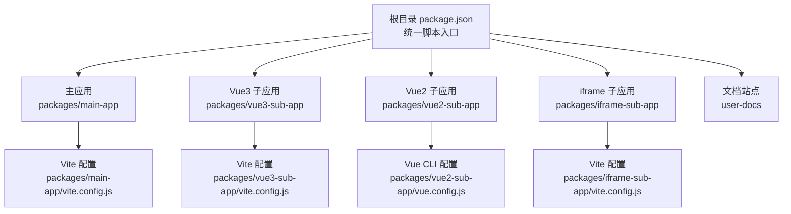
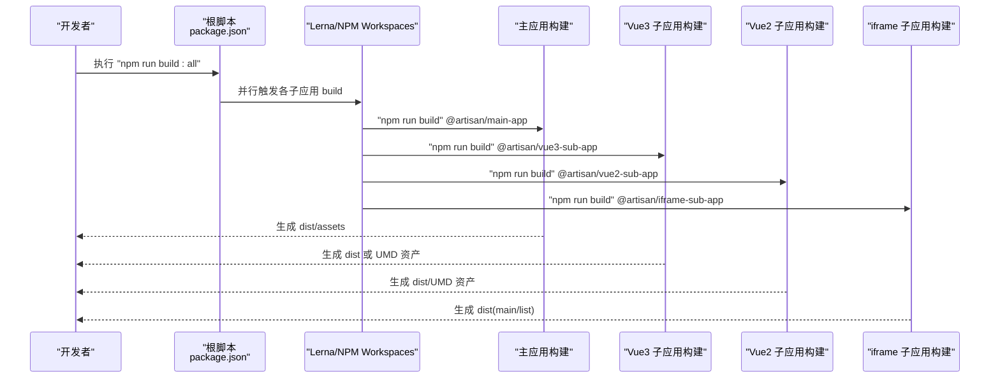
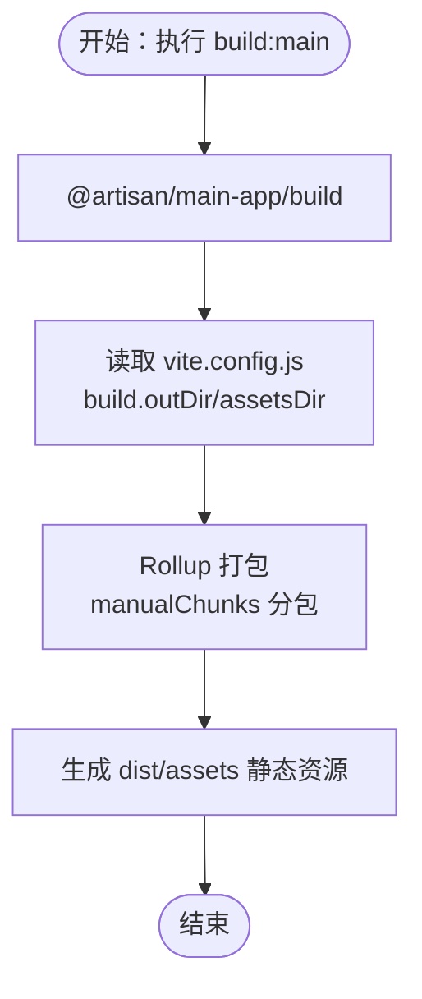
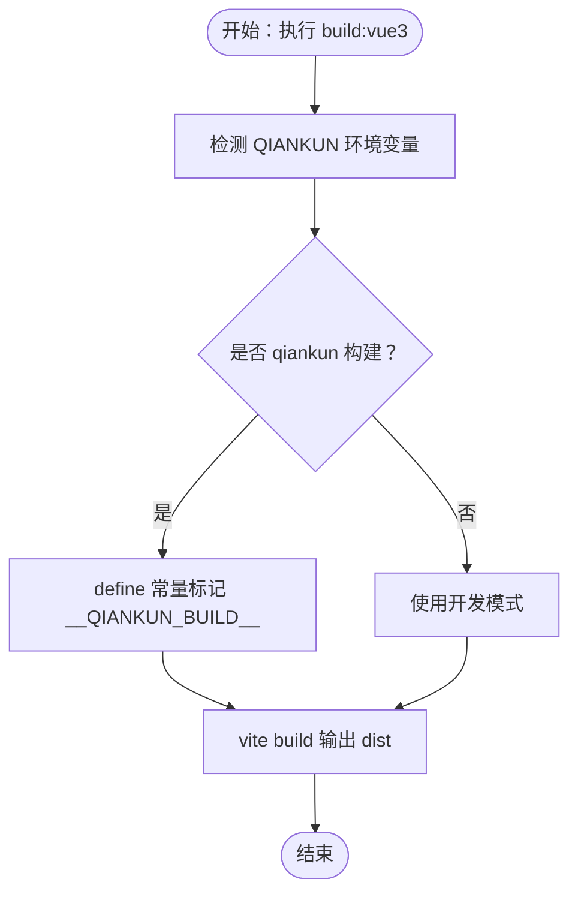
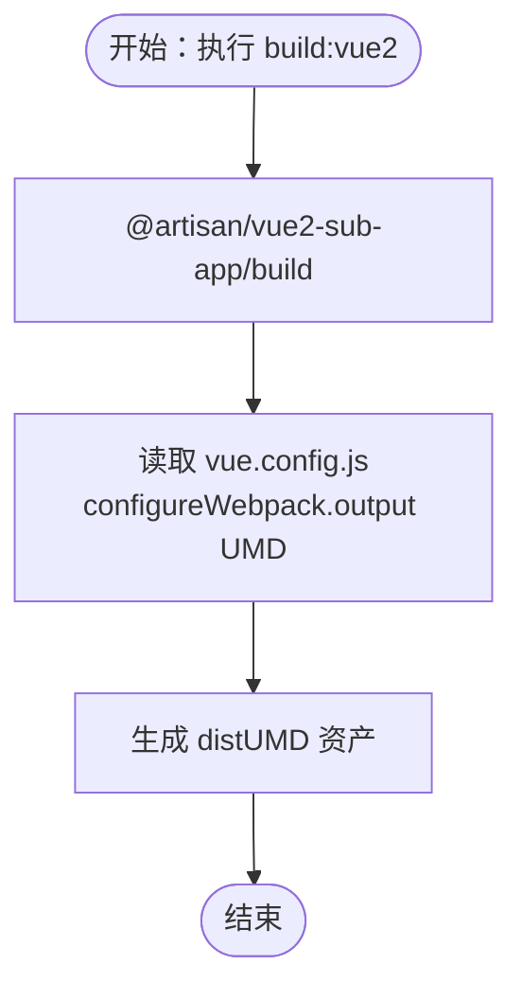
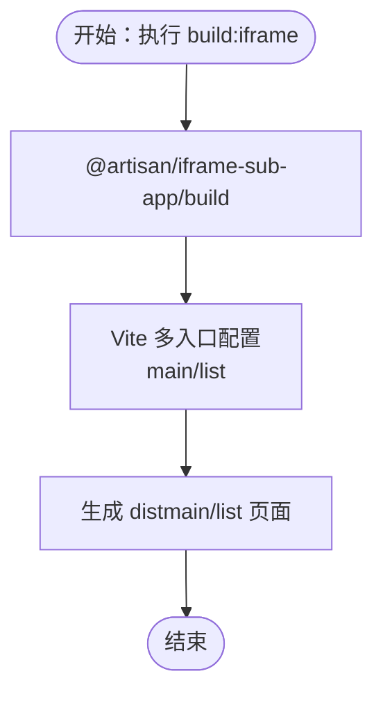
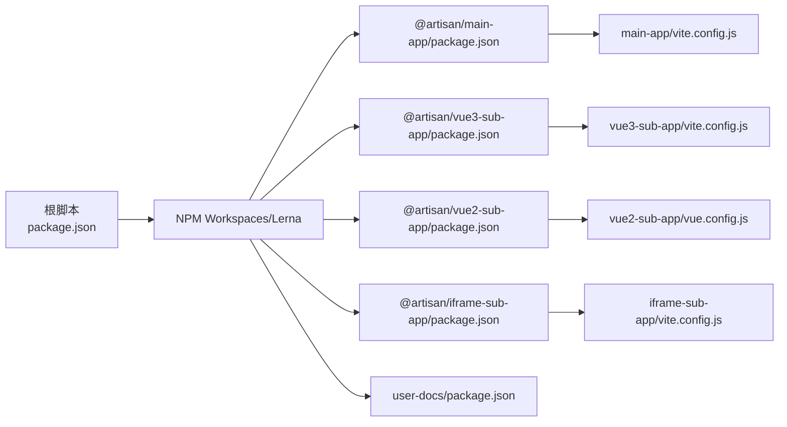

# 构建流程

<cite>
**本文引用的文件**
- [package.json](file://package.json)
- [lerna.json](file://lerna.json)
- [README.md](file://README.md)
- [packages/main-app/vite.config.js](file://packages/main-app/vite.config.js)
- [packages/vue3-sub-app/vite.config.js](file://packages/vue3-sub-app/vite.config.js)
- [packages/iframe-sub-app/vite.config.js](file://packages/iframe-sub-app/vite.config.js)
- [packages/vue2-sub-app/vue.config.js](file://packages/vue2-sub-app/vue.config.js)
- [packages/main-app/package.json](file://packages/main-app/package.json)
- [packages/vue3-sub-app/package.json](file://packages/vue3-sub-app/package.json)
- [packages/vue2-sub-app/package.json](file://packages/vue2-sub-app/package.json)
- [packages/iframe-sub-app/package.json](file://packages/iframe-sub-app/package.json)
- [user-docs/package.json](file://user-docs/package.json)
</cite>

## 目录
1. [简介](#简介)
2. [项目结构](#项目结构)
3. [核心组件](#核心组件)
4. [架构总览](#架构总览)
5. [详细组件分析](#详细组件分析)
6. [依赖分析](#依赖分析)
7. [性能考虑](#性能考虑)
8. [故障排查指南](#故障排查指南)
9. [结论](#结论)
10. [附录](#附录)

## 简介
本文件面向使用 npm 脚本构建整个微前端项目的用户，系统说明如何通过统一的 npm scripts 触发各子应用的构建，并解释构建输出目录结构、产物文件类型与命名规则。同时提供构建优化配置项（如代码压缩、资源打包、分包策略）与版本号管理建议，以及常见构建失败原因与性能优化最佳实践。

## 项目结构
该项目采用 monorepo 架构，使用 Lerna 管理工作区，根目录的 npm scripts 统一调度各子应用的开发与构建任务。主要模块如下：
- 主应用：packages/main-app（Vite + Vue3）
- Vue3 子应用：packages/vue3-sub-app（Vite + qiankun 插件）
- Vue2 子应用：packages/vue2-sub-app（Vue CLI + UMD 输出）
- iframe 子应用：packages/iframe-sub-app（Vite + 多入口）
- 文档站点：user-docs（VitePress）

图表来源
- [package.json](file://package.json#L10-L26)
- [packages/main-app/vite.config.js](file://packages/main-app/vite.config.js#L1-L40)
- [packages/vue3-sub-app/vite.config.js](file://packages/vue3-sub-app/vite.config.js#L1-L41)
- [packages/vue2-sub-app/vue.config.js](file://packages/vue2-sub-app/vue.config.js#L1-L21)
- [packages/iframe-sub-app/vite.config.js](file://packages/iframe-sub-app/vite.config.js#L1-L23)

章节来源
- [package.json](file://package.json#L6-L9)
- [lerna.json](file://lerna.json#L5-L8)
- [README.md](file://README.md#L62-L76)

## 核心组件
- 根脚本与工作区
  - 根 package.json 提供统一的构建脚本入口，使用 npm workspaces 与 Lerna 并行执行各子应用构建。
  - 关键脚本：build:main、build:vue3、build:vue2、build:iframe、build:all。
- 子应用构建配置
  - 主应用：Vite 配置定义输出目录、资源目录、CSS 预处理、源码映射与 Rollup 分包策略。
  - Vue3 子应用：Vite 配置集成 qiankun 插件，支持构建时切换常量以适配独立运行或作为子应用运行。
  - Vue2 子应用：Vue CLI 配置输出为 UMD，便于在主应用中通过 qiankun 加载。
  - iframe 子应用：Vite 多入口配置，分别打包主页面与列表页面。
  - 文档站点：VitePress 脚本独立管理。

章节来源
- [package.json](file://package.json#L10-L26)
- [packages/main-app/vite.config.js](file://packages/main-app/vite.config.js#L26-L38)
- [packages/vue3-sub-app/vite.config.js](file://packages/vue3-sub-app/vite.config.js#L9-L24)
- [packages/vue2-sub-app/vue.config.js](file://packages/vue2-sub-app/vue.config.js#L13-L19)
- [packages/iframe-sub-app/vite.config.js](file://packages/iframe-sub-app/vite.config.js#L13-L21)
- [user-docs/package.json](file://user-docs/package.json#L6-L10)

## 架构总览
下图展示从根脚本到各子应用构建的调用链路与并行执行方式：

图表来源
- [package.json](file://package.json#L16-L20)
- [packages/main-app/package.json](file://packages/main-app/package.json#L6-L11)
- [packages/vue3-sub-app/package.json](file://packages/vue3-sub-app/package.json#L6-L11)
- [packages/vue2-sub-app/package.json](file://packages/vue2-sub-app/package.json#L6-L10)
- [packages/iframe-sub-app/package.json](file://packages/iframe-sub-app/package.json#L6-L10)

## 详细组件分析

### 主应用构建（Vite）
- 构建命令
  - 通过根脚本触发：npm run build:main
  - 实际调用：@artisan/main-app 的 build 脚本（vite build）
- 输出目录与产物
  - 输出目录：dist
  - 资源目录：assets
  - 产物类型：静态 HTML、JS、CSS、图片等
- 优化配置
  - 源码映射：关闭（生产环境建议开启以定位问题）
  - 分包策略：通过 Rollup manualChunks 将 element-plus、vue 生态依赖拆分为独立 vendor 包
- 开发服务器
  - 端口：8080；CORS 与自定义头已配置

图表来源
- [package.json](file://package.json#L16-L16)
- [packages/main-app/package.json](file://packages/main-app/package.json#L8-L8)
- [packages/main-app/vite.config.js](file://packages/main-app/vite.config.js#L26-L38)

章节来源
- [package.json](file://package.json#L16-L16)
- [packages/main-app/package.json](file://packages/main-app/package.json#L8-L8)
- [packages/main-app/vite.config.js](file://packages/main-app/vite.config.js#L26-L38)

### Vue3 子应用构建（Vite + qiankun）
- 构建命令
  - 通过根脚本触发：npm run build:vue3
  - 实际调用：@artisan/vue3-sub-app 的 build 脚本（vite build）
- 构建模式
  - 通过环境变量控制是否以 qiankun 构建模式运行（define 常量）
- 输出目录与产物
  - 输出目录：dist
  - 输入入口：index.html（多入口由 Vite 配置指定）
- 优化配置
  - 无额外 Rollup 分包策略，按 Vite 默认行为打包

图表来源
- [package.json](file://package.json#L17-L17)
- [packages/vue3-sub-app/package.json](file://packages/vue3-sub-app/package.json#L8-L8)
- [packages/vue3-sub-app/vite.config.js](file://packages/vue3-sub-app/vite.config.js#L6-L24)

章节来源
- [package.json](file://package.json#L17-L17)
- [packages/vue3-sub-app/package.json](file://packages/vue3-sub-app/package.json#L8-L8)
- [packages/vue3-sub-app/vite.config.js](file://packages/vue3-sub-app/vite.config.js#L6-L24)

### Vue2 子应用构建（Vue CLI + UMD）
- 构建命令
  - 通过根脚本触发：npm run build:vue2
  - 实际调用：@artisan/vue2-sub-app 的 build 脚本（vue-cli-service build）
- 输出目录与产物
  - 输出目录：dist（Vue CLI 默认）
  - UMD 输出：library 与 UMD 目标，chunkLoadingGlobal 自定义
- 优化配置
  - 未显式配置压缩与分包，遵循 Vue CLI 默认行为

图表来源
- [package.json](file://package.json#L18-L18)
- [packages/vue2-sub-app/package.json](file://packages/vue2-sub-app/package.json#L8-L8)
- [packages/vue2-sub-app/vue.config.js](file://packages/vue2-sub-app/vue.config.js#L13-L19)

章节来源
- [package.json](file://package.json#L18-L18)
- [packages/vue2-sub-app/package.json](file://packages/vue2-sub-app/package.json#L8-L8)
- [packages/vue2-sub-app/vue.config.js](file://packages/vue2-sub-app/vue.config.js#L13-L19)

### iframe 子应用构建（Vite 多入口）
- 构建命令
  - 通过根脚本触发：npm run build:iframe
  - 实际调用：@artisan/iframe-sub-app 的 build 脚本（vite build）
- 输出目录与产物
  - 输出目录：dist
  - 多入口：main（index.html）、list（list.html）
- 优化配置
  - 未显式配置压缩与分包，按 Vite 默认行为打包

图表来源
- [package.json](file://package.json#L19-L19)
- [packages/iframe-sub-app/package.json](file://packages/iframe-sub-app/package.json#L8-L8)
- [packages/iframe-sub-app/vite.config.js](file://packages/iframe-sub-app/vite.config.js#L13-L21)

章节来源
- [package.json](file://package.json#L19-L19)
- [packages/iframe-sub-app/package.json](file://packages/iframe-sub-app/package.json#L8-L8)
- [packages/iframe-sub-app/vite.config.js](file://packages/iframe-sub-app/vite.config.js#L13-L21)

### 文档站点构建（VitePress）
- 构建命令
  - 文档独立工作区，脚本位于 user-docs/package.json
  - 开发：npm run docs:dev
  - 构建：npm run docs:build
- 输出目录与产物
  - 构建产物为静态站点，部署至任意静态托管服务

章节来源
- [user-docs/package.json](file://user-docs/package.json#L6-L10)

## 依赖分析
- 工作区与脚本耦合
  - 根脚本通过 npm workspaces 调度各子应用构建，避免重复安装与并行执行。
  - Lerna 配置启用 conventional commits 与发布消息模板，便于版本管理。
- 子应用构建工具差异
  - 主应用与 Vue3 子应用使用 Vite；Vue2 子应用使用 Vue CLI；iframe 子应用使用 Vite 多入口。
- 依赖关系示意

图表来源
- [package.json](file://package.json#L6-L9)
- [lerna.json](file://lerna.json#L4-L8)
- [packages/main-app/package.json](file://packages/main-app/package.json#L1-L31)
- [packages/vue3-sub-app/package.json](file://packages/vue3-sub-app/package.json#L1-L23)
- [packages/vue2-sub-app/package.json](file://packages/vue2-sub-app/package.json#L1-L31)
- [packages/iframe-sub-app/package.json](file://packages/iframe-sub-app/package.json#L1-L15)
- [user-docs/package.json](file://user-docs/package.json#L1-L15)

章节来源
- [package.json](file://package.json#L6-L9)
- [lerna.json](file://lerna.json#L4-L8)

## 性能考虑
- 并行构建
  - 使用根脚本中的 build:all 并行触发各子应用构建，缩短整体构建时间。
- 分包与缓存
  - 主应用通过 manualChunks 将 element-plus、vue 生态拆分为独立 vendor 包，提升缓存命中率。
- 源码映射
  - 主应用默认关闭 sourcemap；生产构建可按需开启以平衡调试与体积。
- UMD 输出
  - Vue2 子应用采用 UMD 输出，利于在主应用中按需加载与缓存复用。
- 多入口
  - iframe 子应用按页面拆分入口，减少无关资源加载。

章节来源
- [package.json](file://package.json#L20-L20)
- [packages/main-app/vite.config.js](file://packages/main-app/vite.config.js#L30-L36)
- [packages/vue2-sub-app/vue.config.js](file://packages/vue2-sub-app/vue.config.js#L13-L19)
- [packages/iframe-sub-app/vite.config.js](file://packages/iframe-sub-app/vite.config.js#L15-L20)

## 故障排查指南
- 构建失败：依赖缺失或版本不兼容
  - 症状：构建报错或运行时报模块找不到
  - 排查：确认 node 版本满足要求（>=18），执行安装与引导脚本后再尝试构建
  - 参考：根 package.json 中 engines 字段与脚本
- 构建失败：端口冲突
  - 症状：开发服务器无法启动或端口被占用
  - 排查：检查各应用端口占用情况（主应用 8080、Vue3 子应用 7080、Vue2 子应用 3000、iframe 子应用 4000）
- 构建失败：qiankun 构建模式不一致
  - 症状：子应用在独立运行与作为子应用运行时行为不一致
  - 排查：确保在构建时设置正确的环境变量以匹配目标运行模式
- 构建失败：Vue2 子应用 UMD 输出异常
  - 症状：主应用加载子应用资源报错
  - 排查：确认 library 名称与 UMD 目标一致，且 chunkLoadingGlobal 未冲突
- 构建失败：iframe 子应用多入口打包错误
  - 症状：部分页面无法访问或资源缺失
  - 排查：确认 index.html 与 list.html 的路径与引用资源正确

章节来源
- [package.json](file://package.json#L32-L34)
- [README.md](file://README.md#L17-L24)
- [packages/vue3-sub-app/vite.config.js](file://packages/vue3-sub-app/vite.config.js#L6-L24)
- [packages/vue2-sub-app/vue.config.js](file://packages/vue2-sub-app/vue.config.js#L13-L19)
- [packages/iframe-sub-app/vite.config.js](file://packages/iframe-sub-app/vite.config.js#L15-L20)

## 结论
通过根脚本统一调度与 Lerna/NPM Workspaces 并行执行，本项目实现了对多子应用的高效构建管理。不同子应用采用不同的构建工具与优化策略，既保证了灵活性，也兼顾了性能与可维护性。建议在生产构建中结合源码映射、分包与缓存策略，并配合版本管理与发布流程，持续提升交付质量与效率。

## 附录
- 构建命令速查
  - 构建所有应用：npm run build:all
  - 构建主应用：npm run build:main
  - 构建 Vue3 子应用：npm run build:vue3
  - 构建 Vue2 子应用：npm run build:vue2
  - 构建 iframe 子应用：npm run build:iframe
- 输出目录与产物
  - 主应用：dist/assets（HTML、JS、CSS、图片）
  - Vue3 子应用：dist（独立运行或 qiankun 运行）
  - Vue2 子应用：dist（UMD 资产）
  - iframe 子应用：dist（main/list 页面）
- 版本号管理建议
  - 使用 Lerna 的 version 命令进行语义化版本与分支控制，配合 conventional commits 提升发布一致性

章节来源
- [package.json](file://package.json#L16-L20)
- [lerna.json](file://lerna.json#L9-L17)
- [packages/main-app/vite.config.js](file://packages/main-app/vite.config.js#L27-L28)
- [packages/vue3-sub-app/vite.config.js](file://packages/vue3-sub-app/vite.config.js#L34-L38)
- [packages/vue2-sub-app/vue.config.js](file://packages/vue2-sub-app/vue.config.js#L14-L18)
- [packages/iframe-sub-app/vite.config.js](file://packages/iframe-sub-app/vite.config.js#L14-L20)