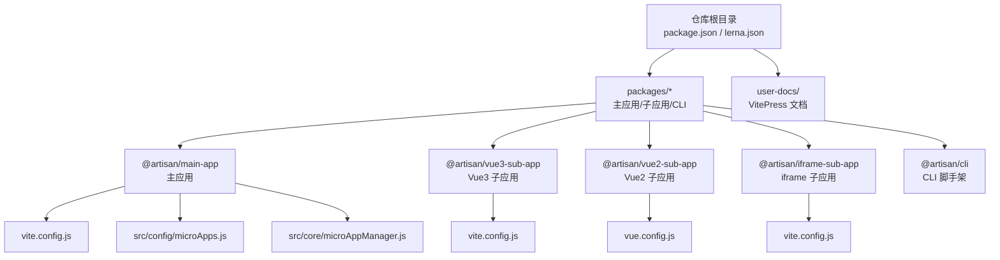
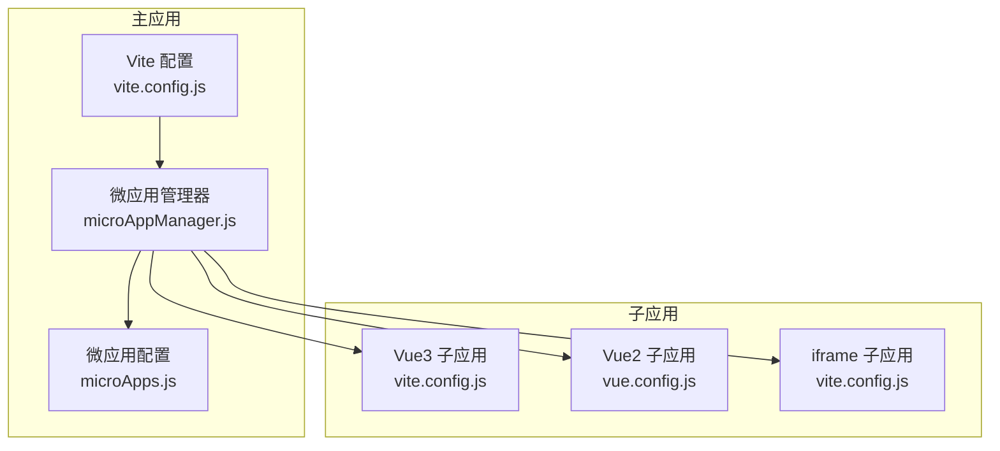
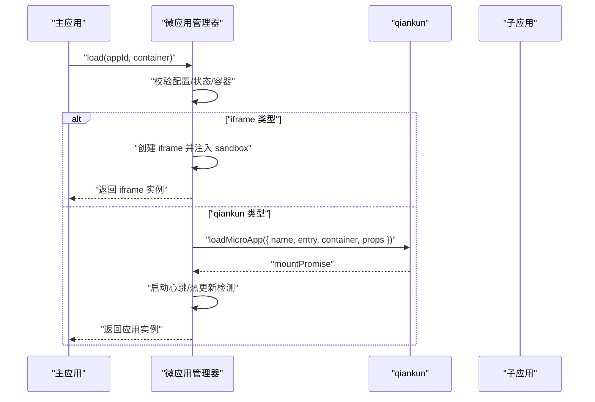
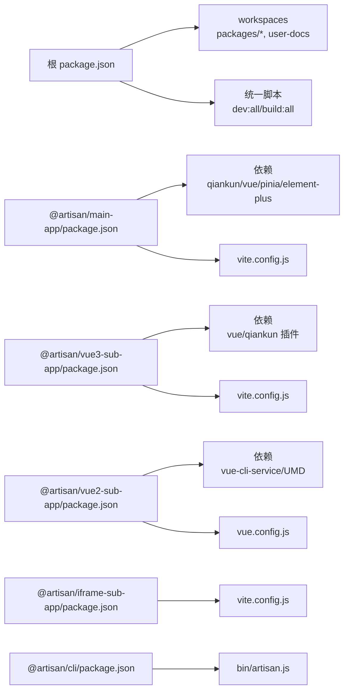

# 部署指南

<cite>
**本文引用的文件**
- [README.md](file://README.md)
- [package.json](file://package.json)
- [lerna.json](file://lerna.json)
- [packages/main-app/package.json](file://packages/main-app/package.json)
- [packages/main-app/vite.config.js](file://packages/main-app/vite.config.js)
- [packages/main-app/src/config/microApps.js](file://packages/main-app/src/config/microApps.js)
- [packages/main-app/src/core/microAppManager.js](file://packages/main-app/src/core/microAppManager.js)
- [packages/vue3-sub-app/package.json](file://packages/vue3-sub-app/package.json)
- [packages/vue3-sub-app/vite.config.js](file://packages/vue3-sub-app/vite.config.js)
- [packages/vue2-sub-app/package.json](file://packages/vue2-sub-app/package.json)
- [packages/vue2-sub-app/vue.config.js](file://packages/vue2-sub-app/vue.config.js)
- [packages/iframe-sub-app/package.json](file://packages/iframe-sub-app/package.json)
- [packages/iframe-sub-app/vite.config.js](file://packages/iframe-sub-app/vite.config.js)
- [packages/cli/package.json](file://packages/cli/package.json)
- [user-docs/guide/deployment.md](file://user-docs/guide/deployment.md)
</cite>

## 目录
1. [简介](#简介)
2. [项目结构](#项目结构)
3. [核心组件](#核心组件)
4. [架构总览](#架构总览)
5. [详细组件分析](#详细组件分析)
6. [依赖关系分析](#依赖关系分析)
7. [性能考虑](#性能考虑)
8. [故障排查指南](#故障排查指南)
9. [结论](#结论)
10. [附录](#附录)

## 简介
本指南面向运维与开发团队，提供从开发环境到生产环境的完整部署流程，覆盖以下要点：
- 开发环境搭建、依赖安装与本地调试配置
- 生产环境构建优化、资源打包与静态文件部署
- 多应用部署策略、域名配置与反向代理设置
- Docker 容器化部署方案、CI/CD 集成与自动化部署流程
- 性能优化建议、缓存策略与监控配置

## 项目结构
该项目采用 Monorepo 架构，使用 Lerna + npm workspaces 管理多包，包含主应用与多种类型子应用示例，并提供 CLI 脚手架工具与文档站点。

图表来源
- [package.json](file://package.json#L6-L9)
- [lerna.json](file://lerna.json#L5-L8)
- [packages/main-app/vite.config.js](file://packages/main-app/vite.config.js#L1-L40)
- [packages/main-app/src/config/microApps.js](file://packages/main-app/src/config/microApps.js#L1-L110)
- [packages/main-app/src/core/microAppManager.js](file://packages/main-app/src/core/microAppManager.js#L1-L515)
- [packages/vue3-sub-app/vite.config.js](file://packages/vue3-sub-app/vite.config.js#L1-L41)
- [packages/vue2-sub-app/vue.config.js](file://packages/vue2-sub-app/vue.config.js#L1-L21)
- [packages/iframe-sub-app/vite.config.js](file://packages/iframe-sub-app/vite.config.js#L1-L23)

章节来源
- [README.md](file://README.md#L62-L76)
- [package.json](file://package.json#L6-L9)
- [lerna.json](file://lerna.json#L5-L8)

## 核心组件
- 主应用（@artisan/main-app）：基于 Vite + Vue3 + qiankun，负责微应用编排、路由与状态管理。
- 子应用（@artisan/vue3-sub-app / @artisan/vue2-sub-app / @artisan/iframe-sub-app）：分别演示不同技术栈与加载方式。
- CLI（@artisan/cli）：快速生成主应用与各类子应用骨架。
- 文档（user-docs）：基于 VitePress 的文档站点，包含部署指南等。

章节来源
- [packages/main-app/package.json](file://packages/main-app/package.json#L1-L31)
- [packages/vue3-sub-app/package.json](file://packages/vue3-sub-app/package.json#L1-L23)
- [packages/vue2-sub-app/package.json](file://packages/vue2-sub-app/package.json#L1-L31)
- [packages/iframe-sub-app/package.json](file://packages/iframe-sub-app/package.json#L1-L15)
- [packages/cli/package.json](file://packages/cli/package.json#L1-L32)

## 架构总览
微前端整体由主应用统一调度，通过 qiankun 加载 Vue3/Vue2 子应用，iframe 子应用以 iframe 方式嵌入；各应用独立构建与部署，通过域名或端口区分。

图表来源
- [packages/main-app/src/config/microApps.js](file://packages/main-app/src/config/microApps.js#L1-L110)
- [packages/main-app/src/core/microAppManager.js](file://packages/main-app/src/core/microAppManager.js#L1-L515)
- [packages/main-app/vite.config.js](file://packages/main-app/vite.config.js#L1-L40)
- [packages/vue3-sub-app/vite.config.js](file://packages/vue3-sub-app/vite.config.js#L1-L41)
- [packages/vue2-sub-app/vue.config.js](file://packages/vue2-sub-app/vue.config.js#L1-L21)
- [packages/iframe-sub-app/vite.config.js](file://packages/iframe-sub-app/vite.config.js#L1-L23)

## 详细组件分析

### 开发环境搭建与本地调试
- 依赖安装
  - 使用 npm workspaces 与 Lerna 管理 monorepo，先安装根依赖，再执行工作区引导。
  - 参考命令与脚本定义见根目录与各包 package.json。
- 端口与服务
  - 主应用：Vite 监听 8080 端口，开启 CORS 与自定义 SCSS 变量注入。
  - Vue3 子应用：Vite 监听 7080 端口，启用 qiankun 插件（开发模式）。
  - Vue2 子应用：@vue/cli-service 监听 3000 端口，UMD 输出配置。
  - iframe 子应用：Vite 监听 4000 端口，多入口构建。
- 启动方式
  - 启动全部应用：并行启动主应用与各子应用。
  - 单独启动：按需启动主应用或特定子应用。
- 调试要点
  - 主应用与子应用均开启 CORS，便于跨域加载。
  - 子应用通过 UMD 输出适配 qiankun 加载。
  - iframe 子应用通过 iframe 容器加载，注意沙箱与初始化消息。

章节来源
- [README.md](file://README.md#L17-L54)
- [package.json](file://package.json#L10-L26)
- [packages/main-app/vite.config.js](file://packages/main-app/vite.config.js#L12-L18)
- [packages/vue3-sub-app/vite.config.js](file://packages/vue3-sub-app/vite.config.js#L6-L14)
- [packages/vue2-sub-app/vue.config.js](file://packages/vue2-sub-app/vue.config.js#L7-L12)
- [packages/iframe-sub-app/vite.config.js](file://packages/iframe-sub-app/vite.config.js#L6-L12)

### 生产环境构建与静态资源部署
- 构建命令
  - 根脚本提供 build:all 与按包构建，确保各应用产物输出至 dist。
- 资源打包与分包
  - 主应用使用 Rollup manualChunks 将 element-plus 与 Vue 生态拆分为独立 vendor 包，提升缓存命中率。
- 静态资源路径
  - 子应用需根据部署域名设置公共路径（publicPath/base），以保证静态资源正确加载。
- Nginx 配置要点
  - 主应用与子应用分别提供 Nginx 示例，包含 history 模式回退、静态资源缓存与 CORS 头设置。
  - 子应用需允许主应用域名访问，避免跨域限制导致加载失败。

章节来源
- [README.md](file://README.md#L56-L60)
- [package.json](file://package.json#L16-L20)
- [packages/main-app/vite.config.js](file://packages/main-app/vite.config.js#L26-L38)
- [user-docs/guide/deployment.md](file://user-docs/guide/deployment.md#L3-L18)
- [user-docs/guide/deployment.md](file://user-docs/guide/deployment.md#L20-L65)
- [user-docs/guide/deployment.md](file://user-docs/guide/deployment.md#L88-L112)

### 多应用部署策略、域名与反向代理
- 域名与入口
  - 主应用与子应用分别配置独立域名或端口，主应用通过微应用配置指向子应用入口。
- 反向代理
  - Nginx 示例展示了如何为不同应用设置 server 与 location 规则，包括 history 模式与静态资源缓存。
- CORS 配置
  - 子应用需添加 Access-Control-Allow-Origin 等响应头，允许主应用跨域访问。
- 生产环境微应用配置
  - 根据 NODE_ENV 动态切换子应用入口（生产使用域名，开发使用本地端口）。

章节来源
- [packages/main-app/src/config/microApps.js](file://packages/main-app/src/config/microApps.js#L1-L69)
- [user-docs/guide/deployment.md](file://user-docs/guide/deployment.md#L114-L130)
- [user-docs/guide/deployment.md](file://user-docs/guide/deployment.md#L67-L86)

### Docker 容器化部署与 CI/CD
- Dockerfile
  - 基于 nginx:alpine，复制构建产物与 Nginx 配置，暴露 80 端口并以前台运行。
- CI/CD 建议
  - 构建阶段：在 CI 中执行安装依赖与构建命令，产出 dist 目录。
  - 部署阶段：将 dist 与 Nginx 配置打包为镜像，或直接将 dist 部署到静态托管。
  - 自动化：结合版本发布与镜像推送，实现一键部署。

章节来源
- [user-docs/guide/deployment.md](file://user-docs/guide/deployment.md#L132-L145)

### 微应用管理与生命周期
- 加载与卸载
  - 支持按 appId 加载/卸载，避免重复加载；iframe 类型走专用加载器。
- 心跳检测与健康检查
  - 定期检测 qiankun 应用状态与 iframe PING/PONG，异常时标记为不健康并记录错误。
- 预加载与热更新
  - 对非 iframe 应用进行预加载；通过 HEAD 请求 last-modified 实现热更新检测与自动刷新。
- 样式隔离与清理
  - 启用实验性样式隔离，卸载时清理 qiankun 注入的样式标签，避免样式污染。

图表来源
- [packages/main-app/src/core/microAppManager.js](file://packages/main-app/src/core/microAppManager.js#L49-L165)
- [packages/main-app/src/core/microAppManager.js](file://packages/main-app/src/core/microAppManager.js#L173-L232)

章节来源
- [packages/main-app/src/core/microAppManager.js](file://packages/main-app/src/core/microAppManager.js#L1-L515)

### 子应用配置与类型差异
- Vue3 子应用
  - 使用 vite-plugin-qiankun 插件，开发模式下可切换 qiankun 开关；构建时按 index.html 作为入口。
- Vue2 子应用
  - 通过 @vue/cli-service 构建，UMD 输出，library 名称与全局变量需与 qiankun 注册一致。
- iframe 子应用
  - 多入口构建，iframe 加载时支持沙箱与初始化消息传递。

章节来源
- [packages/vue3-sub-app/vite.config.js](file://packages/vue3-sub-app/vite.config.js#L6-L24)
- [packages/vue2-sub-app/vue.config.js](file://packages/vue2-sub-app/vue.config.js#L13-L19)
- [packages/iframe-sub-app/vite.config.js](file://packages/iframe-sub-app/vite.config.js#L13-L21)

## 依赖关系分析
- 根层
  - package.json 定义 workspaces 与统一脚本，lerna.json 配置发布与忽略规则。
- 主应用
  - 依赖 qiankun、Vue3、Pinia、Element Plus 等，Vite 配置包含别名、SCSS 变量注入与分包策略。
- 子应用
  - Vue3 子应用依赖 vite-plugin-qiankun；Vue2 子应用依赖 @vue/cli-service 并配置 UMD 输出；iframe 子应用为纯静态资源。
- CLI
  - 提供脚手架能力，生成主应用与子应用模板。

图表来源
- [package.json](file://package.json#L6-L26)
- [lerna.json](file://lerna.json#L5-L8)
- [packages/main-app/package.json](file://packages/main-app/package.json#L12-L22)
- [packages/main-app/vite.config.js](file://packages/main-app/vite.config.js#L1-L40)
- [packages/vue3-sub-app/package.json](file://packages/vue3-sub-app/package.json#L12-L16)
- [packages/vue3-sub-app/vite.config.js](file://packages/vue3-sub-app/vite.config.js#L1-L41)
- [packages/vue2-sub-app/package.json](file://packages/vue2-sub-app/package.json#L11-L16)
- [packages/vue2-sub-app/vue.config.js](file://packages/vue2-sub-app/vue.config.js#L1-L21)
- [packages/iframe-sub-app/package.json](file://packages/iframe-sub-app/package.json#L1-L15)
- [packages/iframe-sub-app/vite.config.js](file://packages/iframe-sub-app/vite.config.js#L1-L23)
- [packages/cli/package.json](file://packages/cli/package.json#L5-L7)

章节来源
- [package.json](file://package.json#L6-L26)
- [lerna.json](file://lerna.json#L5-L8)
- [packages/main-app/package.json](file://packages/main-app/package.json#L12-L22)
- [packages/vue3-sub-app/package.json](file://packages/vue3-sub-app/package.json#L12-L16)
- [packages/vue2-sub-app/package.json](file://packages/vue2-sub-app/package.json#L11-L16)
- [packages/iframe-sub-app/package.json](file://packages/iframe-sub-app/package.json#L1-L15)
- [packages/cli/package.json](file://packages/cli/package.json#L5-L7)

## 性能考虑
- 分包与缓存
  - 主应用通过 manualChunks 将第三方库拆分为独立包，提升浏览器缓存命中率。
- 静态资源缓存
  - Nginx 对静态资源设置长期缓存与 immutable 标记，减少带宽消耗。
- 预加载与热更新
  - 非 iframe 应用启用预加载；通过 last-modified 检测实现热更新，降低人工干预成本。
- 样式隔离
  - 启用实验性样式隔离并在卸载时清理注入样式，避免样式污染影响性能与稳定性。

章节来源
- [packages/main-app/vite.config.js](file://packages/main-app/vite.config.js#L26-L38)
- [user-docs/guide/deployment.md](file://user-docs/guide/deployment.md#L37-L42)
- [packages/main-app/src/core/microAppManager.js](file://packages/main-app/src/core/microAppManager.js#L421-L440)
- [packages/main-app/src/core/microAppManager.js](file://packages/main-app/src/core/microAppManager.js#L292-L313)

## 故障排查指南
- 加载失败
  - 检查子应用 CORS 配置与域名是否允许主应用访问。
  - 确认子应用 publicPath/base 与实际部署域名一致。
- 卸载异常
  - 若卸载报错，管理器会强制清理容器与样式，确认容器元素存在且未被外部逻辑移除。
- 心跳与健康检查
  - 若应用状态变为不健康，查看控制台日志与错误队列，定位具体原因。
- 预加载与热更新
  - 确保子应用入口可访问且支持 HEAD 请求；若热更新未生效，检查 last-modified 响应头。

章节来源
- [user-docs/guide/deployment.md](file://user-docs/guide/deployment.md#L67-L86)
- [packages/main-app/src/core/microAppManager.js](file://packages/main-app/src/core/microAppManager.js#L238-L284)
- [packages/main-app/src/core/microAppManager.js](file://packages/main-app/src/core/microAppManager.js#L340-L375)
- [packages/main-app/src/core/microAppManager.js](file://packages/main-app/src/core/microAppManager.js#L392-L415)

## 结论
本指南提供了从开发到生产的完整部署路径：以 Monorepo 为基础，利用 Vite 与 @vue/cli-service 构建多类型子应用，配合 qiankun 与 iframe 加载策略实现微前端编排；通过 Nginx 与 Docker 实现稳定部署；结合预加载、热更新与样式隔离保障运行时性能与可靠性。建议在生产环境中严格配置 CORS、域名与缓存策略，并建立 CI/CD 流水线以实现自动化交付。

## 附录
- 快速命令
  - 安装依赖与引导：使用根脚本安装与引导工作区。
  - 启动全部应用：并行启动主应用与各子应用。
  - 构建全部应用：统一构建主应用与各子应用。
- CLI 使用
  - 全局链接 CLI 后，可快速创建主应用与各类子应用骨架。

章节来源
- [README.md](file://README.md#L28-L38)
- [README.md](file://README.md#L80-L96)
- [package.json](file://package.json#L10-L26)