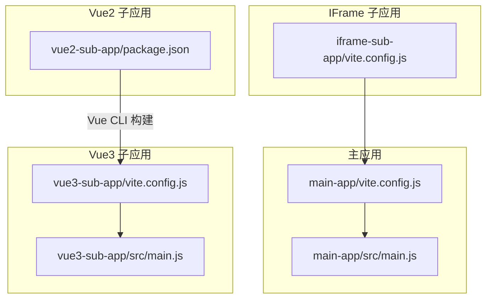
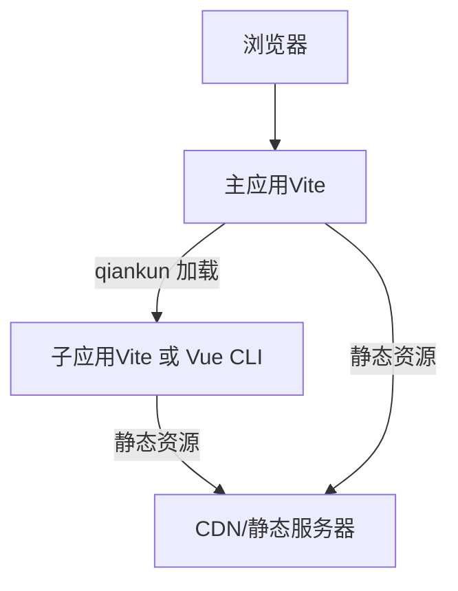
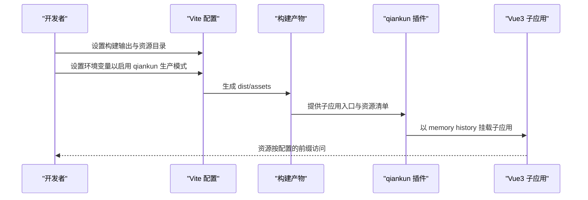
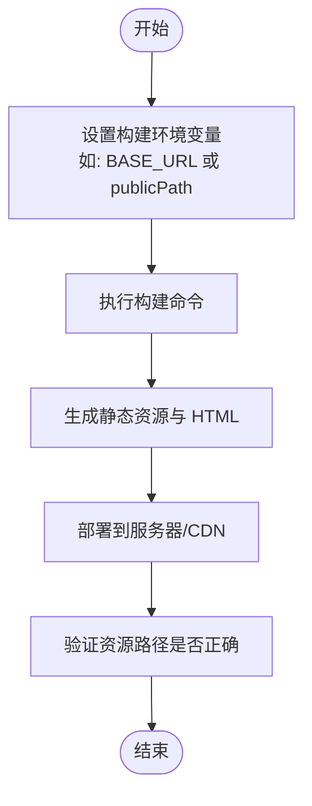
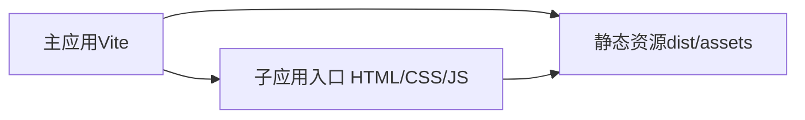
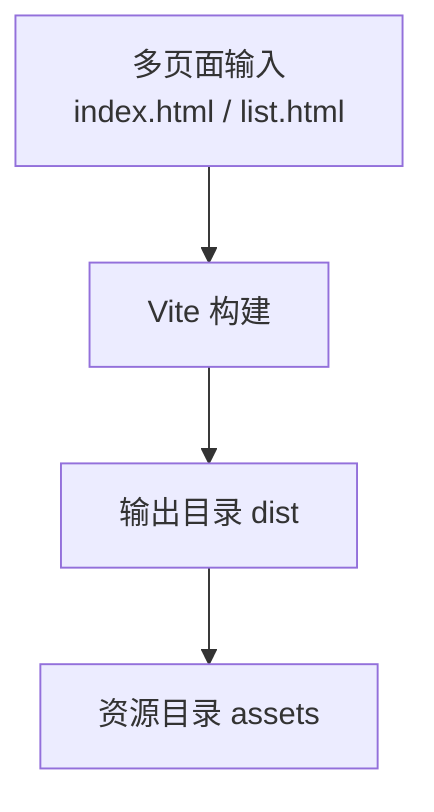
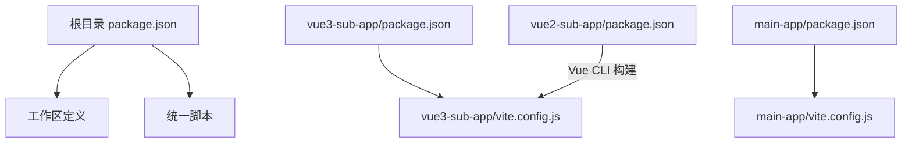

# 静态资源路径配置

<cite>
**本文引用的文件**
- [README.md](file://README.md)
- [package.json](file://package.json)
- [packages/vue3-sub-app/package.json](file://packages/vue3-sub-app/package.json)
- [packages/vue3-sub-app/vite.config.js](file://packages/vue3-sub-app/vite.config.js)
- [packages/vue3-sub-app/src/main.js](file://packages/vue3-sub-app/src/main.js)
- [packages/main-app/package.json](file://packages/main-app/package.json)
- [packages/main-app/vite.config.js](file://packages/main-app/vite.config.js)
- [packages/main-app/src/main.js](file://packages/main-app/src/main.js)
- [packages/vue2-sub-app/package.json](file://packages/vue2-sub-app/package.json)
- [packages/iframe-sub-app/vite.config.js](file://packages/iframe-sub-app/vite.config.js)
</cite>

## 目录
1. [简介](#简介)
2. [项目结构](#项目结构)
3. [核心组件](#核心组件)
4. [架构总览](#架构总览)
5. [详细组件分析](#详细组件分析)
6. [依赖关系分析](#依赖关系分析)
7. [性能考虑](#性能考虑)
8. [故障排查指南](#故障排查指南)
9. [结论](#结论)
10. [附录](#附录)

## 简介
本文件聚焦于子应用在生产环境中的静态资源路径配置，覆盖以下主题：
- 不同框架（Vue3 与 Vue2）的配置差异与实现要点
- Vite 与 Webpack（Vue CLI）配置示例与公共路径设置思路
- 根据环境变量动态设置公共路径的方法
- CDN 部署时的路径配置策略与最佳实践
- 常见路径配置错误及排查方法

本仓库以 Vite 为主要构建工具，Vue3 子应用采用 Vite + vite-plugin-qiankun；Vue2 子应用采用 Vue CLI（基于 Webpack）。本文将结合现有配置文件，给出可落地的生产部署路径配置方案。

## 项目结构
该仓库采用 Monorepo 结构，使用 Lerna + npm workspaces 管理多包。与静态资源路径相关的关键目录与文件如下：
- packages/main-app：主应用，使用 Vite 构建
- packages/vue3-sub-app：Vue3 子应用，使用 Vite 构建并集成 qiankun
- packages/vue2-sub-app：Vue2 子应用，使用 Vue CLI（Webpack）
- packages/iframe-sub-app：iframe 子应用，使用 Vite 构建多页面

图表来源
- [packages/main-app/vite.config.js](file://packages/main-app/vite.config.js#L1-L40)
- [packages/main-app/src/main.js](file://packages/main-app/src/main.js#L1-L40)
- [packages/vue3-sub-app/vite.config.js](file://packages/vue3-sub-app/vite.config.js#L1-L41)
- [packages/vue3-sub-app/src/main.js](file://packages/vue3-sub-app/src/main.js#L1-L115)
- [packages/vue2-sub-app/package.json](file://packages/vue2-sub-app/package.json#L1-L31)
- [packages/iframe-sub-app/vite.config.js](file://packages/iframe-sub-app/vite.config.js#L1-L23)

章节来源
- [README.md](file://README.md#L62-L76)
- [package.json](file://package.json#L1-L50)

## 核心组件
- Vite 配置（Vue3 子应用与主应用）
  - 通过 Vite 的构建输出目录与资源目录配置，控制静态资源的存放位置与访问前缀
  - Vue3 子应用通过 qiankun 插件在开发与生产模式下切换行为
- Vue CLI（Webpack）配置（Vue2 子应用）
  - 通过 Vue CLI 的构建产物与 publicPath 设置，影响静态资源路径
- qiankun 生命周期与路由历史模式
  - Vue3 子应用在 qiankun 环境下使用 memory history，独立运行时使用 web history，影响路由与资源解析

章节来源
- [packages/vue3-sub-app/vite.config.js](file://packages/vue3-sub-app/vite.config.js#L1-L41)
- [packages/vue3-sub-app/src/main.js](file://packages/vue3-sub-app/src/main.js#L18-L66)
- [packages/main-app/vite.config.js](file://packages/main-app/vite.config.js#L1-L40)
- [packages/vue2-sub-app/package.json](file://packages/vue2-sub-app/package.json#L1-L31)

## 架构总览
下图展示了主应用与子应用在生产环境中的静态资源路径关系，以及 qiankun 加载子应用时对资源路径的影响。

图表来源
- [packages/main-app/vite.config.js](file://packages/main-app/vite.config.js#L1-L40)
- [packages/vue3-sub-app/vite.config.js](file://packages/vue3-sub-app/vite.config.js#L1-L41)
- [packages/vue3-sub-app/src/main.js](file://packages/vue3-sub-app/src/main.js#L71-L105)
- [packages/vue2-sub-app/package.json](file://packages/vue2-sub-app/package.json#L1-L31)

## 详细组件分析

### Vue3 子应用（Vite + qiankun）
- 构建输出与资源目录
  - 输出目录与资源目录由 Vite 配置决定，影响静态资源的物理存储与 URL 前缀
- 开发与生产模式切换
  - 通过环境变量控制 qiankun 插件的开发模式行为，避免在生产环境中误用开发特性
- 路由历史模式
  - 在 qiankun 环境下使用 memory history，独立运行时使用 web history，影响资源解析与路由匹配

图表来源
- [packages/vue3-sub-app/vite.config.js](file://packages/vue3-sub-app/vite.config.js#L9-L39)
- [packages/vue3-sub-app/src/main.js](file://packages/vue3-sub-app/src/main.js#L71-L105)

章节来源
- [packages/vue3-sub-app/vite.config.js](file://packages/vue3-sub-app/vite.config.js#L1-L41)
- [packages/vue3-sub-app/src/main.js](file://packages/vue3-sub-app/src/main.js#L18-L66)

### Vue2 子应用（Vue CLI/ Webpack）
- 构建工具链
  - 使用 Vue CLI 进行开发与构建，底层基于 Webpack
- publicPath 与静态资源
  - 在生产环境中，publicPath 决定静态资源的绝对或相对路径前缀
  - 若子应用部署在子路径（如 /vue2/），需要在构建时设置正确的 publicPath

图表来源
- [packages/vue2-sub-app/package.json](file://packages/vue2-sub-app/package.json#L6-L10)

章节来源
- [packages/vue2-sub-app/package.json](file://packages/vue2-sub-app/package.json#L1-L31)

### 主应用（Vite）
- 构建输出与资源目录
  - 主应用同样使用 Vite 构建，静态资源目录与输出目录的配置影响整体站点的资源前缀
- 与子应用协作
  - 主应用负责加载子应用，子应用的资源路径需与主应用的部署路径保持一致

图表来源
- [packages/main-app/vite.config.js](file://packages/main-app/vite.config.js#L26-L38)

章节来源
- [packages/main-app/vite.config.js](file://packages/main-app/vite.config.js#L1-L40)
- [packages/main-app/src/main.js](file://packages/main-app/src/main.js#L1-L40)

### IFrame 子应用（Vite 多页面）
- 多页面构建
  - 通过 Vite 的多入口配置，分别构建多个 HTML 页面
- 资源路径
  - 每个页面的静态资源路径遵循相同的输出与资源目录规则

图表来源
- [packages/iframe-sub-app/vite.config.js](file://packages/iframe-sub-app/vite.config.js#L13-L21)

章节来源
- [packages/iframe-sub-app/vite.config.js](file://packages/iframe-sub-app/vite.config.js#L1-L23)

## 依赖关系分析
- 包管理与工作区
  - 顶层 package.json 定义了工作区与脚本，便于统一管理各子包的开发与构建
- 子应用与 qiankun
  - Vue3 子应用通过 vite-plugin-qiankun 插件在开发与生产模式下切换行为，影响资源路径与挂载逻辑

图表来源
- [package.json](file://package.json#L6-L26)
- [packages/vue3-sub-app/package.json](file://packages/vue3-sub-app/package.json#L1-L23)
- [packages/vue3-sub-app/vite.config.js](file://packages/vue3-sub-app/vite.config.js#L1-L41)
- [packages/vue2-sub-app/package.json](file://packages/vue2-sub-app/package.json#L1-L31)
- [packages/main-app/package.json](file://packages/main-app/package.json#L1-L31)
- [packages/main-app/vite.config.js](file://packages/main-app/vite.config.js#L1-L40)

章节来源
- [package.json](file://package.json#L1-L50)
- [packages/vue3-sub-app/package.json](file://packages/vue3-sub-app/package.json#L1-L23)
- [packages/vue2-sub-app/package.json](file://packages/vue2-sub-app/package.json#L1-L31)
- [packages/main-app/package.json](file://packages/main-app/package.json#L1-L31)

## 性能考虑
- 资源分包与缓存
  - 主应用通过 Rollup 手动分包，减少重复依赖，提升缓存命中率
- 构建优化
  - 关闭 Source Map（主应用）可减少额外体积
- 资源前缀一致性
  - 保证主应用与子应用的静态资源前缀一致，避免跨域与路径解析问题

章节来源
- [packages/main-app/vite.config.js](file://packages/main-app/vite.config.js#L26-L38)

## 故障排查指南
- 资源 404 或路径错误
  - 检查子应用的构建输出目录与资源目录配置，确认生产环境下的资源前缀
  - 对于 Vue3 子应用，确认 qiankun 插件在生产模式下的行为
  - 对于 Vue2 子应用，检查 publicPath 设置是否与部署路径一致
- 路由与资源解析不一致
  - Vue3 子应用在 qiankun 环境下使用 memory history，独立运行时使用 web history，注意路由前缀与资源前缀的一致性
- CDN 部署后样式或图片失效
  - 确认 CDN 上的静态资源路径与构建输出一致，并检查缓存策略
- 跨域与 CORS
  - 主应用与子应用在开发环境下启用了 CORS 头，生产环境需确保服务器正确配置

章节来源
- [packages/vue3-sub-app/src/main.js](file://packages/vue3-sub-app/src/main.js#L30-L66)
- [packages/vue3-sub-app/vite.config.js](file://packages/vue3-sub-app/vite.config.js#L33-L39)
- [packages/main-app/vite.config.js](file://packages/main-app/vite.config.js#L12-L18)

## 结论
- 在生产环境中，静态资源路径的正确配置依赖于构建工具的输出目录、资源目录与公共路径设置
- Vue3 子应用通过 qiankun 插件在开发与生产模式下切换行为，需确保生产模式下的资源前缀与部署路径一致
- Vue2 子应用通过 Vue CLI 的 publicPath 控制资源前缀，需在构建时显式设置
- CDN 部署时，建议统一前缀、开启缓存并验证资源可达性
- 出现路径错误时，优先检查构建配置与部署路径的一致性，并结合路由历史模式进行定位

## 附录
- 环境变量与公共路径设置建议
  - Vite：通过构建配置的输出目录与资源目录控制前缀；必要时可在构建脚本中注入环境变量以动态调整
  - Vue CLI：通过 publicPath 或构建时环境变量设置前缀
  - qiankun：在生产模式下确保插件行为与资源前缀一致，避免开发模式配置泄漏到生产

章节来源
- [packages/vue3-sub-app/vite.config.js](file://packages/vue3-sub-app/vite.config.js#L6-L24)
- [packages/vue3-sub-app/src/main.js](file://packages/vue3-sub-app/src/main.js#L71-L105)
- [packages/vue2-sub-app/package.json](file://packages/vue2-sub-app/package.json#L6-L10)